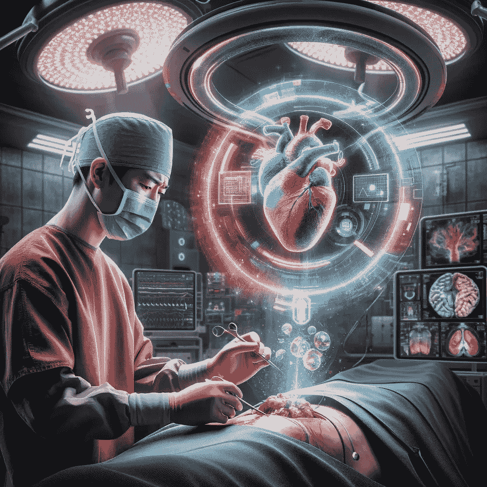

# 一位外科医生对人工智能的思考

> 原文：[`towardsdatascience.com/a-surgeons-reflections-on-artificial-intelligence-c070bb633e9f?source=collection_archive---------2-----------------------#2024-01-02`](https://towardsdatascience.com/a-surgeons-reflections-on-artificial-intelligence-c070bb633e9f?source=collection_archive---------2-----------------------#2024-01-02)

## 从临床角度看医学创新

 [Alberto Paderno](https://medium.com/@albpaderno?source=post_page---byline--c070bb633e9f--------------------------------)

·发表于[Towards Data Science](https://towardsdatascience.com/?source=post_page---byline--c070bb633e9f--------------------------------) ·阅读时长 4 分钟·2024 年 1 月 2 日

--

由 Dall-E 3 生成的图像

作为一名肿瘤外科医生，这是我的主要工作和热情所在。它让我能够与人互动，深入医疗体系，而非奢华的企业医疗，只是日常的医学实践。

作为 AI 领域的研究人员，我注意到实际临床实践与 AI 研究人员和公司普遍目标之间的脱节日益严重。这当然只是个人观点，并非对当前研发过程的批评，但这反映了我在两个领域的经验。

人工智能在客户软件和工业领域的颠覆性潜力如今已经显而易见。然而，我们必须承认，AI 在医疗领域是完全不同的一种存在；其复杂性、监管要求和风险远高于大多数其他应用。此外，由于隐私和可访问性限制，公开可用的数据集在这一领域比许多其他领域稀缺得多。

> *所以，存在重大障碍，且复杂性更高。*

我目前在硅谷担任外科医生，具有 AI 技术背景，这让我能够直接接触到这个充满活力的“生态系统”。AI 相关的会议和研讨会几乎每天都有。然而，我不禁注意到一些事实：

+   临床医生没有参与 AI 相关的活动。

+   临床医生甚至没有参与“医疗领域的 AI”相关活动。

+   AI 在医疗领域的研究由技术驱动，临床医生的反馈和合作极为有限。

+   即使是在临床医生中，关于数据共享和技术开发的合作也明显不足。

# **技术引导的方法**

首先，对新技术的热情促使我们尝试将它们应用于每一个问题：*“如果你只有一把锤子，你就会把所有问题都看作钉子，”* 亚伯拉罕·马斯洛如是说。我完全理解这种倾向。AI 是我们的新雷神之锤；为什么我们不想尝试一下它是否适用于任何稍微合适的问题呢？

然而，这也将研究和进展引导到解决“技术难题”上，而没有回答一个根本问题。一方面，我们可以找到这种概念的有趣表现形式，例如[“她说过这话”笑话识别器](https://people.cs.umass.edu/~brun/pubs/pubs/Kiddon11.pdf)（这是一个有趣的解决方案，我并不批评）；另一方面，也有一些例子，其中强制实施复杂的深度学习流程是[昂贵且不必要的](https://thedailywtf.com/articles/No%2c_We_Need_a_Neural_Network)。

其次，典型的“自上而下”战略基于市场分析和市场份额计算。简而言之，“*让我们在医疗健康领域找到一个大而有利可图的领域，然后把它塞满 AI 技术*。”一如既往，这可能是一个很好的短期策略，但过一段时间后，魔力就会消失。

这些方法在医疗领域很少有效。当新解决方案的优势不明显时，医生和外科医生通常会回归传统做法。普朗克原理可以安全地应用于医学创新，“*科学的进步总是伴随着一场葬礼*。”因此，虽然在规模化应用时，运营效率提高 5%-10%看似重要，但在医疗环境中却很难得到应用——我们需要的是在与日常临床实践相关的领域实现 2 倍到 10 倍的改进。

# **从“实验室”到病床**

一个实际的方法是识别一个真正的问题，评估当前解决方案的有效性，并评估 AI 是否能用于开发更好的解决方案——*典型的妈妈测试*。

 [## 如何与客户沟通并了解你的业务是否是一个好主意，尤其是当每个人都在对你撒谎时。

### 世界不需要另一个框架或理论。《妈妈测试》跳过了这一切，直接进入实际挑战…

www.momtestbook.com](https://www.momtestbook.com/?source=post_page-----c070bb633e9f--------------------------------)

目前，人工智能在医疗健康领域的主要发展大多来自科技研究团体和科技公司。这种关系解释了为什么关注点更多偏向计算机科学而非医疗健康方面。

为了解决这个问题，临床医生和外科医生的直接参与至关重要。

需求显而易见。医学依然是一个高度有缺陷且主观的领域；称其为“艺术”就像是在看半满的杯子，却没有意识到其中缺少了什么。例如：

+   外科医生的经验和判断仍然是决定生存结果和并发症的最重要因素之一。

+   高度主观的内窥镜评估是整个医学领域的基石（例如，喉镜检查、胃肠内窥镜检查、支气管镜检查）。

+   即使是组织病理学，通常被视为金标准，也可能因其解读的高度可变性而受到影响。

这些是需要改进的重大医学领域，只有通过改进，才能在患者护理方面看到实际的进展。

然而，第一步将挑战通常将科学领域分割成半隔离单元的范式。分子生物学在医学领域的成功整合为先例，表明医学与计算机科学的协同结合也有类似的潜力。这个跨学科的方法对于推动患者护理中的现实发展至关重要。

总结来说，我们需要一类新型医生，他们具备理解和有效运用人工智能的技能。这可能需要重构我们当前的医学培训体系。
