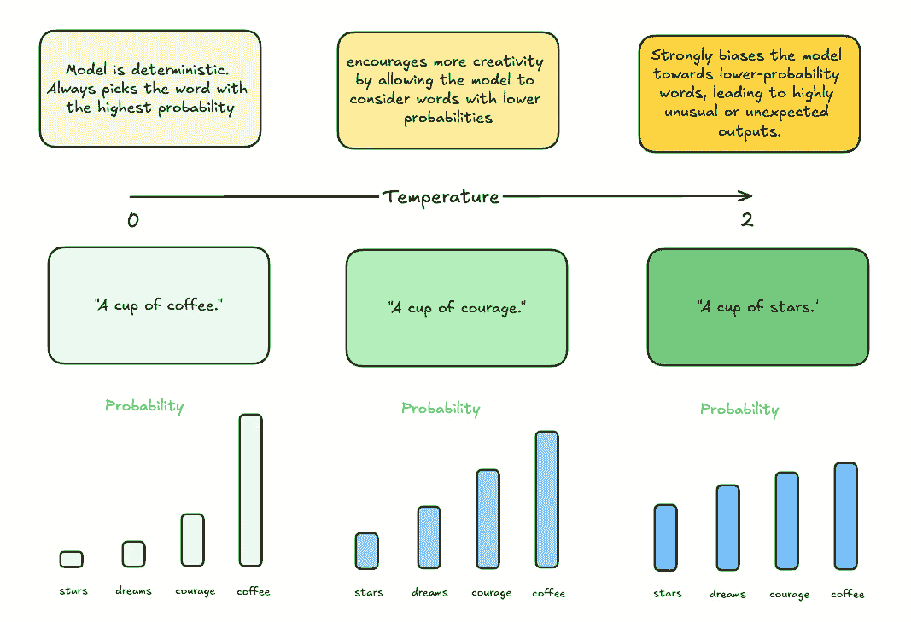
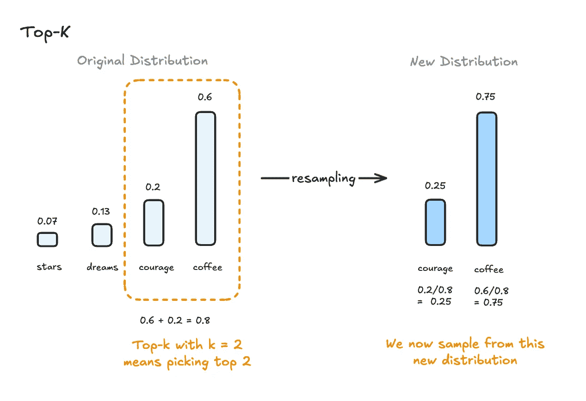
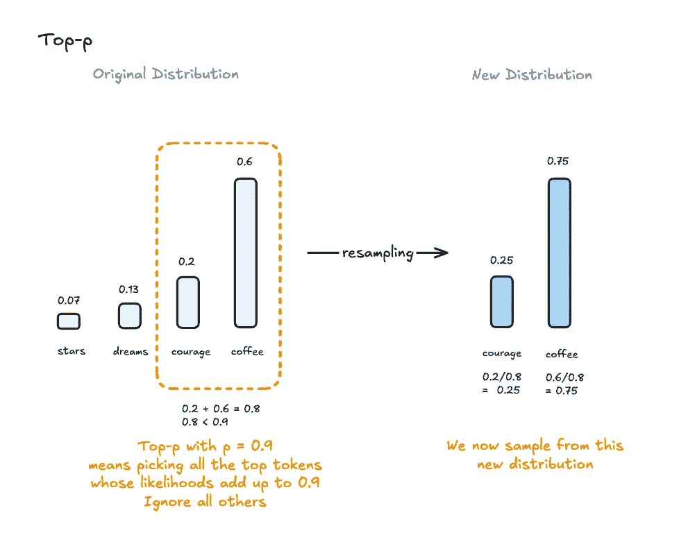
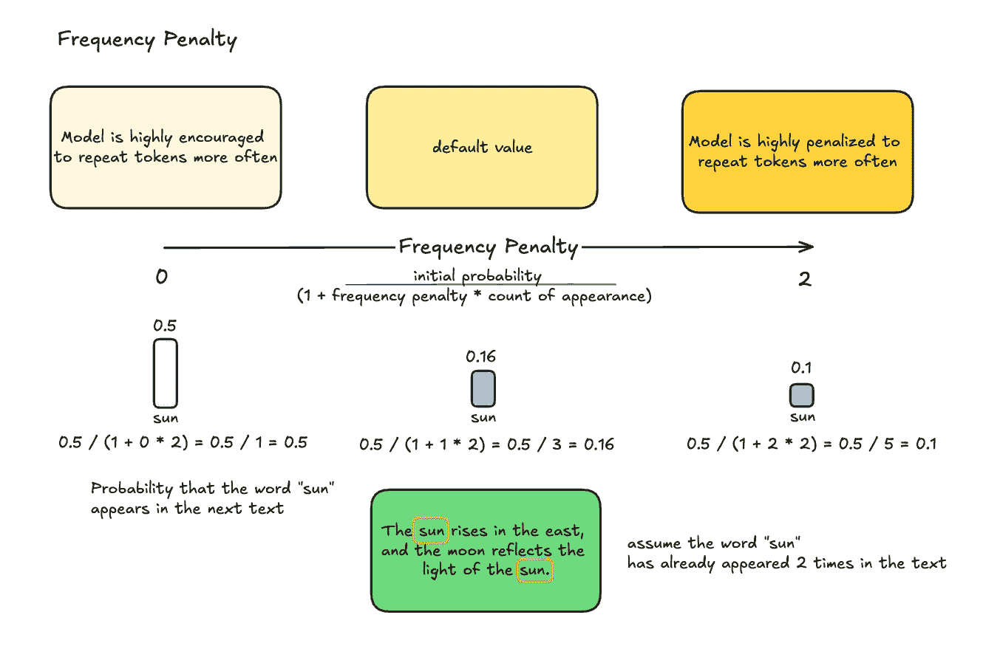
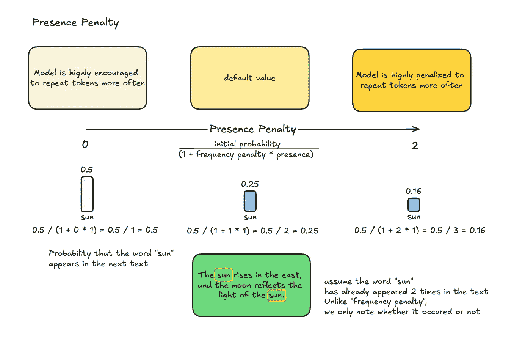

# LLM 超参数的视觉解释

> 原文：[`towardsdatascience.com/a-visual-explanation-of-llm-hyperparameters-daf61d3b006e?source=collection_archive---------3-----------------------#2024-08-29`](https://towardsdatascience.com/a-visual-explanation-of-llm-hyperparameters-daf61d3b006e?source=collection_archive---------3-----------------------#2024-08-29)

## 彻底理解温度、Top-k、Top-p、频率和存在惩罚。

 [Jenn J.](https://medium.com/@jenn-j-dev?source=post_page---byline--daf61d3b006e--------------------------------)

·发布于 [Towards Data Science](https://towardsdatascience.com/?source=post_page---byline--daf61d3b006e--------------------------------) ·阅读时间 7 分钟 ·2024 年 8 月 29 日

--

理解温度、Top-k、Top-p、频率和存在惩罚可能会有点挑战，尤其是在你刚开始接触 LLM 超参数的时候。“Top-k”和“存在惩罚”之类的术语一开始可能会让人感到有些不知所措。

当你查找“Top-k”时，你可能会看到类似这样的定义：“Top-k 采样将模型选择下一个单词的范围限制为仅选择前 k 个最有可能的选项，基于它们的预测概率。”这听起来很多！但当你在进行提示工程时，这究竟如何帮助你呢？

如果你像我一样，最喜欢通过视觉学习，那么让我们一起拆解这些内容，彻底理解这些概念，让它们变得容易理解。

# LLMs 的内部工作原理

在我们深入探讨 LLM 超参数之前，让我们做一个简单的思维实验。试想听到“一个杯子……”这个短语。大多数人会期望下一个单词是“咖啡”（如果你是茶爱好者，可能是“茶”！）你可能不会立刻想到“星星”或“勇气”。

这里发生的事情是，我们本能地*预测*接下来的单词是最可能的那个，显然，“咖啡”比“星星”更有可能。

这类似于 LLMs（大语言模型）的工作方式——它们计算可能的下一个单词的概率，并根据这些概率选择一个单词。

从高层次来看，超参数是调整*我们如何选择下一个可能单词*的方式。

让我们从最常见的超参数开始：

# 温度

温度控制模型输出的随机性。较低的温度使输出更加确定性，偏向选择更有可能的单词，而较高的温度则允许通过考虑不太可能的单词来产生更多的创造性。

在我们的“杯中的…”示例中，将温度设置为 0 会使模型倾向于选择最可能的单词，即“咖啡”。

图片由作者提供。

随着温度的升高，不同单词之间的采样概率开始趋于平衡，促使模型生成高度不寻常或意外的输出。

注意，将温度设置为 0 并不能使模型完全确定性，尽管它非常接近。

**使用场景**

+   低温度（例如，0.2）：适用于需要精确和可预测结果的任务，例如技术写作或正式文档编写。

+   高温度（例如，0.8 或以上）：适用于创意任务，如讲故事、诗歌创作或头脑风暴。

# 最大令牌数

最大令牌数定义了模型在响应中可以生成的最大令牌数（令牌可以是单词或单词的一部分）。令牌是模型处理的最小文本单位。

**令牌与单词之间的关系：**

+   1 个单词 = 1~2 个令牌：在英语中，典型的单词通常会被拆分为 1 到 2 个令牌。例如，“cat”这样的简单单词可能是一个令牌，而“unbelievable”这样的复杂单词可能会被拆分成多个令牌。

+   一般经验法则：通过将令牌数除以 1.5（大致平均值），可以粗略估计单词数。

**使用场景**

+   低最大令牌数（例如，50）：适用于需要简短响应的任务，例如标题、简短总结或简洁的回答。（注意，模型可能会截断输出响应）

+   高最大令牌数（例如，500）：适用于生成较长的内容，如文章、故事或详细解释。

# Top-k

Top-k 采样限制模型从最可能的*k*个下一个单词中进行选择。通过缩小选择范围，它有助于减少生成无关或无意义输出的几率。

在下图中，如果我们将*k*设置为 2，模型只会考虑两个最可能的下一个单词——在这种情况下，“咖啡”和“勇气”。然后，这两个单词会被重新抽样，调整它们的概率使其总和为 1，从而确保选择其中一个。

图片由作者提供。

**使用场景：**

+   低 k（例如，k=10）：最适合结构化任务，在这些任务中你希望保持焦点和连贯性，例如总结或编码。

+   高 k（例如，k=50）：适用于创造性或探索性任务，在这些任务中你希望引入更多变化而不失去连贯性。

# Top-p

Top-p 采样选择那些其联合概率超过阈值*p*（例如，0.9）的最小单词集，从而允许根据上下文进行更敏感的词语选择。

在下面的图表中，我们从最可能的单词“coffee”开始，它的概率是 0.6。由于这个概率低于我们的阈值*p* = 0.9，我们加入下一个单词“courage”，它的概率是 0.2。加起来，这两个词的总概率是 0.8，仍然低于 0.9。最后，我们考虑单词“dreams”，它的概率是 0.13，总概率达到 0.93，超过了 0.9。此时，我们停止选择，选择了前两个最可能的单词。

图片由作者提供。

**用例：**

+   低 p 值（例如，p=0.5）：适用于需要简洁且直截了当的输出的任务，如新闻标题或说明性文本。

+   高 p 值（例如，p=0.95）：适用于更开放的任务，如对话生成或创意内容生成，这类任务需要更多样化的回应。

# 频率惩罚

频率惩罚减少了模型在文本中重复相同单词的可能性，促进了多样性并减少了输出中的冗余。通过应用此惩罚，模型被鼓励使用新单词，而不是重复已经出现过的单词。

频率惩罚是通过以下公式计算的：

**调整后的概率 = 初始概率 / (1 + 频率惩罚 * 出现次数)**

例如，假设“sun”这个词的概率为 0.5，并且它在文本中已经出现了两次。如果我们将频率惩罚设置为 1，那么“sun”的调整概率将是：

调整后的概率 = 0.5 / (1 + 1 * 2) = 0.5 / 3 = 0.16

图片由作者提供。

**用例：**

+   高惩罚（例如，1.0）：适合生成内容时，重复会分散注意力或不受欢迎的情况，例如写作论文或研究报告。

+   低惩罚（例如，0.0）：当重复可能是必要或有益的情况时有用，例如在诗歌、咒语或某些营销口号中。

# 存在惩罚

存在惩罚与频率惩罚类似，但有一个关键区别：它惩罚模型重复使用任何已经出现的单词或短语，*不管它出现了多少次*。

换句话说，重复 2 次单词和重复 20 次单词的后果是一样的。

调整概率的公式为：

**调整后的概率 = 初始概率 / (1 + 存在惩罚 * 存在次数)**

让我们回顾之前使用“sun”这个词的例子。我们不是将惩罚乘以“sun”出现的频率，而是简单地检查它是否已经出现过——在这种情况下，它已经出现过，因此我们将其计为 1。

如果我们将存在惩罚设置为 1，那么调整后的概率将是：

调整后的概率 = 0.5 / (1 + 1 * 1) = 0.5 / 2 = 0.25

这种减少使得模型不太可能再次选择“sun”，即使“sun”只在文本中出现过一次，也会鼓励使用新的单词或短语。

图片由作者提供。

**使用场景：**

+   高惩罚（例如，1.0）：非常适合探索性或头脑风暴会议，在这些会议中，你希望模型不断引入新思想或新话题。

+   低惩罚（例如，0.0）：适用于强调关键术语或思想的重要任务，如技术文档或教学材料。

# 频率惩罚和出现惩罚通常是一起使用的

现在我们已经了解了基础知识，接下来让我们深入探讨频率和出现惩罚是如何一起使用的。不过提前提醒一下——它们是强大的工具，但重要的是要小心使用，以获得最佳效果。

**何时使用它们：**

+   内容生成

+   防止冗余

**何时不使用它们**

+   技术写作：在技术文档或特定指令中，如果一致的术语至关重要，使用这些惩罚可能适得其反。

+   品牌信息传递：如果你正在生成的内容高度依赖于特定品牌的语气或关键词，减少重复可能会削弱品牌的声音。

到现在为止，你应该对温度、Top-k、Top-p、频率和出现惩罚是如何协同作用，塑造语言模型的输出有了更清晰的理解。如果你仍然觉得有点复杂，没关系——这些概念需要一些时间才能完全理解。只要不断实验和探索，你会很快掌握的。

如果你觉得像这样的视觉内容有帮助，并希望看到更多，我们很高兴在我们的[Discord 社区](https://discord.gg/ETGYYsswTb)见到你。这里是一个我们分享想法、互相帮助并一起学习的空间。
