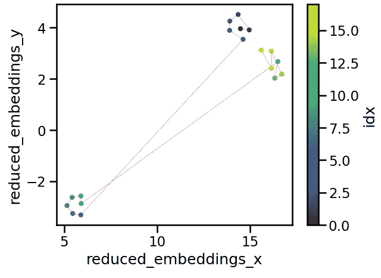

# 语义文本切分的可视化探索

> 原文：[`towardsdatascience.com/a-visual-exploration-of-semantic-text-chunking-6bb46f728e30?source=collection_archive---------1-----------------------#2024-09-19`](https://towardsdatascience.com/a-visual-exploration-of-semantic-text-chunking-6bb46f728e30?source=collection_archive---------1-----------------------#2024-09-19)


Dalle3 对“语义切分”的解读。图像由作者生成。

## 使用嵌入和可视化工具将文本切分为有意义的片段

[](https://medium.com/@rmartinshort?source=post_page---byline--6bb46f728e30--------------------------------)[](https://towardsdatascience.com/?source=post_page---byline--6bb46f728e30--------------------------------) [Robert Martin-Short](https://medium.com/@rmartinshort?source=post_page---byline--6bb46f728e30--------------------------------)

·发布于 [Towards Data Science](https://towardsdatascience.com/?source=post_page---byline--6bb46f728e30--------------------------------) ·阅读时间 18 分钟·2024 年 9 月 19 日

--

***本文解释了语义文本切分（semantic text chunking）这一技术，旨在自动将相似的文本片段分组，可以作为检索增强生成（RAG）或类似应用的预处理阶段的一部分。我们通过可视化来理解切分过程的作用，并探索一些涉及聚类和基于 LLM 的标注的扩展。完整代码请查看*** [***这里***](https://github.com/rmartinshort/text_chunking)***。***

自动化的信息检索和大规模文本摘要有许多有用的应用。最为成熟的应用之一是检索增强生成（RAG），它涉及从大型语料库中提取相关文本片段——通常通过语义搜索或其他筛选步骤——以响应用户提问。然后，文本片段由 LLM 进行解读或摘要，旨在提供高质量、准确的答案。为了使提取的片段尽可能与问题相关，它们具有语义一致性是非常有帮助的，这意味着每个片段都“关于”一个特定概念，并且包含有用的信息包。

Chunking 不仅仅在 RAG 中有应用。想象一下我们有一本复杂的文档，比如书籍或期刊文章，并且希望快速理解它包含的关键概念。如果文本能够被聚类成语义上连贯的组别，然后对每个组别进行某种方式的总结，这可以极大地加快获得洞察的速度。优秀的工具包[BertTopic](https://maartengr.github.io/BERTopic/index.html)（可以参考这篇文章获取一个不错的概述）可以在这里提供帮助。

对切分块的可视化也可以提供有益的洞察，无论是作为最终产品，还是在开发过程中。人类是视觉学习者，我们的大脑在从图表和图像中获取信息时，比从文本流中获取信息要快得多。根据我的经验，要理解一个切分算法对文本做了什么——以及最佳的参数是什么——如果没有某种方式可视化这些块，或者完全读完它们（对于大型文档来说，这是不现实的），是非常困难的。

在这篇文章中，我们将探讨一种方法，将文本切分为语义上有意义的块，重点是使用图形和绘图来理解其发生的过程。在此过程中，我们将涉及降维和嵌入向量的层次聚类，以及使用大语言模型（LLM）对这些块进行总结，以便我们可以快速查看其中包含的信息。我的希望是，这能激发正在研究语义切分的任何人思考，将其作为应用中的潜在工具。我将在这里使用 Python 3.9、LangChain 和 Seaborn，具体细节可以参见[代码仓库](https://github.com/rmartinshort/text_chunking)。

## **1\. 什么是语义切分（semantic chunking）？**

有几种标准的切分类型，如果你想了解更多，我推荐[这篇优秀的教程](https://github.com/FullStackRetrieval-com/RetrievalTutorials/blob/main/tutorials/LevelsOfTextSplitting/5_Levels_Of_Text_Splitting.ipynb)，它也是这篇文章的灵感来源。假设我们处理的是英文文本，最简单的切分方式是基于字符的切分，我们选择一个固定长度的字符窗口，然后将文本分成该长度的块。我们还可以选择在块之间添加重叠，以保留它们之间的顺序关系。这种方法计算上比较简单，但无法保证这些块是语义上有意义的，甚至不一定是完整的句子。

递归切分通常更有用，被视为许多应用的首选算法。该过程接受一系列分隔符（LangChain 中的默认值是 `[“\n\n”, “\n”, “ ”, “”]`）和一个目标长度。然后，它通过递归的方式使用分隔符拆分文本，逐步遍历分隔符列表，直到每个文本块的长度小于或等于目标长度。这种方法在保留完整段落和句子方面更为有效，这一点非常重要，因为它使得文本块更有可能保持连贯性。然而，它并不考虑语义：如果一个句子是紧接在上一个句子后面的，并恰好位于文本块的末尾，这些句子就会被分开。

在语义切分中，实施方法包括 [LangChain](https://python.langchain.com/v0.2/docs/how_to/semantic-chunker/) 和 [LlamaIndex](https://docs.llamaindex.ai/en/stable/api_reference/node_parsers/semantic_splitter/#llama_index.core.node_parser.SemanticSplitterNodeParser)，切分是基于顺序块的嵌入之间的余弦距离来进行的。因此，我们首先将文本划分为小的但连贯的组，可能会使用递归切分器。

接下来，我们使用一个已训练好的模型将每个文本块向量化，该模型能够生成有意义的嵌入。通常，这种方法采用基于 Transformer 的双编码器（有关详细信息和示例，请参见 [SentenceTransformers](https://sbert.net/) 库），或者是像 [OpenAI 的终端点](https://platform.openai.com/docs/guides/embeddings) `[text-embeddings-3-small](https://platform.openai.com/docs/guides/embeddings)`，这就是我们在这里使用的模型。最后，我们查看后续文本块嵌入之间的余弦距离，并选择那些距离较大的断点。理想情况下，这有助于创建既连贯又在语义上有区别的文本组。

最近的一个扩展方法叫做 [语义双重块合并](https://docs.llamaindex.ai/en/stable/examples/node_parsers/semantic_double_merging_chunking/)（有关详细信息，请参见 [这篇文章](https://bitpeak.pl/chunking-methods-in-rag-methods-comparison/)），尝试通过第二次处理并使用某些重组逻辑来扩展这一方法。例如，如果第一次处理在块 1 和块 2 之间设置了断点，但块 1 和块 3 非常相似，它将创建一个新组，包含块 1、块 2 和块 3。如果块 2 例如是一个数学公式或代码块，这种方法会非常有用。

然而，在任何类型的语义切分中，仍然存在一些关键问题：在我们设置断点之前，文本块嵌入之间的距离能有多大？这些文本块实际上代表了什么？我们关心这些问题吗？这些问题的答案取决于具体应用和文本内容。

# **2. 探索断点**

让我们用一个例子来说明如何使用语义分块生成断点。我们将实现我们自己的版本的这个算法，尽管如上所述，也有现成的实现可用。我们的演示文本[在这里](https://github.com/rmartinshort/text_chunking/blob/main/text_chunking/datasets/test_text_dataset.py)，它由 GPT-4o 编写的三篇简短的事实性文章组成，并拼接在一起。第一篇是关于保护树木一般重要性的，第二篇是关于纳米比亚的历史，第三篇则更深入探讨了为医疗目的保护树木的重要性。主题选择其实并不重要，但这个语料库代表了一个有趣的测试，因为第一篇和第三篇文章有些相似，但它们被第二篇截然不同的文章所分隔。每篇文章也被分成了聚焦于不同主题的几个部分。

我们可以使用一个基本的`RecursiveCharacterTextSplitter`来进行初始拆分。这里最重要的参数是块大小和分隔符列表，我们通常在没有一定的文本学科知识的情况下无法知道它们应该是什么。这里我选择了一个相对较小的块大小，因为我希望初始文本块最多只有几句话长。我还选择了合适的分隔符，以避免拆分句子。

```py
# tools from the text chunking package mentioned in this article
from text_chunking.SemanticClusterVisualizer import SemanticClusterVisualizer
# put your open ai api key in a .env file in the top level of the package
from text_chunking.utils.secrets import load_secrets
# the example text we're talking about 
from text_chunking.datasets.test_text_dataset import TestText

# basic splitter
from langchain_text_splitters import RecursiveCharacterTextSplitter
import seaborn as sns
```

```py
splitter = RecursiveCharacterTextSplitter(
        chunk_size=250,
        chunk_overlap=0,
        separators=["\n\n", "\n", "."],
        is_separator_regex=False
)
```

接下来我们可以对文本进行拆分。如果任何由分块器生成的文本块小于`min_chunk_len`参数指定的值，参数将生效。在这种情况下，该文本块将被附加到前一个文本块的末尾。

```py
original_split_texts = semantic_chunker.split_documents(
    splitter, 
    TestText.testing_text, 
    min_chunk_len=100, 
    verbose=True
)

### Output
# 2024-09-14 16:17:55,014 - Splitting text with original splitter
# 2024-09-14 16:17:55,014 - Creating 53 chunks
# Mean len: 178.88679245283018
# Max len: 245
# Min len: 103
```

现在我们可以使用嵌入模型来嵌入这些拆分。在`[SemanticClusterVisualizer](https://github.com/rmartinshort/text_chunking/blob/main/text_chunking/SemanticClusterVisualizer.py)`类中，你会看到默认情况下我们使用的是`text-embeddings-3-small`。这将创建一个包含 53 个向量的列表，每个向量的长度为 1536。直观地说，这意味着每个文本块的语义意义在 1536 维空间中得到表示。对于可视化来说这并不理想，这也是为什么我们稍后会采用降维技术的原因。

```py
original_split_text_embeddings = semantic_chunker.embed_original_document_splits(original_split_texts) 
```

运行语义分块器会生成类似这样的图表。我们可以将其视为一个时间序列，其中 x 轴表示整个文本的字符距离，y 轴表示后续文本块之间嵌入向量的余弦距离。断点出现在高于第 95 百分位的距离值处。


图表显示了由`RecursiveCharacterTextSplitter`生成的后续文本块之间的余弦距离。我们可以使用这些距离来建立语义分块的断点。图像由作者生成。

考虑到我们对文本的了解，这个模式是有道理的——有三个大主题，每个主题都有几个不同的部分。除了两个大的峰值之外，其他的断点在哪里并不明确。

这就是主观性和迭代性的体现——根据我们的应用，我们可能需要更大或更小的语块，使用图表帮助我们引导眼睛，选择哪些语块需要被阅读。

有几种方法可以将文本拆分成更细粒度的语块。第一种方法是降低百分位数阈值以生成断点。


通过选择较低的百分位数阈值生成的断点。图像由作者生成。

这会创建 4 个非常小的语块和 8 个较大的语块。例如，如果我们看看前四个语块，拆分看起来语义上是合理的，尽管我认为第四个语块有点太长，因为它包含了第一篇文章中大部分的“经济重要性”、“社会重要性”和“结论”部分。


设置百分位数阈值为 0.8 生成的前四个语义语块。图像由作者生成。

除了仅仅改变百分位数阈值外，另一种思路是递归地应用相同的阈值。我们从对整个文本创建断点开始。然后，对于每个新创建的语块，如果该语块超过某个长度阈值，我们就在该语块内部创建断点。这一过程会一直进行，直到所有语块都低于长度阈值。尽管这种方法在某种程度上是主观的，但我认为它更贴近人类的做法，因为人类会首先识别出非常不同的文本组，然后逐步缩小每个组的大小。

它可以通过栈来实现，如下所示。

```py
def get_breakpoints(
    embeddings: List[np.ndarray],
    start: int = 0,
    end: int = None,
    threshold: float = 0.95,
) -> np.ndarray:
    """
    Identifies breakpoints in embeddings based on cosine distance threshold.

    Args:
        embeddings (List[np.ndarray]): A list of embeddings.
        start (int, optional): The starting index for processing. Defaults to 0.
        end (int, optional): The ending index for processing. Defaults to None.
        threshold (float, optional): The percentile threshold for determining significant distance changes. Defaults to 0.95.

    Returns:
        np.ndarray: An array of indices where breakpoints occur.
    """
    if end is not None:
        embeddings_windowed = embeddings[start:end]
    else:
        embeddings_windowed = embeddings[start:]

    len_embeddings = len(embeddings_windowed)
    cdists = np.empty(len_embeddings - 1)

    # get the cosine distances between each chunk and the next one
    for i in range(1, len_embeddings):
        cdists[i - 1] = cosine(embeddings_windowed[i], embeddings_windowed[i - 1])

    # get the breakpoints
    difference_threshold = np.percentile(cdists, 100 * threshold, axis=0)
    difference_exceeding = np.argwhere(cdists >= difference_threshold).ravel()

    return difference_exceeding

def build_chunks_stack(
    self, length_threshold: int = 20000, cosine_distance_percentile_threshold: float = 0.95
) -> np.ndarray:
    """
    Builds a stack of text chunks based on length and cosine distance thresholds.

    Args:
        length_threshold (int, optional): Minimum length for a text chunk to be considered valid. Defaults to 20000.
        cosine_distance_percentile_threshold (float, optional): Cosine distance percentile threshold for determining breakpoints. Defaults to 0.95.

    Returns:
        np.ndarray: An array of indices representing the breakpoints of the chunks.
    """

    # self.split texts are the original split texts 
    # self.split text embeddings are their embeddings 
    S = [(0, len(self.split_texts))]
    all_breakpoints = set()
    while S:
        # get the start and end of this chunk
        id_start, id_end = S.pop()

        # get the breakpoints for this chunk
        updated_breakpoints = self.get_breakpoints(
            self.split_text_embeddings,
            start=id_start,
            end=id_end,
            threshold=cosine_distance_percentile_threshold,
        )
        updated_breakpoints += id_start

        # add the updated breakpoints to the set
        updated_breakpoints = np.concatenate(
            (np.array([id_start - 1]), updated_breakpoints, np.array([id_end]))
        )

        # for each updated breakpoint, add its bounds to the set and
        # to the stack if it is long enough
        for index in updated_breakpoints:
            text_group = self.split_texts[id_start : index + 1]
            if (len(text_group) > 2) and (
                self.get_text_length(text_group) >= length_threshold
            ):
                S.append((id_start, index))
            id_start = index + 1
        all_breakpoints.update(updated_breakpoints)

    # get all the breakpoints except the start and end (which will correspond to the start
    # and end of the text splits)
    return np.array(sorted(all_breakpoints))[1:-1]
```

我们选择的`length_threshold`也是主观的，可以通过图表来指导选择。在这种情况下，1000 的阈值似乎效果不错，它将文章很好地分成了简短且语义上有所不同的语块。


通过对原始语块嵌入的余弦距离时间序列运行递归语义拆分器生成的断点。图像由作者生成。

看着与第一篇文章对应的语块，我们看到它们与 GPT4-o 在撰写文章时创建的不同部分紧密对齐。显然，在这种特定的文章情况下，我们本可以仅仅通过`"\n\n"`进行拆分就完成了，但我们希望采用一种更通用的方法。


通过上述递归断点生成方法生成的前六个语义语块。图像由作者生成。

# **2\. 聚类语义拆分**

现在我们已经生成了一些候选的语义语块，查看它们之间的相似性可能会很有用。这将帮助我们了解它们包含了什么信息。我们将继续嵌入这些语义语块，然后使用 UMAP 将生成的嵌入的维度降至 2D，以便我们能够绘制它们。

UMAP 代表均匀流形近似与投影，是一种强大的通用降维技术，能够捕捉非线性关系。关于它如何工作的详细解释可以在[这里](https://umap-learn.readthedocs.io/en/latest/how_umap_works.html)找到。这里使用它的目的是在 1536 维空间中捕捉嵌入块之间的某些关系，并将其呈现在二维图中。

```py
from umap import UMAP

dimension_reducer = UMAP(
            n_neighbors=5, 
            n_components=2, 
            min_dist=0.0, 
            metric="cosine", 
            random_state=0
)
reduced_embeddings = dimension_reducer.fit_transform(semantic_embeddings)

splits_df = pd.DataFrame(
            {
                "reduced_embeddings_x": reduced_embeddings[:, 0],
                "reduced_embeddings_y": reduced_embeddings[:, 1],
                "idx": np.arange(len(reduced_embeddings[:, 0])),
            }
)

splits_df["chunk_end"] = np.cumsum([len(x) for x in semantic_text_groups])

ax = splits_df.plot.scatter(
            x="reduced_embeddings_x", 
            y="reduced_embeddings_y", 
            c="idx", 
            cmap="viridis"
)

ax.plot(
            reduced_embeddings[:, 0],
            reduced_embeddings[:, 1],
            "r-",
            linewidth=0.5,
            alpha=0.5,
)
```

UMAP 对`n_neighbors`参数非常敏感。通常，`n_neighbors`值越小，算法越注重利用局部结构来学习如何将数据投影到低维空间。将此值设置得太小可能会导致投影无法很好地捕捉数据的宏观结构，通常随着数据点数量的增加，这个值应该增大。

下面是我们数据的投影，它非常有信息量：显然，我们有三个意义相似的聚类，第一个和第三个聚类比任何一个与第二个聚类更相似。上图中的`idx`色条显示了块的编号，而红线则给出了块的顺序。



上一节生成的语义拆分的嵌入在 UMAP 投影中的图示。idx 表示按生成顺序排列的块的索引，这些块是通过遍历文本生成的。图像由作者生成。

自动聚类怎么样？如果我们想将文本块分组为更大的段落或主题，这将非常有帮助。例如，这可以作为一种有用的元数据，在具有混合搜索的 RAG 应用程序中进行过滤。我们还可能能够将文本中相距较远的块（因此在第一节中的标准语义分块方法下不会被分组）但具有相似意义的块进行分组。

有许多聚类方法可以在这里使用。HDBSCAN 是一个可能的选择，它是[BERTopic](https://maartengr.github.io/BERTopic/getting_started/clustering/clustering.html)软件包推荐的默认方法。然而，在这种情况下，层次聚类似乎更有用，因为它可以给我们提供任何出现的群组相对重要性的感知。要运行层次聚类，我们首先使用 UMAP 将数据集的维度降低到更少的组成部分。只要 UMAP 在这里工作得很好，组成部分的确切数量应该不会显著影响生成的聚类。然后，我们使用[scipy 的层次模块](https://docs.scipy.org/doc/scipy/reference/generated/scipy.cluster.hierarchy.linkage.html)来执行聚类，并使用 seaborn 绘制结果。

```py
from scipy.cluster import hierarchy
from scipy.spatial.distance import pdist
from umap import UMAP
import seaborn as sns

# set up the UMAP
dimension_reducer_clustering = UMAP(
            n_neighbors=umap_neighbors,
            n_components=n_components_reduced,
            min_dist=0.0,
            metric="cosine",
            random_state=0
)
reduced_embeddings_clustering = dimension_reducer_clustering.fit_transform(
    semantic_group_embeddings
)

# create the hierarchy
row_linkage = hierarchy.linkage(
    pdist(reduced_embeddings_clustering),
    method="average",
    optimal_ordering=True,
)

# plot the heatmap and dendogram
g = sns.clustermap(
    pd.DataFrame(reduced_embeddings_clustering),
    row_linkage=row_linkage,
    row_cluster=True,
    col_cluster=False,
    annot=True,
    linewidth=0.5,
    annot_kws={"size": 8, "color": "white"},
    cbar_pos=None,
    dendrogram_ratio=0.5
)

g.ax_heatmap.set_yticklabels(
  g.ax_heatmap.get_yticklabels(), rotation=0, size=8
)
```

结果也相当有信息量。在这里，`n_components_reduced`为 4，因此我们将嵌入的维度降到了 4D，从而生成一个具有 4 个特征的矩阵，每一行代表一个语义块。层次聚类已经识别出两个主要组（即树和纳米比亚）、树类中的两个大子组（即医学用途与其他）以及一些可能值得探索的其他组。


生成的语义块的 UMAP 投影的层次聚类。图像由作者生成。

请注意，[BERTopic 使用类似的技术进行主题可视化](https://maartengr.github.io/BERTopic/getting_started/hierarchicaltopics/hierarchicaltopics.html)，可以看作是对这里所展示内容的扩展。

这在我们探索语义块划分中的作用是什么？根据结果，我们可以选择将一些块组合在一起。这再次是一个相当主观的过程，尝试几种不同的分组方式可能很重要。假设我们查看了树状图并决定希望有 8 个独立的组。我们可以相应地切割层次结构，返回与每个组关联的聚类标签并将其绘制出来。

```py
cluster_labels = hierarchy.cut_tree(linkage, n_clusters=n_clusters).ravel()
dimension_reducer = UMAP(
  n_neighbors=umap_neighbors, 
  n_components=2, 
  min_dist=0.0, 
  metric="cosine", 
  random_state=0
)
reduced_embeddings = dimension_reducer.fit_transform(semantic_embeddings)

splits_df = pd.DataFrame(
            {
                "reduced_embeddings_x": reduced_embeddings[:, 0],
                "reduced_embeddings_y": reduced_embeddings[:, 1],
                "cluster_label": cluster_labels,
            }
        )

splits_df["chunk_end"] = np.cumsum(
            [len(x) for x in semantic_text_groups]
        ).reshape(-1, 1)

ax = splits_df.plot.scatter(
            x="reduced_embeddings_x",
            y="reduced_embeddings_y",
            c="cluster_label",
            cmap="rainbow",
        )

ax.plot(
  reduced_embeddings[:, 0],
  reduced_embeddings[:, 1],
  "r-",  
  linewidth=0.5,
  alpha=0.5,
)
```

结果图如下所示。我们有 8 个聚类，它们在二维空间中的分布看起来合理。这再次证明了可视化的重要性：根据文本、应用和利益相关者的不同，适当的组数和分布可能会有所不同，而检查算法所做的唯一方式就是通过绘制这样的图形。


用于给语义块的 UMAP 投影嵌入着色的语义块聚类 ID。图像由作者生成。

# **3\. 聚类标签**

假设在经过上述几个步骤的迭代后，我们已经确定了满意的语义分裂和聚类。那么接下来我们需要问，这些聚类实际上代表了什么？显然，我们可以阅读文本并找出答案，但对于大量语料来说这是不切实际的。相反，我们可以使用大型语言模型（LLM）来帮助。具体来说，我们将把每个聚类相关的文本提供给 GPT-4o-mini，并要求其生成总结。使用 LangChain 来完成这个任务相对简单，下面展示了代码的核心部分。

```py
import langchain
from langchain.prompts import PromptTemplate
from langchain_core.output_parsers.string import StrOutputParser
from langchain.callbacks import get_openai_callback
from dataclasses import dataclass

@dataclass
class ChunkSummaryPrompt:
    system_prompt: str = """
        You are an expert at summarization and information extraction from text. You will be given a chunk of text from a document and your
        task is to summarize what's happening in this chunk using fewer than 10 words. 

        Read through the entire chunk first and think carefully about the main points. Then produce your summary.

        Chunk to summarize: {current_chunk}
    """

    prompt: langchain.prompts.PromptTemplate = PromptTemplate(
        input_variables=["current_chunk"],
        template=system_prompt,
    )

class ChunkSummarizer(object):
    def __init__(self, llm):
        self.prompt = ChunkSummaryPrompt()
        self.llm = llm
        self.chain = self._set_up_chain()

    def _set_up_chain(self):
        return self.prompt.prompt | self.llm | StrOutputParser()

    def run_and_count_tokens(self, input_dict):
        with get_openai_callback() as cb:
            result = self.chain.invoke(input_dict)

        return result, cb

llm_model = "gpt-4o-mini"
llm = ChatOpenAI(model=llm_model, temperature=0, api_key=api_key)
summarizer = ChunkSummarizer(llm)
```

在我们的 8 个聚类上运行该程序，并使用[datamapplot](https://datamapplot.readthedocs.io/en/latest/)绘制结果，得到如下图。


通过运行 GPT-4o-mini 生成的语义聚类标签。图像由作者生成。

可视化这些分组的另一种方式类似于第二部分中展示的图形，我们将字符数的累积值绘制在横轴上，并展示各组之间的边界。回顾一下，我们曾经有 18 个语义块，现在已经将它们进一步分为 8 个聚类。像这样绘制图表显示了文本的语义内容从头到尾的变化，突出了相似内容并不总是相邻的事实，并且为块的相对大小提供了一个直观的指示。


显示按语义聚类进行文本分段以及各聚类名称的图表。图片由作者生成。

用于生成这些图形的代码可以在[这里](https://github.com/rmartinshort/text_chunking/blob/main/text_chunking/utils/SemanticGroupUtils.py)找到。

# **4. 在更大的语料库上进行测试**

到目前为止，我们已经在一个相对较小的文本量上测试了这个工作流，目的是演示其功能。理想情况下，它也应该能在更大的语料库上使用，而无需进行重大修改。为了测试这一点，我们来尝试将其应用于从[古腾堡计划](https://www.gutenberg.org/)下载的一本书，我选择了《绿野仙踪》。这是一项更具挑战性的任务，因为小说通常不像事实性文章那样按明确的语义区块进行划分。尽管小说通常按章节进行安排，但故事情节可能会呈现连续性的发展，或者在不同的主题之间跳跃。如果语义块分析能够用来揭示不同作者作品中的风格特点，那将非常有趣。

## **步骤 1：嵌入并生成断点**

```py
from text_chunking.SemanticClusterVisualizer import SemanticClusterVisualizer
from text_chunking.utils.secrets import load_secrets
from text_chunking.datasets.test_text_dataset import TestText, TestTextNovel
from langchain_text_splitters import RecursiveCharacterTextSplitter

secrets = load_secrets()
semantic_chunker = SemanticClusterVisualizer(api_key=secrets["OPENAI_API_KEY"])

splitter = RecursiveCharacterTextSplitter(
        chunk_size=250,
        chunk_overlap=0,
        separators=["\n\n", "\n", "."],
        is_separator_regex=False
)

original_split_texts = semantic_chunker.split_documents(
    splitter, 
    TestTextNovel.testing_text, 
    min_chunk_len=100, 
    verbose=True
)
original_split_text_embeddings = semantic_chunker.embed_original_document_splits(original_split_texts)

breakpoints, semantic_groups = semantic_chunker.generate_breakpoints(
    original_split_texts,
    original_split_text_embeddings,
    length_threshold=10000 #may need some iteration to find a good value for this parameter
)
```

这一步生成了 77 个大小不一的语义块。这里进行了一些随机检查，我对其运行效果有了较高的信心，并且许多语义块最终在章节边界附近进行划分，这也非常合理。


《绿野仙踪》的语义拆分。图片由作者生成。

## 步骤 2：聚类并生成标签

在查看层次聚类树状图后，我决定尝试将其减少为 35 个聚类。结果揭示了图表左上方的一个异常值（聚类 ID 为 34），这个聚类实际上是文本末尾的一组语义块，包含了对本书分发条款的详细描述。


《绿野仙踪》语义块的二维 UMAP 投影图及其聚类标签。图片由作者生成

每个聚类的描述如下所示，除了第一个聚类外，它们为小说的主要事件提供了一个不错的概览。快速检查与每个聚类相关的实际文本，确认它们是相当准确的总结，尽管再次强调，确定聚类边界的位置是非常主观的。


从《绿野仙踪》中自动为 40 个语义集群选择的名称。此列表提供了故事情节的快速概览。图片由作者生成。

GPT-4o-mini 将离群集群标记为“古腾堡计划允许自由分发未受保护的作品”。与此标签相关的文本对我们来说并不特别有趣，所以我们将其删除，并重新绘制结果。这样可以更清晰地看到小说的结构。

如果我们对更大的集群感兴趣呢？如果我们集中关注高级结构，树状图建议大约有六个语义片段集群，如下图所示。


搜索高级结构 —— 如果我们选择从《绿野仙踪》的语义片段中创建 6 个集群，那么我们得到的就是这个模式。图片由作者生成。

在这个语义空间中，有很多在相距较远的点之间跳跃，这表明主题发生了频繁的突变。考虑到各个集群之间的连接性也很有趣：例如，集群 4 和集群 5 之间没有连接，而集群 0 和集群 1 之间则有很多来回跳跃。

我们能否总结这些较大的集群？事实证明，我们的提示似乎不太适合这种大小的片段，产生的描述要么过于具体（例如集群 0 和 4），要么过于模糊，难以提供有效帮助。改进提示工程——可能涉及多次总结步骤——可能会提高这里的结果。


显示文本按语义集群 ID 分段，并标注上述识别出的六个集群名称的图表。图片由作者生成。

尽管名称不太有用，这张按集群着色的文本片段图仍然是选择性阅读文本的有用指南。我们看到，书籍的开始和结尾都位于相同的集群，这可能与多萝西、托托及其家乡的描述有关——并且与《绿野仙踪》的故事弧线相符，即旅程和随后的归来。集群 1 主要涉及与新角色的相遇，这主要发生在开头，但也偶尔出现在全书中。集群 2 和集群 3 则关注翡翠城和巫师，而集群 4 和集群 5 则大致分别与旅行和战斗相关。

# **5\. 结论性思考**

感谢你读到最后！在这里，我们深入探讨了语义分块的概念，以及如何通过降维、聚类和可视化来补充这一过程。主要的收获是，系统地探索不同分块技术和参数对文本的影响非常重要，在此基础上再决定最合适的方法。我的希望是，这篇文章能够激发新的思路，帮助我们如何利用人工智能和可视化工具推动语义分块，并快速从大量文本中提取见解。请随时浏览完整的代码库 [`github.com/rmartinshort/text_chunking`](https://github.com/rmartinshort/text_chunking)。
