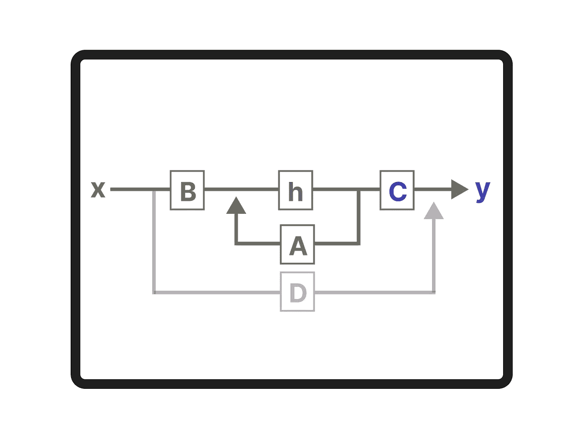

# Mamba 和状态空间模型的视觉指南

> 原文：[`towardsdatascience.com/a-visual-guide-to-mamba-and-state-space-models-8d0d3f7d3ea6?source=collection_archive---------4-----------------------#2024-02-22`](https://towardsdatascience.com/a-visual-guide-to-mamba-and-state-space-models-8d0d3f7d3ea6?source=collection_archive---------4-----------------------#2024-02-22)

## 语言建模的 Transformer 替代方案

 [Maarten Grootendorst](https://medium.com/@maartengrootendorst?source=post_page---byline--8d0d3f7d3ea6--------------------------------)

·发布于[Towards Data Science](https://towardsdatascience.com/?source=post_page---byline--8d0d3f7d3ea6--------------------------------) ·阅读时长：21 分钟·2024 年 2 月 22 日

--

Transformer 架构是大型语言模型（LLM）成功的重要组成部分。它已被几乎所有当前使用的 LLM 所采用，从像 Mistral 这样的开源模型到像 ChatGPT 这样的封闭源代码模型。

为了进一步提升 LLM 的性能，开发了新的架构，这些架构甚至可能超过 Transformer 架构。其中一种方法是*Mamba*，一种*状态空间模型*。

状态空间模型的基本架构。

Mamba 是在论文[Mamba: 线性时间序列建模与选择性状态空间](https://arxiv.org/abs/2312.00752)中提出的。你可以在它的[代码库](https://github.com/state-spaces/mamba)中找到其官方实现和模型检查点。

在这篇文章中，我将介绍状态空间模型在语言建模中的应用，并逐步探索相关概念，以帮助你形成对该领域的直观理解。然后，我们将讨论 Mamba 如何挑战 Transformer 架构。

作为视觉指南，预计会有许多可视化内容，帮助你形成对 Mamba 和状态空间模型的直观理解！

# 第一部分：Transformer 的问题

为了说明 Mamba 为何是一种如此有趣的架构，让我们首先简要回顾一下 Transformer，并探索其中的一个…
