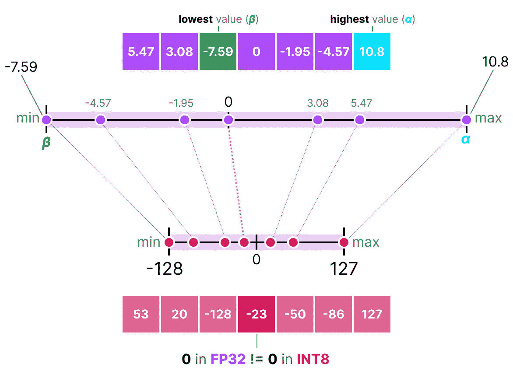
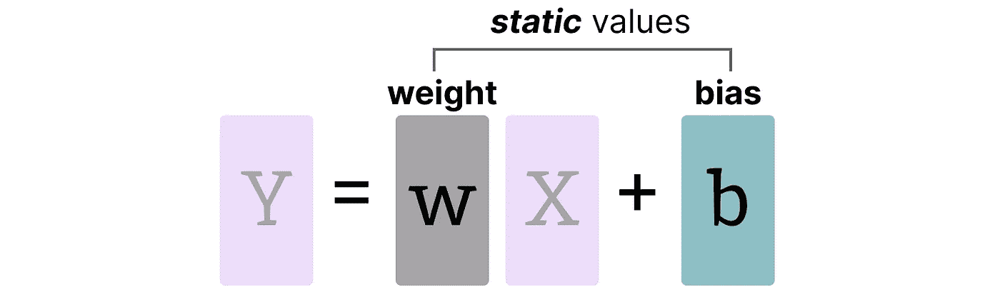
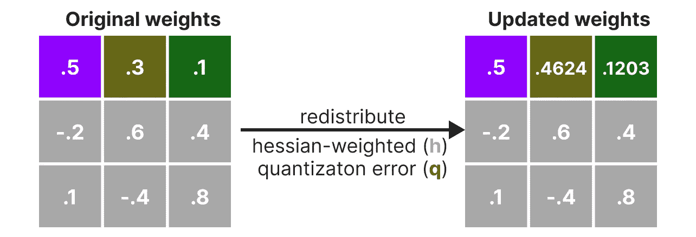
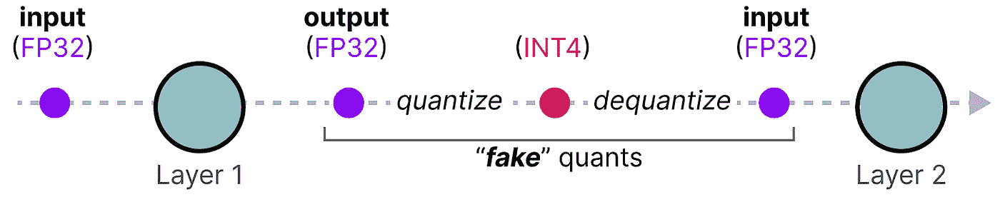

# 量化的视觉指南

> 原文：[`towardsdatascience.com/a-visual-guide-to-quantization-930ebcd9be94?source=collection_archive---------0-----------------------#2024-07-24`](https://towardsdatascience.com/a-visual-guide-to-quantization-930ebcd9be94?source=collection_archive---------0-----------------------#2024-07-24)

## 解密大型语言模型的压缩技术

 [Maarten Grootendorst](https://medium.com/@maartengrootendorst?source=post_page---byline--930ebcd9be94--------------------------------)

·发表于 [Towards Data Science](https://towardsdatascience.com/?source=post_page---byline--930ebcd9be94--------------------------------) ·阅读时间：20 分钟·2024 年 7 月 24 日

--

正如其名称所示，大型语言模型（LLMs）通常太大，无法在消费者硬件上运行。这些模型的参数可能超过数十亿，并且通常需要具有大量显存的 GPU 来加速推理。

因此，越来越多的研究集中于通过改进训练、适配器等手段使这些模型变得更小。这个领域的一个主要技术叫做*量化*。

在这篇文章中，我将介绍在语言建模背景下的量化领域，并逐步探索这些概念，以培养对该领域的直觉。我们将探索各种方法论、使用案例以及量化背后的原理。

作为一份视觉指南，预计会有许多可视化内容，以帮助你形成关于量化的直觉！

# 第一部分：LLMs 的“问题”

LLMs 得名于它们所包含的参数数量。如今，这些模型通常拥有数十亿个参数（主要是*权重*），存储这些参数相当昂贵。

在推理过程中，激活值是输入与权重的乘积，这些值也可能非常大。

因此，我们希望尽可能高效地表示数十亿个值，最小化存储给定值所需的空间。

让我们从头开始，探索在优化数值之前，数值是如何表示的。

# 如何表示数值

给定的值通常表示为浮点数（或计算机科学中的*浮动*）：一个带有小数点的正数或负数。

这些值由“*位*”或二进制数字表示。[IEEE-754](https://en.wikipedia.org/wiki/IEEE_754) 标准描述了如何使用位来表示三个函数之一：*符号*、*指数*或*小数部分（或尾数）*。

这三方面可以结合起来，用来计算在给定位值的情况下一个值：

我们用于表示数值的位数越多，通常精度越高：

# 内存限制

我们可用的位数越多，可以表示的值的范围就越大。

给定表示方法所能表示的数值范围称为 *动态范围*，而两个相邻值之间的距离称为 *精度*。

这些位数的一个巧妙特点是，我们可以计算设备存储一个给定值所需的内存量。由于 1 字节等于 8 位，我们可以为大多数浮点数表示形式创建一个基本公式。

**注意**：实际上，与推理过程中所需的（V）RAM 量相关的因素还包括上下文大小和架构等。

假设我们有一个包含 700 亿参数的模型。大多数模型通常使用 32 位浮点数表示（通常称为*全精度*），仅加载该模型就需要 **280GB** 的内存。

因此，尽可能减少表示模型参数所需的位数（以及在训练过程中）是非常有吸引力的。然而，随着精度的降低，模型的准确度通常也会下降。

我们希望在保持准确度的同时减少表示数值所需的位数……这就是 *量化* 的作用！

# 第二部分：量化简介

量化旨在将模型参数的精度从较高的位宽（如 32 位浮点数）降低到较低的位宽（如 8 位整数）。

当减少表示原始参数所需的位数时，通常会有一些精度损失（粒度）。

为了说明这一效果，我们可以选取任意一张图片，并只使用 8 种颜色来表示它：

图片来源于 [Slava Sidorov](https://pixabay.com/users/slava_web-designer-39623293/?utm_source=link-attribution&utm_medium=referral&utm_campaign=image&utm_content=8668140)。

注意到放大部分比原图看起来更“颗粒化”，因为我们只能使用更少的颜色来表示它。

量化的主要目标是减少表示原始参数所需的位数（颜色），同时尽可能保持原始参数的精度。

# 常见数据类型

首先，让我们看看常见的数据类型以及使用它们而不是 32 位（称为 *全精度* 或 *FP32*）表示的影响。

## FP16

让我们看一个从 32 位到 16 位（称为 *半精度* 或 *FP16*）浮点数的例子：

请注意，FP16 可以表示的值范围比 FP32 小得多。

## BF16

为了获得与原始 FP32 相似的值范围，引入了 *bfloat 16* 作为一种“截断 FP32”的类型：

BF16 使用与 FP16 相同数量的位，但可以表示更广泛的值范围，并且通常用于深度学习应用中。

## INT8

当我们进一步减少位数时，我们进入了 *基于整数的表示* 领域，而不是浮点表示。为了说明这一点，从 FP32 转到只有 8 位的 INT8，结果是原始位数的四分之一：

根据硬件的不同，基于整数的计算可能比浮点计算更快，但并不总是如此。然而，使用更少的位数时，计算通常会更快。

对于每次减少位数，都会执行映射以“压缩”初始的 FP32 表示到较低的位数。

实际上，我们不需要将整个 FP32 范围 [-3.4e38, 3.4e38] 映射到 INT8。我们只需要找到一种方法将数据的范围（模型的参数）映射到 INT8。

常见的压缩/映射方法是 *对称* 和 *非对称* 量化，并且它们是 *线性映射* 的形式。

让我们探索这些方法，将 FP32 量化到 INT8。

# 对称量化

在对称量化中，原始浮点值的范围被映射到量化空间中围绕零的对称范围。在之前的例子中，请注意量化前后的范围是如何围绕零对称的。

这意味着在浮点空间中量化的零值在量化空间中正好是零。

一种对称量化的好例子叫做绝对最大值（*absmax*）量化。

给定一个值的列表，我们取 *最高* 的绝对值 (**α**) 作为范围来执行线性映射。

注意，[-127, 127] 范围的值表示受限范围。无符号范围是 [-128, 127]，并且依赖于量化方法。

由于它是一个围绕零的线性映射，公式是直接的。

我们首先使用以下公式计算一个比例因子（***s***）：

+   ***b*** 是我们希望量化到的字节数（8），

+   **α** 是 *最高* 绝对值，

然后，我们使用***s***来量化输入***x***：

填入这些数值后，我们将得到以下结果：

为了恢复原始的 FP32 值，我们可以使用之前计算的*缩放因子*（***s***）来*去量化*这些量化后的值。

应用量化和去量化过程以恢复原始值如下所示：

你可以看到某些值，比如**3.08**和**3.02**，被分配到了 INT8，即**36**。当你将这些值去量化以返回 FP32 时，它们会失去一些精度，变得不可区分。

这通常被称为*量化误差*，我们可以通过计算原始值和去量化值之间的差异来确定它。

通常，位数越低，我们往往会有更多的量化误差。

# 非对称量化

非对称量化与对称量化不同，它不是围绕零对称的。相反，它将浮动范围中的最小值（**β**）和最大值（**α**）映射到量化范围的最小值和最大值。

我们将要探讨的方法叫做*零点量化*。

注意 0 已经发生了位置偏移？这就是为什么它被称为*非对称量化*。最小/最大值与 0 之间的距离在范围 [-7.59, 10.8] 内是不相等的。

由于其位置的偏移，我们必须为 INT8 范围计算零点，以执行线性映射。如之前所述，我们还需要计算*缩放因子*（***s***），但这次要使用 INT8 范围的差值 [-128, 127]。

注意，由于需要计算 INT8 范围内的*零点*（***z***）以平移权重，这一过程稍显复杂。

如前所述，让我们填写公式：

要将从 INT8 量化的数据还原为 FP32，我们需要使用之前计算的*缩放因子*（***s***）和*零点*（***z***）。

除此之外，去量化是直接的：

当我们将对称量化和非对称量化并排放置时，我们可以迅速看到两者方法的差异：

注意对称量化的零中心特性与非对称量化的偏移特性。

# 范围映射与裁剪

在之前的例子中，我们探讨了如何将给定向量中数值的范围映射到低位表示。尽管这使得整个向量值范围能够被映射，但也带来了一个重大缺点，即*离群值*。

想象你有一个包含以下值的向量：

请注意，某个值远大于其他所有值，它可能被视为一个异常值。如果我们要映射该向量的整个范围，所有较小的值将会被映射为相同的低位表示，并失去它们的区分性：

这就是我们之前使用的 absmax 方法。注意，如果我们没有应用裁剪，非对称量化也会表现出相同的行为。

相反，我们可以选择*裁剪*某些值。裁剪是指设定原始值的不同动态范围，使得所有异常值都得到相同的值。

在下面的示例中，如果我们手动将动态范围设置为[-5, 5]，所有超出该范围的值将被映射为-127 或 127，无论它们的实际值是多少：

主要的优势在于，*非异常值*的量化误差显著降低。然而，*异常值*的量化误差却增加了。

# 校准

在示例中，我展示了选择[-5, 5]这一任意范围的简单方法。选择该范围的过程称为*校准*，其目的是找到一个尽可能包含更多值的范围，同时最小化量化误差。

执行此校准步骤对所有类型的参数并不相同。

## 权重（和偏差）

我们可以将 LLM 的权重和偏差视为*静态*值，因为它们在模型运行之前就已知。例如，[Llama 3 的约 20GB 文件](https://huggingface.co/meta-llama/Meta-Llama-3-8B/tree/main)大部分由其权重和偏差构成。

由于偏差的数量（百万级）远少于权重的数量（十亿级），偏差通常保持较高的精度（如 INT16），而量化的主要工作集中在权重上。

对于权重，作为静态且已知的值，选择范围的校准技术包括：

+   手动选择输入范围的*百分位*。

+   优化原始权重和量化权重之间的*均方误差*（MSE）。

+   最小化*熵*（KL 散度）原始值与量化值之间的差异

例如，选择百分位数会导致与之前看到的类似的裁剪行为。

## 激活值

在整个 LLM 中持续更新的输入通常被称为“*激活值*”。

请注意，这些值被称为激活值，因为它们通常会经过某些激活函数，如 sigmoid 或 relu。

与权重不同，激活值会随每次输入数据进入模型时发生变化，这使得精确量化激活值变得具有挑战性。

由于这些值在每个隐藏层之后都会更新，因此我们只能在推理过程中随着输入数据通过模型时，才能知道它们的值。

广义上来说，校准权重和激活值量化方法有两种：

+   训练后量化（PTQ）— 训练***后***的量化

+   量化感知训练（QAT）— 训练/微调***期间***的量化

# 第三部分：训练后量化

最流行的量化技术之一是训练后量化（PTQ）。它涉及在训练模型**之后**对模型的参数（包括权重和激活值）进行量化。

*权重*的量化是通过对称或非对称量化来执行的。

然而，*激活值*的量化需要推断模型以获取它们的潜在分布，因为我们不知道它们的范围。

激活值的量化有两种形式：

+   *动态*量化

+   *静态*量化

# 动态量化

当数据通过一个隐藏层时，它的激活值被收集：

然后，使用这个激活值的分布来计算量化输出所需的*零点*（***z***）和*缩放因子*（**s**）值：

这个过程在每次数据通过新层时都会重复。因此，每一层都有自己独立的***z***和***s***值，因此也有不同的量化方案。

# 静态量化

与动态量化相比，静态量化在推断过程中不会计算*零点*（***z***）和缩放因子（***s***），而是提前计算好。

为了找到这些值，会使用**校准数据集**并提供给模型以收集这些潜在分布。

收集到这些值之后，我们可以计算出在推断过程中执行量化所需的***s***和***z***值。

当你进行实际推断时，***s***和***z***值不会被重新计算，而是全局使用在所有激活值上进行量化。

通常，动态量化往往更精确一些，因为它只在每个隐藏层计算***s***和***z***值。然而，它可能会增加计算时间，因为这些值需要被计算出来。

相比之下，静态量化虽然精度较低，但速度更快，因为它已经知道了用于量化的***s***和***z***值。

# 4 位量化的领域

低于 8 位量化被证明是一个困难的任务，因为每损失一位，量化误差都会增加。幸运的是，有几种巧妙的方法可以将位数降低到 6 位、4 位，甚至 2 位（尽管使用这些方法将位数降低到 4 位以下通常不建议）。

我们将探讨两种在 HuggingFace 上常见的共享方法：

+   *GPTQ —* 完整模型在 GPU 上

+   *GGUF —* 可能会将层卸载到 CPU 上

# GPTQ

GPTQ 可以说是目前实践中最著名的 4 位量化方法之一。

它使用非对称量化，并且按层处理，使每一层在继续到下一层之前都能独立处理：

在这个逐层量化过程中，它首先将层的权重转换为逆**海森矩阵**。它是模型损失函数的二阶导数，告诉我们模型输出对每个权重变化的敏感程度。

简化来说，它本质上展示了每个权重在一个层中的（*逆*）**重要性**。

在海森矩阵中，与较小值相关的权重更为重要，因为这些权重的微小变化可能会导致模型性能的显著变化。

在逆海森矩阵中，较低的值表示更“重要”的权重。

接下来，我们对权重矩阵中第一行的权重进行量化，然后再解量化：

这个过程允许我们计算**量化误差 (*q*)**，我们可以使用之前计算的逆海森矩阵（***h_1****）加权它。

本质上，我们根据权重的重要性创建一个加权的量化误差：

接下来，我们将这个加权量化误差重新分配到同一行中的其他权重上。这有助于保持网络的整体功能和输出。

例如，如果我们要对第二个权重（即 .3，***x_2***）执行这个操作，我们将添加量化误差（***q***）乘以第二个权重的逆海森矩阵（***h*_2**）。

我们可以对给定行中的第三个权重执行相同的过程：

我们不断迭代这一过程，重新分配加权的量化误差，直到所有值都被量化。

这种方法非常有效，因为权重通常是相互关联的。所以当一个权重存在量化误差时，相关的权重会相应地更新（通过逆海森矩阵）。

> ***注意****:* [*作者们*](https://arxiv.org/pdf/2210.17323) *使用了几种技巧来加速计算和提高性能，比如向海森矩阵添加阻尼因子、“懒批处理”和使用 Cholesky 方法预计算信息。我强烈建议查看* [*这个 YouTube 视频*](https://www.youtube.com/watch?v=mii-xFaPCrA) *，了解相关内容。*
> 
> ***提示****: 如果你想要一种专注于性能优化和提高推理速度的量化方法，可以查看* [*EXL2*](https://github.com/turboderp/exllamav2) *。*

# GGUF

虽然 GPTQ 是一种很好的量化方法，可以在 GPU 上运行完整的 LLM，但你可能并不总是具备这种能力。相反，我们可以使用 GGUF 将 LLM 的任何一层转移到 CPU 上处理。

这使你在没有足够显存的情况下，仍然可以同时使用 CPU 和 GPU。

GGUF 量化方法会频繁更新，并且可能会依赖于位量化的级别。然而，基本原则如下。

首先，给定层的权重被拆分成“super”块，每个块包含一组“sub”块。从这些块中，我们提取尺度因子(**s**)和 alpha(**α**)：

要对给定的“sub”块进行量化，我们可以使用之前使用过的*absmax*量化方法。记住，它将给定的权重乘以尺度因子**(*s*)**：

尺度因子是使用来自“sub”块的信息计算的，但它是使用来自“super”块的信息进行量化的，后者有自己的尺度因子：

这个块级量化使用来自“super”块的尺度因子(**s_super**)来量化来自“sub”块的尺度因子(**s_sub**)。

每个尺度因子的量化级别可能不同，“super”块的量化精度通常高于“sub”块的尺度因子。

为了说明，我们来探讨几个量化级别（2 位、4 位和 6 位）：

**注意**：根据量化类型，可能需要一个额外的最小值(**m**)，用于调整零点。这些值的量化方式与尺度因子(**s**)相同。

查看[原始拉取请求](https://github.com/ggerganov/llama.cpp/pull/1684)，了解所有量化级别的概述。同时，查看[此拉取请求](https://github.com/ggerganov/llama.cpp/pull/4861)，了解使用重要性矩阵进行量化的更多信息。

# 第四部分：量化感知训练

在第三部分，我们看到如何在训练后对模型进行量化。该方法的一个缺点是，量化过程没有考虑到实际的训练过程。

这就是量化感知训练(QAT)的作用。QAT 的目标是在训练过程中学习量化过程，而不是像后训练量化(PTQ)那样在模型训练完成后进行量化。

QAT 通常比 PTQ 更为准确，因为量化已经在训练过程中考虑了。其工作原理如下：

在训练过程中，引入了所谓的“*伪*”量化。这是将权重先量化为例如 INT4，然后再解量化回 FP32 的过程：

这个过程使得模型能够在训练过程中考虑量化过程、损失计算以及权重更新。

QAT 尝试探索损失景观中“*宽*”极小值，以最小化量化误差，因为“*窄*”极小值往往会导致更大的量化误差。

例如，假设我们在反向传播时没有考虑量化。我们根据梯度下降选择具有最小损失的权重。然而，如果它位于一个“*狭窄*”的最小值中，这将引入更大的量化误差。

相反，如果我们考虑量化，更新后的权重将在一个“*宽阔*”的最小值中被选择，量化误差会更小。

因此，尽管 PTQ 在高精度下（例如 FP32）损失较小，但 QAT 在低精度下（例如 INT4）损失更低，这正是我们追求的目标。

# 1 位 LLM 的时代：BitNet

如前所述，4 位已经相当小了，但如果我们进一步减少它会怎样呢？

这就是[BitNet](https://arxiv.org/pdf/2310.11453)的作用，它用单个 1 位表示模型的权重，使用**-1**或**1**表示给定的权重。[3](https://newsletter.maartengrootendorst.com/p/a-visual-guide-to-quantization#footnote-3-145531349)

它通过将量化过程直接注入到 Transformer 架构中来实现。

请记住，Transformer 架构是大多数 LLM 的基础，并由涉及线性层的计算组成：

这些线性层通常以较高精度表示，如 FP16，并且大多数权重就存储在这里。

BitNet 用他们所称的**BitLinear**替换了这些线性层：

BitLinear 层的工作方式与常规线性层相同，基于权重与激活的乘积来计算输出。

相比之下，BitLinear 层用 1 位表示模型的权重，用 INT8 表示激活：

BitLinear 层像量化感知训练（QAT）一样，在训练期间执行一种“伪”量化，以分析权重和激活的量化效果：

**注意**：在论文中他们使用了**γ**代替**α**，但由于我们在示例中使用了**α**，所以我这里也使用它。同时，注意**β**与我们在零点量化中使用的不同，它是平均绝对值。

让我们一步一步地了解 BitLinear。

# 权重量化

在训练过程中，权重以 INT8 存储，然后使用一种基本策略将其量化为 1 位，这个策略称为*符号函数*。

本质上，它将权重的分布移至围绕 0 的位置，然后将左边的所有内容分配为-1，右边的所有内容分配为 1：

此外，它还跟踪一个值**β（*平均*绝对值）**，我们将在后续用于反量化。

# 激活量化

为了量化激活值，BitLinear 利用*absmax 量化*将激活值从 FP16 转换为 INT8，因为在进行矩阵乘法（×）时需要更高精度。

此外，它还追踪**α（***最大*绝对值**）**，我们稍后会用到它进行反量化。

# **反量化**

我们追踪了**α（***激活值的最大绝对值**）**和**β（***权重的平均绝对值**）**，因为这些值有助于我们将激活值反量化回 FP16。

输出激活值会使用{**α**，γ}进行重新缩放，以将它们反量化到原始精度：

就是这样！这个过程相对简单，并允许模型仅使用两个值来表示，即**-1**或**1**。

通过这种方法，作者观察到随着模型规模的增长，1 位和 FP16 训练模型之间的性能差距变得越来越小。

然而，这仅适用于更大的模型（>30B 参数），小模型之间的差距仍然很大。

# 所有大型语言模型都在 1.58 位

[BitNet 1.58b](https://arxiv.org/pdf/2402.17764)的引入是为了改善之前提到的缩放问题。

在这种新方法中，每个权重不仅仅是**-1**或**1**，现在还可以取**0**作为值，使其变为*三元*。有趣的是，仅添加**0**就极大地改进了 BitNet，并且可以实现更快的计算。

# **0 的力量**

那么，为什么加 0 会是一个如此重大的改进呢？

它与*矩阵乘法*密切相关！

首先，让我们探讨一下矩阵乘法一般是如何工作的。在计算输出时，我们将权重矩阵与输入向量相乘。下面是第一层权重矩阵的第一次乘法可视化：

请注意，这次乘法涉及两个操作，**将**各个权重与输入相乘，然后**将它们加在一起**。

与此相反，BitNet 1.58b 成功地避免了乘法操作，因为三元权重本质上告诉你以下内容：

+   **1 —** 我想加上这个值

+   **0** — 我不想要这个值

+   **-1 —** 我想减去这个值

结果是，如果你的权重被量化为 1.58 位，你只需要执行加法：

这不仅可以显著加快计算速度，而且还允许进行**特征过滤**。

通过将给定的权重设置为 0，你现在可以忽略它，而不是像 1 位表示那样加或减权重。

# **量化**

为了进行权重量化，BitNet 1.58b 使用*absmean 量化*，这是一种我们之前看到过的 absmax 量化的变体。

它只是压缩了权重的分布，并使用绝对均值（**α**）来量化值。然后它们被四舍五入为-1、0 或 1：

与 BitNet 相比，激活量化是相同的，只有一点不同。激活值不再被缩放到[**0**, **2ᵇ⁻¹**]范围，而是现在被缩放到

[**-2ᵇ⁻¹**, **2ᵇ⁻¹**]改为使用*绝对最大值量化*。

就这样！1.58 比特量化（大部分）需要两种技巧：

+   添加**0**以创建三元表示[-1, 0, 1]

+   *绝对均值量化*用于权重

结果是，我们获得了轻量级模型，因为它们只有 1.58 个计算高效的比特！

# 感谢阅读！

这标志着我们在量化方面的旅程结束！希望这篇文章能帮助你更好地理解量化、GPTQ、GGUF 和 BitNet 的潜力。谁知道未来模型会小到什么程度呢？！

若想查看更多与 LLM 相关的可视化内容并支持本期通讯，敬请关注我与 Jay Alammar 共同编写的书籍。该书即将发布！

你可以通过[O'Reilly 网站](https://www.oreilly.com/library/view/hands-on-large-language/9781098150952/)享受免费试读，或者在[Amazon](https://www.amazon.com/Hands-Large-Language-Models-Understanding/dp/1098150961)上预购本书。所有代码都将上传至[Github](https://github.com/HandsOnLLM/Hands-On-Large-Language-Models)。

如果你像我一样，对*人工智能*和/或*心理学*充满热情，欢迎在[**LinkedIn**](https://www.linkedin.com/in/mgrootendorst/)和[**Twitter**](https://twitter.com/MaartenGr)上加我为好友，或者订阅我的[**通讯**](http://maartengrootendorst.substack.com/)。你也可以在我的[**个人网站**](https://maartengrootendorst.com/)找到一些我的内容**。

 [## 探索语言模型 | Maarten Grootendorst | Substack

### 机器学习工程师，撰写关于人工智能、语言模型和心理学交集的文章。开源开发者（BERTopic…）

[newsletter.maartengrootendorst.com](https://newsletter.maartengrootendorst.com/?source=post_page-----930ebcd9be94--------------------------------)

*所有没有来源说明的图片均由作者创作——这意味着所有图片（除了一个！）都是我自己做的；)*
