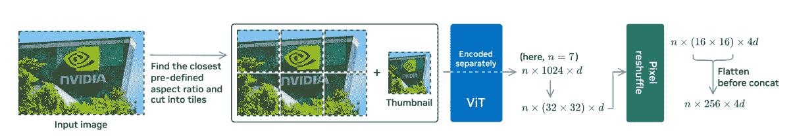
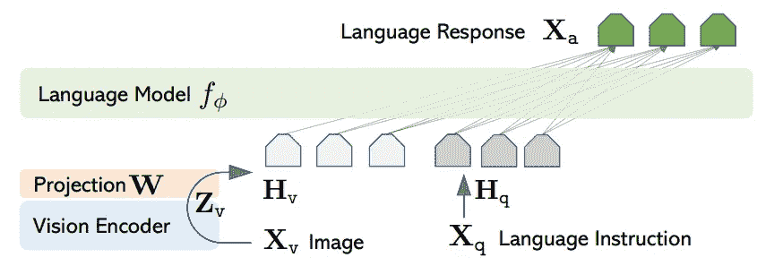
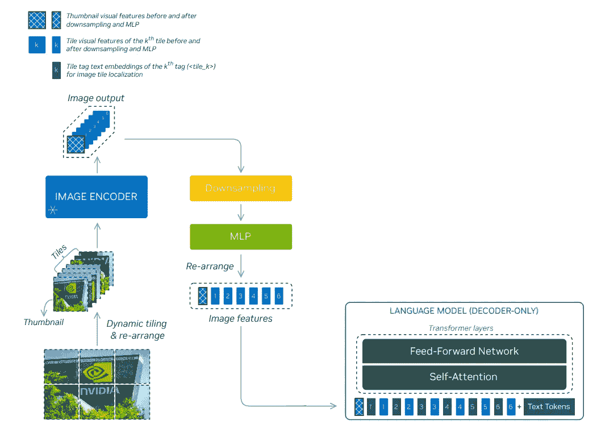
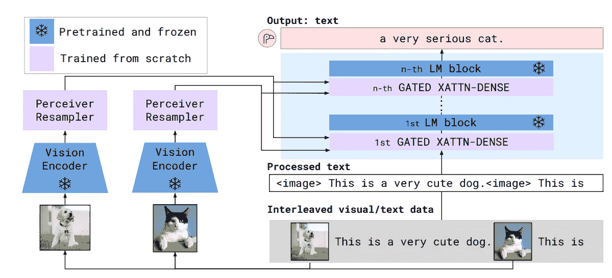
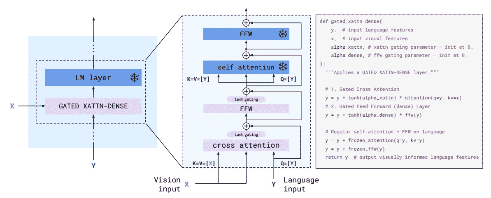
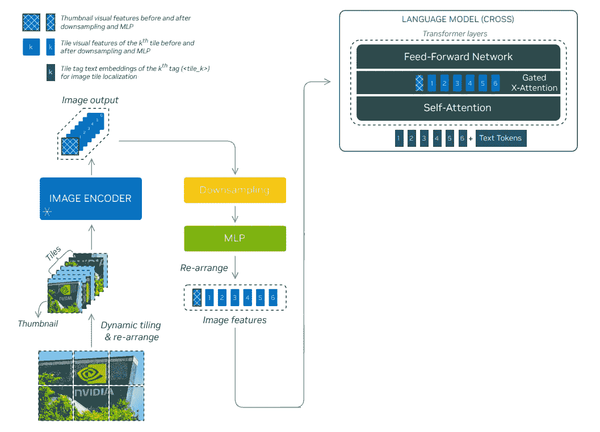
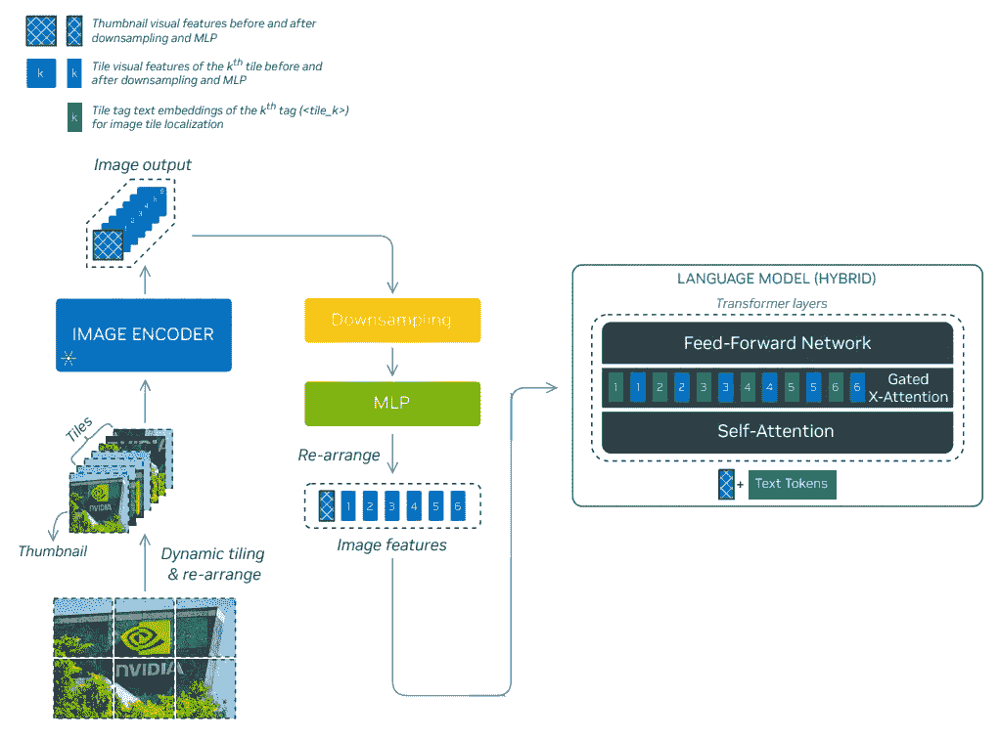
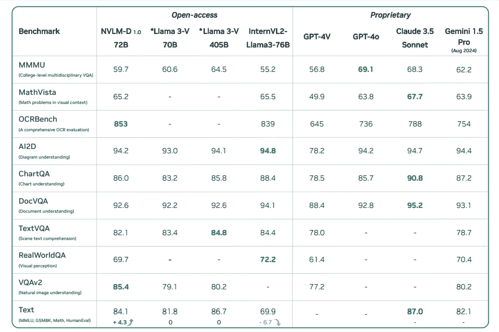
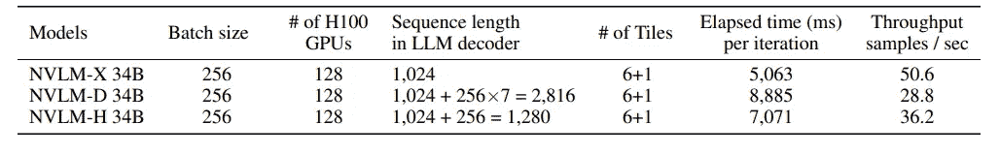

# 英伟达最新的多模态大语言模型家族全览

> 原文：[`towardsdatascience.com/a-walkthrough-of-nvidias-latest-multi-modal-llm-family-fdc067b59596?source=collection_archive---------6-----------------------#2024-10-10`](https://towardsdatascience.com/a-walkthrough-of-nvidias-latest-multi-modal-llm-family-fdc067b59596?source=collection_archive---------6-----------------------#2024-10-10)

## 从 LLaVA、Flamingo 到 NVLM

 [孟柳·赵](https://mengliuz.medium.com/?source=post_page---byline--fdc067b59596--------------------------------)

·发表于 [Towards Data Science](https://towardsdatascience.com/?source=post_page---byline--fdc067b59596--------------------------------) ·阅读时间 6 分钟·2024 年 10 月 10 日

--

近年来，多模态大语言模型（LLM）发展迅速。

尽管商业化的多模态模型，如 [GPT-4v](https://openai.com/index/gpt-4v-system-card/)、[GPT-4o](https://openai.com/index/gpt-4v-system-card/)、[Gemini](https://gemini.google.com/) 和 [Claude 3.5 Sonnet](https://www.anthropic.com/news/claude-3-5-sonnet) 目前是最引人注目的表现者，但开源模型，如 [LLaVA](https://arxiv.org/abs/2304.08485)、[Llama 3-V](https://huggingface.co/spaces/MBZUAI/LLaMA-3-V)、[Qwen-VL](https://arxiv.org/abs/2308.12966) 在公开基准测试上的表现正稳步追赶。

就在上个月，英伟达发布了他们的开源 [多模态大语言模型家族](https://arxiv.org/pdf/2409.11402)，称为 NVLM。该家族包括三种架构：a) 基于解码器的，b) 基于交叉注意力的，和 c) 混合型。基于解码器的模型将图像和文本令牌传递给预训练的大语言模型，如 LLaVA 模型。基于交叉注意力的模型将图像令牌嵌入作为键和值，而将文本令牌嵌入作为查询；由于注意力是使用不同来源的计算，因此它被称为“交叉注意力”，类似于原始的 Transformer 解码器，而非解码器模型中的自注意力。混合架构是一种独特的设计，结合了解码器和交叉注意力架构，旨在实现多模态推理、减少训练参数并处理高分辨率输入。72B 解码器基础的 NVLM-D 模型在自然图像理解和 OCR 等任务上取得了令人印象深刻的表现，超越了当前最先进的开源和商业模型。

在本文中，我将介绍以下内容：

+   动态高分辨率（DHR）视觉编码器，所有 NVLM 模型都采用了这一技术

+   基于解码器的模型，NVLM-D，与 LLaVA 的比较

+   门控交叉注意力模型，NVLM-X，与 Flamingo 的比较

+   混合模型，NVLM-H

最终，我将展示 NVLM-D 72B 的性能。与最先进的开源和商业模型相比，NVLM-D 模型在基于文本的任务中表现出稳定性，并且在自然理解和 OCR 任务中具有更优越的表现。

图片来源：[`pxhere.com/en/photo/821032`](https://pxhere.com/en/photo/821032)

## 基于动态高分辨率的视觉编码器（DHR）

NVLM 模型的一个显著优势是它们在处理 OCR 相关任务方面表现出色，这类任务需要高分辨率的图像输入。NVLM 采用了[InternVL 1.5](https://arxiv.org/abs/2404.16821) [技术报告](https://arxiv.org/abs/2404.16821)中提出的动态高分辨率方法，以保持高分辨率。DHR 方法首先将高分辨率图像转换为预定义的纵横比大小（也称为动态纵横比匹配），然后将其拆分为不重叠的 448*448 图块，并附加一个缩略图，这样可以更好地保留全局信息。

DHR 管道。图片来源：[`arxiv.org/abs/2409.11402`](https://arxiv.org/pdf/2409.11402)

上图展示了 DHR 管道的详细说明。左侧显示了输入图像，并列出了 6 种不同的预定义纵横比，它们会被搜索并匹配到原始图像形状。然后，将重塑后的图像裁剪成六个不重叠的 448*448 的块，并附加一个低分辨率的缩略图，用以捕捉全局信息。接下来，n 个图块（在本例中 n=6+1=7）被分别输入到 ViT 中，并转换为一个长度为 n、每个嵌入维度为 d 的 1024 个 token 的序列（448/14*448/14=1024）。为了减少计算成本，采用了[pixel reshuffle](https://pytorch.org/docs/stable/generated/torch.nn.PixelShuffle.html)操作，将 32*32 的图块调整为 16*16，从而将最终的输出 token 大小减少到 256，且嵌入维度增大为 4*d。

## 解码器模型：NVLM-D 与 LLaVA

[LLaVA](https://arxiv.org/pdf/2304.08485)是一个著名的基于解码器的多模态大语言模型，它接收图像 X_v 并使用预训练的 CLIP 编码器 ViT-L/14 作为视觉编码器 Z_v，经过一个可训练的线性投影层 W 转换为嵌入 token H_v，之后这些 token 可以与其他文本 token 一起处理。LLaVA 的架构如图所示。

LLaVA 架构。图片来源：[`arxiv.org/pdf/2304.08485`](https://arxiv.org/pdf/2304.08485)

相比之下，NVLM-D 架构使用 DHR 视觉编码器输入编码后的瓦片序列令牌，并在其中插入瓦片标签，然后与文本令牌拼接，供变换器层处理。架构如下所示。

带有 DHR 视觉编码器的基于解码器的 NVLM-D 架构。图像来源：[`arxiv.org/pdf/2409.11402`](https://arxiv.org/pdf/2409.11402)

## 交叉注意力模型：NVLM-X 与 Flamingo

与 LLaVA 相比，[Flamingo 模型](https://arxiv.org/pdf/2204.14198)使用了更复杂的交叉注意力技术，它将视觉嵌入作为键（K）和值（V），而将文本嵌入作为查询（Q）。此外，视觉编码器是基于 CNN 的模型，配有感知重采样器（Perceiver Resampler），它接受一系列带有时间位置嵌入的图像，以使用交叉注意力训练可学习的潜在查询向量。关于感知重采样器的更详细讨论，可以在[我的最新文章中找到](https://medium.com/towards-data-science/from-set-transformer-to-perceiver-sampler-2f18e741d242)。

Flamingo 架构。图像来源：[`arxiv.org/pdf/2204.14198`](https://arxiv.org/pdf/2204.14198)

为了融合视觉嵌入和文本嵌入，Flamingo 冻结了预训练的 LLM 层，并在其中进一步添加了一个可训练的门控交叉注意力层，如下所示。门控注意力使用 tanh 门控和一个可学习的 alpha 参数，在交叉注意力层和随后的线性层之后。当 tanh 门控初始化为零时，唯一传递的信息是通过跳跃连接，因此整个模型仍将是原始 LLM，以提高稳定性。

Flamingo 的门控交叉注意力设计。图像来源：[`arxiv.org/pdf/2204.14198`](https://arxiv.org/pdf/2204.14198)

相比之下，NVLM-X 去除了感知重采样器设计，以便更好地支持 OCR 任务，从而保持更多的空间关系，并且只使用 DHR 编码器输出用于门控交叉注意力。与基于解码器的模型不同，NVLM-X 在将瓦片标签传入门控交叉注意力之前，将它们与文本令牌拼接。整个架构如下所示。

带有门控交叉注意力设计的 NVLM-X 架构。图像来源：[`arxiv.org/pdf/2409.11402`](https://arxiv.org/pdf/2409.11402)

## 混合模型：NVLM-H

混合模型是 NVLM 的独特设计。缩略图像令牌被添加到文本令牌中，作为自注意力层的输入，这保留了基于解码器的模型的多模态推理优势。其他图像瓦片和瓦片标签则传入门控交叉注意力层，以捕捉更精细的图像细节，同时最小化整体模型参数。详细架构如下所示。

NVML-H 架构。图片来源：[`arxiv.org/pdf/2409.11402`](https://arxiv.org/pdf/2409.11402)

## 性能

那么，NVLM 与其他最先进模型的性能如何呢？本文列出了 NVLM-D 72B 与其他开源模型（如 Llama-3 V）和商业模型（如 GPT-4o）在基准测试中的比较。NVLM-D 在大多数基准测试中表现优于平均水平，特别是在 OCR 和自然图像理解任务中表现突出，这得益于其高分辨率的图像特征和模型本身的多模态推理能力。与参数数量相当的 Llama 3-V 70B 和 InternVL2-Llama3–76B 相比，NVLM-D 在仅文本任务、视觉问答（VQA）任务和图像理解任务中表现出更加一致的优势。详细比较如下所示。

NVLM-D 在公共基准测试中与其他开源和商业模型的性能比较。图片来源：[`arxiv.org/pdf/2409.11402`](https://arxiv.org/pdf/2409.11402)

另一个有趣的发现是，尽管基于解码器的模型非常强大，但其训练吞吐量（每秒训练样本数）远低于基于跨注意力的模型。论文解释说，基于解码器的模型需要更长的序列长度，这导致了更高的 GPU 消耗和较低的吞吐量。详细的训练比较如下所示：

训练详细比较。图片来源：[`arxiv.org/pdf/2409.11402`](https://arxiv.org/pdf/2409.11402)

## 参考文献

+   戴等人，《NVLM：开放前沿级多模态大语言模型》。arXiv 2024。

+   陈等人，《我们距离 GPT-4V 有多远？通过开源工具套件缩小与商业多模态模型的差距》。arXiv 2024。

+   刘等人，《视觉指令微调》。NeurIPS 2023。

+   白等人，《Qwen-VL：一个多功能的视觉语言模型，用于理解、定位、文本读取及更多》。arXiv 2023。

+   Alayrac 等人，《Flamingo：一个用于少量样本学习的视觉语言模型》。NeurIPS 2022。
