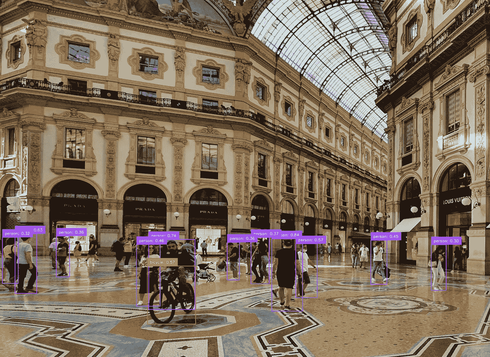

# 一个周末 AI 项目：在 PC 和树莓派上使用 YOLO 进行物体检测

> 原文：[`towardsdatascience.com/a-weekend-ai-project-object-detection-with-yolo-on-pc-and-raspberry-pi-0653e01032c1?source=collection_archive---------1-----------------------#2024-07-06`](https://towardsdatascience.com/a-weekend-ai-project-object-detection-with-yolo-on-pc-and-raspberry-pi-0653e01032c1?source=collection_archive---------1-----------------------#2024-07-06)

## 在不同硬件上运行最新的 YOLO v10 模型

 [Dmitrii Eliuseev](https://dmitryelj.medium.com/?source=post_page---byline--0653e01032c1--------------------------------)

·发表于 [Towards Data Science](https://towardsdatascience.com/?source=post_page---byline--0653e01032c1--------------------------------) ·8 分钟阅读·2024 年 7 月 6 日

--

YOLO 物体检测，图像由作者提供

计算机视觉可以成为不同规模机器学习应用的重要组成部分，从价值 2 万美元的特斯拉机器人或自动驾驶汽车，到智能门铃和吸尘器。这也是一项具有挑战性的任务，因为与云基础设施相比，在“真实”的边缘设备上，硬件规格通常受到更大限制。

YOLO（You Only Look Once）是一个流行的物体检测库；它的第一个版本发布于 2015 年。YOLO 特别适用于嵌入式设备，因为它几乎可以在任何地方运行；不仅有 Python 版本，还有 C++（ONNX 和 OpenVINO）和 Rust 版本。去年，我曾在树莓派 4 上测试过 YOLO v8。如今，许多事情发生了变化——新的树莓派 5 发布了，更新的 YOLO v10 也发布了。所以我期待在新硬件上，新的模型能够更快速、更精确地运行。

本文中展示的代码是跨平台的，因此没有树莓派的读者也可以在 Windows、Linux 或 OS X 电脑上运行它。

不再多说，让我们来看看它是如何工作的！

## 树莓派

对于那些可能从未听说过树莓派的人，让我们简要介绍一下…
