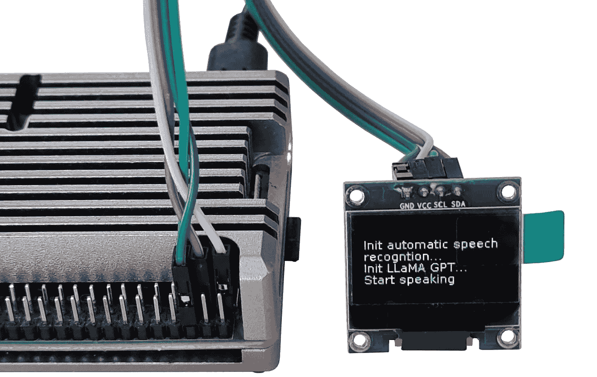

# 一项周末 AI 项目：在树莓派上运行语音识别和 LLaMA-2 GPT

> 原文：[`towardsdatascience.com/a-weekend-ai-project-running-speech-recognition-and-a-llama-2-gpt-on-a-raspberry-pi-5298d6edf812?source=collection_archive---------1-----------------------#2024-01-20`](https://towardsdatascience.com/a-weekend-ai-project-running-speech-recognition-and-a-llama-2-gpt-on-a-raspberry-pi-5298d6edf812?source=collection_archive---------1-----------------------#2024-01-20)

## Whisper ASR 和 LLaMA-2 GPT 模型的完全离线使用

 [Dmitrii Eliuseev](https://dmitryelj.medium.com/?source=post_page---byline--5298d6edf812--------------------------------)

·发表于 [Towards Data Science](https://towardsdatascience.com/?source=post_page---byline--5298d6edf812--------------------------------) ·10 分钟阅读·2024 年 1 月 20 日

--

树莓派运行 LLaMA 模型，图片来源：作者

如今，大家已经不再对在云端运行深度学习模型感到惊讶。但在边缘计算或消费者设备的世界中，情况可能会复杂得多。原因有几个。首先，云 API 的使用要求设备始终在线。对于一个网络服务来说这不是问题，但对于需要离线工作的设备来说，这可能是致命问题。其次，云 API 需要付费，用户可能并不愿意再为一个额外的订阅费用买单。最后，随着时间的推移，几年后，项目可能结束，API 接口会关闭，而昂贵的硬件则变成废物。这显然对用户、生态系统和环境都不友好。因此，我坚信终端用户硬件应该完全支持离线功能，无需额外费用或使用在线 API（当然，这可以是可选的，但不能强制要求）。

在本文中，我将展示如何在树莓派上运行 LLaMA GPT 模型和自动语音识别（ASR）。这将使我们能够向树莓派提问并得到答案。如同承诺的那样，所有这些都将在完全离线的状态下工作。
