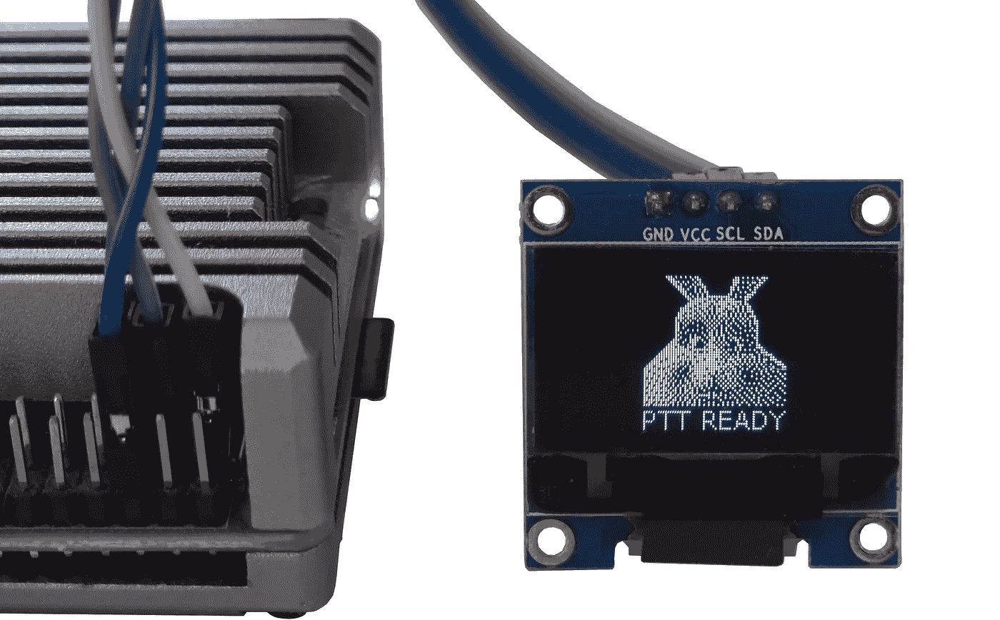

# 一个周末的 AI 项目：在树莓派上使用语音识别、PTT 和大规模行动模型

> 原文：[`towardsdatascience.com/a-weekend-ai-project-using-speech-recognition-ptt-and-a-large-action-model-on-a-raspberry-pi-ac8d839d078a?source=collection_archive---------1-----------------------#2024-02-03`](https://towardsdatascience.com/a-weekend-ai-project-using-speech-recognition-ptt-and-a-large-action-model-on-a-raspberry-pi-ac8d839d078a?source=collection_archive---------1-----------------------#2024-02-03)

## 使用 Python、Push-to-Talk、本地和云端 LLM 制作“类似 Rabbit 的原型”

 [Dmitrii Eliuseev](https://dmitryelj.medium.com/?source=post_page---byline--ac8d839d078a--------------------------------)

·发表于[Towards Data Science](https://towardsdatascience.com/?source=post_page---byline--ac8d839d078a--------------------------------) ·阅读时间 16 分钟·2024 年 2 月 3 日

--

作者提供的图片

在 2024 年初，几乎所有的科技评测者都写了关于 Rabbit R1 的文章——这是一款首个便携式“AI 助手”，售价 199 美元。根据作者的描述，它使用了“神经符号编程”和 LAM（“大规模行动模型”）来执行各种任务。但它是如何工作的呢？嗯，最好的了解方式就是自己动手制作原型！

那些从未听说过 Rabbit R1 的读者，可以在 YouTube 上找到很多类似这样的评测：

本文也受到了[Nabil Alouani](https://medium.com/u/7e6956110712?source=post_page---user_mention--ac8d839d078a--------------------------------)的文章启发，他对 Rabbit R1 的制作方法做了有趣的分析：
