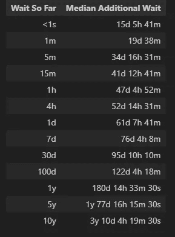
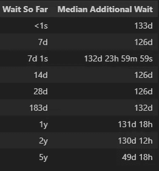

# 一次充满奇思妙想的等待时间之旅

> 原文：[`towardsdatascience.com/a-whimsical-journey-through-wait-times-b02a41d337fc?source=collection_archive---------9-----------------------#2024-05-15`](https://towardsdatascience.com/a-whimsical-journey-through-wait-times-b02a41d337fc?source=collection_archive---------9-----------------------#2024-05-15)

## 从微波炉倒计时到永无止境的电话等待，使用 Python

[](https://medium.com/@carlmkadie?source=post_page---byline--b02a41d337fc--------------------------------)[](https://towardsdatascience.com/?source=post_page---byline--b02a41d337fc--------------------------------) [Carl M. Kadie](https://medium.com/@carlmkadie?source=post_page---byline--b02a41d337fc--------------------------------)

·发表于 [Towards Data Science](https://towardsdatascience.com/?source=post_page---byline--b02a41d337fc--------------------------------) ·阅读时间：16 分钟·2024 年 5 月 15 日

--


等待“保持等待”、等待爆米花、等待彩票中奖——来源：[`openai.com/dall-e-2/`](https://openai.com/dall-e-2/)。所有其他图像来自作者。

有没有注意到微波炉的倒计时总是稳定地向零逼近，而电话等待的分钟数却似乎无限延伸？

想象一下：刚刚才开始微波爆米花不到一分钟，你已经开始准备碗盘等待盛放。但如果是电话等待呢？你会想自己是否还会和人类交谈。快进 10 分钟，你正在享受美味的爆米花。但在电话里呢？等待音乐已变成无尽地狱的配乐。

而在等待爆米花和等待电话接通之间的黄昏地带，潜伏着你的每周彩票。你等待着中奖。每周的新票都带来了新的希望，这个希望未曾被以往的失望所触碰。

总结来说，似乎有三种不同类型的等待：

+   “保持等待”-类型——你等待的时间越长，你预期的等待时间就越长。

+   “爆米花”-类型——你等待的时间越长，你预期的等待时间就越短。

+   “彩票中奖”-类型——不管你目前等了多久，你预期的等待时间依然不变。

这些等待时间的差异是真实存在的，还是大脑的错觉？我们将分两部分来回答这个问题。

+   第一部分 — 数据分析

+   第二部分 — 数据建模

对于每个部分，我们将依次查看每种类型的等待，交替展示详细的 Python 代码和讨论。如果你对 Python 感兴趣，可以阅读代码部分。如果你只对等待时间的学习感兴趣，可以跳过代码部分。

> 第一部分：数据分析

# “保持等待”-类型的等待——你等待的时间越长，你预期的等待时间就越长。

我们希望从数据开始，但我没有“等待中”时间的数据。那么，如何考虑计算机文件的编辑时间呢？我看到这种编辑时间的一个地方是在 Wikipedia 上。

假设我把你放到一个 Wikipedia 页面上。你能仅通过查看上次编辑的时间来预测下次编辑的时间吗？

> 旁白 1：不可以自己编辑页面。
> 
> 旁白 2：类似地，如果我以某种方式让你“等待”了一些分钟（到目前为止），你能预测多久之后通话会重新连接吗？

对于 Wikipedia 页面的编辑，你如何表达对下次编辑时间的预测呢？你可以尝试预测下次编辑的**准确**时刻，例如：“我预测这个页面将在确切的 5 天 3 小时 20 分钟后被编辑。”然而，这样似乎太具体了，而且几乎总是错误的。

你可以预测一个时间范围：“我预测这个页面将在现在到 100 年内的某个时间点被编辑。”这几乎总是正确的，但很模糊且不有趣。

更实际的预测形式是“中位数下一次编辑时间”。你可能会说：“我预测 50%的概率，这个页面将在接下来的 5 天 3 小时 20 分钟内被编辑。”我，你的对手，会选择“之前”或“之后”。假设我认为实际的中位数下一次编辑时间是 3 天，那么我会选择“之前”。然后我们等待最多 5 天 3 小时 20 分钟。如果在这段时间内（再次，除了我们之外）有人编辑了页面，我得 1 分；否则，你得 1 分。通过这种计分系统，如果你比我更擅长预测，你应该获得更多的分数。

接下来让我们深入 Python，看看我们如何进行这样的预测：

## “等待中”类型的等待——Python

考虑一下关于艺术家 Marie Cochran 的 Wikipedia 文章。我们可以查看该文章的[修订历史](https://en.wikipedia.org/w/index.php?title=Marie_Cochran&action=history)：


来自 Wikipedia 的屏幕截图。后续图像来自作者。

为了从各种 Wikipedia 文章中收集这些数据，我写了一个小 Python 脚本，它：

+   通过`[`en.wikipedia.org/wiki/Special:Random`](https://en.wikipedia.org/wiki/Special:Random)`随机选择一个英文 Wikipedia 页面。

+   转到该页面的修订历史，例如，`[`en.wikipedia.org/w/index.php?title=Marie_Cochran&action=history`](https://en.wikipedia.org/w/index.php?title=Marie_Cochran&action=history)`。

+   提取（最多）最后 50 次编辑的日期和时间。时间精确到分钟。

+   创建由文章标题、编辑时间和脚本运行时间组成的行。所有时间都使用 UTC 时区。制表符分隔列。

+   将行追加到文件中。

> 旁白：这种方法提出了几个问题。首先，`Special:Random`究竟是什么意思“随机”？我不知道。就这个演示而言，它似乎足够随机。为什么是最后 50 次编辑？为什么不是所有编辑？为什么不是最新的一次编辑？除了“最后 50 次”是默认值，并且对这篇文章效果不错，我没有更好的理由。最后，为什么要在常规的维基百科服务器上编写脚本，而我们本可以从`[`dumps.wikimedia.org`](https://dumps.wikimedia.org/)`获取**所有**文章的**完整**编辑历史？因为我们只需要一个样本。此外，编写这个脚本很容易，但编写一个处理完整数据的程序会很难。遗憾的是，我不会分享这个简单的脚本，因为我不想让不受控制的机器人访问维基百科网站。幸运的是，我将我收集的所有数据共享在[GitHub](https://raw.githubusercontent.com/CarlKCarlK/wait-times/main/edit_history.txt)上。你可以根据需要使用它。

这是编辑时间数据的一个片段：

```py
Marie_Cochran 01:20, 8 January 2024 01:16, 08 February 2024
Marie_Cochran 01:10, 27 September 2023 01:16, 08 February 2024
Marie_Cochran 00:59, 12 September 2023 01:16, 08 February 2024
Marie_Cochran 11:43, 2 November 2022 01:16, 08 February 2024
...
Marie_Cochran 19:20, 10 March 2018 01:16, 08 February 2024
Peter_Tennant 15:03, 29 July 2023 01:16, 08 February 2024
Peter_Tennant 21:39, 15 April 2022 01:16, 08 February 2024
...
```

让我们将其读取到一个 Pandas 数据框中，并计算`时间差`，即编辑之间的等待时间：

```py
import pandas as pd

# Read the data
wiki_df = pd.read_csv("edit_history.txt", sep='\t', header=None, names=["Title", "Edit DateTime", "Probe DateTime"], usecols=["Title", "Edit DateTime"])
wiki_df['Edit DateTime'] = pd.to_datetime(wiki_df['Edit DateTime']) # text to datetime

# Sort the DataFrame by 'Title' and 'Edit DateTime' to ensure the deltas are calculated correctly
wiki_df.sort_values(by=['Title', 'Edit DateTime'], inplace=True)

# Calculate the time deltas for consecutive edits within the same title
wiki_df['Time Delta'] = wiki_df.groupby('Title')['Edit DateTime'].diff()
wiki_df.head()
```

生成的 Pandas 数据框从字母表中最先的文章开始（在这些采样中）。该文章介绍了来自蒙古的非常高的[Öndör Gongor](https://en.wikipedia.org/wiki/%C3%96nd%C3%B6r_Gongor)。


在该文章的最后 50 次编辑中，我们首先看到 2008 年 1 月 27 日下午 3:13（UTC）进行了一次编辑。接下来，我们看到 16 分钟后又进行了一次编辑。之后的编辑发生在一分钟内（数据分辨率的限制），因此显示为`0 天 00:00:00`。

继续处理，让我们删除每篇文章开始时出现的`NaT`（不是时间）行。我们还将按等待时间排序，并重置 Pandas 的索引：

```py
# Remove rows with not-a-time (NaT) values in the 'Time Delta' column
wiki_df.dropna(subset=['Time Delta'], inplace=True)
# Sort by time delta and reset the index
wiki_df.sort_values(by='Time Delta', inplace=True)
wiki_df.reset_index(drop=True, inplace=True)
display(wiki_df)
wiki_df['Time Delta'].describe()
```

这会生成一个数据框，其开始和结束如下：


带有这个统计摘要：

```py
count                          36320
mean      92 days 13:46:11.116189427
std      195 days 11:36:52.016155110
min                  0 days 00:00:00
25%                  0 days 00:27:00
50%                 15 days 05:41:00
75%                100 days 21:45:45
max               4810 days 17:39:00 
```

我们看到，采样的等待时间从`0 天 00:00:00`（即不到一分钟）到超过 13 年不等。（这 13 年的编辑等待时间是在一篇关于[弗吉尼亚大学一座建筑](https://en.wikipedia.org/wiki/The_Rotunda_(Longwood_University))的文章中。）四分之一的编辑发生在前一次编辑后的 27 分钟内。编辑之间的中位时间稍微超过 15 天。

在我们继续之前，我想通过一个小函数来改进等待时间的显示：

```py
def seconds_to_text(seconds):
    seconds = round(seconds)
    result = []
    for unit_name, unit_seconds in [('y', 86400 * 365.25),('d', 86400),('h', 3600),('m', 60),('s', 1)]:
        if seconds >= unit_seconds:
            unit_value, seconds = divmod(seconds, unit_seconds)
            result.append(f"{int(unit_value)}{unit_name}")
    return ' '.join(result) if result else "<1s"

seconds_to_text(100)
```

`seconds_to_text`函数将 100 秒显示为`'1m 40s'`。

通过这个，我们可以为维基百科数据构建一个“等待等待”表格。给定到下次编辑的等待时间，该表格告诉我们中位数的额外等待时间。（回忆一下，“中位数”意味着一半时间内，我们预计等待时间会少于此时的等待时间，另外一半时间，我们预计等待时间会更长。）

```py
import numpy as np

def wait_wait_table(df, wait_ticks):
    sorted_time_deltas_seconds = df['Time Delta'].dt.total_seconds()
    results = []
    for wait_tick in wait_ticks:
        greater_or_equal_values = sorted_time_deltas_seconds[sorted_time_deltas_seconds >= wait_tick]
        median_wait = np.median(greater_or_equal_values)
        additional_wait = median_wait - wait_tick
        results.append({"Wait So Far": seconds_to_text(wait_tick), "Median Additional Wait": seconds_to_text(additional_wait)})
    return pd.DataFrame(results)

wiki_wait_ticks = [0, 60, 60*5, 60*15, 3600, 3600*4, 86400, 86400 * 7,86400 * 30, 86400 * 100, 86400 * 365.25, 86400 * 365.25 * 5, 86400 * 365.25 * 10]
wiki_wait_tick_labels = [seconds_to_text(wait_tick) for wait_tick in wiki_wait_ticks]
wait_wait_table(wiki_df, wiki_wait_ticks).style.hide(axis="index")
```

接下来我们将讨论这个表格的输出。

## “等待中”-类型等待 — 讨论

上面的 Python 代码生成了这个表格。我们称之为“等待-等待”表格。



表格显示，如果我们完全没有等待过（换句话说，有人刚刚编辑了页面），我们可以预期下一个编辑将在 15 天左右发生。然而，如果在一分钟后，没有人再次编辑文章，我们可以预期等待 19 天。因此，等待一分钟会导致额外增加近 4 天的预期等待时间。如果在一小时后仍没有人编辑文章，我们的预期额外等待时间将增加到 47 天，几乎是原来的两倍。

> 旁注：当我在这个语境中使用“预测”一词时，我指的是从我们的历史数据中推导出的中位等待时间。换句话说，基于过去的趋势，我们预测下一个编辑会在这个时间框架内发生的一半编辑会更早，而另一半则会更晚。

一种思考这种现象的方式是：当我们开始等待下一个编辑时，我们并不知道我们处于什么类型的页面上。这是一个关于热门流行文化话题的文章，如[泰勒·斯威夫特](https://en.wikipedia.org/w/index.php?title=Taylor_Swift&action=history)？还是一个关于冷门、变化缓慢话题的文章，如[圆顶楼，一个有 5000 名学生的大学的建筑](https://en.wikipedia.org/w/index.php?title=The_Rotunda_%28Longwood_University%29&action=history)？随着每一分钟的过去，如果没有编辑，概率会从这是一个像泰勒·斯威夫特这样的文章转向类似圆顶楼的文章。

同样地，当我们拨打客户服务电话并被置于等待时——刚开始时，我们并不知道我们在等待什么样的客户服务。然而，随着每一分钟的过去，我们会意识到我们可能在等待的是糟糕且缓慢的客户服务。因此，我们预测的额外等待时间会增加。

到目前为止，我们已经直接使用了数据。我们也可以尝试用概率分布来建模数据。然而，在我们进入建模之前，让我们看看另外两个例子：微波爆米花和等待彩票中奖。

# “爆米花”类型的等待——等待时间越长，你的期望等待时间越短。

让我们将等待 Wikipedia 编辑的技巧应用到等待微波爆米花上。与其收集真实数据（尽管那样可能很美味），我更愿意模拟数据。我们将使用一个随机数生成器。我们假设烹饪时间，大概基于传感器，是 5 分钟加减 15 秒。

## “爆米花”类型的等待——Python

在 Python 中具体实现：

```py
seed = 0
rng = np.random.default_rng(seed)
sorted_popcorn_time_deltas = np.sort(rng.normal(5*60, 15, 30_000))
popcorn_df = pd.DataFrame(pd.to_timedelta(sorted_popcorn_time_deltas,unit="s"), columns=["Time Delta"])
print(popcorn_df.describe())
```

这会生成一个包含统计摘要的 Panda 数据框：

```py
 Time Delta
count                      30000
mean   0 days 00:05:00.060355606
std    0 days 00:00:14.956424467
min    0 days 00:03:52.588244397
25%    0 days 00:04:50.011437922
50%    0 days 00:04:59.971380399
75%    0 days 00:05:10.239357827
max    0 days 00:05:59.183245298
```

正如预期的那样，当从这个正态分布中生成数据时，均值是 5 分钟，标准差大约是 15 秒。我们的模拟等待时间从 3 分 52 秒到 6 分钟不等。

现在我们可以生成一个“等待-等待”表格：

```py
wait_wait_table(popcorn_df, [0, 10, 30, 60, 2*60, 3*60, 4*60, 5*60]).style.hide(axis="index")
```

## “爆米花”类型的等待——讨论

我们的“等待-等待”表格对于爆米花是这样的：


我们的表格显示，刚开始时，我们预计等待 5 分钟。在等待 10 秒钟后，我们的额外等待时间减少了恰好 10 秒钟（到 4 分钟 50 秒）。等待 1 分钟后，我们的额外等待时间降至 4 分钟，依此类推。等待 5 分钟时，预计的额外等待时间继续下降（但不会降至零）。

在稍后的部分，我们将看到如何对这些数据进行建模。目前，接下来我们来看等待彩票中奖。

# “彩票中奖”式的等待 —— 不论你等待了多久，你的预计等待时间仍然保持不变。

对于彩票数据，我再次愿意创建模拟数据。华盛顿州乐透的获胜几率是 1 比 27.1。（最常见的中奖，投注 1 美元赢得 3 美元。）我们将玩 1 百万周的彩票（约 19,000 年），并收集我们每次获胜之间的等待数据。

## “彩票中奖”式的等待 —— Python

我们模拟了 1 百万周的彩票游戏：

```py
seed = 0
rng = np.random.default_rng(seed)
last_week_won = None
lotto_waits = []
for week in range(1_000_000):
    if rng.uniform(high=27.1) < 1.0:
        if last_week_won is not None:
            lotto_waits.append(week - last_week_won)
        last_week_won = week
sorted_lotto_time_deltas = np.sort(np.array(lotto_waits) * 7 * 24 * 60 * 60)
lotto_df = pd.DataFrame(pd.to_timedelta(sorted_lotto_time_deltas,unit="s"), columns=["Time Delta"])
print(lotto_df.describe())
```

```py
 Time Delta
count                        36773
mean   190 days 08:21:00.141951976
std    185 days 22:42:41.462765808
min                7 days 00:00:00
25%               56 days 00:00:00
50%              133 days 00:00:00
75%              259 days 00:00:00
max             2429 days 00:00:00
```

我们两次获胜之间的最短间隔是 7 天。我们模拟的最长干旱期超过 6 年。我们的中位等待时间是 133 天。

我们使用以下方式生成“等待-等待”表格：

```py
lotto_days = [0, 7, 7.00001,  2*7, 4*7, 183, 365.25, 2*365.25, 5*365.25]
lotto_waits = [day * 24 * 60 * 60 for day in lotto_days]
wait_wait_table(lotto_df, lotto_waits).style.hide(axis="index")
```

## “彩票中奖”式的等待 —— 讨论

这是“等待-等待”表格：



表格显示，彩票不会在乎我们为获胜等待了多久。不管我们是刚刚中奖（`等待时间 < 1 秒`）还是一年没有中奖，我们预期的下一次中奖的额外等待时间几乎总是在 126 天到 133 天之间。

表格中的三个条目可能看起来很奇怪。你认为`7d`和`7d 1s`发生了什么？为什么额外的等待时间几乎瞬间从 126 天跃升至大约 133 天？答案是，在每周抽奖的时刻，最短的等待时间从 0 天变为 7 天。那么`5y`呢？这是否表明，如果我们等待 5 年，我们可以在 50 天内预期中奖，这远低于通常的 133 天？可惜，不是。相反，它显示了我们数据的局限性。在数据中，我们只看到过 3 次 5 年的等待：

```py
lotto_df[lotto_df["Time Delta"] > pd.to_timedelta(24*60*60 * 365.25 * 5, unit="s")]
```


三个数值导致了一个嘈杂的中位数估计。

总结一下我们迄今在真实数据和模拟数据中看到的情况：

+   维基百科编辑 —— 你等待的时间越长，你期望等待的时间就越长

+   爆米花 —— 你等待的时间越长，你期望等待的时间越短

+   彩票中奖 —— 不论你等待了多久，你的预计等待时间仍然保持不变

在下一部分，我们将探讨建模的方式和（更重要的）原因。我们将从我们的乐透数据开始。

> 第二部分：数据建模

在这一部分，我们将尝试为等待时间预测找出简单的表达式。这种简化对预测来说并非必需。到目前为止，我们创建的叫做*经验分布*，效果很好。然而，简单的表达式可能更方便。此外，它可能使不同类型的等待之间的比较更容易理解。

我们将依次查看三个示例，从最简单的（彩票中奖）到最复杂的（维基百科编辑）。像之前一样，我将在 Python 代码（你可以跳过）和讨论之间交替进行。

我们将从为我们的三个等待时间数据框添加一个累积分布列开始。回想一下，我们之前已根据`Time Delta`对数据框进行了排序。

```py
wiki_df['CDF'] = wiki_df['Time Delta'].rank(pct=True)
popcorn_df['CDF'] = popcorn_df['Time Delta'].rank(pct=True)
lotto_df['CDF'] = lotto_df['Time Delta'].rank(pct=True)
wiki_df
```

标记为`CDF`的列，即累积分布函数，包含对于最短等待时间接近 0.0 的值，以及对于最长等待时间接近 1.0 的值。换句话说，它是每一行的排名，以分数形式表示。现在，维基百科的数据框看起来是这样的：


现在我们可以绘制`CDF`（y 轴）与等待时间`Time Delta`（x 轴）的关系图。以下是用 Python 绘制的代码：

```py
import matplotlib.pyplot as plt

def wait_cdf(title, sorted_df, wait_ticks, dist=None, dist_label=None, left=None, right=None, xscale='linear'):
    wait_seconds = sorted_df['Time Delta'].dt.total_seconds() # x values
    cdf = sorted_df['CDF'] # y values

    left = left or wait_seconds.min()
    right = right or wait_seconds.max()

    plt.figure(figsize=(10, 6))
    plt.title(title + ' Cumulative Distribution Function (CDF)')
    plt.plot(wait_seconds, cdf, marker='.', linestyle=" ", label='Empirical CDF')

    if dist is not None:
        dist_x = np.logspace(np.log10(left), np.log10(right), 100) if xscale == 'log' else np.linspace(left, right, 100)
        dist_y = dist.cdf(dist_x)
        plt.plot(dist_x, dist_y, label = dist_label)

    plt.xlabel('Wait')
    plt.ylabel('CDF')
    plt.xscale(xscale)
    plt.xticks(wait_ticks, [seconds_to_text(wait_tick) for wait_tick in wait_ticks], rotation=45)
    plt.xlim(left=left, right=right)
    plt.grid(True, which="both", ls="--")
    plt.legend(loc='upper left')
    plt.show()

wait_cdf("Lottery Wins", lotto_df, wiki_wait_ticks, xscale='log')
```

这是彩票中奖的 CDF 图，等待时间以对数刻度显示：


这条曲线看起来很简单，所以让我们尝试拟合一条简单的曲线。显然的候选曲线是指数分布。它是与等待时间相关的最简单的常见函数。

Python 的`scipy.stats`包使得将指数曲线拟合到我们的数据并将结果曲线表示为 Python 对象变得非常容易，这里命名为`lotto_expon_dist`。

```py
from scipy.stats import expon

_, lotto_e_scale = expon.fit(lotto_df['Time Delta'].dt.total_seconds(), floc=0)
lotto_expon_dist = expon(scale=lotto_e_scale)
print(f"Lottery wins exponential median is {seconds_to_text(lotto_expon_dist.median())}. The scale parameter is {seconds_to_text(lotto_e_scale)}.")
```

这段代码输出：

`彩票中奖指数分布的中位数是 131 天 22 小时 32 分钟 20 秒。scale 参数为 190 天 8 小时 21 分钟。`

拟合曲线的中位数大约是 132 天，接近实际的中位数 133 天。根据惯例，我们用一个单一的数字来参数化指数曲线，这里称为`scale`。它对应于分布的均值，但我们可以很容易地通过均值和中位数相互转换。

这是彩票中奖的经验 CDF 与拟合 CDF 图：

```py
lotto_expon_label = f'ExponentialDistribution(scale={seconds_to_text(lotto_e_scale)})'
wait_cdf("Lottery Wins", lotto_df, wiki_wait_ticks, dist=lotto_expon_dist, dist_label=lotto_expon_label, xscale='log')
```


它们非常匹配。左侧的轻微不匹配是由于在抽奖时刻瞬间发生的 7 天跳跃所致。我们将在本文中忽略这一微小的不匹配。

指数分布在我们的（模拟的）彩票中奖数据上表现良好。让我们看看它在我们的爆米花和维基百科数据上如何表现。这里是将指数分布拟合到这些数据框的代码。

```py
_, popcorn_e_scale = expon.fit(popcorn_df['Time Delta'].dt.total_seconds(), floc=0)
popcorn_expon_dist = expon(scale=popcorn_e_scale)
print(f"Popcorn exponential median is {seconds_to_text(popcorn_expon_dist.median())}")
popcorn_expon_label = f'ExponentialDistribution(scale={seconds_to_text(popcorn_e_scale)})'
wait_cdf("Popcorn", popcorn_df, popcorn_ticks, dist=popcorn_expon_dist, dist_label=popcorn_expon_label, left=10, right=6*60, xscale='linear' )

_, wiki_e_scale = expon.fit(wiki_df['Time Delta'].dt.total_seconds(), floc=0)
wiki_expon_dist = expon(scale=wiki_e_scale)
print(f"Wiki exponential median is {seconds_to_text(wiki_expon_dist.median())}")
wiki_expon_label = f'ExponentialDistribution(scale={seconds_to_text(wiki_e_scale)})'
wait_cdf("Wiki Edits", wiki_df, wiki_wait_ticks, dist=wiki_expon_dist, dist_label=wiki_expon_label, xscale='log', left=60)
```

以下是图表：


哎呀，这些曲线拟合得很糟糕！问题在于指数分布*仅*适用于类似“彩票中奖”类型的数据。具体来说，是适用于等待时间中，不管你已经等待了多久，你的期望等待时间始终不变的情况。由于指数分布拟合的是忽略当前等待时间的数据，因此它被称为*无记忆*。而且，在连续分布中，指数分布是*唯一*无记忆的分布。

但是如果我们需要让我们的分布具有记忆性呢？下一个最简单的分布是威布尔分布。

两个参数，`shape`和`scale`，用来参数化威布尔分布。让我们从彩票数据开始尝试：

```py
from scipy.stats import weibull_min

lotto_shape, _, lotto_w_scale = weibull_min.fit(lotto_df['Time Delta'].dt.total_seconds(), floc=0)
lotto_weibull_dist = weibull_min(c=lotto_shape,scale=lotto_w_scale)

print(f"Lottery Wins Weibull median is {seconds_to_text(lotto_weibull_dist.median())}")
lotto_weibull_label = f'WeibullDistribution(shape={lotto_shape:.3},scale={seconds_to_text(lotto_w_scale)})'
wait_cdf("Lottery Wins", lotto_df, wiki_wait_ticks, dist=lotto_weibull_dist, dist_label=lotto_weibull_label, xscale='log')
```

这产生了一个拟合曲线，看起来像指数分布。事实上，当`shape`为 1 时，威布尔分布**就是**一个指数分布。这里形状参数为 1.06。


当我们尝试将威布尔分布拟合到我们的爆米花数据时，会发生什么呢？

```py
popcorn_shape, _, popcorn_w_scale = weibull_min.fit(popcorn_df['Time Delta'].dt.total_seconds(), floc=0)
popcorn_weibull_dist = weibull_min(c=popcorn_shape, scale=popcorn_w_scale)
print(f"Popcorn Weibull median is {seconds_to_text(popcorn_weibull_dist.median())}")
popcorn_df_weibull_label = f'Weibull(shape={popcorn_shape:.3}, scale={seconds_to_text(popcorn_w_scale)})'
wait_cdf("Popcorn", popcorn_df, popcorn_ticks, dist=popcorn_weibull_dist, dist_label=popcorn_df_weibull_label, left=3*60, right=7*60, xscale='linear')
```


虽然不是完美的，但这个拟合比指数分布的拟合要好得多。注意形状参数的值为 20。当威布尔分布的形状参数大于 1 时，它表明：“你等待的时间越长，你预期的等待时间越短。”

最后，让我们尝试在维基百科数据上应用威布尔分布。

```py
wiki_shape, _, wiki_w_scale = weibull_min.fit(wiki_df['Time Delta'].dt.total_seconds(), floc=0)
wiki_weibull_dist = weibull_min(c=wiki_shape, scale=wiki_w_scale)
print(f"Wiki Weibull median is {seconds_to_text(wiki_weibull_dist.median())}")
wiki_df_weibull_label = f'Weibull(shape={wiki_shape:.3},scale={seconds_to_text(wiki_w_scale)})'
wait_cdf("Wiki Edits", wiki_df, wiki_wait_ticks, dist=wiki_weibull_dist, dist_label=wiki_df_weibull_label, xscale='log', left=60)
```


这个曲线拟合不完美，但仍然比指数分布的拟合要好得多。注意形状参数的值是 0.292。当威布尔分布的形状参数小于 1 时，这意味着“你等待的时间越长，你预期的等待时间也越长”。然而，威布尔分布在这方面并不独特。无数其他分布也具备这个特性。事实上，经验性的维基百科分布具有这个特性，但它并不是一个威布尔分布。

> 附注：我不知道有比维基百科数据更好的简单模型。经验曲线看起来比威布尔分布稍微复杂一些。也许我们只需要确定（或发明）一个稍微更一般的分布，带有一两个额外的参数。

# 结论

总之，你和我并不（一定）疯狂。

我们已经看到，确实有一些情况，当你等待的时间越长，你应该预期等待的时间也越长。我们在维基百科编辑之间的时间中经验性地看到了这一点。当威布尔分布的形状参数小于 1 时，我们也可以看到这一点。

同样，对于其他一些等待，“你等待的时间越长，你预期的等待时间越短”。我们在爆米花中看到了这一点。当威布尔分布的形状参数大于 1 时，我们也看到了这一点。

最后，存在第三类等待：无记忆等待。对于这些，无论你等待了多长时间，你的预期等待时间始终保持不变。我们在彩票中奖之间的时间间隔中看到了这一点。这也对应于一个形状参数为 1 的威布尔分布（这与指数分布相同）。

当你有等待数据需要分析时，我建议尝试使用威布尔分布。Python 使得拟合这样的曲线变得简单。然而，如果你的数据不适合威布尔分布，千万不要使用威布尔分布。相反，让你的数据自行发声，直接使用你的经验分布。

感谢你和我一起探索等待时间的旅程。希望你现在能更好地理解等待时间及其分析。

*请* [*在 Medium 上关注 Carl*](https://medium.com/@carlmkadie)*。我写关于 Rust 和 Python 中的科学编程、机器学习和统计学的文章。我通常每个月写一篇文章。*
