# 通往参数效率的蜿蜒之路

> 原文：[`towardsdatascience.com/a-winding-road-to-parameter-efficiency-12448e64524d?source=collection_archive---------5-----------------------#2024-01-04`](https://towardsdatascience.com/a-winding-road-to-parameter-efficiency-12448e64524d?source=collection_archive---------5-----------------------#2024-01-04)

## 深入探讨使用 LoRA 进行参数高效微调（PEFT）的设计决策

[](https://medium.com/@mkamp?source=post_page---byline--12448e64524d--------------------------------)[](https://towardsdatascience.com/?source=post_page---byline--12448e64524d--------------------------------) [Mariano Kamp](https://medium.com/@mkamp?source=post_page---byline--12448e64524d--------------------------------)

·发表于[Towards Data Science](https://towardsdatascience.com/?source=post_page---byline--12448e64524d--------------------------------) ·阅读时间 31 分钟·2024 年 1 月 4 日

--

**好消息：使用 LoRA 进行参数高效微调（PEFT）可以非常简单。只需采用一种简单的策略，调整所有线性模块并稍微调整学习率，就能获得良好的性能。你可以在这里停下阅读！**

**但是，如果你想要更多呢？如果你正在寻求更深入的理解，了解哪些模块需要调整，以及如何优化你的模型以提升性能、GPU 内存利用率或训练速度呢？如果你希望对这些方面有更细致的理解和控制，那么你来对地方了。**

**加入我，一起探索我们通往参数效率的蜿蜒之路。我们将深入探讨那些能够帮助你最大化利用 LoRA 的设计决策，同时让你更好地掌控和理解模型的性能。让我们一起开始这场激动人心的探索之旅。**

> 如果你已经至少对 LoRA 有基本的了解，比如我们在上一篇文章中讨论的内容，那么你会从这篇文章中获得最大的收益。此外，我们正在优化一个 RoBERTa 模型[1]，该模型使用[transformer 架构](https://d2l.ai/chapter_attention-mechanisms-and-transformers/transformer.html)。对基本组件的了解有助于理解，但并非跟随本文的主要内容所必需。


（由[Clipdrop](https://clipdrop.co/)生成）

在上一篇文章中，我们探讨了如何应用 LoRA 训练适配器，这些适配器只需较少的参数即可完成全量微调。我们还展示了这种实现可能的代码样子。然而，我们的重点主要放在了机械层面。我们没有讨论**应该适配哪些模块**，也没有讨论如何为**效率**和**性能**调整适配器的大小。

今天，这就是我们的重点。

我们**放眼全局**，认识到我们需要做出许多**算法设计决策**，这些决策中许多是相互影响的。这些决策通常由原始算法的创造者作为超参数来表达。为了处理超参数及其值的众多可能组合，我们将采用系统化的方法来学习这些设计决策的相对影响。我们的目标不仅是最终为当前模型实现**良好的性能**，还希望通过实验收集实证反馈，**增强我们对模型及其设计**的直观理解。这不仅对今天的模型、任务和数据集有益，而且我们学到的许多知识是可以转移的。它将使我们在未来处理模型变种、新任务和数据集时更加自信。

> **实验执行：**
> 
> **我将使用 Amazon SageMaker 自动模型调优（AMT）**来运行本文中的所有实验。在 AMT 中，我将故意**探索并分析搜索空间，**或者自动**找到一个好的超参数值组合**。
> 
> 作为附带说明，‘**调优**’在本文中有两个含义。一方面，我们使用‘**超参数调优**’来指代在模型训练中调整**超参数**值的过程，这是由 SageMaker 的自动模型调优实现的。另一方面，我们使用‘**调优**’来描述从一个预训练模型开始，然后为特定下游任务**微调**其**参数**（而不是超参数）的过程。
> 
> 为了保持专注，我将在本文中简要介绍实现细节。然而，你可以在[链接的笔记本](https://github.com/marianokamp/peft_lora)中找到所有实验及其详细信息。
> 
> 我还鼓励你深入了解 AMT 的背景，了解搜索策略随机搜索与贝叶斯优化之间的差异，了解热启动调优任务的概念，以及**可视化/分析结果**的相关内容。所有这些内容都在[这篇文章](https://aws.amazon.com/blogs/machine-learning/explore-advanced-techniques-for-hyperparameter-optimization-with-amazon-sagemaker-automatic-model-tuning/)中进行了讨论：

[](https://aws.amazon.com/blogs/machine-learning/explore-advanced-techniques-for-hyperparameter-optimization-with-amazon-sagemaker-automatic-model-tuning/?source=post_page-----12448e64524d--------------------------------) [## 探索使用 Amazon SageMaker 自动模型调优进行超参数优化的高级技术…

### 创建高性能机器学习（ML）解决方案依赖于探索和优化训练参数，此外……

aws.amazon.com](https://aws.amazon.com/blogs/machine-learning/explore-advanced-techniques-for-hyperparameter-optimization-with-amazon-sagemaker-automatic-model-tuning/?source=post_page-----12448e64524d--------------------------------)

# 基准：我们应该与什么进行比较？

我们将专注于架构决策：

+   我们应该适应哪些模块？

+   在什么层？所有层？某些层？只是中间层？

+   模块适配器应该有多大？`r`，LoRA 矩阵的秩，应该是多少？

然而，在我们开始实验之前，如何确保我们走在正确的道路上，并且我们的改变有积极的影响？让我们定义一些基准来与我们的进展进行比较。

*如果寻找比较基准对你没有吸引力，可以直接跳到下一节 “**要调整什么？**”。*

随着时间的推移，我们希望看到我们的训练过程产生更好的结果。但是，我们什么时候可以结束实验并停止尝试？

经过一段时间没有看到进一步的改进，可能表明我们已经达到了最佳状态。然而，这也可能意味着我们已经用尽了可以尝试的方法，尽管实际上还有更多的可能性。

**性能预期和可重复性** 为了正确解读我们实验的结果，我们需要为我们的模型建立明确的性能预期。这包括了解理想性能的上限，以及我们期望看到的最低性能。

深度学习本质上是嘈杂的，这意味着没有两次运行会产生完全相同的结果。这引发了关于我们观察到的结果的重要问题。我们看到的性能是否可以使用我们测试过的超参数值重复得到，还是仅仅这一次我们碰巧运气好？为了回答这些问题，我们需要验证一组我们发现表现良好的超参数值。在本文中，我将通过运行相同的超参数值五次来计算平均性能及其方差。

**预期性能 — 完整微调：** 在我们的案例中，推理预期性能是简单的。我们正在对 [sst-2 数据集](https://huggingface.co/datasets/sst2) 进行情感分析任务的微调，使用的是 RoBERTa 基础模型，正如 RoBERTa 论文 [1] 中所做的那样。

因此，我们可以直接使用作者报告的数字作为 **合理性检查**。我们将使我们的设置和使用的超参数与论文中的一致。

我们仍然亲自进行训练，以确保在应用 LoRA 之前验证我们的设置和训练流程。因此，我们可以进行一个合理性检查，确保我们观察到的结果大致与论文中的结果相符。如果我们无法匹配这些数字，我们需要检查我们的设置。

RoBERTa 论文[1]在表 8 中报告了 `94.8` 的准确率。这为我们在完整微调过程中的预期性能提供了基准。在确认我们的结果接近该数字后，我们将使用我们自己的设置和结果作为基准，来对比所有后续实验，这些实验均基于我们的设置。

**预期性能——LoRA 微调：** 这一点也很容易。LoRA 的承诺是几乎可以匹配完整微调的性能，但只需使用完整微调参数的一个小部分。

因此，我们将与前一部分中描述的完整微调性能结果进行对比。

**预期最低性能：** 一种可能的基准是随机性能。对于我们有两个类别的任务，随机性能为 `0.5`。但是我们并不是从头开始构建模型，并且从已有的论文中我们知道 LoRA 方法效果非常好，因此随机性能并不是一个有意义的基准。

相反，我们可以使用一个基准，只训练分类器，并保持嵌入层和 Transformer 层被冻结，保持它们来自预训练时的状态。这应该会导致比完整微调低得多的性能，但比随机性能要好得多。重要的是，它也应该作为一个比较点，用于推理诸如参数效率、内存使用和训练吞吐量等非功能性方面。

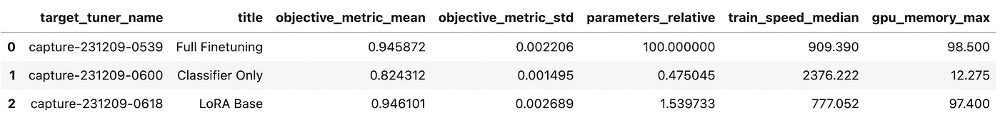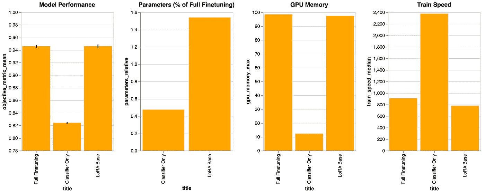

比较基准。 “模型性能”面板中的黑色条表示标准差。

上述所有场景已经运行了五次，图表中显示了平均性能。你也可以推断出，我们的“完整微调”场景的表现与 RoBERTa 论文中的性能接近。正如我们所希望的那样，“LoRA 基础”（调整所有线性模块）达到了相同的性能，但使用了更少的参数。场景“仅分类器”表现较差，符合预期，但在参数量上更便宜，训练速度也更快。

接下来，我们将以这些数字为基准，来对比未来的实验结果。

你可以在[附带的笔记本](https://github.com/marianokamp/peft_lora/blob/main/2a_lora_tuning_baselines.ipynb)中找到更多细节。

> **实验执行：**
> 
> 首先，对于每个基准，我们会搜索一个最优的 `*学习率*` 参数值。我们使用贝叶斯优化来高效地探索并利用搜索空间。
> 
> 其次，我们为某个场景找到的最佳超参数值可能不一定会重现出良好的结果。可能我们确定的超参数值只是相对于我们探索的其他值而言是最好的。也许我们找到的值根本不相关，例如模型在这个值范围内并不敏感？为了评估我们的发现是否可靠，对于每个场景，我们会重新运行最佳超参数组合五次，并报告在目标指标上观察到的标准差。

**LoRA 基础场景——第一次结果：** 很高兴看到，LoRA 微调方法中的“LoRA 基础”场景，尽管只使用了约 1%的参数，但其表现已与“完全微调”相当。此外，在这种方法中，我们正在**适配所有线性模块**，并使用相同的适配器大小（`r=8`）。这是一个简单的起点，尽管简单，但显然能产生良好的表现。

> **次要超参数：** 需要注意的是，我们主要搜索超参数`r`的良好值和我们希望适配的模块。为了简化，我们只调优非常少的额外超参数。对于基线来说，仅调优`learning rate`和`epochs`的数量。我们使用贝叶斯优化作为搜索策略，并利用 Amazon SageMaker 自动模型调优（AMT）。
> 
> 我们遵循参考文献中的指导来设置其他超参数，如`weight decay`和`dropout`。在本文中，我们将这些超参数保持固定，以便隔离定义 LoRA 架构的超参数的影响，从而更容易看出我们的主要超参数如何影响性能。
> 
> 亲爱的读者，您打算重复本文中的步骤吗？您是否旨在为自己的模型、任务和数据集找到最佳的超参数，并打算在生产中使用它们？如果是这样，那么将次要超参数也包含在内是有意义的。理想情况下，您应该在探索和调优工作的后期进行此操作——即当您已经显著缩小了搜索范围——然后努力进一步提高性能，哪怕只是略微提高。

# 超参数：需要调优什么？

让我们开始进行我们的主要活动。

在模型架构中的设计决策通常以超参数的形式表达。具体到 LoRA，我们可以定义**哪些**模块进行适配，以及每个模块的适配器`r`应该多大。

在上一篇文章中，我们仅建议根据我们对任务和架构的**理解**来选择这些模块。

现在，我们将深入探讨。我们应该在何处应用微调？

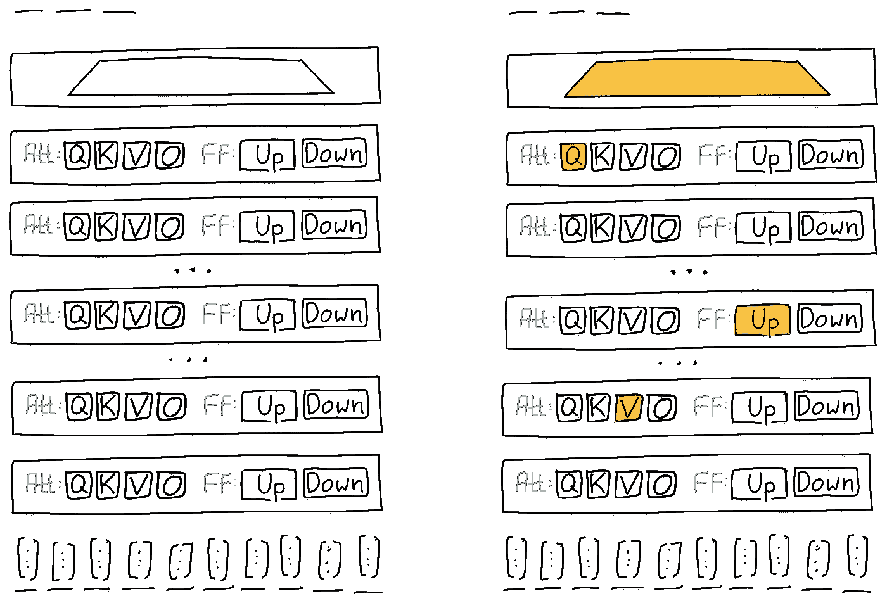

微调在哪里进行？分类器在顶部，变换器层次在中间，嵌入层在底部。左侧：可能的适配模块，右侧：示例选择。

在上面的插图中，左侧展示了我们可以微调的所有潜在模块——包括分类器和嵌入层。右侧是我为插图所做的一个示例选择。那么，如何做出实际选择呢？

让我们从一个高层次来看一下我们的选项：

+   **分类器** 很明显，我们绝对需要训练分类器。这是因为**它在预训练过程中没有被训练**，因此，对于我们的微调，它是随机初始化的。此外，它处于模型的核心位置，极大地影响着模型的性能，因为所有信息都必须经过它。它还对损失计算有最直接的影响，因为损失从分类器开始计算。最后，它的参数较少，因此训练起来也更高效。

    总结一下，我们始终微调分类器，但不对其进行调整（使用 LoRA）。

+   **嵌入层** 嵌入层位于底部——接近输入——并携带词元的语义信息。这对我们的下游任务非常重要。然而，它并非“空的”。**即使没有微调，我们也会得到所有预训练时学到的内容**。目前，我们正在考虑直接微调嵌入层是否能为我们带来额外的能力，以及我们的下游任务是否能从对词元意义的更细致理解中受益？

    让我们反思一下。如果是这样的话，是否这些额外的知识也可以在嵌入层上方的某一层学到，甚至更高效？

    最后，嵌入层通常有很多参数，因此我们需要在微调之前对它们进行调整。

    综合考虑这两个方面，我们决定放弃这个选项，不让嵌入层可训练（因此也不对其应用 LoRA）。

+   **变换器层

    微调所有变换器层中的所有参数是**低效的**。因此，我们需要至少通过 LoRA 调整它们，以提高参数效率。这使我们开始考虑，是否应该训练所有层及每一层中的所有组件？或者我们应该训练某些层、某些组件，或者是这些层和组件的特定组合？

    这里没有通用的答案。我们将根据这些层和它们的模块进行调整，并在本文中进一步探索细节。

在上面的插图中，右侧展示了一个典型的微调模块的选择。这只是其中一种组合，当然还有许多其他组合是可能的。请注意，插图中只显示了五层，而你的模型可能有更多层。例如，在我们示例中使用的 RoBERTa 基础模型就有**12**层，这在今天的标准下算是比较小的。每一层也包含**6**个组件：

+   注意：查询、键、值、输出

+   前馈：上、下

即使我们不考虑我们也希望调整`r`并且——目前——仅专注于是否包括哪些模块的二元决策，这将使我们每一层有 64（2**6）种组合。由于这仅看每一层的组合，而我们有 12 层可以组合，最终会得到超过[十六亿](https://en.wikipedia.org/wiki/Orders_of_magnitude_(numbers)#1021)种组合：

```py
In [1]: (2**6)**12.
Out[1]: 4.722366482869645e+21
```

很容易看出，我们**无法**穷尽所有的组合，更不用说手动探索这个空间了。

通常在计算机科学中，当我们想要探索一个过于庞大的空间而无法完全研究时，我们会借助掷骰子。但在这种情况下，我们可以从那个空间中进行抽样，但我们如何解读结果呢？我们会得到一组任意的层和组件的组合（至少是 12*6=72，参照上面的简单示例）。我们如何从这些细节中推广出符合我们自然理解的更高层次规则，以便找到与问题空间一致的规律呢？我们需要将这些细节与我们在更抽象层面的概念理解对齐。

因此，我们需要考虑**模块组**，并寻找可以在实验中使用的结构或模式，而不是操作一组单独的组件或层。我们需要培养一种直觉，了解事物应该如何运作，然后制定并测试假设。

问题：单独在定义好的参数组上进行实验有帮助吗？答案是肯定的。即使我们后来可能需要将一些参数组结合起来以获得最佳结果，这些独立的参数组仍然能指引我们前进。单独测试能让我们更清楚地看到影响的模式。

然而，存在一个风险。当这些模式组合使用时，它们的影响可能会发生变化。虽然这并不完美，但我们不要对此过于悲观 :) 我们需要从某个地方开始，然后在需要时优化我们的方法。

准备好了吗？让我们尝试一下。

## **垂直调整 / 层次调整**

我怀疑越靠近分类头的上层会比下层更具影响力。以下是我的思考：我们的任务是情感分析。这样想是合理的，对吧？大多数具体的决策必须要么在分类头中做出，要么接近分类头做出？比如识别某些短语（“我需要它就像我头上有个洞”）或构造的句子（“登记体验抵消了原本极好的服务”）。这表明，微调定义不同标记如何在上下文中组合成情感的网络参数至关重要，而不是在预训练期间改变单词的含义（在词向量中）。

即使情况并非总是如此，适应上层仍然提供了一个机会，可以覆盖或细化来自下层和词向量的决策。另一方面，这表明微调下层的重要性较小。

那个*听起来*像是一个值得尝试的坚实假设（*哦，未来的 Mariano 留言：不要在这里停止阅读*）。

> 顺便说一下，我们并没有反思嵌入层或任何变压器层的普遍必要性。这个决定已经做出：它们都已包含在预训练中，并将成为我们微调模型的一部分。我们此时考虑的是如何帮助模型最好地学习我们的下游任务，即情感分析。我们提出的问题是：我们应该微调哪些权重，以便产生影响并实现参数效率？

让我们来验证这个假设。

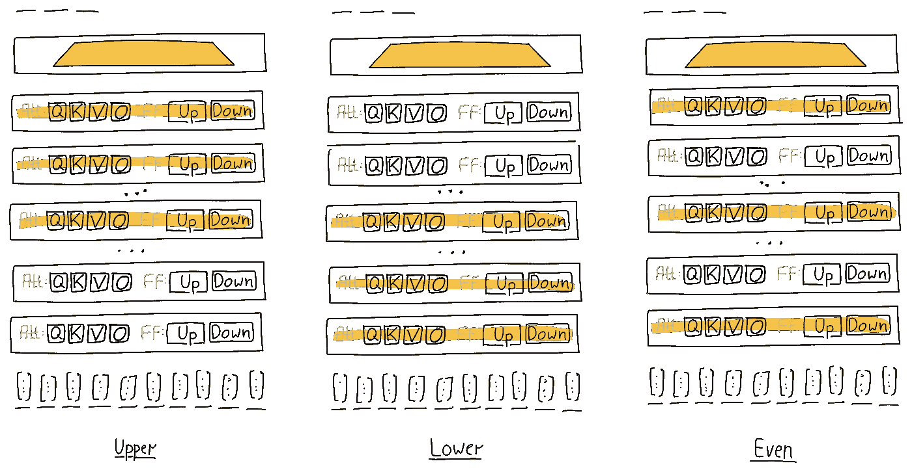

左侧：微调上半部分层。右侧：下半部分。右侧：均匀分布。

为了清晰地看到我们的假设效果，我们该与什么进行对比？让我们设计一些能夸大效果的实验：

+   在我们的第一个实验中，我们微调并调整了模型**上半部分**的所有组件，即我们示例中的第 7 至 12 层。这是我们的假设。

+   相比之下，我们运行了另一个实验，只微调模型的**下半部分**层。具体来说，我们训练了第 1 至第 6 层的所有组件。这与我们的假设相反。

+   让我们再考虑一个对比假设：对所有层进行轻微调整比仅调整顶层更有益。因此，我们还设计了第三个场景，其中我们微调了一半的层，但将它们**均匀**分布。

+   我们还包括了一个实验，在该实验中我们微调**所有**层（上图中未展示）。这不是一个公平的性能比较，因为我们训练了比前三个实验多两倍的参数。然而，正因如此，它凸显了我们在之前那些仅微调一半参数的实验中可能损失的性能。

总结一下，我们有 3+1 种场景要运行作为实验。以下是结果：

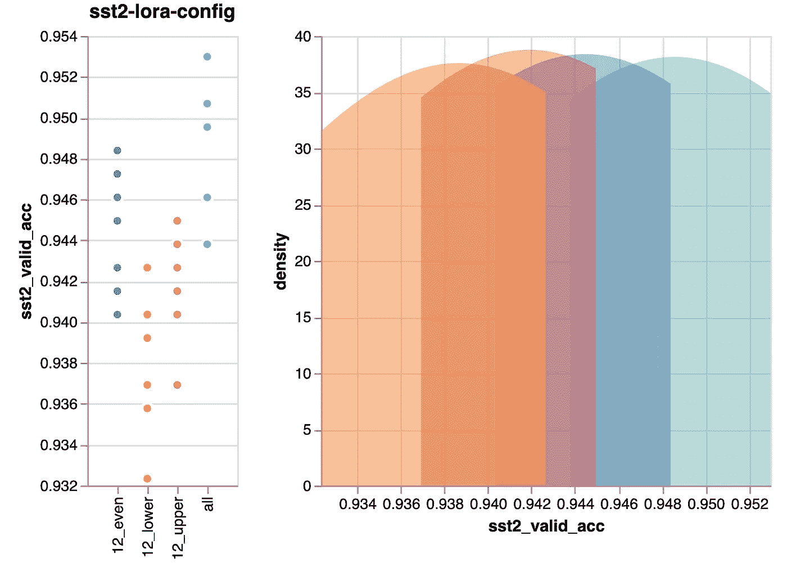

所有 3+1 场景概览。所有场景都运行了 7 次。有些试验得出了完全相同的结果，因此在图表的左侧无法区分，但在右侧的密度图中包含了这些结果。

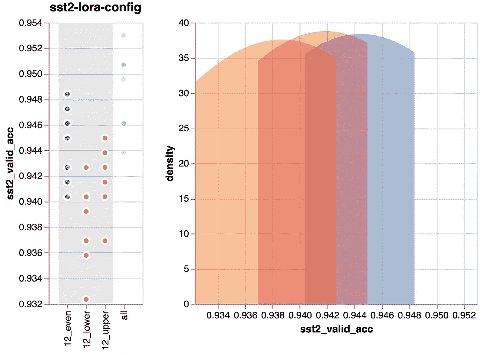

**下半部分**（橙色，~0.937）和**上半部分**（红色，~0.941）大致相同（查看密度图右侧的峰值以查看均值）。**均匀**（蓝色，~0.945）比**下半部分**/**上半部分**分别提高了~0.04/~0.08。

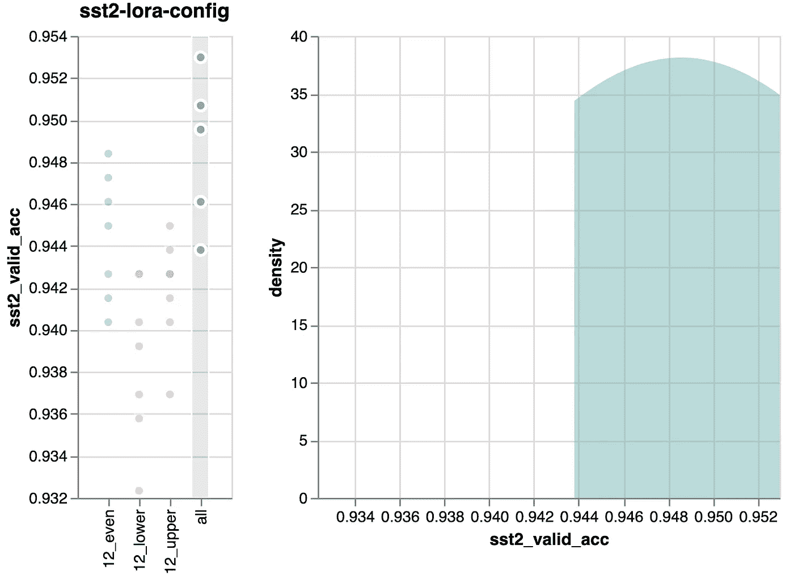

使用**所有**层（青色，~0.949）在平均表现上最好。然而，这只是一个比较点，代价是其他场景的两倍。

> **实验执行：**
> 
> 我们首先使用已经调优过的`*学习率*`、`训练周期数`。然后，我们针对场景设置（如`下层`、`上层`、`均匀`、`全部`）的不同值运行试验（训练运行）。在 AMT 中，我们将这些实验作为 **网格搜索**（Grid Search）进行。
> 
> 问题：网格搜索（Grid Search）以简单著称，但在寻找最佳解时效率较低。那么我们为什么还要使用它？
> 
> 让我们稍微退后一步。如果我们使用贝叶斯搜索（Bayesian Search）进行几次试验，我们很快就会发现哪些超参数值表现良好。这会使得后续的试验偏向这些值，即主要集中在已知的好值附近。虽然越来越多地利用我们从搜索空间中学到的内容是找到最佳值的好策略，但这种偏向性使得理解已探索空间变得困难，因为我们在早期表现较差的区域采样较少。
> 
> 使用网格搜索（Grid Search），我们可以精确地定义需要探索的参数值，从而使得结果更容易解读。
> 
> 事实上，如果你查看提供的代码，你会看到 AMT 会拒绝重复采样相同的值。但我们希望这样做，因此我们引入了一个虚拟变量，值从 0 到我们想要进行的试验次数。这是有帮助的，它允许我们重复试验相同的超参数值，从而估计该组合的标准差。
> 
> 虽然我们在上面已经为已经调优好的基准场景进行了 5 次试验，以查看我们能否重现所选超参数组合的结果，但在这里我们对每个组合进行了 7 次试验，以更精确地理解该组合的方差，进而看到微小的差异。
> 
> 相同的原则也适用于本文接下来的两个场景，之后将不再提及。

让我们先处理掉简单的部分：正如预期的那样，调节所有层，并因此使用双倍的参数量，能最显著地提高性能。这一提升在下方的图表中十分明显。

此外，所有场景的峰值，如右侧各个图表中的密度图所示，比较接近。当我们比较这些峰值时，它们代表了最常观察到的性能，我们只看到最差和最好的场景在验证准确度上大约有 0.08 的提升。这个提升并不大。因此，我们认为这可以忽略不计。

不管怎样，我们还是来检视一下我们最初的假设：我们（实际上是我）原本预计，微调上面的六层会比微调下面的六层带来更好的性能。然而，数据并不支持这一点。对于这个任务来说，微调哪一层并没有区别。因此，我需要更新我的理解。

我们有两个潜在的结论：

+   将层分布均匀要比集中在顶部或底部的层稍好一些。尽管如此，提升非常小，这一发现可能较为脆弱，并且可能不具有广泛的普适性，甚至对于同一模型的不同运行也不一定适用。因此，我们将放弃这一“发现”。

+   调整所有层，成本翻倍，带来略微更好的结果。然而，这一结果并不令人感到意外。尽管如此，确认这一点仍然很有意义，否则我们本可以找到节省可训练参数（即成本）的机会。

总体来说，了解这些信息是好的，但由于我们认为这些信息不可操作，我们将继续前进。如果你感兴趣，可以在这个[笔记本](https://github.com/marianokamp/peft_lora/blob/main/2b_lora_tuning_experiments_vertical_horizontal_r.ipynb)中找到更多细节。

## 横向调优 / 按组件调优

在每个变换器层中，我们有四个用于注意力的学习投影，这些投影在微调时可以进行调整：

+   Q — 查询，768 -> 768

+   K — 键，768 -> 768

+   V — 值，768 -> 768

+   O — 输出，768 -> 768

除此之外，我们在每个位置感知的前馈层中使用了两个线性模块，这些模块与上面的投影位于同一变换器层中：

+   Up — 向上投影，768 -> 3072

+   Down — 向下投影，3072 -> 768

从上面的数字中我们可以看到，前馈层（ff）**是**我们之前讨论的 QKVO 投影的**四倍**大小。因此，ff 组件可能会产生更大的影响，并且成本肯定更高。

除此之外，我们还能有什么其他的期望呢？很难说。我们从多查询注意力[3]中知道，查询投影尤为重要，但这种重要性是否适用于在我们的任务上**使用适配器的微调**（与例如预训练相比）呢？不如让我们尝试一下各个组件的影响，并根据这些结果继续前进。我们将能够看到哪些组件最强，或许这能帮助我们仅选择这些进行未来的调优。

让我们运行这些实验并检查结果：

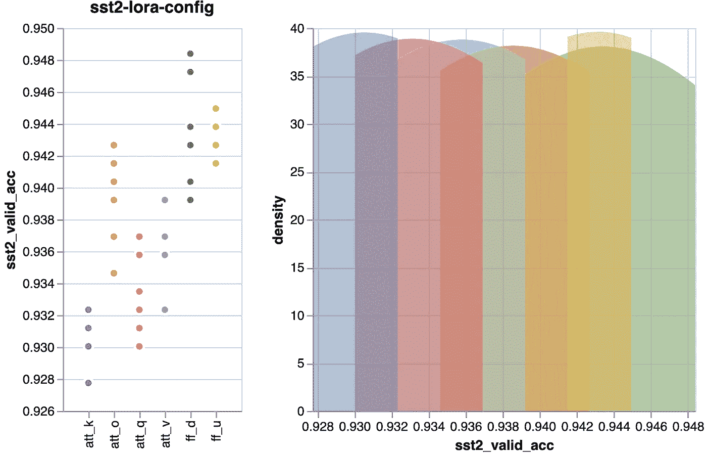

稍微明显一些。但我们也在混合使用 1x 参数（att_*）和 4x 参数（ff_*）。让我们深入分析。

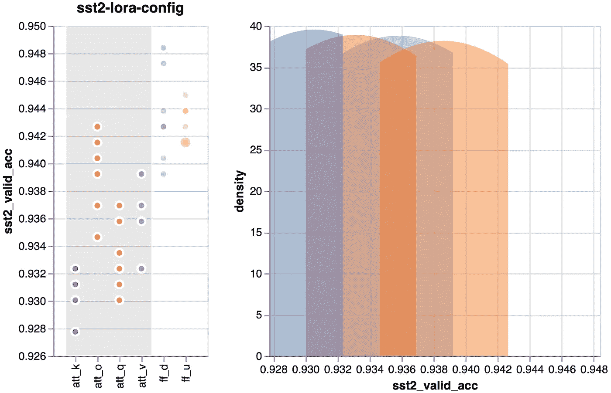

在注意力投影（1x）中，**q**（红色，约 0.933）和**k**（蓝色，约 0.931）的效果不如预期，**o**（橙色，约 0.939）和**v**（青色，约 0.937）看起来稍微好一些。然而，最差和最好的之间差距约为 0.08。

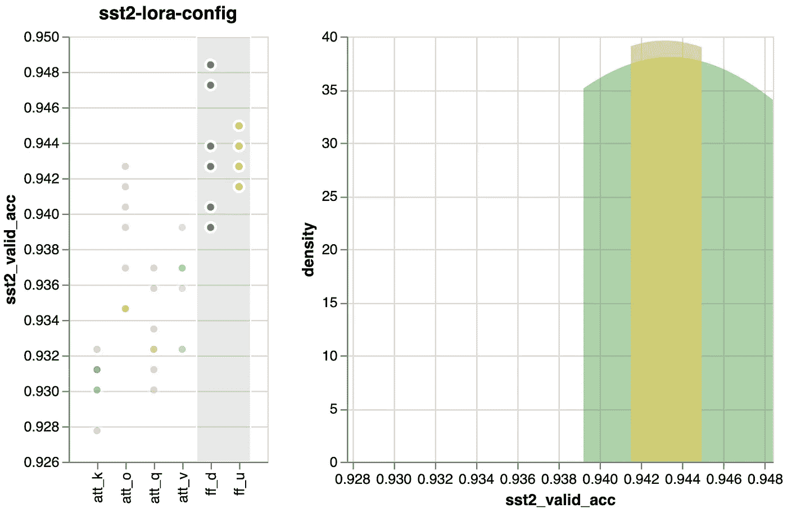

再次，更多的参数带来了更好的性能：前馈**向上**和**向下**投影的性能均在约 0.943 左右。

正如预期的那样，ff 层利用其四倍的尺寸优势，超越了注意力投影。然而，我们仍然可以看到这两组之间的差异。这些差异相对较小，如果你想利用它们，需要验证它们在特定任务中的适用性。

一个重要的观察是，**仅通过调整其中一个前馈层（约`0.943`），我们几乎就能达到调整所有模块后的表现**，**这一表现来自于“LoRA Base”场景（约`0.946`）**。因此，如果我们希望在整体性能和参数数量之间取得平衡，这可能是一个不错的策略。我们会将这一点考虑进最终的比较中。

在注意力投影（中间图）中，事实证明查询投影的影响并不像预期的那样显著。相反，输出和数值投影则更有用。然而，它们单独使用时，并不那么令人印象深刻。

到目前为止，我们已经看过各个组件的单独贡献。接下来，我们也要检查它们的影响是否重叠，或者组合组件是否能改善结果。

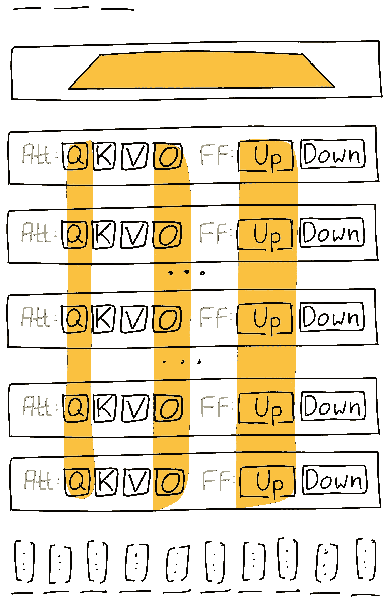

在**每一**层中，查询和输出投影的典范组合，以及上投影。

让我们运行一些可能的组合，看看是否能获得有用的信息。以下是结果：

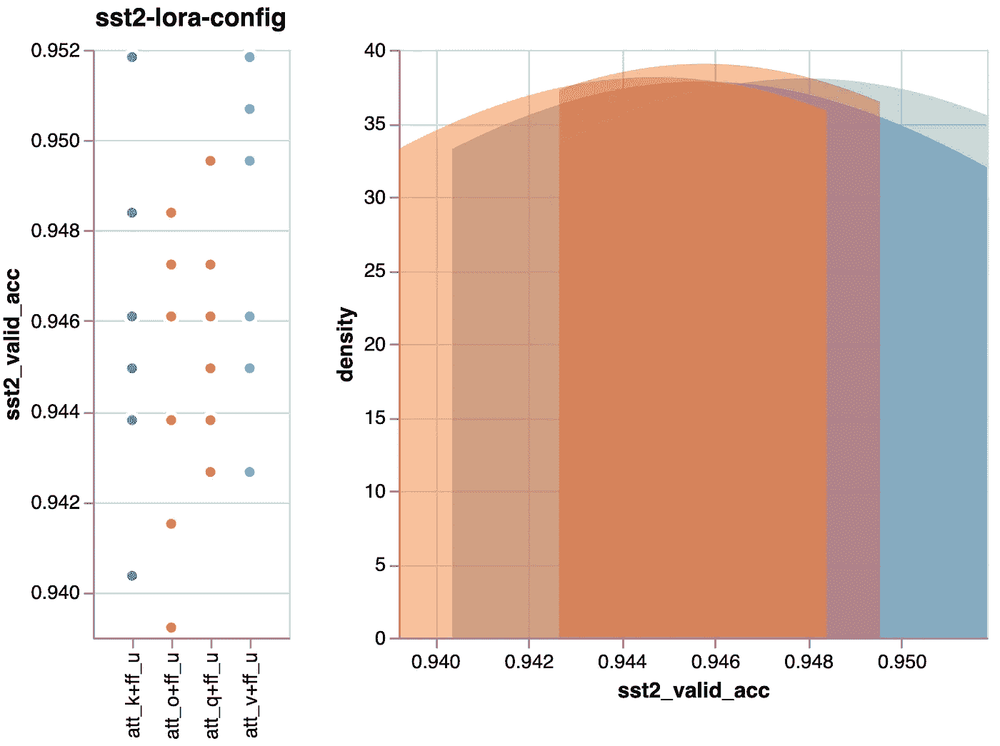

几个选定的注意力投影和前馈上投影的组合概览。让我们仔细看看最强的候选组合。

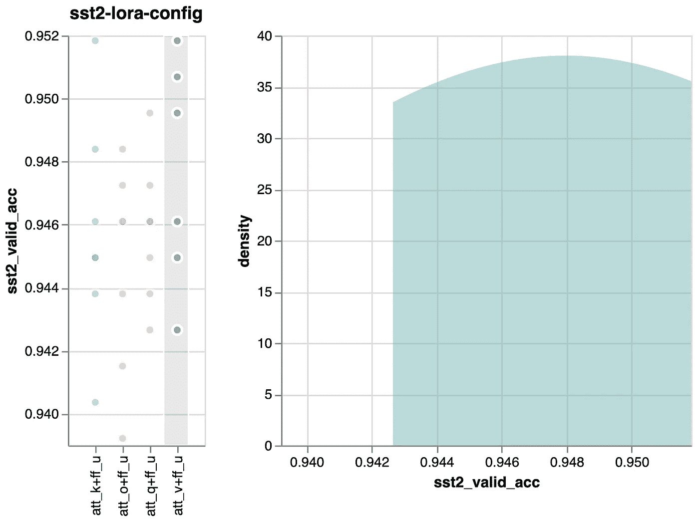

在约`0.948`的性能下，这种组合略微超越了“LoRA Base”场景的表现，但以较低的成本（参数数量）。

从上面的数字图表来看，第一个结论是我们没有出现性能退化。考虑到我们增加了更多的参数并组合了现有的组合，这应该是预期的结果。然而，组合设计决策时，组合后的表现有时可能会低于单独的表现。不过这里没有出现这种情况，真好！

我们不应该过度解读这些结果，但值得注意的是，当我们单独测试假设时，输出投影的性能略微优于数值投影的性能。而现在，在与逐位置的前馈上投影结合时，这种关系发生了逆转（现在：o+up ~`0.945`，v+up ~`0.948`）。

我们还将在之前的实验中看到，上投影已经几乎单独达到了该水平。因此，我们会保持一定的热情，但将这个场景包括在最终的比较中。即便如此，因为我们得到了一个略微优于调整和适配所有组件的“LoRA Base”场景的性能（约`0.946`），但参数更少。

你可以在这个[笔记本](https://github.com/marianokamp/peft_lora/blob/main/2b_lora_tuning_experiments_vertical_horizontal_r.ipynb)中找到更多细节。

# 调整`r`

我们从文献[2]中得知，建议使用较小的`r`值，这意味着`r`只是原始模块最小维度的一部分，例如使用`8`而不是`768`。不过，让我们自己验证一下这一点，并获取一些经验反馈。尽管有传统的观点，是否值得调查使用更大的`r`值呢？

在之前的实验中，我们使用了`r=8`并投入更多时间来调整`learning-rate`和训练的`epochs`数量。现在尝试不同的`r`值将显著改变线性模块的容量。理想情况下，我们会为每个`r`值重新调整`learning-rate`，但我们的目标是节约资源。因此，暂时我们坚持使用相同的`learning-rate`。然而，随着我们偏离已经调整好的`r=8`值，重新调整上述超参数的需求也会变得更强。

在审视结果时我们需要记住的一个考虑因素：

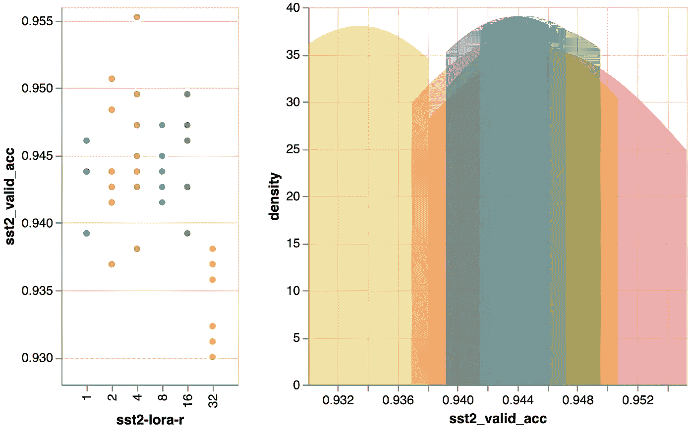

我们已经可以看到，如果我们大幅改变模型的容量，可能还需要调整学习率。同时，好的值之间非常接近（请查看右侧的峰值）。它们大约在~0.945，r=16（绿色）略高，约为 0.947。

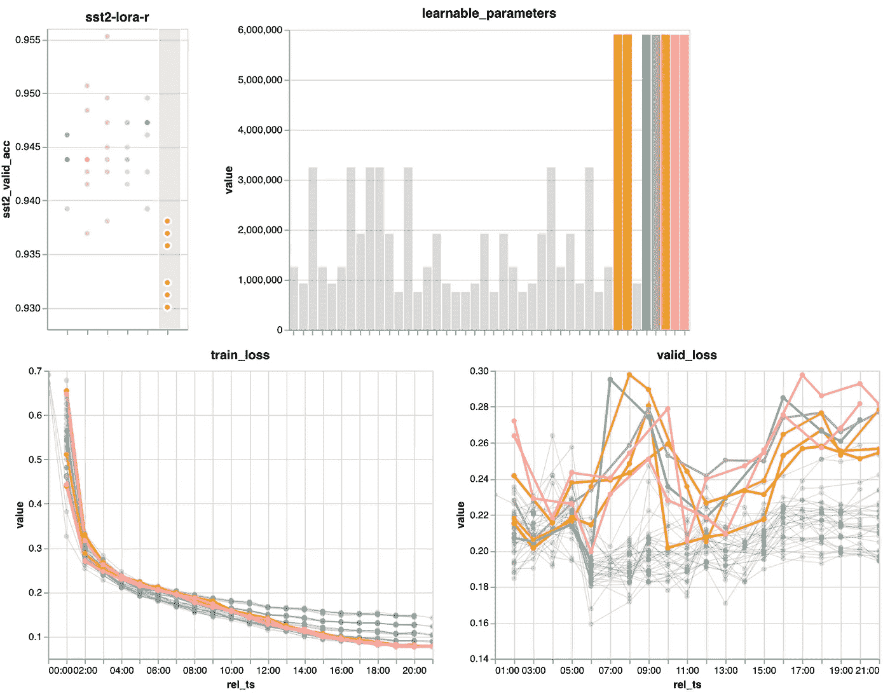

旁注：我们可以看到，当 r=32 时（在所有面板上都有突出显示），我们已经远离了调整好的超参数值。右上角：模型要大得多。左下角：训练损失下降，额外的容量导致最佳的训练损失。右下角：但验证损失却上升了。

在第一张图中，我们看到模型的性能对额外容量并不是特别敏感，在`r=4`和`r=8`时表现良好。`r=16`略好一点，但在参数数量上也更为昂贵。所以，让我们在最终的比较中保留`r=4`和`r=8`。

为了观察`r`对参数数量的影响，我们还将在最终的比较中包含`r=1`。

在上面的图中观察到一个奇怪的现象，那就是性能在`r=32`时急剧下降。提供一个使用残差连接的模型时，增加容量应该会带来与较小容量相同或更好的性能。但在这里显然并非如此。但是，由于我们为`r=8`调整了学习率，并且现在在`r=32`时有更多可学习的参数（请参见前述图中的右上角面板），我们也应该减少`learning-rate`，或者最好重新调整`learning-rate`和`epochs`的数量，以适应更大的容量。查看前述图中的右下角面板后，我们还应该考虑增加更多的正则化，以应对我们所看到的更明显的过拟合。

尽管在为模型提供更大容量时通常有潜力提高性能，但我们观察到的其他`r`值并未表明仅仅增加容量就能提高性能，而不显著增加参数数量。因此，我们将跳过追求更大的`r`。

更多细节请见此[笔记本](https://github.com/marianokamp/peft_lora/blob/main/2b_lora_tuning_experiments_vertical_horizontal_r.ipynb)。

# 最终比较

在这篇长文中，我们收集了大量的分析结果。为了整合这些发现，让我们在一个地方探讨并比较几种有趣的超参数组合。对于我们的目的，若某个结果能够提高模型的整体性能，或为我们提供关于模型工作原理的额外见解，从而最终增强我们的直观理解，那么该结果就被认为是有趣的。

所有实验都在 RoBERTa 基础模型上进行 sst2 任务的微调，如 RoBERTa 论文[1]中所示。

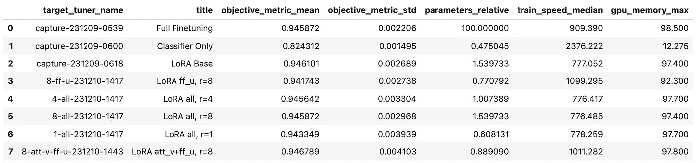

我们三个基准场景（列表顶部）和五个实验的表格概览。

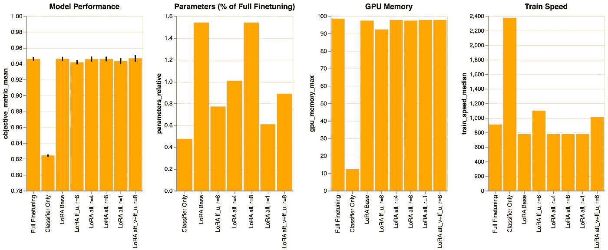

上述表格结果的图形表示。“模型性能”面板中的黑条表示标准差。

> **实验执行：** 如前所述，当我展示一个场景的结果时（在上表的“target_tuner_name”列中报告，并作为图表中的 y 轴标签），这是基于执行**相同的超参数组合**五次的结果。这使我能够报告目标指标的均值和标准差。

现在，让我们讨论一下上图所示场景中的一些观察结果。

**仅分类器**

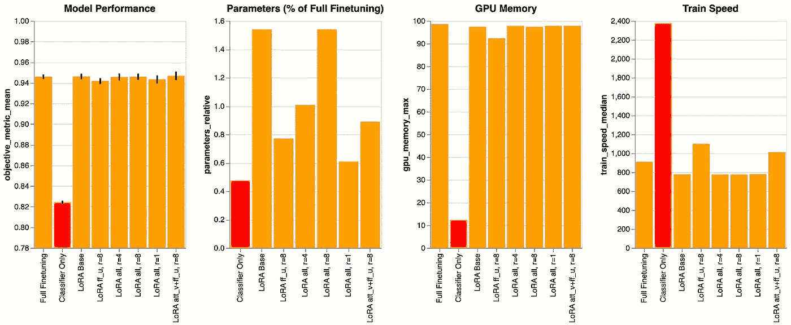

这个基准——我们只训练分类器头部——成本最低。参考`parameters_relative`，它表示与完全微调相比所需参数的百分比。第二面板展示了这一点，显示~0.5%是所有场景中参数数量最少的。

这对“GPU 内存”面板（其中值越低越好）产生了积极影响，尤其是在“训练速度”面板（其中值越高越好）上效果显著。后者表明，该场景是训练速度最快的，因为参数数量较少，而且因为没有添加额外的模块，在这个场景中需要处理的模块更少。

这作为一个信息性基础**基准，用于查看训练速度和 GPU 内存**的相对改进，但也突出了一种权衡：模型性能（第一面板）明显是最低的。

此外，这个场景揭示了 0.48%的全量微调参数代表了最小的参数数量。我们将这部分参数专门分配给分类器。此外，由于其他所有场景都微调了分类器，我们始终包括这 0.48%的参数，再加上在这些场景中进一步微调的其他参数。

**LoRA 基础**

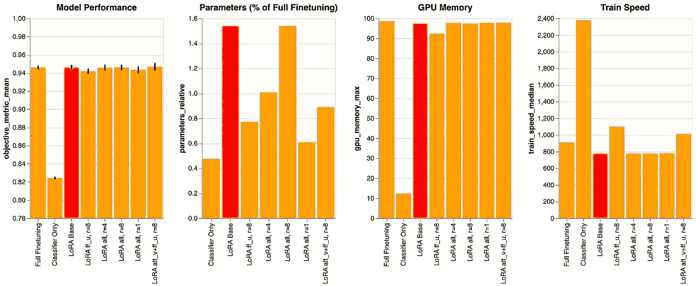

这个场景作为所有基准实验之外所有实验的基础。我们使用`r=8`，并对**所有****线性模块进行调整和微调**。

我们可以观察到，**模型性能与全量微调性能相匹配**。我们可能在这个案例中运气不错，但文献表明，我们可以期望仅用大约 1%的参数就能几乎匹配全量微调性能。在这里我们看到了这一点的证据。

此外，由于调整了所有线性模块，我们看到**训练速度是所有实验中最慢的**，而 GPU 内存利用率是所有场景中最高的，但与其他大多数场景一致。

**LoRA 全部，r={1,4,8}**

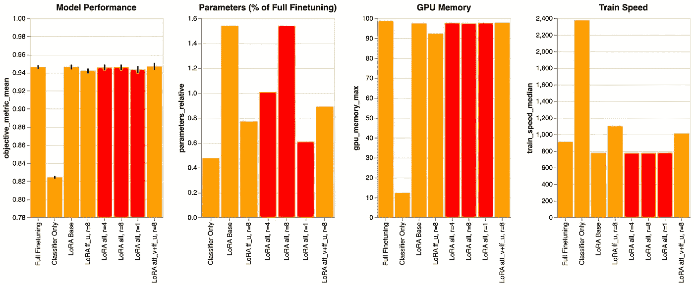

（不幸的是，在图表中我将条形图按 r=4、8、1 的顺序展示，但如果按 1、4、8 的顺序会更容易阅读）

总体而言，这些场景是“LoRA Base”的变体，但`r`值不同。**性能差异很小。**然而，正如预期的那样，`r`与参数数量之间存在正相关，而`r`与 GPU 内存利用率之间则有轻微的正相关。尽管后者如此，`r`的值仍然如此低，以至于对最终结果没有实质性影响，特别是对 GPU 内存使用的影响。这确认了我们在原始实验中逐个组件探讨的内容，如上所述。

然而，当回顾`r=1`时，我们发现这是一个特殊情况。在相对参数数量为 0.61%的情况下，我们仅比“仅分类器”场景的 0.48%稍高。但我们看到`r=1`的验证准确率约为 0.94，而“仅分类器”则为约 0.82。在总参数的 0.13%中，只有变换器层进行了调整，我们能够将模型的验证准确率提升约 0.12。砰！这令人印象深刻，因此，如果我们对低参数数量感兴趣，这可能是我们的赢家。

关于 GPU 内存利用率，我们稍后会再次审查。但简而言之，除了为模型中的每个参数、优化器和梯度分配内存外，我们还需要保留激活值，以便在反向传播时计算梯度。

此外，更大的模型将显示出选择较小`r`值的更大影响。

*值得一提的是，场景“LoRA all, r=8”使用了与“LoRA Base”相同的超参数值，但执行时是独立的。为了便于比较 r=1、r=4 和 r=8，仍然对该场景进行了评估。*

**LoRA ff_u**

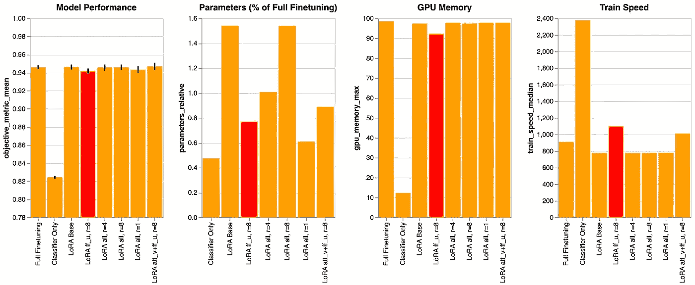

在这种情况下，我们仅调整每一层的逐位置前馈上投影。这导致了参数数量和需要适应的模块数量的减少。因此，数据显示出**训练速度的提升和 GPU 内存使用的减少**。

但我们也看到了一些性能损失。在“LoRA Base”中，我们看到了大约 0.946，而在这种情况下，我们只看到了大约 0.942，下降了约 0.04。

该[笔记本](https://github.com/marianokamp/peft_lora/blob/main/2e_lora_tuning_experiments_reproduction_summary.ipynb)中详细说明了比较。

# 附带说明：GPU 内存 / 梯度检查点

查看上面的 GPU 内存面板时，有两点非常明显：

**一 — LoRA 本身并不会显著减少内存占用**

这在**我们调整像 RoBERTa** **base**这种具有 1.25 亿参数的小模型时尤其明显。

在上一篇文章关于内在维度的部分中，我们了解到，对于当前一代模型（例如，具有 7B 参数的模型），`r`的绝对值甚至可能比较小的容量模型还要小。因此，**随着模型规模的增大，节省内存的效果将更加明显**。

此外，使用**LoRA 使得量化变得更加容易且高效**——完美契合。使用 LoRA 时，只有一小部分参数需要以高精度处理：这是因为我们更新的是适配器的参数，而不是原始模块的权重。因此，模型的大部分权重可以被量化，并以更低的精度使用。

此外，我们通常使用 AdamW 作为优化器。与 SGD 不同，SGD 只跟踪单一的全局学习率，AdamW 会跟踪每个参数的梯度和梯度的平方的移动平均值。这意味着，对于每个**可训练**的参数，我们需要跟踪两个值，这些值可能需要使用 FP32 表示。这个过程可能非常昂贵。然而，如前所述，使用 LoRA 时，我们只有少数几个参数是可训练的。这可以显著降低成本，从而使我们能够使用通常需要大量参数的 AdamW，即使在`r`值较大的情况下。

如果读者们有足够的兴趣，我们可能会在文章系列的第四部分中探讨这些方面。

**双 GPU 内存使用仅与参数数量间接相关**

如果参数数量和所需的 GPU 内存之间存在直接的线性关系，那该多好呢？不幸的是，图表中有几个发现表明，这并非易事。让我们找出原因。

首先，我们需要为模型本身分配内存，也就是存储**所有**参数。接着，对于**可训练的参数**，我们还需要存储优化器的状态和梯度（每个可训练参数单独存储）。此外，我们还需要考虑激活值的内存，这不仅取决于模型的参数和层，还取决于输入序列的长度。而且，至关重要的是要记住，我们需要保留前向传递过程中的激活值，以便在反向传播过程中应用链式法则进行[反向传播](https://ml-cheatsheet.readthedocs.io/en/latest/backpropagation.html)。

如果在反向传播过程中，我们每计算一个层的梯度时都重新计算该层的激活值，我们就不必将激活值保持那么长时间，从而节省内存，但代价是增加了计算量。

这种方法被称为[梯度检查点](https://aman.ai/primers/ai/grad-accum-checkpoint/)。能够节省的内存量取决于需要保留的额外激活内存量。重要的是要记住，反向传播涉及不断地应用链式法则，一步一步、层层推进：

> **总结——反向传播中的链式法则**
> 
> 在反向传播过程中，我们首先计算网络顶层（分类器）的误差，然后将误差传递回所有参与的**可训练参数**。这些参数会根据它们对误差的贡献进行调整，以便未来表现更好。我们通过不断应用链式法则来计算各参数的贡献，从顶层开始，沿着计算图向输入层遍历。这是必要的，因为低层的参数变化可能会影响到所有更高层的参数。
> 
> 为了计算局部梯度（每一步），我们可能需要获取所有步骤的激活值，这些步骤位于各个可训练参数和最顶层（应用于分类头的损失函数）之间。因此，如果我们有一个**位于顶层的参数（靠近分类头）**，我们需要维护的激活值就比训练较低层参数时所需的激活值少。对于较低层的参数，我们需要遍历更长的计算图来到达分类头，因此需要更多的内存来维持激活值。

在我们的特定模型和任务中，你可以看到下面的效果示意。我们为每一层训练一个独立的模型，在这个过程中，只有该特定层进行训练。通过这种方式，我们可以隔离层的相对位置的影响。然后，我们绘制每个模型以及每一层在训练过程中所需的 GPU 内存量。

在下面的图表中（见左侧面板），你可以看到，如果我们**靠近模型底部（即低层数）时，GPU 内存需求较低**，而如果我们靠近模型顶部（即高层数）时，损失发生的地方，内存需求较高。

启用梯度检查点后（见右侧面板），我们不再能识别到这种效果。我们不再在反向传播时保存激活值，而是在需要时重新计算它们。因此，左侧和右侧面板之间内存使用的差异就是我们在反向传播过程中维持的激活值。

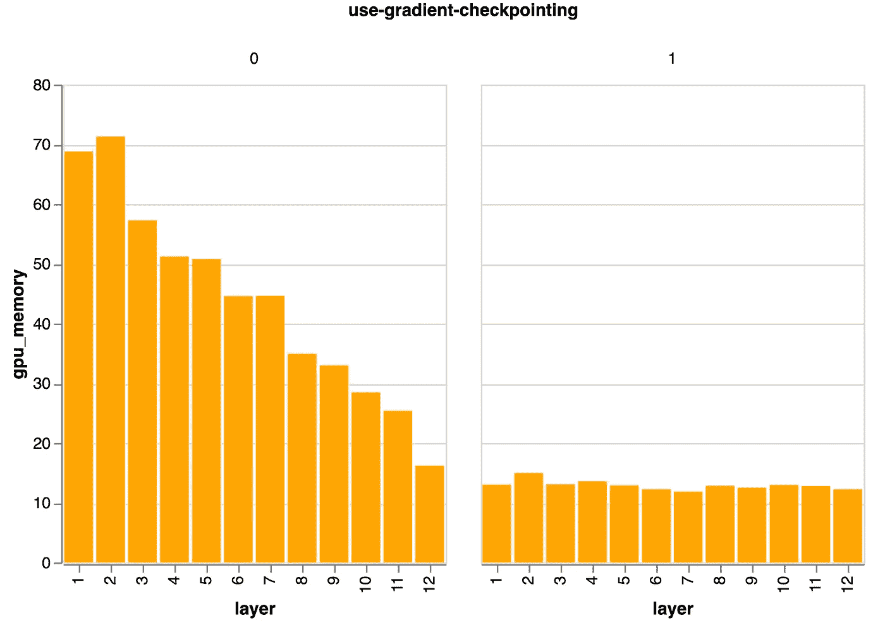

当我们远离输入层（第 1 层之前）并接近分类头（第 12 层之后）时，GPU 内存需求会减少。直到我们使用梯度检查点（右侧）。此时层的位置不再重要，因为我们不再为反向传播维护激活值。

> **实验执行：**
> 
> 和之前的实验一样，我使用了 AMT 和**网格搜索**来提供无偏的结果。

需要记住的是，反向传播过程中重新计算激活值是很慢的，因此**我们是在用计算速度与内存使用做权衡**。

关于测试的更多细节可以在这个[笔记本](https://github.com/marianokamp/peft_lora/blob/main/2d_lora_tuning_experiments_layers.ipynb)中找到。

我们可能会在本系列文章的第四部分重新讨论内存的话题，尽管这严格来说不是 LoRA 的主题。如果你感兴趣，请在下面的评论中告诉我。

# 结论

这确实是一个需要消化的内容。感谢你一直坚持到现在。希望你觉得这有价值，并且能够从高层次上确认**LoRA 有效**：它在只使用全微调约 1%参数的情况下，能够匹配全微调的性能。

但现在，让我们深入探讨一下细节：在应用 LoRA 时，针对**我们的**模型和**我们的**任务，探索超参数值时我们应该考虑哪些具体的**设计决策**？

**我们的方法**

我们提出了关于我们模型可能表现的几个假设，然后**收集了实证反馈来验证或否定这些假设**。我们选择这种方法，因为我们希望用已有的知识来指导实验的范围，而不是随意测试随机配置。

这种方法证明是有益的，因为解决方案空间很大，无法穷举探索。即使我们用已有的知识限定了实验范围，解释结果仍然具有挑战性。如果我们只是随机在这个庞大的空间中采样，可能会导致计算浪费和无结构的结果。这样的做法会使我们无法得出具有普遍性的结论，进而作出有意图的决策，这将是令人沮丧的。

我们学到了几件事，比如`r`的相对影响，它对参数数量、GPU 内存和训练速度的细微影响。我们还观察到，**可训练参数的数量本身并不能预测** **GPU 内存** **的使用量**。有趣的是，这些参数在网络架构中的位置起着至关重要的作用。此外，我们发现，当使用相同数量的参数时，使用多个 LoRA 模块的训练速度比仅使用一个模块时要慢。

**适配所有线性模块——一个实用的选择**

了解更多关于 LoRA 如何工作的知识是我们的两个目标之一。我们还旨在为我们的训练找到一组合适的超参数值。在这方面，我们发现，**适配所有线性模块**并使用较低的`r`值是一种**有效的策略**。这种方法具有良好的性能、适中的成本和**非常低的复杂性**，因此它是一个实用的选择。

当然，像训练任何神经网络一样，仍然需要关注`learning-rate`和`batch-size`等超参数。

我们都在研究这个主题的不同方面，但考虑到核心部分的重叠，以上的指导与 Sebastian Raschka 在[这篇](https://lightning.ai/pages/community/lora-insights)和[那篇](https://magazine.sebastianraschka.com/p/practical-tips-for-finetuning-llms)关于该主题的优秀文章中的发现非常一致，也与 Tim Dettmers 在 QLoRA 论文中的发现[3]相符。这些都是学习使用 LoRA 更多方面的宝贵资源。

[](https://lightning.ai/pages/community/lora-insights/?source=post_page-----12448e64524d--------------------------------) [## 使用 LoRA 和 QLoRA 微调 LLMs：数百次实验的见解 - Lightning AI

### LoRA 是目前最广泛使用的、参数高效的定制 LLM 训练微调技术之一。它通过节省…

[lightning.ai](https://lightning.ai/pages/community/lora-insights/?source=post_page-----12448e64524d--------------------------------) [](https://magazine.sebastianraschka.com/p/practical-tips-for-finetuning-llms?source=post_page-----12448e64524d--------------------------------) [## 使用 LoRA（低秩适配）微调 LLMs 的实用技巧

### 从数百次实验中学到的东西

[magazine.sebastianraschka.com](https://magazine.sebastianraschka.com/p/practical-tips-for-finetuning-llms?source=post_page-----12448e64524d--------------------------------)

**仔细选择模块子集——以更低的成本获得更好的性能**

另一方面，如果你愿意投入更多时间，你可以实现稍微更好的性能，以及**更低的训练时间和内存使用**。在选择要适配的模块时，我们发现，通过适配较少的模块，也能匹配适配所有模块的性能。

此外，我们发现将 LoRA 模块均匀分布在所有层上显然是提高模型性能的一个好选择。

对于我们的具体示例，我们通过调整前馈上投影和各层之间的注意力值投影，获得了最佳的性能和相对较低的成本：

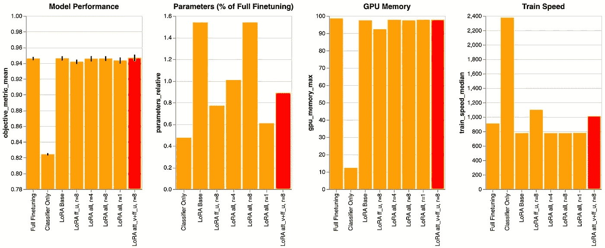

然而，对于不同的任务，我可能需要重新评估这个发现。

此外，在分析未来的任务时，我会留意是否仅仅适配上层即可获得良好的性能？这对于本文中的任务并未奏效，但我们之前看到，如果不这样做，GPU 内存利用率将大幅降低。

需要记住的一点是，训练神经网络本质上是一个嘈杂的过程，花时间不断确定最佳超参数可能会与改善其他潜在领域的努力相竞争。也许这些额外的时间会更好地投资于数据整理或增强整体反馈循环。我希望这篇文章展示了一种常识性的方法，在**探索成本和潜在回报之间取得平衡**。

另外，请记住，不要在我们这里讨论的具体模型和发现上过拟合。这只是一个玩具示例，并非业务部门要求的使用案例。没有人需要在 RoBERTa 上训练 sst-2 任务。

然而，请分享你在模型中遇到的经验，包括你觉得这篇文章可能误导了你的地方。

结束这个话题的最后一个思考。今后，我通常会从较低的`r`值开始。然后考虑预训练任务和微调任务之间的差异有多大。微调过程中需要的适配越大，`r`值应当越大。

此外，如果我能够识别出需要适配的地方——具体来说，哪些层或组件会受到最大影响——我将利用这些知识选择正确的模块进行适配及其相对的`r`值。

现在我们已经有了调优后的模型，接下来让我们继续进行部署。在接下来的文章中，我们将探讨如何使用适配器自然地实现创建多任务端点，并在创建每个任务的专用端点时显著提高非功能性属性。

感谢[Valerio Perrone](https://www.linkedin.com/in/valerio-perrone/)、[Ümit Yoldas](https://www.linkedin.com/in/%C3%BCmit-yoldas-23a908177/)、[Andreas Gleixner](https://www.linkedin.com/in/andreas-gleixner-1343902a2/)、[André Liebscher](https://www.linkedin.com/in/andre-liebscher/)、[Karsten Schroer](https://www.linkedin.com/in/karstenschroer/)和[Vladimir Palkhouski](https://www.linkedin.com/in/uladzimirpalkhouski/)在本文写作过程中提供的宝贵反馈。同时，感谢[Sourab Mangrulkar](https://www.linkedin.com/in/sourab-m/)和[帮助我](https://github.com/huggingface/transformers/issues/26221)了解如何使用 HF Trainer API 进行梯度检查点的[帮助](https://github.com/huggingface/transformers/issues/26221)。

头图由[Clipdrop](https://clipdrop.co/)制作。所有其他图片均由作者提供。

[1] [Yinhan Liu, Myle Ott, Naman Goyal, Jingfei Du, Mandar Joshi, Danqi Chen, Omer Levy, Mike Lewis, Luke Zettlemoyer, Veselin Stoyanov. RoBERTa：一种强优化的 BERT 预训练方法，2019](https://arxiv.org/abs/1907.11692)

[2] [Edward J. Hu, Yelong Shen, Phillip Wallis, Zeyuan Allen-Zhu, Yuanzhi Li, Shean Wang, Lu Wang, Weizhu Chen. LoRA：大语言模型的低秩适配，2021](https://arxiv.org/abs/2106.09685)

[3] [Noam Shazeer, 快速 Transformer 解码：一个写头就足够，2019](https://arxiv.org/abs/1911.02150)

[4] [Tim Dettmers, Artidoro Pagnoni, Ari Holtzmann, Luke Zettlemoyer: QLORA：量化 LLM 的高效微调，2023](https://arxiv.org/abs/2305.14314)
