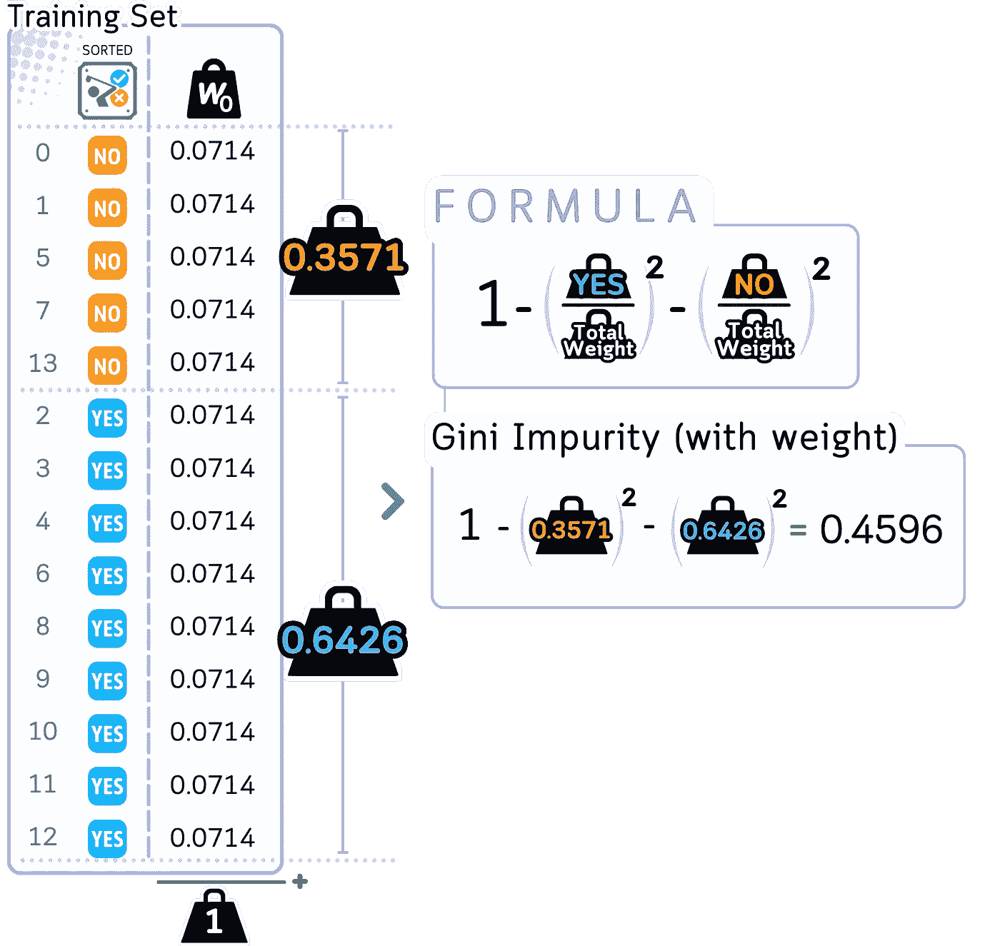
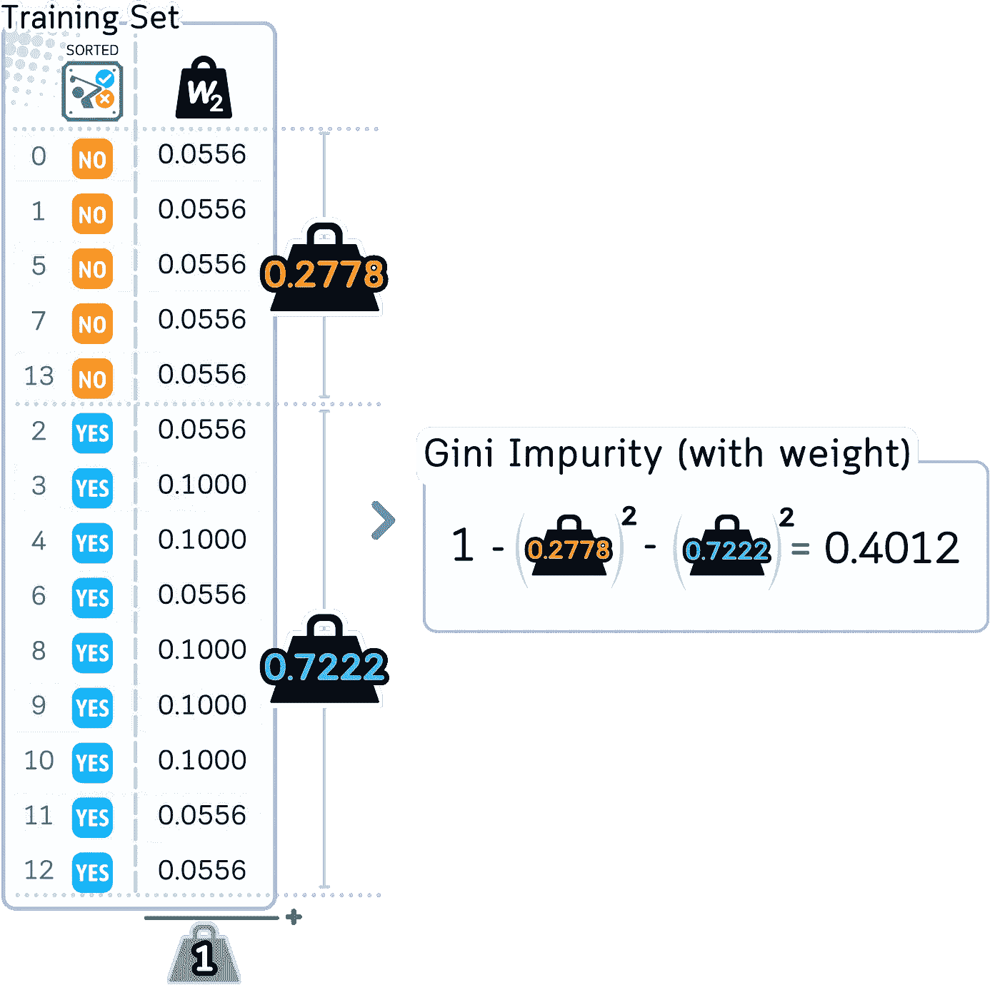

# AdaBoost 分类器解析：带代码示例的可视化指南

> 原文：[`towardsdatascience.com/adaboost-classifier-explained-a-visual-guide-with-code-examples-fc0f25326d7b?source=collection_archive---------1-----------------------#2024-11-10`](https://towardsdatascience.com/adaboost-classifier-explained-a-visual-guide-with-code-examples-fc0f25326d7b?source=collection_archive---------1-----------------------#2024-11-10)

## 集成学习

## **将权重放在弱学习器最需要的地方**

[](https://medium.com/@samybaladram?source=post_page---byline--fc0f25326d7b--------------------------------)[](https://towardsdatascience.com/?source=post_page---byline--fc0f25326d7b--------------------------------) [Samy Baladram](https://medium.com/@samybaladram?source=post_page---byline--fc0f25326d7b--------------------------------)

·发布于[Towards Data Science](https://towardsdatascience.com/?source=post_page---byline--fc0f25326d7b--------------------------------) ·阅读时长 11 分钟·2024 年 11 月 10 日

--

[](/random-forest-explained-a-visual-guide-with-code-examples-9f736a6e1b3c?source=post_page-----fc0f25326d7b--------------------------------) ## 随机森林解析：带代码示例的可视化指南

### 利用随机树做出惊人的预测

towardsdatascience.com

每个人都会犯错——即便是最简单的决策树也会在机器学习中出错。AdaBoost（自适应提升）算法并没有忽视这些错误，而是做了不同的事情：它从这些错误中学习（或*适应*），不断提升。

与随机森林不同，随机森林是同时构建多棵树，而 AdaBoost 则从一棵简单的树开始，识别它误分类的实例。然后，它构建新的树来修正这些错误，边学习边改进。

在这里，我们将具体说明 AdaBoost 是如何进行预测的，通过结合多个针对性的弱学习器逐步增强其预测能力，就像一项将专注的锻炼转化为全身力量的训练计划。


所有可视化图像：作者使用 Canva Pro 创建，已针对手机优化；在桌面上可能显示为过大。

# 定义

AdaBoost 是一种集成机器学习模型，通过加权的决策树序列来创建模型，通常使用浅层树（通常是单层“树桩”）。每棵树都在整个数据集上进行训练，但使用自适应的样本权重，这些权重给与之前被错误分类的样本更高的优先级。

对于分类任务，AdaBoost 通过加权投票系统将树结合起来，表现更好的树在最终决策中有更大的影响力。

该模型的优势来自于其自适应学习过程——尽管每棵简单的树可能是一个“弱学习器”，其表现仅比随机猜测稍好，但树的加权组合创建了一个“强学习器”，它**逐步聚焦并修正错误**。


AdaBoost 属于提升算法家族的一部分，因为它一次构建一棵树。每棵新树尝试修正之前树的错误。然后，它通过加权投票将各棵树的结果结合起来，做出最终的预测。

# 使用的数据集

在本文中，我们将以经典的高尔夫数据集作为分类的示例。


列：‘Outlook（经过独热编码为 3 列）’，‘Temperature’（以华氏度表示），‘Humidity’（以百分比表示），‘Windy’（是/否）和‘Play’（是/否，目标特征）

```py
import pandas as pd
import numpy as np
from sklearn.model_selection import train_test_split
# Create and prepare dataset
dataset_dict = {
    'Outlook': ['sunny', 'sunny', 'overcast', 'rainy', 'rainy', 'rainy', 'overcast', 
                'sunny', 'sunny', 'rainy', 'sunny', 'overcast', 'overcast', 'rainy',
                'sunny', 'overcast', 'rainy', 'sunny', 'sunny', 'rainy', 'overcast',
                'rainy', 'sunny', 'overcast', 'sunny', 'overcast', 'rainy', 'overcast'],
    'Temperature': [85.0, 80.0, 83.0, 70.0, 68.0, 65.0, 64.0, 72.0, 69.0, 75.0, 75.0,
                   72.0, 81.0, 71.0, 81.0, 74.0, 76.0, 78.0, 82.0, 67.0, 85.0, 73.0,
                   88.0, 77.0, 79.0, 80.0, 66.0, 84.0],
    'Humidity': [85.0, 90.0, 78.0, 96.0, 80.0, 70.0, 65.0, 95.0, 70.0, 80.0, 70.0,
                 90.0, 75.0, 80.0, 88.0, 92.0, 85.0, 75.0, 92.0, 90.0, 85.0, 88.0,
                 65.0, 70.0, 60.0, 95.0, 70.0, 78.0],
    'Wind': [False, True, False, False, False, True, True, False, False, False, True,
             True, False, True, True, False, False, True, False, True, True, False,
             True, False, False, True, False, False],
    'Play': ['No', 'No', 'Yes', 'Yes', 'Yes', 'No', 'Yes', 'No', 'Yes', 'Yes', 'Yes',
             'Yes', 'Yes', 'No', 'No', 'Yes', 'Yes', 'No', 'No', 'No', 'Yes', 'Yes',
             'Yes', 'Yes', 'Yes', 'Yes', 'No', 'Yes']
}
# Prepare data
df = pd.DataFrame(dataset_dict)
df = pd.get_dummies(df, columns=['Outlook'], prefix='', prefix_sep='', dtype=int)
df['Wind'] = df['Wind'].astype(int)
df['Play'] = (df['Play'] == 'Yes').astype(int)

# Rearrange columns
column_order = ['sunny', 'overcast', 'rainy', 'Temperature', 'Humidity', 'Wind', 'Play']
df = df[column_order]

# Prepare features and target
X,y = df.drop('Play', axis=1), df['Play']
X_train, X_test, y_train, y_test = train_test_split(X, y, train_size=0.5, shuffle=False)Main Mechanism
```

# 主要机制

下面是 AdaBoost 的工作原理：

1.  **初始化权重：** 为每个训练样本分配相等的权重。

1.  **迭代学习：** 在每一步，训练一棵简单的决策树并检查其表现。被错误分类的样本将获得更多的权重，使其成为下一棵树的优先考虑对象。正确分类的样本保持不变，所有权重都会调整，以确保它们的总和为 1。

1.  **构建弱学习器：** 每棵新的简单树都针对之前树的错误进行修正，创建了一系列专门化的弱学习器。

1.  **最终预测：** 通过加权投票将所有树的结果结合起来，每棵树的投票基于其重要性值，更准确的树会有更大的影响力。


AdaBoost 分类器通过使用许多简单的决策树（通常是 50 到 100 棵树）来进行预测。每棵树，称为“树桩”，专注于一个重要特征，如温度或湿度。最终的预测是通过结合所有树的投票来做出的，每棵树的投票根据该树的重要性（“alpha”）加权。

# 训练步骤

在这里，我们将遵循 SAMME（使用多类指数损失函数的阶段性加法建模）算法，这是 scikit-learn 中的标准方法，能够处理二分类和多分类问题。

1.1\. 决定要使用的弱学习器。默认选择是一棵单层决策树（或称“树桩”）。

1.2\. 决定要构建多少个弱学习器（在这个例子中是树的数量，默认是 50 棵树）。


我们从深度为 1 的决策树（树桩）开始作为我们的弱学习器。每个树桩仅做一次分裂，我们将顺序训练 50 个树桩，并在训练过程中调整权重。

1.3\. 从给每个训练示例相同的权重开始：

· 每个样本的权重 = 1/*N*（*N* 是样本总数）

· 所有权重加起来等于 1


所有数据点开始时的权重相同（0.0714），总权重加起来为 1。这确保了在训练开始时，每个示例都是同等重要的。

## 对于第一棵树

2.1\. 在考虑样本权重的情况下构建决策树桩


在进行第一次分裂之前，算法会检查所有数据点及其权重，以找到最佳的分裂点。这些权重影响每个示例在做出分裂决策时的重要性。

a. 计算根节点的初始加权基尼不纯度



算法计算根节点的基尼不纯度得分，但现在考虑了所有数据点的权重。

b. 对每个特征：

· 按特征值对数据进行排序（与决策树分类器中的操作完全相同）


对于每个特征，算法对数据进行排序并识别潜在的分裂点，完全类似于标准的决策树。

· 对每个可能的分裂点：

·· 将样本分为左组和右组

·· 计算两个组的加权基尼不纯度

·· 计算此分裂的加权基尼不纯度减少量


算法计算每个潜在分裂点的加权基尼不纯度，并将其与父节点进行比较。对于特征“sunny”（分裂点为 0.5），该不纯度减少量（0.066）显示了此分裂如何改善数据的分离。

c. 选择能够带来最大基尼不纯度减少的分裂点


在检查所有可能的特征分裂后，‘overcast’列（分裂点为 0.5）提供了最高的不纯度减少（0.102）。这意味着它是最有效的分类分离方式，因此成为第一次分裂的最佳选择。

d. 使用这个决策创建一个简单的单分裂树


使用找到的最佳分裂点，算法将数据分为两个组，每个组保持其原始权重。这个简单的决策树故意保持较小且不完美，使其仅略微优于随机猜测。

2.2\. 评估这棵树的好坏

a. 使用树来预测训练集的标签。

b. 将所有**误分类样本**的权重相加，得到误差率


第一棵弱学习器对**训练数据**进行预测，我们检查它在哪些地方犯了错误（标记为 X）。错误率为 0.357，显示这棵简单的树在一些预测上是错误的，这是可以预期的，并且有助于指导下一步的训练。

c. 使用以下公式计算树的权重 (*α*)：

*α* = 学习率 × log((1-错误)/错误)


使用错误率，我们计算树的影响分数（α = 0.5878）。较高的分数意味着树的准确性更高，这棵树因其良好的表现获得了适中的重要性。

2.3\. 更新样本权重

a. 对于正确分类的样本，保留原始权重

b. 将错误分类样本的权重乘以 e^(*α*)。

c. 将每个权重除以所有权重的总和。这一归一化过程确保所有权重仍然加和为 1，同时保持它们的相对比例。


树错误分类的情况（标记为 X）会在下一轮中获得更高的权重。增加这些权重后，所有权重会归一化，使得错误分类的样本在下一棵树中得到更多关注。

## 对于第二棵树

2.1\. 构建一个新的桩决策树，但这次使用更新后的权重

a. 计算根节点的新的加权基尼不纯度：

· 由于错误分类的样本权重较大，结果会有所不同

· 正确分类的样本现在具有较小的权重



使用更新后的权重（此时错误分类的样本权重更高），算法计算根节点的加权基尼不纯度。这将开始构建第二棵决策树的过程。

b. 对于每个特征：

· 与之前相同的过程，但权重已发生变化

c. 选择最佳的加权基尼不纯度减少划分

· 通常与第一棵树的划分完全不同

· 重点关注第一个树错误分类的样本


使用更新后的权重，不同的划分点展现出不同的效果。注意，“阴天”不再是最佳划分点——算法现在发现温度（84.0）给出的加权基尼不纯度减少最大，显示出权重变化如何影响划分选择。

d. 创建第二棵桩决策树


使用温度 ≤ 84.0 作为划分点，算法根据每组中总权重较大的类别来为每个叶节点分配 YES/NO，而不仅仅是通过计数示例。这种加权投票有助于纠正第一棵树的错误。

2.2\. 评估这棵新树

a. 使用当前权重计算错误率

b. 使用与之前相同的公式计算其重要性 (*α*)

2.3\. 再次更新权重 — 同样的过程：增加错误分类的权重，然后进行归一化。


第二棵树的错误率较低（0.222），且重要性得分较高（α = 1.253），与第一棵树相比。像之前一样，误分类的示例在下一轮会获得更高的权重。

## 从第三棵树开始

对所有剩余的树重复步骤 2.1–2.3。


该算法依次构建 50 棵简单的决策树，每棵树都有自己的重要性得分（α）。每棵树通过关注数据的不同方面来从之前的错误中学习，创建一个强大的组合模型。请注意，一些树（如树 2）在表现更好的时候会获得更高的权重得分。

**第 3 步：最终集成** 3.1\. 保留所有树及其重要性得分


这 50 棵简单的决策树作为一个团队共同工作，每棵树都有自己的重要性得分（α）。在进行预测时，具有较高α值的树（如树 2，α = 1.253）对最终决策的影响大于得分较低的树。

```py
from sklearn.tree import plot_tree
from sklearn.ensemble import AdaBoostClassifier
from sklearn.tree import plot_tree
import matplotlib.pyplot as plt

# Train AdaBoost
np.random.seed(42)  # For reproducibility
clf = AdaBoostClassifier(algorithm='SAMME', n_estimators=50, random_state=42)
clf.fit(X_train, y_train)

# Create visualizations for trees 1, 2, and 50
trees_to_show = [0, 1, 49]
feature_names = X_train.columns.tolist()
class_names = ['No', 'Yes']

# Set up the plot
fig, axes = plt.subplots(1, 3, figsize=(14,4), dpi=300)
fig.suptitle('Decision Stumps from AdaBoost', fontsize=16)

# Plot each tree
for idx, tree_idx in enumerate(trees_to_show):
    plot_tree(clf.estimators_[tree_idx],
              feature_names=feature_names,
              class_names=class_names,
              filled=True,
              rounded=True,
              ax=axes[idx],
              fontsize=12)  # Increased font size
    axes[idx].set_title(f'Tree {tree_idx + 1}', fontsize=12)

plt.tight_layout(rect=[0, 0.03, 1, 0.95])
```


每个节点显示其“值”参数，格式为[weight_NO, weight_YES]，表示该节点每个类别的加权比例。这些权重来自我们在训练过程中计算的样本权重。

## 测试步骤

用于预测：

a. 获取每棵树的预测结果

b. 将每个值乘以其重要性得分（*α*）

c. 将它们全部相加

d. 总权重较高的类别将作为最终预测


当预测新数据时，每棵树都会做出自己的预测，并将其乘以自己的重要性得分（α）。最终的决策来自于将所有加权投票结果相加——在这里，NO 类别获得了更高的总分（23.315 对 15.440），因此模型预测该示例为 NO。

## 评估步骤

构建完所有树之后，我们可以评估测试集。


通过反复训练和加权弱学习器来专注于误分类的示例，AdaBoost 创建了一个强大的分类器，能够实现高精度——通常比单一决策树或更简单的模型更好！

```py
# Get predictions
y_pred = clf.predict(X_test)

# Create DataFrame with actual and predicted values
results_df = pd.DataFrame({
    'Actual': y_test,
    'Predicted': y_pred
})
print(results_df) # Display results DataFrame

# Calculate and display accuracy
from sklearn.metrics import accuracy_score
accuracy = accuracy_score(y_test, y_pred)
print(f"\nModel Accuracy: {accuracy:.4f}")
```

# 关键参数

以下是 AdaBoost 的关键参数，特别是在`scikit-learn`中：

`estimator`：这是 AdaBoost 用来构建最终解决方案的基础模型。最常见的三种弱学习器是：

**a. 深度为 1 的决策树（决策树桩）**：这是默认的也是最流行的选择。由于它只有一个分裂，因此被认为是一个非常弱的学习器，仅比随机猜测略好，这正是提升过程所需要的。

**b. 逻辑回归**：逻辑回归（特别是高惩罚的情况下）也可以在这里使用，尽管它并不是一个真正的弱学习器。它对于具有线性关系的数据可能很有用。

**c. 小深度的决策树（例如，深度为 2 或 3）：**这些树比决策树桩稍微复杂一些。它们仍然相对简单，但可以处理比决策树桩稍微复杂一些的模式。


AdaBoost 的基模型可以是简单的决策树桩（深度=1）、小深度的树（深度为 2-3）或惩罚的线性模型。每种类型都保持简单，以避免过拟合，同时提供不同的方式来捕捉模式。

`n_estimators`：要组合的弱学习器数量，通常在 50 到 100 之间。超过 100 通常不会带来显著的改善。

`learning_rate`：控制每个分类器对最终结果的影响。常见的初始值有 0.1、0.5 或 1.0。较小的值（如 0.1）和稍微更高的`n_estimators`通常效果更好。

## 与随机森林的主要区别

由于随机森林和 AdaBoost 都使用多棵树，因此很容易混淆其中的参数。关键区别在于，随机森林是**独立**地（袋装法）结合多棵树，而 AdaBoost 是**一个接一个地**构建树以修正错误（提升法）。以下是它们差异的其他一些细节：

1.  没有`bootstrap`参数，因为 AdaBoost 使用所有数据，但权重会发生变化

1.  没有`oob_score`，因为 AdaBoost 不使用自助采样法

1.  `learning_rate`变得至关重要（在随机森林中不存在）

1.  树的深度通常保持非常浅（通常只是树桩），与随机森林的较深树不同

1.  焦点从并行独立树转移到顺序依赖树，这使得像`n_jobs`这样的参数变得不那么相关

# 优缺点

## 优点：

+   **自适应学习：**AdaBoost 通过增加对错误的权重来提升性能。每棵新树会更加关注它之前做错的难例。

+   **抗过拟合：**尽管它会一个接一个地添加更多的树，但 AdaBoost 通常不会过于专注于训练数据。这是因为它使用加权投票，因此没有任何一棵树能过多地控制最终的答案。

+   **内置特征选择：**AdaBoost 自然地找出哪些特征最重要。每棵简单的树都会选择该轮中最有用的特征，这意味着它在训练时会自动选择重要特征。

## 缺点：

+   **对噪声敏感：**由于 AdaBoost 给错误更多的权重，它可能会在数据杂乱或错误时出现问题。如果一些训练样本标签错误，它可能会过于关注这些错误样本，从而使整个模型变得更差。

+   **必须是顺序的：**与随机森林可以同时训练多棵树不同，AdaBoost 必须一次训练一棵树，因为每棵新树需要知道前一棵树的表现。这使得训练速度较慢。

+   **学习率敏感性：**虽然它的调整项比随机森林少，但学习率确实影响其效果。如果学习率过高，模型可能会过拟合训练数据。如果学习率过低，则需要更多的树才能取得良好的效果。

# 最后的备注

AdaBoost 是一种关键的提升算法，许多新方法都从中汲取了灵感。它的主要思想——通过关注错误来变得更好——帮助塑造了许多现代机器学习工具。虽然其他方法试图一开始就做到完美，但 AdaBoost 则试图表明，有时候解决问题的最佳方式是从错误中学习并不断改进。

AdaBoost 最适用于二分类问题，并且当数据清晰时表现最佳。虽然随机森林可能更适用于更一般的任务（例如预测数字）或杂乱的数据，但在正确使用的情况下，AdaBoost 可以产生非常好的结果。人们在多年后仍然使用它，足以证明其核心思想的有效性！

# 🌟 AdaBoost 分类器代码概述

```py
import pandas as pd
import numpy as np
from sklearn.model_selection import train_test_split
from sklearn.metrics import accuracy_score
from sklearn.ensemble import AdaBoostClassifier
from sklearn.tree import DecisionTreeClassifier

# Create dataset
dataset_dict = {
    'Outlook': ['sunny', 'sunny', 'overcast', 'rainy', 'rainy', 'rainy', 'overcast', 
                'sunny', 'sunny', 'rainy', 'sunny', 'overcast', 'overcast', 'rainy',
                'sunny', 'overcast', 'rainy', 'sunny', 'sunny', 'rainy', 'overcast',
                'rainy', 'sunny', 'overcast', 'sunny', 'overcast', 'rainy', 'overcast'],
    'Temperature': [85.0, 80.0, 83.0, 70.0, 68.0, 65.0, 64.0, 72.0, 69.0, 75.0, 75.0,
                   72.0, 81.0, 71.0, 81.0, 74.0, 76.0, 78.0, 82.0, 67.0, 85.0, 73.0,
                   88.0, 77.0, 79.0, 80.0, 66.0, 84.0],
    'Humidity': [85.0, 90.0, 78.0, 96.0, 80.0, 70.0, 65.0, 95.0, 70.0, 80.0, 70.0,
                 90.0, 75.0, 80.0, 88.0, 92.0, 85.0, 75.0, 92.0, 90.0, 85.0, 88.0,
                 65.0, 70.0, 60.0, 95.0, 70.0, 78.0],
    'Wind': [False, True, False, False, False, True, True, False, False, False, True,
             True, False, True, True, False, False, True, False, True, True, False,
             True, False, False, True, False, False],
    'Play': ['No', 'No', 'Yes', 'Yes', 'Yes', 'No', 'Yes', 'No', 'Yes', 'Yes', 'Yes',
             'Yes', 'Yes', 'No', 'No', 'Yes', 'Yes', 'No', 'No', 'No', 'Yes', 'Yes',
             'Yes', 'Yes', 'Yes', 'Yes', 'No', 'Yes']
}
df = pd.DataFrame(dataset_dict)

# Prepare data
df = pd.get_dummies(df, columns=['Outlook'], prefix='', prefix_sep='', dtype=int)
df['Wind'] = df['Wind'].astype(int)
df['Play'] = (df['Play'] == 'Yes').astype(int)

# Split features and target
X, y = df.drop('Play', axis=1), df['Play']
X_train, X_test, y_train, y_test = train_test_split(X, y, train_size=0.5, shuffle=False)

# Train AdaBoost
ada = AdaBoostClassifier(
    estimator=DecisionTreeClassifier(max_depth=1), # Create base estimator (decision stump)
    n_estimators=50,        # Typically fewer trees than Random Forest
    learning_rate=1.0,      # Default learning rate
    algorithm='SAMME',      # The only currently available algorithm (will be removed in future scikit-learn updates)
    random_state=42
)
ada.fit(X_train, y_train)

# Predict and evaluate
y_pred = ada.predict(X_test)
print(f"Accuracy: {accuracy_score(y_test, y_pred)}")
```

## 进一步阅读

对于 [AdaBoostClassifier](https://scikit-learn.org/stable/modules/generated/sklearn.ensemble.AdaBoostClassifier.html) 及其在 scikit-learn 中的实现，读者可以参考官方文档，文档提供了有关其用法和参数的详细信息。

## 技术环境

本文使用 Python 3.7 和 scikit-learn 1.6。尽管所讨论的概念普遍适用，但具体的代码实现可能会因不同版本而略有不同。

## 关于插图

除非另有说明，所有图像均由作者创作，并结合了 Canva Pro 的授权设计元素。

𝙎𝙚𝙚 𝙢𝙤𝙧𝙚 𝙀𝙣𝙨𝙚𝙢𝙗𝙡𝙚 𝙇𝙚𝙖𝙧𝙣𝙞𝙣𝙜 𝙝𝙚𝙧𝙚:


[Samy Baladram](https://medium.com/@samybaladram?source=post_page-----fc0f25326d7b--------------------------------)

## 集成学习

[查看列表](https://medium.com/@samybaladram/list/ensemble-learning-673fc83cd7db?source=post_page-----fc0f25326d7b--------------------------------)4 篇故事

𝙔𝙤𝙪 𝙢𝙞𝙜𝙝𝙩 𝙖𝙡𝙨𝙤 𝙡𝙞𝙠𝙚:


[Samy Baladram](https://medium.com/@samybaladram?source=post_page-----fc0f25326d7b--------------------------------)

## 分类算法

[查看列表](https://medium.com/@samybaladram/list/classification-algorithms-b3586f0a772c?source=post_page-----fc0f25326d7b--------------------------------)8 篇故事
