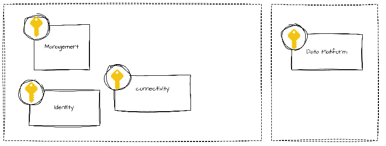

# Azure 数据平台在云中的着陆区

> 原文：[`towardsdatascience.com/adapting-the-azure-landing-zone-for-a-data-platform-in-the-cloud-f1c405c0d638?source=collection_archive---------4-----------------------#2024-08-16`](https://towardsdatascience.com/adapting-the-azure-landing-zone-for-a-data-platform-in-the-cloud-f1c405c0d638?source=collection_archive---------4-----------------------#2024-08-16)

 [Mariusz Kujawski](https://medium.com/@mariusz_kujawski?source=post_page---byline--f1c405c0d638--------------------------------)

·发布于 [Towards Data Science](https://towardsdatascience.com/?source=post_page---byline--f1c405c0d638--------------------------------) ·7 分钟阅读·2024 年 8 月 16 日

--

处理敏感数据或在高度监管的环境中工作需要为数据处理提供安全的云基础设施。云可能看起来像是互联网中的一个开放环境，因此会引发安全问题。当你开始使用 Azure 且没有足够的资源配置经验时，很容易犯设计和实施的错误，这些错误可能会影响新数据平台的安全性和灵活性。在这篇文章中，我将描述为 Azure 中的数据平台设计云适配框架时最重要的方面。

作者插图

# 什么是 Azure 着陆区？

Azure 着陆区是部署公共云资源的基础。它包含构建强大平台所需的关键元素，这些元素包括网络、身份和访问管理、安全性、治理和合规性。通过实施着陆区，组织可以简化基础设施配置过程，确保使用最佳实践和指导方针。

Azure 着陆区是一个遵循关键设计原则的环境，用于支持应用迁移、现代化和开发。在 Azure 中，订阅用于隔离和开发应用程序和平台资源。这些资源按以下类别进行分类：

+   **应用着陆区**：专门用于托管特定应用资源的订阅。

+   **平台着陆区**：包含共享服务的订阅，例如为应用着陆区提供的身份、连接性和管理资源。

这些设计原则帮助组织在云环境中成功运营并扩展平台。

图像来自作者

# 在 Azure 中实施数据平台

在 Azure 中实现数据平台需要一个高级架构设计，在该设计中选择资源用于数据摄取、转化、提供和探索。第一步可能需要设计一个着陆区。如果您需要一个遵循最佳实践的安全平台，从着陆区开始至关重要。这将帮助您在订阅和资源组内组织资源，定义网络拓扑，并通过 VPN 确保与本地环境的连接，同时遵循命名约定和标准。

## 架构设计

为数据平台量身定制架构需要仔细选择资源。Azure 提供了多种适用于数据平台的原生资源，如 Azure Synapse Analytics、Azure Databricks、Azure 数据工厂和 Microsoft Fabric。这些可用服务提供了多种实现类似目标的方式，允许在架构选择上提供灵活性。

例如：

+   **数据摄取：** Azure 数据工厂或 Synapse 管道。

+   **数据处理：** Azure Databricks 或 Synapse 中的 Apache Spark。

+   **数据分析：** Power BI 或 Databricks 仪表板。

我们可以使用 Apache Spark 和 Python，或者低代码的拖放工具。通过这些工具的不同组合，我们可以根据我们的技能、使用案例和能力创建最合适的架构。

高级架构（图像来自作者）

Azure 还允许您使用其他组件，如 Snowflake，或者使用开源软件、虚拟机（VM）或 Kubernetes 服务（AKS）创建您自己的组合。我们可以利用 VM 或 AKS 配置数据处理、探索、编排、AI 或 ML 的服务。

**典型的数据平台结构**

一个典型的 Azure 数据平台应该包括几个关键组件：

1. 用于将数据从来源摄取到 Azure 存储帐户的工具。Azure 提供像 Azure 数据工厂、Azure Synapse 管道或 Microsoft Fabric 这样的服务。我们可以使用这些工具从数据源收集数据。

2. 数据仓库、数据湖或数据湖屋：根据您的架构偏好，我们可以选择不同的服务来存储数据和业务模型。

+   对于数据湖或数据湖屋，我们可以使用 Databricks 或 Fabric。

+   对于数据仓库，我们可以选择 Azure Synapse、Snowflake 或 MS Fabric 数据仓库。

3. 在 Azure 中编排数据处理时，我们可以使用 Azure 数据工厂、Azure Synapse 管道、Airflow 或 Databricks 工作流。

4. 数据转化可以通过 Azure 的各种服务来处理。

+   对于 Apache Spark：Databricks、Azure Synapse Spark 池和 MS Fabric Notebooks，

+   对于基于 SQL 的转换，我们可以在 Databricks、Azure Synapse 或 MS Fabric 中使用 Spark SQL，在 SQL Server、MS Fabric 或 Synapse Dedicated Pool 中使用 T-SQL。或者，Snowflake 提供所有 SQL 功能。

## 订阅

平台设计的一个重要方面是根据业务单元和软件开发生命周期规划订阅和资源组的分割。可以为生产环境和非生产环境使用不同的订阅。通过这种区分，我们可以实现更灵活的安全模型，为生产和测试环境分别设定策略，并避免配额限制。

订阅组织（图像由作者提供）

## 网络

虚拟网络类似于在数据中心中运行的传统网络。Azure 虚拟网络（VNet）为您的平台提供了基础安全层，禁用资源的公共端点将大大降低丢失密钥或密码时发生数据泄漏的风险。如果没有公共端点，存储在 Azure 存储帐户中的数据只有在连接到您的 VNet 时才可以访问。

与本地网络的连接支持 Azure 资源与本地数据源之间的直接连接。根据连接类型，通信流量可能通过互联网的加密隧道或专用连接进行传输。

为了提高虚拟网络内的安全性，您可以使用网络安全组（NSG）和防火墙来管理进出流量规则。这些规则允许您根据 IP 地址、端口和协议来过滤流量。此外，Azure 还支持在子网、虚拟网络和本地网络以及互联网之间路由流量。使用自定义路由表可以控制流量的路由方向。

网络配置（图像由作者提供）

## **命名规范**

命名规范为平台资源的名称建立了标准化，使其更加自我描述并易于管理。这种标准化有助于在 Azure 门户中浏览不同的资源并进行过滤。一个明确的命名规范可以让您快速识别资源的类型、目的、环境和 Azure 区域。这种一致性在您的 CI/CD 流程中可能非常有利，因为可预测的名称更容易参数化。

考虑到命名规范，您应该考虑需要捕捉的信息。标准应易于遵循、一致且实用。值得包括的元素有：组织、业务单元或项目、资源类型、环境、区域和实例编号。您还应该考虑资源的范围，以确保在其上下文中名称是唯一的。对于某些资源，如存储帐户，名称必须在全球范围内唯一。

例如，Databricks 工作区的命名格式可以如下所示：

命名约定（图片由作者提供）

示例缩写：

图片由作者提供

一个全面的命名约定通常包括以下格式：

+   **资源类型：** 表示资源类型的缩写。

+   **项目名称：** 项目的唯一标识符。

+   **环境：** 资源支持的环境（例如：开发、QA、生产）。

+   **区域：** 资源部署的地理区域或云提供商。

+   **实例：** 用于区分同一资源的多个实例的编号。

# 基础设施实施

通过 Azure 门户实现基础设施看似简单，但通常每个资源涉及大量详细步骤。高度安全的基础设施将需要资源配置、网络设置、私有端点、DNS 区域等。像 Azure Synapse 或 Databricks 这样的资源还需要额外的内部配置，例如设置 Unity Catalog、管理秘密作用域和配置安全设置（用户、组等）。

配置完测试环境后，你需要将相同的配置复制到 QA 和生产环境中。这时容易出错。为了最小化可能影响开发质量的错误，建议使用基础设施即代码（IasC）方法进行基础设施开发。IasC 允许你通过 Terraform 或 Biceps 将云基础设施作为代码进行创建，从而能够以一致的配置部署多个环境。

在我的云项目中，我使用加速器快速启动新的基础设施设置。微软也提供了可以使用的加速器。将基础设施作为代码存储在版本库中，提供了额外的好处，如版本控制、跟踪变更、进行代码审查，以及与 DevOps 管道集成，以管理和推动跨环境的变更。

# 概述

如果你的数据平台不处理敏感信息，并且你不需要高度安全的数据平台，你可以创建一个更简单的设置，允许公共互联网访问，而无需虚拟网络（VNet）、VPN 等。然而，在高度监管的领域中，需要完全不同的实施方案。这个方案将涉及与组织内的各种团队合作——如 DevOps、平台和网络团队——甚至可能需要外部资源。

你需要建立一个安全的网络基础设施、资源和安全性。只有当基础设施准备好后，才能开始与数据处理开发相关的活动。

*如果你觉得这篇文章有启发性，欢迎通过点击“鼓掌”按钮或在 LinkedIn 上点赞来表达你的感谢。你的支持对我来说非常重要。如有任何问题或建议，欢迎通过* [*LinkedIn*](https://www.linkedin.com/in/mariusz-kujawski-812bb1103/)* 与我联系。*
