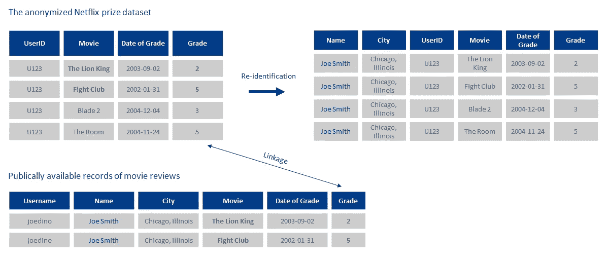
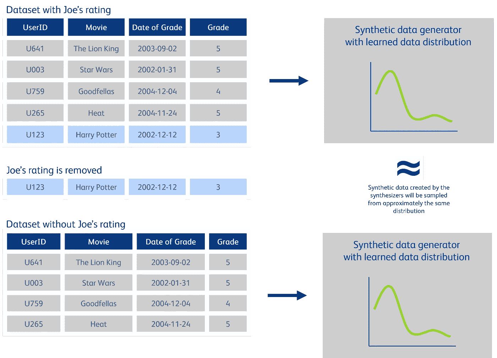

# 生成方法在匿名化中的应用将彻底改变数据共享和隐私保护。

> 原文：[`towardsdatascience.com/adaption-of-generative-methods-for-anonymization-will-revolutionize-data-sharing-and-privacy-d35b6fe704a2?source=collection_archive---------10-----------------------#2024-01-17`](https://towardsdatascience.com/adaption-of-generative-methods-for-anonymization-will-revolutionize-data-sharing-and-privacy-d35b6fe704a2?source=collection_archive---------10-----------------------#2024-01-17)

## 摆脱围绕大语言模型和基础模型的生成 AI 热潮，让我们来探讨由传统生成 AI 模型创建的合成数据如何准备迎接主流应用。

 [Arne Rustad](https://arnerustad.medium.com/?source=post_page---byline--d35b6fe704a2--------------------------------)

·发表于[Towards Data Science](https://towardsdatascience.com/?source=post_page---byline--d35b6fe704a2--------------------------------) ·阅读时间 10 分钟·2024 年 1 月 17 日

--

由 Arne Rustad 使用 DALLE-3 生成的图像。

**数据如同黄金一样宝贵，负责任地共享数据为组织和社会带来了巨大的机遇与挑战。为了在伦理上处理数据并避免法律后果，组织必须确保不侵犯那些提供数据的个人的隐私**。**尽管数据共享具有巨大的潜力，但传统的匿名化方法已逐渐无法应对我们信息饱和的数字时代所带来的挑战。通过利用先进的生成方法，我们可以创建既符合隐私要求又保持原始数据实用性的合成数据。加入我们，一起揭开这扇通向丰富数据机会的大门。**

本文中，我们特别强调了合成数据在商业环境中的应用，解决了我们在现有文献中发现的一个空白。虽然我们在这里的重点是企业领域，但合成数据的洞见和应用对其他参与数据共享的组织和个人同样具有重要意义，尤其是在研究社区中。

# 为什么你需要匿名化呢？

匿名化的目标是通过使数据与特定个人无法关联或至少极不可能关联，从而防止个人重新识别。匿名化数据并在分享前处理它，具有内在的道德价值，因为它尊重个人隐私。但随着公众对数据使用的关注日益增加，政府也引入了更严格的法规（如[GDPR](https://gdpr.eu/what-is-gdpr/)、[CCPA](https://oag.ca.gov/privacy/ccpa)等），这已经成为所有组织需要关注的事情，除非他们愿意冒着巨大的声誉损失、诉讼和罚款的风险。

与此同时，如果不敢充分利用大数据和数据共享的潜力，组织将面临忽视重大商业机会、创新进展和潜在成本节约的风险。这也阻碍了我们解决更大社会问题的能力。利用匿名化数据提供了一种安全且合规的方式来挖掘数据的价值，因为它不受 GDPR 等法规的限制。

# 被低估的匿名化挑战

数据匿名化的任务是一个复杂且常常被低估的挑战。许多人认为匿名化只需要去除直接标识符，如姓名、社会保障号和地址。然而，人的身份往往比常见的假设更加易于辨识。在 2000 年进行的一项开创性研究中，计算机科学家 Latanya Sweeny 证明了仅凭三项信息——出生日期、性别和邮政编码——就可以唯一识别 87%的美国人口¹。跨越到更近的时代，2019 年《自然》期刊发表的一项研究进一步强调了这一点，揭示在一个包含 700 万人的数据库中，仅 15 个数据点就足以识别其中 99.98%的人²。

> 在大数据时代以及我们无论是自愿还是非自愿地分享个人信息的时代，数据匿名化比最初看起来更为脆弱和具有风险。

为了使数据集充分匿名化，它不仅必须在单独分析时具有较低的重新识别风险，而且在与网络上自由可用的所有其他信息交叉引用时，也应具有较低的风险。这些信息包括公开的数据库、我们在社交平台上自由分享的个人细节，甚至可能包括被盗的、在暗网上可获取的关于我们的敏感信息。换句话说，一个匿名化的数据集还必须能抵抗关联攻击。

# Netflix 在数据匿名化失败中的不愉快经历应该成为警钟

2006 年，Netflix 为了增强其电影推荐算法，发布了他们认为是匿名化数据集的公开竞赛。该数据集包含了来自 480,000 个用户对 18,000 部电影的评分。尽管用户已被匿名化，并且故意在数据中插入了系统性错误，但这一举措仍然不足以保证隐私安全。德克萨斯大学的研究人员发布了一篇论文，展示了如何通过与 IMDB 上公开的电影评分进行交叉引用，轻松地重新识别出许多用户，从而无意中暴露了用户完整的电影观看历史。

这起事件看似无害，但请记住，我们的电影口味有时可以揭示我们个人生活中的深层次信息，比如性取向或政治信仰。因此，当 Netflix 在 2009 年尝试发起类似的竞赛时，他们因集体诉讼而被迫取消，突显了其中涉及的严重隐私风险³。

图 1：简化示例，展示了如何在 Netflix 竞赛数据集上进行数据关联。*请注意，论文中的方法并不依赖于精确匹配。图由作者创建。*

在回顾与匿名化相关的挑战后，不难理解，传统的匿名化技术通常需要非常具有侵入性才能勉强有效。由于传统方法通过去除或模糊化原始数据中的信息来实现匿名化，结果往往会导致数据效用的巨大损失。

# 合成数据——传统匿名化的替代方案

人工智能已经被用于创建合成数据很长时间了，但变分自编码器（VAE）、生成对抗网络（GAN）和扩散模型分别在 2013 年、2014 年和 2015 年的发明，标志着创建真实合成数据的重要里程碑。从那时起，科学界的许多渐进式进展使我们能够精确捕捉数据集中的复杂统计模式，无论这些数据是表格型的、时间序列的、图像形式的，还是其他格式。

上述模型属于生成方法。生成方法是一类机器学习技术，通过捕捉现有数据的模式和结构，可以创建新的数据。它们不仅仅是复制现有的数据，而是创造出独特且多样化的例子，这些例子在潜在特征和关系方面与原始数据相似。可以把它想象成一种新一代的数据，就像每一代人类都与他们的祖先相似一样。

通过 OpenAI 的聊天机器人 Chat-GPT 和图像生成器 DALLE-2，生成方法成功地进入了主流公众视野。人们对这些工具能够有效地完成许多人认为只有人类智力和创造力才能完成的任务感到惊讶。这使得生成性 AI 成为今年最常用的热词之一。尽管这些新的基础模型具有革命性的潜力，甚至可能改变我们的社会，但传统的生成方法依然扮演着至关重要的角色。Gartner 估计，到 2030 年，合成数据将在 AI 模型中完全超越真实数据⁴，尤其是在特定数据集的数据共享和数据增强方面，传统方法如 GAN、VAE 和扩散模型（非基础性模型）至少在目前仍然是最佳选择。

> 与传统的匿名化技术不同，生成方法不会破坏有价值的信息。

生成方法的合成数据因此提供了一个最佳解决方案，结合了两者的优势。先进的生成方法能够学习现实数据中固有的复杂模式，使得它们能够生成逼真但虚构的新样本。这有效避免了传统方法在一对一映射到原始数据集时所面临的风险。从整体上看，统计特性得以保留，这意味着我们可以像操作真实数据一样与这些合成数据集进行互动，无论是用于计算汇总统计还是训练机器学习模型。

# 合成数据将为多个行业创造价值

使用 AI 生成的合成数据为隐私受限的企业提供了解决方案，使得数据共享成为可能，这在过去由于隐私问题而困难重重。这些行业包括但绝不限于：

+   **医疗健康：** 目前，研究人员通常面临着访问真实患者数据的漫长而繁琐的过程，极大地拖慢了医学进展的步伐。合成医疗记录为加速医学研究并保护患者隐私提供了变革性的解决方案。此外，生成合成数据为解决医疗数据集中的偏差提供了有效途径，通过有意增强代表性不足的群体，从而促进更具包容性的研究成果。

+   **金融服务：** 交易数据本质上是敏感且可识别的，这在金融领域带来了独特的挑战。合成数据成为关键解决方案，能够在有效解决隐私问题的同时，实现内部和外部数据共享。此外，合成数据还可以用于增强有限或不平衡的数据集，特别是在增强欺诈检测和反洗钱工作方面具有重要作用。

一般来说，所有企业都可以利用合成数据集来提升隐私保护，我们鼓励你思考合成数据如何具体对你产生帮助。为了帮助你理解合成数据的潜力，我们提供了一些精选的应用案例：

+   **第三方共享：** 在公司需要第三方分析客户或用户数据的场景中，合成数据集提供了一个可行的替代方案，以避免共享敏感信息。这种方法在选择阶段特别有益，尤其是在评估多个外部合作伙伴时，或者为了启用项目的快速启动，绕过共享真实数据所需的耗时法律程序。

+   **内部数据共享：** 即使在内部，处理敏感信息的共享，如员工和人力资源数据，往往由于严格的法规而具有挑战性。合成数据提供了一种解决方案，使公司领导能够在确保员工隐私的前提下，改善内部知识转移和数据共享。这一方法对于处理含有敏感客户信息的数据集同样具有优势。通过使用合成数据，组织可以更广泛地在公司内部分发这些数据集。通过扩展共享，这种方法使更多的组织成员能够参与问题解决和决策制定，从而提升整体效率与协作，同时充分尊重隐私。

+   **延长数据洞察的保留时间：** 根据 GDPR 的严格规定，组织需要在用户数据完成预定处理目的后，或根据用户请求删除数据。然而，这一合规要求可能带来丧失数据中宝贵洞察的风险。合成数据为这一挑战提供了创新的解决方案。它在遵守法律要求的同时，保留了原始数据的本质和实用性，从而确保数据的价值得以保留，用于未来的分析和人工智能驱动的工作。

# 将合成数据与隐私增强测试和技术结合起来是未来的强大推动力。

合成数据作为解决数据隐私和可访问性挑战的有前景的解决方案，尽管如此，它并非完美无缺。生成模型的准确性至关重要；如果模型调校不当，可能导致合成数据无法充分反映现实条件，或者在某些情况下，合成数据过于接近原始数据集，从而危及隐私。意识到这一点，已经开发出强有力的方法来验证合成数据的输出质量，既考虑其实用性，也考虑隐私性。这些关键的评估对于有效利用合成数据至关重要，确保敏感信息不会无意中泄露。大多数知名的合成数据提供商都认识到这一必要性，并在其过程中内建了质量保证措施。

一个有前景的增强方式是将差分隐私与合成数据生成器相结合。差分隐私是隐私的严格数学定义，如果正确使用，它能提供强有力的保障，确保在统计分析过程中个人隐私得到保护。

> 差分隐私模型是通过在训练或推理过程中融入差分隐私技术来设计的机器学习模型，旨在保护隐私。

这对于包含明显异常值的数据集，或者需要保证更高隐私级别的情况特别有利。差分隐私模型还支持共享数据生成器模型本身，而不仅仅是其生成的合成数据。然而，重要的是要强调，这种共享需要在模型训练过程中应用差分隐私方法。相比之下，标准数据生成器通常不能安全共享，因为它们在接受旨在提取信息的先进机器学习技术时，可能无意中泄露敏感信息。

图 2：使用 Netflix 示例可视化合成数据生成中的差分隐私。图表由作者创建。

在图 2 中，我们以 Netflix 数据集为例，展示了差分隐私模型的原理。这里的核心思想是，通过差分隐私数据生成器来限制单个数据记录对学习数据分布的影响。简单来说，如果我们在同一数据集上重新训练模型，去除某个个体的数据，那么最终的数据显示不会有显著的偏差。单个观测值的最大影响是差分隐私模型的一个可量化参数。这导致了隐私和效用之间的权衡，但通常可以找到一个令人满意的折中方案，确保隐私和效用都能得到充分的保障。

# AI 生成的合成数据已经准备好迎接主流应用

合成数据正在迅速确立自己作为增强隐私的重要技术，预计将在现代数据管理中成为主流。它的作用不仅仅是保护隐私，还能作为通向丰富的未开发数据潜力的桥梁——这一前景正被许多具有前瞻性的企业所利用。在本文中，我们突出了合成数据在促进安全数据共享方面的优势。然而，它在数据增强中的潜力也许更令人兴奋。通过支持数据填充和重平衡，合成数据可以显著提高机器学习算法的效率，有效地以最小的成本和努力提供显著的附加价值。我们邀请您探索合成数据如何在多种方式上转变您的业务运营。

# 关于作者

[**Arne Rustad**](https://www.linkedin.com/in/arne-rustad/) 是奥斯陆 BearingPoint 的数据科学家，参与多个生成型人工智能项目，拥有丰富经验。他的硕士论文研究了表格数据的合成数据生成，提出了一种新的生成对抗网络（GAN）模型，达到了最先进的性能。Arne 获得了挪威科技大学（NTNU）物理学与数学硕士学位。电子邮件地址：arne.rustad@bearingpoint.com。

[**Helene Semb**](https://www.linkedin.com/in/helene-semb-705888160/) 是奥斯陆 BearingPoint 的数据科学家，拥有计算机视觉和物体检测方面的机器学习经验。Helene 最近获得了挪威科技大学（NTNU）控制学与机器人学硕士学位。电子邮件地址：helene.semb@bearingpoint.com。

# 参考文献

[1] L. Sweeney, [简单的 demographic 信息通常能唯一识别个人](https://privacytools.seas.harvard.edu/sites/projects.iq.harvard.edu/files/privacytools/files/paper1.pdf)（2000 年），《健康》（旧金山）

[2] L. Rocher, J. Hendrickx 和 Y. De Montjoye, [使用生成模型估计在不完整数据集中的重新识别成功率](https://www.nature.com/articles/s41467-019-10933-3;)（2019 年），《自然通讯》

[3] Wired, [Netflix 因隐私诉讼取消推荐竞赛](https://www.wired.com/2010/03/netflix-cancels-contest/)（2010 年 3 月 12 日）

[4] Gartner, [合成数据是人工智能的未来吗？](https://www.gartner.com/en/newsroom/press-releases/2022-06-22-is-synthetic-data-the-future-of-ai)（2022 年 6 月 22 日）
