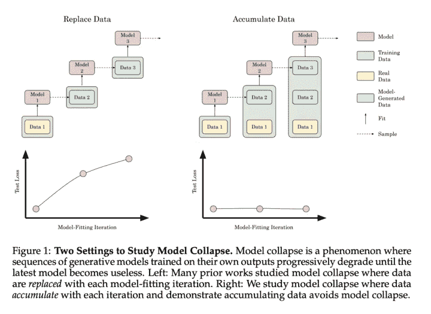
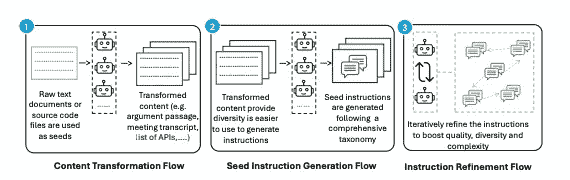
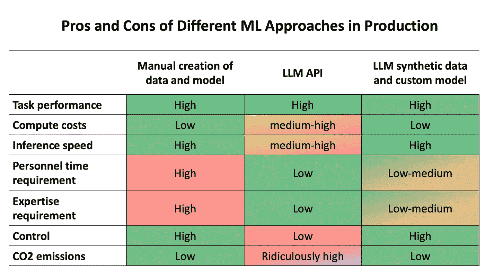

# 解决人工智能中来自合成数据的模型崩溃问题

> 原文：[`towardsdatascience.com/addressing-concerns-of-model-collapse-from-synthetic-data-in-ai-7cd380208d14?source=collection_archive---------4-----------------------#2024-08-05`](https://towardsdatascience.com/addressing-concerns-of-model-collapse-from-synthetic-data-in-ai-7cd380208d14?source=collection_archive---------4-----------------------#2024-08-05)

 [Alexander Watson](https://medium.com/@zredlined?source=post_page---byline--7cd380208d14--------------------------------)

·发表于[Towards Data Science](https://towardsdatascience.com/?source=post_page---byline--7cd380208d14--------------------------------) ·阅读时间 8 分钟·2024 年 8 月 5 日

--

人工智能领域正在快速发展，合成数据作为模型开发的有力工具应运而生。虽然它提供了巨大的潜力，但关于模型崩溃的近期关注引发了争论。让我们深入探讨合成数据的使用现实及其对人工智能发展的影响。

*由 DALL-E 生成的图像*

# 解决模型崩溃问题

《自然》期刊上 Shumailov 等人发表的论文[“AI 模型在递归生成数据的训练下崩溃”](https://www.nature.com/articles/s41586-024-07566-y)提出了关于使用合成数据的重要问题：

+   *“我们发现，* ***不加区分地使用*** *模型生成的内容进行训练会导致结果模型中的不可逆缺陷，在这些模型中，原始内容分布的尾部消失。” [1]*

+   *“我们认为模型崩溃的过程在所有生成模型中都是普遍存在的，这些模型* ***递归训练*** *于由前一代生成的数据” [1]*

然而，需要注意的是，这种纯粹基于合成数据的递归训练极端情境并不代表现实世界中的人工智能开发实践。作者们自己也承认：

+   *“在这里，我们探讨当语言模型被顺序微调，且使用由其他模型生成的数据时，会发生什么…我们评估了训练语言模型的最常见设置——一个微调设置，其中每个训练周期都从一个预训练模型开始，使用最新的数据” [1]*

# 关键要点

1.  该研究的方法论未考虑到**源源不断的新数据流入**，这一特点是现实世界 AI 模型训练的一个重要特征。这一局限性可能导致在实际场景中对模型崩溃的高估，而在这些场景中，新的数据可以作为潜在的纠正机制，防止模型退化。

1.  实验设计中**丢弃前代数据**的做法与 AI 开发中的常规实践相悖，后者涉及到累积学习和复杂的数据策划。这种做法可能无法准确反映行业应用中典型的知识保持和积累过程。

1.  在各代之间使用**单一静态模型架构（OPT-125m）**并未反映出实际中**AI 架构的快速演变**。这种简化可能夸大了观察到的模型崩溃，因为它没有考虑到架构进展如何潜在地缓解这些问题。实际上，该领域已见证了快速的发展（例如，**从 GPT-3 到 GPT-3.5 再到 GPT-4**，或**从 Phi-1 到 Phi-2 再到 Phi-3**），每一次迭代都在模型容量、泛化能力和突现行为上带来了显著的改进。

1.  尽管论文承认灾难性遗忘问题，但并未采用行业中常用的**标准缓解技术**，如弹性权重整合（Elastic Weight Consolidation）或经验回放。这一遗漏可能加剧了观察到的模型崩溃效应，限制了研究在实际场景中的适用性。

1.  研究中合成数据生成和使用的方法缺乏行业中常用的**质量控制措施和整合实践**。这一方法选择可能导致在实际应用中对模型崩溃风险的高估，而在实际应用中，合成数据通常会更仔细地进行筛选并与真实世界的数据结合。

**论文中的支持性引述**

+   *“我们还简要提到现有文献中与模型崩溃相关的两个相近概念：任务无关的持续学习中的灾难性遗忘和恶意数据中毒导致的非预期行为”* [1]

实际上，合成数据的目标是扩充和扩展现有数据集，包括基础模型中内嵌的隐式数据。当团队进行微调或继续预训练时，目标是提供额外的数据以提高模型的鲁棒性和性能。

# 来自学术界和研究领域的反驳

由 Gerstgrasser 等人（斯坦福大学、麻省理工学院和 Constitution 的研究人员）撰写的论文[《模型崩溃是不可避免的吗？通过积累真实和合成数据打破递归的诅咒》](https://arxiv.org/pdf/2404.01413)提出了对 AI 模型崩溃担忧的显著反驳：

> “[我们的工作提供了一致的实证和理论证据，表明数据积累避免了模型崩溃](https://arxiv.org/pdf/2404.01413).” [2]

来源：[《模型崩溃是否不可避免？通过积累真实与合成数据打破递归的诅咒》](https://arxiv.org/pdf/2404.01413)。 [2]

这项工作表明，将合成数据与现实世界数据结合可以防止模型退化。

**质量重于数量**

正如在[微软的 Phi-3 技术报告](https://arxiv.org/abs/2404.14219)中强调的：

+   *“构建一个强大且全面的数据集不仅仅依赖于原始计算能力：它需要复杂的迭代、战略性的主题选择，并深刻理解知识空白，以确保数据的质量和多样性。”[3]*

这强调了深思熟虑的合成数据生成的重要性，而不是盲目使用。

以及[苹果在训练其新设备和基础模型时](https://machinelearning.apple.com/research/introducing-apple-foundation-models)：

+   *“我们发现数据质量对于模型的成功至关重要，因此我们在训练管道中采用混合数据策略，结合人工标注数据和合成数据，并进行彻底的数据策划和过滤程序。”[10]*

这强调了深思熟虑的合成数据生成的重要性，而不是盲目使用。

**迭代改进，而非递归训练**

正如在 Gretel Navigator、NVIDIA 的 Nemotron 和 AgentInstruct 架构中所强调的，前沿的合成数据是通过代理人迭代地模拟、评估和改进输出生成的——而不是仅仅递归地在自己的输出上进行训练。以下是 AgentInstruct 中使用的合成数据生成架构示例。

来源：AgentInstruct 合成数据生成架构[11]

# 合成数据改善模型性能

以下是最近合成数据发布的一些示例结果：

+   AgentInstruct：“[AGIEval 上提高了 40%，MMLU 上提高了 19%，GSM8K 上提高了 54%](https://arxiv.org/abs/2407.03502)。”

+   NVIDIA Nemotron-4 340B 指令：目前在[Hugging Face RewardBench 排行榜上位居第一](https://blogs.nvidia.com/blog/nemotron-4-synthetic-data-generation-llm-training/#:~:text=It%E2%80%99s%20currently%20first%20place%20on%20the%20Hugging%20Face%20RewardBench%20leaderboard%2C%20created%20by%20AI2%2C%20for%20evaluating%20the%20capabilities%2C%20safety%20and%20pitfalls%20of%20reward%20models.)，该排行榜由[AI2](https://allenai.org/)创建，用于评估奖励模型的能力、安全性和潜在风险。

+   Gretel Navigator：[在合成数据生成中以 73.6%的胜率战胜人类专家](https://gretel.ai/blog/how-to-create-high-quality-synthetic-data-for-fine-tuning-llms)，比 OpenAI GPT-4 的表现提高了 25.6%。

# 行业通过合成数据的进展

合成数据正在推动各行业的重大进展：

**医疗保健：** SA Health 的首席临床官 Rhys Parker 表示：

> “[我们与 Gretel 合作的合成数据方法，已经彻底改变了我们处理敏感病患信息的方式](https://startups.microsoft.com/blog/south-australian-health-synthetic-data-safe-ehr-data-sharing/)。以往需要几个月甚至几年的数据请求，现在几天内就能完成。这不仅仅是技术的进步，更是健康数据管理的根本变革，在确保隐私的同时，显著改善了病患护理。我们预测，合成数据将在未来几年内成为医学研究中的常规工具，为医疗创新开辟新天地。” [9]

**数学推理**：DeepMind 的 AlphaProof 和 AlphaGeometry 2 系统，

> “AlphaGeometry 2 基于 Gemini，且使用比前一版本多一个数量级的数据进行训练”，通过解决复杂的数学问题，在国际数学奥林匹克中获得了银牌，展示了合成数据在提升 AI 能力、应对专业领域挑战中的强大作用 [5]。

**生命科学研究**：Nvidia 的研究团队报告称：

> “*合成数据还为使用敏感病患数据提供了一个伦理替代方案，有助于教育和培训* [*而不妥协病患隐私*](https://developer.nvidia.com/blog/addressing-medical-imaging-limitations-with-synthetic-data-generation)” [4]

# 普及 AI 开发

合成数据最强大的一个方面是它有潜力在 AI 开发中实现公平竞争。

**赋能数据匮乏行业**：合成数据使得数据较少的行业也能参与到 AI 开发中。这对于数据收集因隐私问题或资源限制而困难的行业尤为重要。

**大规模定制化**：即使是大型科技公司也在利用合成数据进行定制化。微软对 Phi-3 模型的研究展示了如何使用合成数据创建高度专业化的模型：

> “我们推测，合成数据集的创建将在不久的将来成为一项重要的技术技能，并且会成为 AI 研究的核心主题。” [3]

**针对 AI 模型的定制化学习**：特斯拉前 AI 总监 Andrej Karpathy 提出了一个未来愿景，我们为语言模型创建定制化的“教科书”：

**借助合成数据进行扩展**：AI 研究员 Jim Fan 强调了合成数据为下一阶段训练数据提供潜力：

Fan 还指出，具身代理（如特斯拉的 Optimus 机器人）如果进行大规模模拟，也可以成为合成数据的重要来源。

# 合成数据的经济学

## 成本节约与资源效率：

Hugging Face 的博客显示，使用合成数据对定制的小型语言模型进行微调的成本约为 2.7 美元，而使用 GPT-4 处理真实世界数据则需要 3,061 美元，同时合成数据还显著减少了 CO2 排放并提供更快的推理速度。

这是 Hugging Face 的一幅很好的可视化图，展示了在不同使用场景中的好处：

来源：Hugging Face 博客 [6]

# 结论：一种平衡的方式

尽管模型崩溃的潜在风险不应被忽视，但合成数据的实际应用和好处是如此重要，无法轻易忽视。随着我们在这一领域的不断进步，一种结合合成数据、严格的真实世界验证和深思熟虑的生成实践的平衡方法，将是最大化其潜力的关键。

合成数据在负责任地使用并与真实数据结合时，有可能显著加速各个领域的 AI 发展。**这并不是要取代真实数据，而是通过扩展和增强我们的能力，探索我们尚在起步阶段的方式。** 通过用合成数据增强数据集，我们可以填补关键的数据空白，解决偏差问题，并创建更强大的模型。

通过负责任地使用合成数据，我们可以实现 AI 开发的普及，推动数据贫乏领域的创新，并推动机器学习领域的边界——同时保持我们 AI 系统的完整性和可靠性。

## 参考文献

1.  Shumailov, I., Shumaylov, Z., Zhao, Y., Gal, Y., Papernot, N., & Anderson, R. (2023). 递归的诅咒：在生成数据上训练使模型遗忘。arXiv 预印本 [arXiv:2305.17493](https://arxiv.org/pdf/2305.17493).

1.  Gerstgrasser, M., Schaeffer, R., Dey, A., Rafailov, R., Sleight, H., Hughes, J., … & Zhang, C. (2023). 模型崩溃是否不可避免？通过积累真实和合成数据打破递归的诅咒。arXiv 预印本 [arXiv:2404.01413](https://arxiv.org/pdf/2404.01413).

1.  Li, Y., Bubeck, S., Eldan, R., Del Giorno, A., Gunasekar, S., & Lee, Y. T. (2023). 教科书就是你所需要的一切 II：phi-1.5 技术报告。arXiv 预印本 [arXiv:2309.05463](https://arxiv.org/pdf/2309.05463).

1.  Nvidia 研究团队. (2024). 通过合成数据生成解决医学影像的局限性. [Nvidia 博客.](https://developer.nvidia.com/blog/addressing-medical-imaging-limitations-with-synthetic-data-generation/)

1.  DeepMind 博客. (2024). AI 达到银牌水平，解决国际数学奥林匹克问题. [DeepMind](https://deepmind.google/discover/blog/ai-solves-imo-problems-at-silver-medal-level).

1.  Hugging Face 博客关于合成数据的内容. (2024). 合成数据：通过开源节省成本、时间和碳排放. [Hugging Face](https://huggingface.co/blog/synthetic-data-save-costs).

1.  Karpathy, A. (2024). 语言模型的定制教科书. [Twitter](https://x.com/karpathy/status/1509289133637832705).

1.  Fan, J. (2024). 合成数据与 AI 训练的未来. [Twitter](https://x.com/DrJimFan/status/1727505774514180188).

1.  南澳大利亚卫生部。（2024 年）。南澳大利亚卫生部与 Gretel 合作，开创全州范围的合成数据倡议，以确保安全的电子健康记录（EHR）数据共享。[Microsoft for Startups Blog](https://startups.microsoft.com/blog/south-australian-health-synthetic-data-safe-ehr-data-sharing/)。

1.  介绍苹果的设备端和服务器基础模型。[`machinelearning.apple.com/research/introducing-apple-foundation-models`](https://machinelearning.apple.com/research/introducing-apple-foundation-models)

1.  AgentInstruct: 面向生成性教学的代理流。[`arxiv.org/abs/2407.03502`](https://arxiv.org/abs/2407.03502)

1.  Gerstgrasser, M.（2024 年）。评论 Yev Meyer 博士在 LinkedIn 上的帖子。LinkedIn。[`www.linkedin.com/feed/update/urn:li:activity:7223028230444785664`](https://www.linkedin.com/feed/update/urn:li:activity:7223028230444785664?commentUrn=urn%3Ali%3Acomment%3A%28activity%3A7223028230444785664%2C7223050680641425411%29&replyUrn=urn%3Ali%3Acomment%3A%28activity%3A7223028230444785664%2C7223361473706651648%29)
