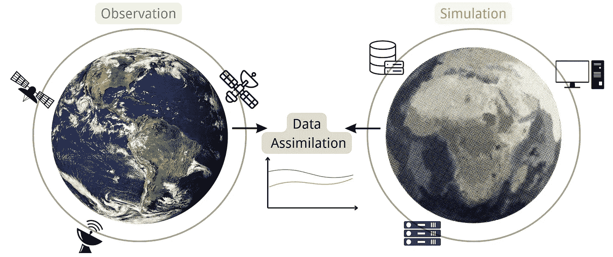

# 解决蝴蝶效应：使用集成卡尔曼滤波器的数据同化

> 原文：[`towardsdatascience.com/addressing-the-butterfly-effect-data-assimilation-using-ensemble-kalman-filter-9883d0e1197b?source=collection_archive---------3-----------------------#2024-12-13`](https://towardsdatascience.com/addressing-the-butterfly-effect-data-assimilation-using-ensemble-kalman-filter-9883d0e1197b?source=collection_archive---------3-----------------------#2024-12-13)

## 学习如何逐步实现集成卡尔曼滤波器进行数据同化，包括数学细节和代码实现

 [Wencong Yang, PhD](https://medium.com/@yangwconion?source=post_page---byline--9883d0e1197b--------------------------------)

·发表于[Towards Data Science](https://towardsdatascience.com/?source=post_page---byline--9883d0e1197b--------------------------------) ·阅读时长 9 分钟·2024 年 12 月 13 日

--

来源：[`unsplash.com/`](https://unsplash.com/)

# 1\. 快速入门：为什么需要数据同化

许多现实世界中的动力系统是混沌的，其中初始条件的微小变化会导致后续状态的显著差异。这种现象也被称为蝴蝶效应，它使得基于物理模型的程序很难准确预测系统行为。数据同化通过将观测数据整合到模型状态估计中来解决这一问题。它通常应用于时间序列预测问题，特别是在天气预报等物理系统模型中。集成卡尔曼滤波器（EnKF）是数据同化中一种广泛使用的算法，具有优雅的理论和简单的实现方法，受到了从科学界到工业界的广泛关注。

数据同化示意图。来源：作者提供。

本文作为 EnKF 的教程，介绍了 EnKF 的基本数学原理，提供了逐步的代码实现，并展示了如何使用一个简单的示例进行实际操作……
