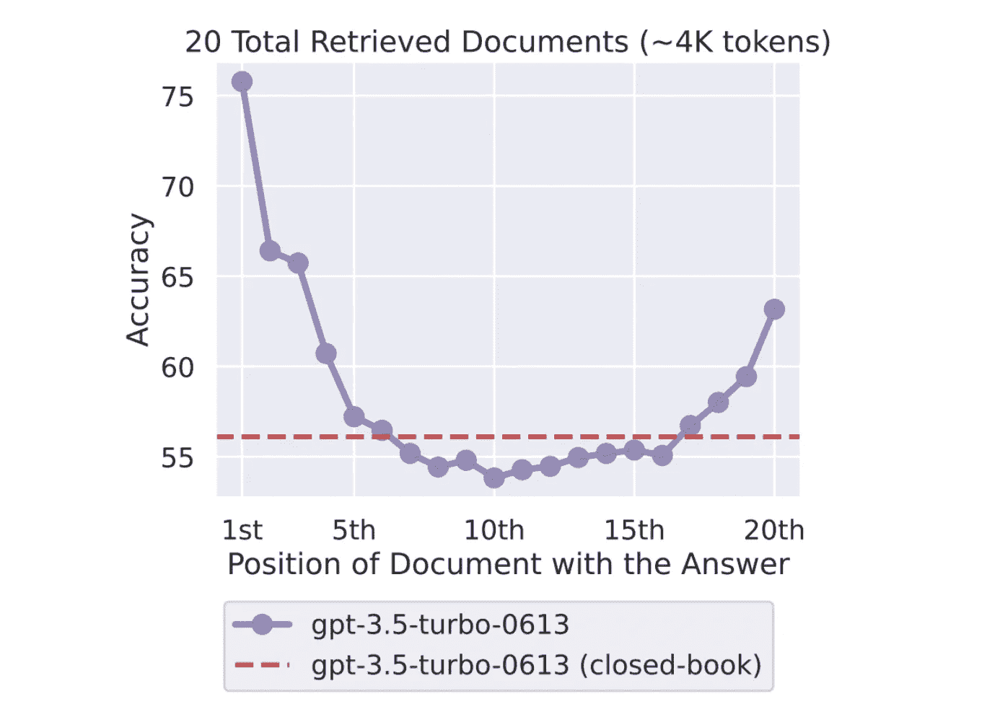

# 提高 RAG 的高级查询转换

> 原文：[`towardsdatascience.com/advanced-query-transformations-to-improve-rag-11adca9b19d1?source=collection_archive---------1-----------------------#2024-01-10`](https://towardsdatascience.com/advanced-query-transformations-to-improve-rag-11adca9b19d1?source=collection_archive---------1-----------------------#2024-01-10)

## 不同的查询转换方法

 [Iulia Brezeanu](https://medium.com/@brezeanu.iulia?source=post_page---byline--11adca9b19d1--------------------------------)

·发布于 [Towards Data Science](https://towardsdatascience.com/?source=post_page---byline--11adca9b19d1--------------------------------) ·9 分钟阅读·2024 年 1 月 10 日

--

图片来源：作者。AI 生成。

检索增强生成（RAG）已成为生成性 AI 文献中讨论最热的话题之一。随着每日涌现的大量博客文章和科学论文，保持更新变得越来越具有挑战性。然而，RAG 的流行是当之无愧的，因为没有其他解决方案在减少大型语言模型的幻觉方面表现得如此高效。

RAG 通过可靠的外部来源（如 Wikipedia 页面、私人 PDF 文件等）增强语言模型的通用知识。这也是 RAG 最重要的一步：确保我们的检索能够找到正确的文档并将其输入模型。

我们非常需要 RAG，因为目前我们在将完整文档放入上下文窗口时面临一些限制。原因包括模型输入的令牌长度限制、计算成本的成比例增加，以及像“丢失在中间”这样的现象，指的是模型在处理长输入上下文时难以使用位于中间的信息[2]。

模型性能与上下文窗口中相关信息位置之间的关系。[2]

如果检索到的文档过长或不相关，正如俗话所说，垃圾进……
