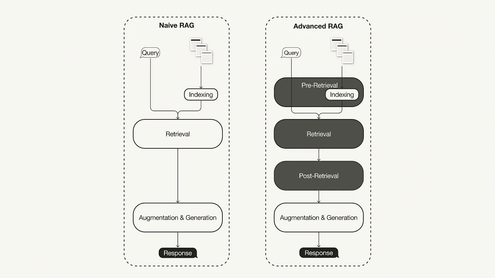
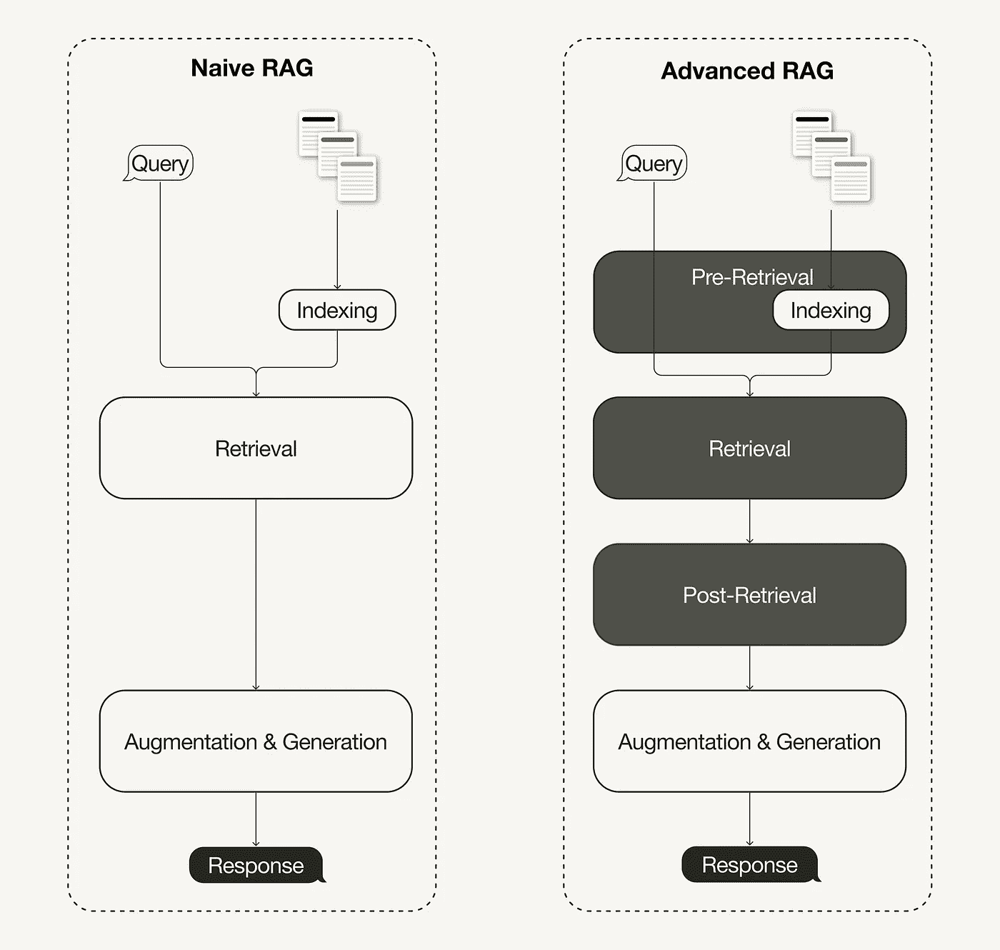
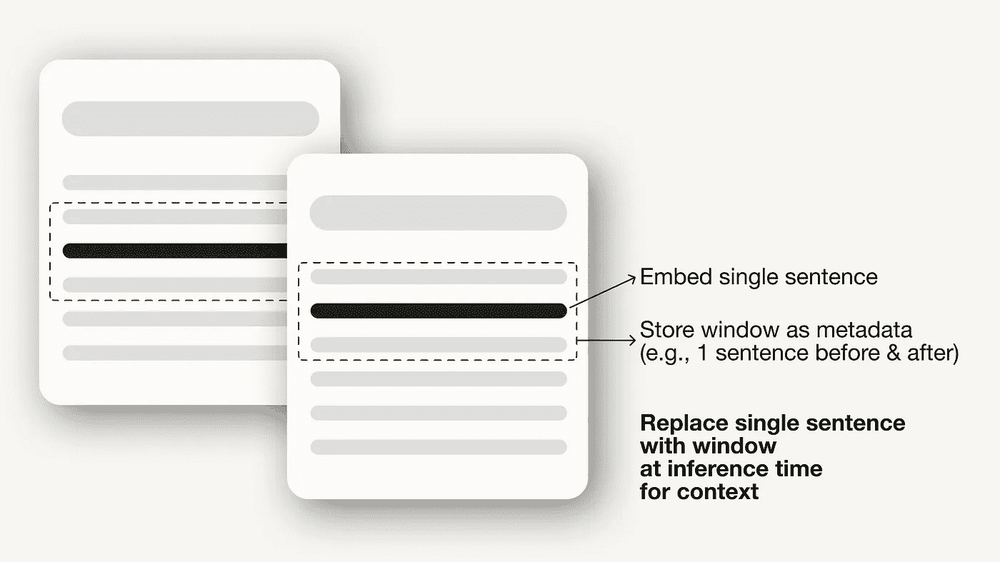
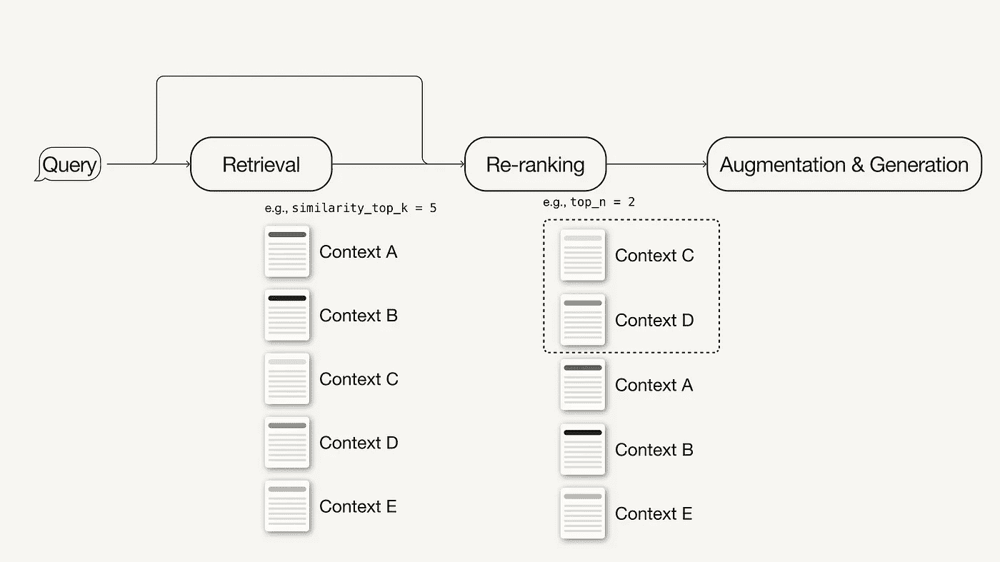

# 先进的检索增强生成：从理论到 LlamaIndex 实现

> 原文：[`towardsdatascience.com/advanced-retrieval-augmented-generation-from-theory-to-llamaindex-implementation-4de1464a9930?source=collection_archive---------0-----------------------#2024-02-19`](https://towardsdatascience.com/advanced-retrieval-augmented-generation-from-theory-to-llamaindex-implementation-4de1464a9930?source=collection_archive---------0-----------------------#2024-02-19)

## 如何通过在 Python 中实现针对性的先进 RAG 技术，解决简单 RAG 流水线的局限性

[](https://medium.com/@iamleonie?source=post_page---byline--4de1464a9930--------------------------------)[](https://towardsdatascience.com/?source=post_page---byline--4de1464a9930--------------------------------) [Leonie Monigatti](https://medium.com/@iamleonie?source=post_page---byline--4de1464a9930--------------------------------)

·发表于 [Towards Data Science](https://towardsdatascience.com/?source=post_page---byline--4de1464a9930--------------------------------) ·阅读时长 10 分钟·2024 年 2 月 19 日

--



简单 RAG 与先进 RAG 的区别（图源：作者，灵感来源于 [1]）

一项关于[检索增强生成（RAG）](https://medium.com/towards-data-science/retrieval-augmented-generation-rag-from-theory-to-langchain-implementation-4e9bd5f6a4f2) [1]的最新调查总结了三种近期演变的范式：

+   简单 RAG，

+   先进的 RAG，以及

+   模块化 RAG。

先进的 RAG 范式包括一系列技术，旨在解决简单 RAG 的已知局限性。本文首先讨论了这些技术，它们可以分为 *检索前、检索和检索后优化*。

在下半部分，您将学习如何使用 [Llamaindex](https://www.llamaindex.ai/) 在 Python 中实现一个简单的 RAG 流水线，并通过选择以下先进的 RAG 技术将其增强为一个先进的 RAG 流水线：

+   检索前优化：句子窗口检索

+   检索优化：混合搜索

+   检索后优化：重新排序

本文重点介绍**先进的 RAG 范式**及其实现。如果你不熟悉 RAG 的基本概念，可以在这里了解：

[](/retrieval-augmented-generation-rag-from-theory-to-langchain-implementation-4e9bd5f6a4f2?source=post_page-----4de1464a9930--------------------------------) ## 检索增强生成（RAG）：从理论到 LangChain 实现

### 从原始学术论文的理论到其在 Python 中的实现，涵盖了 OpenAI、Weaviate 和 LangChain 的应用

[towardsdatascience.com

# 什么是高级 RAG

随着 RAG 领域的最新进展，先进的 RAG 已经发展为一种新的范式，通过有针对性的增强来解决传统 RAG 范式的一些局限性。正如最近的调查所总结的[1]，先进的 RAG 技术可以分为预检索、检索和后检索优化。



原始 RAG 与高级 RAG 的区别（图源：作者，灵感来自[1]）

# 预检索优化

预检索优化侧重于数据索引优化以及查询优化。数据索引优化技术旨在以一种有助于提高检索效率的方式存储数据，例如[1]：

+   **滑动窗口**使用块之间的重叠，是最简单的技术之一。

+   **增强数据粒度**应用数据清理技术，如去除无关信息、确认事实准确性、更新过时信息等。

+   **添加元数据**，例如日期、目的或章节，以便进行筛选。

+   **优化索引结构**涉及使用不同策略来索引数据，例如调整块的大小或使用多重索引策略。我们将在本文中实现的一项技术是句子窗口检索，它将单个句子嵌入用于检索，并在推理时用更大的文本窗口替换它们。



句子窗口检索

此外，预检索技术不仅限于数据索引，还可以包括**推理时的技术**，如查询路由、查询重写和查询扩展。

# 检索优化

检索阶段旨在识别最相关的上下文。通常，检索基于向量搜索，它计算查询与索引数据之间的语义相似性。因此，大多数检索优化技术围绕着嵌入模型展开[1]：

+   **微调嵌入模型**定制嵌入模型以适应特定领域的上下文，特别是对于那些术语不断变化或稀有的领域。例如，`BAAI/bge-small-en`是一个高性能的嵌入模型，可以进行微调（见[微调指南](https://betterprogramming.pub/fine-tuning-your-embedding-model-to-maximize-relevance-retrieval-in-rag-pipeline-2ea3fa231149)）

+   **动态嵌入**适应词语使用的上下文，区别于静态嵌入，后者为每个词使用一个单一的向量。例如，OpenAI 的`embeddings-ada-02`是一个复杂的动态嵌入模型，能够捕捉上下文理解。[1]

除了向量搜索，还有其他检索技术，例如混合搜索，通常是指将向量搜索与基于关键词的搜索相结合的概念。如果你的检索需要精确的关键词匹配，这种检索技术非常有用。

[](/improving-retrieval-performance-in-rag-pipelines-with-hybrid-search-c75203c2f2f5?source=post_page-----4de1464a9930--------------------------------) ## 使用混合搜索提高 RAG 流水线中的检索性能

### 如何通过结合传统的基于关键词的搜索与现代的向量搜索来找到更相关的搜索结果

towardsdatascience.com

# 后检索优化

对检索到的上下文进行额外处理可以帮助解决诸如超出上下文窗口限制或引入噪声等问题，从而妨碍对关键信息的关注。RAG 调查总结的后检索优化技术 [1] 包括：

+   **Prompt 压缩**通过删除不相关内容并突出重要的上下文来减少整体提示长度。

+   **重新排名**使用机器学习模型重新计算检索到的上下文的相关性得分。



重新排名

欲了解如何改善 RAG 流水线的性能，使其成为生产就绪的应用程序，继续阅读：

[](/a-guide-on-12-tuning-strategies-for-production-ready-rag-applications-7ca646833439?source=post_page-----4de1464a9930--------------------------------) ## 生产就绪的 RAG 应用程序的 12 种调优策略指南

### 如何通过这些“超参数”提高你的检索增强生成（RAG）流水线的性能，等等……

towardsdatascience.com

# 先决条件

本节讨论了在本文中跟随的所需包和 API 密钥。

## 所需的包

本文将指导你通过使用 [LlamaIndex](https://www.llamaindex.ai/) 在 Python 中实现一个简单和高级的 RAG 流水线。

```py
pip install llama-index
```

在本文中，我们将使用 [LlamaIndex](https://blog.llamaindex.ai/llamaindex-v0-10-838e735948f8) `[v0.10](https://blog.llamaindex.ai/llamaindex-v0-10-838e735948f8)`。如果你正在从较旧的 LlamaIndex 版本升级，你需要运行以下命令来正确安装和运行 LlamaIndex：

```py
pip uninstall llama-index
pip install llama-index --upgrade --no-cache-dir --force-reinstall
```

LlamaIndex 提供了一种选项，可以将向量嵌入存储在本地的 JSON 文件中进行持久存储，这对于快速原型设计一个想法非常有用。然而，由于先进的 RAG 技术旨在面向生产环境应用，我们将使用向量数据库进行持久存储。

由于我们不仅需要存储向量嵌入，还需要元数据存储和混合搜索能力，因此我们将使用支持这些功能的开源向量数据库[Weaviate](http://weaviate.io)（`v3.26.2`）。

```py
pip install weaviate-client llama-index-vector-stores-weaviate
```

## API 密钥

我们将使用 Weaviate 嵌入版，您可以免费使用，无需注册 API 密钥。然而，本教程使用的是来自[OpenAI](https://openai.com/)的嵌入模型和 LLM，您需要一个 OpenAI API 密钥才能使用。要获取密钥，您需要一个 OpenAI 账户，并在[API 密钥](https://platform.openai.com/account/api-keys)页面下“创建新的密钥”。

接下来，在您的根目录中创建一个`.env`文件，并在其中定义您的 API 密钥：

```py
OPENAI_API_KEY="<YOUR_OPENAI_API_KEY>"
```

之后，您可以使用以下代码加载您的 API 密钥：

```py
# !pip install python-dotenv
import os
from dotenv import load_dotenv,find_dotenv

load_dotenv(find_dotenv())
```

# 使用 LlamaIndex 实现简单的 RAG

本节讨论如何使用 LlamaIndex 实现简单的 RAG 管道。您可以在这个[Jupyter Notebook](https://github.com/weaviate/recipes/blob/main/integrations/llamaindex/retrieval-augmented-generation/naive_rag.ipynb)中找到整个简单 RAG 管道的实现。使用 LangChain 实现的相关内容，可以继续阅读[这篇文章（使用 LangChain 实现的简单 RAG 管道）](https://medium.com/towards-data-science/retrieval-augmented-generation-rag-from-theory-to-langchain-implementation-4e9bd5f6a4f2)。

## 步骤 1：定义嵌入模型和 LLM

首先，您可以在一个全局设置对象中定义嵌入模型和 LLM。这样做意味着您不必在代码中再次显式指定这些模型。

+   嵌入模型：用于生成文档块和查询的向量嵌入。

+   LLM：用于根据用户查询和相关上下文生成答案。

```py
from llama_index.embeddings.openai import OpenAIEmbedding
from llama_index.llms.openai import OpenAI
from llama_index.core.settings import Settings

Settings.llm = OpenAI(model="gpt-3.5-turbo", temperature=0.1)
Settings.embed_model = OpenAIEmbedding()
```

## 步骤 2：加载数据

接下来，您将在根目录下创建一个名为`data`的本地目录，并从[LlamaIndex GitHub 仓库](https://github.com/run-llama/llama_index)（MIT 许可证）下载一些示例数据。

```py
!mkdir -p 'data'
!wget '<https://raw.githubusercontent.com/run-llama/llama_index/main/docs/examples/data/paul_graham/paul_graham_essay.txt>' -O 'data/paul_graham_essay.txt'
```

之后，您可以加载数据以进行进一步处理：

```py
from llama_index.core import SimpleDirectoryReader

# Load data
documents = SimpleDirectoryReader(
        input_files=["./data/paul_graham_essay.txt"]
).load_data()
```

## 步骤 3：将文档划分为节点

由于整个文档过大，无法适配 LLM 的上下文窗口，您需要将其划分为较小的文本块，这些文本块在 LlamaIndex 中被称为`节点`。您可以使用`SimpleNodeParser`将加载的文档解析成节点，并定义每个块的大小为 1024。

```py
from llama_index.core.node_parser import SimpleNodeParser

node_parser = SimpleNodeParser.from_defaults(chunk_size=1024)

# Extract nodes from documents
nodes = node_parser.get_nodes_from_documents(documents)
```

## 步骤 4：构建索引

接下来，您将构建一个索引，存储所有的外部知识，这些知识存储在[Weaviate](https://weaviate.io/)这个开源向量数据库中。

首先，您需要连接到一个 Weaviate 实例。在这种情况下，我们使用的是[Weaviate 嵌入版](https://weaviate.io/developers/weaviate/installation/embedded)，它允许您在 Notebooks 中免费进行实验，无需 API 密钥。对于生产环境的解决方案，建议您自行部署 Weaviate，例如通过[Docker](https://weaviate.io/developers/weaviate/installation/docker-compose)或者使用[托管服务](https://weaviate.io/developers/weaviate/installation/weaviate-cloud-services)。

```py
import weaviate

# Connect to your Weaviate instance
client = weaviate.Client(
    embedded_options=weaviate.embedded.EmbeddedOptions(), 
)
```

接下来，你将从 Weaviate 客户端构建一个`VectorStoreIndex`，用于存储数据并进行交互。

```py
from llama_index.core import VectorStoreIndex, StorageContext
from llama_index.vector_stores.weaviate import WeaviateVectorStore

index_name = "MyExternalContext"

# Construct vector store
vector_store = WeaviateVectorStore(
    weaviate_client = client, 
    index_name = index_name
)

# Set up the storage for the embeddings
storage_context = StorageContext.from_defaults(vector_store=vector_store)

# Setup the index
# build VectorStoreIndex that takes care of chunking documents
# and encoding chunks to embeddings for future retrieval
index = VectorStoreIndex(
    nodes,
    storage_context = storage_context,
)
```

## 步骤 5：设置查询引擎

最后，你将设置索引作为查询引擎。

```py
# The QueryEngine class is equipped with the generator
# and facilitates the retrieval and generation steps
query_engine = index.as_query_engine()
```

## 步骤 6：对数据运行一个简单的 RAG 查询

现在，你可以对数据运行一个简单的 RAG 查询，如下所示：

```py
# Run your naive RAG query
response = query_engine.query(
    "What happened at Interleaf?"
)
```

# 使用 LlamaIndex 实现高级 RAG

在本节中，我们将讨论一些简单的调整，帮助你将上述简单的 RAG 管道转变为高级 RAG 管道。这个教程将介绍以下一些高级 RAG 技术：

+   预检索优化：句子窗口检索

+   检索优化：混合搜索

+   后检索优化：重新排序

由于我们这里只讨论修改部分，你可以在这个[Jupyter Notebook 中找到完整的端到端高级 RAG 管道](https://github.com/weaviate/recipes/blob/main/integrations/llamaindex/retrieval-augmented-generation/advanced_rag.ipynb)。

# 索引优化示例：句子窗口检索

对于[句子窗口检索技术](https://docs.llamaindex.ai/en/stable/examples/node_postprocessor/MetadataReplacementDemo.html)，你需要进行两项调整：首先，你必须调整如何存储和后处理你的数据。我们将使用`SentenceWindowNodeParser`，而不是`SimpleNodeParser`。

```py
from llama_index.core.node_parser import SentenceWindowNodeParser

# create the sentence window node parser w/ default settings
node_parser = SentenceWindowNodeParser.from_defaults(
    window_size=3,
    window_metadata_key="window",
    original_text_metadata_key="original_text",
)
```

`SentenceWindowNodeParser`执行两项操作：

1.  它将文档分割成单个句子，然后进行嵌入。

1.  对于每个句子，它会创建一个上下文窗口。如果你指定`window_size = 3`，生成的窗口将包含三句，从嵌入句子的前一句开始，涵盖其后的句子。这个窗口将作为元数据存储。

在检索过程中，返回与查询最匹配的句子。检索之后，你需要通过定义一个`MetadataReplacementPostProcessor`并将其添加到`node_postprocessors`列表中，使用元数据中的整个窗口来替换该句子。

```py
from llama_index.core.postprocessor import MetadataReplacementPostProcessor

# The target key defaults to `window` to match the node_parser's default
postproc = MetadataReplacementPostProcessor(
    target_metadata_key="window"
)

...

query_engine = index.as_query_engine( 
    node_postprocessors = [postproc],
)
```

# 检索优化示例：混合搜索

如果底层向量数据库支持混合搜索查询，在 LlamaIndex 中实现混合搜索只需要对`query_engine`进行两个参数调整。`alpha`参数指定了向量搜索与基于关键词搜索之间的权重，其中`alpha=0`表示基于关键词的搜索，`alpha=1`表示纯粹的向量搜索。

```py
query_engine = index.as_query_engine(
    ...,
    vector_store_query_mode="hybrid", 
    alpha=0.5,
    ...
)
```

# 后检索优化示例：重新排序

向你的高级 RAG 管道中添加一个重新排序模型，只需要三个简单的步骤：

1.  首先，定义一个重新排序模型。在这里，我们使用来自[Hugging Face](https://huggingface.co/BAAI/bge-reranker-base)的`[BAAI/bge-reranker-base](https://huggingface.co/BAAI/bge-reranker-base)`。

1.  在查询引擎中，将重新排序模型添加到`node_postprocessors`列表中。

1.  在查询引擎中增加`similarity_top_k`参数，以检索更多上下文段落，重新排序后可以将其减少为`top_n`。

```py
# !pip install torch sentence-transformers
from llama_index.core.postprocessor import SentenceTransformerRerank

# Define reranker model
rerank = SentenceTransformerRerank(
    top_n = 2, 
    model = "BAAI/bge-reranker-base"
)

...

# Add reranker to query engine
query_engine = index.as_query_engine(
		similarity_top_k = 6,
		...,
                node_postprocessors = [rerank],
		...,
)
```

在高级 RAG 范式中还有许多不同的技术。如果您对进一步的实现感兴趣，推荐以下两个资源：

[](https://www.deeplearning.ai/short-courses/building-evaluating-advanced-rag/?source=post_page-----4de1464a9930--------------------------------) [## 构建和评估高级 RAG 应用

### 学习句子窗口检索和自动合并检索等方法，提高您的 RAG 管道性能…

www.deeplearning.ai](https://www.deeplearning.ai/short-courses/building-evaluating-advanced-rag/?source=post_page-----4de1464a9930--------------------------------) [](/advanced-rag-01-small-to-big-retrieval-172181b396d4?source=post_page-----4de1464a9930--------------------------------) ## 高级 RAG 01：从小到大的检索

### Child-Parent 递归检索器与 LlamaIndex 中的句子窗口检索

towardsdatascience.com

# 摘要

本文介绍了高级 RAG 的概念，这是一套技术，旨在解决朴素 RAG 范式的局限性。在概述了可以分为检索前、检索和检索后技术的高级 RAG 技术后，本文使用 LlamaIndex 实施了一个朴素和高级 RAG 管道来进行编排。

RAG 管道的组件包括来自[OpenAI](https://openai.com/)的语言模型，来自[BAAI](https://www.baai.ac.cn/english.html)的重排序模型，该模型托管在[Hugging Face](https://huggingface.co/)上，以及[Weaviate](https://weaviate.io/)向量数据库。

我们使用 Python 中的 LlamaIndex 实现了以下技术：

+   检索前优化：句子窗口检索

+   检索优化：混合搜索

+   检索后优化：重排序

您可以在这里找到包含完整端到端管道的 Jupyter Notebook：

+   [LlamaIndex 中的朴素 RAG](https://github.com/weaviate/recipes/blob/main/integrations/llamaindex/retrieval-augmented-generation/naive_rag.ipynb)

+   [LlamaIndex 中的高级 RAG](https://github.com/weaviate/recipes/blob/main/integrations/llamaindex/retrieval-augmented-generation/advanced_rag.ipynb)

# 喜欢这篇文章吗？

[*免费订阅*](https://medium.com/subscribe/@iamleonie) *以在我发布新故事时收到通知。*

[](https://medium.com/@iamleonie/subscribe?source=post_page-----4de1464a9930--------------------------------) [## 每当 Leonie Monigatti 发布新内容时，接收电子邮件通知。

### 每当 Leonie Monigatti 发布新内容时，您都可以收到电子邮件通知。通过注册，如果您还没有 Medium 账户，将会创建一个账户…

medium.com](https://medium.com/@iamleonie/subscribe?source=post_page-----4de1464a9930--------------------------------)

*在* [*LinkedIn*](https://www.linkedin.com/in/804250ab/)，[*Twitter*](https://twitter.com/helloiamleonie)*，和* [*Kaggle*](https://www.kaggle.com/iamleonie)*上找到我！*

# 免责声明

在撰写本文时，我是 Weaviate 的开发者倡导者。

# 参考文献

## 文献

[1] 高, Y., 熊, Y., 高, X., 贾, K., 潘, J., 毕, Y., … & 王, H. (2023). 面向大语言模型的检索增强生成：一项调查。[*arXiv 预印本 arXiv:2312.10997*](https://arxiv.org/pdf/2312.10997.pdf)。

## 图片

除非另有说明，所有图片均由作者创建。
