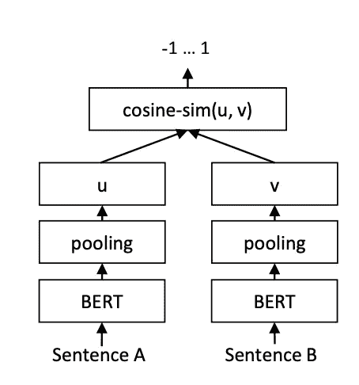
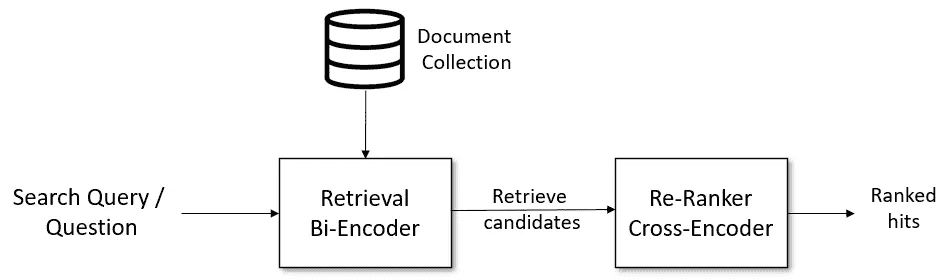
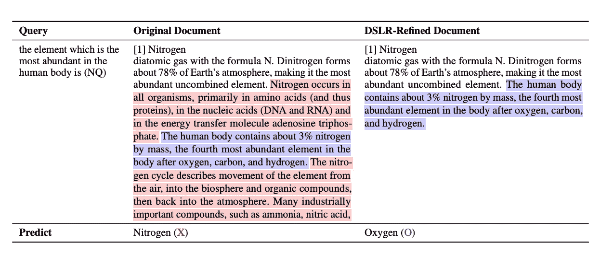
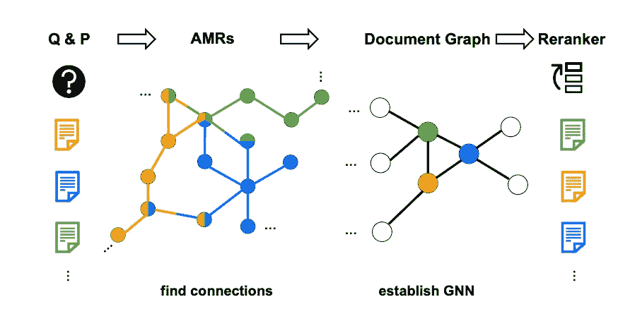

# 2 百万令牌上下文窗口中的高级检索技术：关于重新排序器的第二部分

> 原文：[`towardsdatascience.com/advanced-retrieval-techniques-in-a-world-of-2m-token-context-windows-part-2-on-re-rankers-a0dfa03ba325?source=collection_archive---------7-----------------------#2024-08-26`](https://towardsdatascience.com/advanced-retrieval-techniques-in-a-world-of-2m-token-context-windows-part-2-on-re-rankers-a0dfa03ba325?source=collection_archive---------7-----------------------#2024-08-26)


Google DeepMind 推出的可视化 AI 项目。图像来自[Unsplash](https://unsplash.com/photos/a-close-up-of-a-group-of-different-colored-objects-_aU_AxlS04E)。

## 探索 RAG 技术以提高检索准确性

[](https://medium.com/@meghanheintz?source=post_page---byline--a0dfa03ba325--------------------------------)[](https://towardsdatascience.com/?source=post_page---byline--a0dfa03ba325--------------------------------) [Meghan Heintz](https://medium.com/@meghanheintz?source=post_page---byline--a0dfa03ba325--------------------------------)

·发表于 [Towards Data Science](https://towardsdatascience.com/?source=post_page---byline--a0dfa03ba325--------------------------------) ·7 分钟阅读·2024 年 8 月 26 日

--

在[第一部分](https://medium.com/p/2edc0266aabe)中，我们探讨了通过在执行检索之前重写查询来改善 RAG（增强检索生成）结果。本次，我们将学习如何通过重新排序来自向量数据库检索的结果来提高性能。

虽然我强烈建议尝试一些有前景的专有选项，如 Cohere 的 [Re-Rank 3](https://cohere.com/blog/rerank-3)，但我们将主要关注了解研究人员在这一主题上分享的内容。

# 重新排序，意义何在？

首先，为什么要进行重新排序呢？向量数据库返回的结果是基于查询和文档的嵌入计算出的“相似度”分数。这些分数已经可以用来对结果进行排序，既然这已经是对文档和查询的语义相似度评分，为什么我们还需要另一步骤呢？

我们采取这种方法有几个原因：

+   文档嵌入是“有损”的。文档在看到查询之前就已被压缩为向量格式，这意味着文档向量并未针对查询向量进行定制。重新排序使我们能够更好地理解**文档与查询特定相关的含义**。

+   两阶段系统已成为传统搜索和推荐系统的标准。它们在可扩展性、灵活性和准确性方面提供了改进。**检索模型非常快速，而排名模型较慢。**通过构建混合系统，我们可以平衡每个阶段之间的速度和准确性的权衡。

+   重新排序允许我们减少将文档放入上下文窗口的数量，这**a) 降低了成本**并且**b) 减少了相关数据被“埋没在大海捞针”中的机会**。

# 传统的重新排序方法

信息检索并不是一个新领域。在 LLMs 使用 RAG 改善生成之前，搜索引擎已经使用重新排序方法来改善搜索结果。两种流行的方法是 TF-IDF（词频-逆文档频率）和 BM25（最佳匹配 25）。

[Karen Spärck Jones](https://en.wikipedia.org/wiki/Karen_Sp%C3%A4rck_Jones) 在 1970 年代提出了 IDF（TF-IDF 的逆文档频率）概念，作为术语特异性的统计解释。其一般概念是，术语的特异性可以作为该术语出现的文档数量的倒数来量化。一个简单的例子是莎士比亚戏剧中的术语频率。因为“Romeo”一词仅出现在一部戏剧中，我们认为它对于该戏剧的主题比“sweet”一词更具信息性，因为“sweet”在所有戏剧中都有出现。

BM25 或 Okapi BM25 是由 Karen Spärck Jones 和 [Stephen Robertson](https://en.wikipedia.org/wiki/Stephen_Robertson_(computer_scientist)) 共同开发的，作为 TF-IDF 的改进。BM25 是一种“词袋”检索函数，根据查询词在每个文档中出现的频率对一组文档进行排名，而不考虑这些词在文档中的相对位置。该方法在几个重要方面扩展了 TF-IDF：

+   BM25 使用一个饱和函数，其中一个词的频率越高，其重要性也随之增加，但回报是递减的。（旁注：这对于在搜索引擎优化（SEO）变得更加重要时保护准确性至关重要。你不能仅仅通过增加关键词的频率来作弊。）

+   BM25 包括文档长度归一化，确保较长的文档不会被不公平地偏袒。（这是另一个阻止潜在 SEO 游戏者的改进。）

这两种方法都可以在文档用于生成上下文之前，重新对向量数据库中的结果进行排序。这被称为基于“特征”的重新排序。

# 神经重新排序模型

你应该注意到传统方法的一个特点是，它们专注于精确的术语匹配。当文档使用语义相似但不同的术语时，这些方法将会遇到困难。像 SBERT（[Sentence Transformers](https://arxiv.org/pdf/1908.10084)）这样的神经重新排序方法试图克服这一局限性。

SBERT 是一个经过微调的 BERT（Bidirectional Encoder Representations from Transformers）模型，采用了孪生/三元组网络架构，极大地提高了计算效率和计算句子相似性的延迟。像[SBERT](https://arxiv.org/pdf/1908.10084)（Sentence-BERT）这样的变换器（Transformers）利用术语使用的上下文，使模型能够处理同义词和多义词。



SBERT 推理时的架构，例如计算相似度分数。该架构也用于回归目标函数。从[Nils Reimers 和 Iryna Gurevych 的《Sentence-BERT: Sentence Embeddings using Siamese BERT-Networks》](https://arxiv.org/pdf/1908.10084)

由于 SBERT 的专业化，它在语义相似度排名中通常表现更好。然而，使用 SBERT 的缺点是，你需要在本地管理模型，而不是调用 API，例如使用 OpenAI 的嵌入模型。明智地选择你所需的工具！

# 交叉编码器重新排序

向量数据库搜索中的前 K 个结果是与查询向量最相似的文档向量。另一种描述这种排名方法的方式是称其为“二重编码器”排名。向量在前期计算，并且近邻算法（ANNs）选择最相似的文档，这使得该方法成为一种高效的排名方式。但这种高效性是以牺牲一些准确性为代价的。

相比之下，交叉编码器通过对数据对进行分类机制来计算相似性。这意味着你需要为每个文档和查询提供一对数据。这种方法能够提供更加准确的结果，但效率极低。这也是为什么交叉编码器最好通过一种混合方法来实现，其中首先使用“二重编码器”前 K 个结果进行文档数量的修剪，然后再使用交叉编码器进行排名。你可以在[SBERT 文档](https://www.sbert.net/examples/applications/retrieve_rerank/README.html)中了解更多关于如何一起使用二重编码器和交叉编码器的信息。



信息检索/问题回答检索图表，解释如何结合使用二重编码器和交叉编码器，来自[SBERT 文档](https://www.sbert.net/examples/applications/retrieve_rerank/README.html)，完整引用见下文。

```py
@inproceedings{reimers-2019-sentence-bert,
  title = "Sentence-BERT: Sentence Embeddings using Siamese BERT-Networks",
  author = "Reimers, Nils and Gurevych, Iryna",
  booktitle = "Proceedings of the 2019 Conference on Empirical Methods in Natural Language Processing",
  month = "11",
  year = "2019",
  publisher = "Association for Computational Linguistics",
  url = "https://arxiv.org/abs/1908.10084",
}
```

# 基于提示的重新排序（PBR）

到目前为止，我们一直专注于使用向量或其他数值方法对我们的 RAG 结果进行重新排序。但这是否意味着我们没有充分利用 LLM？将文档和查询重新输入 LLM 进行评分，可能是一种有效的评分方式；采用这种方法时几乎没有信息损失。如果 LLM 被提示只返回一个单一的标记（即评分），则通常可以接受所产生的延迟（尽管这是扩展的较为昂贵的方式之一）。这被视为“零-shot”重新排序，关于这一主题的研究仍然有限，但我们知道它必须对提示的质量非常敏感。

(PBR)的另一个版本是[**DSLR 框架**](https://ar5iv.labs.arxiv.org/html/2407.03627v4)（基于句子级重新排序和重构的文档优化）。DSLR 提出了一种无监督方法，将检索到的文档分解成句子，基于相关性对其重新排序，然后在传递给 LLM 之前将其重构为连贯的段落。这种方法与传统依赖于固定大小段落的方式不同，后者可能包含冗余或无关的信息。在生成响应之前修剪掉无关的句子，可以减少幻觉现象并提高整体准确性。下面您可以看到 DSLR 优化如何提升 LLM 的响应。



来自[DSLR: 基于句子级重新排序和重构的文档优化，以增强检索增强生成（由 Taeho Hwang, Soyeong Jeong, Sukmin Cho, SeungYoon Han, Jong C. Park 在韩国高等科学技术学院计算机学院提供）](https://ar5iv.labs.arxiv.org/html/2407.03627v4)的示例 DSLR 优化

# 基于图的重新排序

有时，答案并不适合完全包含在一个单一的文档块中。书籍和论文的编写假设它们会被线性阅读，或者至少读者能够轻松地回溯到早期的段落。例如，当阅读关于 SBERT 的内容时，可能会要求回顾早先关于 BM25 的章节。在基本的 RAG 应用中，这是不可能的，因为您检索到的文档与之前的章节没有任何连接。

[G-RAG](https://arxiv.org/pdf/2405.18414)，是由谷歌和 UCLA 的研究人员提出的一种方法，旨在缓解这一问题。G-RAG 是一种重新排序器，利用图神经网络（GNNs）来考虑检索到的文档之间的连接。文档被表示为节点，边表示文档之间共享的概念。这些图表被生成作为抽象意义表示（AMR）图，可以通过如[`github.com/goodbai-nlp/AMRBART`](https://github.com/goodbai-nlp/AMRBART)（MIT 许可）等工具创建。

对[自然问题(NQ)](https://aclanthology.org/Q19-1026/)和[TriviaQA(TQA)数据集](https://paperswithcode.com/dataset/triviaqa)的实验表明，这种方法在与其他最先进方法相比时，改进了平均联结倒数排名(MTRR)和联结平均命中率@10(TMHits@10)。



[来自 UCLA 和谷歌研究人员](https://arxiv.org/pdf/2405.18414)：G-RAG 使用两个图来重新排序文档：抽象意义表示（AMR）图被用作文档级图的特征，文档图随后用于文档重排序。

# 结论

我希望你喜欢这个关于提高 RAG 应用性能的技术概述。我期待着该领域的持续进展，考虑到目前研究的飞速发展，我知道会有很多新的突破。

如果你有任何在本文中没有涵盖的最爱的重排序方法，请在评论区告诉我。
