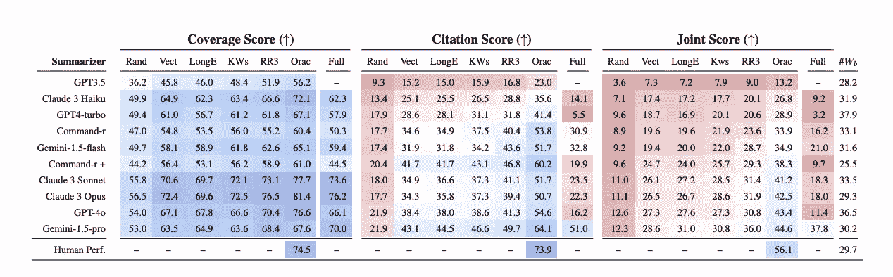
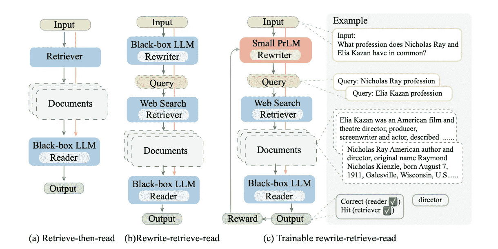
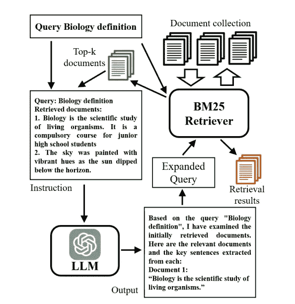
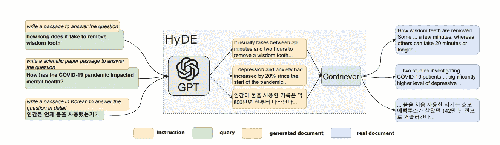

# 在 2 百万标记上下文窗口的世界中，先进的检索技术，第一部分

> 原文：[`towardsdatascience.com/advanced-retrieval-techniques-in-a-world-of-2m-token-context-windows-pt-1-2edc0266aabe?source=collection_archive---------10-----------------------#2024-07-15`](https://towardsdatascience.com/advanced-retrieval-techniques-in-a-world-of-2m-token-context-windows-pt-1-2edc0266aabe?source=collection_archive---------10-----------------------#2024-07-15)

## 探索 RAG 技术以提高检索准确性

 [Meghan Heintz](https://medium.com/@meghanheintz?source=post_page---byline--2edc0266aabe--------------------------------)

·发布于[Towards Data Science](https://towardsdatascience.com/?source=post_page---byline--2edc0266aabe--------------------------------) ·5 分钟阅读·2024 年 7 月 15 日

--

由 Google DeepMind 发起的 AI 项目可视化。图片来源：[Unsplash](https://unsplash.com/photos/a-bunch-of-different-colored-sprinkles-on-a-pink-background-QhDs9x7o9Jc)。

# 首先，我们还关心 RAG（检索增强生成）吗？

Gemini Pro 能够处理惊人的 2 百万标记上下文，而我们曾对 GPT-3.5 发布时的 15000 标记感到震惊。这是否意味着我们不再关心检索或 RAG 系统？根据[针尖对麦芒基准](https://huggingface.co/papers/2407.01370)，答案是，尽管需求在减少，特别是对于 Gemini 模型，先进的检索技术仍然能显著提升大多数 LLM 的性能。基准测试结果表明，长上下文模型在提取特定见解方面表现出色。然而，当需要引用时，它们却显得力不从心。**这使得检索技术在需要引用质量至关重要的应用场景中尤为重要（比如法律、新闻和医疗应用等）。** 这些往往是高价值的应用，缺少引用会让最初的见解变得大打折扣。此外，虽然长上下文模型的成本可能会下降，但通过检索器增强短内容窗口模型，可以是一条具有成本效益且延迟较低的路径，用于服务相同的应用场景。可以放心地说，RAG 和检索技术还会存在一段时间，但可能你不会从实施一个简单的 RAG 系统中获得太多回报。

来自[《Haystack 总结：对长上下文 LLM 和 RAG 系统的挑战》（Summary of a Haystack: A Challenge to Long-Context LLMs and RAG Systems）](https://huggingface.co/papers/2407.01370)的 2024 年 Laban、Fabbri、Xiong、Wu 的研究。“Haystack 结果总结，包括人类表现、RAG 系统和长上下文 LLM。使用三种指标报告结果：覆盖率（左）、引用（中）、联合（右）分数。Full 表示输入整个 Haystack 时的模型表现，而 Rand、Vect、LongE、KWs、RR3、Orac 表示 RAG 系统中的检索组件。模型按 Oracle 联合分数排名。对于每个模型，#Wb 报告每个要点的平均字数。”

# 那么我们应该实现哪些检索技术呢？

高级 RAG 涵盖了一系列技术，但大体上它们都属于检索前查询重写和检索后重排序的范畴。让我们深入了解并学习每种技术。

# 检索前 — 查询重写

问： “生命的意义是什么？”

答： “42”

问答不对称性是 RAG 系统中的一个巨大问题。对于较简单的 RAG 系统，一种典型的方法是比较查询与文档嵌入的余弦相似度。当问题几乎在回答中重述时，这种方法有效，例如：“梅根最喜欢的动物是什么？”，“梅根最喜欢的动物是长颈鹿。”但我们很少那么幸运。

以下是一些可以克服此问题的技术：

# 重写-检索-阅读

“重写-检索-阅读”的命名来自微软 Azure 团队于 2023 年发表的[一篇论文](https://arxiv.org/pdf/2305.14283)（尽管考虑到这一技术的直观性，它已经使用了一段时间）。在这项研究中，LLM 会在获取相关上下文以回答问题之前，将用户查询重写为优化搜索引擎的查询。

一个关键的例子是如何将这个查询，*“尼古拉斯·雷和埃利亚·卡赞共有的职业是什么？”* 分解为两个查询，*“尼古拉斯·雷的职业”* 和 *“埃利亚·卡赞的职业”*。这样可以获得更好的结果，因为单个文档不太可能同时包含两个问题的答案。通过将查询拆分为两个，检索器可以更有效地检索相关文档。

[《用于增强检索的大型语言模型的查询重写》（From Query Rewriting for Retrieval-Augmented Large Language Models）](https://arxiv.org/pdf/2305.14283)，由 Ma、Gong、He、Zhao 和 Duan 于 2023 年撰写。“(a) 标准的先检索后阅读方法，(b) LLM 作为查询重写器，用于重写-检索-阅读管道，(c) 可训练的重写器。”

重写也有助于克服“分心提示”所带来的问题。比如用户查询在提示中混合了多个概念，直接采用嵌入式方法会导致毫无意义的结果。例如，“*太好了，谢谢你告诉我英国首相是谁。现在告诉我法国总统是谁*”可以被重写为*“现任法国总统”*。这可以帮助你的应用程序在面对不同的用户时更具鲁棒性，因为有些用户会深思熟虑如何优化他们的提示，而另一些用户可能有不同的习惯。

# 查询扩展

在使用大语言模型（LLMs）进行查询扩展时，初始查询可以被重写为多个改写后的问题，或被拆解为子问题。理想情况下，通过将查询扩展为多个选项，可以增加初始查询与存储组件中正确文档之间的词汇重叠几率。

查询扩展是一个早于大语言模型（LLMs）广泛应用的概念。伪相关反馈（PRF）是一种启发了部分 LLM 研究者的技术。在 PRF 中，通过初始搜索中排名靠前的文档来识别和加权新的查询词条。而在使用 LLM 时，我们依赖模型的创造性和生成能力来寻找新的查询词条。这是有益的，因为 LLM 不局限于初始的文档集合，可以生成传统方法无法覆盖的扩展词条。

[语料库驱动的查询扩展（CSQE）](https://arxiv.org/abs/2402.18031)是一种结合了传统伪相关反馈（PRF）方法和大语言模型生成能力的技术。最初检索到的文档被反馈给 LLM，以生成新的查询词条用于搜索。这项技术在 LLM 缺乏某一领域知识的查询中表现尤为出色。

[来自大语言模型驱动的语料库查询扩展](https://arxiv.org/abs/2402.18031)，作者：Lei，Cao，Zhou，Shen，Yates，2024 年。“CSQE 概述：给定一个查询生物学定义和检索到的前两篇文档，CSQE 利用 LLM 来识别相关文档 1，并从文档 1 中提取对相关性贡献的关键句子。然后，查询通过这些来源于语料库的文本和 LLM 增强的扩展（即假设的回答查询的文档）进行扩展，以获得最终结果。”

无论是基于 LLM 的查询扩展，还是其前身如伪相关反馈（PRF）方法，都有一定的局限性。其中最显著的局限性是假设 LLM 生成的词条是相关的，或者假设排名靠前的结果是相关的。天啊，如果我在寻找澳大利亚记者哈利·波特的信息，而不是著名的男巫哈利·波特，结果会怎样呢？这两种技术都会将我的查询从较不流行的查询主题拉向更流行的主题，使得边缘案例的查询效果变差。

# 假设查询索引

另一种减少问题和文档之间不对称的方法是使用一组由 LLM 生成的假设问题对文档进行索引。对于给定的文档，LLM 可以生成可能由该文档回答的问题。然后，在检索步骤中，用户的查询嵌入会与假设问题嵌入和文档嵌入进行比较。

这意味着我们不需要嵌入原始文档片段，而是可以为该片段分配一个文档 ID，并将其作为元数据存储在假设的问题文档中。生成文档 ID 意味着在将多个问题映射到一个文档时，开销会小得多。

这种方法的明显缺点是，你的系统将受到存储的问题的创造力和数量的限制。

# 假设文档嵌入 — HyDE

[HyDE](https://arxiv.org/abs/2212.10496)与假设查询索引相反。与生成假设问题不同，LLM 被要求生成一个假设文档，该文档可能回答该问题，生成的文档嵌入被用于与真实文档进行检索。然后，真实文档用于生成回应。该方法在 2022 年首次推出时，相比其他当时的检索方法表现出显著的改进。

我们在 Dune 的自然语言到 SQL 产品中使用了这一概念。通过将用户的提示重写为可能回答问题的图表标题或说明，我们能够更好地检索可以作为 LLM 编写新查询上下文的 SQL 查询。

[《无相关标签的精确零样本密集检索》](https://arxiv.org/abs/2212.10496)，作者：Gao、Ma、Lin、Callan，发表于 2022 年。“HyDE 模型的示意图。展示了文档片段。HyDE 能处理所有类型的查询，而不改变底层的 GPT-3 和 Contriever/mContriever 模型。”

# 敬请关注第二部分关于重新排序方法的内容。
