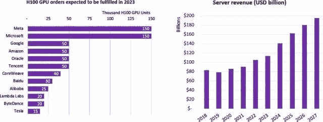
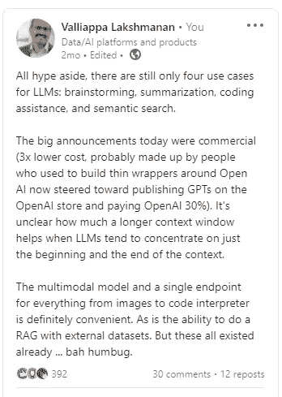
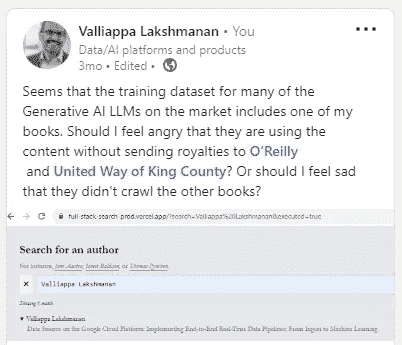
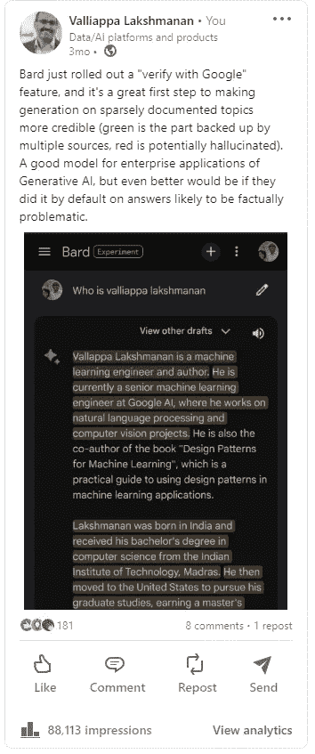

# 使用 LLM 明智的建议

> 原文：[`towardsdatascience.com/advice-on-using-llms-wisely-388262b2ff50?source=collection_archive---------10-----------------------#2024-01-04`](https://towardsdatascience.com/advice-on-using-llms-wisely-388262b2ff50?source=collection_archive---------10-----------------------#2024-01-04)

## 我在 LinkedIn 上关于 LLM 的十篇帖子

 [Lak Lakshmanan](https://lakshmanok.medium.com/?source=post_page---byline--388262b2ff50--------------------------------)

·发布于 [Towards Data Science](https://towardsdatascience.com/?source=post_page---byline--388262b2ff50--------------------------------) ·阅读时间 9 分钟·2024 年 1 月 4 日

--

## 1\. LLM 中的非确定性问题

最佳的 LLM 用例是将 LLM 作为工具使用，而不是直接暴露它。正如[Richard Seroter](https://www.linkedin.com/in/seroter/)所说，你需要多少个聊天机器人？

 [## Richard Seroter 在 LinkedIn 上：如何使任何基于目录的应用程序更具个性化，以便更好地服务于您的用户：我的经验分享…

### 诚实告诉我，这是一个糟糕的主意吗？如果生成型人工智能能够为我们提供更个性化的产品总结呢…

[www.linkedin.com](https://www.linkedin.com/feed/update/urn:li:activity:7148725035644481536/?source=post_page-----388262b2ff50--------------------------------)

然而，将静态产品页面替换为个性化的产品总结这一用例，与许多其他大型语言模型（LLM）用例一样，由于非确定性，它面临着独特的风险。想象一下，一年后有客户起诉你，声称他们因为你的产品总结错误地说该产品防火，导致他们购买了该产品并且他们的房子烧毁了。保护自己的唯一方法是保留每一个生成的总结记录，而存储成本会迅速增加…

避免这个问题的一种方法（也是我建议的方法）是使用 LLM 生成一组模板，并使用机器学习模型来选择哪个模板进行服务。这还具有允许人工监督生成文本的好处，因此你不至于受制于提示工程。（当然，这仅仅是使用 LLM 高效地为不同客户群体创建不同网站的一种方法——越是改变，越是与现有的想法产生共鸣）。

LLM 的许多使用案例是这样的：你需要通过精心的架构来减少非确定性行为及相关风险。

## 2\. LLM 的版权问题

《纽约时报》正在起诉 OpenAI 和微软，指控它们使用《纽约时报》的文章。这一诉讼远超以往的诉讼，声称：

1\. OpenAI 使用了数百万篇文章，并将其权重设定得更高，从而隐含地承认了《纽约时报》内容的重要性。

2\. Wirecutter 的评论被逐字复制，但附属链接被去除。这创造了一个具有竞争力的产品。

3\. 生成式人工智能模仿了《纽约时报》的表现风格，导致商标稀释。

4\. 基于微软和 OpenAI 市值的增长，这项技术的价值对微软而言达到数万亿美元，对 OpenAI 则达到数十亿美元。

5\. 由于原作是在相当高的成本下创作的，因此产生紧密总结并不具备变革性。

此次诉讼还针对 OpenAI 的公司结构，以及微软在构建 Azure 计算平台和选择数据集时与 OpenAI 的紧密合作关系。

[`www.nytimes.com/2023/12/27/business/media/new-york-times-open-ai-microsoft-lawsuit.html`](https://www.nytimes.com/2023/12/27/business/media/new-york-times-open-ai-microsoft-lawsuit.html)

整个诉讼文件长达 69 页，内容非常易读，并包含大量示例。我强烈推荐阅读文章中链接的完整 PDF 文件。

我不是律师，因此不会对诉讼的利弊发表看法。但如果《纽约时报》胜诉，我预计：

1\. LLM API 的成本将会上升，因为 LLM 提供商需要支付其来源费用。此次诉讼不仅涉及训练和基础服务质量问题，还包括在推理过程中重现《纽约时报》文章。因此，成本将全面上升。

2\. 开源 LLM 将无法使用 Common Crawl（《纽约时报》是该数据源第四大来源）。它们的数据集质量将下降，且它们将更难与商业产品相匹配。

3\. 这将保护与创作独特且高质量内容相关的商业模式。

4\. SEO 将更加偏向于在某个主题上成为排名第一或第二的最高权威。其他人将很难获得自然流量。预计通过广告获取客户的成本将会上升。

## 3\. 不要直接使用 LLM；使用一个机器人创建框架。

雪佛兰经销商的事故

 [## Documenting Meta (@documentingmeta) 在 Threads 上

### OpenAI 讨厌这个简单的技巧。为什么要为 ChatGPT+ 付费，而沃森维尔的雪佛兰公司能免费提供？

[www.threads.net](https://www.threads.net/@documentingmeta/post/C08iWrBudcD/?igshid=NTc4MTIwNjQ2YQ%3D%3D&source=post_page-----388262b2ff50--------------------------------)

这也说明了为什么你永远不应该直接在你的网站上实施基于 LLM API 或自定义 GPT 的聊天机器人——你将很难驯服这个“怪物”。同时，你还将面临各种对抗性攻击，你需要花费大量的开发成本来防御这些攻击。

你应该怎么做？使用更高级的机器人创建框架，比如 Google Dialogflow 或 Amazon Lex。这些框架内建语言模型，只会回应有限数量的意图，从而让你避免代价高昂的教训。

## 4\. Gemini 展示了 Google 对其研究团队的信心

[`www.linkedin.com/posts/valliappalakshmanan_what-a-lot-of-people-seem-to-be-missing-is-activity-7139380381916545024-Ki3a`](https://www.linkedin.com/posts/valliappalakshmanan_what-a-lot-of-people-seem-to-be-missing-is-activity-7139380381916545024-Ki3a?utm_source=share&utm_medium=member_desktop)

很多人似乎忽视了 Google 高层对其研究团队的冷静信心。

把自己放在一年前 Google 高层的角度。你已经失去了先发优势，被一些初创公司赶超，这些公司采用了你认为过于冒险的技术。你需要作出回应。

你会押注于你的研究团队能够构建出一个*单一*模型，超越 OpenAI、Midjourney 等公司吗？还是会分散风险，构建多个模型？[Gemini 是一个单一模型，在文本上超越了最佳文本模型，在图像上超越了最佳图像模型，在视频上超越了最佳视频模型，在语音上超越了最佳语音模型。]

现在，想象一下你有两个世界级的实验室：Google Brain 和 DeepMind。你会将它们合并，并让 1000 人专注于一个产品吗？还是会通过让他们在两个不同的方向上工作来分散风险，期望其中一个成功？[Google 将这两个团队合并，命名为 Google DeepMind，在 DeepMind 负责人 Demis 的领导下，Brain 负责人 Jeff Dean 成为首席科学家。]

你有一款自主开发的定制机器学习芯片（TPU）。与此同时，其他所有公司都在基于通用芯片（GPU）构建模型。你会继续加大对内部芯片的投入，还是采取保守策略？[Gemini 是在 TPUs 上训练并服务的。]

在这些决策中，Google 选择了全力以赴。

## 5\. 谁在真正投资于生成式 AI？

Omdia 对 H100 出货量的估算：

判断科技营销炒作的一个好方法是看看谁在真正投资于新产能。因此，Omdia 对 H100 出货量的估算是一个很好的指标，能够揭示谁在生成式 AI 领域获胜。

Meta 和 Microsoft 在 2023 年分别购买了 15 万个 H100，而 Google、Amazon 和 Oracle 各购买了 5 万个。（Google 的内部使用和 Anthropic 使用的是 TPUs，因此他们的生成式 AI 支出比 5 万个所表明的要高。）

有惊喜吗？

1\. 苹果公司明显缺席。

2\. 很好奇 Meta 在做什么。是否有大新闻即将发布？

3\. Oracle 与 AWS 不相上下。

近年来芯片速度的提升不再是通过增加芯片上的晶体管数量（物理限制）来实现的。而是通过针对特定机器学习模型类型进行优化。

所以，H100 在变换器工作负载上，相比 A100（上一代）提升了 30 倍的推理速度，这得益于：（1）在变换器架构的不同层之间动态切换 8 位和 16 位表示；（2）提高了 GPU 之间的网络速度，允许进行模型并行处理（LLM 所需），而不仅仅是数据并行处理（足以应对图像工作负载）。除非你的机器学习模型确实有这一特定需求，否则你不会为每个芯片花费 30,000 美元。

同样，A100 相对于 V100 的提升在于使用了专门设计的 10 位精度浮点类型，这种类型在图像和文本嵌入任务中平衡了速度和精度。

所以，了解一家公司购买的芯片，可以让你猜测该公司正在投资的 AI 工作负载。（粗略地说：H100 也有硬件指令来处理一些基因组学和优化问题，因此它并不是 100%一清二楚的。）

## 6\. 人们喜欢 AI 生成的内容，直到你告诉他们这是 AI 生成的

来自 MIT 的令人着迷的研究：

 [## 研究衡量人们如何看待 AI 创作的内容 | MIT Sloan

### 打算使用生成性人工智能的公司应该首先考虑人们如何看待由 AI 创作的作品…

mitsloan.mit.edu](https://mitsloan.mit.edu/ideas-made-to-matter/study-gauges-how-people-perceive-ai-created-content?source=post_page-----388262b2ff50--------------------------------)

1\. 如果你有一些内容，其中一部分是 AI 生成的，另一部分是人类生成的，人们更喜欢 AI 生成的！如果你认为 AI 生成的内容平淡无奇、平庸乏味，那你（和我）就是少数派。这与大多数人其实更喜欢连锁餐厅的食物类似——平淡的口味更适合更多人。

2\. 如果你将内容标注为 AI 生成的或人类生成的，人们更喜欢人类生成的。这是因为他们现在会更高评价人类生成的内容，同时保持 AI 生成的评分不变。这有点像是某种“美德信号”或物种偏好。

基于此，当艺术家要求对 AI 生成的艺术作品进行标注，或者作家要求对 AI 生成的文本进行明确标记时，这只是特殊诉求吗？艺术家和作家是否在游说争取优待？

## 不是 LLM——但我的 AI 初恋——天气预报中的方法——正迎来它的时刻

 [## Valliappa Lakshmanan 在 LinkedIn 上的动态：ECMWF | 图表

### 由 Google Deep Mind 的 Graphcast 模型创建的 10 天全球天气机器学习预报，现在可以在…上查看

[www.linkedin.com](https://www.linkedin.com/feed/update/urn:li:activity:7133201476339859456/?source=post_page-----388262b2ff50--------------------------------)

除了 GraphCast，还有其他基于机器学习的全球天气预报模型是实时运行的。[Imme Ebert-Uphoff](https://www.linkedin.com/in/imme-ebert-uphoff-58a65480/) 的研究小组将它们并排展示（与 ECMWF 和 GFS 数值天气预报作为对照），如图所示：

[`lnkd.in/gewVAjMy`](https://lnkd.in/gewVAjMy)

在像风暴预测中心春季实验这样的环境中，进行并行验证是至关重要的，只有这样这些预报才能用于决策制定。对于全球预报的等效方法我不太确定，但这样的评估是必要的。很高兴看到 CIRA 正在提供这一能力。

## 7\. 大型语言模型（LLM）已趋于平稳

在 OpenAI 的开发者日活动之后，我感到非常失望。

## 8\. 生成型 AI 软件的经济学

 [## 生成型 AI ≠ 传统软件：关于技术中不断发展的商业模式的思考

### 人工智能几乎被视为软件的未来。这可能归因于人工智能应用的外观和感觉……

medium.com](https://medium.com/@annamalaipushpavalli/generative-ai-traditional-software-a-take-on-evolving-business-models-in-technology-a5205d9f73a6?source=post_page-----388262b2ff50--------------------------------)

生成型 AI 软件有两个独特的特点——（1）计算成本很高，因为训练/推理需要 GPU（2）数据壁垒较低，因为经过少量数据微调的小型模型能够与大型模型的性能相匹敌。鉴于此，软件通常具有低边际成本并能提供巨大的规模经济这一预期可能不再适用。

## 9\. 帮助！我的书是大型语言模型训练数据集的一部分

[`www.linkedin.com/posts/valliappalakshmanan_seems-that-the-training-dataset-for-many-activity-7112508301090705409-McD_/`](https://www.linkedin.com/posts/valliappalakshmanan_seems-that-the-training-dataset-for-many-activity-7112508301090705409-McD_/?utm_source=share&utm_medium=member_desktop)

市场上的许多大型语言模型（LLMs）在它们的训练语料库中包含了名为 Books3 的数据集。问题在于，这个语料库包括了被盗版的书籍。我使用了由《大西洋月刊》文章的作者创建的工具

 [## 揭示：那些被盗版书籍推动的生成型 AI 作者

### 斯蒂芬·金、扎迪·史密斯和迈克尔·波伦是成千上万位作家的其中之一，他们的版权作品正在被用来……

[www.theatlantic.com](https://www.theatlantic.com/technology/archive/2023/08/books3-ai-meta-llama-pirated-books/675063/?source=post_page-----388262b2ff50--------------------------------)

以检查我的书籍是否包含在语料库中。果然，似乎有一本书在其中。

这是一个幽默的帖子，但它捕捉到了真实的困境，因为没有人写技术书籍（整个读者群只有几千本）是为了赚钱。

**10\. 检测 LLM 生成文本中的幻觉事实的方法**

[`www.linkedin.com/posts/valliappalakshmanan_bard-just-rolled-out-a-verify-with-google-activity-7109990134770528256-Zzji`](https://www.linkedin.com/posts/valliappalakshmanan_bard-just-rolled-out-a-verify-with-google-activity-7109990134770528256-Zzji?utm_source=share&utm_medium=member_desktop)

由于 LLM 是自动补全机器，它们会根据前面的文本选择最可能的下一个短语。但如果某个话题的数据不足怎么办？那么，最“可能”的下一个短语就是该领域中许多不同文章的平均值，因此生成的句子很可能是事实错误。我们说 LLM “幻觉”了一个事实。

Bard 的这一更新利用了训练数据集中的频率与幻觉之间的关系，标记出生成文本中可能在事实上不准确的部分。

*在 LinkedIn 上关注我:* [*https://www.linkedin.com/in/valliappalakshmanan/*](https://www.linkedin.com/in/valliappalakshmanan/)
