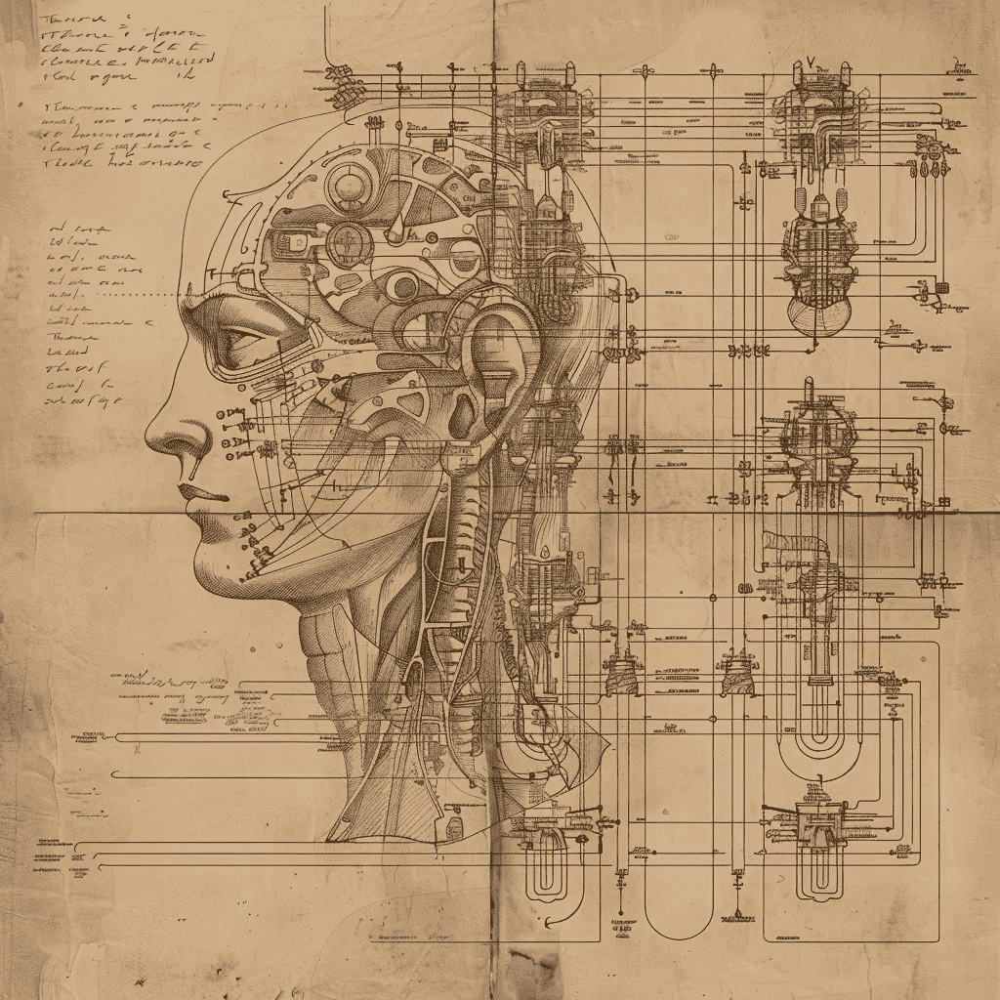
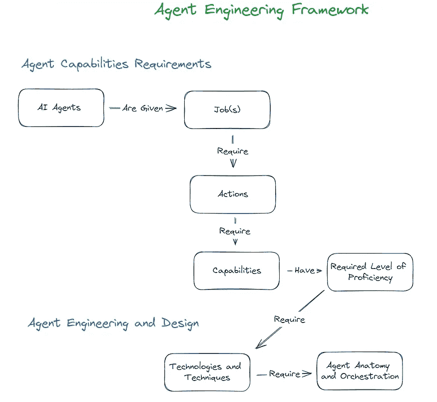
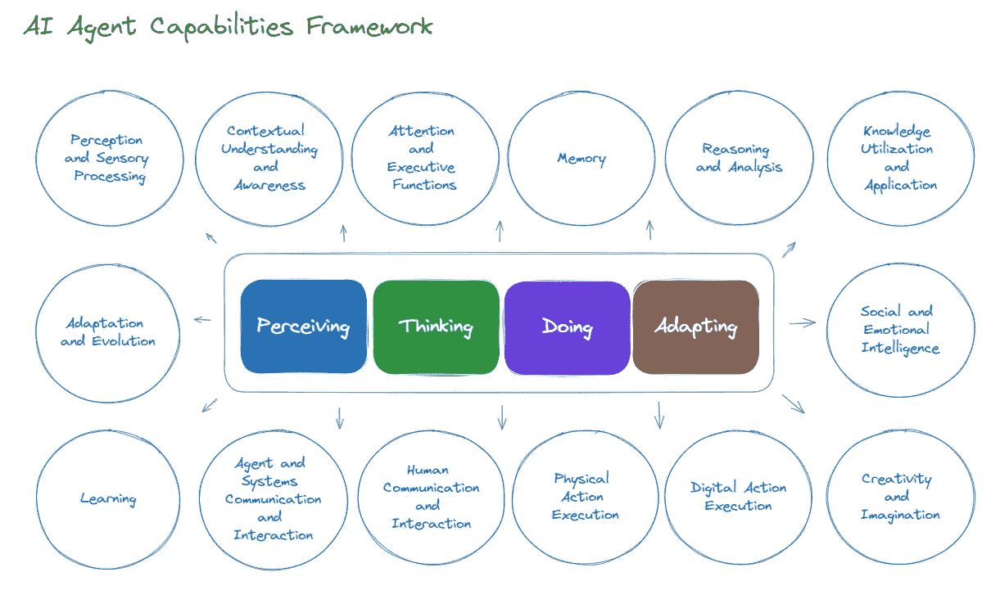

# AI 代理能力工程

> 原文：[`towardsdatascience.com/ai-agent-capabilities-engineering-34c7785f413e?source=collection_archive---------5-----------------------#2024-06-18`](https://towardsdatascience.com/ai-agent-capabilities-engineering-34c7785f413e?source=collection_archive---------5-----------------------#2024-06-18)

## 引入一个 AI 代理的高级能力工程框架

 [Giuseppe Scalamogna](https://medium.com/@hominum_universalis?source=post_page---byline--34c7785f413e--------------------------------)

·发表于[Towards Data Science](https://towardsdatascience.com/?source=post_page---byline--34c7785f413e--------------------------------) ·阅读时间 11 分钟·2024 年 6 月 18 日

--

来源：作者提供的图片，并通过 MidJourney 生成

## 介绍

在我最近的文章《*从提示工程到代理工程*》中，我提出了一个 AI 代理工程框架，介绍了一种心理模型，用于设计和创建 AI 代理。概括一下，该框架提出了以下结构：

+   AI 代理被分配任务

+   任务要求完成特定的行动

+   执行动作需要能力

+   能力具有所需的熟练程度

+   所需的熟练程度需要技术与技巧

+   技术与技巧需要协调

如果你错过了那篇文章或需要参考它，可以在[这里](https://medium.com/towards-data-science/from-prompt-engineering-to-agent-engineering-f314fdf52a25)找到。

尽管框架看起来简单，但从更深层次来看，它涉及广泛的主题和理念。深入探讨由更大框架提出的概念是一项艰巨的任务，在这篇文章中，我们通过聚焦于 AI 代理能力工程框架，继续我们的工作。该框架的思路依赖于一种以分类为导向的思维方式，扩展了主要源于认知与行为科学的概念。

## 认知与行为科学基础

正如我在其他文章中提到的，贯穿人类工具与技术发展的历史，我们经常以自身作为我们试图构建的模型或灵感来源。AI 本身的一个典型例子是受到人脑启发的神经网络。因此，为 AI 代理能力建立框架，自然而然地将认知和行为科学作为灵感、指导和有用概念的扩展。让我们首先对这些科学的内容有一个高层次的理解。

**认知科学**

认知科学是关于心智及其过程的跨学科研究，涵盖心理学、神经科学、语言学和人工智能等领域。它为我们理解人类如何感知、思考、学习和记忆提供了关键见解。

**行为科学**

行为科学是一个跨学科领域，研究认知过程和行为，通常考虑个体与其环境之间的行为互动。它包括心理学、社会学、人类学和经济学等学科。

随着对 AI 代理可以完成的任务的期望不断提高，将我们的能力框架基于认知和行为理论，应该能为我们奠定坚实的基础，以开始满足这些期望，并帮助我们开启一个 AI 代理能够像人类一样熟练执行复杂工作的未来。

## **AI Agent Capabilities Framework**

在我们深入研究细节之前，让我们从一个高层次考虑如何分类所谓的“能力”，以推动我们的代理需要采取的“行动”。我建议一般来说它们可以分为感知、思考、行动和适应几类。从那里我们可以进一步识别这些类别中更细粒度的能力示例。尽管所得到的框架在分类上是一致的，但请记住，粒度能力和类别之间的隐含关系是近似的。实际上，这些能力在整个框架中是紧密交织的，尝试模拟这种多维性在这个阶段并不特别有用。下面是构成框架的主要类别和子类别的视觉表达，没有您将很快看到的类别对齐。

虽然我们的主要关注点是由 LLM 中心的 AI 代理工程驱动的，为了未来证明和允许这些框架扩展到体现 AI 和机器人领域，我们还融入了适用于这些环境的概念。

最后，我们在框架中并未明确处理自主性问题，因为它更适合作为某个代理或其多个能力的一个总体现特征。也就是说，自主性并不是代理在执行其工作时必须具备的必要条件。

有了这些基础，我们接下来将扩展整个框架。

# 感知

包括代理从环境中获取、解读和组织感官信息的能力。它涉及对适当刺激的检测、识别和理解，使代理能够按预期执行任务。具体能力的示例包括：

+   **视觉处理：** 图像和物体的识别与处理。

+   **文本数据处理：** 文本的识别和处理。

+   **听觉处理：** 语音和声音的识别与处理。

+   **触觉处理：** 触觉识别和处理。

+   **嗅觉和味觉处理：** 气味的识别和处理。

+   **感官整合：** 将来自不同感官输入的数据整合以便形成一致的理解。

# 思考

指的是使代理能够处理信息、形成概念、解决问题、做出决策并应用知识的能力。具体能力的示例包括：

**情境理解与意识**

+   **情境意识与理解：** 识别和理解情境、环境、空间和时间背景。

+   **自我意识与元认知：** 自我意识、自我监控、自我评估、元认知知识。

**注意力与执行功能**

+   **选择性注意力：** 专注于相关数据，同时过滤掉无关信息。

+   **分心注意力：** 同时管理和处理多个任务或信息来源。

+   **持续注意力：** 在较长时间内保持注意力和集中精力。

+   **规划：** 制定一系列行动或策略以实现特定目标。

+   **决策制定：** 分析信息、评估选项，并选择最佳的行动方案。

+   **抑制控制：** 抑制不适当或不希望发生的行为或动作。

+   **认知灵活性：** 在思考两个不同概念之间进行切换，或同时思考多个概念。

+   **情绪调节：** 管理并以适当的情绪应对情感体验。

**记忆**

+   **短期记忆：** 临时保持和操作信息。

+   **工作记忆：** 主动处理和操作信息。

+   **长期记忆：** 在较长时间内存储和提取信息。

**推理与分析**

+   **逻辑推理：** 基于形式逻辑和结构化规则得出结论。

+   **概率推理：** 基于概率和统计模型做出预测和决策。

+   **启发式推理：** 运用经验法则或捷径来寻找解决方案。

+   **归纳推理：** 从具体观察中进行概括

+   **演绎推理：** 从一般原则或前提出发得出特定结论

+   **溯因推理：** 形成假设以解释观察到的现象

+   **类比推理：** 通过寻找与之前遇到的情况相似之处来解决问题

+   **空间推理：** 理解和推理空间关系

**知识利用与应用**

+   **语义知识：** 获取并应用构成概念的世界一般知识和特征

+   **情景知识：** 获取和使用特定事件和经历的知识

+   **程序性知识：** 知道如何高效地执行任务和行动

+   **陈述性知识：** 获取和使用事实信息

+   **语言理解：** 理解和解释语言

**社交与情感智能**

+   **情感识别：** 检测和解释情感

+   **社交互动：** 以社交适当的方式与人类或其他代理互动

+   **同理心：** 理解并回应他人的情感状态

+   **心智理论：** 推断和理解心理状态、意图和信念

+   **社交感知：** 识别和理解社交线索和上下文

+   **关系管理：** 管理和培养长期关系

**创造力与想象力**

+   **创意生成：** 产生新的和创新的想法

+   **艺术创作：** 创作原创艺术作品，如音乐、视觉艺术和文学

+   **富有想象力的思维：** 设想并阐述超越当前现实的新可能性和情境

# 做

**描述：** 涉及代理与环境互动和执行任务的能力。它包括数字和物理行为。这一类别的能力还涵盖了沟通与互动，使代理能够与用户和其他系统进行有意义的交流。具体能力的例子包括：

+   **数字行动执行：** 执行特定的数字操作，包括输出生成、自动化、问题解决、决策实施和响应行动。

+   **身体行动执行：** 规划、启动和调整运动，将感官信息与运动动作结合，抓取和处理物体，学习和适应新的运动技能。

+   **人类沟通与互动：** 与用户进行有意义的对话，处理多种语言，并保持对话的上下文。

+   **代理与系统沟通与互动：** 与其他 AI 代理和系统有效沟通与协调，使用协议和接口交换信息、同步行动，并在平台间保持互动上下文。

# 适应

**描述：** 指的是允许代理根据新信息、经验和反馈调整和进化其行为、过程和情感反应的能力。明确来说，我们在这里关注的是代理在其操作状态下的适应和学习能力，而非其基础能力启用过程中发生的学习。在我们的框架中，这属于工具与技术的范畴。具体能力的例子包括：

**学习**

+   **认知学习：** 通过认知过程获取知识

+   **模仿学习：** 通过观察和复制他人的行为来获取新技能和行为

+   **体验式学习：** 通过经验和反思学习

**适应与进化**

+   **行为适应：** 根据反馈或环境变化调整行为

+   **认知适应：** 基于新信息调整认知过程

+   **情感适应：** 基于经验和情境调整情感反应

+   **运动适应：** 通过练习和反馈来调整运动技能

+   **社会适应：** 根据社会线索和互动调整社会行为

+   **进化：** 随着时间推移，行为和认知过程的长期变化与改进

由于这篇文章旨在简要说明，而非详细讨论每一个例子中的具体能力，因此我们不会深入探讨每个具体能力的细节。虽然我希望这已涵盖了所有内容，但充其量它只是一个良好的开始。通过不断迭代和反馈，我们必将对其进行修订、改进，并朝着一个更稳定的框架迈进，进而适合更广泛的应用。

现在让我们转向一些示例，说明框架的实际应用以及它如何在代理工程设置中发挥价值。

## **实践中的 AI 代理能力框架**

AI 代理能力框架的实际应用涉及利用其结构化的概念，这些概念根植于认知和行为科学，来促进设计思维过程。考虑到我们在设想和表述代理期望能力时的多样性，这一框架有助于建立一个共同的基础，促进能力设计和工程的一致性和全面性。随着对我们 AI 代理能力的期望水平不断提升，这一框架尤为重要。让我们来看一个例子：

**客户支持 AI 代理**

让我们考虑一个 AI 代理，它的工作是提供客户支持和个性化的产品推荐。在这个框架的基础上，我们可以设定一个更高保真度的工作和场景描述，描绘一个更加生动的画面。

**工作职责：** 提供卓越且富有同理心的客户支持和产品推荐，同时主动预测销售趋势，并结合详细的上下文元素，进行高度个性化的互动。

**场景：** 这是一个繁忙的在线客服环境，我们的人工智能代理不仅需要解决客户查询并提供产品推荐，还需要通过预测需求和个性化互动来提升整体客户体验。这是一个涵盖广泛行动和能力的工作。几年前，构建这些能力中的一些几乎是不可能的。那么，是否能够通过我们的人工智能代理能力框架有效地表达这个工作的能力，以便评估其可行性呢？让我们深入了解一下，同时请记住，以下大纲并非全面详尽：

**所需行动：**

+   理解并解读客户查询。

+   提供准确且有帮助的回应。

+   适当时上报问题。

+   基于客户互动预测销售趋势。

+   提供产品推荐。

**所需能力：**

1.  **感知**

+   **文本数据处理：** 识别并理解客户书面查询，包括复杂句子和俚语。

+   **听觉处理：** 转录并理解口头查询，即使在嘈杂的环境中。

+   **视觉处理：** 在视频支持过程中解读视觉线索和肢体语言。

**2. 认知**

**情境理解和意识：**

+   **时间意识：** 识别季节性趋势和高峰期。

+   **位置意识：** 理解地理位置数据。

+   **个人情境意识：** 了解个别客户的历史和偏好。

**记忆：**

+   **短期记忆：** 保持最近的互动以维持情境。

+   **长期记忆：** 利用过去的互动来保持情境。

**推理与分析：**

+   **概率推理：** 从客户互动中识别模式，预测未来行为。

+   **推理逻辑：** 应用逻辑框架解决问题。

+   **行为分析：** 理解并解读客户行为模式。

+   **趋势分析：** 理解当前市场趋势和季节性数据。

**知识利用与应用**

+   **语义知识：** 运用一般世界知识来理解和回应查询。

+   **情节性知识：** 利用特定事件和过去的经验提供相关支持。

+   **声明性知识：** 获取事实信息，以提供准确的回应。

**社交与情感智力**

+   **情绪识别：** 检测并解读客户情绪。

+   **社交互动：** 以社交适当的方式与客户互动。

+   **心智理论：** 推测客户需求，并提前提供解决方案。

+   **关系管理：** 与客户建立良好关系，促进忠诚度。

**创造力和想象力**

+   **富有想象力的思维：** 展望当前问题之外的新可能性。

**行动**

**数字互动：**

+   **输出生成：** 快速、准确、并具有情境适应性的回应。

+   **产品推荐生成：** 根据客户偏好和其他相关分析推荐产品。

**人类沟通与互动：**

+   **对话连续性：** 在多次互动中保持上下文。

**代理与系统之间的通信：**

+   **代理间协调：** 与其他 AI 系统沟通，以同步行动并共享见解。

**适应**

**学习：**

+   **体验式学习：** 持续提升对客户行为的理解。

**适应：**

+   **行为适应：** 根据反馈调整互动风格。

+   **认知适应：** 用新信息更新知识。

+   **情感适应：** 调整情感反应。

其中一些见解可能会让人感到惊讶。例如，AI 代理是否应该具备关系管理能力？又比如，AI 代理是否可以通过视频观察并回应它们能够“观察到”的全新数据点，从而伪装成一个具象的存在？当然，关于隐私的关注和问题层出不穷，但这并不是我们应该完全排除的概念。

## **通过技术和方法创造能力**

尽管本文将不会集中评估启用这些能力的技术和方法，但我们应该回答在完成上述分析后自然会出现的问题。大型语言模型（LLMs）难道不能直接提供大多数这些能力的工具吗？

虽然大型语言模型（LLMs）确实在技术上取得了飞跃性的进展，但简单的答案是：没有。尤其是在推理和分析能力方面，尽管 LLMs 能够令人印象深刻地模拟看似推理或分析的过程，但远远不及人类在这些方面的能力。简而言之，LLMs 提供了一个不完全可靠但强大的捷径，使得许多这些能力得以实现。它们代表了智能和互动技术中一个极为重要的进化步骤，它们的前所未有的采用有助于解释为什么关于人工通用智能（AGI）的概念会引发如此大的兴奋。尽管有关其实际涵义的定义仍然是争论的主题，但如果实现，它可能成为实现上述许多认知/行为能力的首选技术解决方案。

## 结论

我希望你会发现 AI 代理能力工程框架是一种定义你的 AI 代理能力的深刻方法。通过整合认知和行为科学的概念，该框架旨在指导 AI 代理开发执行复杂任务所需的能力。该框架相对复杂，并且肯定会随着时间的推移而演变。目前阶段的关键要点是围绕“感知、思考、行动和适应”构建的心理模型。这四个高层次的概念本身就为有效组织和开发代理能力提供了一个非常坚实的基础。

感谢阅读，并请关注此框架的未来改进以及其他方面的 AI 代理工程框架扩展。如果你想进一步讨论此框架或我所写的其他话题，欢迎通过[LinkedIn](https://www.linkedin.com/in/giuseppe-scalamogna-8b389145/)与我联系。

除非另有说明，本文中的所有图片均由作者提供。
