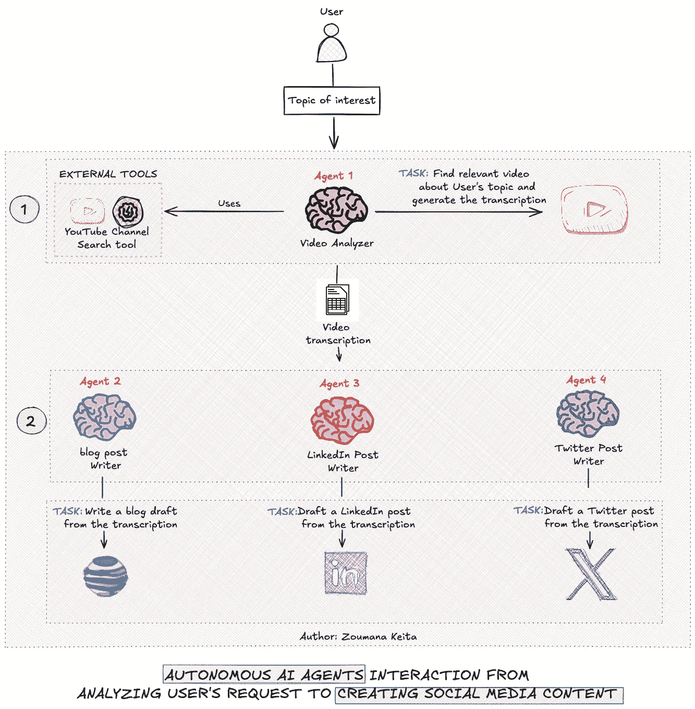

# AI Agents——从概念到 Python 中的实际实现

> 原文：[`towardsdatascience.com/ai-agents-from-concepts-to-practical-implementation-in-python-fb26789b1560?source=collection_archive---------0-----------------------#2024-08-12`](https://towardsdatascience.com/ai-agents-from-concepts-to-practical-implementation-in-python-fb26789b1560?source=collection_archive---------0-----------------------#2024-08-12)

## 这将改变你对 AI 及其能力的看法

 [Zoumana Keita](https://zoumanakeita.medium.com/?source=post_page---byline--fb26789b1560--------------------------------)

·发表于[Towards Data Science](https://towardsdatascience.com/?source=post_page---byline--fb26789b1560--------------------------------) ·阅读时长 10 分钟·2024 年 8 月 12 日

--

# 动机

正如一则非洲谚语所说：

> 单打独斗，我们走得更快；齐心协力，我们走得更远。

这也与这样一个观点相关：没有人可以在每个领域都是专家。团队合作和有效的任务分配对于实现伟大的目标至关重要。

相似的原则适用于大语言模型（LLMs）。我们可以将多个 LLM 或`AI Agents`组合起来，每个 LLM 或`AI Agent`专注于特定领域，而不是让单个 LLM 处理复杂任务。

这一策略可以打造出更强大的系统，提供更高质量的结果。

在本文中，你将学到：

+   什么是`AI Agents`

+   为什么值得考虑它们来解决现实世界的用例

+   如何从零开始创建一个完整的`AI Agents`系统

# 系统的一般工作流程

在开始任何编码之前，我们先清楚地了解本文中构建的系统的主要组成部分。

自主 AI 代理的工作流程（图：作者）

+   该工作流程总体…
