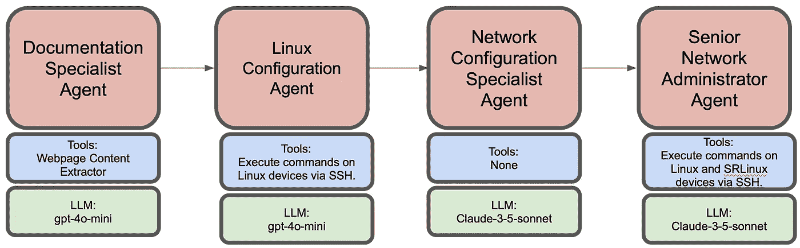

# 网络行业中的 AI 代理

> 原文：[`towardsdatascience.com/ai-agents-in-networking-industry-f73a42fa22e1?source=collection_archive---------9-----------------------#2024-11-27`](https://towardsdatascience.com/ai-agents-in-networking-industry-f73a42fa22e1?source=collection_archive---------9-----------------------#2024-11-27)

## 用于部署、配置和监控网络的 AI 代理

[](https://medium.com/@mandeepkular?source=post_page---byline--f73a42fa22e1--------------------------------)[](https://towardsdatascience.com/?source=post_page---byline--f73a42fa22e1--------------------------------) [Mandeep Kular](https://medium.com/@mandeepkular?source=post_page---byline--f73a42fa22e1--------------------------------)

·发表于 [Towards Data Science](https://towardsdatascience.com/?source=post_page---byline--f73a42fa22e1--------------------------------) ·阅读时间：11 分钟·2024 年 11 月 27 日

--

AI 代理在 2024 年成为热议话题，且实至名归。与传统的 AI 模型或与大型语言模型（LLMs）的交互不同，后者仅根据静态训练数据提供回应，AI 代理是动态的实体，能够感知、推理（得益于提示技术）并在其操作领域内自主行动。它们的适应性和优化过程的能力使它们在需要复杂决策和实时响应的领域中不可或缺，如网络部署、测试、监控和调试。在未来的日子里，我们将看到 AI 代理在各行各业的广泛应用，尤其是在网络行业。



代理工作流（图片由作者提供）

在这里，我展示了通过 AI 代理进行网络部署、配置和监控的过程。整体代理工作流由 4 个代理组成。第一个代理负责从 [`learn.srlinux.dev/get-started/lab/`](https://learn.srlinux.dev/get-started/lab/) 网站获取安装步骤。第二个代理执行这些步骤。第三个代理根据网络拓扑提供相关的节点配置，最后一个代理执行配置并验证端到端的连接性。

> ***有关代码手册的详细信息，请查看我的 GitHub 链接：*** [***AI-Agents-For-Networking***](https://github.com/mkular/AI-Agents-For-Networking)***.***

## **使用 CrewAI 的 MAS（多代理系统）部署网络**

对于这个使用案例，整个拓扑部署在一个预先构建的 Debian 12 UTM 虚拟机上（作为沙盒环境）。选择它的原因是，它已经预装了所有相关的软件包，如 containerlab 和 docker 包。Containerlab 帮助轻松启动各种基于容器的网络拓扑。选择了以下拓扑，包含 Linux 容器和诺基亚的 SR Linux 容器：

Client1 — — Leaf1 — — Spine1 — — Leaf2 — — Client2

其中 Client1 和 Client2 是 Linux 容器，Leaf1 和 Leaf2 是 IXR-D2L 类型，Spine1 是 IXR-D5 类型的 SR Linux 容器。

以下是每个代理的简要工作流：

1.  **文档专家代理**

它访问给定的网址，提取安装步骤、网络拓扑部署步骤，并查找节点连接指令。以下是创建代理、任务及其自定义工具的示例代码：

```py
# Custom tool to extract content from a given webpage
class QuickstartExtractor(BaseTool):
    name: str = "WebPage Content extractor"
    description: str = "Get all the content from a webpage"

    def _run(self) -> str:    
            url = "https://learn.srlinux.dev/get-started/lab/"
            response = requests.get(url)
            response.raise_for_status()
            return response.text

# Create doc specialist Agent
doc_specialist = Agent(
   role="Documentation Specialist",
   goal="Extract and organize containerlab quickstart steps",
   backstory="""Expert in technical documentation with focus on clear, 
   actionable installation and setup instructions.""",
   verbose=True,
   tools = [QuickstartExtractor()],
   allow_delegation=False
        )

# Task for doc speaclist Agent
doc_task = Task(
    description=(
                    "From the containerlab quickstart guide:\n"
     "1\. Extract installation steps \n"
     "2\. Identify topology deployment steps \n"
     "3\. Find node connection instructions \n"

    "Present in a clear, sequential format.\n"
    ),
                expected_output="List of commands",
    agent=doc_specialist
                )
```

运行后，以下是该代理的示例输出（最终答案）：

```py
# Agent: Documentation Specialist
## Final Answer: 
```bash

# 安装步骤

curl -sL https://containerlab.dev/setup | sudo -E bash -s "all"

# 拓扑部署步骤

sudo containerlab deploy -c -t https://github.com/srl-labs/srlinux-getting-started

# 节点连接指令

ssh leaf1

```py
```

如图所示，它已从网址中清晰地提取了所需的步骤。然后这些步骤被传递给下一个代理。

> ***注意：为所有代理添加代码会使本文变得冗长。请查看我的 GitHub 仓库获取更多细节：*** [***AI-Agents-For-Networking***](https://github.com/mkular/AI-Agents-For-Networking)***.***

**2. Linux 配置代理**

执行从文档专家代理获取的命令。它获得了 UTM 虚拟机的登录详情，并指示在该虚拟机上执行命令。完成后，它会检查所有的 docker 容器是否都在运行。它还在执行任何 containerlab/docker 命令之前检查虚拟机的健康状态。

该代理的输出（最终答案）清晰地显示了虚拟机健康检查、containerlab 和 docker 命令的成功执行：

```py
# Agent: Linux Command Executor and Docker Orchestrator
## Final Answer: 
1\. **System Uptime Check**: 
   - Output: `14:56:17 up 1 day, 20:25, 60 users,  load average: 0.01, 0.39, 0.86`

2\. **Disk Usage Check**:
   - Output:
   ```

文件系统                   大小  已用 可用 用% 挂载点

udev                         5.9G     0  5.9G   0% /dev

tmpfs                        1.2G  1.3M  1.2G   1% /run

/dev/mapper/debian--vg-root   61G  5.7G   52G  10% /

tmpfs                        5.9G     0  5.9G   0% /dev/shm

tmpfs                        5.0M     0  5.0M   0% /run/lock

/dev/sda2                    456M   92M  340M  22% /boot

/dev/sda1                    511M  5.9M  506M   2% /boot/efi

tmpfs                        1.2G     0  1.2G   0% /run/user/1000

```py

3\. **Running Processes Check**: 
   - Output: (truncated for brevity)
   ```

USER         PID %CPU %MEM    VSZ   RSS TTY      STAT START   TIME COMMAND

root           1  0.0  0.1 168128 12792 ?        Ss   Nov25   1:28 /sbin/init

...

debian    106849  0.0  0.0   8244  4992 pts/0    Ss+  Nov25   0:09 -bash

```py

4\. **Network Connectivity Check**: 
   - Output:
   ```

PING 8.8.8.8 (8.8.8.8) 56(84) 字节的数据。

64 字节来自 8.8.8.8：icmp_seq=1 ttl=116 时间=15.4 毫秒

...

--- 8.8.8.8 ping 统计 ---

4 个数据包传输，4 个接收，0% 丢包，时间 3012 毫秒

rtt 最小/平均/最大/均方根 = 15.316/16.778/20.466/2.142 ms

```py

5\. **Containerlab Installation Check**:
   - Containerlab is already installed and is at the latest version (0.59.0).

6\. **Topology Deployment Output**:
   - Output of the deployed topology:
   ```

+---+---------+--------------+------------------------------------+---------------+---------+----------------+----------------------+

| # |  名称   | 容器 ID |               镜像                |     类型      |  状态  |  IPv4 地址  |     IPv6 地址     |
| --- | --- | --- | --- | --- | --- | --- | --- |

+---+---------+--------------+------------------------------------+---------------+---------+----------------+----------------------+

| 1 | client1 | ab894528a0e9 | ghcr.io/srl-labs/network-multitool | linux         | 运行中 | 172.20.20.4/24 | 3fff:172:20:20::4/64 |
| --- | --- | --- | --- | --- | --- | --- | --- |
| 2 | client2 | 6f9f0822be5d | ghcr.io/srl-labs/network-multitool | linux         | 运行中 | 172.20.20.2/24 | 3fff:172:20:20::2/64 |
| 3 | leaf1   | e7a1a3874600 | ghcr.io/nokia/srlinux:24.7.2       | nokia_srlinux | 运行中 | 172.20.20.3/24 | 3fff:172:20:20::3/64 |
| 4 | leaf2   | ed4399b8f7d6 | ghcr.io/nokia/srlinux:24.7.2       | nokia_srlinux | 运行中 | 172.20.20.5/24 | 3fff:172:20:20::5/64 |
| 5 | spine1  | ada601805590 | ghcr.io/nokia/srlinux:24.7.2       | nokia_srlinux | 运行中 | 172.20.20.6/24 | 3fff:172:20:20::6/64 |

+---+---------+--------------+------------------------------------+---------------+---------+----------------+----------------------+

```py

7\. **List of Running Docker Containers**:
   - Output:
   ```

容器 ID   镜像                                命令                  创建时间         状态         端口                                          名称

ada601805590   ghcr.io/nokia/srlinux:24.7.2         "/tini -- fixuid -q …"   4 分钟前   运行中 4 分钟                                                spine1

6f9f0822be5d   ghcr.io/srl-labs/network-multitool   "/bin/sh /docker/ent…"   4 分钟前   运行中 4 分钟   22/tcp, 80/tcp, 443/tcp, 1180/tcp, 11443/tcp   client2

e7a1a3874600   ghcr.io/nokia/srl-labs/network-multitool   "/bin/sh /docker/ent…"   4 分钟前   运行中 4 分钟                                                leaf1

ab894528a0e9   ghcr.io/nokia/srl-labs/network-multitool   "/bin/sh /docker/ent…"   4 分钟前   运行中 4 分钟                                                client1

ed4399b8f7d6   ghcr.io/nokia/srlinux:24.7.2         "/tini -- fixuid -q …"   4 分钟前   运行中 4 分钟                                                leaf2

```py

All tasks completed successfully with the appropriate outputs!
```

**3\. 网络配置专家代理**

这个代理的任务是理解拓扑结构，即节点数量及其连接性。然后，它需要提出 IP 分配方案，并生成 Linux 容器和 SR Linux 容器的相关接口和路由配置，同时遵守 IP 分配方案。

对于 SR Linux 配置，提示中给出了一个示例配置。这个示例配置也可以通过代理从 PDF 格式的配置指南中获取（前提是有合适的工具）。

在下面这个代理的输出中，可以清楚地看到，它已经成功根据拓扑结构、相关配置和路由来分配了 IP 地址：

```py
# Agent: Senior Network Administrator
## Final Answer: 
# Configuration for client1 (Linux)
```bash

/sbin/ip address add 10.1.1.2/24 dev eth1

/sbin/ip route add 10.1.4.2/32 via 10.1.1.1

```py

# Configuration for leaf1 (SRLinux)
```bash

进入候选私人模式

# 配置数据接口

设置 / interface ethernet-1/1 管理状态启用

设置 / interface ethernet-1/1 subinterface 0 管理状态启用

设置 / interface ethernet-1/1 subinterface 0 ipv4 地址 10.1.1.1/24

设置 / interface ethernet-1/1 subinterface 0 ipv4 管理状态启用

设置 / interface ethernet-1/49 管理状态启用

设置 / interface ethernet-1/49 subinterface 0 管理状态启用

设置 / interface ethernet-1/49 subinterface 0 ipv4 地址 10.1.2.1/24

设置 / interface ethernet-1/49 subinterface 0 ipv4 管理状态启用

# 将接口添加到默认命名空间

设置 / network-instance default interface ethernet-1/1.0

设置 / network-instance default interface ethernet-1/49.0

# 配置 BGP

设置 / network-instance default protocols bgp 管理状态启用

设置 / network-instance default protocols bgp 路由器 ID 1.1.1.1

设置 / network-instance default protocols bgp 自治系统 65001

设置 / network-instance default protocols bgp afi-safi ipv4-unicast 管理状态启用

设置 / network-instance default protocols bgp group ebgp 管理状态启用

设置 / network-instance default protocols bgp group ebgp 导出策略 [ export-all ]

设置 / network-instance default protocols bgp group ebgp 导入策略 [ export-all ]

设置 / network-instance default protocols bgp neighbor 10.1.2.2 管理状态启用

设置 / network-instance default protocols bgp neighbor 10.1.2.2 对等组 ebgp

设置 / network-instance default protocols bgp neighbor 10.1.2.2 对等 AS 65002

# 创建策略

设置 / 路由策略 策略 export-all 默认操作 策略结果 接受

提交现在

```py

# Configuration for spine1 (SRLinux)
```bash

进入候选私人模式

# 配置数据接口

设置 / interface ethernet-1/1 管理状态启用

设置 / interface ethernet-1/1 subinterface 0 管理状态启用

设置 / interface ethernet-1/1 subinterface 0 ipv4 地址 10.1.2.2/24

设置 / interface ethernet-1/1 subinterface 0 ipv4 管理状态启用

设置 / interface ethernet-1/2 管理状态启用

设置 / interface ethernet-1/2 subinterface 0 管理状态启用

设置 / interface ethernet-1/2 subinterface 0 ipv4 地址 10.1.3.1/24

设置 / interface ethernet-1/2 subinterface 0 ipv4 管理状态启用

# 将接口添加到默认命名空间

设置 / network-instance default interface ethernet-1/1.0

设置 / network-instance default interface ethernet-1/2.0

# 配置 BGP

设置 / network-instance default protocols bgp 管理状态启用

设置 / network-instance default protocols bgp 路由器 ID 2.2.2.2

设置 / network-instance default protocols bgp 自治系统 65002

设置 / network-instance default protocols bgp afi-safi ipv4-unicast 管理状态启用

设置 / network-instance default protocols bgp group ebgp 管理状态启用

设置 / network-instance default protocols bgp group ebgp 导出策略 [ export-all ]

设置 / network-instance default protocols bgp group ebgp 导入策略 [ export-all ]

set / network-instance default protocols bgp neighbor 10.1.2.1 admin-state enable

set / network-instance default protocols bgp neighbor 10.1.2.1 peer-group ebgp

set / network-instance default protocols bgp neighbor 10.1.2.1 peer-as 65001

set / network-instance default protocols bgp neighbor 10.1.3.2 admin-state enable

set / network-instance default protocols bgp neighbor 10.1.3.2 peer-group ebgp

set / network-instance default protocols bgp neighbor 10.1.3.2 peer-as 65003

# 创建策略

set / routing-policy policy export-all default-action policy-result accept

立即提交

```py

# Configuration for leaf2 (SRLinux)
```bash

进入候选私有配置

# 配置数据接口

set / interface ethernet-1/1 admin-state enable

set / interface ethernet-1/1 subinterface 0 admin-state enable

set / interface ethernet-1/1 subinterface 0 ipv4 address 10.1.4.1/24

set / interface ethernet-1/1 subinterface 0 ipv4 admin-state enable

set / interface ethernet-1/49 admin-state enable

set / interface ethernet-1/49 subinterface 0 admin-state enable

set / interface ethernet-1/49 subinterface 0 ipv4 address 10.1.3.2/24

set / interface ethernet-1/49 subinterface 0 ipv4 admin-state enable

# 将接口添加到默认命名空间

set / network-instance default interface ethernet-1/1.0

set / network-instance default interface ethernet-1/49.0

# 配置 BGP

set / network-instance default protocols bgp admin-state enable

set / network-instance default protocols bgp router-id 3.3.3.3

set / network-instance default protocols bgp autonomous-system 65003

set / network-instance default protocols bgp afi-safi ipv4-unicast admin-state enable

set / network-instance default protocols bgp group ebgp admin-state enable

set / network-instance default protocols bgp group ebgp export-policy [ export-all ]

set / network-instance default protocols bgp group ebgp import-policy [ export-all ]

set / network-instance default protocols bgp neighbor 10.1.3.1 admin-state enable

set / network-instance default protocols bgp neighbor 10.1.3.1 peer-group ebgp

set / network-instance default protocols bgp neighbor 10.1.3.1 peer-as 65002

# 创建策略

set / routing-policy policy export-all default-action policy-result accept

立即提交

```py

# Configuration for client2 (Linux)
```bash

/sbin/ip address add 10.1.4.2/24 dev eth1

/sbin/ip route add 10.1.1.2/32 via 10.1.4.1

```py

This configuration:
1\. Uses unique subnets for each connection:
   - client1-leaf1: 10.1.1.0/24
   - leaf1-spine1: 10.1.2.0/24
   - spine1-leaf2: 10.1.3.0/24
   - leaf2-client2: 10.1.4.0/24

2\. Configures BGP with unique AS numbers:
   - leaf1: AS65001
   - spine1: AS65002
   - leaf2: AS65003

3\. Implements specific routes on clients for end-to-end connectivity
4\. Follows the exact SRLinux configuration format provided
5\. Uses proper routing policies for BGP route exchange
```

**4\. 高级网络管理员代理**

该代理获取生成的配置并将其应用到所有节点，检查 BGP 对等连接是否建立，然后最终执行端到端的 ping 测试以验证连接性。此时，代理仅通过推测配置命令就能得到正确的显示命令。

以下是此代理在成功配置网络拓扑并检查端到端连接后获得的最终答案：

```py
# Agent: Network Configuration Specialist
## Final Answer: 
# Network Configuration Report

## Topology Information
### Devices and Interfaces
1\. **client1**
   - Interface: eth1
   - IP: 10.1.1.2/24
   - Static route: 10.1.4.2/32 via 10.1.1.1

2\. **leaf1** (AS65001)
   - ethernet-1/1: 10.1.1.1/24 (connected to client1)
   - ethernet-1/49: 10.1.2.1/24 (connected to spine1)
   - BGP Router ID: 1.1.1.1

3\. **spine1** (AS65002)
   - ethernet-1/1: 10.1.2.2/24 (connected to leaf1)
   - ethernet-1/2: 10.1.3.1/24 (connected to leaf2)
   - BGP Router ID: 2.2.2.2

4\. **leaf2** (AS65003)
   - ethernet-1/1: 10.1.4.1/24 (connected to client2)
   - ethernet-1/49: 10.1.3.2/24 (connected to spine1)
   - BGP Router ID: 3.3.3.3

5\. **client2**
   - Interface: eth1
   - IP: 10.1.4.2/24
   - Static route: 10.1.1.2/32 via 10.1.4.1

## Configuration Commands Executed
All configurations were successfully applied to their respective devices as per the provided configuration scripts. The key configurations included:
1\. Interface IP addressing
2\. BGP neighbor relationships
3\. Route policies
4\. Static routes on client machines

## Connectivity Test Results
```

PING 10.1.4.2 (10.1.4.2) 56(84) 字节数据。

从 10.1.4.2 收到 64 字节：icmp_seq=1 ttl=61 time=128 ms

从 10.1.4.2 收到 64 字节：icmp_seq=2 ttl=61 time=8.16 ms

从 10.1.4.2 收到 64 字节：icmp_seq=3 ttl=61 time=4.49 ms

64 字节来自 10.1.4.2：icmp_seq=4 ttl=61 time=5.86 ms

--- 10.1.4.2 ping 统计 ---

传输 4 个数据包，接收 4 个，丢包率 0%，时间 3005ms

rtt min/avg/max/mdev = 4.491/36.620/127.973/52.758 ms

```py

The ping test from client1 (10.1.1.2) to client2 (10.1.4.2) was successful with:
- 100% success rate (4/4 packets)
- Average round-trip time: 36.620ms
- No packet loss

This confirms that the BGP configurations are working correctly and the network is properly forwarding traffic between the clients through the leaf-spine topology.
```

# **结论**

AI 代理超越了自动化的范畴。它们可以推理并尝试提出替代方案。一个简单的例子是，如果一个 Linux 命令因权限问题失败，而代理有 sudo 密码的访问权限，那么下次它将尝试使用 sudo 密码以便成功。一个复杂的例子是，如果 BGP 对等连接没有建立，根据提示指令，它们可以尝试找出原因，甚至进行修复。

代理工作流有其挑战，需要与程序化方法不同的思维方式。到目前为止，我遇到的缺点包括，可能需要更长时间（有时要长得多）才能实现结果，运行时每次都不同，输出也会有所变化（这可以通过更好的提示词进行某种程度的控制）。

最后，对于一些琐碎、直接的任务，比如抓取网站并执行给定的命令，可以使用较小的 LLM，如 gpt-4o-mini 或 llama3.1–7b 等。然而，对于设计网络拓扑这样的任务，则需要更大的 LLM。虽然这里选择了 claude-3–5-sonnet，但理想情况下，一个好的 70b 模型应该足够。最后，你必须非常谨慎地使用提示词。它们可能决定你的用例成败！
