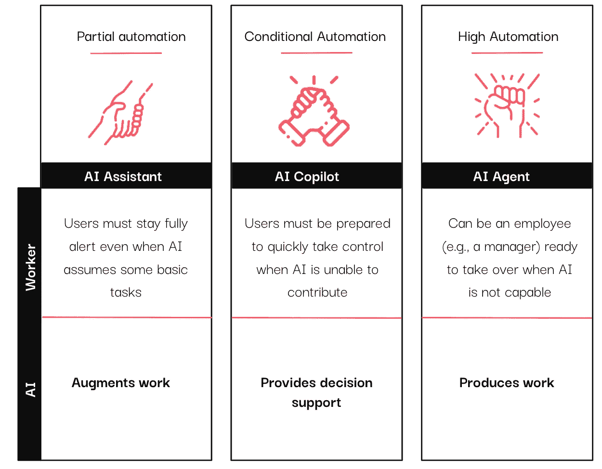
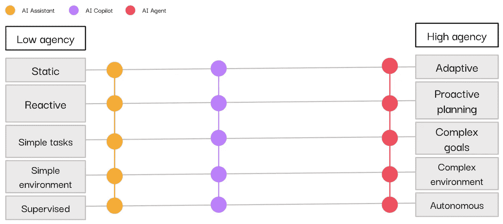

# 数据与分析中的 AI 助手、协作伙伴和代理：有什么区别？

> 原文：[`towardsdatascience.com/ai-assistants-copilots-and-agents-in-data-analytics-whats-the-difference-2e63f8fb2384?source=collection_archive---------6-----------------------#2024-06-07`](https://towardsdatascience.com/ai-assistants-copilots-and-agents-in-data-analytics-whats-the-difference-2e63f8fb2384?source=collection_archive---------6-----------------------#2024-06-07)

## 理解 AI 自主性：助手、协作伙伴、代理及其对商业价值的影响

 [Louise de Leyritz](https://medium.com/@louise.de.leyritz?source=post_page---byline--2e63f8fb2384--------------------------------)

·发表于 [Towards Data Science](https://towardsdatascience.com/?source=post_page---byline--2e63f8fb2384--------------------------------) ·阅读时长 7 分钟·2024 年 6 月 7 日

--

图片来源：CastorDoc

在过去的一年里，供应商已经将 AI 助手、协作伙伴和代理集成到他们的工具中，特别是在数据和分析领域。如果你在 LinkedIn（或任何地方）浏览得足够长，你可能已经遇到这些术语，它们通常被交替使用。

如果你发现自己对这些术语的确切含义感到不确定，你并不孤单。然而，当你考虑将这些 AI 驱动的系统引入你的组织时，清楚地了解它们各自的能力和应用场景是至关重要的。通过花时间了解这三种概念之间的区别，你将能更好地选择合适的技术。

最近，我遇到了一种有趣的思维模型，来自贝恩资本风险投资公司。他们研究了 AI 驱动工具中的不同自主性层级，以理解助手、协作伙伴和代理的区别。他们发现，关键的区别在于一个变量——自主性水平。AI 助手的自主性和主动性较低，AI 代理是主动且具有自主性的，而协作伙伴则介于两者之间。下图展示了这些差异。

三个自主性层级 — 图片改编自 [贝恩资本风险投资](https://baincapitalventures.com/insight/how-ai-powered-work-is-moving-from-copilot-to-autopilot/)

不同程度的自主性最终会影响商业价值，这是大多数公司关注的核心。低自主性的 AI 系统是增强工作、帮助利益相关者回答已知问题的好方法。然而，在许多组织中，大多数利益相关者不确定应该提出哪些数据问题，或者如何有效地利用答案。这正是公司希望实施更具自主性和自主决策能力的系统，以便作为利益相关者的指导伙伴。

在本文中，我将探讨助手、副驾驶和代理的不同自主性水平，以及它们如何最终影响每种技术对企业的商业价值。我旨在帮助您在实施这些技术时，能够区分它们之间的差异。

# I — AI 助手：提供洞察与优化工作流程

当你看到“AI 助手”这一术语时，可以理解为：支持功能、洞察、基本任务和低自主性。

AI 助手旨在提升人类在各种任务中的能力。它们基于预定义的规则操作，并且可以在需要时迅速提供准确且相关的信息。

在数据与分析领域，AI 助手基于一个关键假设：用户熟悉其领域。为了让你更清晰地了解，以下是 AI 助手在数据和分析领域的一些应用示例：

+   **自动生成文档**，为您生态系统中的表格和列生成文档。

+   **提供智能搜索功能**，引导用户找到最相关的数据资源，以满足他们的需求。

+   **将 SQL 查询转换为简明的英语**，使非技术用户能够轻松理解复杂的查询。

+   **生成并调试代码**，通过格式化 SQL 查询，提升可读性并优化性能，最终提高效率和生产力。

AI 助手可以使**已经从事分析工作的人**更加高效。它们简化了查找、理解和信任数据的过程。然而，重要的是要注意，助手假设用户已经熟悉分析工作流程，只能承担基本任务。

**如何一眼就能识别 AI 助手：**它们需要人类的监督，并且远未对决策产生影响。

# II — AI 副驾驶：提升决策支持

另一种区分 AI 助手、副驾驶和代理的方法是考察它们与决策过程的关系。如我们所见，助手提升了生产力，但并不直接影响决策。而副驾驶不仅提高了生产力，还在决策过程中提供了宝贵的支持。

“副驾驶”这一术语暗示着有一位主驾驶员在掌控方向，他/她通过提出正确的问题来决定方向。它表明利益相关者与机器之间存在合作关系，而这正是副驾驶所实现的目标。

那么，在分析领域，你能从 AI 助手中预期什么呢？

+   **自然语言查询：** AI 助手使用户能够使用日常语言提出关于数据的问题。然后，AI 根据用户的查询提供推荐和建议，帮助非技术用户轻松与数据互动并从中提取见解。

+   **数据分析：** AI 助手通过提出公式并根据数据模式提供见解和建议来帮助用户分析数据。

+   **数据可视化：** AI 助手根据数据和用户的目标推荐最合适的图表、图形和可视化方式。

+   **最佳下一步行动：** 从数据中获得的见解出发，AI 助手建议用户采取最有效的下一步措施。例如，在客户流失分析中，AI 可能会为被识别为高风险的客户提出具体的留存策略。

AI 助手代表了进化的更高级阶段，因为它们积极参与提出建议，为用户带来更大的商业价值。它们使用户能够更高效地工作，并做出更明智的决策，但它们仍然依赖于利益相关者提出正确的问题并确定所需的分析。

**如何一眼认出 AI 助手：** 它们通过推荐来增强决策过程，并与人类协同工作。

# III — AI 代理：自主决策者

> *“AI 代理是自主或半自主的软件实体，使用 AI 技术感知、做出决策、采取行动并在其数字或物理环境中实现目标。” Gartner*

AI 代理代表了 AI 最具自主性的形式。与 AI 助手和副驾驶不同，AI 代理可以独立操作，基于处理的数据做出决策，并从经验中学习。

AI 代理的独特之处在于它们的自主性。它们能够通过传感器感知环境，并通过执行器对其作出反应，使其能够在无需人工监督的情况下朝着实现特定目标的方向努力。

AI 代理与其环境进行互动 — 图片来自[CastorDoc](https://www.castordoc.com)

在语言模型的上下文中，代理的概念是指使模型能够将复杂的任务分解成更小、更易管理的步骤，然后顺序地执行这些步骤。在这一领域的一个重大突破是“[思维链提示](https://arxiv.org/abs/2201.11903)”的引入。这种方法使语言模型能够将多步骤问题分解成中间阶段，模拟“思考过程”来解决问题。

那么，在数据与分析领域，你可以期待从一个 AI 代理中获得什么呢？以下是一些关键能力。

+   **数据分析与决策**：AI 代理可以分析大量数据，识别模式，并做出符合特定目标的明智决策。它们可以应用机器学习技术从数据中提取洞察，支持并增强决策过程。

+   **信息处理**：AI 代理在多种方式上擅长处理信息，从而增强决策能力和理解力。

+   **优化**：AI 代理可以采用优化技术，在管理权衡和约束的同时最大化收益。它们可以生成可执行的行动计划，以优化分析过程并提高效率。

+   **协作**：多个 AI 代理可以共同处理超出单个代理能力的复杂分析任务。多个代理的联合应用可以提供更具适应性、可扩展性和健壮性的分析解决方案，特别是在需要基于来自各种来源的数据进行分散决策的环境中。

AI 代理是对商业价值影响最大的系统。事实上，企业中分析工具的采用在过去 20 年中一直停滞不前，徘徊在 20% 到 30% 之间。令人震惊的是，70% 的组织成员不知道该问什么问题或如何处理答案。AI 代理是最接近影响决策的系统。它们足够自主，可以定义目标，分析环境，并进行**指引性分析**——这是组织最需要的。

决策对企业盈利的影响最大。虽然 AI 助手帮助组织进行数据驱动的决策，但 AI 代理更进一步，使得“数据中心”的决策成为可能。它们影响了 70% 之前未参与分析的公司成员的决策过程。

**如何一眼识别 AI 代理**：它们可以在没有人类监督的情况下行动，能够做出决策并付诸实践——影响其环境。

AI 助手、AI 副驾驶和 AI 代理这三个术语常常被交替使用，可能导致混淆。然而，它们之间的区别相当简单。它们都处于自主性光谱上，每个都有不同的独立性水平和对决策的影响。

在光谱的一端，AI 助手增强了工作，提供有价值的支持但没有自主性。它们不会直接影响决策，而是作为有助于提高生产力的工具。

沿着这个光谱，我们可以找到 AI 副驾驶，它们具有更高的自主性。它们可以与利益相关者合作，并提供建议来指导决策过程，充当过程中的可信顾问。

AI 代理谱系：从助手到自主代理 —— 图片由 [CastorDoc](https://www.castordoc.com) 提供

在谱系的最远端，AI 代理是完全自主的实体，能够根据对环境和目标的分析来指示最佳行动方案。

作为买方，评估您组织中各个角色的自动化最佳程度非常重要。在审查潜在供应商时，要求他们明确指出其技术在自主性谱系中的位置。这将帮助您理解每个解决方案的能力和局限性，从而帮助您找到最佳解决方案。

追求具有更高自主性的 AI 系统可以带来更高的投资回报和更简单的实施。然而，这也需要对 AI 在准确理解您的用例方面有更高的信任。

**来源**

1.  Gartner. “创新指南：AI 代理。” [[链接](https://www.gartner.com/document/5332663?ref=solrAll&refval=413947133)]

1.  Simform. “AI 代理的类型。” [Simform Blog](https://www.simform.com/blog/types-of-ai-agents/)。

1.  Towards Data Science. “LLM 代理的直观和全面解释。” Medium。

1.  Geeks for Geeks. “人工智能中的代理。” [Geeks for Geeks](https://www.geeksforgeeks.org/agents-artificial-intelligence/)。

1.  AWS. “什么是 AI 代理？” [AWS](https://aws.amazon.com/what-is/ai-agents/)。

*最初发布于* [*https://www.castordoc.com*](https://www.castordoc.com/blog/ai-assistants-copilots-and-agents-in-data-analytics)*。*
