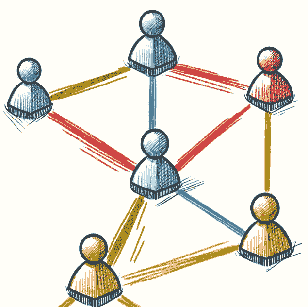
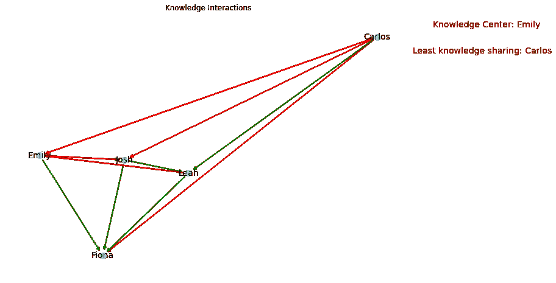
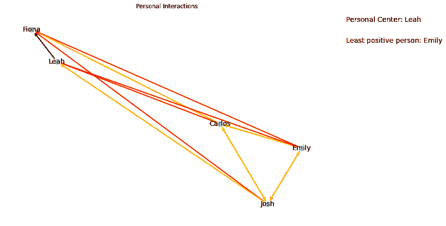

# 基于 AI 的组织网络分析

> 原文：[`towardsdatascience.com/ai-based-organizational-network-analysis-aa502bf243c4?source=collection_archive---------8-----------------------#2024-05-23`](https://towardsdatascience.com/ai-based-organizational-network-analysis-aa502bf243c4?source=collection_archive---------8-----------------------#2024-05-23)

## 在人力资源分析中利用 LLMs

[](https://medium.com/@lipicsbarna?source=post_page---byline--aa502bf243c4--------------------------------)[](https://towardsdatascience.com/?source=post_page---byline--aa502bf243c4--------------------------------) [Barna Lipics](https://medium.com/@lipicsbarna?source=post_page---byline--aa502bf243c4--------------------------------)

·发表于[Towards Data Science](https://towardsdatascience.com/?source=post_page---byline--aa502bf243c4--------------------------------) ·阅读时间：13 分钟·2024 年 5 月 23 日

--



图片来自作者的 Midjourney 订阅。

新一代的 AI 工具为以前无法解决的复杂问题提供了开箱即用的解决方案——或者说，只有少数熟练的 IT 专业人员才能解决这些问题（或者是不可扩展的）。

这一点适用于广为人知的领域，如自然语言处理或图像处理——但同样适用于心理学的不同领域。如今，心理学家和人力资源人员距离借助 AI 解决这些复杂问题又迈进了一大步。

作为一名拥有心理学硕士学位且是高级 AI 工程师的人，我想分享一种可能利用 AI 来改善组织的方法。

让我们用 LLMs 和 Python 构建一个简单的网络提取管道，以检测团队中的关键人物。

将网络分析与组织心理学融合是一次令人兴奋的跨学科旅程。例如，Casciaro 等人（2015 年）提倡将网络和心理学视角结合在组织学术研究中，强调这种跨学科的研究方法能够显著丰富我们对组织行为和结构的理解。他们强调，结合这两种视角能够揭示组织内的复杂动态，这些动态如果单独从某个视角去看则会被忽视，尤其是在领导力、员工流动和团队绩效等领域。这种融合不仅推动了理论模型的发展，还为组织管理提供了实际的启示，促使人们进一步探索那些未被充分研究的领域和方法（Casciaro 等人，2015 年）。

Brass（2012 年）强调了认识到个人属性和网络结构如何共同影响组织结果的重要性，提出结构性连接和个人特征的双重关注对于深入理解组织动态至关重要。

但这为什么有趣呢？

因为根据 Briganti 等人（2018 年）的研究，他们考察了一个特定的心理学主题——共情，得出结论认为，网络中的核心人物在预测整个网络动态方面至关重要，强调了他们在理解（共情）互动中的重要性。

总之，文献已经表明，通过考察网络中的关键人物可以帮助我们预测整个网络的因素。

**如何建立一个网络？**

你当然可以选择传统方式来探索组织的相互联系，例如问卷调查、焦点小组、访谈等。焦点小组和访谈难以规模化。社会科学研究数据的有效性在过去几十年一直是一个深刻且严肃的问题（Nederhof 和 Zwier，1983 年）——而这个问题早在 1983 年就已被提出！传统调查常常存在各种偏见。心理学调查中可能遇到的困难包括：

+   **社会期望偏见**（Nederhof，1985 年）指调查参与者倾向于以一种他人会认为积极的方式回答问题。

+   **近期偏见**（Murdock，1962 年）指的是较新的信息比早期数据更容易被记住，或者对你的认知有更大的影响。

+   **光环效应**（Thorndike，1920 年）是指一个人对另一个人的整体印象影响我们如何看待和思考其个性。实质上，你对一个人的总体印象（“他很友好！”）会影响你对这个人具体特征的评价（“他也很聪明！”）。

+   **自利偏见**（Zuckerman，1979 年）指将积极事件归因于自己的个性，而将消极事件归因于外部因素，从而保持自尊。

你可以使用盲评（Rosenthal 和 Fode，1963 年），或者使用定性方法，这些方法通过提供更多关于主题的深度和细节，是很好的选择（Braun 和 Clarke，2006 年），能够更好地捕捉复杂性（Denzin 和 Lincoln，2011 年）。然而，定性方法也存在局限性，如难以统一和组织结果、研究者偏见（Malterud，2001 年）、研究者的确认偏见（Nickerson，1998 年），但在大型语言模型（LLMs）时代，通过适当的提示和自动化，这些局限性可以得到克服。

我将介绍一种基于 LLM 的方法，从自然语言中提取网络关系。由于本文的目标是展示该方法，而不是任何心理学结果，我将使用合成数据：使用 GPT4o，我将生成五个具有职业和个性的虚拟人物。我将向他们提出三个问题，话题固定度尽量低：

+   讲述你一天的普通工作故事。你的故事需要非常详细，包括任务、人物——以及任何你想到的内容。没有对错答案。

+   讲述一个你在工作中感到非常糟糕的故事。没有对错答案——但请尽可能详细地描述。

+   讲述一个你在工作中感到非常棒和成功的故事。没有对错答案——但请尽可能详细地描述。

**游戏开始**

我们需要一些关于我们虚拟团队的细节，以便生成现实的文本数据作为输入。

我将这个提示传递给了 LLM：

```py
Generate 5 virtual personas to me. They work on the same project. They should have
- first name
- age
- profession/position at the company
- a short description of their personalities. 
Their personalities should have negative sides as well.
At least one pair should be in a manager-subordinate relationship.
```

它生成了以下人物：

```py
Name: Emily
Age: 29
Profession/Position: Project Manager
Personality Description: Emily is highly organized and decisive, often seen as the backbone of the team. 
She is empathetic and approachable but can sometimes be overly controlling and resistant to deviating from her planned schedules. 
Emily's insistence on efficiency can occasionally overlook the need for creative freedom.

Name: Josh
Age: 34
Profession/Position: Lead Software Engineer
Personality Description: Josh is tech-savvy and a problem solver with a passion for new technologies. 
He is introverted and sometimes struggles with communication, which can lead to misunderstandings with teammates. 
His calm demeanor is an asset, although it sometimes appears as disinterest in team discussions.

Name: Leah
Age: 26
Profession/Position: Junior Software Engineer 
Personality Description: Leah is creative and energetic, full of ideas and great at networking. 
However, her enthusiasm can sometimes manifest as impatience with slower-paced tasks or details. 
She can be overly ambitious, pushing the team towards unfeasible goals.

Name: Carlos
Age: 42
Profession/Position: Financial Analyst
Personality Description: Carlos is meticulous and deeply knowledgeable about finances 
but tends to be pessimistic and overly critical, which can dampen team morale. 
His cautious nature sometimes slows down decision-making processes, frustrating more dynamic team members.

Name: Fiona
Age: 38
Profession/Position: UX/UI Designer
Personality Description: Fiona is creative and a great listener, making her designs user-friendly. 
However, she can be overly sensitive to criticism and sometimes takes feedback personally. 
She tends to avoid conflict, which can lead to unresolved issues in the team dynamics.
```

现在，我让 LLM 扮演这些人，并提问了三个问题。由于我在与一个模型对话，我确保在提示中包含了一些人际关系信息。为了节省空间和阅读时间，我们只分析一个人。示例提示：

```py
You need to act now like Emily. 
You are taking part in an online HR assessment. 
Here are some data about your profession, personality, etc:

Name: Emily
Age: 29
Profession/Position: Project Manager
Personality Description: Emily is highly organized and decisive, often seen as the backbone of the team. She is empathetic and approachable but can sometimes be overly controlling and resistant to deviating from her planned schedules. Emily's insistence on efficiency can occasionally overlook the need for creative freedom.

In this assessment, you, Emily, are asked these three questions:
- Tell the story of your average workday. Your story needs to be very detailed, including tasks, people - and anything that comes to your mind. There is no good or bad answer. 
- Tell a story where you felt really bad at work. There is no good or bad answer - but please make it as detailed as you can. 
- Tell a story where you felt great and successful at work. There is no good or bad answer - but please make it as detailed as you can.

Your team consists of the following people, if you have any relationship with them, please include in your answers:
<Description of other teammates>
```

Emily 的结果：

```py
1\. Average Workday:
My typical day starts with a quick review of my to-do list, which I prepare the night before. 
I arrive at the office by 8 AM, settle in, and start with a 30-minute session to review the progress on ongoing projects against their timelines. 
At 8:30 AM, I hold a brief stand-up meeting with the team, which includes Josh, Leah, Carlos, and Fiona, to catch up on their progress and address any immediate concerns.

After the stand-up, I typically meet with Carlos to discuss budget updates or financial issues. 
His insights are crucial, though I occasionally need to guide the conversation to keep it from veering into 
overly pessimistic territory, which helps us stay focused on solutions rather than problems.

Mid-morning is usually reserved for one-on-one sessions with team members needing guidance. 
For instance, I often spend time with Fiona reviewing design timelines. 
She appreciates clear, empathetic feedback which I strive to provide, though I must balance this with the need to maintain our project schedule.

Lunch is a quick affair, often at my desk, as I catch up on emails and plan for the afternoon. 
Post-lunch, I review Leah's latest marketing initiatives or software developments. Leah's energy is infectious, 
though her ambition sometimes requires tempering to align with our practical deliverables.

My afternoons often involve strategic planning sessions, where I work with Josh 
to align our technology needs with business goals. 
His technical expertise is invaluable, though I sometimes mediate 
to ensure his ideas are clearly communicated to the rest of the team.

I end my day by updating our project management tools, responding to any final emails, 
and preparing the next day’s priority list. Before leaving, 
I always walk around to say a quick goodbye to the team, ensuring I leave on a personal note.

2\. Negative Experience:
A particularly challenging day occurred when we were nearing a major project deadline. 
Tensions were high, and despite my efforts to keep the team on track, a critical integration flaw was discovered. 
The error was in a section Josh had worked on; his usual calm demeanor made it difficult to gauge his concern, 
which initially seemed like disinterest. This misunderstanding escalated under pressure.

I felt overwhelmed and responsible, fearing the mistake would reflect poorly on my ability to manage. 
It was a stark reminder that my need for control and perfection could blind me to the team's stress levels. 
That day ended with us missing a deadline, a first for me, which deeply upset me.

3\. Positive Experience:
One of my proudest moments was leading the team during the launch of a new product that was pivotal to our company’s expansion. 
The project had complex components, requiring tight coordination between all departments. 
Despite the challenges, including balancing Carlos' cautious financial strategies 
with Leah's ambitious marketing plans, we executed a flawless launch.

The success was made sweeter by the positive feedback from upper management and the client’s satisfaction. 
It reinforced the value of my organizational skills and my ability to gently 
but effectively guide the team through high-pressure situations. 
That day, I truly felt accomplished, seeing the tangible results of our hard work and my leadership.
```

其他提示和结果可以在这里找到：[llm-network-extraction/ at main · sugartrauma/llm-network-extraction (github.com)](https://github.com/sugartrauma/llm-network-extraction/tree/main)

**提取互动**

现在我们已经获得了网络分析的输入数据，我们需要从提到的互动中提取关系。

```py
You are a social network extraction tool.
You are given an input marked in <input> tag.

Extract the relationships between people mentioned in the <input> text and 
structure them into a CSV format with columns: 
- source
- target
- edge_type
- interaction_type

The relationships can be of two types: knowledge and personal. 
The interaction types for knowledge can be "gives knowledge" or "receives knowledge," 
For personal, the interaction_type can be "positive interaction" or "negative interaction."

Example input:
<input>
Josh helps Leah with coding challenges, sharing his expertise regularly. 
Emily and Fiona often collaborate creatively and have a positive working relationship.
</input>

Example output:
source,target,edge_type,interaction_type
Josh,Leah,knowledge,gives knowledge
Emily,Fiona,personal,positive interaction

The relationship must be represented only once.
You must not represent an edge in the opposite direction.
Bad example:
source,target,edge_type,interaction_type
Josh,Leah,knowledge,gives knowledge
Leah,Josh,knowledge,receives knowledge

Good example:
source,target,edge_type,interaction_type
Josh,Leah,knowledge,gives knowledge

<input>
Input comes here
</input>
```

LLM 复制了一些关系，如：

Josh、Leah、知识，传递知识

Leah、Josh、知识，接收知识

我去重并开始了实际的网络分析。

尽管我精通 Python，我也希望展示 GPT4o 对非程序员的能力。所以我使用 LLM 来生成我的结果，提示如下：

```py
Please build a network in Python from this data. 
There should be two types of edges: "knowledge", "personal". 
You can replace the textual interaction_types to numbers, like -1, 1\. 
I need this graph visualized. 
I want to see the different edge_types with different type of lines and the weights with different colors. 
```

我尝试了很多次，GPT4o 无法解决这个任务，所以通过传统的方法，我用 Python 代码生成了图表可视化：

```py
import networkx as nx
import pandas as pd
import matplotlib.pyplot as plt
from matplotlib.colors import LinearSegmentedColormap

cleaned_data = pd.read_csv(<file_destination>)
# For knowledge, we don't punish with negative values if there is no sharing
# For personal relationships, a negative interaction is valued -1
for idx, row in cleaned_data.iterrows():
    if row["edge_type"] == "knowledge":
        # If the source received knowledge, we want to add credit to the giver, so we swap this
        if row["interaction_type"] == "receives knowledge":
            swapped_source = row["target"]
            swapped_target = row["source"]
            cleaned_data.at[idx, "target"] = swapped_target
            cleaned_data.at[idx, "source"] = swapped_source
        cleaned_data.at[idx, "interaction_type"] = 1
    elif row["edge_type"] == "personal":
        cleaned_data.at[idx, "interaction_type"] = -1 if row["interaction_type"] == "negative interaction" else 1

# Aggregate weights with a sum
aggregated_weights = cleaned_data.groupby(["source", "target", "edge_type"]).sum().reset_index()

# Filter the data by edge_type
knowledge_edges = aggregated_weights[aggregated_weights['edge_type'] == 'knowledge']
knowledge_edges["interaction_type"] = knowledge_edges["interaction_type"].apply(lambda x: x**2)
personal_edges = aggregated_weights[aggregated_weights['edge_type'] == 'personal']
personal_edges["interaction_type"] = personal_edges["interaction_type"].apply(lambda x: x**2 if x >=0 else -(x**2))

# Normalize the weights for knowledge interactions since it has only >= 0 values, so the viz wouldn't be great
if not knowledge_edges.empty:
    min_weight = knowledge_edges['interaction_type'].min()
    max_weight = knowledge_edges['interaction_type'].max()
    knowledge_edges['interaction_type'] = knowledge_edges['interaction_type'].apply(
        lambda x: 2 * ((x - min_weight) / (max_weight - min_weight)) - 1 if max_weight != min_weight else 0)

# Create separate graphs for knowledge and personal interactions
G_knowledge = nx.DiGraph()
G_personal = nx.DiGraph()

# Add edges to the knowledge graph
for _, row in knowledge_edges.iterrows():
    G_knowledge.add_edge(row['source'], row['target'], weight=row['interaction_type'])

# Add edges to the personal graph
for _, row in personal_edges.iterrows():
    G_personal.add_edge(row['source'], row['target'], weight=row['interaction_type'])

custom_cmap = LinearSegmentedColormap.from_list('red_green', ['red', 'yellow', 'green'])

# Find the knowledge center
knowledge_center = knowledge_edges.groupby("source").sum().idxmax().values[0]
least_knowledge_node = knowledge_edges.groupby("source").sum().idxmin().values[0]

# Draw the knowledge interaction graph with arrows
plt.figure(figsize=(12, 8))
pos = nx.spring_layout(G_knowledge, k=0.5, iterations=50)
nx.draw_networkx_nodes(G_knowledge, pos, node_size=100, node_color='lightblue')
knowledge_weights = [d['weight'] for u, v, d in G_knowledge.edges(data=True)]
nx.draw_networkx_edges(G_knowledge, pos, edgelist=G_knowledge.edges(), edge_color=knowledge_weights, edge_cmap=custom_cmap, edge_vmin=-1, edge_vmax=1, width=2, arrows=True)
nx.draw_networkx_labels(G_knowledge, pos, font_size=14)
plt.title('Knowledge Interactions')
plt.annotate(f'Knowledge Center: {knowledge_center}', xy=(1.05, 0.95), xycoords='axes fraction', fontsize=14, color='darkred')
plt.annotate(f'Least knowledge sharing: {least_knowledge_node}', xy=(1.0, 0.85), xycoords='axes fraction', fontsize=14, color='darkred')
plt.axis('off')
plt.show()

# Find the personal center 
personal_center = personal_edges.groupby("source").sum().idxmax().values[0]
least_personal_center = personal_edges.groupby("source").sum().idxmin().values[0]

# Draw the personal interaction graph
plt.figure(figsize=(12, 8))
pos = nx.spring_layout(G_personal, k=0.5, iterations=50)
nx.draw_networkx_nodes(G_personal, pos, node_size=100, node_color='lightblue')
weights = [d['weight'] for u, v, d in G_personal.edges(data=True)]
nx.draw_networkx_edges(G_personal, pos, edgelist=G_personal.edges(), edge_color=weights, edge_cmap=custom_cmap, edge_vmin=-1, edge_vmax=4, width=2, arrows=True)
nx.draw_networkx_labels(G_personal, pos, font_size=14)
plt.title('Personal Interactions')
plt.annotate(f'Personal Center: {personal_center}', xy=(1.05, 0.95), xycoords='axes fraction', fontsize=14, color='darkred')
plt.annotate(f'Least positive person: {least_personal_center}', xy=(1.05, 0.85), xycoords='axes fraction', fontsize=14, color='darkred')
plt.axis('off')
plt.show()
```

知识共享网络的结果：



图表是通过 matplotlib 生成的，数据来自作者的公开数据。

我们可以发现，除了卡洛斯，其他人都在知识共享生态系统中非常接近。Emily 是我们图表中最具外向权重的节点。

我们能用这些数据做什么？

1\. 我们绝对应该让 Emily 留在公司——如果我们需要从利益中选出一个人来付出最大努力并获得长期的参与，那应该是 Emily。

2\. 卡洛斯是一名金融分析师，这与团队的实际工作相距甚远。他没有分享太多信息可能不是问题。关键的部分可能出现在图表的另一部分，而我们没有看到——他在财务团队中分享了多少知识。所以，在解释可能初看起来不太好看的结果时，要小心。

积极/消极互动网络的结果：



图表是通过 matplotlib 生成的，数据来自作者的公开数据。

可以看出，我们的初级软件工程师 Leah 是基于正面互动数量最积极的人。

1. 作为一个行动项，我们可以为她启动一个导师计划，使她能够传播她的积极态度，并帮助她积累职业经验，从而增加她在各个工作领域的可信度。

2. Emily 是互动最少积极、最多负面的人员。作为项目经理，这并不奇怪，项目经理常常需要做出艰难的决策。另一方面，可能需要再次检查她的互动中的负面情绪是否来自于她的项目管理职责，还是来自她的个人性格。

再次提醒，不要一见面就认为最坏的情况！

**摘要**

在这篇文章中，我分享了一种新颖的方法，通过大型语言模型（LLM）和图谱分析提取和分析组织的社交网络。

别忘了，这是合成数据，由 GPT4o 生成——我展示的是技术，而不是实际的心理学研究结果。如果我能接触到真实数据，这部分可能是我下一个研究的目标。

希望这个小项目能够促进未来更深入的研究。

希望你喜欢这篇文章，欢迎评论。

**来源：**

Brass, D. J. (2012). 组织心理学中的社交网络视角。《牛津手册在线》。doi:10.1093/oxfordhb/9780199928309.013.0021

Braun, V., & Clarke, V. (2006). “在心理学中使用主题分析。” *心理学中的定性研究*, 3(2), 77–101。本文讨论了定性研究中的主题分析如何揭示丰富和详细的数据。

Briganti, G., Kempenaers, C., Braun, S., Fried, E. I., & Linkowski, P. (2018). 1973 年年轻成人的共情指数项的网络分析。*精神病学研究, 265*, 87–92。DOI: 10.1016/j.psychres.2018.03.082

Casciaro, T., Barsade, S. G., Edmondson, A. C., Gibson, C. B., Krackhardt, D., & Labianca, G. (2015). 心理学与网络视角在组织学术研究中的整合。*组织科学*, 26(4), 1162–1176。DOI: 10.1287/orsc.2015.0988

Denzin, N. K., & Lincoln, Y. S. (编辑). (2011). “Sage 定性研究手册。” Sage 出版社。该手册讨论了定性研究在捕捉人类行为和社会现象复杂性方面的优势。

Malterud, K. (2001). “定性研究：标准、挑战与指南。” *柳叶刀*, 358(9280), 483–488。

Murdock, B. B. (1962). “自由回忆的序列位置效应。” *实验心理学杂志*, 64(5), 482–488。

Nederhof, A. J. 和 Zwier, A. G. (1983). “社会心理学中的‘危机’，一种实证方法”，《欧洲社会心理学杂志》，13：255–280。

Nederhof, A. J. (1985). 应对社会期望偏差的方法：一项综述。《欧洲社会心理学杂志》，15(3), 263–280。doi:10.1002/ejsp.2420150303

Nickerson, R. S. (1998). “确认偏差：一种在许多伪装下普遍存在的现象。” *普通心理学评论*, 2(2), 175–220。

Rosenthal, R., & Fode, K. L. (1963). “实验者偏差对白化大鼠表现的影响。”*行为科学*, 8(3), 183–189。

Thorndike, E. L. (1920). “心理评定中的常见误差。”*应用心理学杂志*, 4(1), 25–29。

Zuckerman, M. (1979). “成功与失败的归因再探，或者：动机偏差在归因理论中依然存在。”*人格杂志*, 47(2), 245–287。
