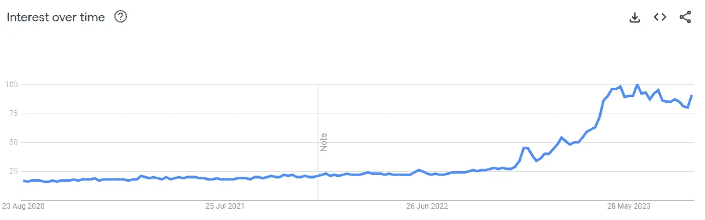
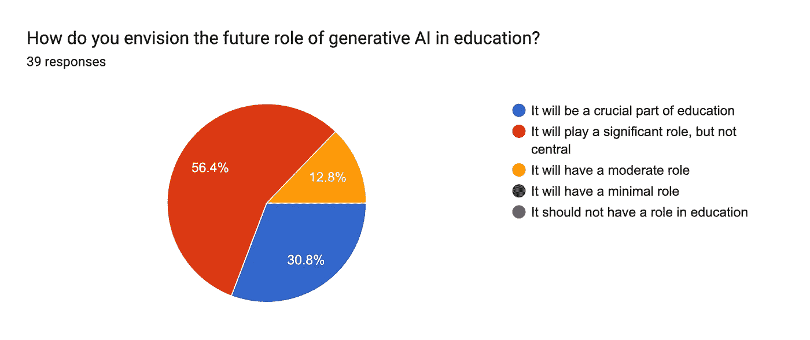
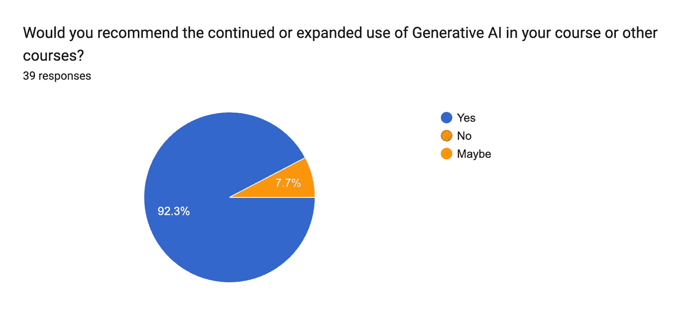

# 人工智能敲响课堂的门

> 原文：[`towardsdatascience.com/ai-knocking-on-the-classrooms-door-87db39d00b94?source=collection_archive---------2-----------------------#2024-05-22`](https://towardsdatascience.com/ai-knocking-on-the-classrooms-door-87db39d00b94?source=collection_archive---------2-----------------------#2024-05-22)

## 关于我如何在大学讲座和评估中使用人工智能的反思

 [Dylan Seychell](https://medium.com/@dylanseychell?source=post_page---byline--87db39d00b94--------------------------------)

·发表于 [Towards Data Science](https://towardsdatascience.com/?source=post_page---byline--87db39d00b94--------------------------------) ·12 分钟阅读·2024 年 5 月 22 日

--

我想先声明一下：虽然我自 2011 年起就开始在大学讲课，但我并不是经过正式培训的教育工作者。我在本文中分享的是我与学生共同开发的个人观点和学习方法。这些观点不一定与我所在的马耳他大学的观点一致。

> 生成式人工智能要求教育工作者重新思考评估方式，并拥抱透明度，以实现以学生为中心、道德信息化的学习未来。

作者 x DALL-E 3

这是我在本文中结构化反思的方式：

+   为什么我教书？

+   我们是如何走到今天的？

+   人工智能是教育的威胁吗？

+   教育工作者能做些什么？

+   那么评分作业呢？

+   前进的道路？

# 为什么我教书？

我是一名人工智能科学家，教学是我学术角色的核心部分，我非常享受。课堂上，我认为我的职责是找到最有效的方式，将我的研究领域传达给我的学生。我的学生是我的同行，我们在一个快速发展的领域中一起学习，这一领域正在深刻影响人类。自 2015 年以来，我还一直领导马耳他谷歌开发者小组（GDG），这让我可以与不同专业的人员分享学习经验。

换句话说，我的责任有两方面：**1)** 研究学科内容和 **2)** 通过分享我的知识并与学生共同推动界限，促进学生的学习体验。

# 我们是如何走到今天的？

我预见到了 2022 年 12 月的事件。2020 年 5 月底，OpenAI 发布了 GPT-3，展示了通过一些简单的提示生成高质量文本的能力。这是我们第一次看到人工智能技术“写关于它自己的东西”，正如[这篇文章报道的](https://www.theguardian.com/commentisfree/2020/sep/08/robot-wrote-this-article-gpt-3)那样。然而，这一技术当时仅对那些具有较强技术背景的人可用和“可操作”。到了 2022 年夏季，OpenAI 发布了其文本到图像生成器 DALL-E 的测试版。长话短说：人工智能每个月都在变得更好、更加触手可及。我最近写了一篇[关于应对这一快速变化的文章](https://medium.com/ux-planet/pragmatic-ideas-for-navigating-the-ai-landscape-721f590955ae)。

[ChatGPT](https://chat.openai.com/)，[Gemini](https://gemini.google.com/)，[Claude](https://claude.ai/)以及随后推出的所有生成式人工智能产品使这项变革性技术变得触手可及。

Google Trends 显示了人工智能的趋势，并且在 2022 年 12 月 ChatGPT 发布后，出现了明显的峰值。

生成式人工智能使我们能够探索无数话题，甚至实现更多目标。你需要为你的保险公司起草一封投诉邮件吗？你需要策划一场营销活动吗？你需要为你的新项目做一份 SWOT 分析吗？你需要为宠物起个名字吗？还有很多类似的需求。它就在那，迅速且自由地提供给我们，适用于我们想到的任何事情。

那么，为什么不帮助我们更好地理解一些事情呢？为什么不帮助学生以更高效、更有效的方式学习呢？为什么不帮助我们重新思考教学方式呢？

# 人工智能是教育的威胁吗？

*简短回答*：**不是**。*长回答*：它比看起来要复杂一些。

## 是教育技术（EdTech）还是不是？

本文并非讨论教育技术（EdTech）或电子学习的正式方面。这些术语通常指的是软件和硬件，或它们与教育理论的结合，以促进学习。这里有一些经过充分研究的工作，比如我的同事[Matthew Montebello](https://medium.com/u/4886ec8ad2dc?source=post_page---user_mention--87db39d00b94--------------------------------)所著的书《[AI 注入的电子学习](https://link.springer.com/book/10.1007/978-3-319-67928-0)》，更深入地探讨了这一领域。在本文中，我关注的是我在课堂上使用的现成聊天界面。

## 生成式人工智能

“生成式人工智能”这个术语并没有帮助。虽然它适用于大多数用例，但它在教育领域激起了负面联想。[这对于艺术领域也同样适用，值得写另一篇文章讨论。] 作为教育工作者，我们不希望学生为我们布置的任务生成答案并提交评分。这也是为什么在学习过程中，人工智能通常会引起负面的初步反应。

但这只是我们探讨这种强大技术如何积极改变学习体验——无论是学生还是教育工作者的体验——之前的看法。从我的经验来看，我在课堂上使用这些方法越多，我在学科领域的专业知识和理解就越广，同时也能找到更好的方式来沟通复杂的概念。

## 它是抄袭吗？

我注意到很多人将人工智能的使用与抄袭联系在一起。抄袭的定义是“[*未经承认地使用他人的工作，作为自己的，无论该工作是否已发布。*](https://www.um.edu.mt/performingarts/theatre/students/resources/plagiarism/)”我不打算进入这个争论，但我可以坦率地说，我认为人工智能的使用与传统的抄袭之间存在明显的区别。

## 我们是否应通过软件来检测它？

**让我们明确一点**：如果学生或学术人员使用人工智能生成内容并将其提交为自己的作品，那是错误的。这是学术不端行为，最好**不要**将其归类为抄袭。

我们在消费任何作品时都期待真实性，无论是像这篇文章这样的随意作品，还是正式的学术论文。缺乏真实性是我们对抄袭和使用人工智能生成内容时感到不满的原因。

生成型人工智能之所以有效，是因为（除了其他原理之外）它基于概率性方法。这意味着每次输出都与之前的不同，即使使用相同的提示来创建。如果我抄袭他人的作品并将其作为自己的提交，那么我抄袭的部分是可比的，并且会被检测为抄袭。而使用生成型人工智能创作自己的作品则是另一种形式的不端行为。因为它是概率性的，所以检测它也是概率性的。

因此，我反对在教育环境中使用任何声称能够检测人工智能生成内容的工具。虽然它可以表明某人是否使用人工智能生成作品，但由于缺乏确定性，知道检测结果可能是误报时，我感到不安，不愿对学生采取行动，因为这可能影响他们的职业生涯。

你会通过抛硬币来决定学生的命运吗？（作者 x DALL-E 3）

如果仍然有疑虑，我希望分享这也是 OpenAI 的看法。2023 年 1 月（在发布 ChatGPT 不到一个月后），他们推出了一个人工智能文本分类器，声称能够预测一段文本是否由人工智能生成。猜猜发生了什么？他们在 2023 年 7 月关闭了这个工具，因为它“[无法做出这种预测](https://openai.com/blog/new-ai-classifier-for-indicating-ai-written-text)”。那么，为什么你要因为一个不可靠的概率性决策而危及学生的未来呢？

# 教育工作者可以对此做些什么？

使用人工智能的主要挑战之一是，如果学生依赖生成的答案，它可能限制批判性思维。还有一个合理的担忧是，如果人工智能的使用不均，可能会加剧教育不平等。

战斗、冻结还是逃跑？那只意味着我们在面对这项革命性技术时放弃了教育。这是一个机会，也是教育新时代的开始。

我在处理这方面的三条指导原则如下：

1.  **透明性与开放对话** — 教育、职场和社会都需要这些价值观。所以，让我们从使学生能够在教育环境中透明并开放地使用这些工具做起，这里应该始终是一个试验新思想的安全空间。

1.  **聚焦学习过程—** 教育（几乎）一直关注最终的结果，无论是考试、作业还是论文。现在有机会将焦点转向帮助学生展示他们在理解材料和解决实际问题过程中思考的过程。

1.  **教育而非惩罚—** 我们的任务是教育，而非惩罚，首先要保持积极的态度。如果我们保持透明，并为学生提供一个过程，让他们能够公开讨论使用 AI 的方式，那么我们就有无数机会为他们提供建设性的反馈，帮助他们正确使用这项技术，而无需惩罚。

AI 为我提供了一个更新教学方式的机会。这就是我如何充分利用这一机会：

1.  **个性化学习** — 要求学生以多种方式向 AI 系统提问一个话题，帮助他们更好地掌握该概念。

1.  **激发课堂讨论—** 邀请学生讨论他们从 AI 系统中获得的结果，并主持讨论，为探索新话题开辟道路，同时纠正对该话题的任何误解。

1.  **给学生更多现实和现实生活中的挑战—** 我利用这一点邀请更成熟的学生将课堂上涉及的主题应用到现实生活中的情景，或是当下时事中的话题。

1.  **帮助有学习困难的学生** — 如果你知道有些学生存在学习困难，AI 可以帮助你创建内容的不同版本，以便针对不同能力的学生提供个性化的帮助。

1.  **重构我的课程** — 每门课程结束后，我会收集学生的反馈，了解我可以改进的地方。然后，我将这些反馈与课程内容结合，和 AI 系统进行“对话”，帮助我反思并优化后续的授课内容，特别是在引入新主题时。

1.  **改善我的课程材料** — 我发现 AI 系统在改写特定话题并调整教学方式以适应不同背景的学生时非常有帮助。你还可以利用生成性 AI 建议多种传递相同内容或材料的方式。

# 那么评分作业呢？

这是我们无法忽视的关键问题。我们可能更倾向于在课堂上使用 AI 来提升体验，但那在评分作业或工作时呢？

当这项技术变得非常容易接触时，我反思了很多。我决定从整体上退一步，从第一性原理来审视这一问题。这些是我做出决策的基本原则：

1.  AI 已经发展了 80 年，**它将长期存在**。

1.  **这些 AI 工具将会变得越来越好，** 因为商业利益在其中。

1.  **今天的学生是明天的劳动力，** 雇主将期望他们利用 AI 提高工作效率。

1.  我希望我的学生能够聪明地使用不同的工具，并且在使用 AI 时**对他们的领导负责**。

1.  **我希望在课堂上覆盖的主题太多了，** 但是（直到现在）很难做到这一点。

前进的道路是清晰的：我的职责是设计能够激励学生的评估，确保他们理解内容，并为他们未来建设更好的明天做好准备。实际的前进方式是调整我的评估方式，以适应这一新现实，并激励学生以负责任的方式使用 AI。

## 评估类型

AI 的可用性挑战了评估的性质。有些问题和任务可以作为提示输入，学生可以得到一个出色的输出，并且无需深思熟虑地提交。虽然这种行为是不对的，不应该发生，但它也反映了我们给学生设置的评估问题。

考虑一个关于概念的论文，例如言论自由，学生需要就这个主题写 2000 字的文章。其过程通常是学生离开课堂，写论文，提交给讲师修改，讲师批改并给出成绩。这种方法无疑为我之前提到的困境打开了大门。

## 生成式 AI 日志

我们在员工身上看重什么？我认为责任感是最重要的，因为其他一切都会随之而来。基于这个思路，我决定为我的学生开发一个生成式 AI 日志，当他们完成我布置的作业时填写。这个日志会解释他们如何使用生成式 AI 以及其使用情况如何。作为回报，他们将获得分数（大约 10%的分数）。

关键的思考是这样的。我不介意我的员工使用 AI 提高生产力，但我需要了解他们是如何使用 AI 的。这将帮助我成为更好的导师并评估任务。学生是明天的员工，他们将工作在一个 AI 已经可以使用的环境中，且他们将被期望尽可能提高生产力。综合这些思考，我认为生成式 AI 应该在有责任感和透明度的前提下使用。基于这一点，我想出了这个日志的创意。这个 10 页的日志结构如下：

1.  **简介：** 简要描述所使用的生成式 AI 模型（如 ChatGPT、Gemini、VS Co-Pilot 等）以及选择它们的理由。（最多 1 页）

1.  **伦理考量：**讨论在项目中使用生成性人工智能的伦理方面。这应包括数据偏见、隐私问题以及良好学术行为的措施（最多 1 页）。

1.  **方法论：**概述将生成性人工智能模型整合到工作中的方法和步骤。生成性人工智能是如何融入任务工作流程的？

1.  **提示和回应：**列出与生成性人工智能模型一起使用的具体提示，这些提示有助于提升工作的质量。包括每个提示的生成回应，并解释它如何改善了你的项目。

1.  **改进和贡献：**讨论生成性人工智能在具体领域提升交付成果的情况。这可以包括但不限于数据分析、伦理考量的制定、文献综述的增强或创意生成。

1.  **个人反思：**反思在项目中使用生成性人工智能的个人经验。讨论学到了什么，什么让你感到惊讶，以及如果有的话，使用人工智能进行学术项目的观点如何发生了变化。

1.  **参考文献和使用的资源列表**

这不是一个最终的结论。这是一个持续发展的工作，我不断更新它，以反映学生的需求和生成性人工智能发展的背景。

# 前进的方向？

这不是一段有明确目的地的旅程。可能的情况是，教育（和职场）将不得不与生成性人工智能的进化一同发展。

在本文开头，我分享了将我的学生视为研究旅程中同伴的观点。我将这一观点与前进的方向联系起来。在 2023/24 学年第一学期结束时，我向 60 名学生分发了一份匿名问卷。在本文中，我将分享两个问题的回答，问学生们在使用生成性人工智能后对前进的方向有何看法，如上所述。

当被问及他们如何看待生成性人工智能在教育中的未来时，56%的人认为它将发挥重要作用，但不是核心作用，12%的人认为它将仅发挥适度作用。30%的人认为它将成为教育的关键部分。这具有重要意义，因为它表明学生们感受到了在课堂上使用这项技术的价值，并认为它应该是对人类教育者的补充，而非替代。

我请我的学生就是否继续在课堂上使用生成性人工智能提出意见。92%的人认为我应该继续使用……我会继续的。8%的人不确定，这同样具有意义。最重要的是，这是一个正在进行中的工作，应该做更多的工作来提供有意义的教育体验……但这并不意味着我们不应该从今天开始尝试。

这是一瞥未来的景象。如果你看待它为一个机会，教育和社会需要你。

这项技术将每周不断改进，并且它将长期存在。在本文发布时，[OpenAI 发布了 GPT-4o 模型](https://openai.com/index/hello-gpt-4o/)，[Google 在 Google IO 发布了无数 AI 产品和功能](https://blog.google/technology/ai/google-io-2024-100-announcements/)。我们才刚刚触及这些可能性的表面。

未来不是要害怕课堂上的人工智能，而是要将其作为人类最新的发明，来处理知识和信息，从而赋能教育系统中的所有利益相关者。

*Dylan Seychell 博士是马耳他大学人工智能系的常驻学者，专攻计算机视觉和应用机器学习。拥有学术和行业背景，他获得了计算机视觉博士学位，并在国际同行评审的会议、期刊和书籍中广泛发表了有关人工智能的研究成果。*

*在学术领域之外，他通过自己的企业积极应用专业知识，专注于通过技术和文化遗产创新提升旅游体验。他领导着马耳他的 Google 开发者小组（GDG），是马耳他数字创新局认证的技术专家，并且是马耳他商会旅游运营商业务委员会的成员。*
