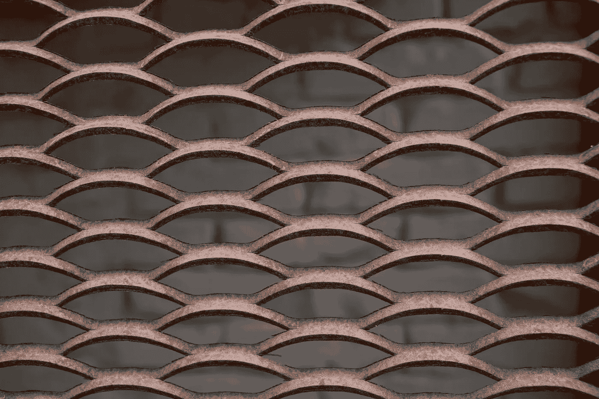

# 基于 AI 的工业设备腐蚀检测：AWS 可扩展方法

> 原文：[`towardsdatascience.com/ai-powered-corrosion-detection-for-industrial-equipment-a-scalable-approach-with-aws-b70da644861e?source=collection_archive---------6-----------------------#2024-10-05`](https://towardsdatascience.com/ai-powered-corrosion-detection-for-industrial-equipment-a-scalable-approach-with-aws-b70da644861e?source=collection_archive---------6-----------------------#2024-10-05)

## 完整的 AWS 机器学习解决方案，结合 SageMaker、Lambda 和 API Gateway

 [Aashish Nair](https://medium.com/@aashishnair?source=post_page---byline--b70da644861e--------------------------------)

·发布于 [Towards Data Science](https://towardsdatascience.com/?source=post_page---byline--b70da644861e--------------------------------) ·6 分钟阅读·2024 年 10 月 5 日

--

照片由 Monstera Production 提供：[`www.pexels.com/photo/textured-background-of-metal-lattice-against-brick-wall-7794453/`](https://www.pexels.com/photo/textured-background-of-metal-lattice-against-brick-wall-7794453/)

## 介绍

制造业、能源和电信等行业需要进行广泛的质量控制，以确保设备保持正常运行。大多数组件面临的一个持续性问题是腐蚀：由于环境因素引起的金属逐渐降解。如果不加以控制，腐蚀可能导致健康危害、机械停机和基础设施故障。

本项目展示了一种完全自动化腐蚀检测过程的方法，利用了云计算技术。具体来说，它使用 Amazon Sagemaker、Lambda 和 API Gateway 构建了一个可扩展、高效且具有容错能力的质量控制解决方案。

## 数据

本项目的数据来源于 [Synthetic Corrosion Dataset](https://universe.roboflow.com/synthetic-corrosion/synthetic-corrosion-dataset)（CC BY 4.0），该数据集包含数百张合成图像。每张图像被分类为腐蚀或非腐蚀。

数据源提供了分别用于训练、测试和验证的数据集图像，因此无需进行拆分。训练集、验证集和测试集分别包含 270 张、8 张和 14 张图像。
