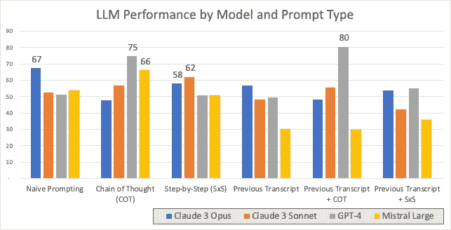
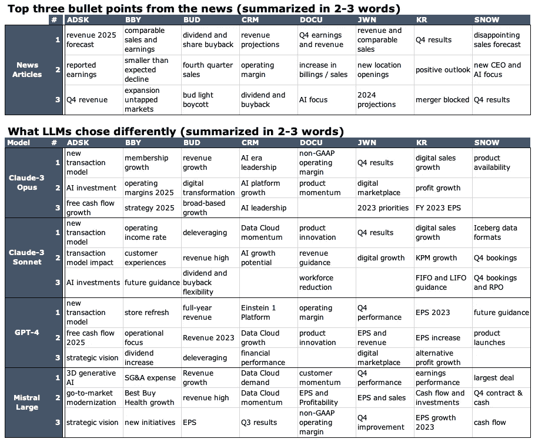

# AI 与人类洞察力在财务分析中的对比

> 原文：[`towardsdatascience.com/ai-vs-human-insight-in-financial-analysis-89d3408eb6d5?source=collection_archive---------6-----------------------#2024-03-15`](https://towardsdatascience.com/ai-vs-human-insight-in-financial-analysis-89d3408eb6d5?source=collection_archive---------6-----------------------#2024-03-15)

## Bud Light 抵制事件和 SalesForce 创新计划如何让最优秀的语言模型感到困惑

 [Misho Dungarov](https://medium.com/@mihail.dungarov?source=post_page---byline--89d3408eb6d5--------------------------------)

·发表于 [Towards Data Science](https://towardsdatascience.com/?source=post_page---byline--89d3408eb6d5--------------------------------) ·阅读时间：10 分钟·2024 年 3 月 15 日

--

图片来源：[Dall-E 3](https://platform.openai.com/docs/guides/images/)

今天最优秀的 AI 模型能否准确从公司财报电话会议中提取出最重要的信息？它们确实能捕捉到一些要点，但我们怎么知道这些要点是否真的重要呢？我们能否*提示*它们做得更好？为了找到这些答案，我们研究了该领域一些最优秀的记者所做的工作，并尝试用 AI 尽可能接近这些水平。

# 挑战

在本文中，我分析了 8 场最近的公司财报电话会议，并询问了目前最聪明的 AI（[Claude 3](https://www.anthropic.com/news/claude-3-family)、[GPT-4](https://openai.com/gpt-4) 和 [Mistral Large](https://mistral.ai/news/mistral-large/)）它们认为哪些内容最重要。然后，将这些结果与一些最顶尖新闻机构（路透社、彭博社和《巴伦周刊》）对这些报告的评价进行比较。

# 为什么要关注这个？

## 盈利电话会议的重要性

盈利电话会议是公司高层审视财务结果的季度活动。在会议中，他们会讨论公司业绩，分享评论，有时还会预告未来计划。这些讨论可能会显著影响公司的股价。管理层会解释他们对未来的预期，以及为什么能够实现或超越之前的预测。管理团队提供了关于公司实际状况和未来方向的宝贵见解。

## 自动化在盈利分析中的力量

Statista 报告称，根据一项估算，[纳斯达克上市公司数量](https://www.statista.com/statistics/1330817/nasdaq-number-of-listed-companies-by-domicile/)接近[4000 家](https://www.statista.com/statistics/1330817/nasdaq-number-of-listed-companies-by-domicile/)，而全球约有[58,000 家公司](https://focus.world-exchanges.org/articles/number-listed-companies)。

> 一场典型的电话会议大约持续 1 小时。要听完所有纳斯达克公司的财报电话会议，至少需要 10 个人在整个季度内全职工作。而且这还不包括分析和比较财务报告等更耗时的任务。

大型经纪公司可能能够处理这种工作量，但对个人投资者来说是不现实的。在这个领域的自动化可以使竞争环境更加平等，让每个人都更容易理解季度财报。

虽然这可能只对大型经纪公司而言是触手可及的，但对于私人投资者来说并不可行。因此，在这个领域的任何可靠自动化都将是一大福音，尤其是在让更多人理解季度财报方面。

# 测试 AI 作为金融分析师的过程

为了测试当今最好的 LLM 是否能够胜任这项工作，我决定比较人类的主要要点，并查看 AI 如何模仿这些要点。以下是步骤：

1.  挑选一些有近期财报电话会议记录和匹配新闻文章的公司。

1.  给 LLM 提供完整的会议记录作为上下文，并要求它们提供**三个最具影响力的要点**，这些要点对公司价值最为重要。这很重要，因为提供一个较长的摘要变得越来越容易——毕竟，重要的事情也就那么多。

1.  为了确保我们最大化输出质量，我会变化我向 AI 提出问题的方式（使用不同的提示）：从简单地请求摘要、添加更详细的指示、添加先前的转录内容到这些组合方式。

1.  最后，将这些要点与相应新闻文章中的 3 个最重要的要点进行比较，并用重叠部分作为衡量成功的标准。

# 结果总结

GPT-4 在提供上一季度的会议记录并使用一套分析记录的指示（链式思维）时表现最好，准确度达到 80%。值得注意的是，仅使用正确的指示，就能将 GPT-4 的表现从 51%提高到 75%。

GPT-4 表现最好，对提示反应最好（80%）——即添加先前的结果和专门的分析指示。而在没有复杂提示的情况下，Claude 3 Opus 表现最好（67%）。图像和数据由作者提供

+   排名第二的表现较好的公司是：

    — Claude 3 Opus（67%）——在没有复杂提示的情况下，Claude 3 Opus 表现最佳。

    — Mistral Large（66%）在加入支持性指示（即链式思维）后

+   **链式思维（CoT）和逐步思考（SxS）对 GPT-4 效果最好，但对其他模型则有害。**这表明我们仍然需要更多地了解哪些提示适用于每个 LLM。

+   **Chain-of-Thought (CoT) 几乎总是优于 Step-by-step (SxS)**。这意味着，定制的财务分析优先知识有所帮助。具体的指示已列在文章的底部。

+   **更多数据——更少意义**：将先前一段的转录文本添加到模型上下文中，似乎至少对整体结果略有不利，最坏的情况下则可能显著降低结果，尤其是在专注于最新结果的情况下（除了 GPT-4 + CoT）。可能是因为从先前的转录文本中引入了大量不相关的信息，而引入了相对较少的具体事实来进行季度比较。Mistral Large 的表现显著下降，注意它的上下文窗口仅为 32k 个令牌，而其他模型的上下文窗口显著更大（2 个转录文本 + 提示词几乎刚好适应 32k 个令牌）。

+   **Claude-3 Opus 和 Sonnet 的表现非常接近**，在某些情况下，Sonnet 实际上超过了 Opus。然而，这种差异通常只有几个百分点，因此可以归因于结果的随机性。

+   请注意，正如前面提到的，结果显示出高度的可变性，**结果范围在 +/-6% 之间**。因此，我**重新运行了所有分析 3 次**，并显示了平均值。然而， +/-6% 的范围不足以显著推翻上述结论。

# LLMs 做对了什么，做错了什么？

> Bud Light Boycott 和 Salesforce 的 AI 计划如何让最好的 AI 感到困惑

这项任务提供了一些简单的机会：猜测结果大约是最新的收入数字和明年的预测，这通常是相当准确的。不出所料，这也是模型最常做对的地方。

下表概述了新闻中提到的内容以及 LLMs 在仅用几个词进行总结时选择的不同内容。

“用最多 3 个词总结每个要点”：新闻中的前三个主题与 LLMs 选择的主题（这些主题不在该列表中）进行对比。每个模型被要求提供 2–3 个词的要点总结。每个模型将有 6 组前三选择（即 24 个），这 3 个选择通常是与新闻摘要相比最不相关的。请注意，在某些情况下，对比顶部和底部的表格可能感觉两个总结相似，这主要是因为每个要点实际上更为详细，且在 2–3 个词的总结中可能遗漏了大量附加/矛盾的信息。

接下来，我尝试寻找模型一致遗漏的趋势。这些趋势通常属于几个类别：

+   **理解变化：** 在以上结果中，LLMs 能够相对可靠地识别需要关注的内容：盈利、销售、股息和指导，但理解哪些内容具有重要意义依然非常困难。例如，常识可能认为 2023 年第四季度的财报结果会是任何公司的关键话题，而 LLMs 也确实选中了这一点。然而，Nordstrom 讨论了 2024 年较低的收入和需求预期，这使得 2023 年第四季度的财报在重要性上被搁置。

+   **幻觉：** 如同广泛记录的那样，大语言模型倾向于编造事实。在这种情况下，尽管有指示要求“只包括上下文中的事实和数据”，但一些指标和日期最终还是被编造出来。不幸的是，这些模型并不回避谈论 2024 年第四季度的财报，并称其已公布，且使用了 2023 年的数据。

+   **重大的单次事件：** 出乎意料的单次事件往往被大语言模型（LLMs）忽视。例如，**百威啤酒的抵制**导致美国最畅销啤酒的销量下降了 15.9%，对*安海斯·布希*公司影响深远，并在记录中有详细讨论。仅这一数字就应该显得非常重要，但所有样本中的模型都忽略了这一点。

+   **行动胜于言辞：** GPT 和 Claude 都强调创新和对 AI 的承诺为重要内容。

    — Salesforce（CRM）详细讨论了公司在 AI 和数据云方面的重视。

    — Snowflake 任命了他们的 AI 高级副总裁和前谷歌广告高管（Sridhar Ramaswamy）为 CEO，同样表明了公司致力于利用 AI 技术。

    两者都表明公司正在转向创新与 AI。**然而，记者和分析师不会轻易被言辞所误导，将其当作行动。** 在分析 CRM 财报的文章中，副标题写道“Salesforce 前景失望，AI 未能激发增长”。然而，Salesforce 已经在尝试与 AI 合作一段时间，且其未来使用 AI 的计划甚至没有被提及。Salesforce 的记录提到 AI91 次，而 Snowflake 的只有不到一半，只有 39 次。然而，人类可以辨别其中的含义：彭博社的文章[链接]讨论了 Snowflake 任命新 CEO 的消息：他的升职强调了 Snowflake 对 AI 的关注。

# 实验设计与选择

1.  **为什么选择财报电话会议记录？** 更直观的选择可能是公司文件，但我发现电话会议记录提供了一个更加自然、少形式化的事件讨论。我认为，记录能让 LLM 作为推理引擎，更好地提取事件的自然评论，而不像财报那样枯燥且高度规范化。电话会议大多是管理层的陈述，可能会将事物偏向于更积极的观点。然而，我的分析表明，在积极和消极的叙述中，LLMs 的表现似乎相似。

1.  **公司选择：** 我选择了在 2023 年 2 月 25 日到 3 月 5 日之间发布了第四季度财报，并且已被路透社、彭博社或《巴伦周刊》报道的股票。这确保了结果是及时的，并且模型尚未在这些数据上进行过训练。此外，每个人总是谈论 AAPL 和 TSLA，因此这是一个不同的选择。最后，这些新闻机构的声誉确保了有意义的比较。我们最终选定的 8 只股票是：*Autodesk (ADSK), BestBuy (BBY), Anheuser-Busch InBev (BUD), Salesforce (CRM), DocuSign (DOCU), Nordstrom (JWN), Kroger (KR), Snowflake (SNOW)*

1.  **结果的可变性** LLM 的结果在不同的运行之间可能有所不同，因此我进行了三次实验并展示了平均值。所有模型的分析均使用温度值 0，这通常用于最小化结果的变化。在这种情况下，我观察到不同运行之间的性能差异最多可达 10%。这是由于样本量较小（仅 24 个数据点，每只股票 3 条声明），并且我们基本上要求 LLM 从众多可能的声明中选择一个摘要，因此，当这种选择具有一定随机性时，自然会导致选择的差异。

1.  **提示词选择：** 对于三种比较的 LLM，我尝试了四种不同的提示方法：

+   **简单模型** — 提示仅要求模型确定对股价最可能的影响。

+   **思维链（CoT）** — 我提供一个详细的步骤列表，在选择摘要时遵循这些步骤。这一方法的灵感来源并且大致遵循[[Wei 等人 2022]](https://arxiv.org/abs/2201.11903)的工作，提出思维链方法，提示中提供推理步骤能够显著提高结果。在本实验的上下文中，这些附加指令包括影响价格波动的典型因素：预期收入、成本、收益、诉讼等方面的变化。

+   **逐步（SxS）** 又名零-shot Chain-of-Thought（CoT），灵感来源于[Kojima 等人（2022）](https://arxiv.org/abs/2205.11916)，他们发现仅仅加入“让我们逐步思考”这一短语就能提高性能。我要求大型语言模型（LLMs）逐步思考并在回答之前描述他们的逻辑。

+   **先前的记录** — 最后，我再次运行以上三种提示方法，并包含上一季度的记录（在本例中为 Q3）。

# 结论

从上面的内容来看，记者和研究分析师的工作似乎暂时是安全的，因为大多数 LLMs 在正确回答三分之二的问题上存在困难。在大多数情况下，这仅意味着他们猜测会议讨论的是最新的收入和明年的预测。

然而，尽管该测试存在所有局限性，我们仍然可以得出一些明确的结论：

+   对于大多数模型来说，准确率相当低。即使是 GPT-4 的最佳表现 80%，在没有人工监督的情况下也会面临大规模应用的挑战——每五次中就有一次给出错误建议，这样的表现并不具有说服力。

+   GPT-4 似乎在其未专门训练的复杂任务中仍然是一个明确的领导者。

+   正确地进行任务提示工程会带来显著的收益

+   大多数模型似乎容易被额外的信息所困惑，因为加入之前的会议记录通常会降低性能。

## 接下来该怎么做？

我们都已经见证了 LLM 能力的持续提升。这一差距是否能够弥合，又该如何弥合？我们观察到三种影响性能的认知问题：幻觉、理解什么是重要的而什么不重要（例如，真正理解什么对一家公司来说是*令人惊讶*的），更复杂的公司因果关系问题（例如，像 Bud Light 抵制事件，以及美国销售对整体业务的相对重要性）：

+   **幻觉**或 LLM 无法正确再现事实信息的情况，是要求严格遵守事实准确性的应用中的一大障碍。先进的 RAG 方法结合该领域的研究不断取得进展，[[Huang et al 2023]](https://arxiv.org/abs/2311.05232)概述了当前的进展

+   **理解什么是重要的** —— 针对特定应用场景对 LLM 模型进行微调应该会带来一定的改进。然而，这些改进伴随着对团队、成本、数据和基础设施的更大要求。

+   **复杂的因果关系链** —— 这一方向可能是 AI 代理的一个良好发展方向。例如，在 Bud Light 抵制事件中，模型可能需要：

    1\. Bud Light 对美国销售的重要性，可能在许多演示和管理层评论中有所提及

    2\. 美国销售对整体公司的重要性，可以从公司财务中获取信息

    3\. 最后将这些影响与所有其他提到的影响进行叠加

    这种因果逻辑更类似于 ReAct AI 代理的思考方式，而不是仅仅一个独立的 LLM[[Yao, et al 2022]](https://arxiv.org/abs/2210.03629)。代理规划是一个热门的研究课题[[Chen, et al 2024]](https://arxiv.org/abs/2402.10890)

[在 LinkedIn 关注我](https://linkedin.com/comm/mynetwork/discovery-see-all?usecase=PEOPLE_FOLLOWS&followMember=mihail-misho-dungarov-cfa-a0291a88)

## 免责声明

*本文中表达的观点、意见和结论仅代表我个人的看法，并不反映文中提到的任何实体或其他实体的观点或立场。*

*没有使用数据进行模型训练，也没有系统地从提到的来源收集数据，所有技术都仅限于提示工程。*

# 资源

## 盈利电话会议记录（Motley Fool）

+   [安海斯-布希英博（Anheuser-Busch InBev，BUD）Q4 2024](https://www.fool.com/earnings/call-transcripts/2024/02/29/anheuser-busch-inbevnv-bud-q4-2023-earnings-call-t/)

+   [Autodesk (ADSK) Q4 2024](https://www.fool.com/earnings/call-transcripts/2024/02/29/autodesk-adsk-q4-2024-earnings-call-transcript/)

+   [Best Buy (BBY) Q4 2024](https://www.fool.com/earnings/call-transcripts/2024/02/29/best-buy-bby-q4-2024-earnings-call-transcript/)

+   [DocuSign (DOCU) 2024 财年第四季度](https://www.fool.com/earnings/call-transcripts/2024/03/07/docusign-docu-q4-2024-earnings-call-transcript/)

+   [克罗格 (KR) 2024 财年第四季度](https://www.fool.com/earnings/call-transcripts/2024/03/07/kroger-kr-q4-2023-earnings-call-transcript/)

+   [诺德斯特龙 (JWN) 2024 财年第四季度](https://www.fool.com/earnings/call-transcripts/2024/03/05/nordstrom-jwn-q4-2023-earnings-call-transcript/)

+   [Salesforce (CRM) 2024 财年第四季度](https://www.fool.com/earnings/call-transcripts/2024/02/29/salesforce-crm-q4-2024-earnings-call-transcript/)

+   [Snowflake (SNOW) 2024 财年第四季度](https://www.fool.com/earnings/call-transcripts/2024/02/29/snowflake-snow-q4-2024-earnings-call-transcript/)

## 新闻文章

+   [安海斯-布希英博 (路透社)](https://www.reuters.com/business/retail-consumer/brewer-ab-inbev-hikes-annual-dividend-after-q4-sales-estimate-beat-2024-02-29/)

+   [欧特克 (路透社)](https://www.reuters.com/technology/autodesk-forecasts-annual-revenue-above-estimates-shares-jump-2024-02-29/)

+   [百思买 (彭博社)](https://www.bloomberg.com/news/articles/2024-02-29/best-buy-sales-decline-at-slower-pace-as-demand-improves)

+   [DocuSign (巴伦周刊)](https://www.barrons.com/articles/docusign-shares-earnings-20862b9a)

+   [克罗格 (巴伦周刊)](https://www.barrons.com/articles/kroger-stock-earnings-9b9bebd6)

+   [诺德斯特龙 (彭博社)](https://www.bloomberg.com/news/articles/2024-03-05/nordstrom-sees-muted-revenue-comparable-sales-in-current-year)

+   [Salesforce (彭博社)](https://www.bloomberg.com/news/articles/2024-02-28/salesforce-outlook-disappoints-as-ai-fails-to-spark-growth)

+   [Snowflake (彭博社)](https://www.bloomberg.com/news/articles/2024-02-28/snowflake-misses-estimates-says-ceo-slootman-to-step-down)
