# 人工智能，写作并塑造我的简历

> 原文：[`towardsdatascience.com/ai-write-and-style-my-cv-fb3168a5b10e?source=collection_archive---------7-----------------------#2024-07-18`](https://towardsdatascience.com/ai-write-and-style-my-cv-fb3168a5b10e?source=collection_archive---------7-----------------------#2024-07-18)


由作者通过 Midjourney 创建

## 代理工作流写作结构化文档，逐行教程

[](https://medium.com/@AJOhrn?source=post_page---byline--fb3168a5b10e--------------------------------)[](https://towardsdatascience.com/?source=post_page---byline--fb3168a5b10e--------------------------------) [Anders Ohrn](https://medium.com/@AJOhrn?source=post_page---byline--fb3168a5b10e--------------------------------)

·发布于[面向数据科学](https://towardsdatascience.com/?source=post_page---byline--fb3168a5b10e--------------------------------) ·阅读时间 22 分钟·2024 年 7 月 18 日

--

不仅是[蒙娜丽莎](https://heni.com/talks/mona-lisa-painting-beyond-portraiture)和[维特鲁威人](https://nicofranz.art/en/leonardo-da-vinci/vitruvian-man)，还有[简历](https://artsandculture.google.com/story/leonardo-s-cover-letter-biblioteca-ambrosiana/sQVRpZ4EhlnSKg?hl=en)，都是由列奥纳多·达·芬奇创作的文化遗物，它们在当代依然具有共鸣并不断复生。简历并非唯一的自我推销方式。尽管自达·芬奇将自己的技能和能力以书面形式列举给米兰公爵以来，信息和图形技术已有诸多创新，但简历依然存在。

从高层次来看，创建简历：

1.  总结一个人在文档中过去的成就和经验，

1.  以一种与特定受众相关的方式，后者在短时间内评估一个人对某个目标的相对和绝对效用，

1.  文档的样式和布局被选择为有利于该受众的积极评估。

这些是为服务于一个目标而进行的语义操作，并且是在模糊规定的约束条件下进行的。

大型语言模型（LLMs）是执行语义操作的主要工具，尤其是当这些操作像人类沟通中常见的那样模糊不清时。迄今为止，与 LLMs 互动的最常见方式是通过聊天应用——[ChatGPT](https://chatgpt.com/)、[Claude](https://claude.ai/)、[Le Chat](https://chat.mistral.ai/chat)等。我们这些聊天应用的用户，通过我们的聊天消息松散地定义了这些语义操作。

然而，某些应用程序最好通过不同的界面和创建语义操作的不同方式来提供服务。聊天并不是大语言模型的终极解决方案。

我将使用[Anthropic 大语言模型的 API](https://www.anthropic.com/api)（尤其是 Sonnet 和 Haiku）来创建一个简历生成的基本应用程序。它依赖于代理协同工作（一个[*代理工作流程*](https://www.deeplearning.ai/the-batch/welcoming-diverse-approaches-keeps-machine-learning-strong/)），每个代理执行某些语义操作，将个人数据和历史从一团混乱的资料转化为一个有条理的简历文件，值得它那位伟大祖先的赞誉……

这是一个关于构建一个小巧但完整的、由大语言模型（LLM）驱动的非聊天型应用程序的教程。在接下来的内容中，我将描述代码、我选择特定设计的原因以及每段 Python 代码在更大框架中的作用。

简历创建应用程序是一个很好的例子，展示了人工智能在结构化风格内容生成这一一般任务中的工作原理。

## 在代码与方法之前——展示内容与惊叹

想象一下，个人数据和冗长的职业描述，大部分是文本，组织成几个文件，信息零散。在这组文件中，就包含了简历的原材料。只是，它需要付出一些努力，才能从中分辨出相关与无关的信息，提炼和精炼它，并赋予它一个美观和令人愉悦的形式。

接下来，想象一下运行脚本 `make_cv`，并将它指向一个职位广告、一份简历模板、一位求职者和一些规格参数：

```py
make_cv --job-ad-company "epic resolution index" \
        --job-ad-title "luxury retail lighting specialist" \
        --cv-template two_columns_abt_0 \
        --person-name "gregor samsa" \
        --output-file ../generated_output/cv_nice_two_columns.html \
        --n-words-employment 50 --n-skills 8 --n-words-about-me 40
```

然后等待几秒钟，数据会被打乱、转换和渲染，之后脚本会输出一个整洁、风格化且填充完毕的单页双栏简历。

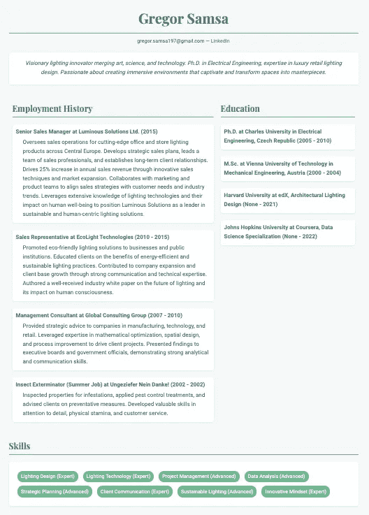

一份简历，整洁的风格和抽象的内容，通过安索普公司大语言模型的代理工作流程生成。

很棒！绿色调的简约布局和风格，文本与背景之间的对比鲜明，不仅是平淡的默认字体，内容简洁且直截了当。

但等等……这些文档不是应该让我们脱颖而出吗？

再次借助安索普公司大语言模型的帮助，创建一个不同的模板（关键词：*1990 年代初期网页设计的狂野与古怪世界*），并赋予相同内容一种新的辉煌形式：

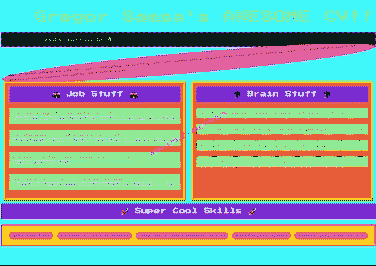

一份简历，采用疯狂的 1990 年代网页风格和内容，通过安索普公司（Anthropic）大语言模型的代理工作流程生成。

如果你忽略那些炫目的动画和奇特的颜色选择，你会发现内容和布局几乎与之前的简历一模一样。这并非巧合。代理工作流程的生成任务分别处理内容、形式和风格，而不是依赖一体化解决方案。工作流程的过程反映了标准简历的模块化结构。

即，代理工作流的生成过程在有意义的约束条件下运行。这可以增强生成式 AI 应用的实际效用——毕竟，设计被认为[在很大程度上依赖于约束](https://markwunsch.com/eames)。例如，品牌、风格指南和信息层次结构是我们希望在生成 AI 的非聊天输出中看到的有用且原则性的约束——无论是简历、报告、用户体验、产品包装等。

完成所有工作的代理工作流如下所示。

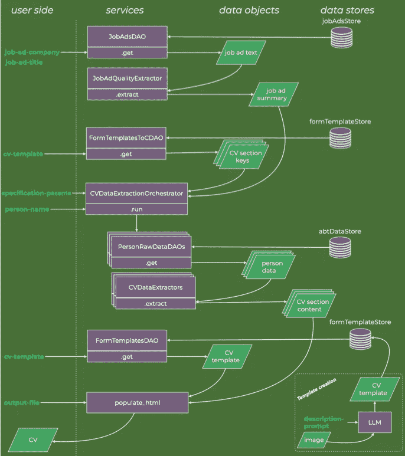

应用程序的高层数据流图

如果你希望跳过代码和软件设计的描述，*格雷戈尔·萨姆萨*是你的指路明灯。当我重新回到讨论应用和输出时，我将针对虚构人物格雷戈尔·萨姆萨的合成数据进行讨论，因此可以通过关键词搜索继续往下阅读。

完整的代码可以在[这个 GitHub 仓库](https://github.com/anderzzz/everyone_knows_it/)中找到，免费提供并不附带任何保证。

## 职位广告预处理、DAO 和提示组装

常说应当根据职位广告的内容调整简历。由于职位广告常常冗长，有时包含法律术语和联系信息，我希望仅提取和总结相关特征，并将这些文本用于后续任务。

为了在检索数据时实现共享接口，我创建了一个基本的[数据访问对象（DAO）](https://www.geeksforgeeks.org/data-access-object-pattern/)，它定义了与数据的公共接口，在本教程示例中，数据存储在本地的文本和 JSON 文件中（存储在`registry_job_ads`中），但通常可以是任何其他的职位广告数据库或 API。

总结或抽象文本是 LLM 非常擅长的语义操作。为此，

1.  需要一个指令提示，以使 LLM 正确处理文本，以符合任务需求；

1.  还必须选择 Anthropic 的 LLM 模型及其参数（例如温度）；

1.  并且，指令化的大型语言模型（LLM）通过第三方 API 调用，并具有其特定的语法、错误检查等要求。

为了将这三种不同的关注点分离，我引入了一些抽象。

下方的类图展示了代理的关键方法和关系，这些代理提取职位广告的关键特征。

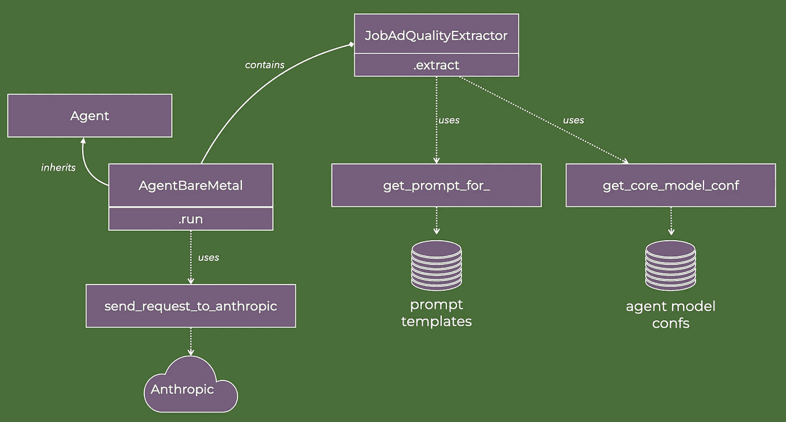

在代码中，这看起来是这样的：

配置文件`agent_model_extractor_confs`是一个 JSON 文件，其部分内容如下所示：

随着进一步代理的实现，额外的配置会被添加到此文件中。

提示是将通用 LLM 集中到特定功能的关键。我使用 Jinja 模板来组合提示。这是一个[灵活且成熟的方法来创建带有程序化内容的文本文件](https://realpython.com/primer-on-jinja-templating/)。对于相对简单的招聘广告提取代理，逻辑很简单——从文件中读取文本并返回——但当我处理更高级的代理时，Jinja 模板将变得更为有用。

`agent_type='JobAdQualityExtractor` 的提示模板是：

```py
Your task is to analyze a job ad and from it extract, 
on the one hand, the qualities and attributes that the 
company is looking for in a candidate, and on the other 
hand, the qualities and aspirations the company 
communicates about itself.

Any boilerplate text or contact information should be 
ignored. And where possible, reduce the overall amount 
of text. We are looking for the essence of the job ad.
```

## 调用代理，无需工具

模型名称（例如 `claude-3–5-sonnet-20240620`）、一个提示和一个 Anthropic 客户端是我们发送请求到 Anthropic API 执行 LLM 所需的最基本内容。招聘广告质量提取代理拥有这一切。因此，它可以实例化并执行“裸金属”代理类型。

没有任何先前使用的记忆或其他功能，裸金属代理仅调用 LLM 一次。它关注的范围是 Anthropic 如何格式化其输入和输出。

我也创建了一个抽象基类，`Agent`。它并不是严格要求的，对于像简历创建这样基础的任务用途有限。然而，如果我们继续在这个基础上构建，以处理更复杂和多样的任务，[抽象基类是一个良好的实践](https://stackoverflow.com/questions/3570796/why-use-abstract-base-classes-in-python)。

`send_request_to_anthropic_message_creation` 是一个 [简单的 Anthropic API 调用包装器](https://github.com/anderzzz/everyone_knows_it/blob/6c96a71b3b1be18918a6caad96b9ec5c2148de2e/src/semantics.py#L24)。

这就是获取招聘广告摘要所需的所有内容。简而言之，步骤如下：

1.  实例化一个招聘广告质量提取代理，这涉及到收集相关的提示和 Anthropic 模型参数。

1.  使用公司名称和职位调用招聘广告数据访问对象，以获取完整的招聘广告文本。

1.  对完整的招聘广告文本进行提取，这需要一次性向 Anthropic LLM 的 API 发起请求；返回一个包含生成摘要的文本字符串。

在 `make_cv` 脚本中的代码步骤如下：

```py
 # Step 0: Get Anthropic client
    anthropic_client = get_anthropic_client(api_key_env)

    # Step 1: Extract key qualities and attributes from job ad
    ad_qualities = JobAdQualityExtractor(
        client=anthropic_client,
    ).extract_qualities(
        text=JobAdsDAO().get(job_ad_company, job_ad_title),
    )
```

数据流图的顶部部分已经描述完毕。

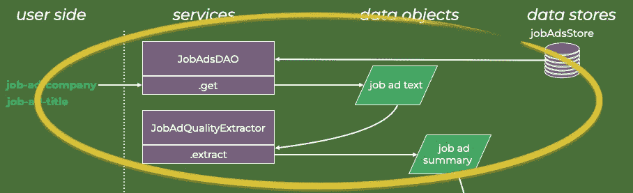

## 如何构建使用工具的代理

代理工作流中的所有其他类型的代理都使用工具。现在大多数 LLM 都具备这种有用的功能。由于我在上面描述了裸金属代理，接下来我将描述使用工具的代理，因为它是后续操作的基础。

LLM 通过序列到序列的映射生成字符串数据。在聊天应用程序以及招聘广告质量提取器中，字符串数据（大部分）是文本。

但字符串数据也可以是一个函数参数的数组。例如，如果我有一个可执行函数 `add`，它将两个整数变量 `a` 和 `b` 相加并返回它们的和，那么运行 `add` 的字符串数据可能是：

```py
{
  "name": "add",
  "input": {  
    "a": "2",
    "b": "2"
  }
}
```

因此，如果 LLM 输出这段函数参数字符串，它可以在代码中导致`add(a=2, b=2)`的函数调用。

问题是：应该如何指示 LLM，使其知道何时以及如何生成这种特定语法的字符串数据？

除了`AgentBareMetal`代理，我还定义了另一种代理类型，它同样继承了`Agent`基类：

这与裸机代理有两个方面的不同：

+   `self.tools`是在实例化过程中创建的列表。

+   `tool_return`是在执行过程中通过调用从注册表中获取的函数`registry_tool_name_2_func`创建的。

前者对象包含指示 Anthropic LLM（大语言模型）关于其可以生成的字符串数据格式的指令，这些数据将作为不同工具的输入参数。后者对象则是通过执行工具，依据 LLM 生成的字符串数据得到的。

`tools_cv_data`文件包含一个 JSON 字符串，格式化用于定义函数接口（但不包括函数本身）。该字符串必须符合[Anthropic LLM 的非常具体的模式](https://docs.anthropic.com/en/docs/build-with-claude/tool-use#specifying-tools)，以便它能够理解。该 JSON 字符串的一个片段如下：

从上面的规范我们可以看出，如果例如`AgentToolInvokeReturn`的初始化在`tools`参数中包含字符串`biography`，那么 Anthropic LLM 将被指示可以生成一个函数参数字符串，用于调用名为`create_biography`的函数。每个参数应该包含什么样的数据由 LLM 根据 JSON 字符串中的描述字段来决定。因此，这些描述相当于小提示，指导 LLM 进行推理。

与此规范相关的函数我通过以下两个定义来实现。

简而言之，工具名称`create_biography`与类构造函数`Biography.build`关联，该函数创建并返回`Biography`数据类的一个实例。

请注意，数据类的属性在添加到代理的`self.tools`变量中的 JSON 字符串中得到了完美的映射。这意味着从 Anthropic LLM 返回的字符串将完美适配数据类的类构造函数。

综合来看，请仔细查看`AgentToolInvokeReturn`中`run`方法的内部循环，如下所示：

```py
 for response_message in response.content:
            assert isinstance(response_message, ToolUseBlock)

            tool_name = response_message.name
            func_kwargs = response_message.input
            tool_id = response_message.id

            tool = registry_tool_name_2_func.get(tool_name)
            try:
                tool_return = tool(**func_kwargs)
            except Exception:
                ...
```

步骤如下：

1.  从 Anthropic LLM 返回的响应会被检查，确保它是一个函数参数的字符串，而不是普通文本。

1.  工具的名称（例如`create_biography`）、函数参数的字符串以及一个独特的工具使用 ID 被收集起来。

1.  可执行工具是从注册表中获取的（例如`Biography.build`）。

1.  该函数使用字符串函数参数执行（检查错误）。

一旦我们获得了工具的输出，我们应该决定如何处理它。一些应用将工具输出集成到消息中，并执行另一个 LLM API 请求。然而，在当前应用中，我构建了生成数据对象的代理，特别是`CVData`的子类。因此，我设计代理来调用工具，然后简单地返回其输出——因此类名为`AgentToolInvokeReturn`。

正是在这个基础上，我构建了创建我想要作为 CV 一部分的约束数据结构的代理。

## 结构化 CV 数据提取器代理

生成结构化传记数据的代理的类图如下所示。它与之前提取职位广告特征的代理的类图有很多相似之处。

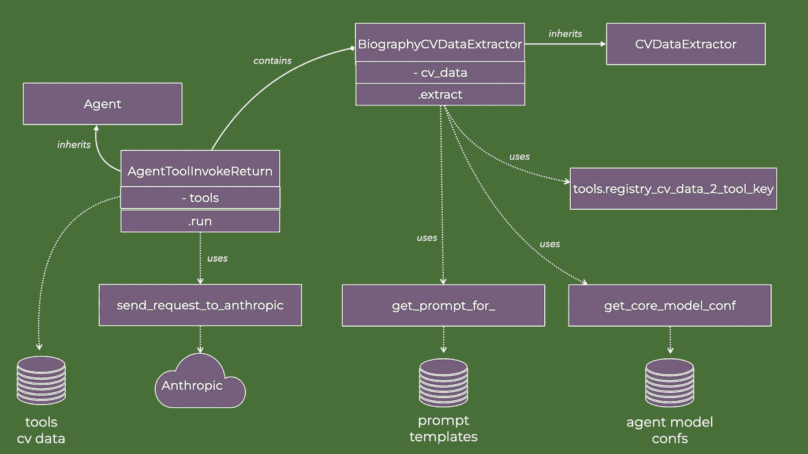

代码中：

与之前的代理`JobAdQualityExtractor`的两个区别：

1.  工具名称作为类属性`cv_data`的函数被检索（上面代码片段中的第 47 行）。所以当带有工具的代理被实例化时，工具名称的顺序是由一个注册表提供的，该注册表将某种类型的 CV 数据（例如`Biography`）与在上述`tools_cv_data` JSON 字符串中使用的键关联，例如`biography`。

1.  代理的提示是用变量呈现的（第 48 至 52 行）。回顾一下上面的 Jinja 模板的使用。这使得能够注入与职位广告相关的特征以及在“关于我”部分中使用的目标字数。传记代理的具体模板是：

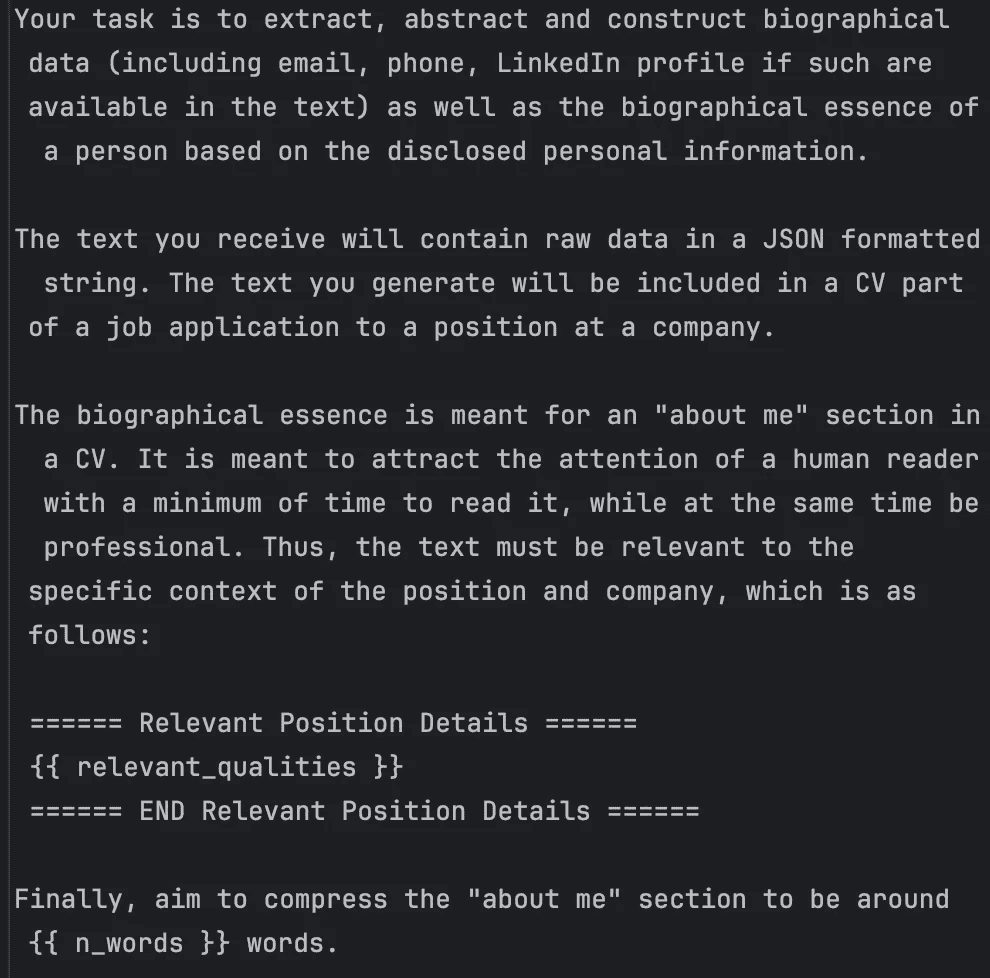

传记提取器代理的提示模板的图片，注意其中的两个变量

这意味着在实例化时，代理会意识到它应该根据职位广告调整其文本输出。

所以当它接收到原始文本数据时，它执行指令并返回一个`Biography`数据类的实例。基于相同的原因和类似的软件设计，我生成了额外的提取器代理、CV 数据类和工具定义：

```py
class EducationCVDataExtractor(CVDataExtractor):
    cv_data = Educations
    def __init__(self):
#      <truncated>

class EmploymentCVDataExtractor(CVDataExtractor):
    cv_data = Employments
    def __init__(self):
#      <truncated>

class SkillsCVDataExtractor(CVDataExtractor):
    cv_data = Skills
    def __init__(self):
#      <truncated>
```

现在我们可以提升一个层次的抽象。有了提取器代理，它们应该与原始数据结合，从中提取、总结、重写并提炼 CV 数据内容。

## 数据检索和提取的编排

接下来要解释的数据图的部分是突出显示的部分。

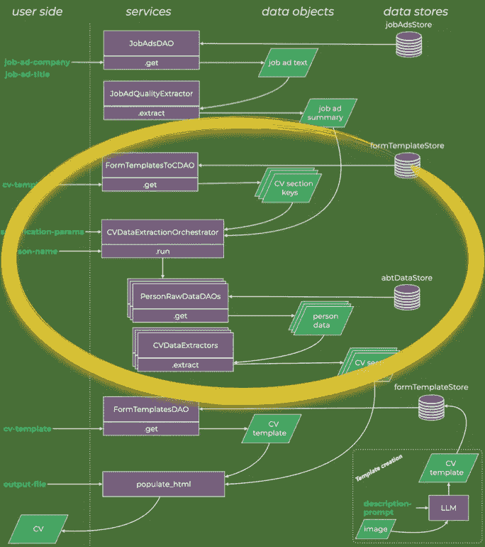

原则上，我们可以让提取器代理访问我们为某个个人制作 CV 时所拥有的所有可能的文本。但这意味着代理必须处理大量与其关注的具体部分无关的数据，例如，正式的教育细节几乎不会出现在个人的意识流博客中。

这是检索和搜索的重要问题通常进入基于 LLM 的应用设计考虑的地方。

我们是尝试寻找相关的原始数据来应用我们的代理，还是将我们所有的内容都投入到大上下文窗口中，让 LLM 来解决检索问题呢？[许多人](https://cohere.com/blog/rag-is-here-to-stay) [已经发表过看法](https://x.com/Francis_YAO_/status/1758934303655030929) [对此问题](https://www.reddit.com/r/MachineLearning/comments/1ax6j73/rag_vs_long_context_models_discussion/) [发表了讨论](https://www.linkedin.com/posts/emollick_a-problem-with-rag-in-practice-i-asked-activity-7172666908230561792-muvu/)。这是一个值得探讨的话题，因为下面这句话中有很多真理：

对于我的应用，我会保持简单——检索和搜索留到另一天再做。

因此，我将处理半结构化的原始数据。尽管我们对各个文档的内容有一个大致的理解，但它们内部大多由非结构化文本组成。这种场景在许多现实世界的案例中很常见，其中可以从文件系统或数据湖中的元数据中提取有用的信息。

检索谜题的第一部分是模板目录的数据库访问对象（DAO）。其核心是一个像这样的 JSON 字符串：

它将简历模板的名称（例如`single_column_0`）与所需数据部分的列表关联起来——这些数据部分是前面章节中描述的`CVData`数据类。

接下来，我编码哪些原始数据访问对象应该与哪些简历数据部分对应。在我的示例中，我有一小部分原始数据源，每个数据源都可以通过 DAO 访问，例如`PersonsEmploymentDAO`。

```py
_map_extractor_daos: Dict[str, Tuple[Type[DAO]]] = {
    f'{EducationCVDataExtractor.cv_data.__name__}': (PersonsEducationDAO,),
    f'{EmploymentCVDataExtractor.cv_data.__name__}': (PersonsEmploymentDAO,),
    f'{BiographyCVDataExtractor.cv_data.__name__}': (PersonsEducationDAO, PersonsEmploymentDAO, PersonsMusingsDAO),
    f'{SkillsCVDataExtractor.cv_data.__name__}': (PersonsEducationDAO, PersonsEmploymentDAO, PersonsSkillsDAO),
}
"""Map CV data types to DAOs that provide raw data for the CV data extractor agents

This allows for a pre-filtering of raw data that are passed to the extractors. For example,
if the extractor is tailored to extract education data, then only the education DAO is used.
This is strictly not needed since the Extractor LLM should be able to do the filtering itself,
though at a higher token cost.

"""
```

注意，在这段代码中，简历中的传记和技能数据是由多个原始数据源创建的。如果有额外的原始数据源可用，这些关联可以轻松修改——只需将新的 DAO 添加到元组中——或者在运行时进行配置。

然后，只需要将原始数据和简历数据提取代理匹配到每个所需的简历部分。这就是*协调器*所实现的数据流。下图是`CVDataExtractionOrchestrator`执行的缩放数据流图。

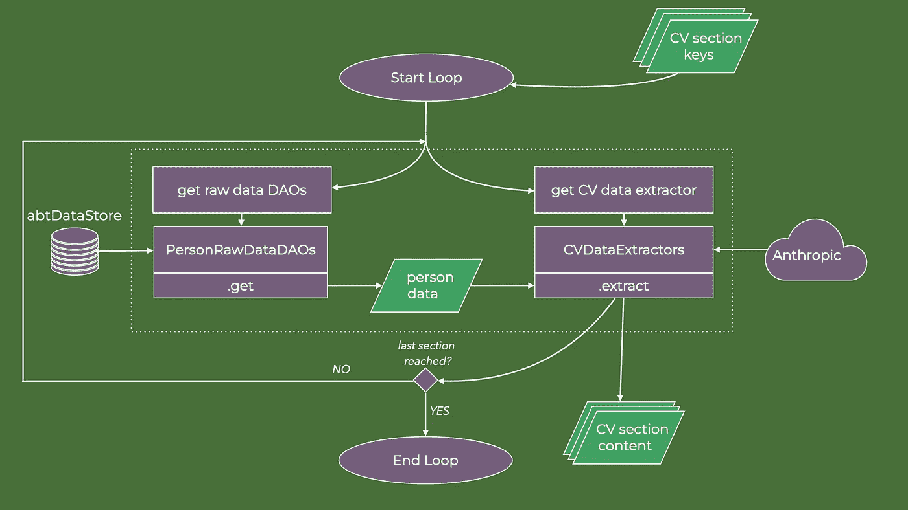

在代码中，协调器如下所示：

然后，在脚本`make_cv`中将所有内容整合在一起，我们得到：

```py
 # Step 2: Ascertain the data sections required by the CV template and collect the data
    cv_data_orchestrator = CVDataExtractionOrchestrator(
        client=anthropic_client,
        relevant_qualities=ad_qualities,
        n_words_employment=n_words_employment,
        n_words_education=n_words_education,
        n_skills=n_skills,
        n_words_about_me=n_words_about_me,
    )
    template_required_cv_data = FormTemplatesToCDAO().get(cv_template, 'required_cv_data_types')
    cv_data = {}
    for required_cv_data in template_required_cv_data:
        cv_data.update(cv_data_orchestrator.run(
            cv_data_type=required_cv_data,
            data_key=person_name
        ))
```

因此，所有对 Anthropic LLM 的调用都发生在协调器中。每次调用都是通过程序生成的指令提示完成的，通常包括职位广告摘要、简历各部分应有的文字数量参数，以及原始数据，以个人的名字为键。

循环执行完毕后，所有使用工具的代理完成任务后，会生成一组结构化的简历数据类实例。

## 插曲：无，<未知>，“缺失”

Anthropic 的 LLM 在将其生成的内容与构建数据类所需的输出模式匹配方面表现得相当出色。例如，我*不会*偶尔将电话号码放到电子邮件字段中，*也不会*想出无效的键，这样会破坏数据类的构建函数。

但是，当我进行测试时，我遇到了一个不完美的情况。

再看看简历数据是如何定义的：

例如，如果 LLM 没有在某个人的原始数据中找到 GitHub URL，则可以为该字段返回`None`，因为该数据类中的该属性是可选的。这就是我想要的结果，因为它简化了最终简历的渲染（见下文）。

但是，LLM 通常返回一个字符串值，通常是`'<UNKNOWN>'`。对于人类观察者来说，这没有什么歧义。它不是一种幻觉——即看起来真实却没有原始数据支持的虚构内容。

然而，对于使用简单条件逻辑的渲染算法来说，这是一个问题，例如在 Jinja 模板中的以下代码：

```py
 <div class="contact-info">
        {{ biography.email }}
         &mdash; <a href="{{ biography.linkedin_url }}">LinkedIn</a>
         &mdash; {{ biography.phone }}
         &mdash; <a href="{{ biography.github_url }}">GitHub</a>
         &mdash; <a href="{{ biography.blog_url }}">Blog</a>
    </div>
```

对于人类来说语义上显而易见，但语法上杂乱无章的问题，非常适合由大型语言模型（LLMs）处理。在 LLM 之前，标签不一致的问题曾经引发了许多麻烦，并产生了冗长的创造性字符串匹配命令（任何做过包含大量自由文本字段的数据库迁移的人都可以证实这一点）。

所以为了处理这个不完美，我创建了另一个代理，该代理操作其中一个其他简历数据提取代理的输出。

该代理使用前面部分中描述的对象。不同之处在于，它接受简历数据类的集合作为输入，并被指示清空任何“值被标记为未知、未定义、未找到或类似的字段”（[完整提示](https://github.com/anderzzz/everyone_knows_it/blob/main/src/prompt_templates/ClearUndefinedCVDataEntries.txt)的一部分）。

创建一个联合代理。它首先执行之前提到的简历数据创建。其次，它在前一个代理的输出上执行*清除未定义代理*，以解决任何<UNKNOWN>字符串的问题。

这个代理解决了问题，因此我在编排中使用它。

这个不完美问题是否可以通过不同的指令提示来解决？或者简单的字符串匹配修复是否足够？也许可以。

然而，我使用的是 Anthropic 的最简单、最便宜的 LLM（*haiku*），由于代理的模块化设计，这是一项易于实现并添加到数据管道中的修复。构建包含多个其他代理的*联合代理*是先进代理工作流使用的设计模式之一。

## 使用简历数据对象集合进行渲染

工作流的最后一步相对简单，因为我们花费了精力来创建结构化和定义良好的数据对象。通过语法匹配，这些对象的内容被具体放置在 Jinja HTML 模板中。

例如，如果 `biography` 是 Biography CV 数据类的一个实例，`env` 是一个 Jinja 环境，那么以下代码

```py
template = env.get_template('test_template.html')
template.render(biography=biography)
```

`test_template.html` 需要如下：

```py
<body>
    <h1>{{ biography.name }}</h1>
    <div class="contact-info">
      {{ biography.email }}
    </div>
</body>
```

匹配 `Biography` 数据类的姓名和电子邮件属性，并返回类似以下的内容：

```py
<body>
    <h1>My N. Ame</h1>
    <div class="contact-info">
      my.n.ame@compuserve.com
    </div>
</body>
```

函数 `populate_html` 接受所有生成的 CV 数据对象，并使用 Jinja 功能返回一个 HTML 文件。

在 `make_cv` 脚本中，第三步也是最后一步是：

```py
 # Step 3: Render the CV with data and template and save output
    html = populate_html(
        template_name=cv_template,
        cv_data=list(cv_data.values()),
    )
    with open(output_file, 'w') as f:
        f.write(html)
```

这完成了代理工作流。原始数据已经被提炼，内容被放入结构化数据对象中，这些对象反映了标准简历的信息设计，内容也被呈现为编码了样式选择的 HTML 模板。

## CV 模板如何制作——怎么做？

CV 模板是 HTML 文件的 Jinja 模板。因此，任何可以创建和编辑 HTML 文件的工具都可以用来创建模板。只要变量命名符合 CV 数据类的名称，它就能与工作流兼容。

例如，以下这部分 Jinja 模板将从 [the](https://github.com/anderzzz/everyone_knows_it/blob/6c96a71b3b1be18918a6caad96b9ec5c2148de2e/src/cv_data.py#L123) `[Employments](https://github.com/anderzzz/everyone_knows_it/blob/6c96a71b3b1be18918a6caad96b9ec5c2148de2e/src/cv_data.py#L123)` [CV 数据类](https://github.com/anderzzz/everyone_knows_it/blob/6c96a71b3b1be18918a6caad96b9ec5c2148de2e/src/cv_data.py#L123) 中检索数据属性，并创建一个包含描述（由 LLMs 生成）和持续时间数据（如果有的话）的工作经历列表：

```py
 <h2>Employment History</h2>
            
            <div class="entry">
                <div class="entry-title">
                    {{ employment.title }} at {{ employment.company }} ({{ employment.start_year }} - {{ employment.end_year }}):
                </div>
                
                <div class="entry-description">
                    {{ employment.description }}
                </div>
                
            </div>
            
```

我对前端开发了解很少——即使是 HTML 和 CSS，在我多年来编写的代码中也很少出现。

因此，我决定使用 LLMs 来创建 CV 模板。毕竟，这是一个任务，旨在将人类观察者认为合理且直观的外观和设计映射到一串特定的 HTML/Jinja 语法——这是 LLMs 在此类任务中表现得相当出色的领域。

我选择不将此与代理工作流集成，而是将其附加在数据流图的角落，作为应用程序的一个有用附录。

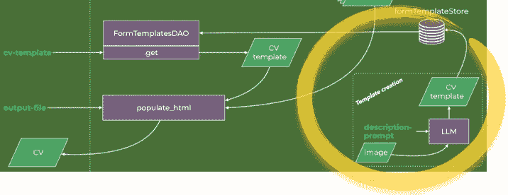

我使用了 Claude，这是 Anthropic 的 Sonnet LLM 的聊天界面。我向 Claude 提供了两样东西：一张图片和一个提示。

该图片是我快速使用文字处理软件制作的单栏简历的粗略轮廓，然后截屏保存。

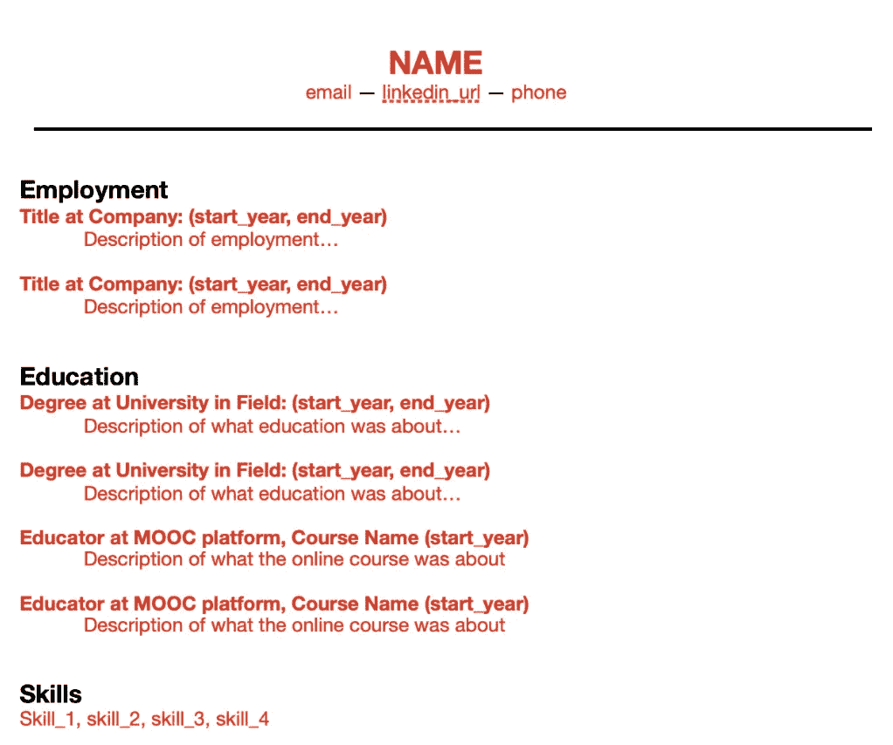

单栏简历布局的截屏，用于引导 Claude

[我给出的提示相当长](https://github.com/anderzzz/everyone_knows_it/blob/main/template_creation_prompt/single_column.txt)。它由三个部分组成。

首先，声明我希望完成的任务以及在 Claude 执行任务时我将提供哪些信息。

这一部分提示内容是：

> 我希望为静态 HTML 页面创建一个 Jinja2 模板。该 HTML 页面将展示一个人的简历。模板的目的是通过 Python 使用 Python 数据结构作为输入进行渲染。

第二，布局的口头描述。实质上是对上图的描述，从上到下，并附上关于相对字体大小、各部分顺序等的备注。

第三，我将用于渲染 Jinja 模板的数据结构描述。部分内容如下面的图片所示：

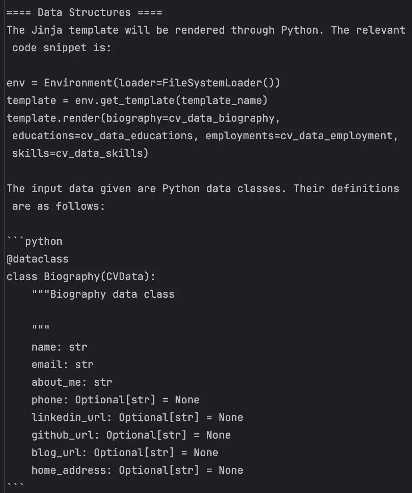

提示继续列出所有简历数据类。

对于一位精通 Jinja 模板、HTML 和 Python 数据类的人工解读者来说，这些信息足够使其能够将电子邮件在布局中的位置与 HTML Jinja 模板中的语法 `{{ biography.email }}` 进行匹配，将 LinkedIn 个人资料 URL（如果有）在布局中的位置与语法 ` <a href=”{{ biography.linkedin_url }}”>LinkedIn</a>{% endif }` 进行匹配，依此类推。

Claude 完美地执行了任务——我无需手动编辑模板。

我使用单栏模板和为人物 *Gregor Samsa*（稍后会详细介绍）生成的合成数据运行了代理工作流。

```py
make_cv --job-ad-company "epic resolution index" \
        --job-ad-title "luxury retail lighting specialist" \
        --cv-template single_column_0 \
        --person-name "gregor samsa" \
        --output-file ../generated_output/cv_single_column_0.html \
        --n-words-employment 50 --n-skills 8
```

输出文档：

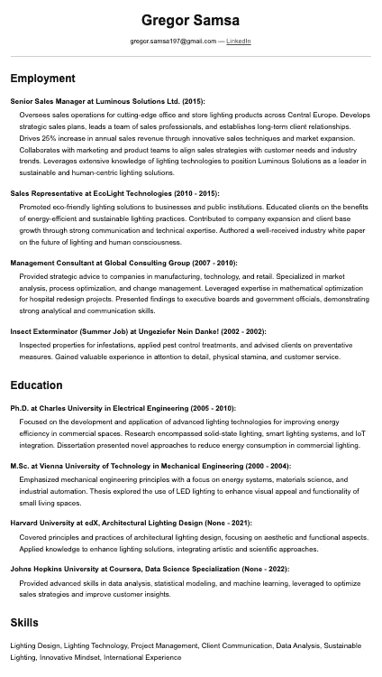

一个不错的简历。但我想创建一些变体，看看 Claude 和我能做出什么。

所以我又创建了另一个提示和屏幕截图。这次是针对一个两栏简历。粗略大纲我画了出来：

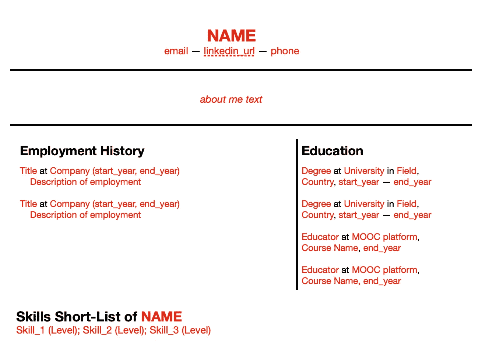

用来指导 Claude 的两栏简历布局的屏幕截图

我重新使用了单栏的提示，只是修改了第二部分，用文字描述布局。

它再次完美地工作了。

不过样式对于我的口味来说有点太单调了。所以作为对 Claude 的后续提示，我写道：

> 喜欢！你能重新做一次之前的任务，但加上一些修改吗：加入一些亮点和色彩。Arial 字体，黑白色调有点单调。我喜欢一些绿色和更好看的字体。让我惊艳！当然，它依然应该看起来很专业。

如果 Claude 回应说我必须更具体一些，我会有些同感（在某种意义上）。然而，Claude 的生成能力充分发挥，创建了一个模板，当渲染时看起来像这样：


不错！

值得注意的是，这个版本保留了粗略大纲中的基本布局：各个部分的位置、两栏的相对宽度，以及教育条目中没有描述等。只是样式有所改变，并且与给定的模糊规范保持一致。根据我的判断，Claude 的生成能力很好地填补了这些空白。

接下来，我探索了即使将样式调整到极限，Claude 是否还能保持模板布局和内容的清晰一致。所以我接着对 Claude 写道：

> 太棒了。但现在我想让你尽情发挥！我们要谈的是 1990 年代早期的网页美学，闪烁的元素、怪异的 Comic Sans 字体、疯狂的颜色对比。全速前进，Claude，玩得开心点。

结果非常出色。

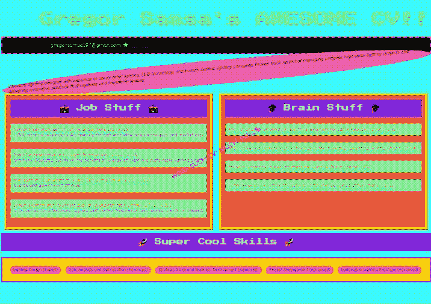

*这个 Gregor Samsa 是谁，真是个自由思想者，毫无焦虑——快雇这个人！*

即使在如此极端的样式下，指定的布局大体上仍然得以保留，文本内容也是如此。通过足够详细的提示，Claude 似乎能够创建出功能性且风格独特的模板，这些模板可以成为代理工作流的一部分。

## 那么文本输出如何呢？

除了引人注目的风格和有用的布局外，简历必须包含简洁且真实地展示人与职位匹配的文字。

为了探索这一点，我为一个名为[Gregor Samsa](https://de.wikipedia.org/wiki/Die_Verwandlung#Gregor_Samsa)的人创建了合成数据——他在中欧接受教育，从事灯具销售工作，对昆虫学有广泛兴趣。我生成了关于 Gregor 过去和现在的原始数据，其中一部分来自我的想象，一部分来自 LLM。这些细节并不重要。关键点是，文本内容太混乱、难以操作，无法直接复制粘贴到简历中。数据需要被找到（例如，Gregor 的电子邮件地址出现在他的一些随意思考中），总结（例如，Gregor 博士学位工作的描述非常详细），提炼并定制为与职位相关的内容（例如，哪些技能值得突出），并最终缩减为一两句话，放入“关于我”部分。

文本输出做得非常好。我让 Anthropic 公司最先进、最有表现力的模型 Sonnet 来写“关于我”部分。语气非常自然。

在我的测试中，我没有发现明显的幻觉。然而，LLM 在技能部分确实采取了一些自由发挥。

原始数据中描述 Gregor 大多在布拉格和维也纳工作和学习，偶尔参加一些英语语言教育者的在线课程。在一份生成的简历中，列出了捷克语、德语和英语的语言技能，尽管原始数据并没有明确声明他具备这些语言能力。LLM 做出了合理的技能推测。不过，这些技能并非仅从原始数据中抽取出来的。

所有代码和合成数据都可以在[我的 GitHub 仓库](https://github.com/anderzzz/everyone_knows_it/)中找到。我使用的是 Python 3.11，运行时，只要你有 Anthropic 的 API 密钥（假设脚本将其存储在环境变量`ANTHROPIC_API_KEY`中），你就可以运行并探索这个应用程序——当然，根据我所知，这没有错误，但我不能保证。

本教程展示了使用生成式 AI 的一种方式，阐述了在生成应用中有用的约束，并展示了如何直接与 Anthropic API 进行交互来实现这些内容。尽管创建简历不是一项高级任务，但我所介绍的原则和设计可以作为其他更具价值和复杂性的非聊天应用的基础。

快乐构建！

*所有图像、图表和代码均由作者创建。*
