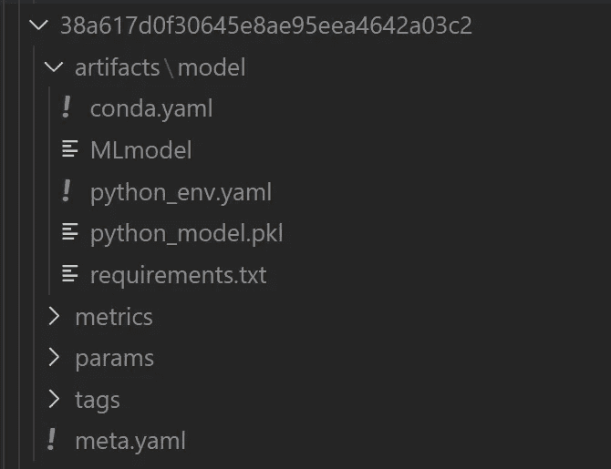
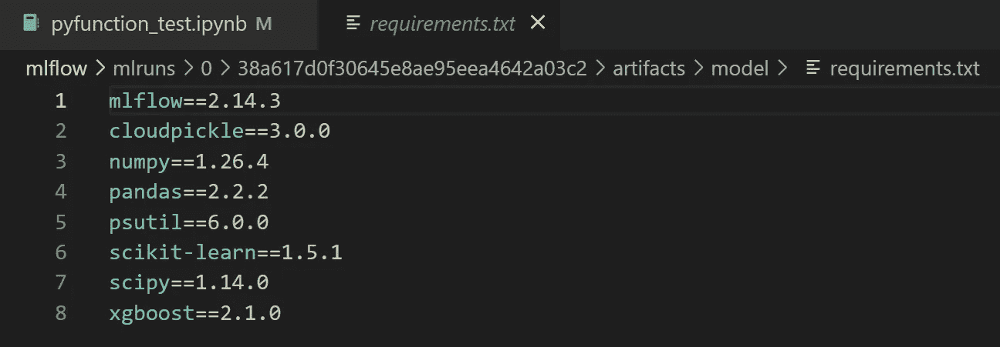
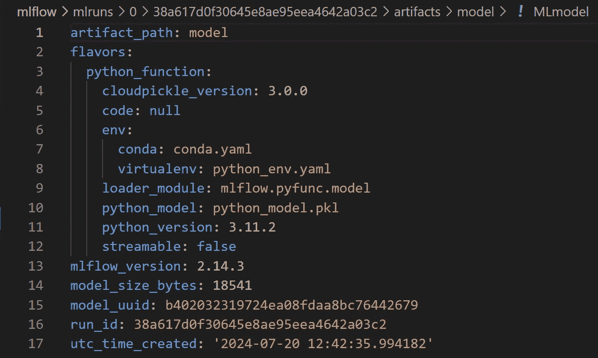

# 使用 MLflow 进行算法无关的模型构建

> 原文：[`towardsdatascience.com/algorithm-agnostic-model-building-with-mlflow-b106a5a29535?source=collection_archive---------0-----------------------#2024-08-10`](https://towardsdatascience.com/algorithm-agnostic-model-building-with-mlflow-b106a5a29535?source=collection_archive---------0-----------------------#2024-08-10)

## 面向初学者的逐步指南，帮助你使用 mlflow.pyfunc 创建通用的机器学习管道

[](https://menawang.medium.com/?source=post_page---byline--b106a5a29535--------------------------------)[](https://towardsdatascience.com/?source=post_page---byline--b106a5a29535--------------------------------) [Mena Wang, PhD](https://menawang.medium.com/?source=post_page---byline--b106a5a29535--------------------------------)

·发布于[Towards Data Science](https://towardsdatascience.com/?source=post_page---byline--b106a5a29535--------------------------------) ·阅读时间：8 分钟·2024 年 8 月 10 日

--

MLOps 中的一个常见挑战是不同算法或框架之间迁移的麻烦。本文面向初学者，帮助你通过使用`mlflow.pyfunc`进行算法无关的模型构建来应对这一挑战。

# **为什么选择算法无关的模型构建？**

假设有这样一个场景：我们有一个当前在生产环境中部署的 sklearn 模型，用于某个特定的使用场景。后来我们发现，深度学习模型的表现更好。如果 sklearn 模型是以其原生格式部署的，切换到深度学习模型可能会很麻烦🤪，因为这两种模型的文件格式差异很大。


由 Gemini 生成的图像

为了解决这一挑战，`mlflow.pyfunc`模型类型提供了一种多功能的通用方法，用于在 Python 中构建和部署机器学习模型。😎

**1. 通用模型构建：** `pyfunc`模型类型提供了一种统一的方式来构建模型，无论使用的是哪个框架或库。

**2. ML 管道的封装：** `pyfunc`允许我们将模型与其前后处理步骤或在模型使用过程中所需的其他自定义逻辑一起封装。

**3. 统一的模型表示：** 我们可以使用`pyfunc`部署一个模型、一个机器学习管道或任何 Python 函数，而无需担心模型的底层格式。这种统一的表示简化了模型的部署、重新部署以及后续评分。

听起来很有趣？如果是的话，本文将帮助你开始使用`mlflow.pyfunc`。🥂

+   首先，让我们通过一个简单的示例来创建`mlflow.pyfunc`类。

+   然后，我们将定义一个封装机器学习管道的`mlflow.pyfunc`类（以估算器加上一些预处理逻辑为例）。我们还将训练、记录并加载这个机器学习管道进行推理。

+   最后，让我们深入探讨封装的`mlflow.pyfunc`对象，探索`mlflow`自动为我们跟踪的丰富元数据和工件，更好地理解`mlflow.pyfunc`所提供的全部功能。

🔗 所有代码和配置可以在[GitHub](https://github.com/MenaWANG/mlflow-demo/blob/main/pyfunc_basic.ipynb)上找到。🧰

# {pyfunc} 简单玩具模型

首先，让我们创建一个简单的玩具`mlflow.pyfunc`模型，然后将其与 mlflow 工作流一起使用。

+   第一步：创建模型

+   第二步：记录模型

+   第三步：加载已记录的模型进行推理

```py
# Step 1: Create a mlflow.pyfunc model
class ToyModel(mlflow.pyfunc.PythonModel):
    """
    ToyModel is a simple example implementation of an MLflow Python model.
    """

    def predict(self, context, model_input):
        """
        A basic predict function that takes a model_input list and returns a new list 
        where each element is increased by one.

        Parameters:
        - context (Any): An optional context parameter provided by MLflow.
        - model_input (list of int or float): A list of numerical values that the model will use for prediction.

        Returns:
        - list of int or float: A list with each element in model_input is increased by one.
        """
        return [x + 1 for x in model_input]
```

如上例所示，你可以创建一个`mlflow.pyfunc`模型，以实现任何适合你机器学习解决方案的自定义 Python 函数，这不一定是现成的机器学习算法。

然后，你可以记录这个模型并在之后加载它以执行推理。

```py
# Step 2: log this model as an mlflow run
with mlflow.start_run():
    mlflow.pyfunc.log_model(
        artifact_path = "model", 
        python_model=ToyModel()
    )
    run_id = mlflow.active_run().info.run_id
```

```py
# Step 3: load the logged model to perform inference
model = mlflow.pyfunc.load_model(f"runs:/{run_id}/model")
# dummy new data
x_new = [1,2,3]
# model inference for the new data
print(model.predict(x_new))
```

```py
[2, 3, 4]
```

# **{pyfunc} 封装的 XGBoost 管道**

现在，让我们创建一个封装了估算器和额外自定义逻辑的机器学习管道。

在下面的示例中，`XGB_PIPELINE`类是一个包装器，它将估算器与预处理步骤结合在一起，对于某些 MLOps 实现来说非常有用。借助`mlflow.pyfunc`，这个包装器与估算器无关，提供统一的模型表示。具体来说：

+   `fit()`：这个类使用`.fit()`方法，而不是使用 XGBoost 的原生 API（`xgboost.train()`），该方法遵循 sklearn 的惯例，能够轻松集成到 sklearn 管道中，并确保不同估算器之间的一致性。

+   `DMatrix()`：`DMatrix`是 XGBoost 中的核心数据结构，它优化了用于训练和预测的数据。在这个类中，将 pandas DataFrame 转换为`DMatrix`的步骤被封装在类内部，使其能够像所有其他 sklearn 估算器一样无缝地与 pandas DataFrame 集成。

+   `predict()`：这是`mlflow.pyfunc`模型的通用推理 API。对于这个机器学习管道、上面的玩具模型以及我们封装在`mlflow.pyfunc`模型中的任何机器学习算法或自定义逻辑，它都保持一致。

```py
import json
import xgboost as xgb
import mlflow.pyfunc
from typing import Any, Dict, Union
import pandas as pd

class XGB_PIPELINE(mlflow.pyfunc.PythonModel):
    """
    XGBWithPreprocess is an example implementation of an MLflow Python model with XGBoost.
    """

    def __init__(self, params: Dict[str, Union[str, int, float]]):
        """
        Initialize the model with given parameters.

        Parameters:
        - params (Dict[str, Union[str, int, float]]): Parameters for the XGBoost model.
        """
        self.params = params
        self.xgb_model = None
        self.config = None      

    def preprocess_input(self, model_input: pd.DataFrame) -> pd.DataFrame:
        """
        Preprocess the input data.

        Parameters:
        - model_input (pd.DataFrame): The input data to preprocess.

        Returns:
        - pd.DataFrame: The preprocessed input data.
        """
        processed_input = model_input.copy()
        # put any desired preprocessing logic here
        processed_input.drop(processed_input.columns[0], axis=1, inplace=True)

        return processed_input

    def fit(self, X_train: pd.DataFrame, y_train: pd.Series):
        """
        Train the XGBoost model.

        Parameters:
        - X_train (pd.DataFrame): The training input data.
        - y_train (pd.Series): The target values.
        """
        processed_model_input = self.preprocess_input(X_train.copy())
        dtrain = xgb.DMatrix(processed_model_input, label=y_train)
        self.xgb_model = xgb.train(self.params, dtrain)

    def predict(self, context: Any, model_input: pd.DataFrame) -> Any:
        """
        Predict using the trained XGBoost model.

        Parameters:
        - context (Any): An optional context parameter provided by MLflow.
        - model_input (pd.DataFrame): The input data for making predictions.

        Returns:
        - Any: The prediction results.
        """
        processed_model_input = self.preprocess_input(model_input.copy())
        dmatrix = xgb.DMatrix(processed_model_input)
        return self.xgb_model.predict(dmatrix)
```

现在，让我们训练并记录这个模型。

```py
from sklearn.datasets import make_regression
from sklearn.model_selection import train_test_split
import pandas as pd

# Generate synthetic datasets for demo
X, y = make_regression(n_samples=1000, n_features=10, noise=0.1, random_state=42)
X_train, X_test, y_train, y_test = train_test_split(X, y, test_size=0.2, random_state=42)

# train and log the model
with mlflow.start_run(run_name = 'xgb_demo') as run:

    # Create an instance of XGB_PIPELINE
    params = {
        'objective': 'reg:squarederror',  
        'max_depth': 3,  
        'learning_rate': 0.1,
    }
    model = XGB_PIPELINE(params)

    # Fit the model
    model.fit(X_train=pd.DataFrame(X_train), y_train=y_train)

    # Log the model
    model_info = mlflow.pyfunc.log_model(
        artifact_path = 'model',
        python_model = model,
    )

    run_id = mlflow.active_run().info.run_id
```

模型已经成功记录。✌ ️现在，让我们加载它进行推理。

```py
loaded_model = mlflow.pyfunc.load_model(model_uri=model_info.model_uri)
loaded_model.predict(pd.DataFrame(X_test))
```

```py
array( 4.11692047e+00,  7.30551958e+00, -2.36042137e+01, -1.31888123e+02,
       ...
```

# **深入探讨 Mlflow.pyfunc 对象**

上述过程相当顺利，不是吗？这代表了`mlflow.pyfunc`对象的基本功能。现在，让我们深入挖掘，探索`mlflow.pyfunc`所能提供的全部强大功能。

***1\. model_info***

在上面的示例中，`mlflow.pyfunc.log_model()`返回的`model_info`对象是`mlflow.models.model.ModelInfo`类的一个实例。它包含了关于已记录模型的元数据和信息。例如：

 了解所有定义的属性。我最常用的属性是 `model_uri`，它指示已记录模型在 `mlflow` 跟踪系统中的位置。

***2\. loaded_model***

值得澄清的是，`loaded_model` 不是 `XGB_PIPELINE` 类的实例，而是由 `mlflow.pyfunc` 提供的一个包装对象，用于实现与算法无关的推理。如下面所示，如果你尝试从 `loaded_model` 中获取 `XGB_PIPELINE` 类的属性，将会返回一个错误。

```py
print(loaded_model.params)
```

```py
AttributeError: 'PyFuncModel' object has no attribute 'params'
```

***3\. unwrapped_model***

好吧，你可能会问，那么训练好的 `XGB_PIPELINE` 实例在哪里呢？它也会被通过 `mlflow` 记录并可检索吗？

别担心；它被安全地保留，你可以像下面所示轻松解包。

```py
unwrapped_model = loaded_model.unwrap_python_model()
print(unwrapped_model.params)
```

```py
{'objective': 'reg:squarederror', 'max_depth': 3, 'learning_rate': 0.1}
```

就是这样。😎 使用 `unwrapped_model`，你可以像这样访问你的自定义 ML 流水线的任何属性或方法！我有时会在自定义流水线中添加方便的方法，如 `explain_model` 或 `post_processing`，或者包含有助于追踪模型训练过程和提供诊断的属性 🤩… 好吧，我最好到此为止，把这些留到后续文章讲解。可以简单地说，你可以自由定制你的 ML 流水线，以适应你的使用场景，并知道

1.  你将能够访问所有这些为下游使用定制的方法和属性。

1.  这个定制的模型将被包装在统一的 `mlflow.pyfunc` 推理 API 中，因此如果需要，可以平滑地迁移到其他估算器。

***4\. 上下文***

你可能已经注意到，`mlflow.pyfunc` 类的 `predict` 方法中有一个 `context` 参数。但有趣的是，当我们使用加载的模型进行预测时，这个参数并不是必须的。为什么❓

```py
loaded_model = mlflow.pyfunc.load_model(model_uri)
# the context parameter is not needed when calling `predict`
loaded_model.predict(model_input)
```

这是因为上面的 `loaded_model` 是一个由 `mlflow` 提供的包装对象。如果我们使用未包装的模型，则需要显式定义 `context`，如下面所示；否则，代码将返回错误。

```py
unwrapped_model = loaded_model.unwrap_python_model()
# need to provide context mannually
unwrapped_model.predict(context=None, model_input)
```

那么，什么是 `context`？它在 `predict` 方法中扮演什么角色？

`context` 是一个 `PythonModelContext` 对象，它包含 `pyfunc` 模型在进行推理时可以使用的工件。它是通过 `log_method()` 方法隐式且自动创建的。

导航到你项目仓库中的 `mlruns` 子文件夹，这是 `mlflow` 在你记录 `mlflow` 模型时自动创建的文件夹。找到一个以模型的 `run_id` 命名的文件夹。里面你会找到为你自动记录的模型工件，如下面所示。

```py
# get run_id of a loaded model
print(loaded_model.metadata.run_id)
```

```py
38a617d0f30645e8ae95eea4642a03c2
```



记录的 `mlflow.pyfunc` 模型中的工件文件夹

相当整洁，是吧？😁 随时可以轻松地浏览这些工件；下面是文件夹中 `requirements` 和 `MLmodel` 文件的截图，供参考。

下面的`requiarements`指定了重建环境以运行模型所需的依赖项版本。



工件文件夹中的`requirements.txt`文件

下面的`MLmodel`文档定义了加载和提供模型所需的元数据和配置，以 YAML 格式呈现。



工件文件夹中的`MLmodel`文件

# **结论**

就这样，这是`mlflow.pyfunc`模型构建方法。这是很多信息，所以让我们回顾一下。

1.  `mlflow.pyfunc`提供了一个统一的模型表示，独立于构建模型时使用的底层框架或库。

1.  我们甚至可以将丰富的自定义逻辑封装到`mlflow.pyfunc`模型中，以便根据每个用例进行定制，同时保持推理 API 的一致性和统一性。

1.  可以从加载的`mlflow.pyfunc`模型中解包底层模型，从而使我们能够利用更多的自定义方法/属性来满足每个用例的需求。

1.  `mlflow.pyfunc`模型对象会与丰富的元数据和工件一起记录，这些都会被`mlflow`自动追踪。

1.  这种统一的`mlflow.pyfunc`模型表示可以简化在不同算法之间进行实验和迁移的过程，以实现最佳性能（更多内容将在后续文章中讨论，请见下文）。

# **下一步**

现在我们已经整理好了基础内容，接下来的文章中，我们可以继续讨论`mlflow.pyfunc`的更高级使用方法。😎 以下是我随便想到的一些主题；欢迎留言告诉我你想看到什么。🥰

1.  利用统一的 API 进行不同算法的实验，并为特定用例识别最佳解决方案。

1.  使用`mlflow.pyfunc`自定义模型进行超参数调优。

1.  将自定义逻辑封装到`mlflow.pyfunc` ML 管道中，以便定制模型的使用和诊断。

如果你喜欢这篇文章，可以在[Medium](https://menawang.medium.com/)上关注我。😁

💼[LinkedIn](https://www.linkedin.com/in/mena-ning-wang/) | 😺[GitHub](https://github.com/MenaWANG) | 🕊️[Twitter/X](https://x.com/mena_wang)

除非另有说明，所有图片均由作者提供。
