# 快速傅里叶变换的算法炼金术

> 原文：[`towardsdatascience.com/algorithmic-alchemy-with-the-fast-fourier-transform-9d52a5b6d94a?source=collection_archive---------4-----------------------#2024-01-07`](https://towardsdatascience.com/algorithmic-alchemy-with-the-fast-fourier-transform-9d52a5b6d94a?source=collection_archive---------4-----------------------#2024-01-07)

## FFT 算法的终极指南

在信号处理中的应用

[](https://namanagr03.medium.com/?source=post_page---byline--9d52a5b6d94a--------------------------------)[](https://towardsdatascience.com/?source=post_page---byline--9d52a5b6d94a--------------------------------) [Naman Agrawal](https://namanagr03.medium.com/?source=post_page---byline--9d52a5b6d94a--------------------------------)

·发表于[Towards Data Science](https://towardsdatascience.com/?source=post_page---byline--9d52a5b6d94a--------------------------------) ·20 分钟阅读·2024 年 1 月 7 日

--


由 Stephen Niemeier 拍摄：[`www.pexels.com/photo/black-and-silver-mixing-board-63703/`](https://www.pexels.com/photo/black-and-silver-mixing-board-63703/)

# 目录

1.  引言

1.  什么是傅里叶变换？

    2.1 时域

    2.2 频域

    2.3 傅里叶变换：数学视角

1.  传统离散傅里叶变换计算的局限性

1.  FFT 算法

1.  矩阵视角

1.  最终总结

> **注意：** 本文中使用的完整代码文件可以在以下仓库找到：[`github.com/namanlab/FFT_Algorithm_Code`](https://github.com/namanlab/FFT_Algorithm_Code)

# 引言

我们周围世界的基础，从量子粒子的行为到巨大天体的运动，可能都由算法支配。作为我们数字宇宙的无声建筑师，它们像现代时代的神明，雕刻着我们技术现实的轮廓。算法是无所不能的，它们以无与伦比的精确度和理解力指挥着现实的复杂性。它们表现出一种无所不在的存在，悄悄塑造我们的体验，指引所有技术，并影响我们互联世界的基本结构。最终，它们还展现出一种无所不知的能力，帮助人类解码复杂的模式，导航我们大自然中埋藏的数据浩瀚领域。

算法不仅仅是做某件事的方法或技巧，它还关乎如何高效地完成任务，节省时间和空间——这两个约束实际上促成了整个研究领域的诞生。本文将探讨本世纪最出色的算法之一：快速傅里叶变换（FFT）算法。FFT 算法帮助我们解决了音频信号处理中最具挑战性的问题之一，即以既高效又极其优美的方式计算信号的离散傅里叶变换。我希望通过本文的阅读，你能够欣赏到这一革命性算法的优雅之处。让我们开始吧！

# 什么是傅里叶变换？

> **注意：** 如果你已经熟悉傅里叶变换的概念，你可以跳过这一部分，直接进入下一部分，我将在那里讨论 FFT 算法的需求以及它是如何工作的。

傅里叶变换本质上是一种数学技巧，它可以将信号从时间域转换到频域。那么，什么是时间域和频域呢？为了理解这一点，我们首先需要思考一个基本问题：什么是信号？

从最简单的角度来看，信号仅仅是物理量的变化。这个物理量可以是任何可以测量的东西：速度、电压、电流、压力、能量等等。信号大致可以分为两种领域：时间域和频域。

## 时间域

在时间域中，信号被表示为时间的函数。换句话说，这意味着我们可以绘制/表示信号相对于时间的行为，并观察它在特定时间间隔内如何变化。

例如，如果你在测量电路中一个电阻上的电压，时间域中的信号将展示电压在不同时间点的变化情况。同样，声音的时间域表示仅展示声波的幅度（即空气压力的变化程度）随时间的变化。信号可以用一个函数来数学表示：

x(t) = 2t² + 2t − 1

这是信号 x 作为时间 t（单位：秒）的直接函数的连续表示。然而，对于大多数实际应用，我们并不知道信号的真实函数形式。我们所拥有的只是信号的离散样本（在不同时间点的样本），可以表示为一个简单的向量，如下所示：


该向量仅展示 x 在 8 个不同（等间隔）时间点的值。这些时间间隔之间的间距称为信号的时间周期 T。因此，如果信号在每 2 秒的间隔处进行采样，那么时间周期就是 T = 2 秒。

## 频域

在频域中，信号表示为频率的函数。与分析信号如何随时间变化不同，重点在于信号的频率成分或信号中存在的不同频率。这可能有点难以理解，因此让我们通过一个声音波的例子来多讨论一下。假设你在收音机上听一段音乐。在时域中，你体验到音乐随时间展开——旋律的进展、节奏的变化以及每个音符的时长。

现在，让我们转到频域。把频域想象成你从不同的角度来观察音乐。你不再关注音乐如何随时间发展，而是关注构成整体声音的各个音调或音高。想象一下你能分离出特定的音乐音符，比如深沉的低音、中频音调和高音元素。这岂不是很酷吗？想想构成音乐的元素：每个乐器和歌手。音乐中每个乐器和声音在频域中都有独特的特征。低音吉他可能主导低频范围，歌声可能覆盖广泛的频率范围，而钹和高帽则贡献了高频部分。这就是频域作为某种“超级英雄”发挥作用的地方；它让你能够将复杂的声音混合拆解为其组成部分。从本质上讲，它提供了一种不同的视角，专注于信号声音的构建块，而不是它随时间的变化过程。

在其频域中，信号可以表示为一个函数（连续函数）如 y(f) = 2f² + 3，或者像这样表示为一个简单的向量（类似于时域）：


这个向量仅表示不同频率成分的幅度/存在程度。第一个元素（1）可能代表最低频率成分（比如 1 Hz，Hz 是频率的单位）的幅度。同样，第二个元素（2）可能代表下一个频率成分的幅度，依此类推。

## 傅里叶变换：一种数学视角

现在我们对信号如何表示有了一些了解，想象一下傅里叶变换就像一个神奇的镜头，允许你在信号的两种表示方式之间切换。它充当时域和频域之间的桥梁，让我们可以从时域和频域的角度分析和理解信号。

现在，我们使用一些数学来分析我刚才所说的。傅里叶变换是一个函数，它将信号的时域表示作为输入，并将其分解为不同频率的正弦波和余弦波的和，每个波有其幅度和相位。得到的表示就是信号的频域（或我们通常称之为谱）表示。数学上，连续信号在时域上的傅里叶变换定义如下：


其中 i = √(-1) 是虚数。是的，傅里叶变换会产生一个包含复相位和幅度的复数输出。然而，在许多实际场景中，我们的关注点主要是变换的幅度，通常忽略伴随的相位。由于数字处理信号是离散的，我们可以建立离散傅里叶变换（DFT）作为其对应的类比形式：


在这里，我们只是简单地将积分替换为求和，因为我们可能只有离散的时间样本，而且信号的真实函数形式对我们来说可能是未知的。假设我们有有限数量的样本，称之为 N：即时间样本的数量或表示信号的向量的长度。那么我们得到信号的所谓短时傅里叶变换：


其中 T 是时间周期。上述函数可以针对任何 f 值进行计算，其幅度仅显示该特定频率成分的存在程度/该频率成分的功率。例如，给定以下向量表示，我们可以计算 f = 0.5 和 f = 0.25 时的傅里叶变换：


假设 x 的值是以 T = 1 秒的间隔进行测量的。那么，

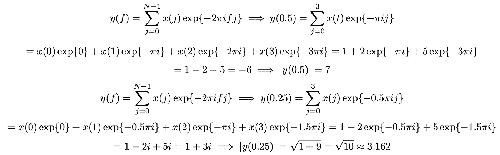

上述计算需要使用一些基本的复数性质，主要是欧拉公式：exp{πi} = −1。输出本质上允许我们比较不同频率成分的存在。这引出了下一个问题：我们考虑哪些 f 值？理论上，我们可以为任何 f 值计算傅里叶变换的值，因此必须找到合适的 f 值范围，使得傅里叶变换能够很好地描述底层信号，并且具有可交换性，即它可以用于恢复时域。对于大多数实际应用，我们只考虑 1/(TN)的整数倍的频率区间，其中 TN 是信号的总持续时间（即样本数 N 乘以每个样本的持续时间 T）。之所以如此，是因为这一点与采样和奈奎斯特-香农采样定理的概念密切相关，虽然这个概念与本文不特别相关。如果你对此感兴趣，可以参考这[页](https://www.techtarget.com/whatis/definition/Nyquist-Theorem)。

在继续之前，让我们稍作总结一下迄今为止我们所覆盖的内容：信号只是一个物理量的变化，可以表示为时间的函数（时域）或频率的函数（频域）。这两种表示方式是等价的（即其中一种可以转换为另一种），而傅里叶变换就是将一种表示方式转换为另一种表示方式的方法。连续信号的傅里叶变换表示为频域中的一个连续函数。然而，当我们处理数字信号（离散时间信号）时，我们会在离散点上对连续信号进行采样。这为我们提供了计算信号短时离散傅里叶变换的公式：


由于我们只考虑是 1/N 的整数倍的频率，我们得到如下结果：

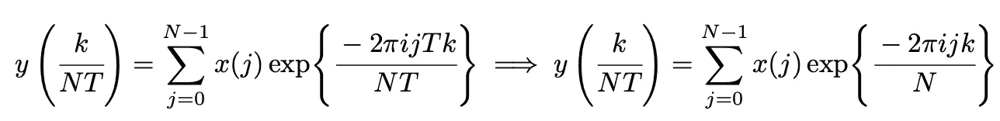

其中 i 是复数√(-1)，j 是信号中样本的索引，k 是我们计算功率的频率区间的索引。由于重复写 y(k/(NT))较为繁琐，我们干脆定义一个新函数：

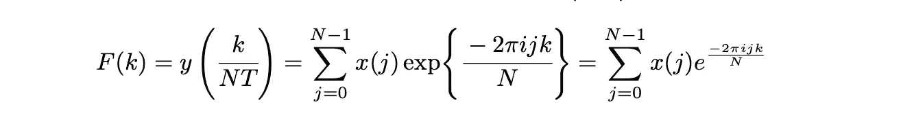

这就是朋友们，我们在教科书中常遇到的傅里叶变换公式。如果你仍然不确定它如何工作以及为什么这么做，下面是一个关于傅里叶变换的极好解释。在本文的下一部分，我们将用一些实际数据计算信号的完整傅里叶变换，编写代码，并发现传统计算傅里叶变换的方法的局限性。这最终将引导我们进入本文的核心内容：FFT 算法。

# 传统离散傅里叶变换计算的局限性

让我们从计算一个简单信号的傅里叶变换开始，这个信号只包含 8 个样本：


从公式中可以看出，我们不关心时间周期，也就是说，我们不在乎测量该量的间隔，只要它是均匀采样的。现在，我们可以通过将值代入公式，计算不同 k 值（从 k=0 到 k=N-1=7）的傅里叶变换。因此，我们需要计算以下内容：


让我们通过取α = exp{-2πi/N}来简化计算。因此，我们只需要：

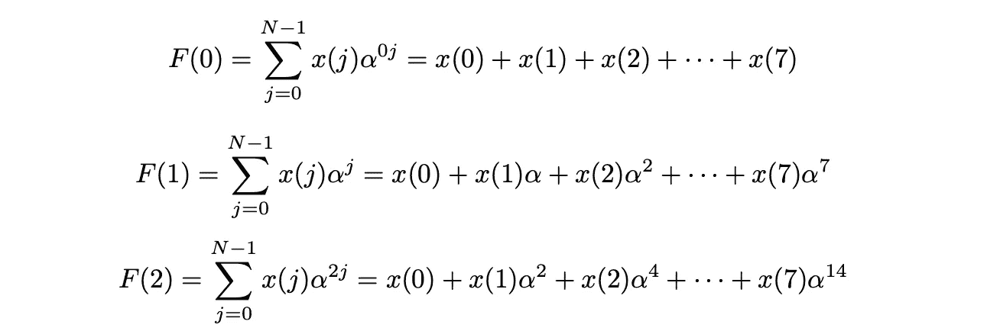

对所有 8 个 k 值依次进行计算。这个计算过程相当繁琐。我们能做得更好吗？当然，我们可以用一个简单的 Python 程序来为我们完成这项工作。下面是一个传统的（称为暴力法）方法，它本质上是遍历向量中的每个元素，并计算从 k=0 到 k=N-1 的所有 k 值所需的项：

```py
import numpy as np

def simple_dft(signal):
    # Get the number of samples in the signal
    N = len(signal)

    # Initialize an empty list to store the result (DFT coefficients)
    res = []

    # Iterate over each frequency bin (k)
    for k in range(N):
        # Initialize the current DFT coefficient for the given frequency bin
        cur_value = 0

        # Iterate over each sample in the signal (j)
        for j in range(N):
            # Calculate the complex exponential term and accumulate
            cur_value += signal[j] * np.exp(-2 * np.pi * 1j * j * k / N)

        # Append the result for the current frequency bin to the list
        res.append(np.round(cur_value, 5))

    # Return the list of DFT coefficients
    return res

simple_dft([1, 2, 0, 5, 9, 2, 0, 4])
# Output: [(23+0j), (-8.70711-0.70711j), (10+5j), (-7.29289-0.70711j), 
# (-3-0j), (-7.29289+0.70711j), (10-5j), (-8.70711+0.70711j)]
```

使用这个函数，我们可以轻松得到所需的 8 个 DFT 系数。我们还可以使用 numpy 提供的 fft 函数验证我们的计算：

```py
# Compute the FFT using NumPy's fft function
a = np.fft.fft([1, 2, 0, 5, 9, 2, 0, 4])

# Compute the DFT using our simple_dft function
b = simple_dft([1, 2, 0, 5, 9, 2, 0, 4])

# Check if the results are element-wise close within a tolerance
print(np.allclose(a, b))
# Output: True
```

很棒，我们可以正确地得到结果！但是，计算方法真的高效吗？你认为这个函数的时间复杂度是多少？它涉及两个嵌套的 for 循环，每个循环都遍历从 0 到 N-1 的整个值域。因此，时间复杂度是 O(N²)。这看起来似乎还不错，但对于大多数实际应用来说，O(N²)的时间复杂度可能意味着获取结果的速度非常慢。让我们用数字来验证这一点。

假设我们正在计算一个仅有 10 分钟长的音频样本的傅里叶变换。对于大多数传统应用，我们通常的采样率是 22050，即每秒钟测量 22050 个样本（这看起来可能很多，但实际上并不算多，这是保持音频样本质量时最常用的采样率）。这意味着我们大约有 10*60*22050 = 13230000 个样本。为了计算这个样本的 DFT，我们需要至少 N² = 13230000² = 175032900000000 次计算，这真是太多了！如果你使用的是像 C++这样的编程语言（它是最有效率的编程语言之一），最大每秒可以进行的计算次数可能是 2 × 10⁸次。这意味着，计算一个简短的 10 分钟音频样本的 DFT 需要 175032900000000/200000000 = 2875164.5 秒，约为 10 天！这使得计算大信号的 DFT 几乎不可能，从而使傅里叶变换的应用受到极大的限制。但是别担心！快傅里叶变换（FFT）来啦，这个神奇的算法一出现，DFT 计算变得飞快。它将 DFT 计算的时间复杂度从 O(N²)降低到 O(N log N)。对于这个 10 分钟的样本，现在我们只需要进行 13230000*log(13230000) = 216945507 次浮点运算。这个计算只需要约 1.08 秒，比传统的 DFT 算法高效得多。这意味着我们不仅仅局限于小信号——FFT 解放了傅里叶变换在海量数据集上的应用。酷吧？但是这个算法是如何工作的，是什么让它如此高效呢？接下来我们将进入本文的下一部分：FFT 算法！

# FFT 算法

FFT 的核心思想在于傅里叶变换固有的对称性，它帮助我们减少一些冗余的计算。FFT 通过利用离散傅里叶变换（DFT）计算的对称性，并将其输入到一个优雅的递归分治模型中，有效地将时间复杂度从 O(N²)降低到 O(N log N)。但是，我们说的这个对称性到底是什么呢？回顾一下 DFT 计算的公式：


如果我们对 N + k 使用这个公式，而不是 k，会发生什么呢？让我们来看一下：


根据复数的性质，对于任何值的 j，e−2πij = 1。因此，


换句话说，值在 k = N 后会重复。因此，F(1) = F(N + 1); F(2) = F(N + 2)，以此类推。这就是为什么我们只计算傅里叶变换，k 的范围是从 0 到 N - 1 的原因——之后的值会不断重复。更一般地，通过简单的归纳法，我们可以得到对于任何非负整数 s ∈ Z≥0，


这就是我们将要使用的对称性，它使得 FFT 算法变得更快（正如它的名字所示）。但是，如何设计一个使用这种对称性的分治策略呢？思路是将项分为奇数项和偶数项，并分别计算每个的 DFT：

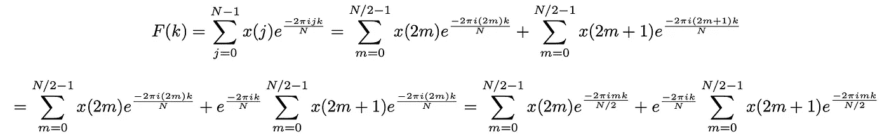

在上面的公式中，我们将 DFT 项分为两组：一组是偶数索引（j = 2m），另一组是奇数索引（j = 2m + 1）。正如你所看到的，这为我们提供了两个独立的 DFT，一个仅计算信号的偶数项，另一个计算信号的奇数项。但，这能帮助我们减少运算次数吗？还不能，因为我们仍然需要对从 0 到 N-1 的所有 k 值计算所有的 N/2 项，既偶数项也奇数项，即仍然是 2*N*(N/2)。或者我们真的需要这样做吗？这时我们就可以利用 FFT 的对称性！假设我们可以计算出介于 0 和 N/2-1 之间某个整数值 a 的上述表达式。那么，

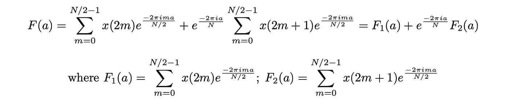

仅使用 F₁(a)和 F₂(a)的值（以及前面展示的对称性），我们可以轻松地计算出 F(a + b) = F(c)的值，其中 c 是介于 N/2 和 N-1 之间的某个整数值：

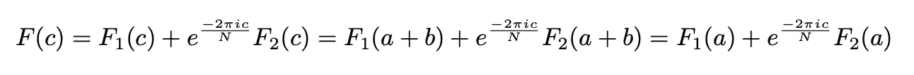

这里是关键思想！我们不需要重新计算 F(c)，这样每次可以节省大约 N/2*N 次运算。我们需要做的就是计算从 0 到 N/2-1 之间每个整数值 a 的 F1(a)和 F2(a)（这对于偶数项和奇数项总共需要(N/2)*(N/2) = N²/4 次运算）。这样做并应用一些简单的对称逻辑，就能帮助我们计算出所有从 0 到 N-1 之间 k 的整数值的 F(k)，有效地将运算次数从 N²减少到 2 × (N/2) × (N/2) = N²/2，也就是说减少了一半。是不是很神奇？

现在，看起来我们似乎已经将时间复杂度减少了一半，难道最终的复杂度仍然是 O(N²)吗？如果我们只分割一次，确实是这样。但没有什么能阻止我们进一步分割！我们可以继续这个链条：

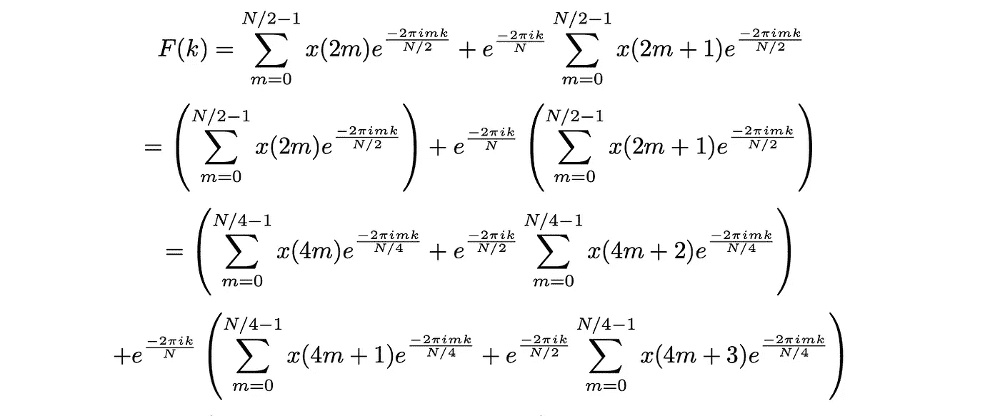

如果我们假设 N 是 2 的幂，那么我们可以重复这一过程 r 次，使得：


每次单独的评估需要 O(N)时间计算，我们这样做 r = log2(N)次，给我们一个时间复杂度为 O(Nr) = O(N log N)（在描述时间复杂度时，我们可以忽略对数的底数）。对于那些希望看到递归关系形式的人，公式为：


这里，T(N)表示解决一个大小为 n 的问题的时间复杂度。在 FFT 的情况下，它是输入信号中的元素数量，而 O(N)表示合并较小子问题结果所需的时间。

递推关系表明，为了解决一个大小为 N 的问题，FFT 算法递归地将问题分成两个子问题，每个子问题的大小为 N/2（一个用于奇数项，另一个用于偶数项），在 2T(N/2)的时间内计算这些子问题的解，然后在 O(N)的时间内合并结果。解决这个递推关系也使我们得出了前面提到的 O(N log N)的时间复杂度。

理论上看一切都很好！但是这真有效吗？让我们通过编写一个简单的 Python 函数，使用 FFT 算法来计算 DFT，来验证一下。以下是代码：

```py
import numpy as np

def nice_fft(signal):
    # Get the number of samples in the signal
    N = len(signal)

    # Base case: if the signal has only 1 samples, use simple_dft
    if N == 1:
        return simple_dft(signal)
    else:
        # Initialize an empty list to store the result (DFT coefficients)
        res = []

        # Separate the signal into even and odd terms
        even_terms = signal[::2]
        odd_terms = signal[1::2]

        # Recursively compute FFT for even and odd terms
        f1 = nice_fft(even_terms)
        f2 = nice_fft(odd_terms)

        # Combine the results using the Cooley-Tukey FFT algorithm
        for k in range(N):
            # Calculate the complex exponential term
            mult = np.exp(-2 * np.pi * 1j * k / N)
            # Determine the index for the even and odd terms
            INDEX = (k % int(N / 2))
            # Combine the results for the current frequency bin
            dft_value = f1[INDEX] + mult * f2[INDEX]
            # Append the result for the current frequency bin to the list
            res.append(np.round(dft_value, 5))

        # Return the list of DFT coefficients
        return res

nice_fft([1, 2, 0, 5, 9, 2, 0, 4])
# Output: [(23+0j), (-8.70711-0.70711j), (10+5j), (-7.29289-0.70711j), 
# (-3-0j), (-7.29289+0.70711j), (10-5j), (-8.70711+0.70711j)]
```

它给出的结果与之前相同，但速度快得多！上述代码遵循了基于分治策略的递归方法。请注意，为了简化起见，这段代码仅适用于长度是 2 的幂的信号。对于长度不是 2 的幂的信号，我们可以简单地在开始或结束处附加 0 以获得所需的结果。为了测试我们的两个函数（简单的 DFT 和优化的 FFT），我们可以尝试生成一个大小对应于较大 2 的幂的随机数组，并测量所花费的时间：

```py
import timeit

# Generate a random array of size 2¹⁴ (16384)
random_array = np.random.rand(2**14)

# Measure the execution time for simple_dft
time_simple_dft = timeit.timeit(lambda: simple_dft(random_array), number=1)

# Measure the execution time for nice_fft
time_nice_fft = timeit.timeit(lambda: nice_fft(random_array), number=1)

# Print the results
print(f"Time taken for simple_dft: {time_simple_dft:.5f} seconds")
# Output: Time taken for simple_dft: 149.81244 secondss
print(f"Time taken for nice_fft: {time_nice_fft:.5f} seconds")
# Output: Time taken for nice_fft: 1.28395 seconds
```

这是一次巨大的改进。为了更好地了解时间差异，我们还可以绘制一个线性图（对数刻度），显示不同大小数组所花费的时间差异：

```py
# Define array sizes to test
array_sizes = [2**n for n in range(5, 14)]  # Sizes from 2⁵ to 2¹⁴

# Measure execution time for each array size
time_simple_dft = []
time_nice_fft = []

for size in array_sizes:
    random_array = np.random.rand(size)
    time_simple_dft.append(timeit.timeit(lambda: simple_dft(random_array), number=1))
    time_nice_fft.append(timeit.timeit(lambda: nice_fft(random_array), number=1))

# Plotting
import matplotlib.pyplot as plt
plt.figure(figsize=(10, 6))
plt.plot(array_sizes, time_simple_dft, label='simple_dft')
plt.plot(array_sizes, time_nice_fft, label='nice_fft')
plt.xlabel('Array Size')
plt.ylabel('Time (seconds)')
plt.title('Execution Time for simple_dft and nice_fft')
plt.legend()
plt.show()
```

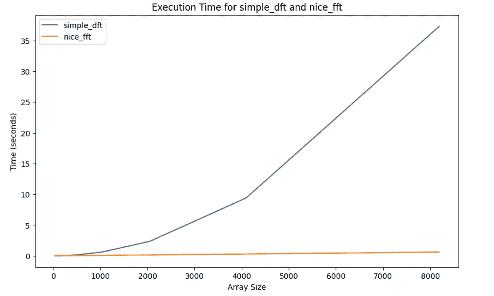

FFT 与直接 DFT（时间，对数刻度）

这不酷吗？一个简单的对称性想法嵌入在优雅的分治框架中，竟然产生了如此出色的算法！

# 矩阵视图

在本文中，我们从傅里叶变换的公式出发，通过将奇数项和偶数项分开来推导出 FFT 算法。还有另一种方式来看待它：通过矩阵操作的视角。这个想法是将傅里叶变换看作是简单地将输入信号与一个矩阵（称为傅里叶矩阵）相乘。回想傅里叶变换的定义：


正如你所看到的，每个单独的 DFT 是通过简单地对信号测量值进行线性组合来计算的。我们可以取α = exp{-2πi/N}，我们得到：


这使我们能够使用向量和矩阵的简单符号表示信号及其变换：

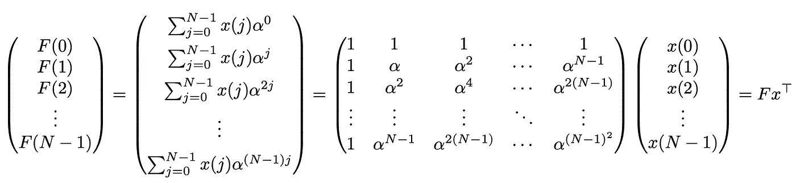

整个 DFT 归结为找到那个大的 N × N 矩阵 F（称为傅里叶矩阵），并将其与输入信号相乘。使用 FFT 算法，我们可以将傅里叶矩阵分解为 3 个稀疏矩阵的乘积：

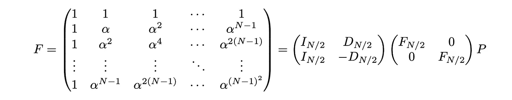

现在这看起来可能有些令人难以应付，但从根本上讲，它仅仅是在使用矩阵表达我们之前提到的分治法。I_{N/2} 只是已知的 N/2 行/列的单位矩阵。D_{N/2} 仅仅是 N × N 傅里叶矩阵 F 的前 N/2 × N/2 部分的对角线元素。这可以通过 O(N) 时间轻松计算，因为它只需要我们计算 1, α, α⁴, …, α^{(N/2–1)²} 的值，这些值正好对应于我们原始公式中的乘法项。

F_{N/2} 对应递归子问题，即 N/2 × N/2 的傅里叶矩阵。最后，P 是一个置换矩阵（一个填充了 0，且每一行/列中只有一个 1 的矩阵）。P 的作用是通过将偶数项移动到上面，将奇数项移动到底部，从而将输入信号的奇偶项区分开来。矩阵的其余部分操作如之前所示。我们可以不断重复这个过程，一次次地将傅里叶矩阵 F_{N/2} 分解，直到我们到达基本情况，即 N = 1。和之前一样，时间复杂度仍然是 O(N log N)，这只是以更优雅的方式写出方程，而不需要繁琐的求和！

# 结论

快速傅里叶变换（FFT）是算法设计中简单性与优雅性的典范。它彻底改变了信号处理、数据分析和各个科学领域的重要性，FFT 的价值不仅体现在其计算效率上，这一点通过与朴素方法相比获得的显著速度提升得到了证明，还体现在它的多功能性，推动了电信、图像处理和量子计算等多个领域的突破。从音频压缩算法到医学影像技术，FFT 支撑着无数已经成为我们日常生活不可或缺的应用。

当我们回顾从一个简单的想法到开创性算法的过程时，令人敬畏的是，我们能体会到对对称性的基础理解，再加上创新的算法设计，如何能带来具有深远意义的解决方案。FFT 以其优雅与高效，概括了计算机科学中独创性的精髓。因此，下次当你惊叹于数字图像的清晰度，或享受音乐流媒体的音质时，记得背后支撑这些技术奇迹的，正是那个非凡的 FFT —— 这是真正简单而巧妙的创意力量的见证。

希望你喜欢这篇文章！如果你有任何疑问或建议，请在评论区留言。你也可以通过邮件与我联系。

如果你喜欢我的文章并想阅读更多，请关注我。

**注意：** 所有图片（封面图片除外）均由作者制作。

# 参考文献

1.  cs.cornell.edu. [`www.cs.cornell.edu/~bindel/class/cs5220-s10/slides/FFT.pdf`](https://www.cs.cornell.edu/~bindel/class/cs5220-s10/slides/FFT.pdf)。 [访问时间：2024 年 1 月 5 日]。

1.  快速傅里叶变换（FFT）：有史以来最巧妙的算法？ — youtube.com. [`www.youtube.com/`](https://www.youtube.com/)watch?v=h7apO7q16V0\. [访问时间：2024 年 1 月 5 日]。

1.  Shaw Talebi. 快速傅里叶变换（FFT） — medium.com. [`medium.com/swlh/`](https://medium.com/swlh/)the-fast-fourier-transform-fft-5e96cf637c38#:~:text=The%20FFT%20is%20an%20efficient,the%20Permutation%20matrix%2C%20used%20above. [访问时间：2024 年 1 月 5 日]。

1.  Jake VanderPlas. 理解 FFT 算法 — Pythonic Perambulations — jakevdp.github.io. https://jakevdp.github.io/blog/2013/08/28/understanding-the-fft/. [访问时间：2024 年 1 月 5 日]。
