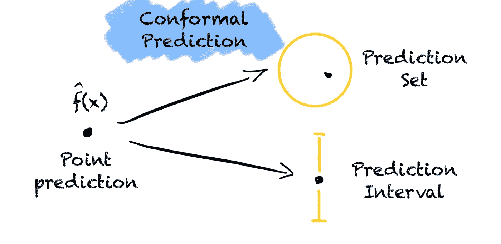

# 你所需要的只是保形预测

> 原文：[`towardsdatascience.com/all-you-need-is-conformal-prediction-726f18920241?source=collection_archive---------5-----------------------#2024-04-30`](https://towardsdatascience.com/all-you-need-is-conformal-prediction-726f18920241?source=collection_archive---------5-----------------------#2024-04-30)

## 每个数据科学家都应该了解的不确定性量化的重要且易用的工具。

 [Jonte Dancker](https://medium.com/@jodancker?source=post_page---byline--726f18920241--------------------------------)

·发表于 [Towards Data Science](https://towardsdatascience.com/?source=post_page---byline--726f18920241--------------------------------) ·8 分钟阅读·2024 年 4 月 30 日

--

使用保形预测将一个点预测转换为预测区域，帮助我们获得更多关于模型不确定性的信息（图由作者提供）。

我们必须了解模型在做出预测时的确定性，因为错误的预测是有风险的。如果没有量化模型的不确定性，准确的预测和完全的猜测看起来是一样的。例如，一辆自动驾驶汽车必须确保驾驶路径上没有障碍物。我曾在另一篇文章中写到过这个问题。

那么，我们如何量化模型的不确定性呢？

这就是保形预测的作用所在。保形预测是一个不确定性量化的框架。该方法可以将任何点预测转化为统计学上有效的预测区域。这个区域可以是分类问题中的一组类别，也可以是回归问题中的一个区间。

# **我们如何使用保形预测将一个点预测转换为预测区域？**

保形预测使用过去的经验来确定新预测的不确定性。要应用保形预测，我们需要一个不一致性评分、一个显著性水平 alpha 和一个校准集。
