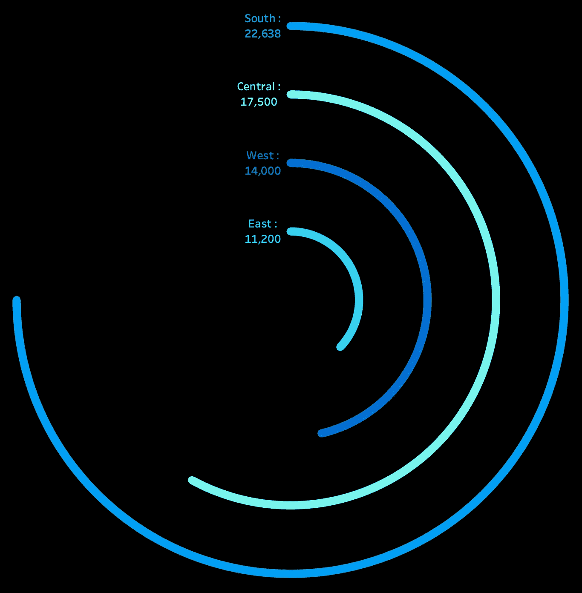

# 构建 Tableau 径向图所需了解的一切

> 原文：[`towardsdatascience.com/all-you-need-to-know-to-build-radial-charts-in-tableau-686efc218c9c?source=collection_archive---------12-----------------------#2024-10-17`](https://towardsdatascience.com/all-you-need-to-know-to-build-radial-charts-in-tableau-686efc218c9c?source=collection_archive---------12-----------------------#2024-10-17)

## 你看完之后肯定永远不会忘记它！

 [Isha Garg](https://ishagarg2010.medium.com/?source=post_page---byline--686efc218c9c--------------------------------)

·发表于 [Towards Data Science](https://towardsdatascience.com/?source=post_page---byline--686efc218c9c--------------------------------) ·8 分钟阅读·2024 年 10 月 17 日

--

径向图一直让我感到畏惧，因为我认为它们很难——可能是因为我遇到的所有教程都提到过复制粘贴一些计算公式，却没有任何逻辑解释。我每次需要使用径向图时都应该去查找吗？！

噢，幸运的是，我不是一个复制粘贴的人。只有当我理解了某些内容时，我才能记住它们，而且我喜欢掌握我所做事情背后的概念。因此，我尝试在理解各种步骤背后的逻辑的同时创建一个径向图，而这就像是魔法在我面前展开。那么，我们开始吧！

*请注意，本文所用的数据集是：*

+   *除非另有说明，所有图片均来自作者。*

+   *使用的数据集是：样本——超市数据集。

    这是一个免费的数据集，随 Tableau 附带。它包含有关产品、销售、利润等的信息，我们可以用来识别这个虚拟公司中需要改进的关键领域。*

我们将从理解如何在圆形上绘制数据开始。接着，我们将应用相同的原理来创建两种不同类型的径向条形图。

## **首先，介绍一些基础知识！**
