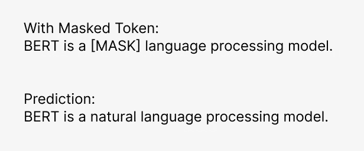
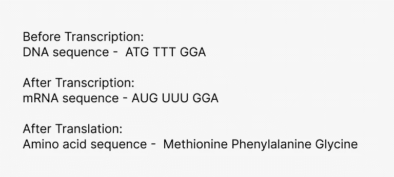
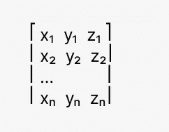

# 通过 BERT 视角理解 AlphaFold 2

> 原文：[`towardsdatascience.com/alphafold-2-through-the-context-of-bert-78c9494e99af?source=collection_archive---------7-----------------------#2024-10-07`](https://towardsdatascience.com/alphafold-2-through-the-context-of-bert-78c9494e99af?source=collection_archive---------7-----------------------#2024-10-07)

## 理解 AI 在生物学中的应用对于机器学习工程师的意义

 [梅根·海因茨](https://medium.com/@meghanheintz?source=post_page---byline--78c9494e99af--------------------------------)

·发布于 [Towards Data Science](https://towardsdatascience.com/?source=post_page---byline--78c9494e99af--------------------------------) ·8 分钟阅读 ·2024 年 10 月 7 日

--

图片由 [Google DeepMind](https://unsplash.com/@googledeepmind?utm_content=creditCopyText&utm_medium=referral&utm_source=unsplash) 提供，来源 [Unsplash](https://unsplash.com/photos/a-mobile-made-of-green-plants-and-balls-ryxY5haw8xg?utm_content=creditCopyText&utm_medium=referral&utm_source=unsplash)

AlphaFold 2 和 BERT 都是在 Google 2018 年深厚资金支持下研发的（虽然由不同部门开发：DeepMind 和 Google AI）。它们分别代表了自然语言处理（NLP）和生物学领域的前沿技术进展。对于 BERT 来说，这意味着在 GLUE（[通用语言理解评估](https://arxiv.org/pdf/1804.07461.pdf)）和 SQuAD（[斯坦福问答数据集](https://rajpurkar.github.io/SQuAD-explorer/)）等基准测试中名列前茅。对于 AlphaFold 2（以下简称 AlphaFold）而言，它意味着在预测 3D 蛋白质结构方面达到近乎实验的准确度。在这两种情况下，这些进展主要归因于使用了变换器架构和自注意力机制。

我预计大多数机器学习工程师对 BERT 或 *双向编码器表示（Bidirectional Encoder Representations from Transformers）* 如何与语言工作有初步了解，但对同一架构如何应用于生物学领域的理解则较为模糊，仅停留在比喻性理解的层面。本文的目的是通过比较和对比 BERT 来解释 AlphaFold 开发和成功背后的概念。

*提前声明：我是一名机器学习工程师，不是生物学家，只是一个好奇的人。*

## BERT 简介

在深入研究蛋白质折叠之前，让我们刷新一下对 BERT 的理解。从大致上看，BERT 是通过掩码令牌预测和下一个句子预测进行训练的。

一个掩码令牌预测的示例，其中“natural”是目标句子中的掩码令牌。（所有图片，除非另有说明，均由作者提供）

BERT 属于[序列模型](https://deeplearningmath.org/sequence-models)家族。序列模型是一类设计用于处理和理解顺序数据的机器学习模型，其中元素的顺序很重要。该家族的成员包括递归神经网络（RNNs）、长短期记忆网络（LSTMs）和变换器。作为一个变换器模型（像它更著名的亲戚 GPT），BERT 的一个关键突破是如何使训练能够并行化。RNN 和 LSTM 按顺序处理序列，这减慢了训练速度并限制了适用的硬件。变换器模型利用自注意力机制并行处理整个序列，从而允许训练利用现代 GPU 和 TPU，这些硬件经过优化以适应并行计算。

一次处理整个序列不仅减少了训练时间，还通过建模单词之间的上下文关系提高了嵌入效果。这使得模型能够更好地理解依赖关系，无论它们在序列中的位置如何。一个经典的例子说明了这个概念：“我在河岸边钓鱼”和“我需要把钱存进银行”。对于读者来说，*bank* 显然代表了两个不同的概念，但之前的模型难以区分它们。变换器中的自注意力机制使得模型能够捕捉到这些细微的差异。想深入了解这个话题，我推荐观看这个[**变换器神经网络图解：逐步解释**](https://www.youtube.com/watch?v=4Bdc55j80l8)。

以前的 NLP 模型未能区分“bank”和“river bank”两种含义的示例句子。

RNN 和 LSTM 之所以存在困难的一个原因是它们是单向的，也就是说，它们按从左到右的顺序处理句子。所以如果句子被改写成“在银行，我需要存钱”，*money* 就不再能明确解释*bank*的含义。自注意力机制通过允许句子中的每个单词“关注”它前后所有的其他单词，从而消除了这种脆弱性，使得处理变成了“双向”的。

## AlphaFold 与 BERT 的比较

现在我们已经回顾了 BERT 的基础知识，让我们将它与 AlphaFold 进行比较。像 BERT 一样，AlphaFold 也是一个序列模型。然而，AlphaFold 的输入不是句子中的单词，而是**氨基酸序列**和**多序列比对（MSA）**，而其输出/预测是蛋白质的**三维结构**。

**在深入了解它们是如何建模之前，让我们回顾一下这些输入和输出是什么。**

第一个输入：氨基酸序列

氨基酸序列被嵌入到高维向量中，类似于文本在像 BERT 这样的语言模型中被嵌入的方式。

你在高中生物课上学过的提醒：组成蛋白质的氨基酸的特定序列是由 mRNA 决定的。mRNA 是从 DNA 中的指令转录出来的。当氨基酸被连接在一起时，它们通过各种化学键和力相互作用，导致蛋白质折叠成一个独特的三维结构。这个折叠的结构对蛋白质的功能至关重要，因为其形状决定了它如何与其他分子相互作用，并执行其生物学功能。由于 3D 结构对确定蛋白质功能如此重要，“蛋白质折叠”问题已成为过去半个世纪以来的重要研究课题。

生物学 101：DNA、mRNA 和氨基酸序列之间的关系

在 AlphaFold 出现之前，确定氨基酸序列如何折叠的唯一可靠方法是通过实验验证，采用如 X 射线晶体学、核磁共振光谱（NMR）和冷冻电子显微镜（cryo-EM）等技术。尽管这些方法准确，但它们耗时、劳动强度大且成本高昂。

## **那么，什么是 MSA（多序列比对），它为何是模型中的另一个输入？**

第二输入：多序列比对，以矩阵形式在模型中表示。

氨基酸序列包含了构建蛋白质所需的指令，但也包括一些不那么重要或变化较大的区域。将其与语言进行类比，我认为这些不太重要的区域就像蛋白质折叠指令中的“[停用词](https://en.wikipedia.org/wiki/Stop_word)”。为了确定序列中哪些区域类似于停用词，构建了多序列比对（MSA），该比对通过具有相似功能的同源（进化相关的）蛋白质序列形成矩阵，其中目标序列是第一行。

序列的相似区域被认为是“进化上保守的”（即序列中的某些部分保持不变）。跨物种高度保守的区域在结构或功能上非常重要（例如酶的活性位点）。我不完美的比喻是将罗曼语系语言的句子排列起来，找出其中共同的重要单词。然而，这个比喻并未完全解释为何 MSA 在预测 3D 结构中如此重要。保守区域之所以如此关键，是因为它们使我们能够检测到氨基酸之间的共进化。如果两个残基在不同序列中趋向于协调地突变，这通常意味着它们在 3D 结构中彼此靠得很近，并且相互作用以保持蛋白质的稳定性。这种进化关系很难从单一氨基酸序列中推断出来，但在分析 MSA 时变得清晰可见。

**MSA 的一个不完美比喻**：就像比较浪漫语言中相似的单词（例如，“branches”：ramas, branches, rami, ramos, ramuri, branques），MSA 将序列对齐以揭示进化关系，追踪通过小的变异所共享的起源。

这里是自然语言处理与蛋白质折叠比较的另一个不同之处；MSA（多序列比对）必须构建，并且研究人员通常需要手动筛选它们，以获得最佳结果。生物学家使用像[**BLAST**（基本局部比对搜索工具）](https://blast.ncbi.nlm.nih.gov/Blast.cgi)这样的工具，搜索目标序列以找到“同源”或相似的序列。如果你研究的是人类，这可能意味着找到来自其他哺乳动物、脊椎动物或更远生物的序列。然后，考虑到相似长度和功能等因素，这些序列会被手动筛选。包括过多功能差异较大的序列会降低 MSA 的质量。这与自然语言模型训练数据的收集方式有巨大不同。自然语言模型是在从各个地方收集的大量数据上进行训练的。而生物学模型则需要高度熟练且具有争议的数据库构建者。

## **预测/输出的是什么？**

在 BERT 中，预测或目标是被掩盖的标记或下一句。对于 AlphaFold，目标是蛋白质的 3D 结构，以**蛋白质原子的 3D 坐标**表示，这定义了折叠蛋白质中氨基酸的空间排列。每组 3D 坐标通过实验收集、审查并存储在[蛋白质数据银行](https://en.wikipedia.org/wiki/Protein_Data_Bank)中。最近解决的结构作为评估的验证集。

AlphaFold 的输出通常是蛋白质的**3D 结构**，由组成蛋白质氨基酸的原子的**x, y, z 坐标**构成。

## **输入和输出是如何联系的？**

目标序列和 MSA 都通过一系列变换器块（transformer blocks）独立处理，利用自注意力机制生成嵌入表示（embeddings）。MSA 嵌入表示捕捉了进化关系，而目标序列嵌入表示则记录了局部上下文。这些上下文嵌入随后被传入下游层，用于预测氨基酸之间的配对相互作用，最终推断蛋白质的 3D 结构。

在每个序列中，成对残基（指蛋白质序列中两个氨基酸之间的关系或相互作用）表示法预测氨基酸之间的空间距离和方向，这对建模蛋白质折叠时远离的部分如何接近至关重要。自注意力机制使得模型能够考虑序列和多序列比对（MSA）中的局部依赖和长程依赖关系。这一点非常重要，因为当序列被折叠时，序列中相距较远的残基可能会在空间上非常接近。

AlphaFold 的损失函数比 BERT 的损失函数复杂得多。BERT 不受空间或几何约束，其损失函数要简单得多，因为它只需要预测缺失的单词或句子关系。相比之下，AlphaFold 的损失函数涉及蛋白质结构的多个方面（如距离分布、扭转角度、三维坐标等），并且模型在几何和空间预测方面进行优化。这个由多个组件构成的损失函数确保了 AlphaFold 能够准确捕捉定义蛋白质最终结构的物理属性和相互作用。

虽然 BERT 的预测几乎不需要任何有意义的后处理，但预测的三维坐标会根据蛋白质的物理原理进行能量最小化和几何优化。这些步骤确保了预测的结构在物理上可行且在生物学上功能齐全。

## **结论**

+   AlphaFold 和 BERT 都受益于变压器架构和自注意力机制。这些改进提高了上下文嵌入以及使用 GPU 和 TPU 时的训练速度。

+   AlphaFold 的数据准备过程比 BERT 复杂得多。从实验数据中筛选 MSA 比收集大量文本语料库要难得多！

+   AlphaFold 的损失函数必须考虑空间或几何约束，其复杂度远高于 BERT。

+   AlphaFold 的预测需要后处理，以确认预测在物理上是可行的，而 BERT 的预测则不需要后处理。

感谢您阅读到这里！我坚信跨职能学习，我认为作为机器学习工程师，我们可以通过挑战自己去学习超出我们直接领域的知识来学到更多。我希望在我的产假期间继续这个系列——《理解 AI 在生物学中的应用，面向机器学习工程师》。❤
