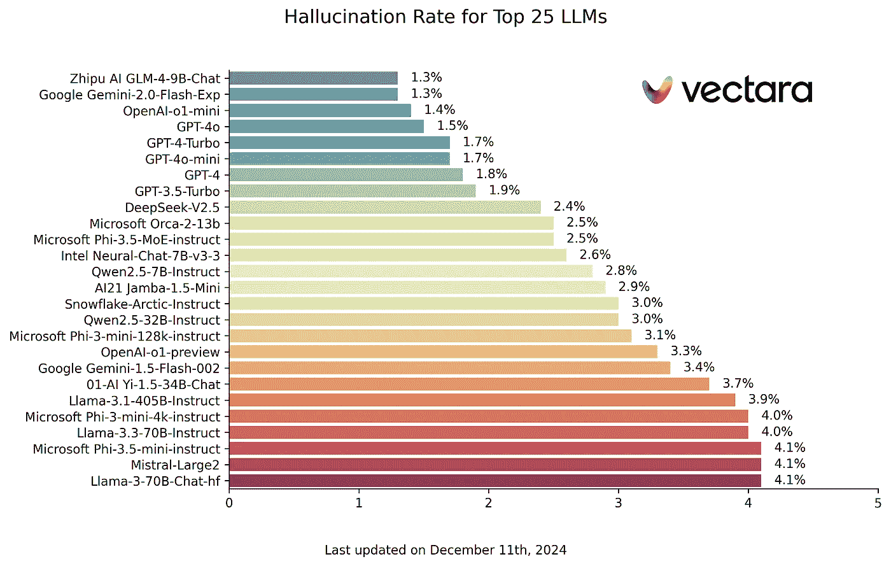

# 减少 LLM 幻觉的代理方法

> 原文：[`towardsdatascience.com/an-agentic-approach-to-reducing-llm-hallucinations-f7ffd6eedcf2?source=collection_archive---------1-----------------------#2024-12-22`](https://towardsdatascience.com/an-agentic-approach-to-reducing-llm-hallucinations-f7ffd6eedcf2?source=collection_archive---------1-----------------------#2024-12-22)

## 使用 LangGraph 缓解 LLM 幻觉的简单技巧

[](https://medium.com/@CVxTz?source=post_page---byline--f7ffd6eedcf2--------------------------------)[](https://towardsdatascience.com/?source=post_page---byline--f7ffd6eedcf2--------------------------------) [Youness Mansar](https://medium.com/@CVxTz?source=post_page---byline--f7ffd6eedcf2--------------------------------)

·发表于 [Towards Data Science](https://towardsdatascience.com/?source=post_page---byline--f7ffd6eedcf2--------------------------------) ·8 分钟阅读·2024 年 12 月 22 日

--


图片来源：[Greg Rakozy](https://unsplash.com/@grakozy?utm_source=medium&utm_medium=referral) 在 [Unsplash](https://unsplash.com/?utm_source=medium&utm_medium=referral)

如果你曾经使用过 LLM，你就会知道它们有时会产生幻觉。这意味着它们生成的文本要么没有意义，要么与输入数据相矛盾。这是一个常见的问题，会影响 LLM 驱动应用程序的可靠性。

在这篇文章中，我们将探索一些简单的技巧，来减少幻觉发生的可能性。通过遵循这些建议，你可以（希望）提高 AI 应用程序的准确性。

幻觉有多种类型：

+   [内在幻觉](https://arxiv.org/pdf/2311.05232)：LLM 的回答与用户提供的上下文相矛盾。这是指在当前上下文中，回答是可以被验证为错误的。

+   [外在幻觉](https://arxiv.org/pdf/2311.05232)：LLM 的回答无法通过用户提供的上下文进行验证。这是指回答可能正确也可能错误，但我们无法通过当前上下文确认其正确性。

+   无关的幻觉：LLM 的回答没有回答问题或没有意义。这是指 LLM 无法遵循指示。

本文将针对上述所有类型进行讨论。

我们将列出一组有效的技巧和方法，这些方法可以以不同方式减少幻觉。

## 提示 1：使用基础数据

归属（Grounding）是在向 LLM 提出任务时，输入包含领域相关的附加上下文。这为 LLM 提供了正确回答问题所需的信息，并减少了幻觉的可能性。这也是我们使用增强检索生成（RAG）的原因之一。

例如，向 LLM 提问一个数学问题，或者在提供相关数学书籍的章节后向它提问，会得到不同的结果，第二种方式更有可能得到正确答案。

这里是我之前教程中的一个实现示例，当我在提问时提供了从文档中提取的上下文：

[](/build-a-document-ai-pipeline-for-any-type-of-pdf-with-gemini-9221c8e143db?source=post_page-----f7ffd6eedcf2--------------------------------) ## 使用 Gemini 构建适用于任何类型 PDF 的文档 AI 管道

### 表格、图片、图形或手写内容不再是问题！完整代码已提供。

towardsdatascience.com

## 提示 2：使用结构化输出

使用结构化输出意味着强制 LLM 输出有效的 JSON 或 YAML 文本。这将帮助你减少无意义的废话，得到“直截了当”的答案，同时也有助于下一个提示，因为它使 LLM 的回应更容易验证。

下面是如何通过 Gemini 的 API 实现这一点：

```py
import json

import google.generativeai as genai
from pydantic import BaseModel, Field

from document_ai_agents.schema_utils import prepare_schema_for_gemini

class Answer(BaseModel):
    answer: str = Field(..., description="Your Answer.")

model = genai.GenerativeModel("gemini-1.5-flash-002")

answer_schema = prepare_schema_for_gemini(Answer)

question = "List all the reasons why LLM hallucinate"

context = (
    "LLM hallucination refers to the phenomenon where large language models generate plausible-sounding but"
    " factually incorrect or nonsensical information. This can occur due to various factors, including biases"
    " in the training data, the inherent limitations of the model's understanding of the real world, and the "
    "model's tendency to prioritize fluency and coherence over accuracy."
)

messages = (
    [context]
    + [
        f"Answer this question: {question}",
    ]
    + [
        f"Use this schema for your answer: {answer_schema}",
    ]
)

response = model.generate_content(
    messages,
    generation_config={
        "response_mime_type": "application/json",
        "response_schema": answer_schema,
        "temperature": 0.0,
    },
)

response = Answer(**json.loads(response.text))

print(f"{response.answer=}")
```

其中“prepare_schema_for_gemini”是一个工具函数，用来准备模式以匹配 Gemini 的特殊要求。你可以在这里找到它的定义：[code](https://github.com/CVxTz/document_ai_agents/blob/498d8ee6e8597f8ba43b336c64178d186461dba0/document_ai_agents/schema_utils.py#L38)。

这段代码定义了一个 Pydantic 模式，并将该模式作为查询的一部分传递给字段“response_schema”。这迫使 LLM 在回应时遵循这个模式，并使其输出更容易解析。

## 提示 3：使用思维链和更好的提示

有时，给 LLM 一些空间来推敲其回答，在最终给出答案之前，能帮助产生更高质量的回答。这种技术称为思维链（Chain-of-thoughts），它被广泛使用，因为它有效且非常容易实现。

我们还可以明确要求 LLM 如果无法找到足够的上下文来生成高质量的回答时，回答为“N/A”。这样它就有了一个简单的退出方式，而不是尝试回答自己无法回答的问题。

例如，让我们看看这个简单的问题和上下文：

**背景**

> 托马斯·杰斐逊（1743 年 4 月 13 日[公历 4 月 2 日]—1826 年 7 月 4 日）是美国政治家、种植园主、外交家、律师、建筑师、哲学家和开国元勋，曾于 1801 至 1809 年担任美国第三任总统。[6] 他是《独立宣言》的主要起草人。美国独立战争后，杰斐逊在 1801 年成为总统之前，曾担任乔治·华盛顿政府的首任美国国务卿，随后成为约翰·亚当斯政府的第二任副总统。杰斐逊是民主、共和主义和自然权利的主要倡导者，并在州、国家和国际层面制定了具有重要影响的文件和决策。（来源：维基百科）

**问题**

> 戴维斯·杰斐逊是哪一年去世的？

一个简单的方法得到如下结果：

**回应**

> 答案=‘1826’

显然这是错误的，因为杰斐逊·戴维斯在上下文中根本没有被提到。死于 1826 年的是托马斯·杰斐逊。

如果我们将回应的模式改为使用思维链：

```py
class AnswerChainOfThoughts(BaseModel):
    rationale: str = Field(
        ...,
        description="Justification of your answer.",
    )
    answer: str = Field(
        ..., description="Your Answer. Answer with 'N/A' if answer is not found"
    )
```

我们还在添加更多细节，说明当问题无法使用上下文回答时，我们期待的输出是什么——“如果没有找到答案，请回复‘N/A’”。

使用这种新方法，我们得到了以下**推理**（记住，思维链）：

> 提供的文本讨论的是托马斯·杰斐逊，而不是杰斐逊·戴维斯。没有包含任何关于杰斐逊·戴维斯死亡的信息。

最终的**答案**：

> 答案=‘N/A’

太棒了！但是我们能否使用一种更通用的方法来检测幻觉？

我们可以使用代理！

## 提示 4：使用代理方法

我们将构建一个简单的代理，实施一个三步流程：

+   第一步是包含上下文并向 LLM 提问，以便获得第一个候选回应及其用于回答的相关上下文。

+   第二步是将问题和第一个候选回答重新表述为陈述句。

+   第三步是让 LLM 验证相关上下文是否**蕴含**候选回应。这被称为“自我验证”：[`arxiv.org/pdf/2212.09561`](https://arxiv.org/pdf/2212.09561)

为了实现这一点，我们在 LangGraph 中定义了三个节点。第一个节点将提问并包含上下文，第二个节点将使用 LLM 进行重述，第三个节点将检查该声明与输入上下文的蕴含关系。

第一个节点可以定义如下：

```py
 def answer_question(self, state: DocumentQAState):
        logger.info(f"Responding to question '{state.question}'")
        assert (
            state.pages_as_base64_jpeg_images or state.pages_as_text
        ), "Input text or images"
        messages = (
            [
                {"mime_type": "image/jpeg", "data": base64_jpeg}
                for base64_jpeg in state.pages_as_base64_jpeg_images
            ]
            + state.pages_as_text
            + [
                f"Answer this question: {state.question}",
            ]
            + [
                f"Use this schema for your answer: {self.answer_cot_schema}",
            ]
        )

        response = self.model.generate_content(
            messages,
            generation_config={
                "response_mime_type": "application/json",
                "response_schema": self.answer_cot_schema,
                "temperature": 0.0,
            },
        )

        answer_cot = AnswerChainOfThoughts(**json.loads(response.text))

        return {"answer_cot": answer_cot}
```

第二个示例如下：

```py
 def reformulate_answer(self, state: DocumentQAState):
        logger.info("Reformulating answer")
        if state.answer_cot.answer == "N/A":
            return

        messages = [
            {
                "role": "user",
                "parts": [
                    {
                        "text": "Reformulate this question and its answer as a single assertion."
                    },
                    {"text": f"Question: {state.question}"},
                    {"text": f"Answer: {state.answer_cot.answer}"},
                ]
                + [
                    {
                        "text": f"Use this schema for your answer: {self.declarative_answer_schema}"
                    }
                ],
            }
        ]

        response = self.model.generate_content(
            messages,
            generation_config={
                "response_mime_type": "application/json",
                "response_schema": self.declarative_answer_schema,
                "temperature": 0.0,
            },
        )

        answer_reformulation = AnswerReformulation(**json.loads(response.text))

        return {"answer_reformulation": answer_reformulation}
```

第三个节点如下：

```py
 def verify_answer(self, state: DocumentQAState):
        logger.info(f"Verifying answer '{state.answer_cot.answer}'")
        if state.answer_cot.answer == "N/A":
            return
        messages = [
            {
                "role": "user",
                "parts": [
                    {
                        "text": "Analyse the following context and the assertion and decide whether the context "
                        "entails the assertion or not."
                    },
                    {"text": f"Context: {state.answer_cot.relevant_context}"},
                    {
                        "text": f"Assertion: {state.answer_reformulation.declarative_answer}"
                    },
                    {
                        "text": f"Use this schema for your answer: {self.verification_cot_schema}. Be Factual."
                    },
                ],
            }
        ]

        response = self.model.generate_content(
            messages,
            generation_config={
                "response_mime_type": "application/json",
                "response_schema": self.verification_cot_schema,
                "temperature": 0.0,
            },
        )

        verification_cot = VerificationChainOfThoughts(**json.loads(response.text))

        return {"verification_cot": verification_cot}
```

完整代码请见[`github.com/CVxTz/document_ai_agents`](https://github.com/CVxTz/document_ai_agents)

请注意，每个节点都使用其自己的模式进行结构化输出，并使用自己的提示。这是由于 Gemini 的 API 和 LangGraph 的灵活性所实现的。

让我们通过与上述相同的示例来演示这段代码 ➡️

*(注意：我们在第一个提示中没有使用思维链，以便触发验证进行测试。)*

**上下文**

> 托马斯·杰斐逊（1743 年 4 月 13 日[公历 4 月 2 日] — 1826 年 7 月 4 日）是美国政治家、种植园主、外交官、律师、建筑师、哲学家和建国父亲之一，曾于 1801 年至 1809 年担任美国第三任总统。[6] 他是《独立宣言》的主要作者。在美国独立战争后，托马斯·杰斐逊在 1801 年成为总统之前，曾担任乔治·华盛顿总统政府下的第一任美国国务卿，并在约翰·亚当斯总统政府下担任第二任副总统。杰斐逊是民主主义、共和主义和自然权利的主要支持者，他在州级、国家级和国际层面上起草了具有开创性的文件和决策。（来源：维基百科）

**问题**

> 戴维斯·杰斐逊是什么时候去世的？

**第一节点结果（第一次回答）：**

> **相关上下文**=‘托马斯·杰斐逊（1743 年 4 月 13 日[公历 4 月 2 日] — 1826 年 7 月 4 日）是美国政治家、种植园主、外交官、律师、建筑师、哲学家和建国父亲之一，曾于 1801 年至 1809 年担任美国第三任总统。’
> 
> **答案**=‘1826’

**第二节点结果（答案重述）：**

> **陈述性答案**=‘戴维斯·杰斐逊于 1826 年去世’

**第三节点结果（验证）：**

> **推理**=‘上下文中提到托马斯·杰斐逊于 1826 年去世。声明称戴维斯·杰斐逊于 1826 年去世。上下文中没有提到戴维斯·杰斐逊，只有托马斯·杰斐逊。’
> 
> **蕴含**=‘否’

因此，验证步骤**拒绝**了初始答案（*两者之间没有蕴含*）。现在我们可以避免将幻觉返回给用户。

## 提示：使用更强大的模型

由于预算或延迟限制，这个提示并不总是容易应用，但你应该知道，较强大的 LLM 较不容易产生幻觉。因此，如果可能的话，针对最敏感的使用场景，选择更强大的 LLM。你可以在这里查看幻觉的基准测试：[`github.com/vectara/hallucination-leaderboard`](https://github.com/vectara/hallucination-leaderboard)。我们可以看到，在这个基准测试中，排名最前的模型（最少幻觉）也排名在传统 NLP 排行榜的前列。



来源：[`github.com/vectara/hallucination-leaderboard`](https://github.com/vectara/hallucination-leaderboard) 来源许可证：Apache 2.0

# 结论

在本教程中，我们探讨了通过降低幻觉率来提高大型语言模型（LLM）输出可靠性的策略。主要建议包括仔细格式化和提示，以指导 LLM 的调用，并采用基于工作流的方法，在这种方法中，代理会被设计为验证自己的答案。

这包括多个步骤：

1.  检索 LLM 用于生成答案的确切上下文元素。

1.  将答案重新表述为更易验证的形式（以陈述句形式）。

1.  指示 LLM 检查上下文与重述答案之间的一致性。

尽管所有这些技巧都可以显著提高准确性，但你应该记住没有任何方法是万无一失的。如果 LLM 在验证过程中过于保守，可能会拒绝有效的答案，或者遗漏真实的幻觉案例，因此，仍然需要对你的特定 LLM 工作流进行严格评估。

完整代码在[`github.com/CVxTz/document_ai_agents`](https://github.com/CVxTz/document_ai_agents)

## 感谢阅读！
