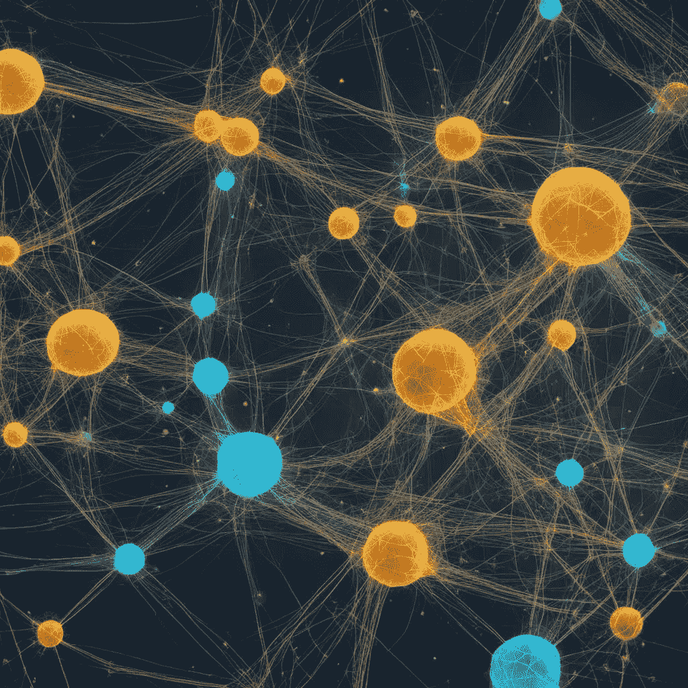

# 下一代异常检测：解锁神经洞察

> 原文：[`towardsdatascience.com/an-exploration-of-model-state-data-in-anomaly-detection-e6860cbca160?source=collection_archive---------3-----------------------#2024-04-11`](https://towardsdatascience.com/an-exploration-of-model-state-data-in-anomaly-detection-e6860cbca160?source=collection_archive---------3-----------------------#2024-04-11)

## 利用神经元的力量，彻底变革异常检测！

 [Sara Nóbrega](https://medium.com/@saranobregafn?source=post_page---byline--e6860cbca160--------------------------------)

·发表于[Towards Data Science](https://towardsdatascience.com/?source=post_page---byline--e6860cbca160--------------------------------) ·12 分钟阅读·2024 年 4 月 11 日

--

图片来源：作者。

你是否曾想过，有没有更好的方法来识别一组图像数据中哪些内容不属于其中？

传统方法有其适用的场合，但如果更加精细化的方法的关键就在模型内部——特别是在其神经元的状态中呢？

这些神经状态能否为我们提供一种新的视角，帮助我们发现那些我们之前忽视的异常？

让我们一探究竟！

我的名字是[**Sara**](https://medium.com/@saranobregafn)，我拥有物理学硕士学位。目前，我在一家全球能源公司担任数据科学家。我写关于数据科学、人工智能工程、职业建议等方面的内容！**随时欢迎**[**关注我**](https://medium.com/@saranobregafn)，获取有趣的内容！

我在刚毕业时进行这个项目，第一次踏入大公司。说实话，我有点害怕。这是我在职业生涯中的第一次真正的考验。作为一名物理学毕业生，我在硕士的最后一年学习了数据科学和机器学习，为的是能顺利转行开始我的职业生涯。

顺便说一下，我在这里详细介绍了**我从物理学转向数据科学的过程：**
