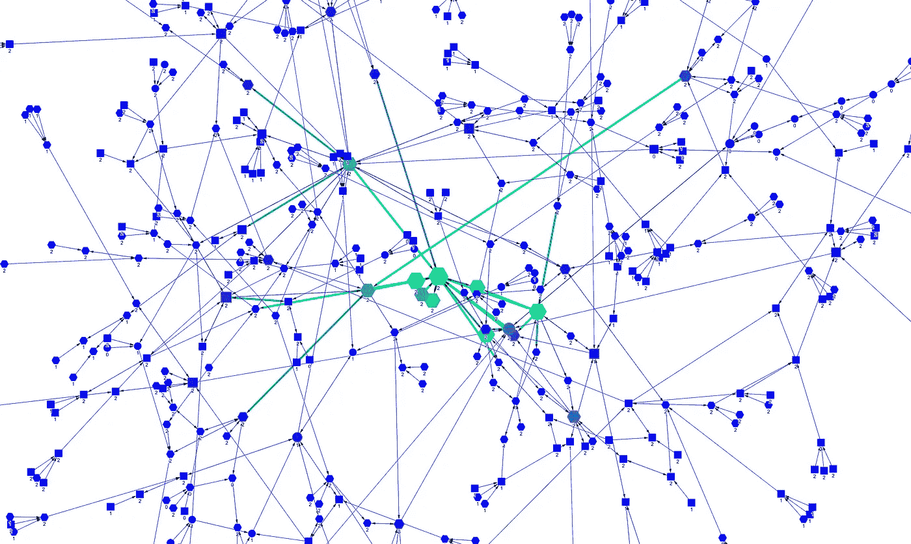
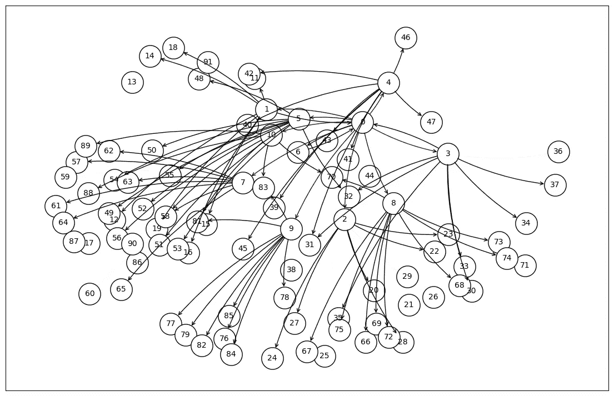
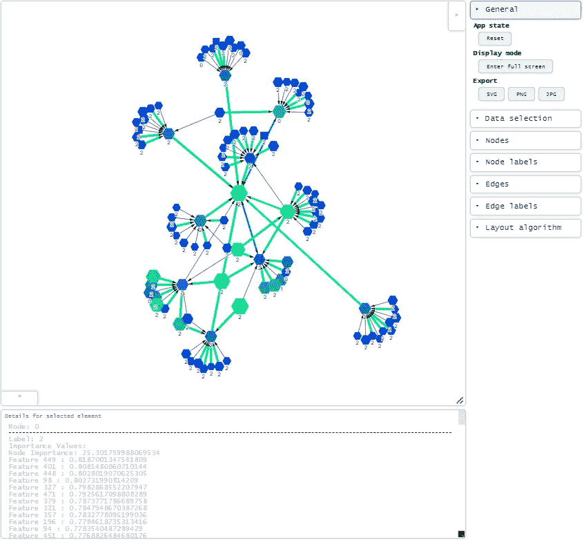

# 用于图神经网络解释的互动式可视化

> 原文：[`towardsdatascience.com/an-interactive-visualisation-for-your-graph-neural-network-explanations-1ac79d8ddd0a?source=collection_archive---------3-----------------------#2024-01-29`](https://towardsdatascience.com/an-interactive-visualisation-for-your-graph-neural-network-explanations-1ac79d8ddd0a?source=collection_archive---------3-----------------------#2024-01-29)

## 这是一个逐步指南，介绍如何在五个简单的步骤中构建一个，代码已经为你编写好……

 [Benjamin Lee](https://medium.com/@bl3e967?source=post_page---byline--1ac79d8ddd0a--------------------------------)

·发布于 [Towards Data Science](https://towardsdatascience.com/?source=post_page---byline--1ac79d8ddd0a--------------------------------) ·阅读时长 16 分钟·2024 年 1 月 29 日

--

图片来自作者。PubMed 数据集网络，由 530 个节点和 778 条边组成，使用 gravis 绘制。

# 介绍

我在日常工作中使用图神经网络，曾因为缺乏一个合适的网络可视化工具，在尝试解释和回顾新训练模型的输出时浪费了许多天。

所以这激励我写了这篇文章，在其中我提供了如何用 Python 创建一个完全互动式的网络可视化，以解释 GNN 模型，**不需要**依赖*昂贵*的第三方解决方案。

我们从像这样的静态图表开始：

图片来自作者。默认图表是使用 torch-geometric 生成的。该图表是静态的，布局不清晰，随着图表复杂化，节点/边的重要性不明显。

转到像这样的互动式和有深度的可视化：

图片来自作者。使用 gravis 生成的互动图表。节点可以拖放，点击节点可以显示其特征及其重要性。绿色表示更高的重要性，蓝色表示较低的重要性。

这种可视化方法将不同于现有的方法（例如`matplotlib`、`networkx`），因为它将允许我们：

+   拖放节点。
