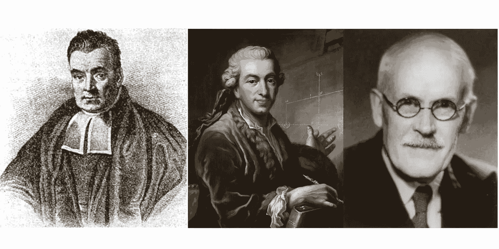

# 客观贝叶斯推断简介

> 原文：[`towardsdatascience.com/an-introduction-to-objective-bayesian-inference-cc20c1a0836e?source=collection_archive---------2-----------------------#2024-04-23`](https://towardsdatascience.com/an-introduction-to-objective-bayesian-inference-cc20c1a0836e?source=collection_archive---------2-----------------------#2024-04-23)

## 当“我们在进行任何试验之前对任何事物完全没有先验知识”时，如何计算概率（贝叶斯，1763）

 [Ryan Burn](https://medium.com/@ryan.burn?source=post_page---byline--cc20c1a0836e--------------------------------)

·发布于 [Towards Data Science](https://towardsdatascience.com/?source=post_page---byline--cc20c1a0836e--------------------------------) ·阅读时长 22 分钟·2024 年 4 月 23 日

--

从左到右，托马斯·贝叶斯、皮埃尔-西蒙·拉普拉斯和哈罗德·杰弗里斯——逆概率（或现在所称的客观贝叶斯分析）发展的关键人物。[24]

有一个常见的误解认为，贝叶斯推断主要是统计学中的主观方法，而频率主义推断则提供了客观性。

虽然贝叶斯统计学当然可以用来融入主观知识，但它也提供了强大的方法来进行客观分析。此外，客观贝叶斯推断可能比许多频率主义方法（如 P 值）有更强的客观性论证。[21]

本文简要介绍了客观贝叶斯推断。它讨论了客观贝叶斯推断的历史，从逆概率到现代的参考先验，诸如频率主义匹配覆盖等度量标准如何提供量化先验客观性的方式，以及如何构建客观先验。最后，它回顾了贝叶斯和拉普拉斯研究的几个经典问题，以展示如何使用更现代的客观贝叶斯推断方法解决这些问题。

## 目录

1.  历史

1.  先验与频率主义匹配

    - 示例 1：均值未知的正态分布

    - 示例 2：一个…
