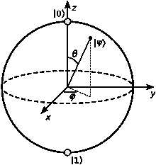
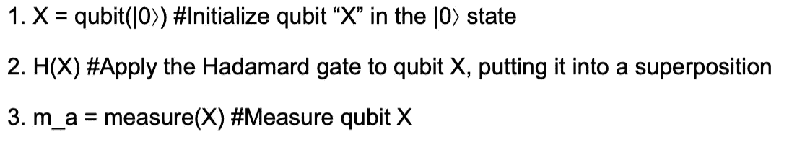
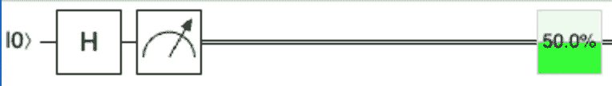
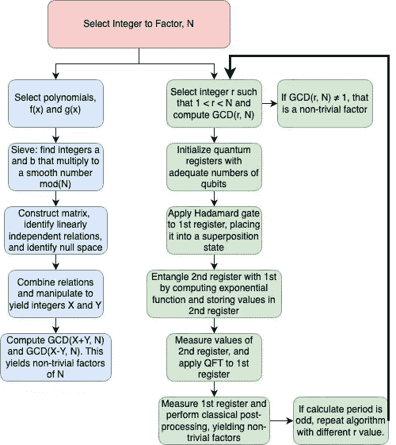
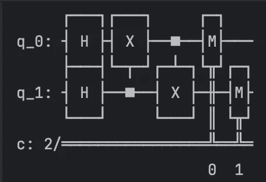

# 量子计算机与量子编码简介

> 原文：[`towardsdatascience.com/an-introduction-to-quantum-computers-and-quantum-coding-e5954f5a0415?source=collection_archive---------1-----------------------#2024-08-23`](https://towardsdatascience.com/an-introduction-to-quantum-computers-and-quantum-coding-e5954f5a0415?source=collection_archive---------1-----------------------#2024-08-23)

## 揭开量子计算、量子编程和量子算法的新世界的神秘面纱。

[](https://medium.com/@oliverwjohnson06?source=post_page---byline--e5954f5a0415--------------------------------)[](https://towardsdatascience.com/?source=post_page---byline--e5954f5a0415--------------------------------) [Oliver W. Johnson](https://medium.com/@oliverwjohnson06?source=post_page---byline--e5954f5a0415--------------------------------)

·发表于 [Towards Data Science](https://towardsdatascience.com/?source=post_page---byline--e5954f5a0415--------------------------------) ·阅读时间 15 分钟·2024 年 8 月 23 日

--


图片来自 [Manuel](https://unsplash.com/@manueljota?utm_source=medium&utm_medium=referral) 在 [Unsplash](https://unsplash.com/?utm_source=medium&utm_medium=referral) 上

## 前言：

这是我为我的一门物理课程所写内容的改编版，因此假设读者具备一定的数学和科学知识。文章中提到的主题包括一些线性代数、叠加原理、基本算法概念，以及在讨论算法时涉及的一些模运算。然而，由于你正在阅读一篇关于量子计算的文章，可能足够聪明，能够查阅并理解文中提到的所有概念。此外，所有的来源都有引用，你可以深入探索这些资源以进行更深的学习。还有，文中使用的所有图像和图表都是我自己生成的，使用了像 Microsoft Word、PyCharm 和 [diagrams.net](https://www.drawio.com/) 这样的工具，除非另有说明。

## 为什么这很重要？

在你决定花时间阅读这篇内容前，你可能会想知道，尽管你从未接触过量子计算机，这对你有什么意义。实际上，突破性进展时时发生，量子计算在不同的计算领域中具有现实意义，尤其是在机器学习方面。首先，经典算法的量子类比有可能更加高效。

一个例子是量子支持向量机（Quantum Support Vector Machine）。值得注意的是，经典支持向量机（SVM）通常使用[核技巧](https://en.wikipedia.org/wiki/Kernel_method)将数据转换到更高维的空间，从而找到分隔超平面。然而，量子支持向量机则具有显著的优势，因为它们能够自然地在指数级更高维的空间中表示数据，而不会遭遇经典计算机所面临的计算负担。这使得量子支持向量机能够更高效地处理更复杂的数据集。

另一个例子是在神经网络训练领域。量子计算的基本单元——量子比特，可以与其他量子比特纠缠，产生经典系统无法复制的关联。虽然纠缠为量子神经网络中相关的更新提供了可能性，但需要注意的是，这一概念仍在研究之中。

**第一部分：量子计算简介**

量子计算机的运作方式与经典计算机截然不同，利用量子特性和现象大幅提升计算能力。从高层次来看，有几个量子计算的基本原则将其与经典计算区分开：量子比特与经典比特，量子与经典逻辑门，量子现象的存在，以及量子计算所提供的增强计算能力所带来的机遇。

量子计算的核心是量子比特（qubit），它作为量子计算机中的基本计算单元，取代了经典计算机中的比特。经典比特只能独占地处于 0 或 1 的状态，而量子比特则可以处于 0 和 1 状态的叠加态（Microsoft，n.d.）。量子比特的概念非常难以理解；经典比特仅仅是电流或没有电流的状态，而量子比特则可以有许多不同的物理形式。

这些包括“自旋”量子比特，这是最直接的例子。这种类型的量子比特利用粒子（通常是电子）的自旋特性来完成计算。例如，要初始化一个自旋量子比特，可以使用量子点困住电子，然后通过与电子自旋状态相互作用的磁场来操控它（Harvey，2024）。比特和量子比特之间的计算差异是显著的，源于量子比特能够受到量子现象的影响，如 0 和 1 状态之间的叠加态，以及与其他量子比特的纠缠（Microsoft，n.d.）。

一个非常有助于可视化量子比特状态的工具是 Bloch 球；它实际上只是一个球体，北极和南极分别代表|0⟩和|1⟩，球体上的所有其他点表示北极和南极值的线性组合（微软，2024）。由于这种量子比特的表示使用了复数向量空间，因此量子比特的状态将在后续用狄拉克符号表示。量子比特叠加态的这一可视化有助于理解量子逻辑门，特别是因为它允许对正在执行的操作进行几何理解。通常，当量子比特初始化时，它处于 z 基态|0⟩状态，这与经典的 0 状态类似（Quantum-Inspire by QuTech，2024）。



Bloch 球示意图，维基百科。（无日期）[`en.wikipedia.org/wiki/Bloch_sphere`](https://en.wikipedia.org/wiki/Bloch_sphere)。（GFDL 许可证）

经典计算机和量子计算机之间的另一个关键区别是逻辑门：经典计算机使用与、或、非等逻辑门来执行基本逻辑操作，而量子计算机使用量子逻辑门，如 X 门、哈达玛门、托福利门和 CNOT 门（维基百科，2024）。这些量子门用于对单个量子比特或少量量子比特执行逻辑操作，并可以与其他量子门结合，进行更复杂的操作和处理。

1.  首先，X 门非常类似于经典的非门：它会反转量子比特的相位——如果量子比特处于|0⟩状态，它会反转为|1⟩状态，反之亦然。

1.  接下来，哈达玛门用于将处于|0⟩状态的量子比特置于|1⟩和|0⟩之间的均等叠加态。第三，托福利门是一个多量子比特门的例子。

1.  托福利门操作三个量子比特，其中两个是“控制”量子比特，一个是“目标”量子比特。在托福利门中，只有当两个控制量子比特处于|1⟩状态时，目标量子比特才会被反转（Roy & Chakrabarti，2024）。

1.  最后，CNOT 门是量子计算中非常常见的一个门，我们稍后将讨论它的一个用例。CNOT 门也是一个多量子比特门，它有一个目标量子比特和一个控制量子比特；当控制量子比特处于|1⟩状态时，它会反转目标量子比特的相位。

这些只是许多有趣的量子逻辑门中的一部分，值得注意的是，与经典逻辑门不同，量子逻辑门不一定有一个物理“门”供量子比特通过，而是这些操作在量子比特上执行，并且根据许多因素的不同，这些操作可以采取不同的形式。

经典计算和量子计算之间的第三个主要区别是量子现象的存在，如叠加、超导、纠缠和干涉。这些特性根据执行量子计算的方法的不同而以不同的方式被使用（Microsoft Azure，2024）。另一个存在的特性是量子退相干，它对有用或广泛量子计算的发展构成了严重问题。量子退相干是指处于叠加态的粒子与环境相互作用并与环境纠缠，最终干扰计算结果（Brandt，1999）。

量子计算机的计算能力非常强大：以一个用于寻找整数素因子的算法为例。在经典计算中，领先的素因数分解算法是广义数域筛法（Wikipedia，2024）。该程序以准多项式时间复杂度运行，显示了分解**非常**大数的困难。与领先的量子算法——Shor 算法相比，后者以对数空间复杂度和多对数时间复杂度运行，虽然这也是一个复杂的表达式，但归结为它显著更高效（Li 等，2022）。显然，这只是一个例子，但它证明了量子计算的强大——将一个以指数时间运行的程序转变为一个以对数时间运行的程序，实在是令人惊叹。

## **第二部分：量子编程：语言、编译器与算法**

尽管它们的硬件与经典计算机根本不同，但量子计算机的编程语言通常与经典语言的语法相似。包括 QCL、Qiskit 和 Q#，它们分别基于 C、Python 和 C#/F#的语法。此外，它们的编译器分别是用 C++、Python 和 C++、C#构建的。（IonQ，2024）。因此，经典语言和量子语言在语法上可能非常相似——主要的区别来自程序的内容，以及量子算法的结构方式。

在研究不同的语言、它们的语法以及它们与所基于的经典语言的比较之前，理解量子程序的内容及其原因非常重要——无论语法多么相似，经典程序与量子程序之间始终存在一条无法逾越的鸿沟。

这源于量子计算机的机制——正如之前讨论的那样，量子计算是基于将量子比特保持在叠加态，并对其应用不同的“门”——实质上是沿着其表示的布洛赫球进行变换。简而言之，不同于经典计算机，你编写一个程序，它会利用一个预制的电路来执行计算，量子编程则是实际对电路进行编码的过程。让我们通过一些伪代码和其相关的量子电路来更好地理解这一点。也许最简单的量子程序/电路，以下程序只是初始化一个量子比特，应用一个哈达玛门将其置于叠加态，然后测量该量子比特的状态。



图片由作者提供。

本程序的相关量子电路为：



“H”表示哈达玛门，测量符号表示正在进行测量。图片由作者提供。

测量符号后的双线表示量子比特不再处于叠加态，而是处于两种离散状态之一（0 或 1），因为其波函数在测量过程中已坍缩。

为了更好地了解不同量子语言的语法，我们来看一下三种前面提到的语言中的程序，这些程序都实现相同的功能。这三种程序都是用来创建贝尔态的，即两个量子比特的纠缠态。对这两个量子比特施加的门（操作）是：对第一个量子比特应用哈达玛门（0），然后对第二个量子比特应用哈达玛门（1），第一个量子比特作为控制位。CNOT 门的功能实际上就是将两个量子比特纠缠起来（Rioux, 2023）。

```py
#Qiskit (Python Basd)
#Create a quantum circuit with two qubits
qc = QuantumCircuit(2)

#Apply a Hadamard gate on the first qubit
qc.h(0)

#Apply a CNOT gate with the first qubit as control and the second qubit as target
qc.cx(0, 1)
```

```py
//Q# (C#/F# based)
namespace BellState{
  operation PrepareBellState() : Unit{
    using (qubits = Qubit[2]) {
      //Apply a Hadamard gate on the first Qubit
      H(qubits[0]);
      //Apply a CNOT gate with the first qubit as control and the second qbit as target
      CNOT(qubits[0], qubits[1]);
    }
  }
}
```

```py
//QCL (C based)
init {
  qubits q[2]
  //Apply a Hadamard gate on the first qubit
  H(q[0]);
  //Apply a CNOT gate with the first qubit as control and the second as target
  CNOT(q[0], q[1]);
} 
```

毋庸置疑，量子程序在语法上与它们所基于的语言非常相似——例如，Python 程序使用了几个内置方法，并没有其他太多的内容，而基于 C# 的程序则充满了花括号。回顾一些量子语言的语法有助于理解量子程序的外观，但实际情况是，所使用的硬件差异如此之大，以至于量子程序中的代码对经典计算机而言是无用的，反之亦然。因此，分析两个目的相同的算法，一个是经典算法，一个是量子算法，并对每个步骤进行剖析，分析它们是如何实现结果的，才会更加有趣。

回想一下第一部分中呈现的例子（GNFS 和 Shor 算法），我们查看了两种质因数分解算法的时间复杂度。由于这两种算法都相当抽象和复杂，可能比起检查它们的伪代码，以段落格式理解它们各自的理论会更加容易。

经典算法，广义数域筛法（GNFS），可以总结为五个主要算法步骤（Case, n.d.）。在整个解释中，“N”指的是待因式分解的数字。

1.  第一步是多项式选择：这一阶段涉及选择两个多项式，使它们在某些点上模 N 计算时相乘得到平滑数。

1.  下一步是“筛选”步骤：目标是找到一组整数（a，b），使得 𝑓(𝑎)⋅𝑔(𝑏) ≡ ℎ²(mod N)，其中 *h* 是一个平滑数，并存储所有的值（a，b 和 h）。

1.  第三步是矩阵步骤：从筛选步骤中找到的关系构建一个大型矩阵 A。

1.  接下来使用高斯消元法将 A 化简为更简单的形式，同时保留其属性。这个过程将识别出一组线性无关的关系。

1.  使用线性代数方法，如 Lanczos 算法，找到矩阵的零空间——这将提供与关系之间的依赖性相关的向量。

1.  将之前找到的关系结合起来，会在模 N 中产生平方，经过进一步的数学操作后得到两个整数 X 和 Y。

1.  这两个整数用于通过计算 X — Y 和 X + Y 与 N 的最大公约数（GCD）来找到 N 的非平凡因子（Case, n.d.）。该方法的复杂度为准多项式，虽然它在子多项式时间内运行，但比量子方法 Shor 算法要慢得多。

使用 Shor 算法计算整数 N 的质因数与使用 GNFS 完全不同。Shor 算法可以分解为几个主要步骤。

1.  第一步使用经典计算：选择一个随机整数 r，满足 1 < r < N，计算它们的最大公约数，如果不等于 1，则它是 N 的非平凡因子。

1.  下一步是准备所需的量子比特——我们使用两个量子寄存器来实现，它们的功能类似于经典寄存器。在第一个寄存器中，有足够的量子比特来表示从 0 到 q–1 的整数，其中 q 是至少 N² 的 2 的幂。第二个寄存器有足够的量子比特来表示从 0 到 N–1 的整数。

1.  下一步与经典计算有很大不同：为了将整个第一个寄存器放入叠加态，应用 Hadamard 变换到每一个量子比特。

1.  接下来使用量子电路计算函数 *f*(x) = r^x mod(N)，并将结果存储在第二个寄存器中；这将纠缠第一个和第二个寄存器。

1.  接下来，测量第二个寄存器——这将使其坍缩成一个状态 |k⟩（其中 k = r^x mod(N)），从而将第一个寄存器保持在一个值 x 的叠加态中，这些值映射到 |k⟩。现在，函数 f(x)=r^x mod(N) 的周期可以表示为 T。

1.  算法的倒数第二步是对第一个寄存器应用量子傅里叶变换（QFT），这将在频率域中产生一系列峰值，对应于 1/T 的值。

1.  量子计算的最后一步是测量第一个寄存器——结果将是一个整数 B，使得 B = q/T，回想一下 q 是我们定义第一个寄存器时的值。完成量子计算后，接下来进入经典后处理步骤，以获得最终结果。

后处理涉及操纵测量结果 B 以得到周期 T。如果 T 是偶数，计算 N 与 r^(T/2) + 1 和 r^(T/2) - 1 的最大公约数（GCD），这将产生 N 的非平凡因子。如果 T 是奇数，使用不同的 r 值重复算法。该程序的多对数时间复杂度非常高效，尤其是与 GNFS 算法相比（Pavlidis & Gizopoulos，2022）。

这里是两种算法流程的视觉表示，以帮助理解，其中红色表示开始步骤，蓝色表示 GNFS 算法，绿色表示 Shor 算法：



蓝色步骤对应 GNFS，绿色步骤对应 Shor 算法。图片来自作者。

Shor 算法比 GNFS 运行得更快的原因在于其使用了根本不同的计算概念：Shor 算法利用量子力学来实现多项式时间复杂度。这种加速主要得益于量子并行性（同时执行多个量子操作的能力）和量子傅里叶变换的高效执行，这在经典计算中是无法实现的。通过利用叠加态和纠缠，Shor 算法将因式分解问题转化为周期寻找问题，解决速度远远超过经典方法（Brandt，1999）。

显然，两个算法都非常复杂，但它们作为一个极好的例子，因为大整数因式分解问题是量子计算机比经典计算机要快得多的任务。我们可以分析量子代码的一个更简单的例子，就是量子版的剪刀石头布（或者如果更容易理解，可以是抛硬币）。两个玩家各自初始化一个量子比特（各一个）为|0⟩状态，并施加哈达玛门，这将其置于|0⟩和|1⟩的等概率叠加态。最后，两个量子比特被测量——如果两个量子比特都坍缩到|0⟩或|1⟩状态，则为平局。否则，坍缩到|0⟩状态的玩家输，而坍缩到|1⟩状态的玩家赢。让我们编写代码来运行这个程序，使用 Qiskit：

```py
qc = QuantumCircuit(2, 2)  # initialize a quantum circuit with 2 qubits and 2 classical bits

qc.h(0)  # apply Hadamrd gate to qubit 0, this is Bob's qubit
qc.h(1)  # apply Hadamard gate to qubit 1, this is Alice's qubit

qc.measure(0, 0) # measure Bob's qubit and map it to classical bit 0
qc.measure(1, 1) # measure Alice's qubit and map it to classical bit 1

print(qc) # prints the quantum circuit accociated with this program
```

这段代码的输出只是与程序相关的量子电路，因为它实际上并没有在量子计算机上运行电路。然而，这就是定义一个非常基本量子电路时使用的一般格式——分配一定数量的量子比特和经典比特，然后按顺序列出要对每个量子比特执行的操作。该代码的输出只是该电路的视觉表示：



带有“H”的框表示 Hadamard 门，带有“X”的框表示 CNOT 门，带有“M”的框表示正在进行的测量。图片由作者提供。

在我们能够在量子计算机上运行这个程序之前，有几个步骤需要完成。最重要的步骤是优化电路；并非所有的量子计算机都能以相同的方式在量子比特上操作特定的门，也并非所有量子计算机的量子比特之间都有相同的连接性。我们需要将这个电路优化步骤添加到代码中，以便让它准备好在实际的量子计算机上运行。为此，我们使用以下代码，它定义了我们通过 IBM API 密钥访问 IBM 量子后台的方式，然后对电路进行优化，并打印优化后的电路。

```py
print(qc) # prints the quantum circuit accociated with this program

service = QiskitRuntimeService(channel="ibm_quantum", token="your_token")

backend = service.least_busy(simulator=False, operational=True)

pm = generate_preset_pass_manager(backend=backend, optimization_level=1)

isa_circuit = pm.run(qc)

print(isa_circuit)
```

该程序的输出并不那么重要，因为它只是同一电路的更复杂版本，但它生成了一个为 IBM 量子计算机优化的电路，尽管看起来差异很大且更复杂，但它的功能与之前的电路相同。

总结来说，尽管量子编程的主题因其多种语言和对比算法，以及理解所需的数学、物理和计算背景，可能会让人感到困难，但如果分解得当，它其实并不那么难。通过渐进学习，理解量子计算是完全可实现的。此外，量子计算在许多 STEM 领域中具有令人着迷的方面——数论、线性代数、微积分和离散数学都应用于量子算法的理论方面；工程学、物理学、计算机科学和逻辑则都应用于量子算法的实际设计。不过，越是学习量子计算这一迷人的领域，你可能越会发现自己和理查德·费曼的名言产生共鸣：“我足够聪明，知道自己有多笨。”（Goodreads, 2024）

## **参考文献**

Adedoyin, A., & 等人 (2022 年 1 月 8 日). *初学者的量子算法实现*. ACM 数字图书馆. 2024 年 5 月 27 日取自 [`dl.acm.org/doi/10.1145/3517340#d1e3003`](https://dl.acm.org/doi/10.1145/3517340#d1e3003)

Brandt, H. E. (1999 年 11 月). *量子比特设备与量子退相干问题*. Science Direct. 2024 年 5 月 20 日取自 [`www.sciencedirect.com/science/article/pii/S0079672799000038`](https://www.sciencedirect.com/science/article/pii/S0079672799000038)

Brubaker, B. (2023 年 10 月 17 日). *三十年后，量子因式分解的速度提升*. Quanta 杂志. 2024 年 5 月 27 日取自 [`www.quantamagazine.org/thirty-years-later-a-speed-boost-for-quantum-factoring-20231017/`](https://www.quantamagazine.org/thirty-years-later-a-speed-boost-for-quantum-factoring-20231017/)

Case, M. (无日期). *初学者的通用数域筛法指南*. 马里兰大学计算机科学系. 2024 年 5 月 26 日取自 [`www.cs.umd.edu/~gasarch/TOPICS/factoring/NFSmadeeasy.pdf`](https://www.cs.umd.edu/~gasarch/TOPICS/factoring/NFSmadeeasy.pdf)

Goodreads. (2024 年). *理查德·费曼的名言（《你一定是在开玩笑，费曼先生！》的作者）*. Goodreads. 2024 年 5 月 27 日取自 [`www.goodreads.com/author/quotes/1429989.Richard_P_Feynman`](https://www.goodreads.com/author/quotes/1429989.Richard_P_Feynman)

Harvey, S. P. (2024 年 3 月 5 日). *量子点/自旋量子比特*. 牛津大学出版社和美国物理学会. 2024 年 5 月 19 日取自 [`oxfordre.com/physics/display/10.1093/acrefore/9780190871994.001.0001/acrefore-9780190871994-e-83`](https://oxfordre.com/physics/display/10.1093/acrefore/9780190871994.001.0001/acrefore-9780190871994-e-83)

IBM. (2024 年). *IBM Qiskit 文档*. IBM 量子文档. 2024 年 5 月 26 日取自 [`docs.quantum.ibm.com/`](https://docs.quantum.ibm.com/)

IonQ. (2024 年 3 月 14 日). *七种量子语言中的“你好，多重世界”*. IonQ. 2024 年 5 月 26 日取自 [`ionq.com/docs/hello-many-worlds-seven-quantum-languages`](https://ionq.com/docs/hello-many-worlds-seven-quantum-languages)

Li, J., Peng, X., Du, J., & Suter, D. (2022 年 1 月 8 日). *一种高效的精确量子算法用于整数平方自由分解问题*. 《自然》. 2024 年 5 月 26 日取自 [`www.nature.com/articles/srep00260`](https://www.nature.com/articles/srep00260)

Microsoft. (无日期). *什么是量子比特?* Microsoft Azure. 2024 年 5 月 19 日取自 [`azure.microsoft.com/en-us/resources/cloud-computing-dictionary/what-is-a-qubit`](https://azure.microsoft.com/en-us/resources/cloud-computing-dictionary/what-is-a-qubit)

Microsoft. (2024 年). *Azure 量子 | 单量子比特门*. Azure 量子. 2024 年 5 月 20 日取自 [`quantum.microsoft.com/en-us/explore/concepts/single-qubit-gates`](https://quantum.microsoft.com/en-us/explore/concepts/single-qubit-gates)

Microsoft Azure. (2024 年 1 月 12 日). *理解量子计算——Azure 量子*. Microsoft Learn. 2024 年 5 月 20 日取自 [`learn.microsoft.com/en-us/azure/quantum/overview-understanding-quantum-computing`](https://learn.microsoft.com/en-us/azure/quantum/overview-understanding-quantum-computing)

Pavlidis, A., & Gizopoulos, D. (2022 年 7 月 19 日). *量子密码学——Shor 算法解释*. Classiq. 2024 年 5 月 27 日取自 [`www.classiq.io/insights/shors-algorithm-explained`](https://www.classiq.io/insights/shors-algorithm-explained)

Quantum-Inspire by QuTech. (2024 年). *量子比特基态*. Quantum Inspire. 2024 年 5 月 20 日取自 [`www.quantum-inspire.com/kbase/qubit-basis-states/`](https://www.quantum-inspire.com/kbase/qubit-basis-states/)

Rioux, F. (2023 年 1 月 10 日). *8.53: 贝尔态练习*。Chemistry LibreTexts. 2024 年 5 月 26 日检索自 [`chem.libretexts.org/Bookshelves/Physical_and_Theoretical_Chemistry_Textbook_Maps/Quantum_Tutorials_(Rioux)/08%3A_Quantum_Teleportation/8.53%3A_Bell_State_Exercises`](https://chem.libretexts.org/Bookshelves/Physical_and_Theoretical_Chemistry_Textbook_Maps/Quantum_Tutorials_(Rioux)/08%3A_Quantum_Teleportation/8.53%3A_Bell_State_Exercises)

Roy, S. G., & Chakrabarti, A. (2024 年 3 月 5 日). *托福利门*。Science Direct. 2024 年 5 月 20 日检索自 [`www.sciencedirect.com/topics/computer-science/toffoli-gate`](https://www.sciencedirect.com/topics/computer-science/toffoli-gate)

Wikipedia. (2024 年). *一般数域筛法*。Wikipedia. 2024 年 5 月 24 日检索自 [`en.wikipedia.org/wiki/General_number_field_sieve`](https://en.wikipedia.org/wiki/General_number_field_sieve)

Wikipedia. (2024 年 5 月 15 日). *量子逻辑门*。Wikipedia. 2024 年 5 月 19 日检索自 [`en.wikipedia.org/wiki/Quantum_logic_gate`](https://en.wikipedia.org/wiki/Quantum_logic_gate)

Wikipedia. (无日期). *布洛赫球*。Wikipedia. 2024 年 8 月 20 日检索自 [`en.wikipedia.org/wiki/Bloch_sphere`](https://en.wikipedia.org/wiki/Bloch_sphere)
