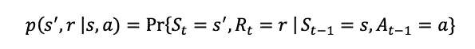
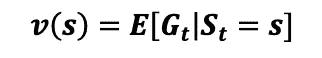
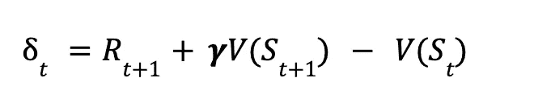

# 强化学习简介

> 原文：[`towardsdatascience.com/an-introduction-to-reinforcement-learning-995737d3f1d?source=collection_archive---------2-----------------------#2024-05-27`](https://towardsdatascience.com/an-introduction-to-reinforcement-learning-995737d3f1d?source=collection_archive---------2-----------------------#2024-05-27)

## *深入探讨强化学习的基础知识，包括基于模型的方法和无模型的方法*

 [Angjelin Hila](https://angjelinhila.medium.com/?source=post_page---byline--995737d3f1d--------------------------------)

·发布于 [Towards Data Science](https://towardsdatascience.com/?source=post_page---byline--995737d3f1d--------------------------------) ·阅读时间：34 分钟·2024 年 5 月 27 日

--

使用创作共享许可，来源：[`elifesciences.org/digests/57443/reconstructing-the-brain-of-fruit-flies#copyright`](https://elifesciences.org/digests/57443/reconstructing-the-brain-of-fruit-flies#copyright)

## 什么是强化学习？

通过模仿生物体的方式来构建智能系统是一条可行的道路。

生物体从环境中转化信息，处理这些信息（这正是认知科学研究的内容），并输出有利于生存的行为。这些行为在最基本的层面上包括觅食、繁殖和避免伤害。它们还包括广泛的人类活动，如游戏、创造力、问题解决、设计与工程、社交、浪漫以及智力生活。

那么，我们如何设计一个能够完成以上所有任务的系统呢？

如果我们要将一个简单的生物体建模为某种环境的函数，我们需要一个代理模型、一个环境模型，以及某个函数，用以将代理从当前状态移动到期望状态。

在心理学中，有两个主要的学派试图解释人类行为：*行为主义*和*认知科学*。行为主义者将行为理解为学习机制的功能，学习可以归因于输出行为。而认知科学则通过信息处理方法建模代理与环境的互动。在这种方法中，代理通过感官首先将外部刺激转化为内部表征，随后将其进行层层转化和整合，一直到思维和推理能力，再返回某种行为输出。在前一种方法中，学习主要被理解为环境条件作用的功能，而在后一种方法中，心理表征被认为在预测行为时不可或缺。强化学习大多借鉴了行为主义方法，其中环境奖励决定了代理在搜索空间中的演化。

[操作性条件作用](https://en.wikipedia.org/wiki/Operant_conditioning)，是 20 世纪 50 至 60 年代盛行的行为主义心理学流派，定义学习为环境中奖励和惩罚机制的产物。操作性条件作用的前身包括爱德华·桑代克提出的[效果法则](https://en.wikipedia.org/wiki/Law_of_effect)，该法则认为产生满足效果的行为更可能重复，而产生不满足效果的行为则不太可能重复。B.F. 斯金纳通过强化和惩罚来操作化效果。强化通过增加行为重复的可能性来起作用，无论是接近还是去除抑制因素。接近称为正向强化，而避免的反转称为负向强化。正向强化的例子包括在一项运动中变得擅长并频繁获胜。负向强化的例子包括去除抑制性刺激，例如在比赛中挑衅你的学校恶霸。操作性条件作用预测你更可能重复获得最大奖励的行为。另一方面，惩罚包括通过增加负面后果（正向惩罚）或去除与行为相关的奖励（负向惩罚）来控制行为效果。当犯规导致被逐出比赛时，它说明了正向惩罚。当你表现不佳并失去比赛时，它说明了负向惩罚，这可能导致未来避免参与比赛。

人类社会中的“生活游戏”充满了*二级强化物*或社会构建的奖励与惩罚，这些奖励与惩罚塑造行为。这些包括金钱、成绩、大学录取标准、赢输游戏的规则，它们建立在接近生物需求的自然强化物之上，如食物、繁殖和社会认同。

记忆在学习中扮演着重要角色，因为它能够保持先前的经验。证据表明，记忆更多地编码奖励和惩罚，而不是经验的内容（Tyng et al., 2017）。受试者更有可能对奖励性的经验产生积极回忆，因此更可能重复这些经验，而对负面的经验产生不利回忆，并可能在未来避免它们。记忆的机制复杂多样，证据表明，受试者通过回忆自己的记忆在重新塑造这些记忆方面扮演了积极角色（Spens & Burgess, 2024）。这一事实使得行为主义的图景变得更加复杂，因为受试者对经验的解读可以被回溯性地修改和重新构建，从而使得仅凭条件反射原理进行预测变得困难。此外，奖励和惩罚过于简化了积极和消极情感的景观，而这种情感景观实际上是一个复杂的领域，充满了低谷和波动、嵌套依赖，更适合被建模为一个连续的光谱，而非一个二元空间。

尽管存在这些复杂性，强化学习包括一系列数学技术，这些技术通过调整代理、环境和奖励的行为本体来建模人工智能。正如我们下面将看到的，强化学习的某些方面源于控制理论，而控制理论的前身扩展到物理学和工程学，另一些方面则直接源自心理学和生物学。由于控制理论的对象和生物系统都是动力学系统，必须保持在远离热力学平衡的最佳范围内，因此其基本原理适用于强化学习和人工智能的更广泛目标。

动态规划主要源自控制理论，是一种数学优化方法，它使得较大的问题可以递归地分解为子问题，从而解决更大的问题。一般来说，递归指的是一个函数直接或间接地将自身作为参数传递。

在本文中，我们将主要集中讨论动态规划的元素，重点讨论离散和有限博弈。然而，动态规划表现出许多限制，这些限制部分通过强化学习的无模型方法得到解决，另一些则通过将动态规划与人工神经网络结合来解决，这种方法曾被称为*神经动态规划*。更广泛地说，强化学习和人工神经网络的结合被称为深度强化学习。这些模型结合了深度学习在强化学习技术中的优势。这些算法中最流行的是**深度 Q 网络（DQN）**，该算法由[DeepMind](https://deepmind.google/)在 2013 年提出。这个算法家族利用深度学习来逼近 Q 函数。由于函数逼近是强化学习的一个不足之处，这些算法代表了强化学习范式的一大进步。

**DQN**所解决的其他不足之处包括：在捕捉非线性动态方面提供灵活性；能够接受更广泛的维度范围，而不会因*维度灾难*而变得在计算上无法处理；以及在环境中的更强泛化能力。

神经动态规划代表了在心理学中利用认知范式的方向，以解决纯行为主义方法的不足之处。然而，值得注意的是，尽管在理解较低层次感知信息的层次结构和处理方面取得了科学进展，但将这些信息与思维和意识的构架连接起来，仍然在某种程度上科学上难以捉摸。因此，人工神经网络（ANNs）尚缺乏人类智能那种复杂的泛化能力，人类智能往往能在比 ANNs 少得多的样本下进行指数级的学习。我们将在文章的最后一部分讨论采用强化学习原则对人工通用智能（AGI）的影响。

## 决策理论与控制理论

在深入探讨动态规划和强化学习的数学元素之前，重要的是要阐明决策理论的哲学和数学分支与强化学习之间的关系。决策理论主要是理性选择理论的数学形式化，它们与强化学习的目标存在重叠，因为强化学习旨在将其模型构建成能够与复杂环境和信息领域互动的成功人工智能代理。

**决策理论**，也称为**选择理论**，是在 20 世纪随着[工具理性](https://plato.stanford.edu/entries/rationality-instrumental/)形式化的发展而产生的。具体而言，它使用概率论来量化在给定偏好下，智能体行为的发生概率。这个形式化努力的一个重要成果是[***冯·诺依曼-摩根斯坦效用理论***](https://en.wikipedia.org/wiki/Von_Neumann%E2%80%93Morgenstern_utility_theorem)。简而言之，该程序表明，智能体倾向于选择那些在可选行为中最大化效用的行动。

控制理论起源于机械和电气工程领域，旨在优化动态系统的状态和性能，使其相对于期望的参数达到最佳状态，例如保持一定的稳态温度范围。其基本机制包括一个控制器，该控制器测量期望的变量，并将其与设定点进行比较，二者的差值作为反馈用于修正。控制理论的广义框架与生物体的新陈代谢过程相似，生物体通过调节内部温度来应对外部环境的变化。控制理论与决策理论的联系显而易见：两者都依赖于来自环境的反馈，以维持或推动系统状态向某种最优状态发展。

在数学上，控制和决策问题的子集可以归结为通过动态规划求解的优化问题。动态规划通过将这些问题分解为更小的子问题，并计算价值函数，从而解决一般的随机最优控制问题（受到[***维度灾难***](https://en.wikipedia.org/wiki/Curse_of_dimensionality)的困扰——这意味着随着状态变量数量的增加，计算需求呈指数级增长）。在我们演示强化学习的基本原理时，将深入探讨动态规划的核心：智能体的状态函数与价值函数之间的递归关系。

强化学习与决策理论在定义最大化奖励或效用的程序时有重叠。然而，尽管效用在决策理论中被明确定义，该理论旨在模拟经济行为，而在强化学习中，效用被累积奖励所取代。相对于不同任务目标，可以应用不同的策略来最大化累积奖励，而累积奖励的最大化取决于探索与开发之间的反向关系，这一关系被称为*探索-开发困境*。

让我们首先概述强化学习模型背后的本体论。

## 状态、行动与奖励

强化学习利用决策理论的理论框架，构建由代理、环境和动态演化规则组成的模型。演化规则允许代理在其环境内追求奖励，也称为*观察*。

代理被定义为从环境到决策的输出。我们称某个特定的决策为动作。当前网络状态到动作的映射称为策略。策略指导动作，从状态到结果的映射。

因此，从形式上讲，策略是一个将*状态*映射到*动作*的函数。它可以通过给定当前状态的条件概率来表示，希腊字母𝛑代表策略：

转移动态定义了给定输入奖励时下一个状态的概率分布，涵盖所有可能的状态和奖励值：

上述公式定义了下一个状态和奖励对的概率，等于给定当前状态***s***和动作***a***时，下一个状态***s'***和奖励***r***的条件概率。

一个动作通过获得奖励来改变环境。奖励反过来会改变**代理状态**或**观察**。奖励输入基于*策略*决定未来的动作输出。

通常，策略有两种类型：

> ***确定性：*** 给定当前状态/环境，代理只能采取一个唯一的动作。
> 
> ***随机性：*** 给定当前状态/环境，代理可以采取多种不同的动作。

奖励通常被形式化为一个标量值 x。

给定一个特定的奖励，代理面临一个优化困境：*代理应该最大化短期奖励，还是在其整个生命历史中最大化累计奖励*？

这被称为[**探索-利用困境**](https://en.wikipedia.org/wiki/Exploration-exploitation_dilemma)。换句话说，转移函数应当旨在优化探索环境与利用已积累知识之间的权衡，从而获得最大的奖励。

解决探索-利用困境的最优方案取决于我们希望模型学习的任务类型，这些任务的范围从有限到未定义（连续或离散的无限）。例如，国际象棋可以被形式化为一个阶段性任务，因为它有一个有限的配置空间，并且具有预定义的三种可能结果的终局：胜利、失败、平局。这意味着，在当前状态下，最优的后继状态可以通过确定性转移动态计算出来，其中每个状态对应一个唯一的最优动作。

然而，大多数任务没有有限的配置空间，也没有预定义的终止状态。我们将这些任务归类为**连续任务**，并通过**模型无关**的方法进行优化。在模型无关的方法中，代替计算转移动态，模型从环境中采样以计算最优的后继状态。换句话说，模型不是通过预测规划行动，而是通过试错法来学习环境。

一般来说，模型无关的强化学习有两种方法：[**蒙特卡罗方法**](https://en.wikipedia.org/wiki/Monte_Carlo_method)和[**时序差分学习**](https://en.wikipedia.org/wiki/Temporal_difference_learning)。由于足够样本的平均值会收敛到期望值，模型无关的方法通过样本均值来估计期望值。蒙特卡罗方法通过估计足够大样本的状态-动作对的预期累积回报来计算价值函数。一些蒙特卡罗方法只在任务结束时评估价值函数，适用于阶段性任务。对于连续任务，阶段的定义有所不同，可以由设计者设置，例如基于时间间隔来定义。

与蒙特卡罗搜索不同，时序差分学习则通过利用时间步之间的差异来逐步估计价值函数。由于时序差分方法的增量式特点，它们在与实际期望值的偏差上，比依赖于样本均值的蒙特卡罗方法具有更低的方差。

***总结*：**智能体通过当前状态和动作空间对到状态空间的映射来导航其环境。转移动态计算所有可能的映射，适用于具有预定义终止状态的有限配置空间。没有预定义终止状态和有限状态空间时，模型无关的方法则通过持续采样环境来寻找最佳策略。

动态规划通过所有状态-动作对计算状态转移概率和预期奖励。要理解这一过程是如何工作的，我们需要理解马尔可夫过程。

接下来我们将学习使得智能体能够计算最优后继状态的数学模型。正如我们之前讨论的，最优性问题转化为探索-开发困境，这一困境随着我们尝试建模的任务类型而变化。深入了解奖励结构将帮助我们更好地理解这一点。

## 奖励量化

在强化学习中，我们通过一个标量值来量化奖励，这个值是智能体在采取某个动作后从环境中获得的。这个奖励的值表示该动作相对于其最终目标的即时好坏。

另一方面，累计奖励或 *回报*，指的是从环境中至今累计的所有奖励之和。代理的目标不仅仅是优化即时奖励，而是优化累计奖励。前者代表的是目光短浅的代理，追求短期利益，而后者则是目光远大的代理，寻求最大化长期收益。

由于大多数情况下我们希望代理尽早最大化奖励而不是迟些时候，因此引入折扣因子来激励当前的最大奖励而非未来的最大奖励。

我们通过以下公式量化带有折扣的累计奖励 G：

这里，累计奖励 **G** 等于奖励与折扣因子 gamma 𝜸 的乘积之和，gamma 的值始终介于 0 和 1 之间：{0,1}。gamma 会随着每个时间步的增加逐渐递增，这意味着在无限时间步中，gamma 会趋近于零。

当 gamma 趋近于 0 时，它激励短期收益，而当 gamma 趋近于 1 时，它激励长期收益，因为在无限次迭代中，奖励总和将趋近于无穷大。

因为大多数任务是有时间限制的，当 gamma 小于 1 时，折扣因子会对奖励施加上限。

下述是带有折扣因子的累计奖励的简化公式，其中 G 代表期望奖励的总和 *R*，该奖励乘以折扣因子 gamma。因此，累计奖励是奖励和折扣因子的总和：

## 马尔可夫决策过程 (MDP)

到目前为止，我们讨论了策略的概率定义，即从一个状态到一个动作的映射，转移动态是指在给定奖励的情况下从一个状态转移到另一个状态的概率，以及奖励计算的公式。

现在，我们将稍微退后一步，提供一些补充理论，定义这些概率转移链。我们将从一种被称为 **马尔可夫过程** 的东西开始。马尔可夫过程是满足 **马尔可夫性质** 的随机过程。随机过程是指随机变化的过程。马尔可夫性质表明，*对于每个状态，后继状态仅由当前状态决定*。

由于先前的状态不会影响未来的状态，满足马尔可夫性质的过程被称为无记忆过程。想象一下，每天你从家里出发去上班，然后再回到家里，这是一组固定的目的地。换句话说，我们有一个有始有终的循环过程。现在再进一步想象，你从一个目的地到下一个目的地的决策仅依赖于你当前的目的地，而不考虑你之前的目的地历史。最初，每个连接的目的地都有相等的概率分布。例如，如果你离开家时可以选择开车或乘坐地铁，我们会给这两种可能的未来状态分别赋予初始概率 0.5。在所有可能的路线迭代中，这些概率可能会稳定为某种频率分布，其中某些路线相较其他路线会偏向于发生。（这种类型的概率叫做经验概率，因为它通过相对于有限次数测试的可能事件的结果平均来计算）该分布的平衡状态将是马尔可夫链或过程。

现在你可能在想：如何定义事件和状态？难道这个世界不会因为过于复杂而无法讨论固定的可能状态和稳定的概率分布吗？

没错，但由于我们正在追求一个关于代理与环境的数学形式化，因此我们需要区分我们要建模的任务或环境的类型。为此，我们需要明确*时间步*和*状态空间*的表示，即所有可能状态的分布。下方的方阵定义了关于**状态空间**和**时间**轴的马尔可夫链：

状态空间可以定义为可数/有限或连续，其中有限状态空间通过组合数学描述系统的所有可能配置，而连续状态空间通过连续函数描述所有可能的配置。

有限和可数无限空间将整数或有理数作为其可测空间，而连续空间则取实数。

同样，时间轴也可以定义为离散或连续的。

离散时间过程将相变视为不连续的，但可以在可数或不可数状态空间上建模，其中不可数是指实数的无限小数扩展。实际上，你的计算机就是这样计算时间的——它以离散步骤来进行时间计算。步骤之间的间隔因架构而异，但一个周期通常被衡量为改变寄存器状态所需的时间步长。

连续时间链将相变视为连续的，并且可以在可数或不可数状态空间上建模。

马尔可夫过程一词通常用于描述连续时间过程，而马尔可夫链一词描述的是其中的一个子集：离散时间的随机控制过程。在本文的其余部分，我们将重点讨论*离散时间，有限状态空间*。

到目前为止，我们的马尔可夫链非常简化，它们仅描述了具有固定概率的状态转移。我们还缺少两个在建模行为时至关重要的要素：***行动***和***奖励***。

引入奖励到转移概率构成了***马尔可夫奖励过程***。马尔可夫奖励过程为每个转移状态分配一个奖励（定义为正整数或负整数），从而推动系统向某个期望的状态移动。回想我们的累积奖励公式，它是期望奖励乘以某个折扣因子的总和。马尔可夫奖励过程允许我们计算状态***v(s)***的值，即给定初始状态 S，累积奖励 G 的概率（其中 G 是通过大量迭代的样本平均得到的）：

为了支撑到***马尔可夫决策过程***，我们需要引入的最后一个变量是行动。智能体首先以一组可能行动的均匀分布概率开始，然后根据当前状态和行动更新转移函数，将其映射到下一个状态和奖励。我们已经回到了之前描述的转移动态：

## 动态规划与贝尔曼最优性

这引出了动态规划的概念，该概念由贝尔曼（1957 年）提出。

理解动态规划将帮助我们理解像蒙特卡洛搜索和时间差分等近似方法，这些方法不像动态规划那样需要完全的环境知识。这些无模型的方法通过代替完美的信息来近似动态规划的确定性策略。因此，它们提供了强大的机制来近似现实世界的学习。

动态规划如何搜索并找到最优智能体状态的核心思想涉及到***状态值函数***与***行动值函数***之间的关系。这些函数是递归相关的。

让我们通过一个容易理解的例子来阐述这些概念。假设你目前处于生活中的一个次优状态，并且希望改变这种情况。进一步假设你有一个切实可行的目标或一个希望在某个现实时间范围内到达的地方。为了实现这一宏大目标（你可以在这里替换任何目标：更好的工作、建立家庭等），你需要采取一系列较小的步骤或行动，这些步骤或行动将有助于实现你想要的结果。用强化学习的语言来说，你当前的状态将被赋予一个值。根据你当前的状态和价值，你将采取行动。这些行动也将根据你整体目标和当前状态进行评估。一项好的行动将获得比不好的行动更高的评价。来自环境的反馈将决定行动的价值（这些如何确定取决于任务）。状态的评估将影响可用行动和后继状态的估值。行动的评估将递归地影响当前状态的价值。换句话说，行动和状态通过递归动态地联系在一起。

现在，在现实生活中，你的目标和实现该目标的行动步骤不能被指定为一个具有离散时间步骤和离散状态空间的确定性系统（尽管它们或许可以通过这种方式进行近似）。相反，动态规划假设一个可指定的环境，就像国际象棋游戏一样，其中时间步骤和行动空间被抽象为离散和有限的。与现实生活的重叠之处在于，一个更大的目标将通过优化有助于实现该目标的较小子目标来接近。

因此，动态规划将假设以下值：**(Ω,A,𝒫)**，其中**Ω**表示所有可能状态的总和，**A**是作为有限样本空间子集的行动事件，**P**是由某些策略函数𝝅为每个行动事件分配的概率。

现在，如果你回想一下我们的*确定性转移动态*，由于状态、行动和奖励的集合是有限的，任何特定的状态和奖励对将在给定某些先前的状态和行动对的情况下，具有发生这些值的概率。由于状态空间是离散的，这些概率被指定为随机变量的离散概率分布。我们说过，由状态、行动和奖励组成的序列是马尔可夫决策过程（MDP），它寻求在时间上最大化期望的累积奖励，其中奖励被表示为一个标量值。

*现在我们需要解决的问题是，给定我们已指定的假设，马尔可夫决策过程如何最大化累积奖励？*答案由**贝尔曼最优性方程**提供，它涉及两个函数：***状态值函数***和***行动值函数***。

## 状态值函数

状态值函数可以定义为智能体在遵循策略𝝅的情况下，所有可能的动作的概率之和，其中，对于每个动作，其值由所有可能后继状态的加权值之和决定。

简单来说，状态值函数定义了智能体从特定状态(s)开始，遵循策略𝝅时可以获得的期望累积奖励。

状态值函数

上述方程包含两个项：**a)** *智能体在状态(s)下遵循策略𝝅时，所有可能动作的概率之和*，以及**b)** *对于每个可能动作的内层求和，计算所有可能后继状态的加权值*。方括号内的项计算了每个动作的可能状态的贡献，它是即时奖励 R(s, a, s')与折扣奖励（由折扣因子𝛾计算）之和。

表达状态值函数的另一种方式是以下**:**

来源：Sutton

上述公式定义了下一个状态的值，即期望回报 E*𝝅*，它是根据时间*t*时的状态*s*来计算获得奖励*R*的条件概率。奖励 R 被计算为后继状态中期望回报的乘积和，再乘以折扣因子𝛾。

为了更好地理解这一点，可以想象一个智能体处在一个 3x3 的网格世界中，每个时间步都有四个可能的动作——*上、下、右、左*——可供选择。

状态空间，其中的值代表奖励。

我们将状态值初始化为 0，并使用贝尔曼方程来优化状态值，依据网格中奖励的分布。我们使用*(行, 列)*索引来标识网格中的每个位置。

优化前的初始化状态值。

假设策略在每个动作上均匀分布，并且折扣因子为 0.9，则初始状态(1,1)的状态值函数将按照以下方式计算：

状态(1,1)的值

每个内层求和中的常数代表根据我们希望智能体实现的某些结果，分配到网格中的奖励。内层求和表示即时奖励，加上折扣因子与下一个状态累积值的乘积。外层求和中的比率代表在给定动作数量的情况下，总概率的分布。由于有四个可能的动作，我们可以最初通过均匀分布的概率加权内层求和，使其总和等于总概率。然后，将为状态空间中的每个可能状态计算状态值，并反复迭代，直到求和收敛到稳定值。

## 动作值函数

正如我们所看到的，动作值函数嵌套在状态值函数中，作为其第二项。这意味着，动作值函数通过以下公式计算状态 *(s)* 下所有可能动作的值，作为从 *(s)* 到 *(s’)* 转移的即时奖励和在给定动作下，下一状态 *(s’)* 的期望累计奖励的总和：

换句话说，动作值函数计算在状态 *(s)* 下采取动作 *a* 的累计奖励，其中期望回报是即时状态转移的总和——用 R(s, a, s') 表示——以及下一个状态 s' 的累计奖励的折扣值——用 *𝛾∑𝝅*(a’|s’)Q(s’,a’) 表示。

另一种表达动作值函数的符号是基于给定状态和动作对 (s, a) 的期望回报 E，当遵循最优策略 *𝝅* 时：

状态值函数和动作值函数之间有关系，具体而言，状态值函数可以通过策略和动作值函数 Q(s,a) 给出。

> ***因此，每个函数都将自身作为参数，尽管计算的是后继过渡状态，如上面的公式所示。V(s) 的公式包含 V(s')，Q(s, a) 的公式包含 Q(s', a)。***
> 
> ***换句话说，它们在各自的参数中包含了彼此：状态值 V(s) 依赖于通过 Q(s,a) 计算的后继状态的值，而动作值 Q(s,a) 依赖于通过 V(s') 计算的后继状态的值。***

状态值函数的备份图。S 代表状态，*𝝅 代表策略*，黑点表示每个可用动作，箭头表示动作-奖励对，指向下一个状态 s'。来源：*[`goodboychan.github.io/reinforcement_learning/2020/06/06/05-Policy-evaluation.html`](https://goodboychan.github.io/reinforcement_learning/2020/06/06/05-Policy-evaluation.html)*

因此，动作值函数和状态值函数是递归相关的：动作-状态对的值决定了状态的值，而状态的值又决定了动作的值。

状态值函数以状态为先验，并输出一个期望值 E。动作值函数以状态和动作对为先验，用来计算奖励和期望的累计回报 E。

**贝尔曼最优方程**因此表达了状态值函数和动作值函数的递归迭代，直到它们收敛到最优值。状态值函数的贝尔曼方程如下所示：

当前状态的值被定义为任何可能行动的最大奖励，该奖励是采取动作**a**在状态(**s**)下的奖励，并且是下一个动作 s’的值与其折扣因子 gamma 的乘积。

贝尔曼方程平均了当前状态下所有可能动作的期望，并根据其发生的概率对它们进行加权。

## 无模型方法：蒙特卡洛与时序差分

上述例子描述了一个确定性模型，其中转换动态是已知的，因此可以完美计算。这是因为我们对环境有完全的了解。

然而，对于大多数任务，我们无法完全了解环境。在缺乏这些信息的情况下，我们不能精确地使用确定性的转换动态，因为我们无法求解动态规划方程。为了解决这个问题，我们可以使用借鉴统计学的技术，通过从样本中推断环境的状态。

在蒙特卡洛方法中，我们通过样本回报的平均值来逼近期望回报。随着样本数趋近于无限，平均回报将收敛于期望回报的真实值。我们通过让智能体完成一个完整的回合直至结束，然后计算价值函数来实现这一点。接着，我们采样*N*个回合，并使用均值来逼近目标状态的期望值。现在，正如你可能已经想到了，回合的定义会根据任务和模型的目的有所不同。例如，在国际象棋游戏中，我们可以将一个回合定义为完成一整局棋或者是一个任意的步骤序列。

我们可以将蒙特卡洛更新规则写成如下：

其中 V(s) n+1 表示下一个回合的值，S(s)n 表示状态的累计值，G 表示奖励的值。我们将累计奖励 G 添加到状态值中，并除以回合数或样本数。

我们可以通过代数方式重新排列蒙特卡洛更新规则为：

与蒙特卡洛方法不同，在蒙特卡洛方法中，我们仅在每一回合结束后评估价值函数，而在**时序差分**（TD）方法中，我们在每一步或增量后评估状态价值函数。由于我们一开始对环境没有任何信息，因此需要将 V(s)的初始值设置为 0 或其他值，这些值将在每个时间步之后更新。

我们通过两步计算 TD 中的状态值。首先，我们计算这一时间步的误差，然后使用更新规则来改变状态的值。误差通过以下差值公式给出：

时序差分时间步的误差公式。

其中，𝜹t 代表误差，R(t+1)是动作带来的奖励，V(S t+1)是下一个状态的估计值，V(S)是当前状态的值。TD 使用下一个状态的估计值来评估当前状态，这种方法称为**自引导（bootstrapping）**。实际上，我们从动作的奖励和折扣因子与下一个状态值的乘积中减去当前状态的值。这使得每个时间步都能立即更新当前状态的值。

通过将预期奖励与观察到的奖励之间的差异𝜹乘以𝛼（学习率），我们消除了观察与预期之间的差异：

价值函数的 TD 更新规则。

𝛼的作用决定了 TD 算法学习的程度，其中𝛼是一个实数正数。通常，𝛼会设置为[0.1，0.01，0.001]等值。较高的𝛼确保更新更加激进，而较低的𝛼确保更新更加保守。𝛼的值会影响探索与利用的权衡，较高的𝛼倾向于探索，而较低的𝛼则倾向于利用。

虽然 MC 和 TD 方法都在没有任何先验环境知识的情况下盲目进行，但时间差分法（Temporal Difference, TD）的方法优点在于它在每个时间步都进行在线更新，而蒙特卡罗方法（Monte Carlo, MC）的方法优点在于由于仅依赖采样来估计值，它的估计是无偏的。TD 方法的一个缺点是高偏差，而 MC 方法的缺点是忽视了重要的更新，从而导致较高的方差。这表明，两种学习策略之间一定存在一个最优解。

通过将单步评估策略改为 n 步评估，TD 方法可以得到优化。正如我们将要看到的，这样做可以在 TD 和 MC 之间达成一个折衷。当我们每 n 步评估一次状态值时，我们是通过估计未来的 n 步来进行评估，而不是在每一步后进行评估。

对 n 步 TD 的修改方法是 TD(𝝀)。TD(𝝀)方法使用一个叫做***资格迹（eligibility traces）***的参数来对过去发生的状态-动作对进行加权。与其估计未来的 n 步，资格迹通过多个 TD 步骤来对状态-动作对进行加权。资格迹使得过去的状态-动作对能够因其对观察到的奖励过渡作出贡献而获得奖励。资格迹表示为与每个状态-动作对相关的向量或矩阵。时间步的资格迹通过递归方式计算如下：

其中，lambda 𝝀 参数控制自举的程度。当 𝝀 = 1 时，消除了自举，更新规则退化为蒙特卡罗方法。当 𝝀 = 0 时，它退化为带有自举的 TD 时间步，称为 TD(0)。*TD(𝝀) 将 TD 和蒙特卡罗方法进行了推广，形成一个连续体，其中 TD(0) 表示单步 TD，TD(1) 表示将 TD 扩展到无限步数的极限，这一极限会退化为蒙特卡罗方法。* 从公式中可以看出，资格迹参数是递归计算的，其中下一时间步的资格迹值以前一时间步的资格迹为输入。当 E(s) = 0 时，自举被消除。TD(𝝀) 更新规则的计算方式与 TD 和蒙特卡罗方法相同，只是将资格迹乘以误差，如下所示：

## 使用人工神经网络增强强化学习

无论是基于模型的还是无模型的，强化学习算法都会遇到由于维度灾难而产生的扩展问题，难以在不同类型的环境之间进行泛化，并且遭遇采样低效的问题。

人工神经网络（ANNs）为解决强化学习架构中一些固有的局限性提供了强有力的方法。特别是，ANNs 改善了采样效率、环境泛化能力以及由于维度灾难而产生的扩展问题。由于它们通过从数据中学习一个通用函数，ANNs 通过卓越的泛化能力减少了采样低效性。这还使得它们能够更好地扩展，因为可以增加隐藏层的数量和每个隐藏层中的神经元数量。然而，隐藏层和神经元过多也可能导致计算扩展问题（维度灾难在某些范围内是无法避免的）。此外，它们还面临着*目标状态的非平稳性*问题，因为传统的人工神经网络需要预先设定真实值（在强化学习中，这相当于*期望回报*），而强化学习算法则通过更新函数找到最优状态，无论是基于策略还是脱离策略。

与传统的强化学习算法依赖于概率转移规则不同，人工神经网络（ANNs）在强化学习中的应用使用函数逼近来计算状态和值动作值。虽然可以应用多种函数逼近方法，如线性逼近和格编码，但人工神经网络由于其通过非线性函数逼近的泛化能力，成为最强大的技术。

让我们看一下两种将人工神经网络应用于强化学习的方法：**深度 Q 学习（DQN）**和**带有资格迹的深度时间差分学习（TD(𝝀)）**。由于我们无法提前知道目标值，因此使用 MC 或 TD 来创建目标状态的估计值：期望回报。然后将其作为目标值，通过函数（实际上是误差的偏导数，即整个网络误差对网络参数𝜃的偏导数）来逼近。ANN 通过计算目标估计值与输出之间的误差，接着通过反向传播计算误差，并通过优化算法减少该误差来逼近目标值。最常见的优化算法是梯度下降的变种，例如**随机梯度下降**。

在 DQN 中，人工神经网络以状态向量作为输入，输出一个动作向量，其中每个值代表动作的 q 值。

## **离策略 DQN**

**Q 学习**是**SARSA（状态、动作、奖励、状态'、动作'）**的离策略版本，其中下一状态-动作对**Q(s’, a’)**通过选择下一状态中最大估计值来估算。换句话说，Q 学习选择下一状态 s’中所有可能动作的最大**Q(s’,a’)**值。这意味着它不使用策略𝛑来学习 Q(s’,a’)。而 SARSA 则是一种在线策略方法，通过选择先前采取的动作以及下一状态-动作对的估算值 Q(s’,a’)来确定动作。这意味着它使用策略𝛑，即给定状态下的动作概率，来学习 Q 函数。

在**深度 Q 学习**中，动作-价值函数 Q(a, s)通过 Q(a,s, 𝜃 )表示，其中𝜃代表神经网络参数。Theta 𝜃参数等同于神经网络中的权重*w*，这些权重与神经元之间的连接相关。权重决定了连接的强度，并通过反向传播来调整，以最小化误差。DQN 以环境的高维表示为输入，并输出每个可能动作的动作-价值向量。期望回报通常通过 MC 或 TD 方法进行逼近。然后使用带优化函数的反向传播计算策略梯度，并通过调整策略网络参数𝜃来减少误差。

由于人工神经网络（ANNs）对新信息非常敏感，这可能导致灾难性遗忘，即新信息可能会覆盖先前写入的信息。管理灾难性遗忘的一种方法是采用经验回放，这是一种存储过去经验并重复使用它们来训练网络的技术。

## **策略梯度深度 TD(𝝀)**

人工神经网络（ANNs）也可以应用于**TD(λ)**方法，其中状态观察作为输入传递给 ANN，后者将动作值函数近似为输出。由于**TD(λ)**方法的政策性，深度**TD(λ)**方法最适合于那些需要长期状态依赖的任务。

训练在线学习方法如**TD(λ)**可能具有挑战性，因为环境的分布会因每次或每 n 步的引导而发生变化。这被称为*非平稳性*，它会阻碍 ANN 参数𝜃向最优值的收敛。在线学习中后续状态的相互依赖性可能会导致灾难性遗忘，即更新会干扰过去的学习。此外，将归因迹与 ANN 结合使用，赋予过去动作的奖励，可能会在反向传播步骤中引发额外的复杂性。

应对这些挑战的一种方法是利用一种叫做**经验回放**的技术。经验回放将智能体学习到的经历存储为[s, a, r, s']向量，保存在一个记忆缓冲区中。在训练过程中，网络从其记忆缓冲区中采样存储的学习向量，以更新网络参数。这为网络提供了更大的稳定性，使其不易受到来自新经验的高方差带来的灾难性干扰，这些新经验会导致步骤之间的更大误差或时间差异。

深度**TD(λ)**算法已被证明在状态空间连续且目标未知或不明确的连续控制任务中表现优异。这些任务包括机器人学、自动驾驶汽车和金融市场中的连续控制任务。

## 强化学习与人工通用智能

强化学习对人工通用智能的启示是什么？

尽管“智能”是一个不够明确的变量，因为它将不同的能力融合为一个单一的概念，但所谓的“通用智能”建立在生物体进化出的能力之上，这些能力需要转化世界信息以确保生存和繁殖。即便在人的语境中，智能也无法脱离生物体生存能力的框架。然而，这并不是主流观点。普遍的看法认为，智能更像是一个程序或软件，根据可用信息进行推理计算。

后者的概念包含了两个模型，通常被误认为是相互竞争的。一个模型将智能描述为遵循程序，而另一个则将智能描述为从数据中概括以进行最优预测。前者通常被更好地理解，而后者则是一组可以可靠地提高预测能力的技术。动物智能在很大程度上基于后者的模型。

第二种模型中最成功的范式是通过人工神经网络进行的深度学习。人工神经网络架构的主要优势在于，它们可以在没有先验信息或概念的情况下从数据中进行泛化，尽管这不能与无监督学习混淆。人工神经网络首先通过训练建立模型，然后根据该模型对新数据进行预测。因此，人们认为，大脑做的事情与此相似（在考虑进化前训练后）。然而，当前人工神经网络存在两个弱点。第一个弱点是，目标或结果必须由人类设计者设定。人工神经网络不能自行构想目标。更进一步，它不能自行区分真假。人类设计者必须提供真实的结果，以便模型学习接近该结果。第二个弱点是，如果没有强化学习，人工神经网络无法在环境中进行搜索，以优化自身状态。因此，人工神经网络的泛化和预测能力与强化学习的决策优化能力相结合，形成了强大的融合。

基于这一点，有人认为强化学习代表了通向人工通用智能的最清晰路径（Sutton，2014）。其直观性很明显：强化学习最接近于模拟生物系统，当与其他成功的架构（如变换器）结合时，可能会导致一种能够复制（并超越！）所有人类能力的人工智能模型。

然而，如果人类是通用智能的基础，那么通用智能的概念就不能脱离生存约束和某种形式的体现。另一方面，如果通用智能可以不依赖于生物体来定义，那么它将是什么样子就不清楚了——纯粹的抽象模型尽管有像 Marcus Hutter 的[AIXI](https://en.wikipedia.org/wiki/AIXI)这样的尝试，仍然逃脱了令人满意的形式化。从抽象上来看，可以构想出一些通过推理和计算能力单独解决问题的完美理性代理。信息与体现之间的分裂是一个更广泛讨论的筹码，超出了本文的范围。如果感兴趣，这篇[论文](https://evanthompson.me/wp-content/uploads/2012/11/pcs-life-and-mind.pdf)提供了一个很好的起点。

然而，有充分的理由怀疑强化学习是否足以实现人工通用智能。其原因之一与通用智能的定义本身有关。大多数现有的人工智能研究者仍然依赖于行为主义的智能观念，而没有将显式的内部表征作为必要的组成部分来考虑。并且，他们有充分的理由这么认为。在深度学习成功之前，象征性人工智能曾是人们寄希望于实现通用人工智能的方向，但结果证明它是失败的。象征性人工智能指的是主要依靠显式编码的逻辑规则和知识库来进行最优推理生成的人工智能方法。

然而，象征性人工智能与神经网络之间的紧张关系可能是没有根据的。许多研究者认为，人工通用智能的追求在于以正确的方式结合这些方法。认为神经网络接近大脑固有本体论的原因之一是，数学逻辑并不是大脑推理的方式：也就是说，大脑并不像计算必要和充分条件或清晰的成员资格那样推理，而是更倾向于推理渐进的成员资格，这一点通过模糊逻辑等方式进行了逼近，而人工神经网络（ANNs）在这方面表现得尤为出色。

神经网络由一个黑盒式的层次结构组成，隐藏层的参数经过精确调校，以通过高度校准的动态学习率、激活函数、连接权重和优化算法来实现期望的输出，并努力最小化误差。除了上述高度调校的超参数外，人类设计者并不理解隐藏层中信息是如何处理的。假设大脑也是如此，其中信息不是作为离散表征单元的组合（无论是模拟的还是形象的）存储的，而是作为由数十亿个神经元组成的庞大分布式架构存储的。我们所认为的语言结构化思维在大脑中并不是以这种方式表示的：例如，并没有特定的神经元组合来代表词语*being*或句子“*作为决定性存在的存在，本质上是为他者的存在*”。

语言能力则嵌入在一个庞大的语义连接网络和通过经验强化的再现规则中，并通过形象和模拟表征加以增强。换句话说，我们所反思性地表示的语言和思维（也包括通过书写和言语表现出的行为）在大脑中并没有镜像其显式结构的脑部类比（换句话说，大脑的本体论与语法之间没有同构映射），而是嵌入在由神经组群构成的分布式网络中，这些网络的特征是连接度和连接强度的不同。

另一方面，似乎神经网络无法实现一些人认为是理性和人类智慧根源的结构化思维过程。毕竟，明确的推理构成了人类智力成就的主要方式，而这似乎不是当前神经网络能够复制的内容。一个显著的例子来自哥德尔的不完备性定理，其中一个形式系统单独无法仅凭证明确立某些陈述的真理。（[如果有兴趣，可以查看我写的这篇文章，解释了哥德尔的证明](https://angjelinhila.medium.com/alethic-limits-set-theory-entscheidungsproblem-turing-computability-ed0ed282b026)）。与此同时，人类主体尽管公理推导失败，依然能够验证这样的陈述的真理。撇开这种真理与证明脱钩对计算的复杂且有争议的含义不谈，值得注意的是，人类主动追求关于世界的理论，而当前的强化学习算法在某种非常基础的层面上也能做到这一点，尽管机器人技术最终可能会朝着类似的能力发展。与此同时，语言学的前沿技术——大型语言模型（LLMs），在被提示时会复述出与人类言语和写作在语言上无法区分的类似物，同时展示出指数级更快的回忆速度和信息存储量，数量级远远更大。理解这一区别至关重要：人类作为文化编程的一部分，积极追求关于世界的理论以及其他创造性活动，而这些活动使用的是为生存和繁衍成功量身定制的机制。换句话说，所有人类活动都发生在进化约束的框架内。因此，人类和所有生物都构成了自主系统，复制并内生地再生产自身的身份条件。人类和动物的智慧因此与生存的边界条件密不可分，除非存在某种形式的文化独立性，能够脱离严格的适应主义([这是一个引发广泛争议的大话题](https://en.wikipedia.org/wiki/Sociobiology))。

目前的人工智能并未接近那些能够自我驱动、在世界中自主推进的系统。它们也不会像人类和其他动物那样生成自身的环境，并重新配置自身的搜索空间。目前，缺乏这一约束使得人工设计者可以设定人工智能的信息显著性，例如文本生成、环境检测等。即使架构发展成为一个真正的通用问题解决机器，除非它能够具备反思意识，否则无法说它拥有通用智能。通用智能的定义通常省略了全球意识这一变量——这等同于古希腊人所称的***nous***——作为人类智能的标志。之所以如此，是因为反思性和全球意识仍然难以逆向工程并拆解为部分。正因如此，反思性意识常常被忽视为智能的一部分。然而，承认当前科学解释的困难，并不意味着拒绝物理主义或支持非自然主义。相反，这表明我们尚未理解这一点。鉴于这一理解的空白，我假设反思性意识是感知的延伸，而感知是生物有机体的基本属性。在提出这一观点时，我并不意味着自主系统不能通过自然选择以外的手段进行工程设计，尽管我留有开放的可能性，认为它们可能在可预见的未来仍然对科学分析保持不透明。如果强化学习希望发展为通用智能，那么智能体应该先具备一个强大的架构，不仅能承载世界的复杂表征，还能从这些表征的内部维持全球视野。这意味着，尽管模型与世界的交互性对任务至关重要，但原生架构将需要一个复杂的分层内部结构，具备多模态信息处理和整合的能力。

## **精选参考文献**

Mnih, V., Kavukcuoglu, K., Silver, D., Rusu, A. A., Veness, J., Bellemare, M. G., Graves, A., Riedmiller, M., Fidjeland, A. K., Ostrovski, G., Petersen, S., Beattie, C., Sadik, A., Antonoglou, I., King, H., Kumaran, D., Wierstra, D., Legg, S., & Hassabis, D. (2015). 通过深度强化学习实现人类级控制. *Nature*, *518*(7540), 529–533. [`doi.org/10.1038/nature14236`](https://doi.org/10.1038/nature14236)

Neftci, E. O., & Averbeck, B. B. (2019 年 3 月 4 日). *人工和生物系统中的强化学习*. Nature News. [`www.nature.com/articles/s42256-019-0025-4`](https://www.nature.com/articles/s42256-019-0025-4)

Sharma, S. (2024 年 3 月 7 日). *学习混合𝑛步回报：将𝜆-回报推广到深度强化学习*. Ar5iv. [`ar5iv.labs.arxiv.org/html/1705.07445`](https://ar5iv.labs.arxiv.org/html/1705.07445)

Sanghi, Nimish. *使用 Python 进行深度强化学习：包括 PYTORCH、Tensorflow 和 Openai Gym*。Apress，2021 年。

Silver, D., Singh, S., Precup, D., & Sutton, R. S. (2021 年)。奖励就足够了。*人工智能*，*299*，103535\. [`doi.org/10.1016/j.artint.2021.103535`](https://doi.org/10.1016/j.artint.2021.103535)

Spens, E., & Burgess, N. (2024 年 1 月 19 日)。*记忆构建与巩固的生成模型*。《自然新闻》。 [`www.nature.com/articles/s41562-023-01799-z`](https://www.nature.com/articles/s41562-023-01799-z)

Sutton, Richard S. *强化学习导论*。MIT 出版社。

Tyng, C. M., Amin, H. U., Saad, M. N. M., & Malik, A. S. (2017 年 8 月 24 日)。*情绪对学习和记忆的影响*。《心理学前沿》。 [`www.ncbi.nlm.nih.gov/pmc/articles/PMC5573739/`](https://www.ncbi.nlm.nih.gov/pmc/articles/PMC5573739/)

White, A., Modayil, J., & Sutton, R. (2014 年)。大数据机器人中的惊讶与好奇心。*人工智能促进协会*，19–22。
