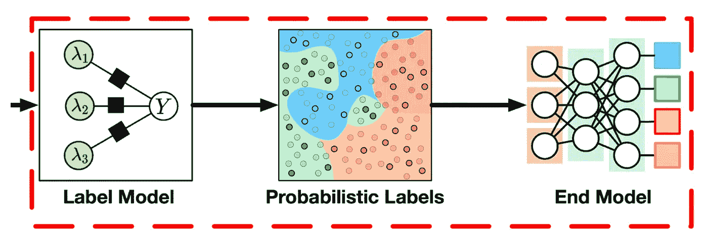
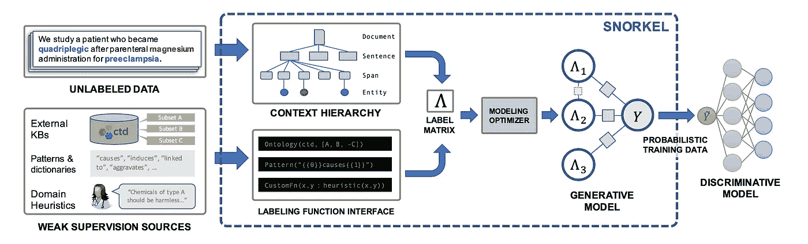

# 弱监督的直观概述

> 原文：[`towardsdatascience.com/an-intuitive-overview-of-weak-supervision-215ab3db1591?source=collection_archive---------2-----------------------#2024-06-29`](https://towardsdatascience.com/an-intuitive-overview-of-weak-supervision-215ab3db1591?source=collection_archive---------2-----------------------#2024-06-29)

## 这可能是解决你下一个 NLP 问题的方案。

[](https://essamwissam.medium.com/?source=post_page---byline--215ab3db1591--------------------------------)[](https://towardsdatascience.com/?source=post_page---byline--215ab3db1591--------------------------------) [Essam Wisam](https://essamwissam.medium.com/?source=post_page---byline--215ab3db1591--------------------------------)

·发布于[Towards Data Science](https://towardsdatascience.com/?source=post_page---byline--215ab3db1591--------------------------------) ·8 分钟阅读·2024 年 6 月 29 日

--

在这个故事中，我们介绍并广泛探讨机器学习中的弱监督主题。弱监督是机器学习中的一种学习范式，近年来开始引起了显著关注。简而言之，完全监督要求我们拥有一个训练集*(x,y)*，其中*y*是*x*的正确标签；而弱监督假设一个一般情境*(x, y’)*，其中*y’*不必是正确的（即，它可能是错误的；一个弱标签）。此外，在弱监督中，我们可以有多个弱监督者，因此对于每个示例，可以拥有*(x, y’1,y’2,…,y’F)*，其中每个*y’j*来自不同的来源，并且可能是错误的。


巨型宽泛无特征怪物，由 DALLE 生成

## 目录

∘ 问题陈述

∘ 通用框架

∘ 通用架构

∘ Snorkel

∘ 弱监督示例

## 问题陈述

更实用地说，弱监督旨在解决我所称之为监督式机器学习困境的问题。如果你是一个企业或有一个机器学习新想法的人，你将需要数据。通常，收集大量样本*(x1, x2, …, xm)*并不困难，有时甚至可以通过编程完成；然而，真正的困境在于，你需要雇佣人工标注员来标记这些数据，并为每个标签支付一定的$Z 费用。问题不仅在于你可能无法确定项目是否值得花这么多钱，而且还在于你可能根本负担不起雇佣标注员的费用，因为这个过程在法律和医学等领域尤其昂贵。

你可能会想，弱监督是如何解决这个问题的？简单来说，与其支付注释员来为你提供标签，不如让他们给你一些通用规则，这些规则在标注数据时有时会不准确（这会节省大量的时间和金钱）。在某些情况下，开发团队甚至可能很轻松地自己搞定这些规则（例如，如果任务不需要专家注释员的话）。

现在让我们思考一个具体的应用场景。你正在构建一个自然语言处理系统，用于屏蔽与敏感信息相关的单词，比如电话号码、姓名和地址。你不需要雇佣人员来标注你收集到的句子中的单词，而是编写一些函数，基于一些规则自动标注数据，比如判断单词是否全为数字（很可能是电话号码，但不一定），判断单词是否以大写字母开头而且不是句首（很可能是名字，但不一定），等等。然后，你可以用这些弱标签数据来训练你的系统。你可能会认为训练出的模型不会比这种标注源更好，但这是不正确的；弱监督模型的设计本意就是要超越标注源的局限，通过识别不确定性并以某种方式进行考虑，从而实现更好的泛化能力。


实验室实验的工程规划论文，来自 DALLE

## 通用框架

现在让我们正式地看一下弱监督在自然语言处理中的应用框架。

✦ **给定条件**

一组*F*个标注函数 *{L1 L2,…,LF}*，其中*Lj*是一个弱标签函数，在给定输入*x*的情况下，任何标注函数*Lj*都可以是以下任意一种：

1.  众包注释员（有时他们的准确性较低）

1.  基于距离监督的标签（即，从另一个知识库中提取的标签）

1.  弱模型（例如，天生较弱或在其他任务上训练的模型）

1.  启发式函数（例如，根据关键字或模式的存在为观察项标注标签，或由领域专家定义）

1.  地名词典（例如，根据其在特定列表中的出现为观察项标注标签）

1.  在特定提示 P 下调用大型语言模型（最近的研究成果）

1.  一般来说，任何能（最好）比随机猜测更好地预测*x*标签的函数。

通常假设*Li*可能会选择不提供标签（例如，像*“如果单词含有数字，则标注为电话号码，否则不标注”*这样的启发式函数）。

假设训练集有 N 个样本，那么在序列分类的情况下，给定的弱标签矩阵等价于一个(N,F)的矩阵。对于长度为 T 的序列分类任务，它是一个(N,T,F)的弱标签矩阵。

✦ **期望**

训练一个模型 M，有效利用弱标签数据，并结合任何强标签数据（如果存在的话）。

✦ **常见的自然语言处理任务**

+   **序列分类**（例如，情感分析）或 **标记分类**（例如，命名实体识别），其中标签函数通常是启发式函数或地名词典。

+   **低资源翻译** *(x→y)*，其中标签函数通常是一个较弱的翻译模型（例如，采用反向方向的翻译模型 *(y→x)* 来增加更多的 *(x,y)* 翻译对）。

## 一般架构

对于序列或标记分类任务，文献中最常见的架构通常采用以下形式：



来自论文的图示 WRENCH: 弱监督的综合基准

**标签模型**学习将标签函数的输出映射到概率性或确定性的标签，这些标签用于训练最终模型。换句话说，它接收上述讨论的 (N,F) 或 (N,T,F) 标签矩阵，并返回 (N) 或 (N,T) 的标签矩阵（这些标签通常是概率性的（即软标签））。

**最终模型**在此步骤后单独使用，仅是一个普通的分类器，操作的是标签模型生成的软标签（交叉熵损失函数能够处理这种情况）。某些架构使用深度学习将标签模型和最终模型合并。

请注意，一旦我们训练了标签模型，我们就用它为最终模型生成标签，之后我们不再使用标签模型。从这个意义上说，这与堆叠模型是相当不同的，即使标签函数本身是其他机器学习模型。

**另一种架构**，这是翻译任务中的默认架构（对于序列/标记分类任务则不常见），是根据弱示例（源语言、目标语言）对的质量来加权（通常翻译任务只有一个标签函数，即反向模型，正如前面所讨论）。这种权重可以用于损失函数，使得模型从高质量的示例中学习得更多，而从低质量的示例中学习得更少。在这种情况下的方法尝试设计用于评估特定示例质量的方案。例如，一种方法使用回译 BLEU 分数（即将句子翻译到目标语言，然后再翻译回源语言）来估算这种权重。

## Snorkel



来自 Snorkel 的图片：使用弱监督快速创建训练数据

为了查看标签模型如何工作，我们可以看看**Snorkel**，它无疑是序列分类中弱监督的最基础性工作。


来自论文的方程式

在 Snorkel 中，作者的目标是找到 ***P(yi|Λ(xi))***，其中 *Λ(xi)* 是第 i 个示例的弱标签向量。显然，一旦找到了这个概率，我们可以将其作为最终模型的软标签（因为正如我们所说，交叉熵损失可以处理软标签）。同样显而易见的是，如果我们有 *P(y, Λ(x))*，那么我们可以轻松地用它来求得 *P(y|Λ(x))*。

从上面的方程中我们可以看到，他们使用了与逻辑回归相同的假设来建模 *P(y, Λ(x))*（Z 用于归一化，类似于 Sigmoid/Softmax）。不同之处在于，代替 *w.x*，我们有 *w.φ(Λ(xi),yi)*。特别地，*φ(Λ(xi),yi)* 是一个维度为 *2F+|C|* 的向量。F 是之前提到的标注函数的数量；同时，C 是一组相关的标注函数对（因此，|C| 是相关对的数量）。作者提到在另一篇论文中有一种方法来自动构建 C，这里为了简洁起见不再深入探讨。

向量 ***φ(Λ(xi),yi)*** 包含：

+   **F**个二元元素，用于指定每个标注函数是否在给定示例中放弃

+   **F**个二元元素，用于指定每个标注函数是否等于真实标签 y（此处 y 作为变量，它是分布的输入）

+   **C**个二元元素用于指定给定此示例时，每一对相关的元素是否做出了相同的投票

他们接着通过解决以下目标来训练这个标签模型（最小化负对数边际似然）：


论文中的方程

注意，他们不需要关于 y 的信息，因为这个目标是无论 y 的具体值如何都能解决的，如通过求和所示。如果你仔细观察（去掉负号和对数），你会发现这等同于找到那些最大化任何真实标签的概率的权重。

一旦标签模型训练完成，他们使用该模型生成**N**个软标签 ***P(y1|Λ(x1)), P(y2|Λ(x2)),…,P(yN|Λ(xN))***，并利用这些标签来训练某些判别模型（即分类器）。

## 弱监督示例

Snorkel 提供了一个出色的垃圾邮件分类教程[在这里](https://www.snorkel.org/use-cases/01-spam-tutorial)。Skweak 是另一个基本的弱监督标注包（以及相关论文），用于标记分类。下面是如何开始使用 Skweak 的示例，如在[他们的 GitHub](https://github.com/NorskRegnesentral/skweak)上所示：

首先定义标注函数：

```py
import spacy, re
from skweak import heuristics, gazetteers, generative, utils

### LF 1: heuristic to detect occurrences of MONEY entities
def money_detector(doc):
   for tok in doc[1:]:
      if tok.text[0].isdigit() and tok.nbor(-1).is_currency:
          yield tok.i-1, tok.i+1, "MONEY"

lf1 = heuristics.FunctionAnnotator("money", money_detector)

### LF 2: detection of years with a regex
lf2= heuristics.TokenConstraintAnnotator("years", lambda tok: re.match("(19|20)\d{2}$", 
                                                  tok.text), "DATE")

### LF 3: a gazetteer with a few names
NAMES = [("Barack", "Obama"), ("Donald", "Trump"), ("Joe", "Biden")]
trie = gazetteers.Trie(NAMES)
lf3 = gazetteers.GazetteerAnnotator("presidents", {"PERSON":trie})
```

将它们应用于语料库

```py
# We create a corpus (here with a single text)
nlp = spacy.load("en_core_web_sm")
doc = nlp("Donald Trump paid $750 in federal income taxes in 2016")

# apply the labelling functions
doc = lf3(lf2(lf1(doc)))
```

创建并拟合标签模型

```py
# create and fit the HMM aggregation model
hmm = generative.HMM("hmm", ["PERSON", "DATE", "MONEY"])
hmm.fit([doc]*10)

# once fitted, we simply apply the model to aggregate all functions
doc = hmm(doc)

# we can then visualise the final result (in Jupyter)
utils.display_entities(doc, "hmm")
```

然后，你当然可以在此基础上使用估算的软标签训练分类器。

在本文中，我们探讨了弱监督所解决的问题，提供了正式的定义，并概述了在这种背景下通常采用的一般架构。我们还深入研究了 Snorkel，这是弱监督中的基础模型之一，并以一个实际示例结束，说明了弱监督如何应用。


由 DALLE 创作的“Jeep Going Away Bye”

希望你觉得这篇文章有用。下次再见，au revoir。

**参考文献**

[1] Zhang, J. *等* (2021) *Wrench: 一个全面的弱监督基准测试*, *arXiv.org*。可在以下网址获取：[`arxiv.org/abs/2109.11377`](https://arxiv.org/abs/2109.11377)。

[2] Ratner, A. *等* (2017) *Snorkel: 使用弱监督快速创建训练数据*, *arXiv.org*。可在以下网址获取：[`arxiv.org/abs/1711.10160`](https://arxiv.org/abs/1711.10160)。

[3] NorskRegnesentral (2021) *NorskRegnesentral/skweak: Skweak: 一个应用于 NLP 任务的弱监督软件工具包*, *GitHub*。可在以下网址获取：[`github.com/NorskRegnesentral/skweak`](https://github.com/NorskRegnesentral/skweak)。
