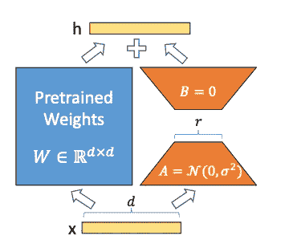
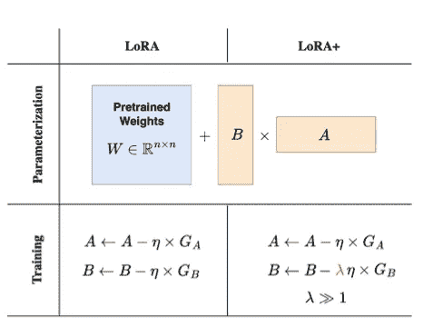
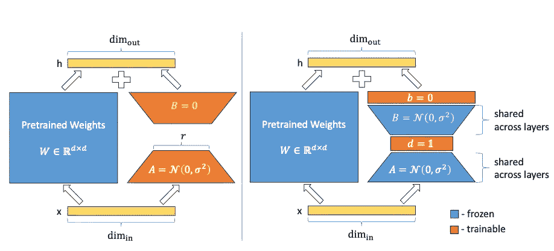
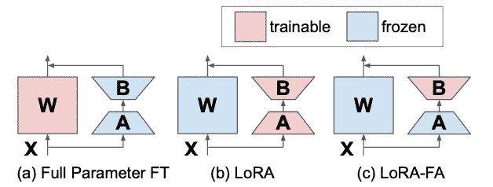
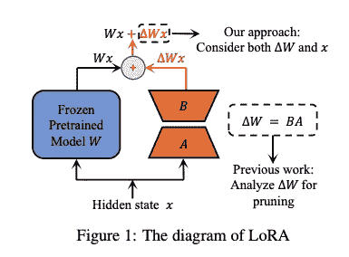
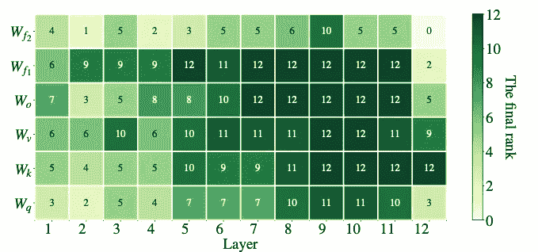
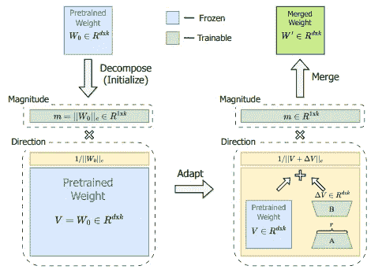
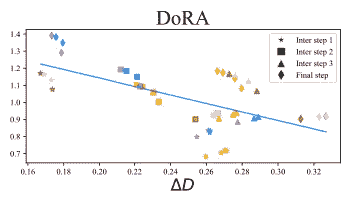
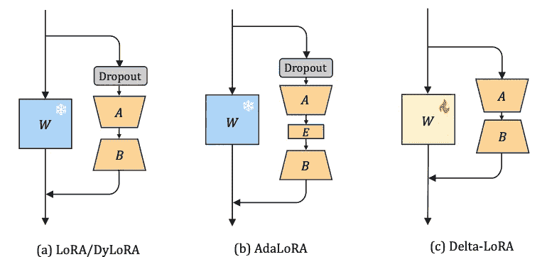
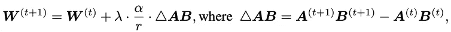

# LoRA 家族概述

> 原文：[`towardsdatascience.com/an-overview-of-the-lora-family-515d81134725?source=collection_archive---------1-----------------------#2024-03-10`](https://towardsdatascience.com/an-overview-of-the-lora-family-515d81134725?source=collection_archive---------1-----------------------#2024-03-10)

## LoRA、DoRA、AdaLoRA、Delta-LoRA 等低秩适应的变体。

 [Dorian Drost](https://medium.com/@doriandrost?source=post_page---byline--515d81134725--------------------------------)

·发布于[Towards Data Science](https://towardsdatascience.com/?source=post_page---byline--515d81134725--------------------------------) ·阅读时长 17 分钟·2024 年 3 月 10 日

--

LoRA 有多种不同的形式和变体。照片由[Lucas George Wendt](https://unsplash.com/@lucasgwendt?utm_source=medium&utm_medium=referral)提供，来源于[Unsplash](https://unsplash.com/?utm_source=medium&utm_medium=referral)。

**Lo**w-**R**ank **A**daptation (**LoRA**) 可以被认为是朝着高效训练大型语言模型以完成特定任务的一项重大突破。它今天广泛应用于许多领域，并激发了关于如何改进其主要思想以实现更好的性能或更快速训练模型的研究。

在本文中，我将概述一些 LoRA 的变体，它们承诺在不同方面提高 LoRA 的能力。我将首先解释 LoRA 本身的基本概念，然后介绍**LoRA+**、**VeRA**、**LoRA-FA**、**LoRA-drop**、**AdaLoRA**、**DoRA** 和 **Delta-LoRA**。我将介绍每种方法的基本概念和主要思想，并展示这些方法如何偏离原始的 LoRA。我会省略技术细节，除非它们对基本概念至关重要，并且也不会详细讨论评估。对于有兴趣的读者，我在文末提供了原始论文的链接。

# Lora

LoRA 的主要思想是将两个较小的可调矩阵 A 和 B 添加到预训练的权重矩阵 W 旁边，而不改变 W 的参数。图片来源[1]。

低秩适应（**LoRA**）[1]是一种今天广泛用于训练大型语言模型（LLMs）的技术。大型语言模型具有根据自然语言输入预测自然语言令牌的能力。这是一个令人惊叹的能力，但在解决许多问题时，仅凭此能力往往不够。大多数情况下，你希望在给定的下游任务上训练 LLM，例如对句子进行分类或生成给定问题的答案。实现这一点最直接的方式是微调，即使用目标任务的数据训练 LLM 的部分层。 但这意味着需要训练具有数百万到数十亿参数的非常大模型。

LoRA 提供了一种替代的训练方式，由于大幅减少了参数数量，因此训练速度更快，实施更为简便。除了已经预训练的 LLM 层的参数权重外，LoRA 引入了两个矩阵 A 和 B，这些矩阵被称为*适配器*，它们的尺寸要小得多。如果原始的参数矩阵 W 的大小是*d x d*，那么矩阵 A 和 B 的大小分别为*d x r*和*r x d*，其中*r*要小得多（通常小于 100）。参数*r*被称为*秩*。也就是说，如果你使用秩为*r=16*的 LoRA，这些矩阵的形状就是*16 x d*。秩越高，训练的参数越多。这一方面可能带来更好的性能，另一方面也需要更多的计算时间。

现在我们有了这些新的矩阵 A 和 B，那么它们会发生什么呢？输入给 W 的数据同样也会输入到 B*A 中，B*A 的输出会加到原始矩阵 W 的输出上。也就是说，你在原有基础上训练了一些参数，并将它们的输出添加到原始预测中，这使得你可以影响模型的行为。你不再训练 W，这也是为什么我们有时会说 W 是*冻结*的。重要的是，A 和 B 的加法不仅仅发生在最后一层（那样只是增加一层），而是可以应用于神经网络内部的深层。

这就是 LoRA 的主要思想，它的最大优势是，训练的参数比微调时少，但仍能获得相似的性能。这里我还想提到一个技术细节：一开始，矩阵 A 用均值为零但方差较小的随机值进行初始化。矩阵 B 则初始化为一个全零矩阵。这确保了 LoRA 矩阵从一开始就不会以随机的方式改变原始 W 的输出。当 A 和 B 的参数被调优到期望方向时，A 和 B 的更新对 W 的输出应当是一个加法操作，而不是随机改变原始输出。然而，我们稍后会看到，由于不同的原因，某些方法偏离了这一思想。

如前所述，LoRA 在当今的 LLM 中被广泛使用。然而，到现在为止，已经有许多 LoRA 的变种，它们在不同的方面偏离了原始方法，旨在提高速度、性能，或两者兼顾。接下来我将向你介绍其中一些。

# LoRA+

LoRA+为两个矩阵 A 和 B 引入了不同的学习率，这里通过参数λ来表示。图片来源于[2]。

**LoRA+** [2]通过为矩阵 A 和 B 引入不同的学习率，提供了一种更高效的 LoRA 适配器训练方法。在大多数情况下，当训练神经网络时，只有一个学习率应用于所有的权重矩阵。但是，LoRA+的作者展示了，对于 LoRA 中使用的适配器矩阵，使用单一学习率是次优的。通过将矩阵 B 的学习率设置得比矩阵 A 高得多，训练变得更加高效。

这种方法背后有一个理论依据，主要基于神经网络初始化的数值陷阱，尤其是当模型在神经元数量上变得非常宽时。然而，证明这一点的数学推导相当复杂（如果你对这一点非常感兴趣，可以查看原文[2]）。直观上，你可能会认为矩阵 B 在初始化为零后，可以使用比随机初始化的矩阵 A 更大的更新步长。此外，实证研究也证明了这种方法的改进。通过将矩阵 B 的学习率设置为矩阵 A 的 16 倍，作者在像 RoBERTa 或 Llama-7b 这样的模型上获得了小幅度的精度提升（大约 2%），同时将训练时间提高了两倍。

# VeRA

VeRA 不训练 A 和 B，而是将其初始化为一个随机投影，随后训练额外的向量 d 和 b。图片来源于[3]。

**VeRA**（**Ve**ctor-based **R**andom Matrix **A**daptation）[3]中，作者提出了一种方法，极大地减少了 LoRA 适配器的参数规模。与其训练矩阵 A 和 B（这是 LoRA 的核心思想），他们用共享随机权重初始化这些矩阵（即所有层中的矩阵 A 和 B 具有相同的权重），并添加了两个新的向量 d 和 b。接下来只训练这些向量 d 和 b。

你可能会想，这怎么可能有效呢？A 和 B 是随机权重的矩阵。如果它们完全没有经过训练，怎么能为模型的性能做出贡献呢？这种方法基于一个有趣的研究领域——所谓的随机投影。许多研究表明，在大型神经网络中，只有一小部分权重被用来引导模型行为，并产生模型在训练任务上的预期表现。由于随机初始化，模型的某些部分（或子网络）从一开始就更有可能贡献于预期的模型行为。在训练过程中，所有参数都会被训练，因为现在已经知道了哪些子网络是重要的。这使得训练非常昂贵，因为大多数更新的参数并未对模型的预测产生任何价值。

基于这一思想，有一些方法仅训练这些相关的子网络。通过在矩阵后添加投影向量，而不是直接训练子网络本身，也可以获得类似的行为。由于矩阵与向量的乘法，这可以产生与调整矩阵中的一些稀疏参数相同的输出。这正是 VeRA 的作者提出的，通过引入向量 d 和 b 来实现训练，而矩阵 A 和 B 则被冻结。此外，与原始的 LoRa 方法不同，矩阵 B 不再被设为零，而是像矩阵 A 一样随机初始化。

这种方法自然导致的参数数量远小于完整的矩阵 A 和 B。例如，如果你为 GPT-3 引入秩为 16 的 LoRA 层，你将拥有 7550 万个参数。而使用 VeRA 时，你只有 280 万个参数（减少了 97%）。但是，参数数量如此之小，性能如何呢？VeRA 的作者使用了一些常见的基准，如 GLUE 或 E2E，并使用基于 RoBERTa 和 GPT2 Medium 的模型进行了评估。他们的结果表明，VeRA 模型的性能仅比完全微调或使用原始 LoRa 技术的模型略低。

# LoRA-FA

LoRA-FA 冻结矩阵 A，只训练矩阵 B。图片来自[4]。

另一种方法，**LoRA-FA** [4]，即带有**F**rozen-**A**的 LoRA，朝着与 VeRA 类似的方向发展。在 LoRA-FA 中，矩阵 A 在初始化后被冻结，因此作为一个随机投影存在。不同于添加新向量的是，矩阵 B 在初始化为零后被训练（就像原始 LoRA 一样）。这样可以将参数数量减半，同时保持与普通 LoRA 相当的性能。

# LoRa-drop

LoRA-drop 使用 B*A 的输出决定哪些 LoRA 层值得训练。图片来自[5]。

一开始，我解释过，你可以将 LoRA 矩阵添加到神经网络的任何一层。**LoRA-drop** [5] 提出了一种算法，用来决定哪些层值得通过 LoRA 进行增强，哪些则不值得这么做。即使训练 LoRA 适配器比微调整个模型便宜得多，但你添加的 LoRA 适配器越多，训练的成本仍然会越高。

LoRA-drop 包含两个步骤。第一步，你从数据中抽取一个子集并训练 LoRA 适配器若干迭代。然后，你计算每个 LoRA 适配器的重要性，计算公式为 B*A*x，其中 A 和 B 是 LoRA 矩阵，x 是输入。这只是 LoRA 适配器的输出，它会加到每个冻结层的输出中。如果这个输出很大，它会显著改变冻结层的行为。如果输出很小，这表明 LoRA 适配器对冻结层的影响微乎其微，完全可以省略。

鉴于这一重要性，你现在可以选择最重要的 LoRA 层。有多种方法可以做到这一点。你可以将重要性值加总，直到达到一个由超参数控制的阈值，或者直接选择前 n 个具有最高重要性的 LoRA 层，其中 n 是固定的。无论哪种方式，在下一步中，你将在整个数据集上进行完整训练（记住，你在前几步使用的是数据的子集），但只针对你刚才选择的那些层。其他层将固定为一组共享的参数，在训练过程中不再改变。

因此，LoRA-drop 算法允许仅使用部分 LoRA 层进行模型训练。作者提供了实证证据，表明与训练所有 LoRA 层相比，准确率变化仅为微不足道，但由于需要训练的参数数量减少，计算时间大大缩短。

# AdaLoRA

AdaLoRA 允许动态调整 LoRA 矩阵的秩。照片来自 [Hasmik Ghazaryan Olson](https://unsplash.com/@find_something_pretty_everyday?utm_source=medium&utm_medium=referral) 上传于 [Unsplash](https://unsplash.com/?utm_source=medium&utm_medium=referral)。

还有其他方式可以决定哪些 LoRA 参数比其他参数更重要。在这一部分，我将介绍 **AdaLoRA** [6]，它代表了 **自适应 LoRA**。这里 LoRA 的哪个部分是自适应的？就是 LoRA 矩阵的秩（即大小）。主要问题与上一部分相同：并非每一层都值得添加 LoRA 矩阵 A 和 B，但对于某些层，LoRA 训练可能比其他层更为重要（即可能会对模型行为产生更大的影响）。为了决定这种重要性，AdaLoRA 的作者提出考虑 LoRA 矩阵的奇异值作为其重要性的指标。

这是什么意思呢？首先，我们必须理解，矩阵乘法也可以看作是对向量应用一个函数。在处理神经网络时，这一点是非常明显的：大多数时候你将神经网络视作一个函数，也就是说，你给定一个输入（例如，一组像素值的矩阵），然后得到一个结果（比如，图像的分类）。在幕后，这个函数的应用是通过一系列矩阵乘法来实现的。现在，假设你想要减少矩阵中的参数数量。这样会改变函数的行为，但你希望它的变化尽可能小。一个方法是计算矩阵的特征值，它们告诉你每一行矩阵捕获了多少方差。然后，你可以决定将一些捕获较小方差的行设为零，这些行对函数贡献不大。AdaLoRA 的主要思想就是基于上述的奇异值，它们正是特征值的平方根。也就是说，基于奇异值，AdaLoRA 决定了哪些 LoRA 矩阵的行更重要，哪些可以被省略。这有效地缩小了一些矩阵的秩，这些矩阵中有许多行并没有太大贡献。然而，需要注意的是，与上一节的 LoRA-drop 存在一个重要的区别：在 LoRA-drop 中，层的适配器要么被完全训练，要么根本不训练。而 AdaLoRA 还可以决定保留某些层的适配器，但使用较低的秩。这意味着，最终不同的适配器可以有不同的秩（而在原始的 LoRA 方法中，所有适配器的秩是相同的）。

AdaLoRA 方法还有一些细节，我为了简洁起见省略了它们。不过，我想提到其中的两个：首先，AdaLoRA 方法并不是每次都显式地计算奇异值（因为那样做会非常昂贵），而是通过奇异值分解来分解权重矩阵。这种分解是另一种表示相同信息的方式，但它允许直接获取奇异值，而无需进行昂贵的计算。其次，AdaLoRA 不仅仅依赖奇异值，还考虑了损失函数对某些参数的敏感性。如果将某个参数设为零对损失有很大影响，那么这个参数就被认为具有较高的敏感性。在决定压缩秩时，除了奇异值外，还会考虑一行元素的平均敏感性。

通过比较 AdaLoRA 与标准 LoRA（在相同秩预算下）的结果，可以获得该方法有效性的实证证据。也就是说，这两种方法总参数数量相同，但分布方式不同。在 LoRA 中，所有矩阵的秩相同，而在 AdaLoRA 中，部分矩阵的秩较高，部分较低，最终导致相同数量的参数。在许多场景中，AdaLoRA 比标准 LoRA 方法取得更好的分数，表明它能更好地分配模型的可训练参数，尤其是在对于给定任务至关重要的部分。以下图表展示了 AdaLoRA 如何为给定模型分配秩。如图所示，AdaLoRA 将较高的秩分配给模型后面的层，表明调整这些层更为重要。

在网络的不同层中，LoRA 矩阵被赋予不同的秩。通常，在后面的层中，秩会更高。图片来源：[6]。

# DoRA

在 DoRA 中，权重矩阵 W 被分解为大小 m 和方向 V，这两个部分是独立调整的。图片来源：[7]。

改进 LoRA 以获得更好性能的另一种方法是权重-**分**解低秩**适**应（Weight-**D**ecomposed L**o**w-**R**ank **A**daption），简称**DoRA**[7]。DoRA 的核心思想是，每个矩阵都可以分解为大小和方向的乘积。对于二维空间中的一个向量，你可以很容易地可视化这一点：一个向量不过是从零位置出发，指向向量空间中某个点的箭头。通过向量的条目，你可以指定那个点，例如，如果你的空间有 x 和 y 两个维度，你可以说 x=1 和 y=1。或者，你也可以通过指定大小和角度（即方向）来以不同的方式描述这个点，比如 m=√2 和 a=45°。这意味着你从零点开始，沿着 45°方向移动，箭头长度为√2，最终会到达相同的点（x=1，y=1）。

这种大小和方向的分解方法同样可以应用于更高阶的矩阵。DoRA 的作者将此方法应用于描述模型训练步骤中更新的权重矩阵，适用于普通微调训练的模型和使用 LoRA 适配器训练的模型。我们在下图中可以看到这两种技术的对比：

微调和 LoRA 在大小和方向的变化关系上有所不同。图片来源：[7]。

我们看到两个图表，一个是微调模型（左）的图表，一个是使用 LoRA 适配器训练的模型（右）的图表。在 x 轴上，我们看到方向的变化，在 y 轴上，我们看到幅度的变化，图中的每个散点代表模型的一层。两种训练方式之间有一个重要的区别。在左图中，方向更新与幅度更新之间存在较小的负相关，而在右图中，存在更强的正相关关系。你可能会想，哪种方式更好，或者这是否有什么意义。请记住，LoRA 的主要理念是以较少的参数实现与微调相同的性能。这意味着，理想情况下，我们希望 LoRA 的训练与微调共享尽可能多的特性，只要这不会增加成本。如果微调中方向与幅度之间的相关性稍微是负的，这对于 LoRA 来说可能是一个理想的特性，前提是它可以实现。换句话说，如果 LoRA 中方向与幅度的关系与全微调不同，这可能是 LoRA 有时表现不如微调的原因之一。

DoRA 的作者提出了一种方法，通过将预训练矩阵 W 分解为幅度向量 m（大小为*1 x d*）和方向矩阵 V，独立地训练幅度和方向。然后，方向矩阵 V 通过 B*A 进行增强，正如标准 LoRA 方法所示，m 则保持不变进行训练，因为它只有一个维度。尽管 LoRA 倾向于同时改变幅度和方向（如这两者之间的高度正相关所示），但 DoRA 可以更轻松地单独调整一个，而不影响另一个，或通过负向变化来补偿一个的变化。我们可以看到方向和幅度之间的关系更像是在微调中的关系：

对于 DoRA，幅度和方向之间的关系更像是在微调中的关系。图片来自[7]。

在多个基准测试中，DoRA 在准确性上优于 LoRA。将权重更新分解为幅度和方向可能使 DoRA 执行更接近于微调中的训练，同时仍使用 LoRA 引入的较小参数空间。

# Delta-LoRA

Delta-LoRA 并不冻结矩阵 W，而是通过从 B*A 获得的梯度更新它。图片来自[8]。

**Delta-LoRA** [8]引入了另一个改进 LoRA 的想法。这一次，预训练矩阵 W 再次发挥了作用。记住，LoRA 的主要思想是不要（！）调整预训练矩阵 W，因为那样代价太高（这将是正常的微调）。这就是为什么 LoRA 引入了新的较小矩阵 A 和 B。然而，这些较小的矩阵在学习下游任务时的能力较弱，这也是为什么 LoRA 训练的模型性能通常低于微调模型性能的原因。在训练过程中调整 W 是非常理想的，但我们如何负担得起呢？

Delta-LoRA 的作者提议通过 A*B 的梯度来更新矩阵 W，即 A*B 在两个连续时间步之间的差异。这个梯度会通过某个超参数λ进行缩放，λ控制新训练对预训练权重的影响程度，然后将其加到 W 中（同时α和 r（秩）是原始 LoRA 设置中的超参数）：

W 通过两步之间 AB 的差值来更新。图片来源于[8]。

这引入了更多的参数进行训练，而几乎没有计算开销。我们不需要像在微调中那样为整个矩阵 W 计算梯度，而是利用在 LoRA 训练过程中已经得到的梯度来更新它。作者在多个基准测试中使用 RoBERTA 和 GPT-2 等模型对比了这种方法，并发现其在性能上优于标准的 LoRA 方法。

# 总结

恭喜你，已经读完了。图片来源：[david Griffiths](https://unsplash.com/@itscakefortea?utm_source=medium&utm_medium=referral)来自[Unsplash](https://unsplash.com/?utm_source=medium&utm_medium=referral)

我们刚刚看到了多种方法，它们在 LoRA 的核心思想上有所变化，目的是减少计算时间或提高性能（或两者兼具）。最后，我将简要总结这些不同的方法：

+   **LoRA**引入了低秩矩阵 A 和 B 进行训练，同时预训练的权重矩阵 W 保持冻结。

+   **LoRA+**建议 B 的学习率远高于 A。

+   **VeRA**不训练 A 和 B，而是随机初始化它们，并在其上训练新的向量 d 和 b。

+   **LoRA-FA**仅训练矩阵 B。

+   **LoRA-drop**使用 B*A 的输出来确定哪些层值得进行训练。

+   **AdaLoRA**动态地调整 A 和 B 在不同层中的秩，允许在这些层中使用更高的秩，尤其是在期望对模型性能贡献较大的层中。

+   **DoRA**将 LoRA 适配器分为幅度和方向两个组件，并允许它们更加独立地进行训练。

+   **Delta-LoRA**通过 A*B 的梯度来改变 W 的权重。

LoRA 及相关方法的研究领域非常丰富且生动，几乎每天都有新的贡献。在本文中，我想解释一些方法的核心思想。当然，这只是其中的一部分，远远不能算作完整的综述。

我希望我能够与您分享一些知识，并可能激发您产生新的想法。正如我们所看到的，LoRA 及相关方法是一个具有巨大潜力的研究领域。预计在提升大规模语言模型训练性能或计算时间方面，新的突破很快就会出现。

# 参考文献及进一步阅读

这些是本文中解释的概念相关的论文：

+   **[1]** **LoRA**: [Hu, E. J., Shen, Y., Wallis, P., Allen-Zhu, Z., Li, Y., Wang, S., … & Chen, W. (2021). LoRA: 大规模语言模型的低秩适应. *arXiv 预印本 arXiv:2106.09685*.](https://arxiv.org/pdf/2106.09685.pdf)

+   **[2] LoRA**+: [Hayou, S., Ghosh, N., & Yu, B. (2024). LoRA+: 大规模模型的高效低秩适应. *arXiv 预印本 arXiv:2402.12354*.](https://arxiv.org/pdf/2402.12354.pdf)

+   **[3] VeRA**: [Kopiczko, D. J., Blankevoort, T., & Asano, Y. M. (2023). Vera: 基于向量的随机矩阵自适应. *arXiv 预印本 arXiv:2310.11454*.](https://arxiv.org/pdf/2310.11454.pdf)

+   **[4]: LoRA-FA**: [Zhang, L., Zhang, L., Shi, S., Chu, X., & Li, B. (2023). Lora-fa: 针对大规模语言模型微调的内存高效低秩适应. *arXiv 预印本 arXiv:2308.03303*.](https://arxiv.org/pdf/2308.03303.pdf)

+   **[5] LoRA-drop**: [Zhou, H., Lu, X., Xu, W., Zhu, C., & Zhao, T. (2024). LoRA-drop: 基于输出评估的高效 LoRA 参数剪枝. *arXiv 预印本 arXiv:2402.07721*.](https://arxiv.org/pdf/2402.07721.pdf)

+   **[6] AdaLoRA**: [Zhang, Q., Chen, M., Bukharin, A., He, P., Cheng, Y., Chen, W., & Zhao, T. (2023). 参数高效微调的自适应预算分配. *arXiv 预印本 arXiv:2303.10512*.](https://arxiv.org/pdf/2303.10512.pdf)

+   **[7] DoRA**: [Liu, S. Y., Wang, C. Y., Yin, H., Molchanov, P., Wang, Y. C. F., Cheng, K. T., & Chen, M. H. (2024). DoRA: 权重分解低秩适应. *arXiv 预印本 arXiv:2402.09353*.](https://arxiv.org/pdf/2402.09353.pdf)

+   **[8]: Delta-LoRA**: [Zi, B., Qi, X., Wang, L., Wang, J., Wong, K. F., & Zhang, L. (2023). Delta-lora: 用低秩矩阵的增量微调高秩参数. *arXiv 预印本 arXiv:2309.02411*.](https://openreview.net/pdf?id=FAO4VS9QRV)

对于关于随机投影的一些核心思想，正如在 VeRA 一节中提到的，这篇文章是该领域的主要贡献之一：

+   [Frankle, J., & Carbin, M. (2018). 彩票票据假设：寻找稀疏的可训练神经网络. *arXiv 预印本 arXiv:1803.03635*.](https://arxiv.org/pdf/1803.03635.pdf)

若需要更细致地解释 LoRA 和 DoRA，我可以推荐这篇文章：

+   [`magazine.sebastianraschka.com/p/lora-and-dora-from-scratch`](https://magazine.sebastianraschka.com/p/lora-and-dora-from-scratch)

*喜欢这篇文章吗？* [*关注我*](https://medium.com/@doriandrost) *以便接收我未来文章的通知。*
