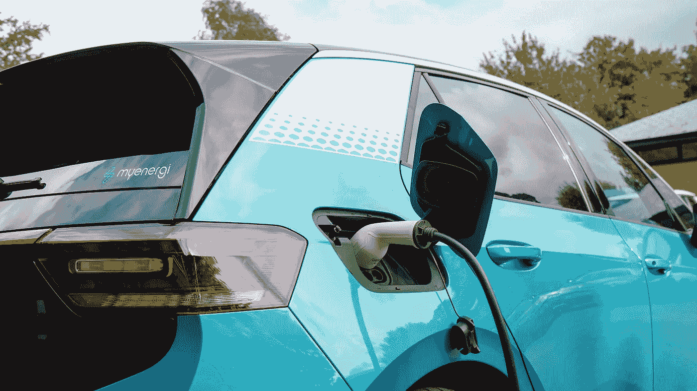

# 分析电动汽车购买的利弊：来自报纸新闻的见解

> 原文：[`towardsdatascience.com/analyzing-the-pros-and-cons-of-electric-vehicle-purchases-insights-from-newspaper-news-336eb1c868e5?source=collection_archive---------6-----------------------#2024-07-01`](https://towardsdatascience.com/analyzing-the-pros-and-cons-of-electric-vehicle-purchases-insights-from-newspaper-news-336eb1c868e5?source=collection_archive---------6-----------------------#2024-07-01)

## 使用 Mistral LLM 进行全面评估以指导明智决策

 [Amanda Iglesias Moreno](https://amandaiglesiasmoreno.medium.com/?source=post_page---byline--336eb1c868e5--------------------------------)

·发表于[Towards Data Science](https://towardsdatascience.com/?source=post_page---byline--336eb1c868e5--------------------------------) ·阅读时长 9 分钟·2024 年 7 月 1 日

--

myenergi 在 Unsplash

在今天的市场中，**购买电动汽车是一个重要的挑战，也是我们必须仔细评估的购买决策**。许多消费者面临选择传统燃油车或电动汽车的不确定性。这一决策至关重要，因为买车涉及重大经济支出。

关于是否购买电动汽车的信息仍然不明确，**因为市场中对于电动汽车可能完全普及的前景存在不确定性**。此外，许多关于电动汽车的网站和新闻已经过时，提供的信息并未反映实际情况，导致很难做出明智的决策。

因此，本文的目标是提供对电动汽车领域近期新闻的分析。通过分析报纸新闻，我们可以识别出与今天购买电动汽车相关的正面和负面因素。这些近期新闻的分析可以为我们提供**对当前情况的更新视角，使我们能够做出基于最新数据的决策**，而不是依赖过时的信息做出决策。
