# 窗口函数的结构

> 原文：[`towardsdatascience.com/anatomy-of-windows-functions-08f04938b12b?source=collection_archive---------11-----------------------#2024-06-11`](https://towardsdatascience.com/anatomy-of-windows-functions-08f04938b12b?source=collection_archive---------11-----------------------#2024-06-11)

## 一个被低估的 SQL 操作的理论与实践

[](https://joaopedro214.medium.com/?source=post_page---byline--08f04938b12b--------------------------------)[](https://towardsdatascience.com/?source=post_page---byline--08f04938b12b--------------------------------) [João Pedro](https://joaopedro214.medium.com/?source=post_page---byline--08f04938b12b--------------------------------)

·发表于 [Towards Data Science](https://towardsdatascience.com/?source=post_page---byline--08f04938b12b--------------------------------) ·12 分钟阅读·2024 年 6 月 11 日

--


图片来源：[Marcus Woodbridge](https://unsplash.com/@marcuswoodbridge?utm_source=medium&utm_medium=referral) 于 [Unsplash](https://unsplash.com/?utm_source=medium&utm_medium=referral)

# 介绍

IT 领域以其不断变化而闻名，每天都有新的工具、新的框架、新的云服务提供商和新的大语言模型（LLMs）被创造出来。然而，即便在这个忙碌的世界中，一些原则、范式和工具似乎在挑战 *现状*——“没有什么是永恒不变的”。而在数据领域，没有什么能像 SQL 语言一样，给人留下如此深刻的印象。

自从它在 80 年代诞生以来，SQL 穿越了数据仓库的时代，实现在 Hadoop/数据湖/大数据中如 Hive 的形式，直到今天，作为 Spark API 之一仍然存在。世界变化了很多，但 SQL 不仅依然存在，而且非常重要和广泛应用。

但是 SQL 就像国际象棋，理解基本规则很容易，但要精通却很难！它是一种有着众多可能性、解决同一问题的多种方式、许多函数和关键字的语言，遗憾的是，它还有许多被低估的功能。如果这些功能被更好地了解，可能在构建查询时能为我们带来很大的帮助。

因此，在这篇文章中，我想谈谈我在构建日常查询时发现非常有用的一个不太为人所知的 SQL 特性：窗口函数。

# 什么是窗口函数

传统的最著名的关系型数据库（如 PostgreSQL、MySQL 和 Oracle）是基于关系代数概念的。在其中，行称为元组（tuples），表格称为关系（relations）。关系是一个元组的集合（从数学意义上讲），也就是说，它们之间没有顺序或连接。因此，表中的行没有默认顺序，并且在一行上执行的计算不会影响也不会受其他行结果的影响。即使是像 ORDER BY 这样的子句，也仅仅对表格进行排序，无法在一行中基于其他行的值进行计算。

简单来说，窗口函数解决了这个问题，扩展了 SQL 功能，允许我们基于其他行的值在一行中执行计算。

# 理解的基本案例/解剖结构

**1-无聚合的聚合**

理解窗口函数的最简单例子是能够“*无聚合的聚合*”。

当我们使用传统的 GROUP BY 进行聚合时，整个表格会被压缩成一个新表，其中每一行代表一个组的元素。使用窗口函数时，不是压缩行，而是可以在同一表格中创建一个包含聚合结果的新列。

例如，如果你需要将支出表中的所有支出加总，传统方法是这样做的：

```py
SELECT SUM(value) AS total FROM myTable
```

使用窗口函数时，你会做如下操作：

```py
SELECT *, SUM(value) OVER() FROM myTable
-- Note that the window function is defined at column-level
-- in the query
```

下图显示了结果：

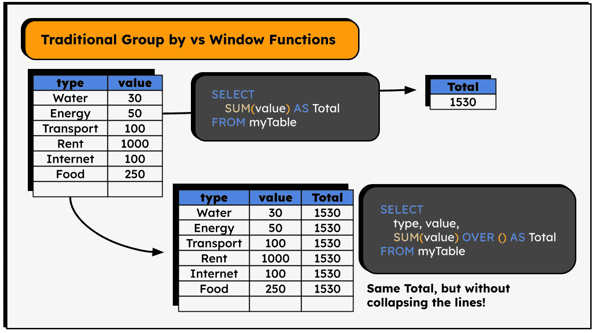

图 1\. 传统的 Group By 与窗口函数。

与其创建一个新表，它将在一个新列中返回聚合值。请注意，值是相同的，但表并没有被“*汇总*”，原始的行被保留——我们只是进行了一个*无聚合的聚合* ;)

OVER 子句是我们创建窗口函数的标志。该子句定义了计算将在哪些行上进行。上述代码中它是空的，因此它将在所有行上计算 SUM()。

当我们需要基于列的总计（或平均值、最小值、最大值）进行计算时，这非常有用。例如，要计算每项支出相对于总支出的百分比。

在实际案例中，我们可能还希望按某些类别查看详细信息，就像图 2 中的例子那样，其中列出了按部门划分的公司支出。同样，我们可以通过简单的 GROUP BY 来获得每个部门的总支出：

```py
SELECT depto, sum(value) FROM myTable GROUP BY depto
```

或者在窗口函数中指定 PARTITION 逻辑：

```py
SELECT *, SUM(value) OVER(PARTITION BY depto) FROM myTable
```

查看结果：

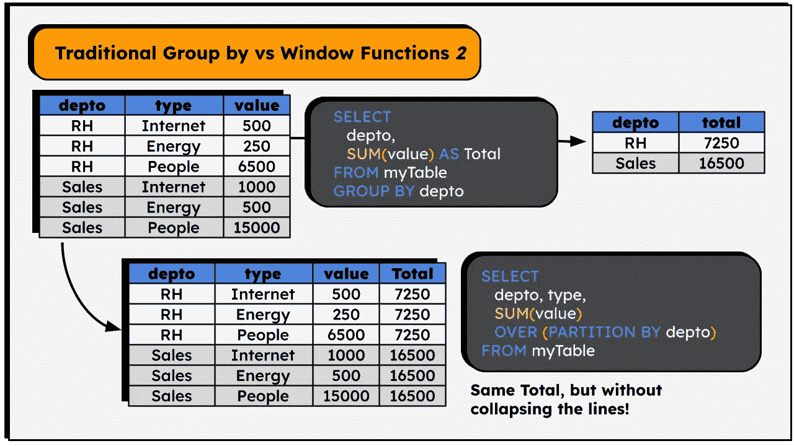

图 2\. 传统的 Group By 与窗口函数 II。

这个例子有助于理解为什么该操作被称为“窗口”函数——OVER 子句定义了一组行，函数将在这些行上执行操作，表中的一个“窗口”。

在上面的例子中，SUM() 函数将在由 depto 列（RH 和 SALES）创建的分区中操作 —— 它将分别计算 depto 列中每个项目的“value”列的所有值。该行所属的组（RH 或 SALES）决定了“Total”列中的值。

**2 — 时间和排序意识**

有时我们需要基于其他行的值来计算某一行中的列的值。一个经典的例子是计算一个国家 GDP 的年增长率，使用当前值和前一年的值来计算。

这类计算，比如需要前一年值、当前行与下一行的差异、一系列中的第一个值等等，都是窗口函数强大功能的体现。事实上，我不知道是否可以通过标准 SQL 命令实现这种行为！可能可以，但会是一个非常复杂的查询……

但是，窗口函数使得这一过程变得简单，见下图（表格记录了某些孩子的身高）：

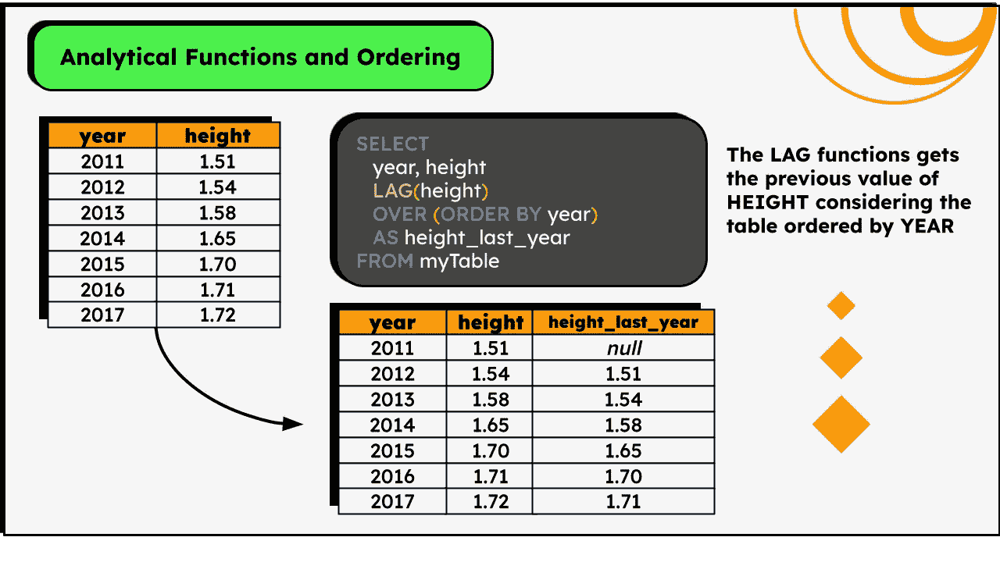

图像 3\. 分析函数示例。

```py
SELECT 
  year, height, 
  LAG(height) OVER (ORDER BY year) AS height_last_year
FROM myTable
```

LAG( ‘column’ ) 函数负责引用前一行的‘column’值。你可以把它想象成一个步骤序列：在第二行，考虑第一行的值；在第三行，考虑第二行的值；依此类推……第一行不算（因此是*NULL*），因为它没有前一个值。

自然地，需要一些排序标准来定义“前一行”是什么。这是窗口函数中的另一个重要概念：**分析函数**。

与传统 SQL 函数不同，分析函数（如 LAG）认为行之间是有排序的 —— 这个排序是由 OVER() 内的 ORDER BY 子句定义的，也就是说，第一行、第二行、第三行等概念是在 OVER 关键字内定义的。这些函数的主要特点是能够相对于当前行引用其他行：LAG 引用上一行，LEAD 引用下一行，FIRST 引用分区中的第一行，依此类推。

LAG 和 LEAD 的一个优点是，它们都接受第二个参数，即偏移量，指定向前（对于 LEAD）或向后（对于 LAG）查看多少行。

```py
SELECT 
    LAG(height,  2) OVER (ORDER BY year) as height_two_years_ago,
    LAG(height,  3) OVER (ORDER BY year) as height_three_years_ago,
    LEAD(height)    OVER (ORDER BY year) as height_next_year
FROM ...
```

而且，使用这些函数进行计算也是完全可行的：

```py
SELECT 
    100*height/(LAG(height) OVER (ORDER BY year)) 
    AS "annual_growth_%"
FROM ...
```

**3 — 时间意识与聚合**

时间与空间其实是统一的 —— 爱因斯坦曾经这么说过，或者类似的话，我不太确定 ¯\_(ツ)_/¯

现在我们知道如何进行分区和排序，可以将这两者结合使用！回到之前的例子，假设桌子上有更多的孩子，我们需要计算每个孩子的增长率。非常简单，只需将排序和分区结合起来！我们可以按年份排序，并按孩子的名字进行分区。

```py
SELECT 1-height/LAG(height) OVER (ORDER BY year PARTITION BY name) ...
```

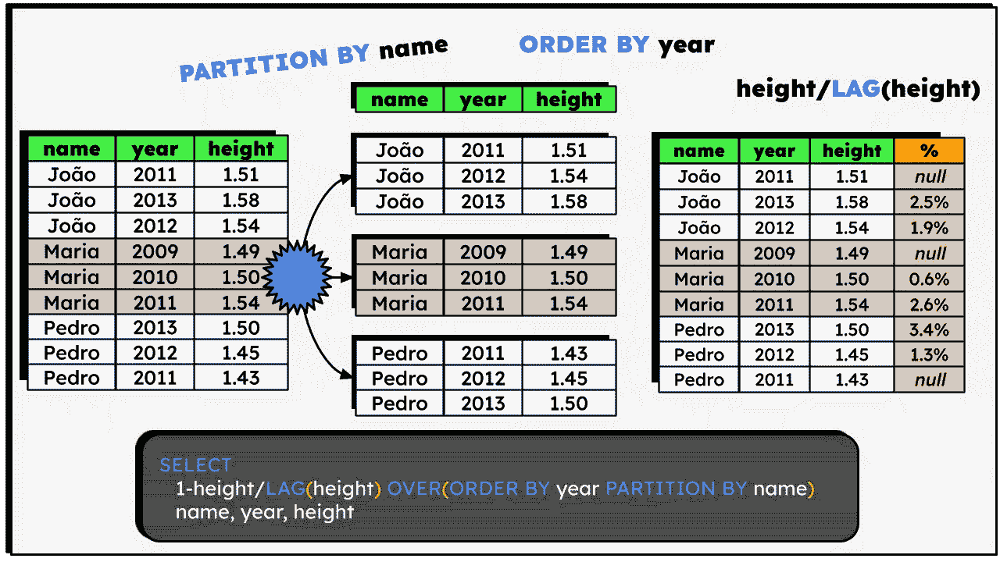

图像 4\. ORDER BY + PARTITION BY

上述查询执行以下操作——按子项对表进行分区，并在每个分区中按年份对值进行排序，随后用当前年份的高度值除以前一年的值（并从结果中减去 1）。

我们正逐渐接近‘窗口’的完整概念！它是一个表切片，是一组按 PARTITION BY 中定义的列分组的行，按 ORDER BY 中的字段排序，其中所有计算仅考虑同一组（分区）中的行以及特定的排序。

**4-排名与位置**

窗口函数可以分为三类，其中两类我们已经讨论过：聚合函数（COUNT、SUM、AVG、MAX 等）和分析函数（LAG、LEAD、FIRST_VALUE、LAST_VALUE 等）。

第三组是最简单的——排名函数，其中最常用的函数是 row_number()，它返回一个整数，表示行在分组中的位置（基于定义的顺序）。

```py
SELECT row_number() OVER(ORDER BY score)
```

排名函数，顾名思义，根据行在分组中的位置返回值，该位置由排序标准定义。ROW_NUMBER、RANK 和 NTILE 是最常用的几个函数。

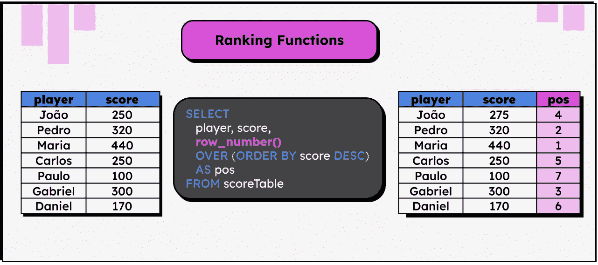

图片 5：排名函数示例

在上面的图片中，行号是根据每个玩家的得分生成的。

…是的，它犯了一个可怕的编程错误，那就是从 1 开始。

**5-窗口大小**

到目前为止，所有展示的函数在计算结果时都会考虑分区/组中的**所有行**。例如，第一示例中描述的 SUM()函数会考虑所有部门的行来计算总和。

但可以指定一个更小的窗口大小，也就是计算时需要考虑当前行前后多少行。这是一个有用的功能，用于计算移动平均/滚动窗口。

让我们考虑以下示例，表格中包含某种疾病的每日病例数，我们需要计算考虑当前日期和前两天的平均病例数。请注意，可以使用之前展示的 LAG 函数来解决这个问题：

```py
SELECT
( n_cases + LAG(n_cases, 1) + LAG(n_cases, 2) )/3
OVER (ORDER BY date_reference)
```

但我们可以使用**框架**的概念更优雅地实现相同的结果：

```py
SELECT
AVG(n_cases)
OVER (
	ORDER BY date_reference
	ROWS BETWEEN 2 PRECEDING AND CURRENT ROW	
)
```

上述框架指定了我们必须仅计算前两行（PRECEDING）和当前行的平均值。如果我们希望考虑前一行、当前行和后一行，可以更改框架：

```py
AVG(n_cases)
OVER (
	ORDER BY date_reference
	ROWS BETWEEN 1 PRECEDING AND 1 FOLLOWING
)
```

这就是所谓的框架——限制一个函数作用范围到特定边界的方法。默认情况下（在大多数情况下），窗口函数会考虑以下框架：

```py
ROWS BETWEEN UNBOUDED PRECEDING AND CURRENT ROW
-- ALL THE PREVIOUS ROWS + THE CURRENT ROW
```

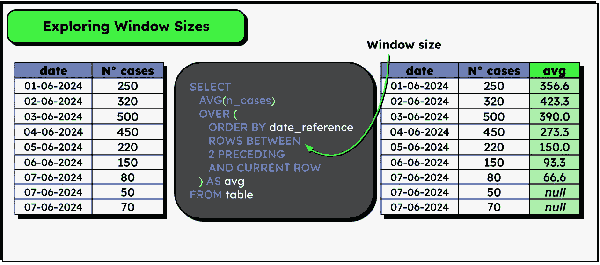

图片 6：探索窗口大小定义

我希望这段介绍能帮助你更好地理解什么是窗口函数，它们是如何工作的，以及它们在实际中的语法。自然，窗口函数可以添加更多的关键字，但我认为这段介绍已经涵盖了你在日常工作中很可能使用的许多命令。接下来，让我们看一些我在日常工作中用来解决问题的有趣实际应用 —— 有些是非常有趣的！

# 窗口函数的好奇而有趣的使用案例

## 随时间的累积和

这是使用窗口函数的经典案例之一。

假设有一张表，记录了你每个月的工资，并且你想知道每个月的累计收入（考虑到所有之前的月份），它是这样工作的：

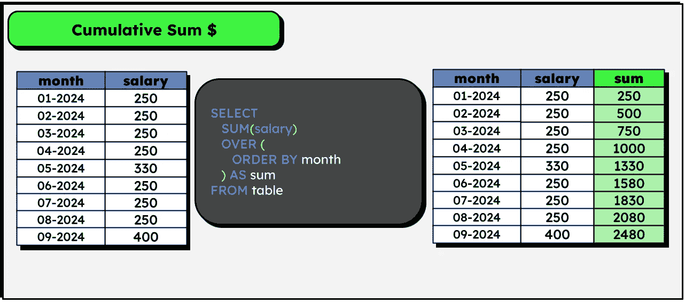

图 7\. 实际示例 — 累积和

非常简单，对吧？

在这个查询中，值得注意的一个有趣点是，SUM() 函数会考虑当前行和所有之前的行来计算聚合，就像之前提到的那样。

## 日志表中事件的持续时间

我最近在我的文章**我在 DuckDB 中的第一亿行（数据）**中使用了这个方法，在文章中我处理了来自巴西电子投票机的日志数据，如果你对处理大数据量感兴趣，这篇文章值得一读。

总结来说，假设有一个日志表，每个事件都由一个时间戳组成，表示事件的开始时间、事件的名称以及一个唯一标识符。考虑到每个事件只有在前一个事件结束后才开始，我们可以轻松地添加一个表示事件持续时间的列，如下所示：

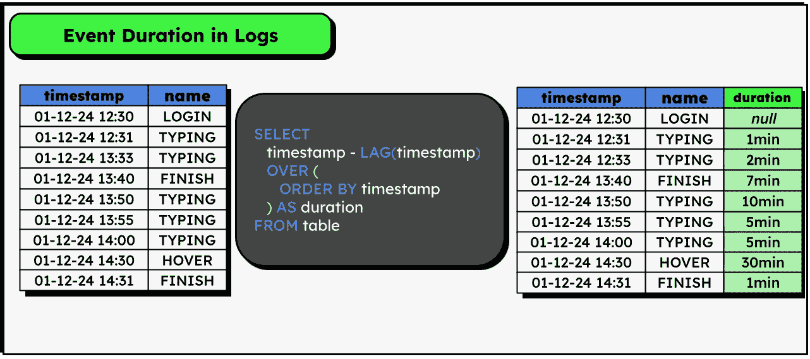

图 8\. 实际示例 — 日志中的事件持续时间

## 填充缺失值（使用最后一次出现的值）

使用 pandas 进行机器学习时的经典方法！只需进行 fillna、bfill 或者其他方法，就可以填充空值，用最后一个有效值填补缺失值。

如何在 SQL 中做到这一点？很简单！

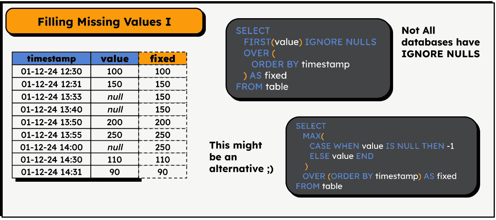

图 8\. 实际示例 — 填充缺失值 I

当我们第一次学习机器学习时，我们经常使用 pandas，并习惯了它们的高级功能。然而，在实际项目中，数据量可能非常庞大，因此我们可能没有运气使用 pandas，而需要切换到 PySpark、Snowflake、Hive+hadoop 等工具 —— 这些工具都可以以某种方式用 SQL 进行操作。因此，我认为学习如何在 SQL 中进行这些数据处理和预处理是非常重要的。

## 填充缺失值（使用前面行的平均值）

填充空值的稍微复杂一点的方法，但依然简单！

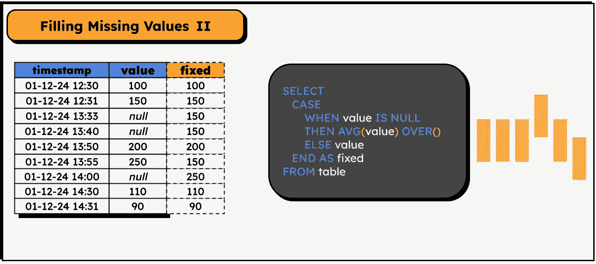

图 8\. 实际示例 — 填充缺失值 II

这个例子突出了尽管窗口函数看起来复杂且特殊，但它们可以像普通列一样使用！它们可以包含在 CASE 语句中，可以用它们进行计算等等。我知道的少数几个限制之一是，它们不能直接放在 WHERE 子句中：

```py
SELECT * FROM
WHERE SUM() OVER() > 10 -- This is not possible in postgres
```

## 基于一组列的行去重

另一个窗口函数的经典例子！有时我们需要根据一组列来去重表中的行。

当然，在 SQL 中我们有 DISTINCT 子句，但它仅在整行重复时有效。如果一个表中有多行 ID 列相同但其他列的值不同的记录，可以通过以下逻辑来去重：

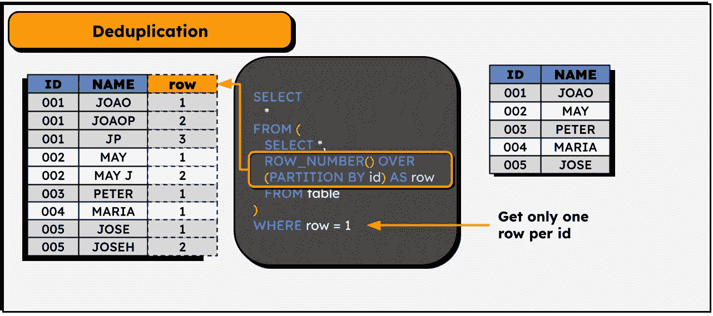

图 9. 实际例子 — 去重

```py
SELECT *
  FROM (
   SELECT
   ROW_NUMBER() OVER (PARTITION BY id) as row_number
  )
WHERE row_number = 1
```

这个操作还允许数据版本控制！例如，如果我们在系统中每次用户更改姓名时保存一行新记录，并附上更改日期（而不是修改现有记录），我们就可以检索每个用户的当前姓名：

```py
SELECT
    *
FROM
(
  SELECT 
    name, 
    row_number() OVER (PARTITION BY id ORDER BY DATE DESC) AS row_number
  FROM myTable
) AS subquery
WHERE row_number = 1
```

## 一个组/类别在所有行中的出现百分比

假设有一个列出了各种宠物的表，这些宠物可以是狗、猫或鸟。我们需要为每一行添加一列，表示每种宠物类型占所有宠物总数的百分比。这个任务通过使用不仅仅一个，而是两个窗口函数来解决！

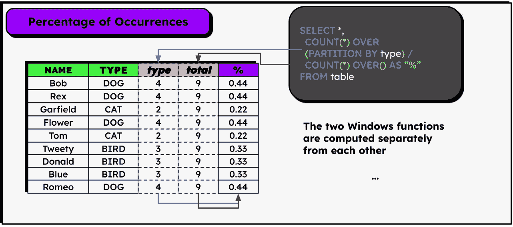

图 10. 实际例子 — 出现百分比

在上面的图像中，为了更具教育性，我添加了两列来表示每个窗口函数的结果，但实际上只创建了最右侧的一列。

那你呢？你有什么有趣的窗口函数案例想要分享吗？请在评论区留下！

# 结论

我不敢说 SQL 是复古或经典的，因为这些词虽然是褒义的，但指的是过去。对我来说，SQL 是现在的、普遍存在的，而且无疑是任何从事数据领域工作的人必须掌握的语言。

然而，有些问题仅用 SQL 本身解决可能显得复杂，这时，良好的语言知识和对其能力的了解就显得尤为重要。如果没有窗口函数，很多从 Pythonic 视角看待的常见问题将变得非常困难，甚至无法解决。但只要我们知道如何正确使用工具，就能创造奇迹！

希望这篇文章帮助你更好地理解窗口函数是如何工作的，以及它们可以在实际中解决哪些类型的问题。这里展示的所有材料主要基于 PostgreSQL 语法，可能在其他数据库中不一定能立即生效，但最重要的是理解它背后的逻辑。像往常一样，我不是该领域的专家，强烈建议对这个主题感兴趣的朋友深入阅读并多加练习。

感谢阅读！;)

# 参考文献

> 所有代码均可在[这个 GitHub 仓库](https://github.com/jaumpedro214/posts/tree/main/sql_window_functions)中找到。
> 
> 对这类作品感兴趣吗？请访问我的[帖子仓库](https://github.com/jaumpedro214/posts)。

[1] *使用 PostgreSQL 窗口函数进行数据处理*。(n.d.)。Timescale。[Link](https://www.timescale.com/learn/postgresql-window-functions)。

[2] Kho, J. (2022 年 6 月 5 日). 高级 SQL 窗口函数简易指南 — 朝向数据科学。*Medium*。

[3] Markingmyname. (2023 年 11 月 16 日). *分析函数 (Transact-SQL) — SQL Server*。[Microsoft Learn](https://learn.microsoft.com/pt-br/sql/t-sql/functions/analytic-functions-transact-sql?view=sql-server-ver16)。

[4] PostgreSQL 教程。(2021 年 4 月 27 日). *PostgreSQL 窗口函数：终极指南*。[Link](https://www.postgresqltutorial.com/postgresql-window-function/)。

[5] VanMSFT. (2023 年 5 月 23 日). *OVER 子句 (Transact-SQL) — SQL Server*。[Microsoft Learn](https://learn.microsoft.com/en-us/sql/t-sql/queries/select-over-clause-transact-sql?view=sql-server-ver16)。

[6] *窗口函数*。(n.d.)。[SQLite 官方文档](https://www.sqlite.org/draft/windowfunctions.html)。

[7] *窗口函数*。(2014 年 7 月 24 日)。[PostgreSQL 文档](https://www.postgresql.org/docs/8.4/functions-window.html)。

*本文中的所有图片均由作者制作。*
