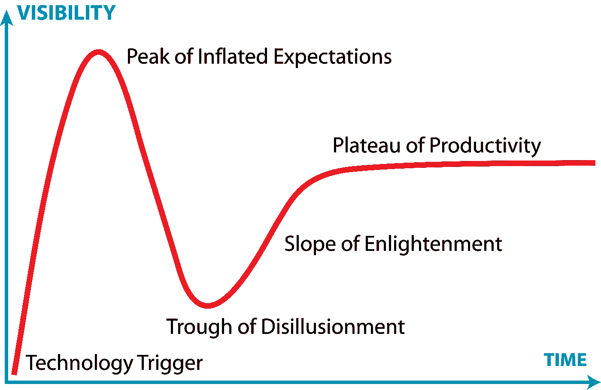

# 再次登顶珠穆朗玛

> 原文：[`towardsdatascience.com/another-hike-up-everest-dc4ec62ec8dd?source=collection_archive---------8-----------------------#2024-11-22`](https://towardsdatascience.com/another-hike-up-everest-dc4ec62ec8dd?source=collection_archive---------8-----------------------#2024-11-22)

## 如何在人工智能的难题中取得进展

[](https://medium.com/@jamesbarney71?source=post_page---byline--dc4ec62ec8dd--------------------------------)[](https://towardsdatascience.com/?source=post_page---byline--dc4ec62ec8dd--------------------------------) [James Barney](https://medium.com/@jamesbarney71?source=post_page---byline--dc4ec62ec8dd--------------------------------)

·发表于 [Towards Data Science](https://towardsdatascience.com/?source=post_page---byline--dc4ec62ec8dd--------------------------------) ·阅读时间 8 分钟·2024 年 11 月 22 日

--


珠穆朗玛峰，当地人称之为**萨加玛塔**或**珠穆朗玛**（[维基百科](https://en.wikipedia.org/wiki/Mount_Everest)）

新技术诞生、成熟，最终被取代。人工智能（AI）也不例外，将遵循这一发展曲线。许多新闻文章已经宣称生成性人工智能（Gen AI）已经进入了“幻灭低谷”：即采用过程中的阶段，早期采用者开始意识到，新技术所承诺的成果比他们想象的要难以实现得多。



Gartner 炒作周期 [维基百科](https://en.wikipedia.org/wiki/Gartner_hype_cycle)

这是正常现象，在生成性人工智能之前也曾多次发生过。比如区块链的兴起与衰退——[你在商店买的生菜](https://www.nytimes.com/2018/09/24/business/walmart-blockchain-lettuce.html)将通过区块链从农场追踪到餐桌！又比如大数据：你将能够[了解客户的一切](https://www.nytimes.com/2012/02/12/sunday-review/big-datas-impact-in-the-world.html)，以最小的努力为他们提供价值，同时为自己带来利润！

问题在于，这些新技术所解决的每个问题实际上都是非常庞大的。每个问题都是一座独立的“珠穆朗玛峰”。

就像珠穆朗玛峰一样，你不能在一天内登顶。需要几个月甚至几年的准备。途中每个营地都为该位置量身定制。有时，即使是准备最充分的尝试也未必能成功登顶——这并不意味着登山队不具备资格或能力：可能是天气不好，或者他们走错了路线。


1963 年美国珠穆朗玛峰远征（[维基百科](https://commons.m.wikimedia.org/wiki/File:1963_American_Everest_expedition.svg)）

你的生成式人工智能策略应该与爬珠穆朗玛峰的策略相同（不过可以暂时不使用额外的氧气）。

生成式人工智能正在解决的每个问题通常都是一个[大难题](https://www.investopedia.com/terms/b/big-hairy-audacious-goal-bhag.asp)——输入复杂、输出复杂，并且有复杂的过程将两者连接起来。

记住：在爬山时，大幅度的跃进是危险的。进步实际上是通过沿着一条路径的小步伐逐渐取得的。


不要跳跃——使用梯子（[维基百科](https://commons.m.wikimedia.org/wiki/File:Inside_Khumbu-Icefall.jpg)）

每一步登顶前，都需要在山坡上收集和组织所需的材料。你不想在珠穆朗玛峰的一半高度时没有食物或水。

类似地，你需要训练自己和你的团队在艰险条件下具备在更高海拔上执行任务的体能。

## 理解正在解决的问题

这不应该意味着“今天的解决方案是什么样的”。现代化努力通常需要替换现有的依赖于变通和妥协的解决方案。理解实际问题至关重要。这个过程的结果到底是从哪里产生价值的？它是如何改善客户体验的？明确界定问题有助于后续定义明确的需求。

关键是要记住，人类在处理模糊的要求时非常擅长。因此，许多人工智能正在解决的“大难题”通常都是这样描述的：

> “我们希望使用人工智能来自动化处理我们用于处理所有大客户订单的复杂订单系统！”

听起来很棒！你能描述一下从头到尾的整个过程是如何运作的吗？

> “嗯，我们从客户那里收到电子邮件，提取订单信息，然后将这些信息放入我们的订单表单。然后我们将表单上传到订单系统中进行处理。生成式人工智能可以自动化整个过程，对吧？”

如果我们一步一步地构建，当然可以！

上述过程包含了大量的模糊性。期望生成式人工智能能够轻松处理上述过程中的每一个细节，是一个错误。

+   电子邮件的格式是什么？总是相同的格式吗？

+   客户是如何描述订单信息的？他们使用的是口语化的术语吗？还是使用了你的物品编号？

+   客户的订单信息与您的履单系统使用的是否相同？是否存在查找过程？

+   上传期待的格式是什么？文本？PDF？Excel？

+   如果是 Excel 模板，是否有多个工作表？不可写入的单元格？数据验证要求？

生成式 AI *能够* 处理所有这些任务 —— 你只需要能够清晰地定义每一步骤。如果你不能清楚地描述一个流程的输入和输出，生成式 AI 很可能不会按照你预期的方式执行。

如果你从自上而下的角度来处理（提示是“你是一个填写订单表单的 AI 代理”），你最终会得到一个大约 50% 准确的过程（老实说，这已经挺不错了！），但结果格式可能与你预期的不一致。问题是，你仍然需要人工检查每一个输出，这样就相当于加倍了工作量。

## 最小可行产品（MVP）：我们不是已经在这里走过一遍了吗？

这并不是什么新鲜事。我们已经做了多年的最小可行产品（MVP）了。你必须从小做起，解决问题中的单一步骤，并在此基础上逐步扩展（通过客户反馈！）。AI 产品和工作流也没有什么不同。先构建立即有用的部分，然后从那里扩展。

我们如何将上述内容应用到订单系统中呢？我们应该将流程中的每个步骤拆解，并在最合适的地方应用生成式 AI：

1.  客户发送订单邮件（非结构化输入）

1.  订单详情被填写到表单中（结构化输入）

1.  表单已格式化并上传到系统中（结构化输出）或者：

1.  没有表单，订单手动构建（非结构化输出）

邮件内容通常是非结构化的，这使得在此处应用 AI 成为一个非常好的用例！在这种情况下，询问你的流程负责人：“一个有效的邮件订单应该包含哪些内容？” 客户姓名、账户号码、地址、所请求的商品及商品数量等数据是很好的候选项。为了在处理这些订单时最大化生成式 AI 系统的准确性和韧性，定义 AI 应遵循的数据结构。我将 [使用](https://docs.pydantic.dev/latest/) `[pydantic](https://docs.pydantic.dev/latest/)` [帮助构建这些结构](https://docs.pydantic.dev/latest/) 如下：

```py
from pydantic import BaseModel

class OrderItem(BaseModel):
  ItemName: str
  ItemQuantity: int

class EmailOrder(BaseModel):
  CustomerName: str
  AccountNumber: str
  ShippingAddress: str
  Items: list[OrderItem]
```

从这里，我们可以利用这些对象来为我们的 AI 提供结构：

```py
>>> i = OrderItem(ItemName='eggs', ItemQuantity=2)
>>> i
OrderItem(ItemName='eggs', ItemQuantity=2)
>>> i.model_dump_json()
'{"ItemName":"eggs","ItemQuantity":2}'
>>> e = EmailOrder(CustomerName="James", AccountNumber="1234", ShippingAddress="1234 Bayberry Ln", Items=[i])
>>> e.model_dump_json()
'{"CustomerName":"James","AccountNumber":"1234","ShippingAddress":"1234 Bayberry Ln","Items":[{"ItemName":"eggs","ItemQuantity":2}]}'
```

现在，通过这些示例，你可以使用少量示例提示（few-shot prompting）来提供给你的生成式 AI，并提高准确性。我们将使用 [LangChain OutputParsers](https://python.langchain.com/docs/how_to/#output-parsers) 来做一些繁重的工作：

```py
from langchain_core.output_parsers import JsonOutputParser
from langchain_core.prompts import PromptTemplate
from langchain_openai import OpenAI

llm = OpenAI(model="gpt-3.5-turbo-instruct") 

template = """
    {format_instructions}
    <email>
    {email_body}
    </email>
    Instructions:
    - Read the email and extract the information in it. 
    - Respond in the format instructions given above.
    Begin! 
"""
parser = JsonOutputParser(pydantic_object=EmailOrder)
prompt = PromptTemplate(
        template=template,
        input_variables=["email_body"],
        partial_variables={
            "format_instructions": parser.get_format_instructions
        },
    )

chain = prompt | llm | parser
email_body = "hello i'd like to order 2 eggs. My name is James. My account number is 1234\. My address is 1234 Bayberry Ln. Appreciate it!"
chain.invoke({"email_body": email_body})
```

实际上发送给 OpenAI 的提示是：

```py
prompt = """The output should be formatted as a JSON instance that conforms to the JSON schema below.

As an example, for the schema {"properties": {"foo": {"title": "Foo", "description": "a list of strings", "type": "array", "items": {"type": "string"}}}, "required": ["foo"]}
the object {"foo": ["bar", "baz"]} is a well-formatted instance of the schema. The object {"properties": {"foo": ["bar", "baz"]}} is not well-formatted.

Here is the output schema:
```{"$defs": {"OrderItem": {"properties": {"ItemName": {"title": "Itemname", "type": "string"}, "ItemQuantity": {"title": "Itemquantity", "type": "integer"}}, "required": ["ItemName", "ItemQuantity"], "title": "OrderItem", "type": "object"}}, "properties": {"CustomerName": {"title": "Customername", "type": "string"}, "AccountNumber": {"title": "Accountnumber", "type": "string"}, "ShippingAddress": {"title": "Shippingaddress", "type": "string"}, "Items": {"items": {"$ref": "#/$defs/OrderItem"}, "title": "Items", "type": "array"}}, "required": ["CustomerName", "AccountNumber", "ShippingAddress", "Items"]}```py
<email>
    "hello i'd like to order 2 eggs. My name is James. My account number is 1234\. My address is 1234 Bayberry Ln. Appreciate it!"
</email>
Instructions:
- Read the email and extract the information in it. 
- Respond in the format instructions given above.
Begin!"""
```

当你发送这个提示时，LLM 会按照示例提取信息：

```py
{
    "CustomerName": "James",
    "AccountNumber": "1234",
    "ShippingAddress": "1234 Bayberry Ln",
    "Items": [
        {
            "ItemName": "eggs",
            "ItemQuantity": 2
        }
    ]
}
```

通过使用这个定义明确的格式来处理电子邮件订单，我们可以将这个解析后的对象重新传回 LLM，并要求它确保订单中的所有必需字段都存在。如果没有，我们可以将电子邮件发送给人工求助！

例如，假设所有的 EmailOrders 也需要一个 CompanyName 字段。如果验证规则这么简单，我们可以直接使用`pydantic`进行验证（无需 AI！）。如果你的使用场景变得更加复杂，输出结果可以通过 LLM 进行处理，以提供更高层次的逻辑。

我们将采取与上述相同的订单，但省略 CompanyName 字段：

```py
>>> class EmailOrder(BaseModel):
...   CustomerName: str
...   AccountNumber: str
...   ShippingAddress: str
...   Items: list[OrderItem]
...   CompanyName: str
...   
>>> e = EmailOrder(CustomerName="James", AccountNumber="1234", ShippingAddress="1234 Bayberry Ln", Items=[i])
Traceback (most recent call last):
  File "<python-input-19>", line 1, in <module>
    e = EmailOrder(CustomerName="James", AccountNumber="1234", ShippingAddress="1234 Bayberry Ln", Items=[i])
  File "/Users/jbarney/.venv/lib/python3.13/site-packages/pydantic/main.py", line 212, in __init__
    validated_self = self.__pydantic_validator__.validate_python(data, self_instance=self)
pydantic_core._pydantic_core.ValidationError: 1 validation error for EmailOrder
CompanyName
  Field required [type=missing, input_value={'CustomerName': 'James',...ello', ItemQuantity=2)]}, input_type=dict]
```

Pydantic 在这里为我们做了很多工作，抛出了一个`ValidationError`。我们的驱动程序可以简单地捕获这个错误，并将电子邮件发送给人工审查员。

当然，一个 LLM 也可以检测到这个错误。我展示这个是为了完整性；通常你会想利用传统编程来进行数据验证：

```py
prompt = """Evaluate that the input object matches the expected schema: 
{input}
{schema}
Reply with "True" if it does match and "False" if it does not match.
"""
```

有了这些，我们现在拥有一个能够轻松处理正确书写的电子邮件订单的系统。更重要的是，我们实现了一个**自我管理的过程**，当 AI 需要帮助时，会让人工参与。

关键是，我们并没有重写整个订单录入过程！我们已经将这个耗时的过程部分化，并建立了一个集中人类努力的系统，将精力集中在那些能够产生最大差异的领域。未来，我们可以开始修改过程中的其他部分，系统地去除人工劳动力。

# 登顶珠穆朗玛峰

这种解决复杂问题的迭代方法并不新鲜。所有大问题都需要拆解成其组成部分，才能真正得到解决。

然而，AI 的“魔力”尤其令人信服。鉴于这些模型只需几行输入就能表现得如此强大，很容易希望实现大的突破。与区块链和大数据等技术相比，从创意到令人兴奋的概念验证所需的努力最小。AI 不需要数十台定制配置的服务器来执行一个跨越 18 TB 数据的 Map-Reduce 任务，这个任务花了你 6 个月时间进行迁移。

因此，在构建下一个 AI 解决方案时，请记住这种简单性：一步一步走向顶峰。

在那里见！
