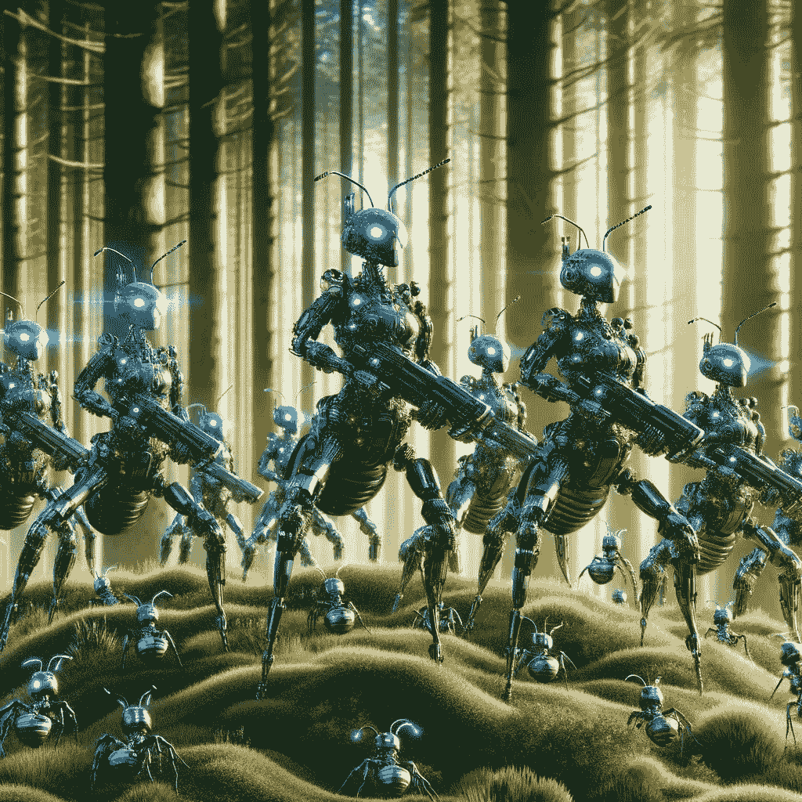

# 蚁群优化——直觉、代码与可视化

> 原文：[`towardsdatascience.com/ant-colony-optimization-intuition-code-visualization-9412c369be81?source=collection_archive---------3-----------------------#2024-01-21`](https://towardsdatascience.com/ant-colony-optimization-intuition-code-visualization-9412c369be81?source=collection_archive---------3-----------------------#2024-01-21)

## 它与其他群体算法的不同之处

 [James Koh, PhD](https://medium.com/@byjameskoh?source=post_page---byline--9412c369be81--------------------------------)

·发布于[Towards Data Science](https://towardsdatascience.com/?source=post_page---byline--9412c369be81--------------------------------) ·10 分钟阅读·2024 年 1 月 21 日

--

该图像由 DALL·E 3 根据提示“在自然森林环境中画出未来的军蚁”创建。

本文是我系列文章的延续，系列灵感来自自然。

之前，我讨论过[进化算法](https://medium.com/towards-data-science/evolutionary-algorithm-selections-explained-2515fb8d4287)（EA）、[粒子群优化](https://medium.com/towards-data-science/particle-swarm-optimization-search-procedure-visualized-4b0364fb3e5a)（PSO）以及人工蜂群算法（ABC）。大自然无处不在，显然人类可以从大自然中学到更多并加以应用。

今天，我们关注蚂蚁。

当我们还是孩子时，我们学到蚂蚁是勤劳且合作的。我们的父母没有教我们的是，蚂蚁集体形成了一个高度复杂的群体，能够有效地相互沟通。

对蚂蚁或信息素（或任何化学物质的扩散）的了解在这里完全不需要。这些仅仅是为了包装而使用的名称。我之前已经展示过，你不需要了解蜜蜂的舞蹈来欣赏或利用 ABC，也不需要学习基因、突变或繁殖机制才能应用进化算法（EA）。

你只需要理解英语，就能掌握直觉，此外还需具备非常基础的数学和 Python 编程技能。虽然我会展示一些数学内容以保证完整性，包括希腊字母符号，但这些内容实际上只是为了补充完整。它……
