# Apache Hadoop 和 Apache Spark 用于大数据分析

> 原文：[`towardsdatascience.com/apache-hadoop-and-apache-spark-for-big-data-analysis-daaf659fd0ee?source=collection_archive---------5-----------------------#2024-05-08`](https://towardsdatascience.com/apache-hadoop-and-apache-spark-for-big-data-analysis-daaf659fd0ee?source=collection_archive---------5-----------------------#2024-05-08)

## 一份完整的指南，介绍如何使用 Apache Hadoop（HDFS）和 Python 中的 PySpark 库进行大数据分析，以分析 Steam 游戏平台上的游戏评论。

[](https://medium.com/@rindhuj1?source=post_page---byline--daaf659fd0ee--------------------------------)[](https://towardsdatascience.com/?source=post_page---byline--daaf659fd0ee--------------------------------) [Rindhuja Treesa Johnson](https://medium.com/@rindhuj1?source=post_page---byline--daaf659fd0ee--------------------------------)

·发布于 [Towards Data Science](https://towardsdatascience.com/?source=post_page---byline--daaf659fd0ee--------------------------------) ·14 分钟阅读·2024 年 5 月 8 日

--

全球每年生产超过 100 个泽字节（= 10¹²GB）的[数据](https://www.statista.com/statistics/871513/worldwide-data-created/)，因此处理大数据的能力是今天最为关键的技能之一。数据分析本身可以定义为处理大数据并从无止境、指数增长的数据中提取洞察力的能力。Apache Hadoop 和 Apache Spark 是帮助我们解开大型数据集中无限可能性的两个基本工具。[Apache Hadoop](https://hadoop.apache.org/) 通过其分布式文件系统（HDFS）和基于 MapReduce 的数据并行处理，帮助我们简化数据存储和分布式计算。[Apache Spark](https://spark.apache.org/) 是一个大数据分析引擎，能够进行 EDA、SQL 分析、流处理、机器学习和图处理，并通过其 API 与主要编程语言兼容。两者结合起来，构成了一个出色的大数据处理环境，并且在大多数情况下，只需要一台个人电脑即可完成！

让我们通过一个简单的分析项目，利用 Apache Spark 在 Python 中实现，来展开[大数据和 Apache Hadoop](https://medium.com/@roshmitadey/a-beginners-guide-to-big-data-and-hadoop-distributed-file-system-hdfs-b5c324d3c722)的强大功能。

首先，让我们深入了解如何在 MacOS 上安装 Hadoop 分布式文件系统和 Apache Spark。我使用的是一台配备 M1 芯片的 MacBook Air，操作系统为 macOS Sonoma。

**跳转到章节 —**

1.  安装 Hadoop 分布式文件系统

1.  安装 Apache Spark

1.  使用 PySpark 进行 Steam 评论分析

1.  接下来做什么？

## 1. 安装 Hadoop 分布式文件系统

感谢 [Code With Arjun](https://medium.com/u/bdd6bb8fb77f?source=post_page---user_mention--daaf659fd0ee--------------------------------) 分享的精彩文章，帮助我完成了在我的 Mac 上的 [Hadoop 安装](https://codewitharjun.medium.com/install-hadoop-on-macos-efe7c860c3ed)。我按照他的步骤顺利安装并运行了 Hadoop，下面我也会展示这些步骤。

1.  **a. 安装 HomeBrew**

我使用 [Homebrew](https://brew.sh/) 来在我的 Mac 上安装应用程序，便于操作。可以通过以下代码直接在系统上安装它 —

```py
/bin/bash -c "$(curl -fsSL https://raw.githubusercontent.com/Homebrew/install/HEAD/install.sh)"
```

安装完成后，你可以运行以下简单代码来验证安装。

```py
brew --version
```

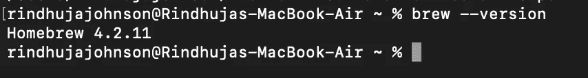

图 1：作者提供的图片

然而，你可能会遇到一个错误，提示`command not found`，这是因为 Homebrew 会被安装在不同的位置（如图 2 所示），并且无法从当前目录执行。为了使其正常工作，我们需要为 brew 添加一个路径环境变量，即将 Homebrew 添加到 `.bash_profile` 中。


图 2：作者提供的图片

> 你可以通过在命令中使用 Homebrew 的完整路径来避免此步骤，但在后期阶段可能会变得麻烦，所以不推荐这么做！

```py
echo ‘eval “$(/opt/homebrew/bin/brew shellenv)”’ >> /Users/rindhujajohnson/.bash_profile

eval “$(/opt/homebrew/bin/brew shellenv)”
```

现在，当你尝试运行 `brew --version` 时，它应该能够正确显示 Homebrew 版本。

1.  **b. 安装 Hadoop**

> 声明！Hadoop 是一个基于 Java 的应用程序，支持 11 版本以下的 Java 开发工具包（JDK），最好是 8 或 11。请在继续之前安装 JDK。

再次感谢 [Code With Arjun](https://medium.com/u/bdd6bb8fb77f?source=post_page---user_mention--daaf659fd0ee--------------------------------)，感谢他分享的关于在 MacBook M1 上安装 JDK 的视频。

安装 JDK 指南

现在，我们使用 brew 命令在系统上安装 Hadoop。

```py
brew install hadoop
```

这个命令应该能够无缝地安装 Hadoop。与安装 HomeBrew 时遵循的步骤类似，我们需要在 Hadoop 文件夹中编辑 Java 的路径环境变量。安装版本的 Hadoop 的环境变量设置可以在 HomeBrew 中的 Hadoop 文件夹中找到。你可以使用`which hadoop`命令来查找 Hadoop 安装文件夹的位置。一旦找到文件夹，你可以在以下位置找到变量设置。以下命令将带你到所需的文件夹以编辑变量设置（请检查你安装的 Hadoop 版本，以避免出错）。

```py
cd /opt/homebrew/Cellar/hadoop/3.3.6/libexec/etc/hadoop
```

你可以使用 `ls` 命令查看该文件夹中的文件。我们将编辑 `hadoop-env.sh` 以确保 Hadoop 在系统上正确运行。

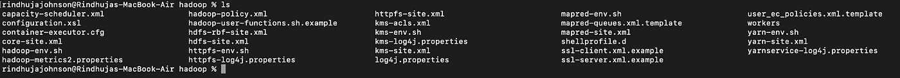

图 3：作者提供的图片

现在，我们需要找到 Java 的路径变量，以便使用以下命令编辑 `hadoop-ev.sh` 文件。

```py
/usr/libexec/java_home
```


图 4：图片来自作者

我们可以在任何文本编辑器中打开 `hadoop-env.sh` 文件。我使用了 VI 编辑器，您可以使用任何编辑器。我们可以将路径 `Library/Java/JavaVirtualMachines/adoptopenjdk-11.jdk/Contents/Home` 复制并粘贴到 `export JAVA_HOME =` 位置。

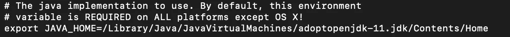

图 5：在 VI 文本编辑器中打开的 hadoop-env.sh 文件

接下来，我们编辑 Hadoop 文件夹中的四个 XML 文件。

`core-site.xml`

```py
<configuration>
 <property>
  <name>fs.defaultFS</name>
  <value>hdfs://localhost:9000</value>
 </property>
</configuration>
```

`hdfs-site.xml`

```py
<configuration>
  <property>
    <name>dfs.replication</name>
    <value>1</value>
  </property>
</configuration>
```

`mapred-site.xml`

```py
<configuration>
    <property>
       <name>mapreduce.framework.name</name>
       <value>yarn</value>
    </property>
    <property>
    <name>mapreduce.application.classpath</name>   
  <value>
$HADOOP_MAPRED_HOME/share/hadoop/mapreduce/*:$HADOOP_MAPRED_HOME/share/hadoop/mapreduce/lib/*
  </value>
    </property>
</configuration>
```

`yarn-site.xml`

```py
<configuration>
  <property>
    <name>yarn.nodemanager.aux-services</name>
    <value>mapreduce_shuffle</value>
  </property>
  <property>
    <name>yarn.nodemanager.env-whitelist</name>  
   <value>
JAVA_HOME,HADOOP_COMMON_HOME,HADOOP_HDFS_HOME,HADOOP_CONF_DIR,CLASSPATH_PREPEND_DISTCACHE,HADOOP_YARN_HOME,HADOOP_MAPRED_HOME
  </value>
  </property>
</configuration>
```

至此，我们已经成功完成了在本地安装和配置 HDFS。为了使 Hadoop 上的数据可以通过远程登录访问，我们可以在常规设置中的共享部分启用 `远程登录`。您可以通过点击信息图标编辑用户访问权限。


图 6：启用远程访问。图片来自作者

让我们运行 Hadoop！

执行以下命令

```py
hadoop namenode -format 
```

```py
# starts the Hadoop environment
% start-all.sh 

# Gathers all the nodes functioning to ensure that the installation was successful
% jps 
```

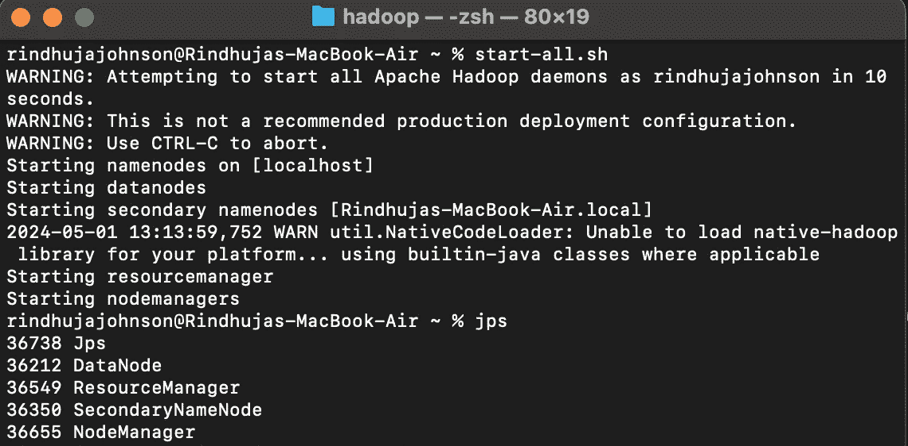

图 7：启动 Hadoop 并查看运行中的节点和资源。图片来自作者

一切就绪！现在让我们在 HDFS 中创建一个目录并添加我们将要处理的数据。让我们快速查看我们的数据源及其详细信息。

**数据**

[Steam Reviews Dataset 2021](https://www.kaggle.com/datasets/najzeko/steam-reviews-2021) ***(***[***许可协议：GPL 2***](https://www.gnu.org/licenses/old-licenses/gpl-2.0.en.html)***)*** 是一个包含大约 2100 万玩家评论的数据集，涵盖了 2021 年超过 300 款不同的游戏。数据是通过 Steam 的 API — [Steamworks](https://partner.steamgames.com/doc/store/getreviews) — 使用“获取列表”功能提取的。

```py
GET store.steampowered.com/appreviews/<appid>?json=1
```

数据集由 23 列和 2170 万行组成，大小为 8.17 GB（这很大！）。数据包含不同语言的评论和一个布尔列，指示玩家是否推荐该游戏给其他玩家。我们将重点讨论如何使用 HDFS 本地处理这些大数据，并使用 PySpark 库在 Python 中通过 Apache Spark 进行分析。

1.  **c. 上传数据到 HDFS**

首先，我们使用 `mkdir` 命令在 HDFS 中创建一个目录。*如果我们尝试将文件直接添加到一个不存在的文件夹中，它将抛出一个错误。*

```py
hadoop fs -mkdir /user
hadoop fs -mkdir /user/steam_analysis
```

现在，我们将使用 `put` 命令将数据文件添加到文件夹 `steam_analysis` 中。

```py
hadoop fs -put /Users/rindhujajohnson/local_file_path/steam_reviews.csv /user/steam_analysis
```

Apache Hadoop 还提供一个用户界面，可以通过 [`localhost:9870/`](http://localhost:9870/) 访问。

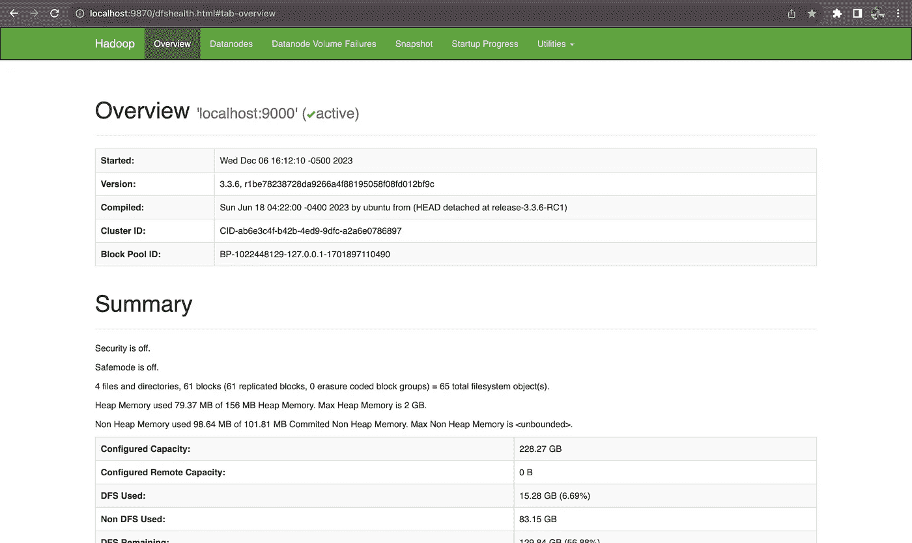

图 8：localhost:9870 上的 HDFS 用户界面。图片来自作者

我们可以看到上传的文件，如下所示。

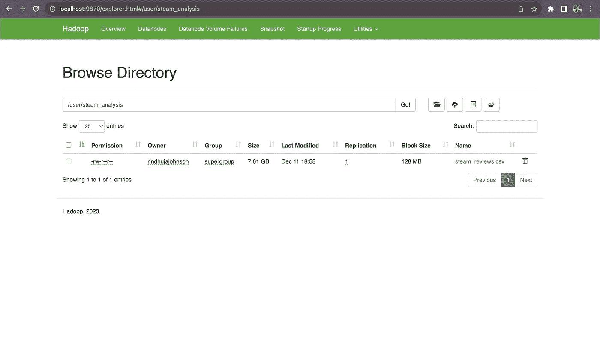

图 10：在 HDFS 中浏览文件。图片来自作者

一旦数据交互完成，我们可以使用`stop-all.sh`命令停止所有 Apache Hadoop 守护进程。

让我们进入下一步 — 安装 Apache Spark

## 2\. 安装 Apache Spark

Apache Hadoop 负责数据存储（HDFS）和数据的并行处理（MapReduce），以加速执行。[Apache Spark](https://spark.apache.org/)是一个多语言兼容的分析引擎，旨在处理大数据分析。我们将在 Jupyter IDE 中使用 Python 运行 Apache Spark。

在安装并运行 HDFS 之后，安装 Apache Spark for Python 轻松得多。PySpark 是 Apache Spark 的 Python API，可以通过在 Jupyter Notebook 中使用`pip`方法进行安装。PySpark 是 Spark Core API，包含四个组件——Spark SQL、Spark ML 库、Spark Streaming 和 GraphX。此外，我们可以通过初始化安装并指定所需的 Hadoop 版本，使用 PySpark 访问 Hadoop 文件。

```py
# By default, the Hadoop version considered will be 3 here.
PYSPARK_HADOOP_VERSION=3 pip install pyspark
```

让我们开始大数据分析吧！

## 3. 使用 PySpark 进行 Steam 评论分析

[Steam](https://store.steampowered.com/about/)是一个在线游戏平台，全球拥有超过 100 百万玩家，平台上托管着超过 30,000 款游戏。除了游戏，平台还允许玩家为他们玩的游戏提供评论，这为平台改进客户体验和游戏公司保持玩家活跃提供了重要资源。我们使用了平台上公开提供的[Kaggle](https://www.kaggle.com/datasets/najzeko/steam-reviews-2021)上的评论数据。

**3. a. 从 HDFS 提取数据**

我们将使用 PySpark 库来访问、清理和分析数据。首先，我们通过本地主机地址将 PySpark 会话连接到 Hadoop。

```py
from pyspark.sql import SparkSession
from pyspark.sql.functions import *

# Initializing the Spark Session
spark = SparkSession.builder.appName("SteamReviewAnalysis").master("yarn").getOrCreate()

# Providing the url for accessing the HDFS
data = "hdfs://localhost:9000/user/steam_analysis/steam_reviews.csv"

# Extracting the CSV data in the form of a Schema
data_csv = spark.read.csv(data, inferSchema = True, header = True)

# Visualize the structure of the Schema
data_csv.printSchema()

# Counting the number of rows in the dataset
data_csv.count() # 40,848,659
```

**3. b. 数据清理与预处理**

我们可以先看看数据集。与 Pandas 中的 pandas.head()函数类似，PySpark 提供了 SparkSession.show()函数，能够展示数据集的一部分。

在此之前，我们将删除数据集中的评论列，因为我们不打算对数据集进行任何自然语言处理（NLP）。此外，评论使用了不同的语言，这使得基于评论进行情感分析变得困难。

```py
# Dropping the review column and saving the data into a new variable
data = data_csv.drop("review")

# Displaying the data
data.show() 
```

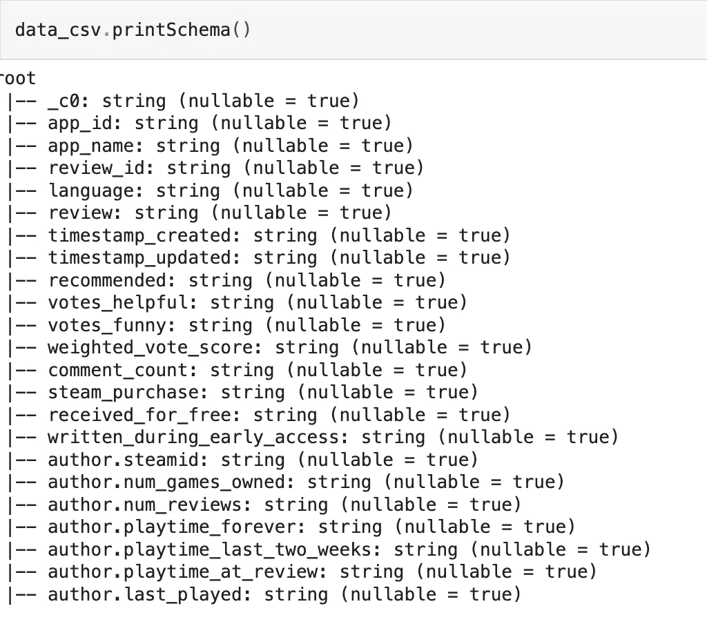

图 11：模式的结构

我们有一个庞大的数据集，包含 23 个属性，其中有不同属性的 NULL 值，这使得考虑进行插补变得不合适。因此，我已删除了包含 NULL 值的记录。然而，这不是推荐的方法。您可以评估可用属性的重要性，删除无关的属性，然后尝试对 NULL 值进行插补。

```py
# Drops all the records with NULL values
data = data.na.drop(how = "any")

# Count the number of records in the remaining dataset
data.count() # 16,876,852
```

数据集中仍然有接近 1700 万条记录！

现在，我们集中关注数据集中的变量名，如图 11 所示。我们可以看到某些属性包含像点（.）这样的字符，这些字符不符合 Python 标识符的命名规则。同时，我们还需要更改日期和时间属性的数据类型。因此，我们使用以下代码进行更改——

```py
from pyspark.sql.types import *
from pyspark.sql.functions import from_unixtime

# Changing the data type of each columns into appropriate types
data = data.withColumn("app_id",data["app_id"].cast(IntegerType())).\
            withColumn("author_steamid", data["author_steamid"].cast(LongType())).\
            withColumn("recommended", data["recommended"].cast(BooleanType())).\
            withColumn("steam_purchase", data["steam_purchase"].cast(BooleanType())).\
            withColumn("author_num_games_owned", data["author_num_games_owned"].cast(IntegerType())).\
            withColumn("author_num_reviews", data["author_num_reviews"].cast(IntegerType())).\
            withColumn("author_playtime_forever", data["author_playtime_forever"].cast(FloatType())).\
            withColumn("author_playtime_at_review", data["author_playtime_at_review"].cast(FloatType()))

# Converting the time columns into timestamp data type
data = data.withColumn("timestamp_created", from_unixtime("timestamp_created").cast("timestamp")).\
            withColumn("author_last_played", from_unixtime(data["author_last_played"]).cast(TimestampType())).\
            withColumn("timestamp_updated", from_unixtime(data["timestamp_updated"]).cast(TimestampType()))
```

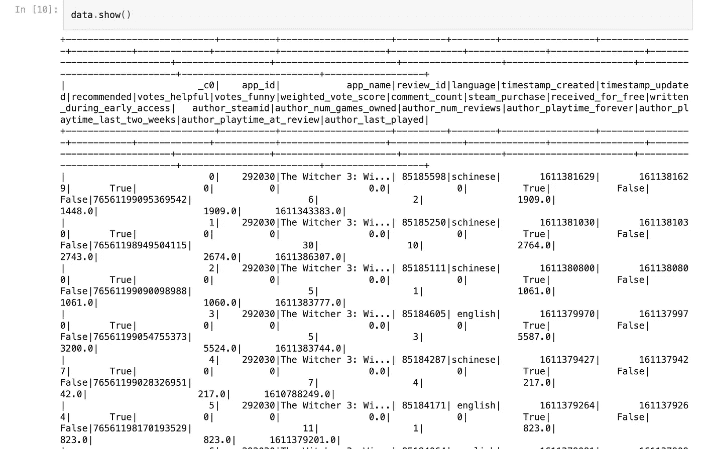

图 12：Steam 评论分析数据集的简要概览。图像来自作者

数据集已经清理完毕，准备好进行分析！

**3\. c. 探索性数据分析**

数据集包含超过 20 个变量，信息丰富。我们可以从不同的角度分析数据。因此，我们将把数据拆分成不同的 PySpark 数据框，并进行缓存，以加快分析速度。

```py
# Grouping the columns for each analysis
col_demo = ["app_id", "app_name", "review_id", "language", "author_steamid", "timestamp_created" ,"author_playtime_forever","recommended"]
col_author = ["steam_purchase", 'author_steamid', "author_num_games_owned", "author_num_reviews", "author_playtime_forever", "author_playtime_at_review", "author_last_played","recommended"]
col_time = [ "app_id", "app_name", "timestamp_created", "timestamp_updated", 'author_playtime_at_review', "recommended"]
col_rev = [ "app_id", "app_name", "language", "recommended"]
col_rec = ["app_id", "app_name", "recommended"]

# Creating new pyspark data frames using the grouped columns
data_demo = data.select(*col_demo)
data_author = data.select(*col_author)
data_time = data.select(*col_time)
data_rev = data.select(*col_rev)
data_rec = data.select(*col_rec) 
```

***i. 游戏分析***

在这一部分，我们将尝试了解不同游戏的评论和推荐模式。我们将把*评论数量*视为游戏的受欢迎程度，而*推荐数量* ***True*** *则代表玩家对该游戏的偏好*。

+   找到最受欢迎的游戏

```py
# the data frame is grouped by the game and the number of occurrences are counted
app_names = data_rec.groupBy("app_name").count()

# the data frame is ordered depending on the count for the highest 20 games
app_names_count = app_names.orderBy(app_names["count"].desc()).limit(20)

# a pandas data frame is created for plotting
app_counts = app_names_count.toPandas()

# A pie chart is created
fig = plt.figure(figsize = (10,5))
colors = sns.color_palette("muted")
explode = (0.1,0.075,0.05,0,0,0,0,0,0,0,0,0,0,0,0,0,0,0,0,0)
plt.pie(x = app_counts["count"], labels = app_counts["app_name"], colors = colors,  explode = explode, shadow = True)
plt.title("The Most Popular Games")
plt.show()
```

+   找到推荐最多的游戏

```py
# Pick the 20 highest recommended games and convert it in to pandas data frame
true_counts = data_rec.filter(data_rec["recommended"] == "true").groupBy("app_name").count()
recommended = true_counts.orderBy(true_counts["count"].desc()).limit(20)
recommended_apps = recommended.toPandas()

# Pick the games such that both they are in both the popular and highly recommended list
true_apps = list(recommended_apps["app_name"])
true_app_counts = data_rec.filter(data_rec["app_name"].isin(true_apps)).groupBy("app_name").count()
true_app_counts = true_app_counts.orderBy(true_app_counts["count"].desc())
true_app_counts = true_app_counts.toPandas()

# Evaluate the percent of true recommendations for the top games and sort them
true_perc = []
for i in range(0,20,1):
    percent = (true_app_counts["count"][i]-recommended_apps["count"][i])/true_app_counts["count"][i]*100
    true_perc.append(percent)
recommended_apps["recommend_perc"] = true_perc
recommended_apps = recommended_apps.sort_values(by = "recommend_perc", ascending = False)

# Built a pie chart to visualize
fig = plt.figure(figsize = (10,5))
colors = sns.color_palette("muted")
explode = (0.1,0.075,0.05,0,0,0,0,0,0,0,0,0,0,0,0,0,0,0,0,0)
plt.pie(x = recommended_apps["recommend_perc"], labels = recommended_apps["app_name"], colors = colors,  explode = explode, shadow = True)
plt.title("The Most Recommended Games")
plt.show()
```

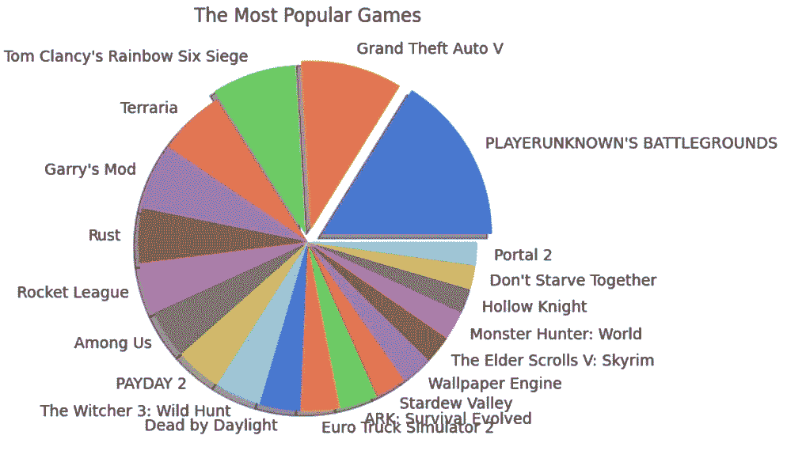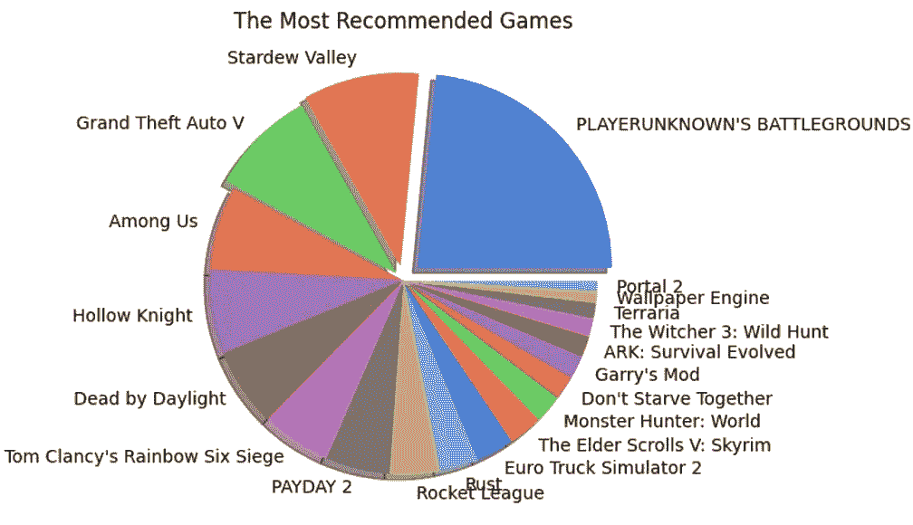

图 13：显示了受欢迎和推荐游戏的饼图。图片来源：作者

***洞察***

+   《绝地求生》（PUBG）是 2021 年最受欢迎和最推荐的游戏。

+   然而，在这两个类别中，第二的位置分别由《侠盗猎车手 V》（GTA V）和《星露谷物语》占据。这表明，受欢迎并不意味着所有玩家都会向其他玩家推荐该游戏。

+   其他游戏也观察到了相同的模式。然而，游戏的评论数量显著影响这一趋势。

***ii. 人口统计分析***

我们将使用`data_demo`数据框来找到玩家的地区，尤其是玩家的所在位置。这项分析将帮助我们了解受欢迎游戏的评论语言和评论者使用的语言。我们可以利用这一趋势来确定玩家的地域影响力和情感，以推荐未来的新游戏。

+   找到最受欢迎的评论语言

```py
# We standardize the language names in the language column, then group them,
# Count by the groups and convert into pandas df after sorting them the count
author_lang = data_demo.select(lower("language").alias("language"))
    \.groupBy("language").count().orderBy(col("count").desc()).
    \limit(20).toPandas()

# Plotting a bar graph
fig = plt.figure(figsize = (10,5))
plt.bar(author_lang["language"], author_lang["count"])
plt.xticks(rotation = 90)
plt.xlabel("Popular Languages")
plt.ylabel("Number of Reviews (in Millions)")
plt.show()
```

+   找到受欢迎游戏的评论语言

```py
# We group the data frame based on the game and language and count each occurrence
data_demo_new = data_demo.select(lower("language").
  \alias("language"), "app_name")
games_lang = data_demo_new.groupBy("app_name","language").count().orderBy(col("count").desc()).limit(100).toPandas()

# Plot a stacked bar graph to visualize
grouped_games_lang = games_lang_df.pivot(index='app_name', columns='language', values='count')
grouped_games_lang.plot(kind='bar', stacked=True, figsize=(12, 6))
plt.title('Count of Different App Names and Languages')
plt.xlabel('App Name')
plt.ylabel('Count')
plt.show()
```

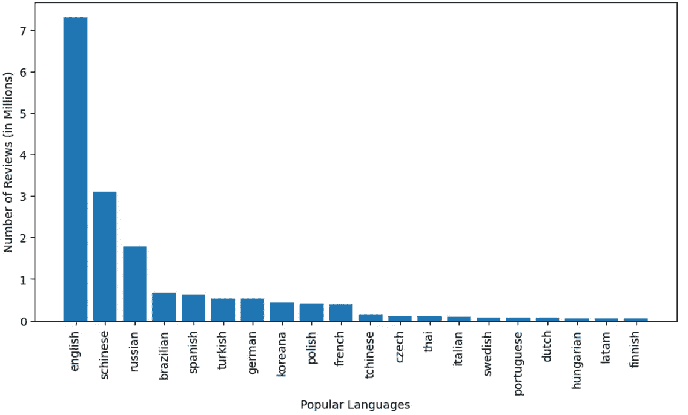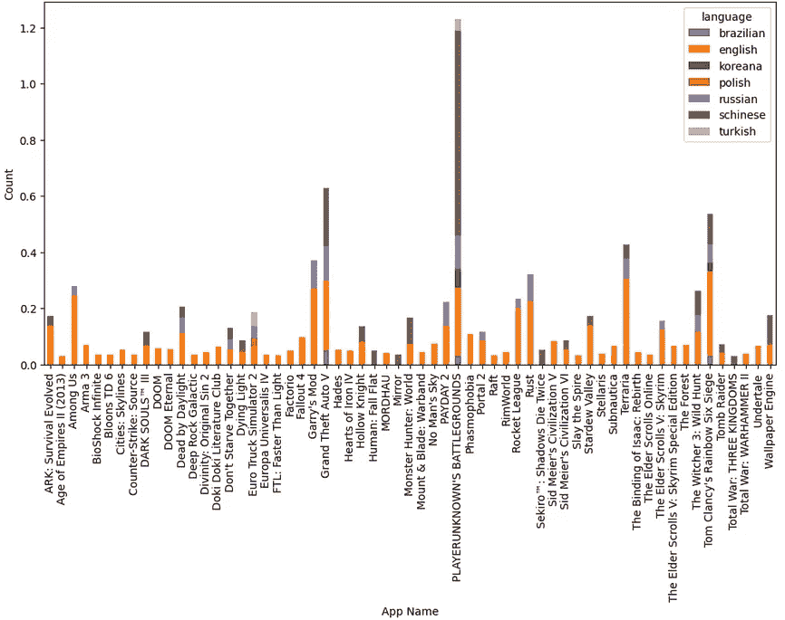

图 14：语言流行度；受欢迎游戏中的语言流行度。图片来源：作者

***洞察***

+   英语是评论者使用的最流行语言，其次是简体中文和俄语。

+   简体中文是最受欢迎的游戏（PUBG）中使用最广泛的语言，而英语则是第二受欢迎的游戏（GTA V）以及几乎所有其他游戏中使用最广泛的语言。

+   游戏的受欢迎程度似乎与其来源地有关。[PUBG](https://letsuncoverhistory.blogspot.com/2023/06/History-and-The-Future-of-PubG.html)是由一家韩国游戏公司开发的，我们观察到它的评论中有韩语，这是使用频率较高的语言之一。

对该数据也进行了时间、作者和评论分析，但并未提供任何可操作的洞察。欢迎访问[GitHub 仓库，查看完整项目](https://github.com/Rindhujatreesa/Big_Data_Processing_Projects/tree/main/Steam_Review_Analysis_with_HDFS_%26_PySpark)文档。

**3\. d. 使用 Spark ML 库进行游戏推荐**

我们已经进入项目的最后阶段，在这里我们将实现 [交替最小二乘法（ALS）](https://spark.apache.org/docs/latest/ml-collaborative-filtering.html) 机器学习算法，来自 Spark ML 库。该模型利用协同过滤技术，根据玩家的行为（即他们之前玩的游戏）来推荐游戏。这个算法识别出那些在 Steam 应用中玩过每个可用游戏的玩家的游戏选择模式。

为了使算法正常工作，

+   我们需要三个变量——独立变量、目标变量（根据推荐数量，这里为 5），以及评分变量。

+   我们对游戏和作者进行编码，以便简化计算。我们还将 `boolean` 推荐列转换为评分列，***True = 5，False = 1。***

+   此外，我们将为每个已玩游戏推荐 5 款新游戏，因此我们会考虑那些玩过超过五款游戏的玩家的数据，用于建模算法。

让我们跳到建模和推荐部分！

```py
new_pair_games = data_demo.filter(col("author_playtime_forever")>=5*mean_playtime)
new_pair_games = new_pair_games.filter(new_pair_games["author_steamid"]>=76560000000000000).select("author_steamid","app_id", "app_name","recommended")

# Convert author_steamid and app_id to indices, and use the recommended column for rating
author_indexer = StringIndexer(inputCol="author_steamid", outputCol="author_index").fit(new_pair_games)
app_indexer = StringIndexer(inputCol="app_name", outputCol="app_index").fit(new_pair_games)
new_pair_games = new_pair_games.withColumn("Rating", when(col("recommended") == True, 5).otherwise(1))

# We apply the indexing to the data frame by invoking the reduce phase function transform()
new_pair = author_indexer.transform(app_indexer.transform(new_pair_games))
new_pair.show()
```

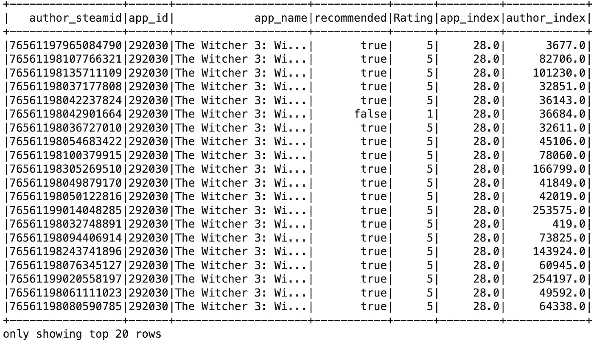

```py
# The reference chart for games
games = new_pair.select("app_index","app_name").distinct().orderBy("app_index")
```

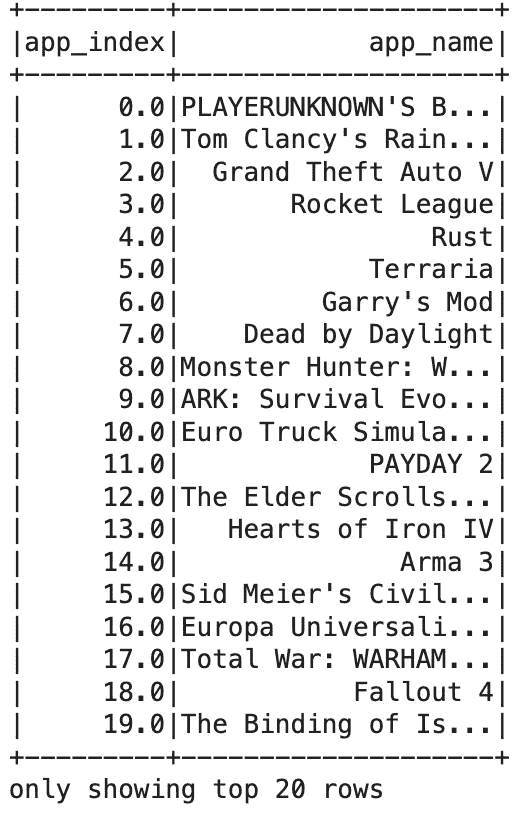

图 16：带有相应索引的游戏列表，供参考。图片来源：作者

***实现 ALS 算法***

```py
# Create an ALS (Alternating Least Squares) model
als = ALS(maxIter=10, regParam=0.01, userCol="app_index", itemCol="author_index", ratingCol="Rating", coldStartStrategy="drop")

# Fit the model to the data
model = als.fit(new_pair)

# Generate recommendations for all items
app_recommendations = model.recommendForAllItems(5)  # Number of recommendations per item

# Display the recommendations
app_recommendations.show(truncate=False)
```

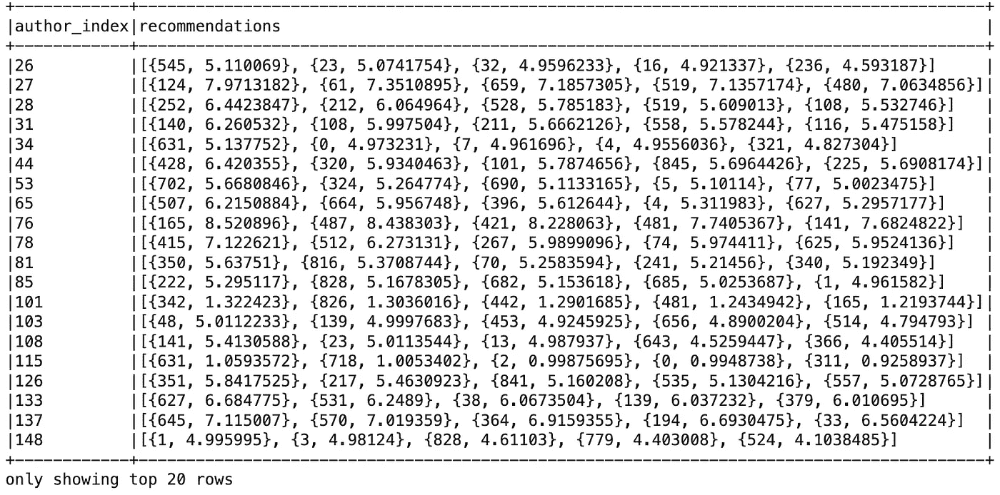

图 17：根据每位作者的游戏历史生成的推荐和评分。图片来源：作者

我们可以交叉匹配图 16 中的索引，以找出每个玩家推荐的游戏。因此，我们使用 Spark Core ML 库实现了一个基础推荐系统。

**3\. e. 结论**

在这个项目中，我们成功实现了以下内容——

+   下载并安装 Hadoop 生态系统——HDFS 和 MapReduce——以高效地存储、访问和提取大数据，并通过个人计算机实现更快速的大数据分析。

+   安装 Apache Spark 的 Python API（PySpark）并将其与 Hadoop 生态系统集成，使我们能够进行大数据分析和一些机器学习操作。

+   游戏和人口统计分析为我们提供了一些见解，可以用来改善游戏体验并控制玩家流失。保持玩家更新并告知他们同行的趋势应该是 Steam 平台的优先事项。像“最受欢迎”、“你所在地区最受欢迎”、“最推荐”和“不要错过这些新游戏”等建议可以保持玩家活跃。

+   Steam 应用可以使用 ALS 推荐系统，根据玩家的个人资料向现有玩家推荐新游戏，并保持他们的参与度和新鲜感。

## 4\. 下一步？

+   在评论列中实现自然语言处理技术，处理不同语言的评论，以提取评论的精髓并改善游戏体验。

+   Steam 可以根据评论报告游戏中的 bug。开发一种能够捕捉评论内容、进行分类并将其发送给相关人员的 AI 算法，将对平台产生巨大帮助。

+   评论告诉我你认为还可以做些什么！

## 5. 参考文献

+   Apache Hadoop. [Apache Hadoop](https://hadoop.apache.org/)。*Apache Hadoop*

+   Statista. (2021). [2010 年至 2020 年全球创建、捕获、复制和消费的数据/信息量，以及 2021 年至 2025 年的预测](https://www.statista.com/statistics/871513/worldwide-data-created/)。*statista*

+   Dey, R. (2023). [大数据和 Hadoop 分布式文件系统（HDFS）初学者指南](https://medium.com/@roshmitadey/a-beginners-guide-to-big-data-and-hadoop-distributed-file-system-hdfs-b5c324d3c722)。*Medium*

+   Code with Arjun (2021). [在 Mac OS（MacBook M1）上安装 Hadoop](https://codewitharjun.medium.com/install-hadoop-on-macos-efe7c860c3ed)。*Medium*

+   Apache Spark. [PySpark 安装指南](https://spark.apache.org/docs/latest/api/python/getting_started/install.html)。*Apache Spark*

+   Apache Spark. [使用 ALS 进行协同过滤](https://spark.apache.org/docs/latest/ml-collaborative-filtering.html)。*Apache Spark*

+   Let’s Uncover it. (2023). [PUBG](https://letsuncoverhistory.blogspot.com/2023/06/History-and-The-Future-of-PubG.html)。*Let’s Uncover It*

> 你可以在我的[GitHub 仓库](https://github.com/Rindhujatreesa/Big_Data_Processing_Projects/tree/main/Steam_Review_Analysis_with_HDFS_%26_PySpark)中找到完整的大数据分析项目。
> 
> 让我们在[LinkedIn](https://www.linkedin.com/in/rindhuja-johnson/)上联系，进一步讨论！
> 
> 如果你觉得这篇文章有用，请点赞、分享并评论！
