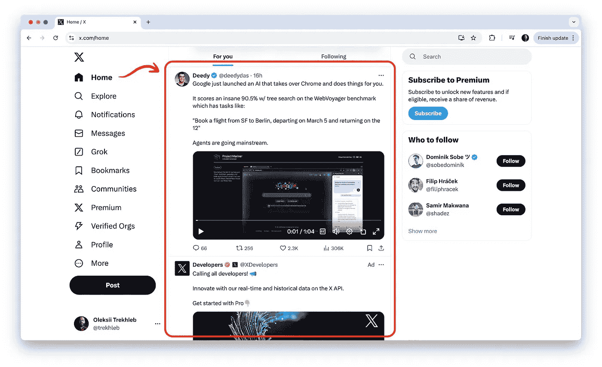
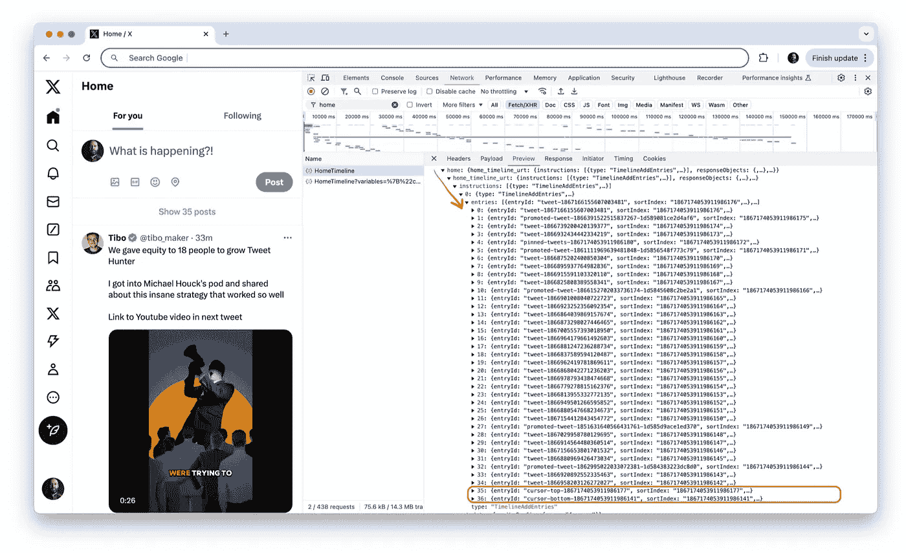
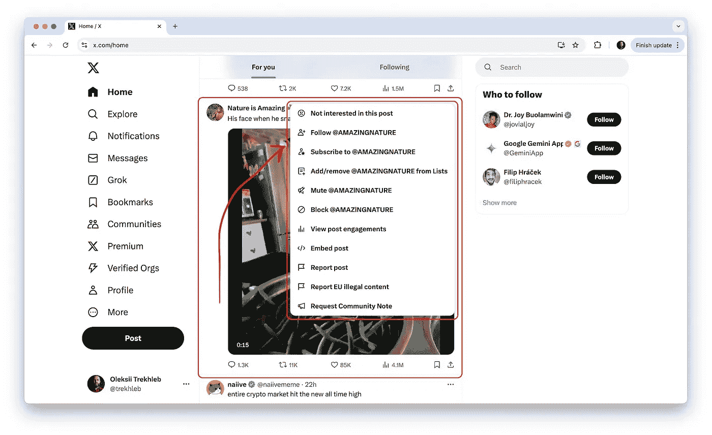

# 如何设计 X（Twitter）首页时间线 API：值得借鉴的经验

> 原文：[`towardsdatascience.com/api-design-of-x-twitter-home-timeline-da426f19edfe?source=collection_archive---------7-----------------------#2024-12-12`](https://towardsdatascience.com/api-design-of-x-twitter-home-timeline-da426f19edfe?source=collection_archive---------7-----------------------#2024-12-12)

## 详细了解 X 的 API：获取数据、链接实体，并解决数据获取不足的问题。

[](https://trekhleb.medium.com/?source=post_page---byline--da426f19edfe--------------------------------)[](https://towardsdatascience.com/?source=post_page---byline--da426f19edfe--------------------------------) [Oleksii Trekhleb](https://trekhleb.medium.com/?source=post_page---byline--da426f19edfe--------------------------------)

·发布于 [Towards Data Science](https://towardsdatascience.com/?source=post_page---byline--da426f19edfe--------------------------------) ·17 分钟阅读·2024 年 12 月 12 日

--


在设计系统的 API 时，软件工程师通常会评估各种方法，如 [REST 与 RPC 与 GraphQL](https://okso.app/showcase/system-design/page/0d03d895-b5b1-40c6-3549-945df9d98dcd)，或者混合模型，以确定最适合特定任务或项目的方法。这些方法定义了数据如何在后端和前端之间流动，以及响应数据的结构：

+   是否应将所有数据打包成一个“批量”，并在一个响应中返回？

+   是否可以配置“批量”仅包含特定客户端（例如，浏览器与移动端）所需的字段，以避免过度获取数据？

+   如果客户端数据获取不足，并需要额外的后端调用来获取缺失的实体，会发生什么情况？

+   应该如何处理父子关系？是否应将子实体嵌套在父实体中，还是应该应用规范化，仅通过父实体引用子实体的 ID，以提高可重用性并减少响应大小？

在本文中，我们探讨了 X（前身为 Twitter）首页时间线 API（x.com/home）如何解决这些挑战，包括：

+   获取推文列表

+   返回层级或关联数据（例如，推文、用户、媒体）

+   对结果进行排序和分页

+   检索推文详情

+   点赞一条推文

我们的重点将放在 API 设计和功能上，将后端视为黑箱，因为其实现无法访问。



X 首页时间线示例

> *在这里展示确切的请求和响应可能会显得繁琐且难以跟随，因为深层嵌套和重复的对象很难阅读。为了更容易查看请求/响应负载结构，我尝试在 TypeScript 中“写出”首页时间线 API。因此，在展示请求/响应示例时，我将使用请求和响应类型，而不是实际的 JSON 对象。此外，请记住，这些类型是简化的，许多属性为了简洁被省略。*
> 
> *您可以在* [*types/x.ts*](https://github.com/trekhleb/trekhleb.github.io/blob/master/src/posts/2024/api-design-x-home-timeline/types/x.ts) *文件中或在本文底部的“附录：所有类型汇总”部分找到所有类型。*
> 
> 除非另有说明，所有图片均来自作者。

# 获取推文列表

# 端点和请求/响应结构

获取首页时间线的推文列表从对以下端点的 `POST` 请求开始：

```py
POST https://x.com/i/api/graphql/{query-id}/HomeTimeline
```

这里是一个简化的请求体类型：

```py
type TimelineRequest = {
  queryId: string; // 's6ERr1UxkxxBx4YundNsXw'
  variables: {
    count: number; // 20
    cursor?: string; // 'DAAACgGBGedb3Vx__9sKAAIZ5g4QENc99AcAAwAAIAIAAA'
    seenTweetIds: string[]; // ['1867041249938530657', '1867041249938530659']
  };
  features: Features;
};

type Features = {
  articles_preview_enabled: boolean;
  view_counts_everywhere_api_enabled: boolean;
  // ...
}
```

这里是一个简化的响应体类型（我们将在下面深入探讨响应子类型）：

```py
type TimelineResponse = {
  data: {
    home: {
      home_timeline_urt: {
        instructions: (TimelineAddEntries | TimelineTerminateTimeline)[];
        responseObjects: {
          feedbackActions: TimelineAction[];
        };
      };
    };
  };
};

type TimelineAddEntries = {
  type: 'TimelineAddEntries';
  entries: (TimelineItem | TimelineCursor | TimelineModule)[];
};

type TimelineItem = {
  entryId: string; // 'tweet-1867041249938530657'
  sortIndex: string; // '1866561576636152411'
  content: {
    __typename: 'TimelineTimelineItem';
    itemContent: TimelineTweet;
    feedbackInfo: {
      feedbackKeys: ActionKey[]; // ['-1378668161']
    };
  };
};

type TimelineTweet = {
  __typename: 'TimelineTweet';
  tweet_results: {
    result: Tweet;
  };
};

type TimelineCursor = {
  entryId: string; // 'cursor-top-1867041249938530657'
  sortIndex: string; // '1866961576813152212'
  content: {
    __typename: 'TimelineTimelineCursor';
    value: string; // 'DACBCgABGedb4VyaJwuKbIIZ40cX3dYwGgaAAwAEAEEAA'
    cursorType: 'Top' | 'Bottom';
  };
};

type ActionKey = string;
```

有趣的是，“获取”数据是通过“POST 请求”完成的，这对于类 REST API 并不常见，但在类似 GraphQL 的 API 中是很常见的。此外，URL 中的`graphql`部分表明 X 正在为其 API 使用 GraphQL 风格。

我在这里使用*“flavor”*这个词，因为请求体本身不像纯粹的[GraphQL 查询](https://graphql.org/learn/queries/)，我们可能会在其中描述所需的响应结构，列出我们想要获取的所有属性：

```py
# An example of a pure GraphQL request structure that is *not* being used in the X API.
{
  tweets {
    id
    description
    created_at
    medias {
      kind
      url
      # ...
    }
    author {
      id
      name
      # ...
    }
    # ...
  }
}
```

这里的假设是，首页时间线 API 不是一个纯粹的 GraphQL API，而是几种方法的混合体。像这样通过 POST 请求传递参数看起来更接近于“功能性”RPC 调用。但与此同时，似乎 GraphQL 的特性可能在后台某个地方被使用在 *HomeTimeline* 端点处理程序/控制器中。像这样的混合可能还与遗留代码或某种正在进行的迁移有关。但再说一次，这些仅仅是我的推测。

您可能还注意到，API URL 和 API 请求体中都使用了相同的`TimelineRequest.queryId`。这个 queryId 很可能是在后台生成的，然后嵌入到 `main.js` 包中，之后在从后台获取数据时使用它。由于 X 的后台对于我们来说是一个黑箱，我很难理解这个 `queryId` 是如何被使用的。但是，再说一次，推测可能是它对于某种性能优化（重用一些预计算的查询结果？）、缓存（与 Apollo 相关？）、调试（通过 queryId 连接日志？）或跟踪/追踪目的来说是必要的。

还需要注意的是，`TimelineResponse` 并不包含推文列表，而是包含一系列指令，例如 *“将一条推文添加到时间线”*（请参见 `TimelineAddEntries` 类型），或 *“终止时间线”*（请参见 `TimelineTerminateTimeline` 类型）。

`TimelineAddEntries` 指令本身也可能包含不同类型的实体：

+   推文 — 请参见 `TimelineItem` 类型

+   游标 — 请参见 `TimelineCursor` 类型

+   对话/评论/线程 — 请参见 `TimelineModule` 类型

```py
type TimelineResponse = {
  data: {
    home: {
      home_timeline_urt: {
        instructions: (TimelineAddEntries | TimelineTerminateTimeline)[]; // <-- Here
        // ...
      };
    };
  };
};

type TimelineAddEntries = {
  type: 'TimelineAddEntries';
  entries: (TimelineItem | TimelineCursor | TimelineModule)[]; // <-- Here
};
```

从可扩展性的角度来看，这一点很有趣，因为它允许在不大幅修改 API 的情况下，渲染更多种类的内容到首页时间线。

# 分页

`TimelineRequest.variables.count` 属性设置我们希望一次获取多少条推文（每页）。默认值是 20。然而，`TimelineAddEntries.entries` 数组中可能会返回超过 20 条推文。例如，数组可能在第一页加载时包含 37 条条目，因为它包括推文（29 条）、置顶推文（1 条）、推广推文（5 条）和分页游标（2 条）。不过，我不确定为什么有 29 条常规推文，而请求的数量是 20 条。

`TimelineRequest.variables.cursor` 负责基于游标的分页。

> *“游标分页最常用于实时数据，因为新记录的添加频繁，并且在读取数据时，通常先看到最新的结果。它消除了跳过项和重复显示相同项的可能性。在基于游标的分页中，使用一个常量指针（或游标）来跟踪下一项应从数据集中哪里获取。”请参见* [*偏移分页与游标分页*](https://stackoverflow.com/questions/55744926/offset-pagination-vs-cursor-pagination) *讨论帖获取相关背景信息。*

在第一次获取推文列表时，`TimelineRequest.variables.cursor` 是空的，因为我们希望从默认的（很可能是预计算的）个性化推文列表中获取顶级推文。

然而，在响应中，除了推文数据，后端还会返回游标条目。以下是响应类型的层级结构：`TimelineResponse → TimelineAddEntries → TimelineCursor`：

```py
type TimelineResponse = {
  data: {
    homet: {
      home_timeline_urt: {
        instructions: (TimelineAddEntries | TimelineTerminateTimeline)[]; // <-- Here
        // ...
      };
    };
  };
};

type TimelineAddEntries = {
  type: 'TimelineAddEntries';
  entries: (TimelineItem | TimelineCursor | TimelineModule)[]; // <-- Here (tweets + cursors)
};

type TimelineCursor = {
  entryId: string;
  sortIndex: string;
  content: {
    __typename: 'TimelineTimelineCursor';
    value: string; // 'DACBCgABGedb4VyaJwuKbIIZ40cX3dYwGgaAAwAEAEEAA' <-- Here
    cursorType: 'Top' | 'Bottom';
  };
};
```

每一页都包含推文列表，以及“顶部”和“底部”游标：



游标与推文一同传递的示例

数据加载后，我们可以从当前页面向两个方向移动，使用“底部”游标获取“之前/更旧”的推文，或使用“顶部”游标获取“下一条/更新”的推文。我猜测，使用“顶部”游标获取“下一条”推文有两种情况：一是当用户仍在浏览当前页面时，新推文已被添加，二是当用户开始向上滚动动态时（如果没有缓存条目，或之前的条目由于性能原因被删除）。

X 的游标本身可能看起来是这样的：`DAABCgABGemI6Mk__9sKAAIZ6MSYG9fQGwgAAwAAAAIAAA`。在一些 API 设计中，游标可能是一个 Base64 编码的字符串，包含列表中最后一项的 ID，或者是最后一项的时间戳。例如：`eyJpZCI6ICIxMjM0NTY3ODkwIn0= --> {"id": "1234567890"}`，然后这些数据会用于相应地查询数据库。在 X API 的情况下，游标看起来像是被 Base64 解码成某种自定义的二进制序列，可能需要进一步解码才能得到有意义的内容（例如，通过 Protobuf 消息定义）。由于我们不知道它是否是`.proto`编码，也不知道`.proto`的消息定义，我们只能假设后端知道如何根据游标字符串查询下一批推文。

`TimelineResponse.variables.seenTweetIds`参数用于通知服务器客户端当前活动页面中已经查看过的推文（来自无限滚动）。这很可能有助于确保服务器在后续的结果页面中不包含重复的推文。

# 链接/层级实体

像主页时间线（或主页动态）这样的 API 面临的挑战之一是如何返回链接或层级实体（即`tweet → user`、`tweet → media`、`media → author`等）：

+   我们是否应该先仅返回推文列表，然后根据需求通过一系列单独的查询获取依赖的实体（如用户详情）？

+   或者我们应该一次性返回所有数据，这样虽然会增加首次加载的时间和大小，但可以节省后续所有调用的时间？

+   在这种情况下，我们是否需要对数据进行规范化，以减少负载大小（即当同一用户是多条推文的作者时，我们希望避免在每个推文实体中重复用户数据）？

+   还是应该是上述方法的组合？

我们来看一下 X 是如何处理的。

在`TimelineTweet`类型中，早些时候使用了`Tweet`子类型。我们来看一下它的样子：

```py
export type TimelineResponse = {
  data: {
    home: {
      home_timeline_urt: {
        instructions: (TimelineAddEntries | TimelineTerminateTimeline)[]; // <-- Here
        // ...
      };
    };
  };
};

type TimelineAddEntries = {
  type: 'TimelineAddEntries';
  entries: (TimelineItem | TimelineCursor | TimelineModule)[]; // <-- Here
};

type TimelineItem = {
  entryId: string;
  sortIndex: string;
  content: {
    __typename: 'TimelineTimelineItem';
    itemContent: TimelineTweet; // <-- Here
    // ...
  };
};

type TimelineTweet = {
  __typename: 'TimelineTweet';
  tweet_results: {
    result: Tweet; // <-- Here
  };
};

// A Tweet entity
type Tweet = {
  __typename: 'Tweet';
  core: {
    user_results: {
      result: User; // <-- Here (a dependent User entity)
    };
  };
  legacy: {
    full_text: string;
    // ...
    entities: { // <-- Here (a dependent Media entities)
      media: Media[];
      hashtags: Hashtag[];
      urls: Url[];
      user_mentions: UserMention[];
    };
  };
};

// A User entity
type User = {
  __typename: 'User';
  id: string; // 'VXNlcjoxNDUxM4ADSG44MTA4NDc4OTc2'
  // ...
  legacy: {
    location: string; // 'San Francisco'
    name: string; //  'John Doe'
    // ...
  };
};

// A Media entity
type Media = {
  // ...
  source_user_id_str: string; // '1867041249938530657'  <-- Here (the dependant user is being mentioned by its ID)
  url: string; // 'https://t.co/X78dBgtrsNU'
  features: {
    large: { faces: FaceGeometry[] };
    medium: { faces: FaceGeometry[] };
    small: { faces: FaceGeometry[] };
    orig: { faces: FaceGeometry[] };
  };
  sizes: {
    large: MediaSize;
    medium: MediaSize;
    small: MediaSize;
    thumb: MediaSize;
  };
  video_info: VideoInfo[];
};
```

这里有趣的是，大部分依赖数据，如`tweet → media`和`tweet → author`，在第一次调用的响应中就已经嵌入（无需后续查询）。

此外，`User`和`Media`与`Tweet`实体的连接并没有进行规范化（如果两条推文有相同的作者，那么它们的数据将在每个推文对象中重复）。但似乎这应该没问题，因为在特定用户的主页时间线范围内，推文会由多位作者创作，数据的重复是可能的，但并不频繁。

我的假设是，负责获取*某一特定用户*推文的 `UserTweets` API（我们在这里不讨论）会以不同的方式处理，但显然并非如此。`UserTweets` 返回相同用户的推文列表，并且为每条推文重复嵌入相同的用户数据。这很有趣，也许这种方法的简单性克服了一些数据大小的开销（也许用户数据的大小被认为相对较小）。我不确定。

关于实体关系的另一个观察是，`Media` 实体也与 `User`（作者）有链接。但它不是通过直接的实体嵌入（像 `Tweet` 实体那样），而是通过 `Media.source_user_id_str` 属性进行链接。

每个主页时间线中“推文”的“评论”（它们本质上也是“推文”）完全没有被获取。要查看推文线程，用户必须点击推文以查看其详细视图。推文线程将通过调用 `TweetDetail` 端点来获取（更多关于它的内容将在下文的“推文详情页面”部分中介绍）。

每个 `Tweet` 还有一个实体是 `FeedbackActions`（即“更少推荐”或“更少查看”）。`FeedbackActions` 在响应对象中的存储方式与 `User` 和 `Media` 对象的存储方式不同。虽然 `User` 和 `Media` 实体是 `Tweet` 的一部分，但 `FeedbackActions` 是单独存储在 `TimelineItem.content.feedbackInfo.feedbackKeys` 数组中的，并通过 `ActionKey` 进行链接。对我来说这是一个小小的惊讶，因为看起来没有任何动作是可以重用的。似乎每个动作仅用于特定的推文。因此，`FeedbackActions` 似乎可以像 `Media` 实体一样嵌入到每个推文中。但我可能忽略了某些隐藏的复杂性（例如每个动作可能有子动作）。

关于动作的更多细节请参见下文的“推文动作”部分。

# 排序

时间线条目的排序顺序由后端通过 `sortIndex` 属性定义：

```py
type TimelineCursor = {
  entryId: string;
  sortIndex: string; // '1866961576813152212' <-- Here
  content: {
    __typename: 'TimelineTimelineCursor';
    value: string;
    cursorType: 'Top' | 'Bottom';
  };
};

type TimelineItem = {
  entryId: string;
  sortIndex: string; // '1866561576636152411' <-- Here
  content: {
    __typename: 'TimelineTimelineItem';
    itemContent: TimelineTweet;
    feedbackInfo: {
      feedbackKeys: ActionKey[];
    };
  };
};

type TimelineModule = {
  entryId: string;
  sortIndex: string; // '73343543020642838441' <-- Here
  content: {
    __typename: 'TimelineTimelineModule';
    items: {
      entryId: string,
      item: TimelineTweet,
    }[],
    displayType: 'VerticalConversation',
  };
};
```

`sortIndex` 本身可能像这样 `'1867231621095096312'`。它可能直接对应或从 [Snowflake ID](https://en.wikipedia.org/wiki/Snowflake_ID) 派生出来。

> *实际上，您在响应中看到的大多数 ID（推文 ID）都遵循“Snowflake ID”规范，并且看起来像是* `*'1867231621095096312'*`*。

如果用来对诸如推文等实体进行排序，系统会利用 Snowflake ID 本身的时间顺序排序。具有较高 `sortIndex` 值（即较新的时间戳）的推文或对象会出现在信息流的更高位置，而具有较低值（即较旧时间戳）的推文则会出现在信息流的较低位置。

这是对 Snowflake ID（在我们这里是 `sortIndex`）`1867231621095096312` 的逐步解码：

+   **提取时间戳：**

+   时间戳通过将 Snowflake ID 右移 22 位（以去掉数据中心、工作者 ID 和序列的低 22 位）得出：`1867231621095096312 → 445182709954`

+   **添加 Twitter 的纪元：**

+   将 Twitter 的自定义纪元（1288834974657）添加到此时间戳中，得到 UNIX 时间戳的毫秒数：`445182709954 + 1288834974657 → 1734017684611ms`

+   **转换为人类可读的日期：**

+   将 UNIX 时间戳转换为 UTC 日期时间：`1734017684611ms → 2024-12-12 15:34:44.611 (UTC)`

因此，我们可以在这里假设，首页时间线中的推文是按时间顺序排序的。

# 推文操作

每条推文都有一个“操作”菜单。



推文操作示例

每条推文的操作来自后台的`TimelineItem.content.feedbackInfo.feedbackKeys`数组，并通过`ActionKey`与推文关联：

```py
type TimelineResponse = {
  data: {
    home: {
      home_timeline_urt: {
        instructions: (TimelineAddEntries | TimelineTerminateTimeline)[];
        responseObjects: {
          feedbackActions: TimelineAction[]; // <-- Here
        };
      };
    };
  };
};

type TimelineItem = {
  entryId: string;
  sortIndex: string;
  content: {
    __typename: 'TimelineTimelineItem';
    itemContent: TimelineTweet;
    feedbackInfo: {
      feedbackKeys: ActionKey[]; // ['-1378668161'] <-- Here
    };
  };
};

type TimelineAction = {
  key: ActionKey; // '-609233128'
  value: {
    feedbackType: 'NotRelevant' | 'DontLike' | 'SeeFewer'; // ...
    prompt: string; // 'This post isn’t relevant' | 'Not interested in this post' | ...
    confirmation: string; // 'Thanks. You’ll see fewer posts like this.'
    childKeys: ActionKey[]; // ['1192182653', '-1427553257'], i.e. NotInterested -> SeeFewer
    feedbackUrl: string; // '/2/timeline/feedback.json?feedback_type=NotRelevant&action_metadata=SRwW6oXZadPHiOczBBaAwPanEwE%3D'
    hasUndoAction: boolean;
    icon: string; // 'Frown'
  };
};
```

有趣的是，这个扁平的操作数组实际上是一个树（或图形？我没检查），因为每个操作可能有子操作（参见`TimelineAction.value.childKeys`数组）。这是有意义的，例如，当用户点击“不要喜欢”操作时，后续可能会显示“此帖子不相关”操作，用以解释用户为什么不喜欢这条推文。

# 推文详情页

一旦用户想查看推文详情页（即查看评论/推文的线程），用户点击推文并发送`GET`请求到以下端点：

```py
GET https://x.com/i/api/graphql/{query-id}/TweetDetail?variables={"focalTweetId":"1867231621095096312","referrer":"home","controller_data":"DACABBSQ","rankingMode":"Relevance","includePromotedContent":true,"withCommunity":true}&features={"articles_preview_enabled":true}
```

我在这里很好奇，为什么推文列表是通过`POST`请求获取的，而每条推文的详情是通过`GET`请求获取的。这似乎不一致。特别是考虑到类似`query-id`、`features`等查询参数这次是通过 URL 传递的，而不是通过请求体传递的。响应格式也类似，并且重用了列表调用中的类型。我不确定为什么会这样。但再次强调，我肯定可能会错过一些背景复杂性。

这里是简化后的响应体类型：

```py
type TweetDetailResponse = {
  data: {
    threaded_conversation_with_injections_v2: {
      instructions: (TimelineAddEntries | TimelineTerminateTimeline)[],
    },
  },
}

type TimelineAddEntries = {
  type: 'TimelineAddEntries';
  entries: (TimelineItem | TimelineCursor | TimelineModule)[];
};

type TimelineTerminateTimeline = {
  type: 'TimelineTerminateTimeline',
  direction: 'Top',
}

type TimelineModule = {
  entryId: string; // 'conversationthread-58668734545929871193'
  sortIndex: string; // '1867231621095096312'
  content: {
    __typename: 'TimelineTimelineModule';
    items: {
      entryId: string, // 'conversationthread-1866876425669871193-tweet-1866876038930951193'
      item: TimelineTweet,
    }[], // Comments to the tweets are also tweets
    displayType: 'VerticalConversation',
  };
};
```

响应在类型上与列表响应非常相似，因此我们不会在这里停留太久。

一个有趣的细节是，每条推文的“评论”（或对话）实际上是其他推文（参见`TimelineModule`类型）。因此，推文线程看起来与首页时间线的推送非常相似，通过显示`TimelineTweet`条目的列表来呈现。这看起来非常优雅。一个很好的例子，展示了 API 设计中通用且可复用的方法。

# 点赞推文

当用户点赞推文时，会向以下端点发送`POST`请求：

```py
POST https://x.com/i/api/graphql/{query-id}/FavoriteTweet
```

这里是请求体类型：

```py
type FavoriteTweetRequest = {
  variables: {
    tweet_id: string; // '1867041249938530657'
  };
  queryId: string; // 'lI07N61twFgted2EgXILM7A'
};
```

这里是响应体类型：

```py
type FavoriteTweetResponse = {
  data: {
    favorite_tweet: 'Done',
  }
}
```

看起来很直接，也类似于 RPC 风格的 API 设计方法。

# 结论

我们通过查看 X 的 API 示例，已经涉及了一些家庭时间线 API 设计的基本部分。在这个过程中，我尽量根据我的知识做出了一些假设。我相信我可能有一些地方理解得不准确，也可能错过了一些复杂的细微差别。但即便如此，我希望你能从这份高层次的概述中获得一些有用的见解，这些见解可以应用到你下次的 API 设计会议中。

起初，我计划通过浏览一些顶级技术网站，获取来自 Facebook、Reddit、YouTube 等的见解，并收集经过实践验证的最佳做法和解决方案。我不确定是否能找到时间去做这件事。到时再看看。但这可能是一个有趣的练习。

# 附录：所有类型汇总

作为参考，我在这里一次性添加了所有类型。你也可以在[types/x.ts](https://github.com/trekhleb/trekhleb.github.io/blob/master/src/posts/2024/api-design-x-home-timeline/types/x.ts)文件中找到所有类型。

```py
/**
 * This file contains the simplified types for X's (Twitter's) home timeline API.
 *
 * These types are created for exploratory purposes, to see the current implementation
 * of the X's API, to see how they fetch Home Feed, how they do a pagination and sorting,
 * and how they pass the hierarchical entities (posts, media, user info, etc).
 *
 * Many properties and types are omitted for simplicity.
 */

// POST https://x.com/i/api/graphql/{query-id}/HomeTimeline
export type TimelineRequest = {
  queryId: string; // 's6ERr1UxkxxBx4YundNsXw'
  variables: {
    count: number; // 20
    cursor?: string; // 'DAAACgGBGedb3Vx__9sKAAIZ5g4QENc99AcAAwAAIAIAAA'
    seenTweetIds: string[]; // ['1867041249938530657', '1867041249938530658']
  };
  features: Features;
};

// POST https://x.com/i/api/graphql/{query-id}/HomeTimeline
export type TimelineResponse = {
  data: {
    home: {
      home_timeline_urt: {
        instructions: (TimelineAddEntries | TimelineTerminateTimeline)[];
        responseObjects: {
          feedbackActions: TimelineAction[];
        };
      };
    };
  };
};

// POST https://x.com/i/api/graphql/{query-id}/FavoriteTweet
export type FavoriteTweetRequest = {
  variables: {
    tweet_id: string; // '1867041249938530657'
  };
  queryId: string; // 'lI07N6OtwFgted2EgXILM7A'
};

// POST https://x.com/i/api/graphql/{query-id}/FavoriteTweet
export type FavoriteTweetResponse = {
  data: {
    favorite_tweet: 'Done',
  }
}

// GET https://x.com/i/api/graphql/{query-id}/TweetDetail?variables={"focalTweetId":"1867041249938530657","referrer":"home","controller_data":"DACABBSQ","rankingMode":"Relevance","includePromotedContent":true,"withCommunity":true}&features={"articles_preview_enabled":true}
export type TweetDetailResponse = {
  data: {
    threaded_conversation_with_injections_v2: {
      instructions: (TimelineAddEntries | TimelineTerminateTimeline)[],
    },
  },
}

type Features = {
  articles_preview_enabled: boolean;
  view_counts_everywhere_api_enabled: boolean;
  // ...
}

type TimelineAction = {
  key: ActionKey; // '-609233128'
  value: {
    feedbackType: 'NotRelevant' | 'DontLike' | 'SeeFewer'; // ...
    prompt: string; // 'This post isn’t relevant' | 'Not interested in this post' | ...
    confirmation: string; // 'Thanks. You’ll see fewer posts like this.'
    childKeys: ActionKey[]; // ['1192182653', '-1427553257'], i.e. NotInterested -> SeeFewer
    feedbackUrl: string; // '/2/timeline/feedback.json?feedback_type=NotRelevant&action_metadata=SRwW6oXZadPHiOczBBaAwPanEwE%3D'
    hasUndoAction: boolean;
    icon: string; // 'Frown'
  };
};

type TimelineAddEntries = {
  type: 'TimelineAddEntries';
  entries: (TimelineItem | TimelineCursor | TimelineModule)[];
};

type TimelineTerminateTimeline = {
  type: 'TimelineTerminateTimeline',
  direction: 'Top',
}

type TimelineCursor = {
  entryId: string; // 'cursor-top-1867041249938530657'
  sortIndex: string; // '1867231621095096312'
  content: {
    __typename: 'TimelineTimelineCursor';
    value: string; // 'DACBCgABGedb4VyaJwuKbIIZ40cX3dYwGgaAAwAEAEEAA'
    cursorType: 'Top' | 'Bottom';
  };
};

type TimelineItem = {
  entryId: string; // 'tweet-1867041249938530657'
  sortIndex: string; // '1867231621095096312'
  content: {
    __typename: 'TimelineTimelineItem';
    itemContent: TimelineTweet;
    feedbackInfo: {
      feedbackKeys: ActionKey[]; // ['-1378668161']
    };
  };
};

type TimelineModule = {
  entryId: string; // 'conversationthread-1867041249938530657'
  sortIndex: string; // '1867231621095096312'
  content: {
    __typename: 'TimelineTimelineModule';
    items: {
      entryId: string, // 'conversationthread-1867041249938530657-tweet-1867041249938530657'
      item: TimelineTweet,
    }[], // Comments to the tweets are also tweets
    displayType: 'VerticalConversation',
  };
};

type TimelineTweet = {
  __typename: 'TimelineTweet';
  tweet_results: {
    result: Tweet;
  };
};

type Tweet = {
  __typename: 'Tweet';
  core: {
    user_results: {
      result: User;
    };
  };
  views: {
    count: string; // '13763'
  };
  legacy: {
    bookmark_count: number; // 358
    created_at: string; // 'Tue Dec 10 17:41:28 +0000 2024'
    conversation_id_str: string; // '1867041249938530657'
    display_text_range: number[]; // [0, 58]
    favorite_count: number; // 151
    full_text: string; //  "How I'd promote my startup, if I had 0 followers (Part 1)"
    lang: string; // 'en'
    quote_count: number;
    reply_count: number;
    retweet_count: number;
    user_id_str: string; // '1867041249938530657'
    id_str: string; // '1867041249938530657'
    entities: {
      media: Media[];
      hashtags: Hashtag[];
      urls: Url[];
      user_mentions: UserMention[];
    };
  };
};

type User = {
  __typename: 'User';
  id: string; // 'VXNlcjoxNDUxM4ADSG44MTA4NDc4OTc2'
  rest_id: string; // '1867041249938530657'
  is_blue_verified: boolean;
  profile_image_shape: 'Circle'; // ...
  legacy: {
    following: boolean;
    created_at: string; // 'Thu Oct 21 09:30:37 +0000 2021'
    description: string; // 'I help startup founders double their MRR with outside-the-box marketing cheat sheets'
    favourites_count: number; // 22195
    followers_count: number; // 25658
    friends_count: number;
    location: string; // 'San Francisco'
    media_count: number;
    name: string; //  'John Doe'
    profile_banner_url: string; // 'https://pbs.twimg.com/profile_banners/4863509452891265813/4863509'
    profile_image_url_https: string; // 'https://pbs.twimg.com/profile_images/4863509452891265813/4863509_normal.jpg'
    screen_name: string; // 'johndoe'
    url: string; // 'https://t.co/dgTEddFGDd'
    verified: boolean;
  };
};

type Media = {
  display_url: string; // 'pic.x.com/X7823zS3sNU'
  expanded_url: string; // 'https://x.com/johndoe/status/1867041249938530657/video/1'
  ext_alt_text: string; // 'Image of two bridges.'
  id_str: string; // '1867041249938530657'
  indices: number[]; // [93, 116]
  media_key: string; // '13_2866509231399826944'
  media_url_https: string; // 'https://pbs.twimg.com/profile_images/1867041249938530657/4863509_normal.jpg'
  source_status_id_str: string; // '1867041249938530657'
  source_user_id_str: string; // '1867041249938530657'
  type: string; // 'video'
  url: string; // 'https://t.co/X78dBgtrsNU'
  features: {
    large: { faces: FaceGeometry[] };
    medium: { faces: FaceGeometry[] };
    small: { faces: FaceGeometry[] };
    orig: { faces: FaceGeometry[] };
  };
  sizes: {
    large: MediaSize;
    medium: MediaSize;
    small: MediaSize;
    thumb: MediaSize;
  };
  video_info: VideoInfo[];
};

type UserMention = {
  id_str: string; // '98008038'
  name: string; // 'Yann LeCun'
  screen_name: string; // 'ylecun'
  indices: number[]; // [115, 122]
};

type Hashtag = {
  indices: number[]; // [257, 263]
  text: string;
};

type Url = {
  display_url: string; // 'google.com'
  expanded_url: string; // 'http://google.com'
  url: string; // 'https://t.co/nZh3aF0Aw6'
  indices: number[]; // [102, 125]
};

type VideoInfo = {
  aspect_ratio: number[]; // [427, 240]
  duration_millis: number; // 20000
  variants: {
    bitrate?: number; // 288000
    content_type?: string; // 'application/x-mpegURL' | 'video/mp4' | ...
    url: string; // 'https://video.twimg.com/amplify_video/18665094345456w6944/pl/-ItQau_LRWedR-W7.m3u8?tag=14'
  };
};

type FaceGeometry = { x: number; y: number; h: number; w: number };

type MediaSize = { h: number; w: number; resize: 'fit' | 'crop' };

type ActionKey = string;
```
