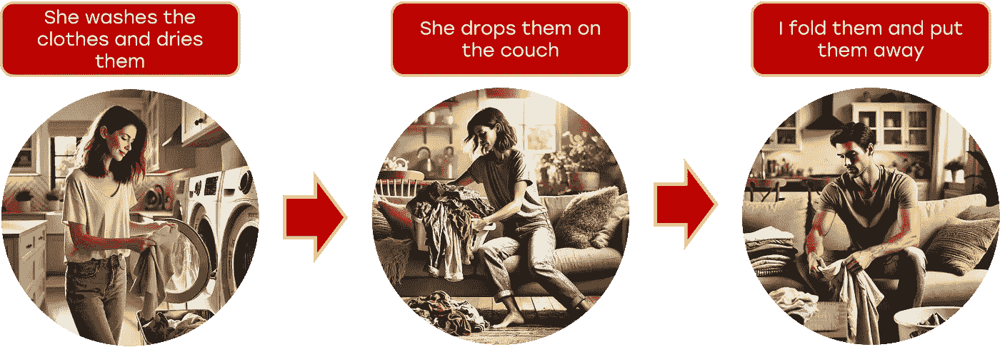
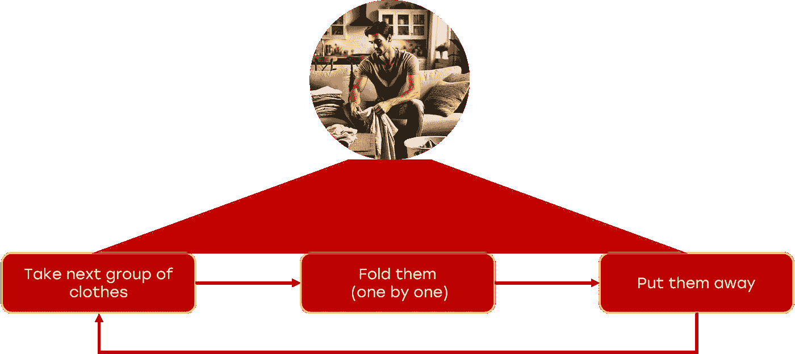
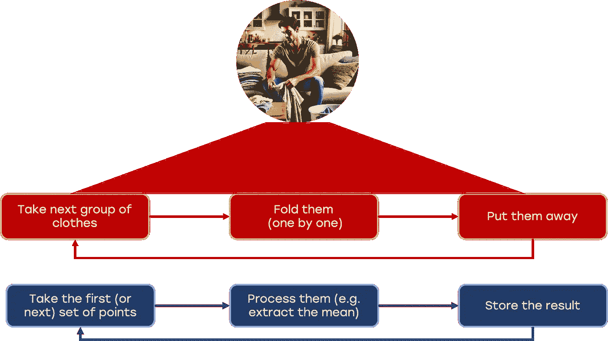

# 滚动窗口在时间序列中的应用，使用 Python

> 原文：[`towardsdatascience.com/applications-of-rolling-windows-for-time-series-with-python-1a4bbe44901d?source=collection_archive---------0-----------------------#2024-09-15`](https://towardsdatascience.com/applications-of-rolling-windows-for-time-series-with-python-1a4bbe44901d?source=collection_archive---------0-----------------------#2024-09-15)

## 这是滚动窗口和时间序列的一些强大应用

 [Piero Paialunga](https://piero-paialunga.medium.com/?source=post_page---byline--1a4bbe44901d--------------------------------)

·发表于[Towards Data Science](https://towardsdatascience.com/?source=post_page---byline--1a4bbe44901d--------------------------------) ·11 分钟阅读·2024 年 9 月 15 日

--

图片由[Claudia Aran](https://unsplash.com/@claudia_aran?utm_content=creditCopyText&utm_medium=referral&utm_source=unsplash)提供，来源于[Unsplash](https://unsplash.com/photos/water-drops-on-glass-window-L52QsKeNq40?utm_content=creditCopyText&utm_medium=referral&utm_source=unsplash)

昨晚我和妻子一起做**洗衣**。我们有一个*非言语*的约定（不过当我违反它时，它会变得相当*言语化*）：关于洗衣的事情，**她**负责把衣服放进**洗衣机**和**干衣机**，而**我**则负责**折叠**衣服。

我们通常是这样做的：

图像由作者使用 DALLE 制作

现在，我**并不是真的**折叠所有衣服并把它们收好。否则，我会被衣服淹没。我做的事情是一种让我想起**滚动窗口**方法的方式：

图像由作者使用 DALLE 制作

为什么我说它让我想起**滚动窗口**？让我们看看这个类比。

图像由作者使用 DALLE 制作

**滚动窗口**的概念正是我在折叠衣服时应用的那个方法。我有一个任务要做，但你…
